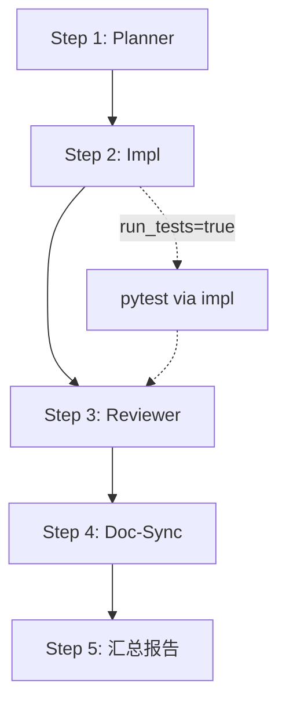

# API Dev Orchestrator Skill

## 1. Skill 概要

本 Skill 的唯一职责：

> 帮用户把 API 开发需求转换成 **规范、可执行、可复盘的 API 开发流水线**，
> 包含：开发计划 → 代码实现 → SoT 审查 → 文档同步 → 完成报告。

**本 Skill 不直接生成或修改项目代码文件**，所有实际变更通过调用子 skill 完成：

| 子 Skill | 版本 | 职责 |
|----------|------|------|
| `api-dev-planner` | v1.0.1 | 生成开发计划 |
| `api-dev-impl` | v1.0 | 执行代码实现 + 运行测试 |
| `api-dev-reviewer` | v1.1 | SoT 合规审查 |
| `api-dev-doc-sync` | v1.0 | 文档同步建议 + OpenSpec 提示 |

---

## 2. 适用场景（何时使用本 Skill）

当满足以下任一条件时，应优先考虑使用本 Skill：

- 用户显式提到：
  - "开发一个新 API"
  - "修改 / 优化 xxx API"
  - "修复 xxx API 的 bug"
  - "帮我走一遍 API 开发流程"
- 用户目标涉及：
  - 新增 API 端点（mode=feature）
  - 修改现有端点（mode=feature/refactor）
  - 修复 API Bug（mode=bugfix）
- 用户希望：
  - 遵循 API_DEVELOPMENT_FLOW v2.3 的 6 步流程
  - 自动化执行开发 → 测试 → 审查 → 文档同步流水线

---

## 3. 禁用场景（不要使用本 Skill）

出现以下情况时，不要使用本 Skill：

- 用户只是想了解 API 设计方案，不需要实际开发
- 用户要求直接手写代码，不走流水线
- 用户仅需要运行测试（应使用 `ai-ad-agents-test-orchestrator`）
- 用户仅需要文档生成（应使用 `ai-ad-doc-orchestrator`）
- 任务与 API 开发无关（前端组件、纯文档、配置等）

---

## 4. SoT 文档依赖

本 Skill 的所有决策必须遵守以下 SoT 文档（只读）：

| 文档 | 版本 | 路径 | 用途 |
|------|------|------|------|
| `AI_CODE_DEV_ORCHESTRATION_SOT` | v1.0 | `docs/2.sot/` | 编排规范、I/O 契约 |
| `API_DEVELOPMENT_FLOW` | v2.3 | `docs/3.dev-guides/` | API 开发 6 步流程、不可变量检查 |
| `API_SOT` | v9.0 | `docs/2.sot/` | API 端点规范、路径命名、响应码 |
| `STATE_MACHINE` | v2.6 | `docs/2.sot/` | 8 状态机定义 |
| `DATA_SCHEMA` | v5.2 | `docs/2.sot/` | 数据模型字段定义 |
| `BUSINESS_RULES` | v3.1 | `docs/2.sot/` | 业务规则编号（BR-XXX-NNN） |
| `ERROR_CODES_SOT` | v2.1 | `docs/2.sot/` | 错误码定义 |
| `AUTH_SPEC` | v2.0 | `docs/2.sot/` | 权限模型 |

**SoT 裁判链优先级**：
```
STATE_MACHINE.md v2.6 → DATA_SCHEMA.md v5.2 → BUSINESS_RULES.md v3.1
→ API_SOT.md v9.0 → ERROR_CODES_SOT.md v2.1 → AUTH_SPEC.md v2.0
```

---

## 5. 输入契约

### 5.1 输入 JSON 结构

```json
{
  "change_type": "schema+router",
  "mode": "impl+test",
  "module": "finance_profit",
  "endpoint": "GET /api/v1/finance/profit/summary",
  "description": "为 finance_profit 模块新增利润查询 API，支持按项目和时间范围查询",
  "constraints": {
    "auth_required": true,
    "permission": "finance:read",
    "affects_ledger": false
  },
  "auto_write": false,
  "run_tests": true
}
```

### 5.2 字段说明

| 字段 | 类型 | 必填 | 默认值 | 说明 |
|------|------|------|--------|------|
| `change_type` | enum | ✅ | - | 变更类型（见 §5.3） |
| `mode` | enum | ❌ | `impl+test` | 执行模式（见 §5.4） |
| `module` | enum | ✅ | - | 目标模块名（见 §5.5） |
| `endpoint` | string | ❌ | - | 目标端点（如 `GET /api/v1/xxx`） |
| `description` | string | ✅ | - | 自然语言需求描述 |
| `constraints` | object | ❌ | `{}` | 额外约束条件 |
| `auto_write` | bool | ❌ | `false` | 是否自动写入文件 |
| `run_tests` | bool | ❌ | `true` | 是否运行测试 |

### 5.3 change_type 枚举（变更类型）

> **权威定义**：以下枚举为 v1.2.0 唯一有效值，禁止使用未列出的值。

| change_type | 约束级别 | 说明 | 典型场景 |
|-------------|----------|------|---------|
| `schema` | ✅ 强制 | 仅改 Pydantic schema / DTO | 新增/修改请求响应模型 |
| `router` | ✅ 强制 | 仅改 FastAPI router 层 | 修改端点路径、参数 |
| `schema+router` | ✅ 强制 | 同时改 schema + router | 大多数 API 修改场景 |
| `tests` | ✅ 强制 | 仅改/补测试 | 补充测试覆盖 |
| `full_feature` | ✅ 强制 | 新增/大改功能（schema + router + service + tests） | 全新功能开发 |
| `bugfix` | ✅ 强制 | 修复缺陷（尽量不扩 schema） | Bug 修复 |

**派生规则**（与子 Skill 兼容）：

```python
def derive_api_change_type(change_type: str, mode: str) -> str:
    """派生 impl v1.0 兼容的 api_change_type"""
    mapping = {
        "full_feature": "new_endpoint",
        "schema+router": "modify_endpoint",
        "schema": "modify_endpoint",
        "router": "modify_endpoint",
        "bugfix": "bugfix",
        "tests": "test_supplement"
    }
    return mapping.get(change_type, "modify_endpoint")
```

### 5.4 mode 枚举（执行模式）

| mode | 说明 | 输出内容 | 推荐场景 |
|------|------|---------|---------|
| `plan` | 只生成计划（不动代码） | 计划 JSON + 文件列表 | 方案确认 |
| `impl` | 代码实现（可选 auto_write） | 代码片段 + 实现报告 | 快速实现 |
| `impl+test` | 代码 + 测试（**推荐默认**） | 代码 + 测试 + pytest 结果 | 标准开发流程 |
| `refactor` | 纯重构（不改业务行为） | 重构报告 + 回归测试建议 | 代码优化 |

### 5.5 module 枚举（目标模块）

> **来源**：API_SOT.md v9.0 + 现有 router/test 文件

| module | Router 文件 | SoT 章节 | 状态机 | 说明 |
|--------|------------|---------|--------|------|
| `daily_reports` | `daily_reports.py` | API_SOT §9 | 8-state | 日报管理 |
| `topup_requests` | `topup.py` | API_SOT §10 | 7-state | 充值申请 |
| `ledger` | `ledger.py` | API_SOT §11 | - | 资金账本 |
| `reconciliation` | `reconciliation.py` | API_SOT §12 | 5-state | 对账管理 |
| `ad_accounts` | `ad_accounts.py` | API_SOT §8 | ad_accounts.status | 广告账户 |
| `projects` | `projects.py` | API_SOT §6 | projects.status | 项目管理 |
| `channels` | `channels.py` | API_SOT §7 | - | 渠道管理 |
| `transfers` | `transfers.py` | - | - | 转账管理 |
| `finance_profit` | `finance_profit.py` | - | - | 利润分析 |
| `suppliers` | `suppliers.py` | - | - | 供应商管理 |
| `settlements` | `settlements.py` | - | - | 结算管理 |
| `trend_risk` | (daily_reports 子域) | - | - | 趋势风控 |
| `auth` | `authentication.py`, `supabase_auth.py` | API_SOT §5 | - | 认证授权 |

**约束**：module 必须来自上表，否则输出 `<halt>Invalid: module must be one of [...]</halt>`

### 5.6 旧版兼容说明

v1.0/v1.1 使用 `api_change_type`（new_endpoint/modify_endpoint/bugfix），v1.2 不再使用此字段。

**内部映射规则**（仅供兼容参考，不作为输入字段）：

| 旧字段 api_change_type | 新字段组合 |
|------------------------|------------|
| `new_endpoint` | `change_type=full_feature`, `mode=impl+test` |
| `modify_endpoint` | `change_type=schema+router`, `mode=impl+test` |
| `bugfix` | `change_type=bugfix`, `mode=impl+test` |

---

## 6. 子 Skill 调用契约

### 6.1 调用 api-dev-planner v1.0.1

**输入**：

```json
{
  "change_type": "api",
  "mode": "feature",
  "module": "finance_profit",
  "endpoint": "GET /api/v1/finance/profit/summary",
  "description": "为 finance_profit 模块新增利润查询 API",
  "constraints": {
    "auth_required": true,
    "permission": "finance:read"
  }
}
```

**输出**：

```json
{
  "module": "finance_profit",
  "change_type": "api",
  "mode": "feature",
  "affected_endpoints": [
    { "method": "GET", "path": "/api/v1/finance/profit/summary", "reason": "..." }
  ],
  "files_to_touch": [
    "backend/schemas/finance_profit.py",
    "backend/services/finance_profit_service.py",
    "backend/routers/finance_profit.py",
    "tests/api/test_finance_profit.py"
  ],
  "dev_steps": [
    { "step": 1, "phase": "sot_review", "action": "查阅相关 SoT 文档", "file": null, "sot_ref": "..." },
    { "step": 2, "phase": "schema", "action": "定义 Pydantic Schema", "file": "...", "sot_ref": "..." }
  ],
  "review_checklist": [
    { "id": "C1", "name": "Envelope 响应格式", "applicable": true },
    { "id": "C3", "name": "INV-001: 账务只追加", "applicable": false, "na_reason": "不涉及账本" }
  ],
  "need_openspec": false,
  "openspec_reason": "",
  "sot_references": [
    { "doc": "API_SOT.md", "version": "v9.0", "section": "Section 3.2" }
  ],
  "risks_and_todos": []
}
```

### 6.2 调用 api-dev-impl v1.0

**输入**：

```json
{
  "api_change_type": "new_endpoint",
  "module": "finance_profit",
  "description": "为 finance_profit 模块新增利润查询 API",
  "plan": {
    "files_to_touch": ["..."],
    "dev_steps": ["..."],
    "review_checklist": ["..."]
  },
  "auto_write": false,
  "run_tests": true,
  "pytest_path": "backend/tests/api"
}
```

> **注意**：impl v1.0 仍使用 `api_change_type`。orchestrator 需要根据 `change_type` + `mode` 派生此字段。

**内部派生规则**：

```python
def derive_api_change_type(change_type: str, mode: str, endpoint: str, files_to_touch: list) -> str:
    if change_type == "api_test":
        return "test_supplement"
    if mode == "bugfix":
        return "bugfix"
    if mode == "refactor":
        return "refactor"
    # 判断是否新增端点
    router_files = [f for f in files_to_touch if "routers/" in f]
    if any(f.endswith(".py") and "created" in action_for_file(f) for f in router_files):
        return "new_endpoint"
    return "modify_endpoint"
```

**输出**：

```json
{
  "files_changed": [
    { "path": "backend/schemas/finance_profit.py", "action": "created" },
    { "path": "backend/services/finance_profit_service.py", "action": "created" }
  ],
  "code_summary": "Created 3 files, modified 1 file",
  "warnings": ["Consider adding pagination for large result sets"],
  "endpoints_added": ["GET /api/v1/finance/profit/summary"],
  "endpoints_modified": [],
  "error_codes_used": ["BIZ_301", "VALIDATION_001"],
  "permissions_used": ["finance:read"],
  "pytest_summary": {
    "executed": true,
    "passed": 10,
    "failed": 0,
    "errors": 0,
    "skipped": 1,
    "duration": "2.3s",
    "failure_details": []
  }
}
```

### 6.3 调用 api-dev-reviewer v1.1

**输入**：

```json
{
  "module": "finance_profit",
  "change_type": "api",
  "description": "为 finance_profit 模块新增利润查询 API",
  "plan": {
    "files_to_touch": ["..."],
    "dev_steps": ["..."],
    "review_checklist": ["..."]
  },
  "files_changed": [
    { "path": "backend/schemas/finance_profit.py", "action": "created", "diff_summary": "..." }
  ],
  "pytest_summary": {
    "executed": true,
    "passed": 10,
    "failed": 0,
    "errors": 0
  },
  "openspec_context": {
    "has_proposal": false,
    "proposal_id": null
  }
}
```

**输出**：

```json
{
  "module": "finance_profit",
  "status": "pass",
  "p0_issues": [],
  "p1_issues": [],
  "p2_issues": [
    { "id": "P2-001", "category": "doc_missing", "message": "建议为 schema 添加字段注释" }
  ],
  "review_summary": "审查通过，无阻塞问题。",
  "recommend_deploy": true,
  "requires_openspec": false,
  "review_version": "ai-ad-api-dev-reviewer v1.1"
}
```

### 6.4 调用 api-dev-doc-sync v1.0

**输入**：

```json
{
  "module": "finance_profit",
  "change_type": "api",
  "description": "为 finance_profit 模块新增利润查询 API",
  "plan": {
    "files_to_touch": ["..."],
    "dev_steps": ["..."],
    "need_openspec": false
  },
  "impl_result": {
    "files_changed": ["..."],
    "endpoints_added": ["GET /api/v1/finance/profit/summary"],
    "error_codes_used": ["BIZ_301"],
    "permissions_used": ["finance:read"],
    "pytest_summary": { "executed": true, "passed": 10, "failed": 0 }
  },
  "review_result": {
    "status": "pass",
    "p0_issues": [],
    "p1_issues": [],
    "recommend_deploy": true,
    "requires_openspec": false
  }
}
```

**输出**：

```json
{
  "module": "finance_profit",
  "change_type": "api",
  "docs_to_update": [
    {
      "path": "docs/2.sot/API_SOT.md",
      "reason": "新增 GET /api/v1/finance/profit/summary 接口",
      "sot_ref": "API_DEVELOPMENT_FLOW.md v2.3 §3.7",
      "suggested_changes": ["在 Finance Profit 模块章节增加端点描述"],
      "priority": "P1"
    }
  ],
  "openspec": {
    "required": true,
    "reason": "新增 API 端点必须创建 OpenSpec Proposal",
    "reviewer_agrees": false,
    "has_existing_proposal": false,
    "suggested_change_id": "add-finance-profit-summary",
    "suggested_items": ["创建 openspec/changes/add-finance-profit-summary/proposal.md"]
  },
  "audit": {
    "doc_desync_risk": "medium",
    "missing_docs": ["API_SOT.md 缺少新端点描述"],
    "notes": "建议先完成 OpenSpec proposal 审批"
  },
  "next_steps": [
    { "order": 1, "action": "创建 OpenSpec proposal", "blocking": true },
    { "order": 2, "action": "更新 API_SOT.md", "blocking": false }
  ],
  "doc_sync_version": "ai-ad-api-dev-doc-sync v1.0"
}
```

---

## 7. 执行流程（4 步流水线）

### 7.1 流程概览



### 7.2 Step 1: 调用 api-dev-planner

**目的**：生成开发计划，包含文件列表、开发步骤、审查清单。

```python
planner_input = {
    "change_type": input.change_type,
    "mode": input.mode or "feature",
    "module": input.module,
    "endpoint": input.endpoint,
    "description": input.description,
    "constraints": input.constraints or {}
}
planner_result = call_skill("api-dev-planner", planner_input)
```

### 7.3 Step 2: 调用 api-dev-impl

**目的**：基于计划执行具体实现，并运行测试。

```python
# 派生 api_change_type（impl v1.0 兼容）
api_change_type = derive_api_change_type(
    change_type=input.change_type,
    mode=input.mode,
    endpoint=input.endpoint,
    files_to_touch=planner_result.files_to_touch
)

impl_input = {
    "api_change_type": api_change_type,
    "module": input.module,
    "description": input.description,
    "plan": {
        "files_to_touch": planner_result.files_to_touch,
        "dev_steps": planner_result.dev_steps,
        "review_checklist": planner_result.review_checklist
    },
    "auto_write": input.auto_write or False,
    "run_tests": input.run_tests if input.run_tests is not None else True,
    "pytest_path": "backend/tests/api"
}
impl_result = call_skill("api-dev-impl", impl_input)
```

**测试职责说明**：

- `run_tests` 参数传递给 impl Skill
- impl 负责在实现后调用 pytest 并返回 `pytest_summary`
- **orchestrator 不再直接调用 `ap_run_pytest`**，避免重复调用

### 7.4 Step 3: 调用 api-dev-reviewer

**目的**：对代码改动进行 SoT 合规审查。

```python
reviewer_input = {
    "module": input.module,
    "change_type": input.change_type,
    "description": input.description,
    "plan": {
        "files_to_touch": planner_result.files_to_touch,
        "dev_steps": planner_result.dev_steps,
        "review_checklist": planner_result.review_checklist
    },
    "files_changed": impl_result.files_changed,
    "pytest_summary": impl_result.pytest_summary,
    "openspec_context": {
        "has_proposal": False,  # 可从上下文获取
        "proposal_id": None
    }
}
review_result = call_skill("api-dev-reviewer", reviewer_input)
```

### 7.5 Step 4: 调用 api-dev-doc-sync

**目的**：生成文档同步建议和 OpenSpec 操作提示。

```python
doc_sync_input = {
    "module": input.module,
    "change_type": input.change_type,
    "description": input.description,
    "plan": {
        "files_to_touch": planner_result.files_to_touch,
        "dev_steps": planner_result.dev_steps,
        "need_openspec": planner_result.need_openspec,
        "sot_references": planner_result.sot_references
    },
    "impl_result": {
        "files_changed": impl_result.files_changed,
        "endpoints_added": impl_result.endpoints_added or [],
        "endpoints_modified": impl_result.endpoints_modified or [],
        "error_codes_used": impl_result.error_codes_used or [],
        "permissions_used": impl_result.permissions_used or [],
        "pytest_summary": impl_result.pytest_summary
    },
    "review_result": {
        "status": review_result.status,
        "p0_issues": review_result.p0_issues,
        "p1_issues": review_result.p1_issues,
        "p2_issues": review_result.p2_issues,
        "recommend_deploy": review_result.recommend_deploy,
        "requires_openspec": review_result.requires_openspec
    }
}
doc_sync_result = call_skill("api-dev-doc-sync", doc_sync_input)
```

### 7.6 Step 5: 汇总报告

**目的**：输出 JSON 格式的统一开发报告 + 可选的 Markdown 人类可读摘要。

---

## 8. 输出契约

### 8.1 输出 JSON 结构（机器可读）

> **重要**：这是下游 Agent/自动化流程 **唯一应解析的结构化数据**。

```json
{
  "run_id": "orch-20251206-001",
  "timestamp": "2025-12-06T10:30:00Z",
  "module": "finance_profit",
  "change_type": "api",
  "mode": "feature",
  "endpoint": "GET /api/v1/finance/profit/summary",
  "auto_write": false,
  "run_tests": true,
  "plan": {
    "files_to_touch": ["backend/schemas/...", "backend/services/...", "..."],
    "dev_steps_count": 6,
    "need_openspec": false,
    "sot_references": [
      { "doc": "API_SOT.md", "version": "v9.0" }
    ]
  },
  "impl_result": {
    "files_changed": [
      { "path": "backend/schemas/finance_profit.py", "action": "created" }
    ],
    "code_summary": "Created 3 files, modified 1 file",
    "endpoints_added": ["GET /api/v1/finance/profit/summary"],
    "warnings": []
  },
  "pytest_summary": {
    "executed": true,
    "passed": 10,
    "failed": 0,
    "errors": 0,
    "skipped": 1,
    "duration": "2.3s"
  },
  "review_result": {
    "status": "pass",
    "p0_count": 0,
    "p1_count": 0,
    "p2_count": 1,
    "recommend_deploy": true,
    "requires_openspec": false,
    "review_summary": "审查通过，无阻塞问题。"
  },
  "doc_sync": {
    "docs_to_update_count": 2,
    "docs_to_update": [
      { "path": "docs/2.sot/API_SOT.md", "priority": "P1" }
    ],
    "openspec_required": true,
    "openspec_suggested_id": "add-finance-profit-summary",
    "doc_desync_risk": "medium",
    "next_steps": [
      { "order": 1, "action": "创建 OpenSpec proposal", "blocking": true }
    ]
  },
  "status": "success",
  "recommend_deploy": true,
  "requires_openspec": true,
  "suggested_tests": [
    {
      "skill": "ai-ad-api-automation-test",
      "mode": "RUN",
      "scope": "module",
      "target": "finance_profit",
      "reason": "新增 API 端点需验证 schema/router 实现"
    },
    {
      "skill": "ai-ad-api-automation-test",
      "mode": "REGRESSION",
      "scope": "smoke",
      "target": null,
      "reason": "full_feature 变更需回归测试基线"
    }
  ],
  "orchestrator_version": "ai-ad-api-dev-orchestrator v1.2.0 / API_DEVELOPMENT_FLOW v2.3 / TEST_AUTOMATION_SOT v1.0.1"
}
```

### 8.2 输出字段说明

| 字段 | 类型 | 来源 | 说明 |
|------|------|------|------|
| `run_id` | string | orchestrator | 本次执行唯一标识 |
| `timestamp` | string | orchestrator | ISO8601 时间戳 |
| `module` | string | input | 目标模块名 |
| `change_type` | string | input | 变更类型 |
| `mode` | string | input | 开发模式 |
| `endpoint` | string | input | 目标端点 |
| `auto_write` | bool | input | 是否自动写入 |
| `run_tests` | bool | input | 是否运行测试 |
| `plan` | object | planner | 开发计划摘要 |
| `impl_result` | object | impl | 实现结果摘要（不含 pytest_summary） |
| `pytest_summary` | object | **impl** | 测试结果，权威来源为 `impl_result.pytest_summary` |
| `review_result` | object | reviewer | 审查结果摘要 |
| `doc_sync` | object | doc-sync | 文档同步结果（详见 8.2.1） |
| `status` | string | orchestrator | 整体状态 |
| `recommend_deploy` | bool | orchestrator | 是否建议上线 |
| `requires_openspec` | bool | orchestrator | 是否需要 OpenSpec |
| `suggested_tests` | array | orchestrator | 推荐测试动作（详见 8.2.3） |
| `orchestrator_version` | string | orchestrator | 版本信息 |

#### 8.2.1 doc_sync 字段与 doc-sync Skill 输出的对应关系

> **权威来源**：`api-dev-doc-sync v1.0` 的输出结构

| orchestrator.doc_sync 字段 | 来源路径 | 说明 |
|---------------------------|----------|------|
| `docs_to_update_count` | 派生 | `len(doc_sync_result.docs_to_update)` |
| `docs_to_update` | `doc_sync_result.docs_to_update` | 直接透传 |
| `openspec_required` | `doc_sync_result.openspec.required` | 别名 |
| `openspec_suggested_id` | `doc_sync_result.openspec.suggested_change_id` | 别名 |
| `doc_desync_risk` | `doc_sync_result.audit.doc_desync_risk` | 别名 |
| `next_steps` | `doc_sync_result.next_steps` | 直接透传 |

#### 8.2.2 pytest_summary 权威来源说明

- **权威来源**：`impl_result.pytest_summary`（由 api-dev-impl 执行测试后返回）
- **顶层 pytest_summary**：是 `impl_result.pytest_summary` 的完整副本，用于简化访问
- **禁止**：orchestrator 不再独立调用 `ap_run_pytest`，避免重复执行

#### 8.2.3 suggested_tests 字段说明（v1.2.0 新增）

> **权威来源**：`TEST_AUTOMATION_SOT_v1.0.1.md` - 测试自动化规范

`suggested_tests` 是为下游 CLI / agent_platform 准备的结构化测试建议数组。

**字段结构**：

| 字段 | 类型 | 说明 |
|------|------|------|
| `skill` | string | 目标测试 Skill 名称 |
| `mode` | string | 调用模式（参见各 Skill 支持的 mode） |
| `scope` | string | 测试范围（module/smoke/all/auto） |
| `target` | string\|null | 目标模块名（若适用） |
| `reason` | string | 推荐理由（供日志/报告） |

**生成规则**（基于 change_type）：

| change_type | 推荐测试动作 |
|-------------|-------------|
| `full_feature` | RUN (module) + REGRESSION (smoke) |
| `schema+router` | RUN (module) + REGRESSION (smoke) |
| `bugfix` | RUN (module) |
| `schema` | RUN (module) |
| `router` | RUN (module) |
| `tests` | RUN (module) |

**与 TEST_AUTOMATION_SOT 对齐**：
- `ai-ad-api-automation-test` → API Test Line（backend/ 目录）
- `ai-ad-agents-test-orchestrator` → Agents Test Line（agents/ 目录）
- 当 `change_type ∈ {full_feature, schema+router}` 且涉及 agents/ 时，同时推荐两条测试线

### 8.3 status 决策规则

```python
def determine_orchestrator_status(review_result, doc_sync_result):
    if review_result.status == "fail":
        return "fail"
    if review_result.status in ["error", "skipped"]:
        return "error"
    if review_result.status == "warning":
        return "warning"
    # doc_desync_risk 来自 doc_sync_result.audit.doc_desync_risk
    if doc_sync_result.audit.doc_desync_risk == "high":
        return "warning"
    return "success"
```

### 8.4 recommend_deploy 决策规则

```python
def determine_recommend_deploy(review_result, doc_sync_result, pytest_summary):
    if not review_result.recommend_deploy:
        return False
    if pytest_summary.failed > 0 or pytest_summary.errors > 0:
        return False
    # openspec.required 来自 doc_sync_result.openspec.required
    openspec_required = review_result.requires_openspec or doc_sync_result.openspec.required
    if openspec_required and not doc_sync_result.openspec.has_existing_proposal:
        return False
    return True
```

### 8.5 Markdown 摘要（人类可读，可选）

> **注意**：此部分仅供人工审阅参考，自动化流程不得依赖其中信息。

```markdown
# API 开发流水线报告

## 执行摘要

| 属性 | 值 |
|------|-----|
| 模块 | finance_profit |
| 变更类型 | api / feature |
| 端点 | GET /api/v1/finance/profit/summary |
| 状态 | ✅ success |
| 建议上线 | ✅ 是 |
| 需要 OpenSpec | ⚠️ 是 |

## 第一部分：开发计划

- **影响文件**: 4 个
- **开发步骤**: 6 步
- **需要 OpenSpec**: 否

## 第二部分：实现摘要

- **新增文件**: 3 个
- **修改文件**: 1 个
- **新增端点**: GET /api/v1/finance/profit/summary

## 第三部分：测试结果

| 指标 | 结果 |
|------|------|
| 通过 | 10 |
| 失败 | 0 |
| 错误 | 0 |
| 耗时 | 2.3s |

## 第四部分：审查结果

| 级别 | 数量 |
|------|------|
| P0 阻塞 | 0 |
| P1 高危 | 0 |
| P2 建议 | 1 |

**结论**: 审查通过，无阻塞问题。

## 第五部分：文档同步

- **需更新文档**: 2 个
- **文档不同步风险**: medium
- **需要 OpenSpec**: ⚠️ 是

### 下一步操作

1. 🔴 [阻塞] 创建 OpenSpec proposal
2. 更新 API_SOT.md

---

*Generated by ai-ad-api-dev-orchestrator v1.1.1*
```

---

## 9. auto_write 安全策略

### 9.1 默认策略

- 首次执行时必须使用：`auto_write=false`
- 只生成计划，不真正写入文件

### 9.2 允许 auto_write=true 的条件

只有同时满足以下条件，才可以使用 `auto_write=true`：

1. 用户已经看过 `auto_write=false` 的计划输出
2. 用户明确表示接受自动写文件
3. 用户确认在正确的分支/环境中执行

每次使用 `auto_write=true` 时，必须提醒：

> "注意：此操作会直接修改 `plan.files_to_touch` 中的文件，请确保已在正确分支执行。"

---

## 10. 错误处理

### 10.1 子 Skill 调用失败

| 失败点 | 处理方式 | 输出 status |
|--------|----------|-------------|
| Planner 失败 | 终止流水线，提示检查 module/description | `error` |
| Impl 失败 | 记录失败原因，跳过后续步骤 | `error` |
| Reviewer 失败 | 标记审查未完成，可手动审查 | `error` |
| Doc-Sync 失败 | 标记文档同步未完成，不阻塞 | `warning` |

### 10.2 测试失败

- 在 `pytest_summary` 中列出所有失败详情
- `recommend_deploy` 设为 `false`
- 在 `doc_sync.next_steps` 中添加"修复失败测试"

### 10.3 Reviewer 发现 P0 问题

- `status` 设为 `fail`
- `recommend_deploy` 设为 `false`
- 在 Markdown 摘要中高亮显示 P0 问题
- 建议用户先修复 P0 问题再重新运行

### 10.4 OpenSpec 需求冲突

当 `planner.need_openspec` 与 `reviewer.requires_openspec` 与 `doc_sync.openspec.required` 不一致时：

- 以 **更严格** 的判断为准（任一为 `true` 则整体为 `true`）
- 在输出中标注分歧来源

---

## 11. 主 Prompt

```xml
<task>
你是 AI 广告代投系统的 API 开发流程总控（api-dev-orchestrator）。

你的职责是：
1. 接收结构化的 API 开发任务输入
2. 按顺序调用子 Skill：planner → impl → reviewer → doc-sync
3. 汇总输出 JSON 格式的流水线报告 + 可选的 Markdown 摘要

**你不直接生成或修改代码文件**，所有实际变更通过子 Skill 完成。
</task>

<context>
你需要参照以下 SoT 文档（通过 context7 或项目文件读取工具按需获取）：

1. **AI_CODE_DEV_ORCHESTRATION_SOT v1.0** (docs/2.sot/) - 编排规范、I/O 契约
2. **API_DEVELOPMENT_FLOW v2.3** (docs/3.dev-guides/) - 6 步开发流程
3. **API_SOT v9.0** (docs/2.sot/) - API 端点规范
4. **STATE_MACHINE v2.6** (docs/2.sot/) - 8 状态机定义
5. **ERROR_CODES_SOT v2.1** (docs/2.sot/) - 错误码定义
6. **AUTH_SPEC v2.0** (docs/2.sot/) - 权限模型

**SoT 裁判链**：
STATE_MACHINE > DATA_SCHEMA > BUSINESS_RULES > API_SOT > ERROR_CODES_SOT > AUTH_SPEC

**子 Skill 版本**：
- api-dev-planner v1.0.1
- api-dev-impl v1.0
- api-dev-reviewer v1.1
- api-dev-doc-sync v1.0
</context>

<input>
你将收到以下 JSON 格式的输入：

```json
{
  "change_type": "api | api_test",
  "mode": "feature | bugfix | refactor | experiment",
  "module": "目标模块名",
  "endpoint": "目标端点（可选）",
  "description": "自然语言需求描述",
  "constraints": { ... },
  "auto_write": false,
  "run_tests": true
}
```

**change_type 约束**（引用 Section 5.3 规则）：
- `api` / `api_test`：强制约束，必须遵守 SoT 规范
- 其他值：实验性，仅做 best-effort
</input>

<constraints>
1. **不直接生成代码**
   - 所有代码生成通过 api-dev-impl 完成
   - 所有文件写入受 auto_write 控制

2. **严格调用顺序**
   - planner → impl → reviewer → doc-sync
   - 不得跳过任何步骤（除非上游失败）

3. **测试职责委托**
   - run_tests 参数传递给 impl
   - orchestrator 不直接调用 ap_run_pytest
   - impl 返回 pytest_summary

4. **输出分离**
   - JSON 是机器可读的唯一权威输出
   - Markdown 摘要仅供人工参考

5. **状态与建议强绑定**
   - P0 问题 → status=fail, recommend_deploy=false
   - 测试失败 → recommend_deploy=false
   - 需要 OpenSpec 且无 proposal → recommend_deploy=false

6. **OpenSpec 判断**
   - 综合 planner/reviewer/doc-sync 三方判断
   - 以更严格的为准

7. **版本标注**
   - 输出必须包含 orchestrator_version
   - 标注 API_DEVELOPMENT_FLOW 版本
</constraints>

<steps>
1. **解析输入**
   - 验证必填字段（change_type, module, description）
   - 设置默认值（mode=feature, auto_write=false, run_tests=true）

2. **调用 api-dev-planner**
   - 传入 change_type, mode, module, endpoint, description, constraints
   - 获取 files_to_touch, dev_steps, review_checklist, need_openspec

3. **调用 api-dev-impl**
   - 派生 api_change_type（兼容 impl v1.0）
   - 传入 plan, auto_write, run_tests
   - 获取 files_changed, pytest_summary, endpoints_added

4. **调用 api-dev-reviewer**
   - 传入 module, change_type, description, plan, files_changed, pytest_summary
   - 获取 status, p0/p1/p2_issues, recommend_deploy, requires_openspec

5. **调用 api-dev-doc-sync**
   - 传入 module, change_type, description, plan, impl_result, review_result
   - 获取 docs_to_update, openspec, audit, next_steps

6. **汇总报告**
   - 根据规则确定 status 和 recommend_deploy
   - 生成 JSON 输出
   - 可选生成 Markdown 摘要
</steps>

<output_format>
输出分为两部分：

---

## 第一部分：JSON（机器可读）

> **重要**：这是下游 Agent/自动化流程 **唯一应解析的结构化数据**。

```json
{
  "run_id": "uuid",
  "timestamp": "ISO8601",
  "module": "...",
  "change_type": "...",
  "mode": "...",
  "endpoint": "...",
  "auto_write": false,
  "run_tests": true,
  "plan": { ... },
  "impl_result": { ... },
  "pytest_summary": { ... },
  "review_result": { ... },
  "doc_sync": { ... },
  "status": "success | warning | fail | error",
  "recommend_deploy": true | false,
  "requires_openspec": true | false,
  "orchestrator_version": "..."
}
```

---

## 第二部分：Markdown 摘要（人类可读，可选）

> **注意**：此部分仅供人工审阅参考，自动化流程不得依赖其中信息。

简要说明：
1. 执行摘要（模块、状态、建议）
2. 开发计划概览
3. 实现与测试结果
4. 审查结论
5. 文档同步与下一步操作
</output_format>
```

---

## 12. 安全与限制

本 Skill 不得：

- 绕过子 skill 直接生成代码
- 在用户未同意的情况下使用 `auto_write=true`
- 修改 SoT 文档（只读）
- 擅自扩大 `files_to_touch` 范围
- 直接调用 `ap_run_pytest`（委托给 impl）

如遇到以下情况，应暂停并询问用户：

- 子 skill 不存在或不可用
- 测试反复失败超过 3 次
- 审查发现 P0 级别 SoT 违规
- OpenSpec 需求与用户预期不符

---

## 13. 与其他 Skill 的关系

### 13.1 子 Skill 依赖表

| Skill | 关系 |
|-------|------|
| `api-dev-planner` v1.0.1 | 被本 Skill 调用，生成开发计划 |
| `api-dev-impl` v1.0 | 被本 Skill 调用，执行代码生成和测试 |
| `api-dev-reviewer` v1.1 | 被本 Skill 调用，执行 SoT 审查 |
| `api-dev-doc-sync` v1.0 | 被本 Skill 调用，生成文档同步建议 |

### 13.2 Test Line Binding（v1.2.0 新增）

> **权威来源**：`TEST_AUTOMATION_SOT_v1.0.1.md` §2-§4

**职责分工**：

| Skill | 职责 | 覆盖范围 |
|-------|------|---------|
| `ai-ad-api-dev-orchestrator` v1.2.0 | 开发/修改流水线 | 规划→实现→审查→文档同步 |
| `ai-ad-api-automation-test` v1.5 | 执行 API Test Line | backend/ 目录（pytest/Newman） |
| `ai-ad-agents-test-orchestrator` v2.4 | 执行 Agents Test Line | agents/ 目录（静态分析+pytest） |

**共同裁判**：
- `TEST_AUTOMATION_SOT_v1.0.1.md` 是三者的共同约束文档
- 所有测试行为必须符合该 SoT 定义的 Skill 拓扑、职责边界、合并关系

**推荐测试触发规则**：

当 `change_type ∈ {full_feature, bugfix, schema+router}` 时，orchestrator 在输出 `suggested_tests` 中自动附带推荐测试动作：

```python
def generate_suggested_tests(change_type: str, module: str, files_changed: list) -> list:
    """生成推荐测试动作（供 CLI/agent_platform 消费）"""
    tests = []

    # 1. 模块级测试（所有 change_type 都需要）
    tests.append({
        "skill": "ai-ad-api-automation-test",
        "mode": "RUN",
        "scope": "module",
        "target": module,
        "reason": f"{change_type} 变更需验证模块实现"
    })

    # 2. 回归测试（仅 full_feature / schema+router）
    if change_type in ["full_feature", "schema+router"]:
        tests.append({
            "skill": "ai-ad-api-automation-test",
            "mode": "REGRESSION",
            "scope": "smoke",
            "target": None,
            "reason": "大规模变更需回归测试基线"
        })

    # 3. Agents 测试（若涉及 agents/ 目录）
    agents_files = [f for f in files_changed if f.startswith("agents/")]
    if agents_files:
        tests.append({
            "skill": "ai-ad-agents-test-orchestrator",
            "mode": "RUN-SUITE",
            "scope": "auto",
            "target": None,
            "reason": "变更涉及 agents/ 目录"
        })

    return tests
```

### 13.3 互补 Skill 关系

| Skill | 关系 |
|-------|------|
| `ai-ad-doc-orchestrator` | 开发完成后可调用更新文档（与 doc-sync 互补） |

---

## 14. 示例：新增 finance_profit API

### 14.1 用户请求

> "帮我为 finance_profit 模块新增一个利润查询 API，支持按项目和时间范围查询"

### 14.2 输入推导

```json
{
  "change_type": "api",
  "mode": "feature",
  "module": "finance_profit",
  "endpoint": "GET /api/v1/finance/profit/summary",
  "description": "新增利润查询 API，支持按项目 ID 和时间范围筛选",
  "constraints": {
    "auth_required": true,
    "permission": "finance:read"
  },
  "auto_write": false,
  "run_tests": true
}
```

### 14.3 执行流水线

```python
# Step 1: 规划
planner_result = call_skill("api-dev-planner", {
    "change_type": "api",
    "mode": "feature",
    "module": "finance_profit",
    "endpoint": "GET /api/v1/finance/profit/summary",
    "description": "新增利润查询 API，支持按项目 ID 和时间范围筛选",
    "constraints": {"auth_required": True, "permission": "finance:read"}
})

# Step 2: 实现
impl_result = call_skill("api-dev-impl", {
    "api_change_type": "new_endpoint",  # 派生自 change_type + mode
    "module": "finance_profit",
    "description": "新增利润查询 API，支持按项目 ID 和时间范围筛选",
    "plan": {
        "files_to_touch": planner_result["files_to_touch"],
        "dev_steps": planner_result["dev_steps"],
        "review_checklist": planner_result["review_checklist"]
    },
    "auto_write": False,
    "run_tests": True
})

# Step 3: 审查
review_result = call_skill("api-dev-reviewer", {
    "module": "finance_profit",
    "change_type": "api",
    "description": "新增利润查询 API，支持按项目 ID 和时间范围筛选",
    "plan": {
        "files_to_touch": planner_result["files_to_touch"],
        "dev_steps": planner_result["dev_steps"],
        "review_checklist": planner_result["review_checklist"]
    },
    "files_changed": impl_result["files_changed"],
    "pytest_summary": impl_result["pytest_summary"]
})

# Step 4: 文档同步
doc_sync_result = call_skill("api-dev-doc-sync", {
    "module": "finance_profit",
    "change_type": "api",
    "description": "新增利润查询 API，支持按项目 ID 和时间范围筛选",
    "plan": {
        "files_to_touch": planner_result["files_to_touch"],
        "need_openspec": planner_result["need_openspec"]
    },
    "impl_result": {
        "files_changed": impl_result["files_changed"],
        "endpoints_added": impl_result["endpoints_added"],
        "pytest_summary": impl_result["pytest_summary"]
    },
    "review_result": {
        "status": review_result["status"],
        "p0_issues": review_result["p0_issues"],
        "p1_issues": review_result["p1_issues"],
        "recommend_deploy": review_result["recommend_deploy"],
        "requires_openspec": review_result["requires_openspec"]
    }
})

# Step 5: 汇总报告
output = generate_report(planner_result, impl_result, review_result, doc_sync_result)
```

---

## Change Log

| Version | Date | Changes |
|---------|------|---------|
| v1.2.0 | 2025-12-06 | **Phase API-3a: TEST_AUTOMATION_SOT 对齐**：(1) baseline 新增 TEST_AUTOMATION_SOT_v1.0.1.md；(2) change_type 枚举规范化（schema/router/schema+router/tests/full_feature/bugfix）；(3) mode 枚举规范化（plan/impl/impl+test/refactor）；(4) module 枚举表新增 13 个模块与状态机映射；(5) 新增 §8.2.3 suggested_tests 字段说明；(6) 新增 §13.2 Test Line Binding：明确与 ai-ad-api-automation-test v1.5 / ai-ad-agents-test-orchestrator v2.4 的职责分工；(7) JSON 输出新增 suggested_tests 数组供下游 CLI/agent_platform 消费；(8) orchestrator_version 更新包含 TEST_AUTOMATION_SOT 版本标记 |
| v1.1.1 | 2025-12-06 | 精修补丁：(1) doc_sync 字段结构与 doc-sync v1.0 输出对齐，新增 §8.2.1 映射表明确别名关系；(2) pytest_summary 权威来源说明，新增 §8.2.2 明确来自 impl_result；(3) SoT 文件名校正：确认 STATE_MACHINE.md / AUTH_SPEC.md / BUSINESS_RULES.md 无 _SOT 后缀；(4) 输出字段表增加"来源"列；(5) 添加 LEDGER_SOT.md v1.1 到 baseline；(6) 添加 last_reviewed 元字段；(7) 精简 description 描述 |
| v1.1 | 2025-12-06 | 补丁升级：(1) 输入契约统一为 change_type/mode/endpoint/constraints，对齐 AI_CODE_DEV_ORCHESTRATION_SOT v1.0；(2) 与 planner v1.0.1 接��对齐；(3) 与 reviewer v1.1 接口对齐；(4) 集成 doc-sync v1.0 作为 Step 4；(5) 测试职责委托给 impl；(6) 输出结构改为 JSON + Markdown 双层；(7) SoT 版本升级到 API_DEVELOPMENT_FLOW v2.3 |
| v1.0 | 2025-12-05 | 初始版本，基于 API_DEVELOPMENT_FLOW v2.2 设计 |
