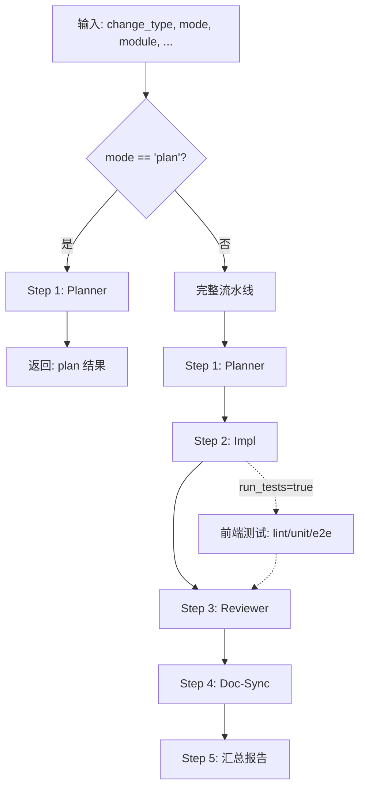

# Frontend Dev Orchestrator Skill

## 1. Skill 概要

本 Skill 的唯一职责：

> 帮用户把前端开发需求转换成 **规范、可执行、可复盘的前端开发流水线**，
> 包含：开发计划 → 代码实现 → SoT 审查 → 文档同步 → 完成报告。

**本 Skill 不直接生成或修改项目代码文件**，所有实际变更通过调用子 skill 完成：

| 子 Skill | 版本 | 职责 |
|----------|------|------|
| `fe-dev-planner` | v1.0.0（规划中） | 生成前端开发计划 |
| `fe-dev-impl` | v1.0.0（规划中） | 执行代码实现 + 运行测试 |
| `fe-dev-reviewer` | v1.0.0（规划中） | SoT 合规审查 |
| `fe-dev-doc-sync` | v1.0.0（规划中） | 文档同步建议 + OpenSpec 提示 |

---

## 2. 适用场景（何时使用本 Skill）

当满足以下任一条件时，应优先考虑使用本 Skill：

- 用户显式提到：
  - "开发一个新前端页面"
  - "新增前端模块"
  - "修改 / 优化 xxx 前端组件"
  - "修复 xxx 前端页面的 bug"
  - "帮我走一遍前端开发流程"
- 用户目标涉及：
  - 新增前端页面（change_type=fe_page）
  - 新增前端模块（change_type=fe_module）
  - 重构前端代码（change_type=fe_refactor）
- 用户希望：
  - 遵循 FRONTEND_DEVELOPMENT_FLOW v1.1.1 的 6 步流程
  - 自动化执行开发 → 测试 → 审查 → 文档同步流水线

---

## 3. 禁用场景（不要使用本 Skill）

出现以下情况时，不要使用本 Skill：

- 用户只是想了解前端设计方案，不需要实际开发
- 用户要求直接手写代码，不走流水线
- 用户仅需要运行测试（应使用 `ai-ad-agents-test-orchestrator`）
- 用户仅需要文档生成（应使用 `ai-ad-doc-orchestrator`）
- 任务与前端开发无关（后端 API、纯文档、配置等）

---

## 4. SoT 文档依赖

本 Skill 的所有决策必须遵守以下 SoT 文档（只读）：

| 文档 | 版本 | 路径 | 用途 |
|------|------|------|------|
| `FRONTEND_STYLE_GUIDE` | v2.0 | `docs/3.dev-guides/` | UI Token、布局、组件规范（最高优先级） |
| `FRONTEND_DEVELOPMENT_RULES` | v1.0 | `docs/3.dev-guides/` | 技术栈、组件架构参考 |
| `FRONTEND_DEVELOPMENT_FLOW` | v1.1.1 | `docs/3.dev-guides/` | 前端开发 6 步流程、不可变量检查 |
| `API_DEVELOPMENT_FLOW` | v2.3 | `docs/3.dev-guides/` | 后端开发流程（前端需等待/对齐） |
| `STATE_MACHINE` | v2.6 | `docs/2.sot/` | 状态机定义（前端必须映射） |
| `DATA_SCHEMA` | v5.2 | `docs/2.sot/` | 数据模型字段定义（前端类型定义必须对齐） |
| `API_SOT` | v9.0 | `docs/2.sot/` | API 契约（前端请求/响应格式必须对齐） |
| `ERROR_CODES_SOT` | v2.1 | `docs/2.sot/` | 错误码定义（前端错误处理必须对齐） |
| `AUTH_SPEC` | v2.0 | `docs/2.sot/` | 权限模型（前端路由/按钮权限必须对齐） |

**SoT 裁判链优先级**：
```
FRONTEND_STYLE_GUIDE.md v2.0（最高优先级，前端开发必须遵守）
→ FRONTEND_DEVELOPMENT_RULES.md v1.0
→ FRONTEND_DEVELOPMENT_FLOW.md v1.1.1
→ STATE_MACHINE.md v2.6 → DATA_SCHEMA.md v5.2 → BUSINESS_RULES.md v3.1
→ API_SOT.md v9.0 → ERROR_CODES_SOT.md v2.1 → AUTH_SPEC.md v2.0
```

---

## 5. 输入契约

### 5.1 输入 JSON 结构

```json
{
  "change_type": "fe_module",
  "mode": "impl+test",
  "module": "dashboard_overview",
  "route": "/dashboard",
  "description": "为 dashboard 模块新增概览页面，展示 KPI、趋势图表和风险预警",
  "constraints": {
    "requires_backend_api": true,
    "api_endpoints": ["GET /api/v1/dashboard/summary"],
    "auth_required": true,
    "permission": "dashboard:read"
  },
  "auto_write": false,
  "run_tests": true
}
```

### 5.2 字段说明

| 字段 | 类型 | 必填 | 默认值 | 说明 |
|------|------|------|--------|------|
| `change_type` | enum | ✅ | - | 变更类型（见 §5.3） |
| `mode` | enum | ❌ | `impl+test` | 执行模式（见 §5.4） |
| `module` | string | ✅ | - | 目标前端模块名（见 §5.5） |
| `route` | string | ❌ | - | 目标路由路径（如 `/dashboard`） |
| `description` | string | ✅ | - | 自然语言需求描述 |
| `constraints` | object | ❌ | `{}` | 额外约束条件 |
| `auto_write` | bool | ❌ | `false` | 是否自动写入文件 |
| `run_tests` | bool | ❌ | `true` | 是否运行测试（lint/unit/e2e） |

### 5.3 change_type 枚举（变更类型）

> **权威定义**：以下枚举为 v1.0.0 唯一有效值，禁止使用未列出的值。

| change_type | 约束级别 | 说明 | 典型场景 |
|-------------|----------|------|---------|
| `fe_page` | ✅ 强制 | 新增/修改单个页面 | 新增 `/dashboard/finance` 页面 |
| `fe_module` | ✅ 强制 | 新增/修改完整前端模块（Page + Shell + Components + Hooks） | 新增 `finance_profit_panel` 模块 |
| `fe_refactor` | ✅ 强制 | 纯重构（不改业务行为） | 重构组件结构、优化性能 |

### 5.4 mode 枚举（执行模式）

> **重要说明**：`mode` 控制的是对子 Skill 的调用策略和期望行为，orchestrator 自身不直接生成代码、不直接运行测试。所有实际代码生成和测试执行由子 Skill（fe-dev-impl）完成。

| mode | 说明 | 输出内容 | 推荐场景 | run_tests 推荐值 |
|------|------|---------|---------|-----------------|
| `plan` | 只生成计划（不动代码） | 计划 JSON + 文件列表 | 方案确认 | `false`（忽略） |
| `impl` | 代码实现（可选 auto_write） | 代码片段 + 实现报告 | 快速实现 | `false`（默认） |
| `impl+test` | 代码 + 测试（**推荐默认**） | 代码 + 测试 + 测试结果 | 标准开发流程 | `true`（默认） |
| `refactor` | 纯重构（不改业务行为） | 重构报告 + 回归测试建议 | 代码优化 | `true`（强烈建议） |

**mode 与 run_tests 的推荐组合**：
- `mode=plan` → `run_tests` 忽略或设为 `false`（只生成计划，不执行测试）
- `mode=impl` → `run_tests` 默认 `false`（快速实现，可选测试）
- `mode=impl+test` → `run_tests` 默认 `true`（标准流程，必须测试）
- `mode=refactor` → `run_tests` 强烈建议 `true`（重构需回归测试验证行为不变）

### 5.5 module 枚举（目标前端模块）

> **来源**：FRONTEND_DEVELOPMENT_FLOW v1.1.1 §6.1 + 现有前端模块结构

| module | 路由路径 | Shell 组件 | 说明 |
|--------|---------|-----------|------|
| `dashboard` | `/dashboard` | `DashboardShell.tsx` | 仪表盘模块（金样本） |
| `dashboard_overview` | `/dashboard` | `DashboardShell.tsx` | 仪表盘概览（dashboard 子模块） |
| `daily_reports` | `/dashboard/daily-reports` | `DailyReportsPageShell.tsx` | 日报管理 |
| `topup_requests` | `/dashboard/topup` | `TopupPageShell.tsx` | 充值申请 |
| `reconciliation` | `/dashboard/reconciliation` | `ReconciliationPageShell.tsx` | 对账管理 |
| `finance_profit_panel` | `/dashboard/finance/profit` | `FinanceProfitPanelShell.tsx` | 利润分析面板 |
| `ad_accounts` | `/dashboard/ad-accounts` | `AdAccountsPageShell.tsx` | 广告账户 |
| `projects` | `/dashboard/projects` | `ProjectsPageShell.tsx` | 项目管理 |
| `transfers` | `/dashboard/transfer` | `TransfersPageShell.tsx` | 余额迁移 |

**约束**：module 可以是上表中的值，也可以是符合命名规范的新模块名（kebab-case，如 `finance_profit_panel`）。

---

## 6. 子 Skill 调用契约

### 6.1 调用 fe-dev-planner v1.0.0

**输入**：

```json
{
  "change_type": "fe_module",
  "mode": "impl+test",
  "module": "dashboard_overview",
  "route": "/dashboard",
  "description": "为 dashboard 模块新增概览页面",
  "constraints": {
    "requires_backend_api": true,
    "api_endpoints": ["GET /api/v1/dashboard/summary"]
  }
}
```

**输出**：

```json
{
  "module": "dashboard_overview",
  "change_type": "fe_module",
  "mode": "impl+test",
  "route": "/dashboard",
  "files_to_touch": [
    "frontend/app/dashboard/page.tsx",
    "frontend/src/modules/dashboard/DashboardShell.tsx",
    "frontend/src/modules/dashboard/components/DashboardKpiRow.tsx",
    "frontend/src/modules/dashboard/hooks/useDashboardData.ts",
    "frontend/src/modules/dashboard/types/index.ts"
  ],
  "dev_steps": [
    { "step": 1, "phase": "sot_review", "action": "查阅相关 SoT 文档", "file": null, "sot_ref": "FRONTEND_STYLE_GUIDE_v2.0.md §3.3" },
    { "step": 2, "phase": "route_design", "action": "设计路由结构（App Router）", "file": "app/dashboard/page.tsx", "sot_ref": "FRONTEND_DEVELOPMENT_FLOW v1.1.1 §3.3" },
    { "step": 3, "phase": "api_adapt", "action": "实现数据层（API 调用、Envelope 解包）", "file": "src/modules/dashboard/hooks/useDashboardData.ts", "sot_ref": "FRONTEND_DEVELOPMENT_FLOW v1.1.1 §3.4" },
    { "step": 4, "phase": "component_dev", "action": "开发组件（Page Shell、业务组件）", "file": "src/modules/dashboard/DashboardShell.tsx", "sot_ref": "FRONTEND_STYLE_GUIDE_v2.0.md §3.2" },
    { "step": 5, "phase": "interaction", "action": "实现交互逻辑（表单提交、状态转换触发）", "file": null, "sot_ref": "FRONTEND_DEVELOPMENT_FLOW v1.1.1 §3.6" },
    { "step": 6, "phase": "test", "action": "编写测试（单测、集成测）", "file": "src/modules/dashboard/__tests__/DashboardShell.test.tsx", "sot_ref": "FRONTEND_DEVELOPMENT_FLOW v1.1.1 §3.7" }
  ],
  "review_checklist": [
    { "id": "C1", "name": "符合 FRONTEND_STYLE_GUIDE_v2.0.md 布局规范", "applicable": true },
    { "id": "C2", "name": "使用 UI Token（颜色、间距、排版）", "applicable": true },
    { "id": "C3", "name": "处理 Loading/Error/Empty 三种状态", "applicable": true },
    { "id": "C4", "name": "API 调用使用 apiFetch.ts（Envelope 解包）", "applicable": true },
    { "id": "C5", "name": "错误处理使用 ERROR_CODES_SOT.md v2.1 错误码", "applicable": true },
    { "id": "C6", "name": "状态机映射对齐 STATE_MACHINE.md v2.6", "applicable": false, "na_reason": "dashboard 模块不涉及状态机" }
  ],
  "need_openspec": false,
  "openspec_reason": "",
  "sot_references": [
    { "doc": "FRONTEND_STYLE_GUIDE.md", "version": "v2.0", "section": "§3.3 Dashboard 12 栅格布局" },
    { "doc": "FRONTEND_DEVELOPMENT_FLOW.md", "version": "v1.1.1", "section": "§3 前端开发 6 步流程" }
  ],
  "risks_and_todos": [
    { "risk": "需要等待后端 API 完成", "todo": "确认 GET /api/v1/dashboard/summary 端点已实现", "blocking": true }
  ]
}
```

### 6.2 调用 fe-dev-impl v1.0.0

**输入**：

```json
{
  "change_type": "fe_module",
  "module": "dashboard_overview",
  "description": "为 dashboard 模块新增概览页面",
  "plan": {
    "files_to_touch": ["..."],
    "dev_steps": ["..."],
    "review_checklist": ["..."]
  },
  "auto_write": false,
  "run_tests": true,
  "test_types": ["lint", "unit"]
}
```

**输出**：

```json
{
  "files_changed": [
    { "path": "frontend/app/dashboard/page.tsx", "action": "created" },
    { "path": "frontend/src/modules/dashboard/DashboardShell.tsx", "action": "modified" }
  ],
  "test_summary": {
    "executed": true,
    "lint_passed": true,
    "unit_passed": true,
    "unit_tests_count": 5,
    "unit_tests_passed": 5,
    "unit_tests_failed": 0,
    "e2e_executed": false
  },
  "style_guide_compliance": {
    "uses_ui_tokens": true,
    "follows_layout_rules": true,
    "handles_loading_state": true,
    "handles_error_state": true,
    "handles_empty_state": true
  }
}
```

### 6.3 调用 fe-dev-reviewer v1.0.0

**输入**：

```json
{
  "module": "dashboard_overview",
  "change_type": "fe_module",
  "description": "为 dashboard 模块新增概览页面",
  "plan": {
    "files_to_touch": ["..."],
    "dev_steps": ["..."],
    "review_checklist": ["..."]
  },
  "files_changed": [
    { "path": "frontend/app/dashboard/page.tsx", "action": "created" }
  ],
  "test_summary": {
    "executed": true,
    "lint_passed": true,
    "unit_passed": true
  },
  "style_guide_compliance": {
    "uses_ui_tokens": true,
    "follows_layout_rules": true
  }
}
```

**输出**：

```json
{
  "status": "pass",
  "p0_issues": [],
  "p1_issues": [],
  "p2_issues": [
    { "id": "P2-FE-001", "file": "frontend/src/modules/dashboard/DashboardShell.tsx", "issue": "建议使用 DataStateManager 统一处理 Loading/Error/Empty 状态", "sot_ref": "FRONTEND_STYLE_GUIDE_v2.0.md §3.2" }
  ],
  "recommend_deploy": true,
  "requires_openspec": false,
  "review_summary": "实现符合 FRONTEND_STYLE_GUIDE_v2.0.md 规范，所有 P0/P1 检查通过"
}
```

### 6.4 调用 fe-dev-doc-sync v1.0.0

**输入**：

```json
{
  "module": "dashboard_overview",
  "change_type": "fe_module",
  "description": "为 dashboard 模块新增概览页面",
  "plan": {
    "files_to_touch": ["..."],
    "dev_steps": ["..."],
    "need_openspec": false,
    "sot_references": ["..."]
  },
  "impl_result": {
    "files_changed": ["..."],
    "test_summary": {...},
    "style_guide_compliance": {...}
  },
  "review_result": {
    "status": "pass",
    "p0_issues": [],
    "p1_issues": [],
    "recommend_deploy": true
  }
}
```

**输出**：

```json
{
  "module": "dashboard_overview",
  "change_type": "fe_module",
  "docs_to_update": [],
  "openspec": {
    "required": false,
    "reason": "",
    "reviewer_agrees": false,
    "has_existing_proposal": false
  },
  "audit": {
    "doc_desync_risk": "low",
    "missing_docs": [],
    "notes": "无需文档更新"
  },
  "next_steps": [],
  "doc_sync_version": "ai-ad-fe-dev-doc-sync v1.0.0"
}
```

---

## 7. 执行流程（Orchestration Flow）

### 7.1 流程概览

本 Skill 根据 `mode` 参数决定执行路径：

- **mode=plan**：只执行 Step 1（Planner），返回仅包含 plan 的结果结构
- **其他 mode（impl / impl+test / refactor）**：执行完整 4 步流水线（Planner → Impl → Reviewer → Doc-Sync）



### 7.2 mode=plan 的执行路径（仅生成计划）

**目的**：只生成前端开发计划，不执行代码实现、审查、文档同步。

```python
# Step 1: 调用 fe-dev-planner
planner_input = {
    "change_type": input.change_type,
    "mode": input.mode,  # "plan"
    "module": input.module,
    "route": input.route,
    "description": input.description,
    "constraints": input.constraints or {}
}
planner_result = call_skill("fe-dev-planner", planner_input)

# 直接返回仅包含 plan 的结果结构
return {
    "run_id": generate_run_id(),
    "timestamp": get_current_timestamp(),
    "module": input.module,
    "change_type": input.change_type,
    "mode": "plan",
    "plan": {
        "files_to_touch": planner_result.files_to_touch,
        "dev_steps": planner_result.dev_steps,
        "dev_steps_count": len(planner_result.dev_steps),
        "review_checklist": planner_result.review_checklist,
        "need_openspec": planner_result.need_openspec,
        "openspec_reason": planner_result.openspec_reason,
        "sot_references": planner_result.sot_references,
        "risks_and_todos": planner_result.risks_and_todos
    },
    # 以下字段在 mode=plan 时不存在或为 null
    "impl_result": None,
    "review_result": None,
    "doc_sync": None,
    "fe_test_summary": None,
    "status": "plan_complete",
    "recommend_deploy": None,
    "requires_openspec": planner_result.need_openspec,
    "meta": {
        "orchestrator_version": "ai-ad-fe-dev-orchestrator v1.0.0",
        "flow_version": "FRONTEND_DEVELOPMENT_FLOW v1.1.1",
        "called_skills": ["fe-dev-planner"]
    }
}
```

### 7.3 完整流水线执行路径（mode=impl / impl+test / refactor）

#### 7.3.1 Step 1: 调用 fe-dev-planner

**目的**：生成前端开发计划，包含文件列表、开发步骤、审查清单。

```python
planner_input = {
    "change_type": input.change_type,
    "mode": input.mode or "impl+test",
    "module": input.module,
    "route": input.route,
    "description": input.description,
    "constraints": input.constraints or {}
}
planner_result = call_skill("fe-dev-planner", planner_input)
```

#### 7.3.2 Step 2: 调用 fe-dev-impl

**目的**：基于计划执行具体实现，并运行测试。

```python
impl_input = {
    "change_type": input.change_type,
    "module": input.module,
    "description": input.description,
    "plan": {
        "files_to_touch": planner_result.files_to_touch,
        "dev_steps": planner_result.dev_steps,
        "review_checklist": planner_result.review_checklist
    },
    "auto_write": input.auto_write or False,
    "run_tests": input.run_tests if input.run_tests is not None else (True if input.mode == "impl+test" else False),
    "test_types": ["lint", "unit"]  # 可选: ["lint", "unit", "e2e"]
}
impl_result = call_skill("fe-dev-impl", impl_input)
```

**测试职责说明**：

- `run_tests` 参数传递给 impl Skill
- impl 负责在实现后调用前端测试（lint/unit/e2e）并返回 `test_summary`
- **orchestrator 不再直接调用测试工具**，避免重复调用

#### 7.3.3 Step 3: 调用 fe-dev-reviewer

**目的**：对代码改动进行 SoT 合规审查。

```python
reviewer_input = {
    "module": input.module,
    "change_type": input.change_type,
    "description": input.description,
    "plan": {
        "files_to_touch": planner_result.files_to_touch,
        "dev_steps": planner_result.dev_steps,
        "review_checklist": planner_result.review_checklist
    },
    "files_changed": impl_result.files_changed,
    "test_summary": impl_result.test_summary,
    "style_guide_compliance": impl_result.style_guide_compliance,
    "openspec_context": {
        "has_proposal": False,  # 可从上下文获取
        "proposal_id": None
    }
}
review_result = call_skill("fe-dev-reviewer", reviewer_input)
```

#### 7.3.4 Step 4: 调用 fe-dev-doc-sync

**目的**：生成文档同步建议和 OpenSpec 操作提示。

```python
doc_sync_input = {
    "module": input.module,
    "change_type": input.change_type,
    "description": input.description,
    "plan": {
        "files_to_touch": planner_result.files_to_touch,
        "dev_steps": planner_result.dev_steps,
        "need_openspec": planner_result.need_openspec,
        "sot_references": planner_result.sot_references
    },
    "impl_result": {
        "files_changed": impl_result.files_changed,
        "test_summary": impl_result.test_summary,
        "style_guide_compliance": impl_result.style_guide_compliance
    },
    "review_result": {
        "status": review_result.status,
        "p0_issues": review_result.p0_issues,
        "p1_issues": review_result.p1_issues,
        "p2_issues": review_result.p2_issues,
        "recommend_deploy": review_result.recommend_deploy,
        "requires_openspec": review_result.requires_openspec
    }
}
doc_sync_result = call_skill("fe-dev-doc-sync", doc_sync_input)
```

#### 7.3.5 Step 5: 汇总报告

**目的**：输出 JSON 格式的统一开发报告 + 可选的 Markdown 人类可读摘要。

**汇总逻辑**：

```python
# 计算顶层 status / recommend_deploy / requires_openspec
def calculate_top_level_status(review_result, doc_sync_result):
    """
    基于 review_result 的 P0/P1 计数计算顶层状态
    """
    p0_count = len(review_result.p0_issues) if review_result else 0
    p1_count = len(review_result.p1_issues) if review_result else 0
    
    if p0_count > 0:
        return {
            "status": "fail",
            "recommend_deploy": False,
            "requires_openspec": doc_sync_result.openspec.required if doc_sync_result else False
        }
    elif p1_count > 0:
        return {
            "status": "warning",
            "recommend_deploy": False,
            "requires_openspec": doc_sync_result.openspec.required if doc_sync_result else False
        }
    else:
        return {
            "status": "pass",
            "recommend_deploy": review_result.recommend_deploy if review_result else True,
            "requires_openspec": doc_sync_result.openspec.required if doc_sync_result else False
        }

# 提取测试摘要（来自 impl_result.test_summary）
def extract_test_summary(impl_result):
    """
    从 impl_result.test_summary 提取测试摘要
    权威来源：impl_result.test_summary
    顶层 fe_test_summary 只是摘要副本
    """
    if not impl_result or not impl_result.test_summary:
        return {
            "executed": False,
            "lint_passed": None,
            "unit_passed": None,
            "e2e_passed": None,
            "failed_reasons": []
        }
    
    test_summary = impl_result.test_summary
    return {
        "executed": test_summary.get("executed", False),
        "lint_passed": test_summary.get("lint_passed"),
        "unit_passed": test_summary.get("unit_passed"),
        "e2e_passed": test_summary.get("e2e_passed"),
        "failed_reasons": test_summary.get("failed_reasons", [])
    }
```

### 7.4 流水线覆盖范围对比

| mode | Planner | Impl | Reviewer | Doc-Sync | 输出字段 |
|------|---------|------|----------|----------|---------|
| `plan` | ✅ | ❌ | ❌ | ❌ | 仅 `plan`，`impl_result`/`review_result`/`doc_sync` 为 `null` |
| `impl` | ✅ | ✅ | ✅ | ✅ | 完整字段 |
| `impl+test` | ✅ | ✅ | ✅ | ✅ | 完整字段 + `fe_test_summary` |
| `refactor` | ✅ | ✅ | ✅ | ✅ | 完整字段 + `fe_test_summary` |

---

## 8. 输出契约

### 8.1 输出 JSON 结构（机器可读）

> **重要**：这是下游 Agent/自动化流程 **唯一应解析的结构化数据**。

**mode=plan 的输出结构**（仅包含 plan）：

```json
{
  "run_id": "fe-orch-20251206-001",
  "timestamp": "2025-12-06T10:30:00Z",
  "module": "dashboard_overview",
  "change_type": "fe_module",
  "mode": "plan",
  "route": "/dashboard",
  "plan": {
    "files_to_touch": [
      "frontend/app/dashboard/page.tsx",
      "frontend/src/modules/dashboard/DashboardShell.tsx"
    ],
    "dev_steps_count": 6,
    "need_openspec": false,
    "sot_references": [
      { "doc": "FRONTEND_STYLE_GUIDE.md", "version": "v2.0" }
    ]
  },
  "impl_result": null,
  "review_result": null,
  "doc_sync": null,
  "fe_test_summary": null,
  "status": "plan_complete",
  "recommend_deploy": null,
  "requires_openspec": false,
  "meta": {
    "orchestrator_version": "ai-ad-fe-dev-orchestrator v1.0.0",
    "flow_version": "FRONTEND_DEVELOPMENT_FLOW v1.1.1",
    "called_skills": ["fe-dev-planner"]
  }
}
```

**完整流水线输出结构**（mode=impl / impl+test / refactor）：

```json
{
  "run_id": "fe-orch-20251206-001",
  "timestamp": "2025-12-06T10:30:00Z",
  "module": "dashboard_overview",
  "change_type": "fe_module",
  "mode": "impl+test",
  "route": "/dashboard",
  "auto_write": false,
  "run_tests": true,
  "plan": {
    "files_to_touch": [
      "frontend/app/dashboard/page.tsx",
      "frontend/src/modules/dashboard/DashboardShell.tsx"
    ],
    "dev_steps_count": 6,
    "need_openspec": false,
    "sot_references": [
      { "doc": "FRONTEND_STYLE_GUIDE.md", "version": "v2.0" }
    ]
  },
  "impl_result": {
    "files_changed": [
      { "path": "frontend/app/dashboard/page.tsx", "action": "created" }
    ],
    "test_summary": {
      "executed": true,
      "lint_passed": true,
      "unit_passed": true,
      "unit_tests_count": 5,
      "unit_tests_passed": 5,
      "unit_tests_failed": 0
    },
    "style_guide_compliance": {
      "uses_ui_tokens": true,
      "follows_layout_rules": true,
      "handles_loading_state": true,
      "handles_error_state": true,
      "handles_empty_state": true
    }
  },
  "review_result": {
    "status": "pass",
    "p0_count": 0,
    "p1_count": 0,
    "p2_count": 1,
    "recommend_deploy": true,
    "requires_openspec": false,
    "review_summary": "实现符合 FRONTEND_STYLE_GUIDE_v2.0.md 规范"
  },
  "doc_sync": {
    "docs_to_update_count": 0,
    "openspec_required": false,
    "doc_desync_risk": "low",
    "next_steps": []
  },
  "fe_test_summary": {
    "executed": true,
    "lint_passed": true,
    "unit_passed": true,
    "e2e_passed": null,
    "failed_reasons": []
  },
  "status": "pass",
  "recommend_deploy": true,
  "requires_openspec": false,
  "suggested_tests": [
    {
      "skill": "ai-ad-agents-test-orchestrator",
      "mode": "RUN",
      "scope": "frontend",
      "target": "dashboard_overview",
      "reason": "fe_module 变更需验证前端实现"
    }
  ],
  "meta": {
    "orchestrator_version": "ai-ad-fe-dev-orchestrator v1.0.0",
    "flow_version": "FRONTEND_DEVELOPMENT_FLOW v1.1.1",
    "called_skills": ["fe-dev-planner", "fe-dev-impl", "fe-dev-reviewer", "fe-dev-doc-sync"]
  }
}
```

### 8.2 顶层状态字段说明

| 字段 | 类型 | 说明 | 计算规则 |
|------|------|------|---------|
| `status` | enum | 流水线执行状态 | 基于 `review_result.p0_count` / `p1_count`：<br>- P0 > 0 → `"fail"`<br>- P1 > 0 → `"warning"`<br>- 否则 → `"pass"`<br>- mode=plan → `"plan_complete"` |
| `recommend_deploy` | bool \| null | 是否建议部署 | 基于 `status`：<br>- `status="fail"` → `false`<br>- `status="warning"` → `false`<br>- `status="pass"` → `review_result.recommend_deploy`<br>- mode=plan → `null` |
| `requires_openspec` | bool | 是否需要 OpenSpec Proposal | 基于 `doc_sync.openspec_required` 或 `plan.need_openspec` |

**计算伪代码**：

```python
def calculate_top_level_status(review_result, doc_sync_result, mode):
    if mode == "plan":
        return {
            "status": "plan_complete",
            "recommend_deploy": None,
            "requires_openspec": doc_sync_result.openspec_required if doc_sync_result else False
        }
    
    p0_count = len(review_result.p0_issues) if review_result else 0
    p1_count = len(review_result.p1_issues) if review_result else 0
    
    if p0_count > 0:
        status = "fail"
        recommend_deploy = False
    elif p1_count > 0:
        status = "warning"
        recommend_deploy = False
    else:
        status = "pass"
        recommend_deploy = review_result.recommend_deploy if review_result else True
    
    return {
        "status": status,
        "recommend_deploy": recommend_deploy,
        "requires_openspec": doc_sync_result.openspec.required if doc_sync_result else False
    }
```

### 8.3 fe_test_summary 字段说明

| 字段 | 类型 | 说明 | 数据来源 |
|------|------|------|---------|
| `executed` | bool | 是否执行了测试 | `impl_result.test_summary.executed` |
| `lint_passed` | bool \| null | Lint 是否通过 | `impl_result.test_summary.lint_passed` |
| `unit_passed` | bool \| null | 单元测试是否通过 | `impl_result.test_summary.unit_passed` |
| `e2e_passed` | bool \| null | E2E 测试是否通过 | `impl_result.test_summary.e2e_passed` |
| `failed_reasons` | array | 失败原因列表 | `impl_result.test_summary.failed_reasons` |

**重要**：
- `fe_test_summary` 是 `impl_result.test_summary` 的摘要副本
- 权威数据源：`impl_result.test_summary`
- 顶层 `fe_test_summary` 仅用于快速查看，详细测试信息请查看 `impl_result.test_summary`
- mode=plan 时，`fe_test_summary` 为 `null`

### 8.2 输出 Markdown 摘要（人类可读）

> **可选**：用于在对话中展示给用户，不作为结构化数据解析。

```markdown
# 前端开发流水线报告

**Run ID**: fe-orch-20251206-001  
**模块**: dashboard_overview  
**变更类型**: fe_module  
**路由**: /dashboard

## 执行结果

✅ **计划生成**: 完成  
✅ **代码实现**: 完成（2 个文件）  
✅ **SoT 审查**: 通过（P0=0, P1=0, P2=1）  
✅ **文档同步**: 无需更新

## 测试结果

- Lint: ✅ 通过
- 单元测试: ✅ 5/5 通过
- E2E: ⏭️ 未执行

## 建议

- 建议使用 DataStateManager 统一处理 Loading/Error/Empty 状态（P2）
- 无需 OpenSpec Proposal
- 可以部署
```

---

## 9. 与 FRONTEND_DEVELOPMENT_FLOW v1.1.1 的映射

本 Skill 的 4 步流水线对应 FRONTEND_DEVELOPMENT_FLOW v1.1.1 的 6 步流程：

| FRONTEND_DEVELOPMENT_FLOW 步骤 | Orchestrator 阶段 | 子 Skill |
|-------------------------------|------------------|----------|
| Step 1: 对齐 SoT 与产品需求 | Step 1: Planner | fe-dev-planner |
| Step 2: 路由与布局设计 | Step 1: Planner | fe-dev-planner |
| Step 3: 数据层与 API 适配 | Step 2: Impl | fe-dev-impl |
| Step 4: 组件开发与 UI 状态管理 | Step 2: Impl | fe-dev-impl |
| Step 5: 交互与错误处理 | Step 2: Impl | fe-dev-impl |
| Step 6: 测试与回归 | Step 2: Impl + Step 3: Reviewer | fe-dev-impl + fe-dev-reviewer |

**关键约束**（来自 FRONTEND_DEVELOPMENT_FLOW v1.1.1）：

- Step 3（数据层与 API 适配）必须等待后端 API 开发完成（参考 API_DEVELOPMENT_FLOW.md v2.3）
- 所有错误处理必须使用 ERROR_CODES_SOT.md v2.1 定义的错误码
- 所有 UI/布局/组件规范必须遵守 FRONTEND_STYLE_GUIDE_v2.0.md（最高优先级）

---

## 10. 禁止事项

本 Skill 禁止以下行为：

- ❌ **禁止直接生成代码文件**：所有代码生成通过调用 `fe-dev-impl` 完成
- ❌ **禁止直接运行测试命令**：所有测试执行通过 `fe-dev-impl` 完成
- ❌ **禁止修改 SoT 文档**：所有 SoT 文档为只读，只能引用
- ❌ **禁止发明新的样式规则**：所有样式规则必须来自 FRONTEND_STYLE_GUIDE_v2.0.md
- ❌ **禁止绕过 FRONTEND_DEVELOPMENT_FLOW 流程**：必须遵循 6 步标准流程

---

## 11. 版本与维护

### 11.1 Change Log

| Version | Date | Changes |
|---------|------|---------|
| v1.0.1 | 2025-12-06 | 文档逻辑修订：修复 mode=plan 与流程伪代码不一致问题；增加顶层 status/recommend_deploy/requires_openspec/fe_test_summary 字段；明确 mode 语义和 run_tests 推荐组合；区分文档状态与运行状态 |
| v1.0.0 | 2025-12-06 | 初版：基于 FRONTEND_DEVELOPMENT_FLOW v1.1.1，定义前端开发流水线总控 Skill，对标 ai-ad-api-dev-orchestrator v1.2.0 |

### 11.2 子 Skill 状态

| 子 Skill | 版本 | 状态 | 说明 |
|----------|------|------|------|
| `fe-dev-planner` | v1.0.0 | 规划中 | 待实现 |
| `fe-dev-impl` | v1.0.0 | 规划中 | 待实现 |
| `fe-dev-reviewer` | v1.0.0 | 规划中 | 待实现 |
| `fe-dev-doc-sync` | v1.0.0 | 规划中 | 待实现 |

### 11.3 运行状态说明

**文档状态**：Ready（Skill 定义完成）

**运行状态**：`design_ready_impl_pending`（设计完成，落地中）

**说明**：
- 本 Skill 的定义文档已完成，可作为前端开发流水线的总控 SoT
- 但 4 个子 Skill（fe-dev-planner / fe-dev-impl / fe-dev-reviewer / fe-dev-doc-sync）尚未全部实现
- 当前阶段主要用于规划/dry-run，而不是完整生产流水线
- 在实际使用前，需要先实现子 Skill 或使用临时实现

---

**文档状态**：Ready（Skill 定义完成，子 Skill 待实现）

