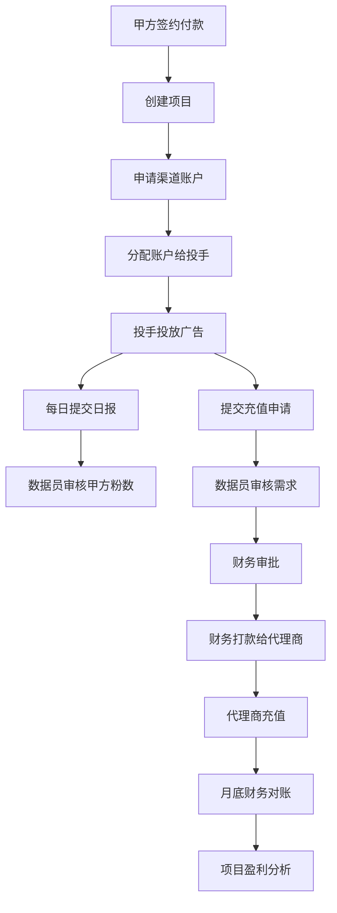

# 系统概述与架构设计

> **文档目的**: 提供系统整体架构、业务流程和技术选型指导
> **目标读者**: 架构师、技术负责人、产品经理
> **更新日期**: 2025-11-10

---

## 1. 系统概述

### 1.1 项目背景
AI广告代投系统是为Facebook广告代投业务设计的综合性管理平台，核心解决以下业务挑战：

- **投手效率管理**: 缺乏有效的绩效考核和实时监控
- **财务对账困难**: 充值申请审批流程混乱，消耗与充值对账不清晰
- **渠道管理复杂**: 多个广告代理商质量参差不齐，缺乏渠道绩效评估
- **盈利分析不清晰**: 无法准确评估项目盈利状况
- **账户生命周期管理**: 广告账户寿命不确定（几天到几个月不等）

### 1.2 业务模式
```
收入模式:
├── 项目启动费 (一次性收取)
└── 按潜在客户计费 (主要收入来源)
    └── 单粉价格 × 甲方确认粉数

成本结构:
├── 广告费消耗 (主要成本)
├── 充值手续费 (5%-20%)
├── 开户费
├── Facebook账号成本
├── 公共主页费用
├── 服务器费用
└── 投手工资
```

### 1.3 核心价值
- **自动化流程**: 减少90%的人工数据录入工作
- **财务准确性**: 解决财务对账偏差问题，实现精准成本核算
- **决策支持**: 基于真实数据进行业务决策
- **扩展性**: 支持业务规模扩展和模式复制

---

## 2. 业务主链

### 2.1 核心业务流程


### 2.2 四层数据关系
```
项目 (Project)
├── 关联多个渠道 (Channel)
│   └── 提供广告账户 (AdAccount)
│       └── 分配给投手 (User)
```

**关键规则**: 所有数据必须能反向追溯到"项目+渠道+账户+投手"

### 2.3 核心业务实体

#### 2.3.1 项目 (Project)
- **客户信息**: 客户名称、联系方式、合同信息
- **收费模式**: 按粉计费、固定费用、混合模式
- **预算管理**: 月度预算、总预算、目标设定
- **项目状态**: 规划中、进行中、暂停、完成、取消

#### 2.3.2 渠道 (Channel)
- **代理商信息**: 公司名称、联系方式、服务费率
- **质量评估**: 账户存活率、可靠性评分、价格竞争力
- **费用结构**: 开户费、服务费率、最低充值金额
- **表现统计**: 总账户数、活跃账户数、总消耗

#### 2.3.3 广告账户 (AdAccount)
- **账户信息**: 账户ID、名称、平台信息
- **状态管理**: new → testing → active → suspended → dead → archived
- **性能数据**: 总消耗、总粉数、平均CPL、最佳CPL
- **预算监控**: 日预算、总预算、剩余预算

#### 2.3.4 用户角色 (User)
- **投手**: 负责广告投放，录入日报数据
- **户管**: 管理广告账户，分配账户给投手，申请账户
- **财务**: 审批充值，管理财务流水
- **数据员**: 审核日报，与甲方确认粉数
- **管理员**: 系统管理，用户管理

---

## 3. 权限矩阵

### 3.1 角色定义

| 角色 | 描述 | 主要职责 |
|------|------|----------|
| **投手** (media_buyer) | 一线广告操作人员 | 广告投放、日报提交、充值申请 |
| **户管** (data_clerk) | 账户和数据管理专家 | 账户分配、日报审核、充值初审 |
| **财务** (finance) | 财务管理人员 | 充值终审、对账、财务分析 |
| **管理员** (admin) | 系统管理员 | 用户管理、系统配置、全权限访问 |

### 3.2 功能权限矩阵

| 功能模块 | 投手 | 户管 | 财务 | 管理员 |
|----------|------|------|------|----------|
| **项目管理** |
| 创建项目 | ❌ | ✅ | ❌ | ✅ |
| 编辑项目 | ❌ | ✅ | ❌ | ✅ |
| 查看项目(自己的) | ✅ | ✅ | ✅ | ✅ |
| **渠道管理** |
| 创建渠道 | ❌ | ✅ | ❌ | ✅ |
| 编辑渠道 | ❌ | ✅ | ❌ | ✅ |
| 查看渠道 | ❌ | ✅ | ✅ | ✅ |
| **账户管理** |
| 创建账户 | ❌ | ✅ | ❌ | ✅ |
| 分配账户 | ❌ | ✅ | ❌ | ✅ |
| 查看账户(自己的) | ✅ | ✅ | ✅ | ✅ |
| **日报管理** |
| 提交日报 | ✅ | ✅ | ❌ | ✅ |
| 审核日报 | ❌ | ✅ | ❌ | ✅ |
| 查看日报 | ✅ | ✅ | ✅ | ✅ |
| **充值管理** |
| 申请充值 | ✅ | ✅ | ✅ | ✅ |
| 数据员审批 | ❌ | ✅ | ❌ | ✅ |
| 财务审批 | ❌ | ❌ | ✅ | ✅ |
| 查看充值记录 | ✅ | ✅ | ✅ | ✅ |
| **对账管理** |
| 创建对账 | ❌ | ❌ | ✅ | ✅ |
| 查看对账报告 | ❌ | ❌ | ✅ | ✅ |
| **用户管理** |
| 创建用户 | ❌ | ❌ | ❌ | ✅ |
| 编辑用户 | ❌ | ❌ | ❌ | ✅ |
| 查看用户 | ❌ | ❌ | ❌ | ✅ |

### 3.3 数据访问规则

#### 3.3.1 投手数据访问
- **项目**: 只能访问分配给自己的项目
- **账户**: 只能访问分配给自己的账户
- **日报**: 只能提交和查看自己的日报
- **充值**: 只能创建和查看自己的充值申请

#### 3.3.2 户管数据访问
- **项目**: 可访问所有项目（审核需要）
- **账户**: 可访问所有账户（管理需要）
- **日报**: 可访问所有日报（审核需要）
- **充值**: 可处理所有充值申请（初审）

#### 3.3.3 财务数据访问
- **项目**: 可访问所有项目（对账需要）
- **账户**: 可查看所有账户信息
- **日报**: 可查看所有日报数据
- **充值**: 可审批所有充值（终审）

#### 3.3.4 管理员数据访问
- **全权限**: 可访问所有数据和功能
- **用户管理**: 可创建、编辑、删除用户
- **系统配置**: 可修改系统参数和规则

---

## 4. 技术架构

### 4.1 整体架构图
```
┌─────────────────────────────────────────────────────────────┐
│                    前端层 (Next.js)                         │
│  ┌─────────────┐ ┌─────────────┐ ┌─────────────┐           │
│  │   页面组件   │ │   状态管理   │ │   路由控制   │           │
│  │             │ │   SWR/Zustand│ │  Role Guards │           │
│  └─────────────┘ └─────────────┘ └─────────────┘           │
├─────────────────────────────────────────────────────────────┤
│                API网关层 (FastAPI)                          │
│  ┌─────────────┐ ┌─────────────┐ ┌─────────────┐           │
│  │   认证中间件 │ │   权限控制   │ │   请求日志   │           │
│  │  JWT Token  │ │   RLS策略    │ │  Request ID  │           │
│  └─────────────┘ └─────────────┘ └─────────────┘           │
├─────────────────────────────────────────────────────────────┤
│                业务逻辑层 (Services)                        │
│  ┌─────────────┐ ┌─────────────┐ ┌─────────────┐           │
│  │   项目管理   │ │   财务管理   │ │   AI预测     │           │
│  │ StateMachine │ │  Reconcile  │ │ AnomalyDetect│           │
│  └─────────────┘ └─────────────┘ └─────────────┘           │
├─────────────────────────────────────────────────────────────┤
│                数据访问层 (SQLAlchemy)                      │
│  ┌─────────────┐ ┌─────────────┐ ┌─────────────┐           │
│  │   模型定义   │ │   查询构建   │ │   连接池     │           │
│  │   Pydantic  │ │   ORM Query  │ │  PostgreSQL  │           │
│  └─────────────┘ └─────────────┘ └─────────────┘           │
├─────────────────────────────────────────────────────────────┤
│                  数据层 (PostgreSQL)                        │
│  ┌─────────────┐ ┌─────────────┐ ┌─────────────┐           │
│  │   核心数据   │ │   审计日志   │ │   RLS策略    │           │
│  │  Tables     │ │   Audit Log  │ │  Row Security│           │
│  └─────────────┘ └─────────────┘ └─────────────┘           │
└─────────────────────────────────────────────────────────────┘
```

### 4.2 技术选型说明

#### 4.2.1 前端技术栈
- **Next.js 14**:
  - App Router提供更好的路由控制
  - SSR支持SEO和首屏加载优化
  - TypeScript保证类型安全

- **shadcn/ui**:
  - 基于Radix UI的无头组件
  - 高度可定制的样式系统
  - 优秀的可访问性支持

- **SWR/React Query**:
  - 数据获取和缓存管理
  - 自动重试和错误处理
  - 乐观更新支持

#### 4.2.2 后端技术栈
- **FastAPI**:
  - 自动生成OpenAPI文档
  - 高性能异步支持
  - 内置数据验证

- **SQLAlchemy (同步版)**:
  - 成熟的ORM框架
  - 复杂查询支持
  - 事务管理完善

- **Pydantic v2**:
  - 强类型数据验证
  - 自动序列化/反序列化
  - 详细的错误信息

#### 4.2.3 数据库与认证
- **PostgreSQL**:
  - 强一致性和ACID特性
  - 丰富的数据类型支持
  - 高级索引和查询优化

- **Supabase**:
  - 托管PostgreSQL服务
  - 内置认证系统
  - 行级安全(RLS)支持

- **RLS策略**:
  - 数据库级别的访问控制
  - 细粒度权限管理
  - 防止数据泄露

### 4.3 部署架构
```
┌─────────────────────────────────────────────────────────────┐
│                        负载均衡                              │
│                      Nginx Reverse Proxy                     │
└─────────────────────────────────────────────────────────────┘
                              │
┌─────────────────────────────────────────────────────────────┐
│                    应用服务层                                │
│  ┌─────────────┐              ┌─────────────┐               │
│  │  Frontend   │              │   Backend    │               │
│  │ Next.js App │              │ FastAPI App  │               │
│  └─────────────┘              └─────────────┘               │
└─────────────────────────────────────────────────────────────┘
                              │
┌─────────────────────────────────────────────────────────────┐
│                    数据服务层                                │
│  ┌─────────────┐              ┌─────────────┐               │
│  │ PostgreSQL  │              │    Redis     │               │
│  │ Supabase    │              │   Cache      │               │
│  └─────────────┘              └─────────────┘               │
└─────────────────────────────────────────────────────────────┘
```

---

## 5. 安全设计

### 5.1 认证机制
```python
# JWT Token结构
{
    "sub": "user_id",
    "role": "media_buyer",
    "email": "user@example.com",
    "exp": 1736789400,
    "iat": 1736703000
}

# Token刷新机制
Access Token: 15分钟过期
Refresh Token: 7天过期
自动刷新: 在过期前5分钟自动刷新
```

### 5.2 RLS安全策略
```sql
-- 用户上下文设置
SELECT set_config('app.current_user_id', $1, true);
SELECT set_config('app.current_role', $2, true);

-- 示例：项目访问策略
CREATE POLICY project_access_policy ON projects
    USING (
        -- 管理员全权限
        current_setting('app.current_role') = 'admin'
        OR
        -- 项目经理只能访问自己的项目
        manager_id = current_setting('app.current_user_id')::uuid
        OR
        -- 投手只能访问分配给自己的项目
        EXISTS (
            SELECT 1 FROM ad_accounts
            WHERE ad_accounts.project_id = projects.id
            AND ad_accounts.assigned_user_id = current_setting('app.current_user_id')::uuid
        )
    );
```

### 5.3 数据加密
- **传输加密**: HTTPS/TLS 1.3
- **存储加密**: 敏感字段AES-256加密
- **密码加密**: bcrypt哈希 + salt
- **API密钥**: 环境变量存储，定期轮换

### 5.4 审计日志
```python
# 操作日志结构
{
    "user_id": "uuid",
    "action": "create|update|delete",
    "table_name": "projects",
    "record_id": "uuid",
    "old_values": {...},
    "new_values": {...},
    "ip_address": "192.168.1.1",
    "user_agent": "Mozilla/5.0...",
    "timestamp": "2025-11-10T10:30:00Z"
}
```

---

## 6. 性能设计

### 6.1 数据库优化
- **索引策略**: 基于查询模式创建复合索引
- **分区表**: 日报表按月分区
- **连接池**: 最大连接数20，超时时间30秒
- **查询优化**: 使用EXPLAIN分析慢查询

### 6.2 缓存策略
```python
# Redis缓存层级
L1: 应用内存缓存 (热数据, 1分钟)
L2: Redis缓存 (温数据, 10分钟)
L3: 数据库查询 (冷数据, 实时)

# 缓存键设计
user:{user_id}:permissions     # 用户权限缓存
project:{project_id}:summary   # 项目汇总缓存
account:{account_id}:status    # 账户状态缓存
```

### 6.3 前端优化
- **代码分割**: 路由级别的懒加载
- **图片优化**: WebP格式，响应式加载
- **缓存策略**: 静态资源长期缓存
- **Bundle优化**: Tree shaking，压缩优化

---

## 7. 监控与运维

### 7.1 健康检查
```python
# 健康检查端点
GET /health
{
    "status": "healthy",
    "timestamp": "2025-11-10T10:30:00Z",
    "services": {
        "database": "healthy",
        "redis": "healthy",
        "external_apis": "healthy"
    }
}
```

### 7.2 关键指标
- **业务指标**: 日均消耗、粉数、CPL、账户存活率
- **技术指标**: API响应时间、错误率、数据库连接数
- **安全指标**: 登录失败次数、异常访问模式

### 7.3 告警规则
- API错误率 > 5% 立即告警
- 数据库连接数 > 80% 告警
- 账户余额 < $100 预警
- 3天无消耗的账户预警

---

## 8. 开发规范

### 8.1 代码规范
- **Python**: 遵循PEP 8，使用black格式化
- **TypeScript**: 严格模式，使用Prettier格式化
- **Git**: Conventional Commits规范
- **文档**: 中文注释，API文档双语

### 8.2 测试策略
- **单元测试**: 覆盖率 > 80%
- **集成测试**: 关键业务流程测试
- **E2E测试**: 核心用户场景测试
- **性能测试**: API响应时间 < 200ms

### 8.3 部署流程
1. **开发环境**: 本地开发，热重载
2. **测试环境**: 自动部署，数据脱敏
3. **预生产环境**: 生产数据镜像，完整测试
4. **生产环境**: 蓝绿部署，零停机

---

## 9. 扩展规划

### 9.1 短期目标 (3个月)
- 完成核心业务流程上线
- 建立完善的监控体系
- 优化用户体验和性能

### 9.2 中期目标 (6个月)
- 引入AI预测功能
- 支持多广告平台
- 移动端适配开发

### 9.3 长期目标 (1年)
- SaaS化产品转型
- 国际化多语言支持
- 开放API平台建设

---

**文档版本**: v2.0
**最后更新**: 2025-11-10
**负责人**: 系统架构师
**审核人**: 技术总监