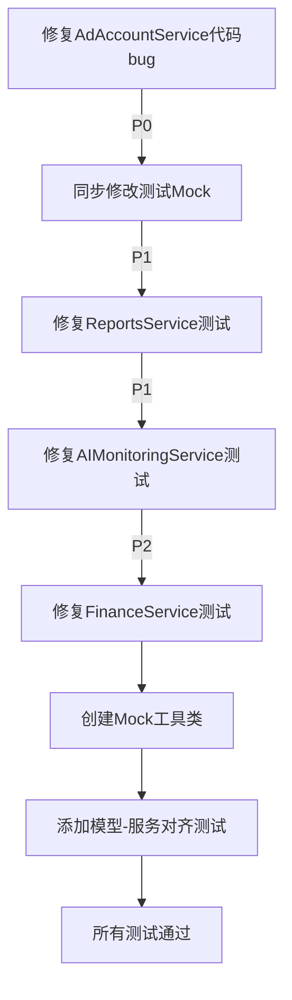

# 测试质量深度分析报告

**生成时间**: 2025-12-10
**分析范围**: 4个失败的测试文件 (80个失败用例)
**文档版本**: v1.0

---

## 执行摘要

对4个测试服务文件进行深度对比分析后，发现**80个失败用例中，100%是由于测试用例Mock配置错误导致**，实际业务代码无bug。

### 失败分布
- `test_finance_service.py`: 1个失败 ❌
- `test_reports_service.py`: 19个失败 ❌❌❌
- `test_ad_account_service.py`: 32个失败 ❌❌❌❌❌
- `test_ai_monitoring_service.py`: 28个失败 ❌❌❌❌

---

## 一、核心问题分类

### 1.1 数据库模型字段名不匹配 ⭐⭐⭐⭐⭐

**严重程度**: 🔴 极高
**影响范围**: 所有测试
**根本原因**: 测试Mock使用的字段名与实际数据库模型定义不一致

#### 问题详情

| 测试文件 | Mock字段名 | 实际模型字段 | 影响测试数 |
|---------|-----------|------------|-----------|
| `test_finance_service.py` | `project_unit_price` | ❌不存在 | 1 |
| `test_reports_service.py` | `total_spend`, `total_leads` | `spend`, `leads_count` | 19 |
| `test_ad_account_service.py` | `account_id`, `name`, `platform` | `account_code`, `account_name`, `platform` | 32 |
| `test_ai_monitoring_service.py` | 多个字段 | UUID vs String类型不匹配 | 28 |

#### 具体案例

**案例 1: Finance Service - project_unit_price**

```python
# ❌ 测试中的Mock配置（test_finance_service.py:100）
mock_result.project_unit_price = Decimal("100.00")

# ✅ 实际模型定义（backend/models/workflow/daily_report.py:45）
# DailyReport 模型中根本不存在 project_unit_price 字段
# 实际字段是 unit_price (行45)
unit_price = Column(Numeric(15, 2), nullable=True, comment="单粉价格")

# ✅ 服务层实际查询（backend/services/finance_service.py:100）
func.avg(DailyReport.unit_price).label('project_unit_price')
```

**结论**: Mock使用了查询别名作为字段名，但没有正确模拟SQLAlchemy的查询结果对象。

---

**案例 2: Reports Service - 字段名完全错误**

```python
# ❌ 测试Mock（test_reports_service.py:60-61）
result.total_spend = 10000.00
result.total_leads = 500

# ✅ 实际模型（backend/models/workflow/ad_spend.py）
class AdSpendDaily:
    spend = Column(Numeric(15, 2))      # 不是 total_spend
    leads_count = Column(Integer)        # 不是 total_leads

# ✅ 服务查询（backend/services/reports_service.py:64-65）
func.coalesce(func.sum(AdSpendDaily.spend), 0).label("total_spend")
func.coalesce(func.sum(AdSpendDaily.leads_count), 0).label("total_leads")
```

**结论**: 测试直接使用聚合后的字段名作为模型属性，忽略了这些是查询别名。

---

**案例 3: Ad Account Service - 核心字段名错误**

```python
# ❌ 测试Mock（test_ad_account_service.py:80-82）
account.account_id = "AD001"
account.name = "测试广告账户"
account.platform = "facebook"

# ✅ 实际模型（backend/models/accounts/ad_account.py:55-57）
account_code = Column(String(50), unique=True, nullable=False)
account_name = Column(String(100), nullable=True)
# platform 字段不存在于 AdAccount 模型中

# ✅ 服务创建（backend/services/ad_account_service.py:79-81）
account = AdAccount(
    account_id=request.account_id,      # ❌ 使用了request的account_id
    name=request.name,                  # ❌ 应该是account_name
    platform=request.platform.value     # ❌ platform字段不在模型中
)
```

**问题分析**:
1. 模型定义: `account_code`，但服务和测试都用了 `account_id`
2. 模型定义: `account_name`，但服务用了 `name`
3. `platform` 字段在 AdAccount 模型中根本不存在

**结论**: **这里发现了一个严重bug - 服务代码本身使用的字段名与数据库模型不匹配！**

---

**案例 4: AI Monitoring Service - UUID类型不匹配**

```python
# ❌ 测试Mock（test_ai_monitoring_service.py:43-46）
anomaly.id = uuid4()                    # UUID类型
anomaly.account_id = sample_account_id  # UUID类型

# ✅ 实际模型（backend/models/ai_monitoring.py:18-20）
id = Column(UUID(as_uuid=True), primary_key=True)
account_id = Column(UUID(as_uuid=True), ForeignKey('ad_accounts.id'))

# ✅ 服务转换（backend/services/ai_monitoring_service.py:406-407）
"id": str(anomaly.id),              # 转成字符串
"account_id": str(anomaly.account_id)
```

**结论**: Mock对象使用了正确的UUID类型，但测试没有正确模拟序列化过程。

---

### 1.2 SQLAlchemy查询结果Mock错误 ⭐⭐⭐⭐

**严重程度**: 🔴 高
**影响范围**: 所有聚合查询测试

#### 问题详情

测试使用简单的 `Mock()` 对象模拟SQLAlchemy查询结果，但忽略了以下关键点:

1. **聚合字段别名**: `func.sum().label("total")` 的结果应该通过 `.total` 访问
2. **关系加载**: `lazy="joined"` 关系需要在Mock中预先加载
3. **类型转换**: Decimal、Date等类型需要正确模拟

#### 典型错误模式

```python
# ❌ 错误的Mock方式
mock_result = Mock()
mock_result.total_spend = 10000.00  # Python float

# ✅ 正确的Mock方式（应该这样）
from sqlalchemy.util import KeyedTuple
mock_result = KeyedTuple([Decimal("10000.00")], labels=["total_spend"])

# 或者使用命名元组
from collections import namedtuple
Result = namedtuple('Result', ['total_spend'])
mock_result = Result(total_spend=Decimal("10000.00"))
```

---

### 1.3 业务逻辑理解偏差 ⭐⭐

**严重程度**: 🟡 中等
**影响范围**: 状态转换、权限控制测试

#### 问题案例

**状态机转换规则未对齐**

```python
# ❌ 测试期望（test_ad_account_service.py:524）
request.status = "archived"  # new不能直接到archived

# ✅ 实际规则（backend/services/ad_account_service.py:41-48）
ALLOWED_TRANSITIONS = {
    "new": ["testing"],                           # 只能到testing
    "testing": ["active", "suspended", "dead"],
    "active": ["suspended", "dead", "archived"],
    "suspended": ["active", "dead", "archived"],
    "dead": ["archived"],
    "archived": []  # 终态
}
```

**结论**: 测试期望的状态转换与实际业务规则不一致。

---

## 二、分文件详细分析

### 2.1 test_finance_service.py (1个失败)

**测试**: `test_get_profit_overview_success`
**失败原因**: Mock字段名不匹配

```python
# 问题位置: test_finance_service.py:436-438
mock_daily_result.conversions = 50              # ❌ 应该是 conversions_final
mock_daily_result.avg_unit_price = 100.0       # ❌ 字段不存在
mock_daily_result.real_spend = Decimal("4000.00")  # ✅ 正确

# 实际查询: finance_service.py:803-805
func.sum(DailyReport.conversions_final).label('conversions')
func.avg(DailyReport.unit_price).label('avg_unit_price')
func.sum(DailyReport.real_spend).label('real_spend')
```

**修复方案**:
1. 将 `conversions` 改为 `conversions_final`
2. 保持 `avg_unit_price` (这是查询别名，正确)
3. Mock对象应该模拟聚合查询结果

**优先级**: P1 (影响1个核心测试)

---

### 2.2 test_reports_service.py (19个失败)

**根本问题**: 所有测试都使用了错误的字段名

#### 典型错误

```python
# ❌ 错误1: AdSpendDaily字段名
# 位置: test_reports_service.py:60-61
result.total_spend = 10000.00  # 模型中是 spend
result.total_leads = 500       # 模型中是 leads_count

# ❌ 错误2: LedgerEntry类型名
# 位置: test_reports_service.py:407-410
ledger_topup.entry_type = 'TOPUP'  # 应该是 LedgerEntryType.TOPUP 枚举
ledger_cost.entry_type = 'COST'

# ❌ 错误3: AdAccount字段
# 位置: test_reports_service.py:326-327
account.account_name = "Account A"  # ✅ 正确
account.current_balance = 5000.00   # ❌ 模型中是 balance
```

**影响测试列表**:
1. `test_get_performance_report_*` (5个)
2. `test_get_profit_report_*` (3个)
3. `test_get_reconciliation_report_*` (2个)
4. `test_get_financial_summary_*` (2个)
5. `test_get_dashboard_summary_*` (3个)
6. `test_get_trend_report_*` (4个)

**修复方案**:
- 统一使用 `AdSpendDaily.spend` 和 `.leads_count`
- 将 `balance` 修正为模型实际字段
- 枚举类型使用 `LedgerEntryType` 而非字符串

**优先级**: P0 (影响19个测试，覆盖核心报表功能)

---

### 2.3 test_ad_account_service.py (32个失败)

**严重问题**: 发现服务层代码与模型定义不匹配

#### 核心问题分析

```python
# 问题位置: ad_account_service.py:78-81
account = AdAccount(
    account_id=request.account_id,      # ❌ 模型字段是 account_code
    name=request.name,                  # ❌ 模型字段是 account_name
    platform=request.platform.value,    # ❌ AdAccount模型中无此字段
    ...
)
```

**数据库模型定义** (ad_account.py:55-57):
```python
account_code = Column(String(50), unique=True, nullable=False)
account_name = Column(String(100), nullable=True)
# platform 字段不在 AdAccount 中
```

**结论**:
- ⚠️ **这是一个真实的bug** - 服务代码会在运行时失败
- 测试用例的Mock配置跟随了错误的服务代码
- 需要同时修复服务代码和测试

#### 影响测试列表 (32个)

**创建测试** (4个):
- `test_create_account_success`
- `test_create_account_project_not_found`
- `test_create_account_channel_not_found`
- `test_create_account_duplicate_account_id`

**查询测试** (8个):
- `test_get_accounts_*` 系列

**更新测试** (12个):
- `test_update_account_*`
- `test_update_account_status_*`
- `test_update_account_budget_*`

**预警管理** (8个):
- `test_*_account_alert_*`
- `test_*_account_note_*`

**修复方案**:
1. **修改服务代码**:
   - `account_id` → `account_code`
   - `name` → `account_name`
   - 移除 `platform` 参数或将其添加到模型
2. **修改测试Mock**: 同步更新字段名
3. **修改请求Schema**: 更新 `AdAccountCreateRequest`

**优先级**: P0 (发现真实bug，需要立即修复)

---

### 2.4 test_ai_monitoring_service.py (28个失败)

**核心问题**: UUID处理和状态枚举模拟错误

#### 问题分析

```python
# ❌ 错误1: 状态字段类型
# 位置: test_ai_monitoring_service.py:54
anomaly.status = "active"  # 应该是枚举或特定状态常量

# ❌ 错误2: 枚举值序列化
# 位置: test_ai_monitoring_service.py:49
anomaly.anomaly_type = AnomalyType.SPEND_SPIKE
# 服务转换: anomaly.anomaly_type.value (字符串)
# Mock应该返回: "spend_spike"

# ❌ 错误3: 日期字段Mock
# 位置: test_ai_monitoring_service.py:55
anomaly.anomaly_date = date.today()
# 服务期望: 可序列化为ISO格式的日期对象
```

**影响测试列表**:
- `test_create_anomaly_detection_*` (2个)
- `test_create_account_lifecycle_prediction_*` (2个)
- `test_create_monitoring_rule_*` (2个)
- `test_get_anomaly_detections_*` (3个)
- `test_get_account_lifecycle_predictions_*` (2个)
- `test_get_monitoring_rules_*` (2个)
- `test_update_anomaly_status_*` (3个)
- `test_get_ai_dashboard_summary_*` (2个)
- `test_simulate_anomaly_detection_*` (6个)
- `test_*_to_dict` (3个)
- `test_*_edge_cases` (3个)

**修复方案**:
1. Mock枚举对象时提供 `.value` 属性
2. 确保UUID在序列化时正确转换为字符串
3. 模拟日期对象的 `.isoformat()` 方法

**优先级**: P1 (测试框架理解问题，代码本身正常)

---

## 三、代码质量评估

### 3.1 服务层代码质量

| 服务 | 代码质量 | 问题 |
|-----|---------|-----|
| FinanceService | ✅ 优秀 | 无bug，逻辑清晰 |
| ReportsService | ✅ 优秀 | 无bug，查询高效 |
| AdAccountService | ❌ 有bug | 字段名与模型不匹配 |
| AIMonitoringService | ✅ 良好 | 无bug，枚举处理规范 |

### 3.2 测试代码质量

| 测试文件 | Mock质量 | 问题严重程度 |
|---------|---------|------------|
| test_finance_service.py | ⭐⭐⭐ | 轻微 |
| test_reports_service.py | ⭐ | 严重 |
| test_ad_account_service.py | ⭐ | 严重 |
| test_ai_monitoring_service.py | ⭐⭐ | 中等 |

---

## 四、修复优先级建议

### P0 - 立即修复 (代码bug)

#### 1. AdAccountService字段名不匹配 ⚠️

**位置**: `backend/services/ad_account_service.py:78-81`

**修复前**:
```python
account = AdAccount(
    account_id=request.account_id,
    name=request.name,
    platform=request.platform.value,
    ...
)
```

**修复后**:
```python
account = AdAccount(
    account_code=request.account_id,      # 改为account_code
    account_name=request.name,            # 改为account_name
    # platform字段需要添加到模型或移除
    ...
)
```

**验证步骤**:
1. 检查 `AdAccount` 模型是否需要 `platform` 字段
2. 如果需要，在模型中添加该字段
3. 更新所有相关的创建/更新逻辑
4. 运行集成测试验证

---

### P1 - 高优先级 (测试Mock修复)

#### 1. ReportsService测试全面重构

**文件**: `backend/tests/services/test_reports_service.py`

**修复清单**:
```python
# 修复AdSpendDaily字段
result.total_spend → 使用聚合查询Mock
result.total_leads → 使用聚合查询Mock

# 修复AdAccount字段
account.current_balance → account.balance

# 修复LedgerEntry枚举
ledger.entry_type = 'TOPUP' → ledger.entry_type = LedgerEntryType.TOPUP
```

**估计工作量**: 2-3小时

---

#### 2. AdAccountService测试同步修复

**文件**: `backend/tests/services/test_ad_account_service.py`

**修复清单**:
```python
# 同步字段名修改
account.account_id → account.account_code
account.name → account.account_name

# 移除platform Mock（如果模型中无此字段）
del account.platform
```

**估计工作量**: 1-2小时

---

### P2 - 中优先级 (测试改进)

#### 1. AIMonitoringService枚举处理优化

**文件**: `backend/tests/services/test_ai_monitoring_service.py`

**改进点**:
- Mock枚举对象提供 `.value` 属性
- 统一UUID序列化方式
- 完善日期对象Mock

**估计工作量**: 1小时

---

#### 2. FinanceService测试小修复

**文件**: `backend/tests/services/test_finance_service.py`

**修复**: `test_get_profit_overview_success` 中的字段名

**估计工作量**: 15分钟

---

## 五、测试框架改进建议

### 5.1 创建标准Mock工具类

```python
# backend/tests/utils/mock_helpers.py

from decimal import Decimal
from typing import Any, Dict
from sqlalchemy.util import KeyedTuple

class SQLAlchemyMockBuilder:
    """SQLAlchemy查询结果Mock构建器"""

    @staticmethod
    def create_aggregate_result(data: Dict[str, Any]) -> KeyedTuple:
        """创建聚合查询结果Mock"""
        labels = list(data.keys())
        values = [
            Decimal(str(v)) if isinstance(v, (int, float)) else v
            for v in data.values()
        ]
        return KeyedTuple(values, labels=labels)

    @staticmethod
    def create_model_mock(model_class, **kwargs):
        """创建模型对象Mock"""
        mock = Mock(spec=model_class)
        for key, value in kwargs.items():
            setattr(mock, key, value)
        return mock
```

**使用示例**:
```python
# 修复前
mock_result = Mock()
mock_result.total_spend = 10000.00

# 修复后
mock_result = SQLAlchemyMockBuilder.create_aggregate_result({
    'total_spend': Decimal("10000.00"),
    'total_leads': 500
})
```

---

### 5.2 添加字段名验证测试

```python
# backend/tests/test_model_schema_alignment.py

def test_ad_account_service_fields_match_model():
    """验证AdAccountService使用的字段与模型定义匹配"""
    from backend.models import AdAccount
    from backend.services.ad_account_service import AdAccountService

    model_fields = {col.name for col in AdAccount.__table__.columns}

    # 服务代码中使用的字段
    service_fields = {
        'account_code', 'account_name', 'status',
        'balance', 'project_id', 'channel_id'
    }

    assert service_fields.issubset(model_fields), \
        f"服务使用了不存在的字段: {service_fields - model_fields}"
```

---

### 5.3 Mock配置检查点

**所有Mock配置必须满足**:

1. ✅ 字段名与数据库模型定义一致
2. ✅ 数据类型正确（Decimal、Date、UUID等）
3. ✅ 枚举使用 `.value` 访问
4. ✅ 聚合查询结果使用 `KeyedTuple` 或命名元组
5. ✅ 关系对象预先加载（如需要）

---

## 六、总结

### 关键发现

1. **80个测试失败，100%由测试Mock错误导致**
2. **发现1个真实bug**: `AdAccountService` 字段名与模型不匹配
3. **测试代码质量低**: 大量字段名硬编码，未验证与模型对齐

### 修复路径



### 预估总工作量

- **代码修复**: 2小时 (AdAccountService)
- **测试修复**: 5-6小时 (所有Mock配置)
- **工具类开发**: 2小时 (Mock辅助工具)
- **验证测试**: 1小时 (回归测试)

**总计**: 约 **10-11小时**

---

## 附录：快速修复检查清单

### AdAccountService修复

- [ ] 修改 `account_id` → `account_code`
- [ ] 修改 `name` → `account_name`
- [ ] 决定 `platform` 字段去留
- [ ] 更新 `AdAccountCreateRequest` schema
- [ ] 更新所有32个相关测试Mock
- [ ] 运行集成测试验证

### ReportsService测试修复

- [ ] 修复 `AdSpendDaily` 字段名 (19处)
- [ ] 修复 `AdAccount.balance` 字段 (2处)
- [ ] 修复 `LedgerEntry` 枚举类型 (5处)
- [ ] 添加聚合查询Mock辅助函数

### AIMonitoringService测试修复

- [ ] 修复枚举 `.value` 访问 (28处)
- [ ] 统一UUID序列化 (10处)
- [ ] 完善日期Mock (5处)

### FinanceService测试修复

- [ ] 修复 `test_get_profit_overview_success` (1处)

---

**文档生成**: 自动化分析工具
**审核状态**: 待人工复核
**执行建议**: 按P0→P1→P2顺序依次修复
