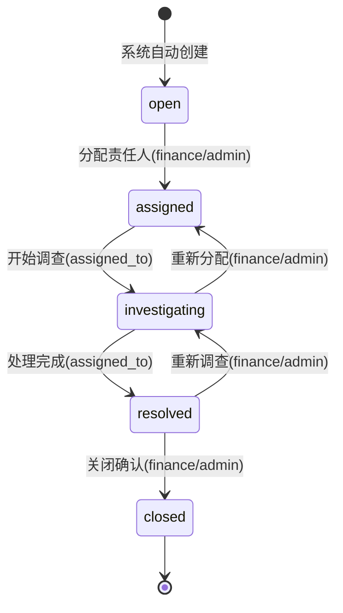

# Change: 对账中控系统 SoT 扩展

**Change-ID**: `add-reconciliation-control-center`
**Status**: DRAFT
**Version**: 1.0
**Date**: 2025-12-26
**Author**: Architecture Team
**PRD Reference**: 公司运营与对账中控系统（MVP）v1.0

---

## Why

### 原始问题

根据 PRD v1.0 的业务分析，当前系统存在以下核心问题：

1. **对账能力缺失**：财务每天需要人工拼合多来源数据（投手日报、广告账户后台、代理商充值回执、账户余额/押款、甲方确认进粉），无法自动化验证"守恒公式"

2. **结算规则单一**：现有 `projects.unit_price` 仅支持固定单价 (fixed)，无法支持阶梯计价 (tiered) 和加成计价 (markup)

3. **押款管理缺失**：`ad_accounts` 表缺少押款 (deposit) 字段，无法完成对账三本账的守恒校验

4. **差异单闭环缺失**：对账发现差异后，缺乏系统化的工单分配、追踪、关闭机制

5. **余额快照缺失**：无法按日期追溯账户余额变化历史，对账无法定位差异发生的具体时间点

### 业务价值

| 价值维度 | 当前状态 | 目标状态 | 预期收益 |
|---------|---------|---------|---------|
| 每日对账耗时 | 人工加总 2-3 小时 | 系统自动 + 处理红灯 ≤30分钟 | 降低 ≥50% |
| 月结出表耗时 | 拼表重算 3-5 天 | 一键生成 ≤1 工作日 | 降低 ≥80% |
| 差异定位耗时 | 翻截图/扯皮数小时 | 系统定位 ≤10 分钟 | 降低 ≥90% |
| 对账差异闭环率 | 无追踪 | ≥90% 在 T+2 工作日内关闭 | 风险可控 |

---

## What Changes

### 变更总览

| 组件 | 操作 | 说明 | 优先级 |
|------|------|------|--------|
| DATA_SCHEMA.md | 修改 | 扩展 projects 表、ad_accounts 表 | P0 |
| DATA_SCHEMA.md | 新建 | 新增 balance_snapshots 表 | P0 |
| DATA_SCHEMA.md | 新建 | 新增 reconciliation_issues 表 | P0 |
| DATA_SCHEMA.md | 新建 | 新增 settlement_rules 表 | P1 |
| STATE_MACHINE.md | 修改 | 新增 ReconciliationIssue 状态机 | P0 |
| BUSINESS_RULES.md | 新建 | 新增 BR-REC-* 对账规则 | P0 |
| BUSINESS_RULES.md | 新建 | 新增 BR-SET-* 结算规则 | P1 |
| API_SOT.md | 新建 | 新增对账中心 API 端点 | P1 |
| ERROR_CODES_SOT.md | 修改 | 新增 REC-* 错误码 | P0 |

### 1. DATA_SCHEMA.md 扩展

#### 1.1 projects 表扩展

```sql
-- 新增字段
ALTER TABLE projects ADD COLUMN settlement_type VARCHAR(20) 
  DEFAULT 'fixed' 
  CHECK (settlement_type IN ('fixed', 'tiered', 'markup'));

ALTER TABLE projects ADD COLUMN settlement_rules_id UUID 
  REFERENCES settlement_rules(id);

-- settlement_type 说明：
-- fixed:  固定单价，使用 unit_price 字段
-- tiered: 阶梯计价，使用 settlement_rules 表配置
-- markup: 加成计价，使用 settlement_rules 表配置
```

#### 1.2 ad_accounts 表扩展

```sql
-- 新增押款字段
ALTER TABLE ad_accounts ADD COLUMN deposit DECIMAL(15,2) 
  DEFAULT 0.00 
  CHECK (deposit >= 0);

-- 新增押款变化时间戳
ALTER TABLE ad_accounts ADD COLUMN deposit_updated_at TIMESTAMP WITH TIME ZONE;

-- 字段说明：
-- deposit: 当前押款金额（代理商扣押的保证金）
-- deposit_updated_at: 押款最后更新时间
```

#### 1.3 balance_snapshots 表（新建）

```sql
CREATE TABLE balance_snapshots (
  id UUID PRIMARY KEY DEFAULT gen_random_uuid(),
  
  -- 快照对象
  ad_account_id UUID NOT NULL REFERENCES ad_accounts(id),
  snapshot_date DATE NOT NULL,
  
  -- 快照数据
  balance DECIMAL(15,2) NOT NULL,           -- 当日余额
  deposit DECIMAL(15,2) NOT NULL DEFAULT 0, -- 当日押款
  remaining_balance DECIMAL(15,2) NOT NULL, -- 当日剩余可用
  
  -- 数据来源
  source VARCHAR(20) NOT NULL DEFAULT 'manual'
    CHECK (source IN ('manual', 'api', 'import')),
  
  -- 审计字段
  created_by UUID NOT NULL REFERENCES users(id),
  created_at TIMESTAMP WITH TIME ZONE DEFAULT NOW(),
  notes TEXT,
  
  -- 约束
  UNIQUE (ad_account_id, snapshot_date)
);

-- 索引
CREATE INDEX idx_balance_snapshots_date ON balance_snapshots(snapshot_date);
CREATE INDEX idx_balance_snapshots_account ON balance_snapshots(ad_account_id);
```

#### 1.4 reconciliation_issues 表（新建）

```sql
CREATE TABLE reconciliation_issues (
  id UUID PRIMARY KEY DEFAULT gen_random_uuid(),
  
  -- 关联对账批次
  reconciliation_batch_id UUID REFERENCES reconciliation_batches(id),
  
  -- 差异定位（账户×日期×差异项）
  ad_account_id UUID REFERENCES ad_accounts(id),
  issue_date DATE NOT NULL,
  issue_type VARCHAR(30) NOT NULL
    CHECK (issue_type IN (
      'topup_mismatch',      -- 充值差异
      'spend_mismatch',      -- 消耗差异
      'deposit_change',      -- 押款变化
      'balance_anomaly',     -- 余额异常
      'snapshot_missing',    -- 快照缺失
      'conservation_failed', -- 守恒校验失败
      'other'
    )),
  
  -- 差异金额
  expected_amount DECIMAL(15,2),
  actual_amount DECIMAL(15,2),
  difference_amount DECIMAL(15,2) GENERATED ALWAYS AS 
    (COALESCE(actual_amount, 0) - COALESCE(expected_amount, 0)) STORED,
  
  -- 状态机
  status VARCHAR(20) NOT NULL DEFAULT 'open'
    CHECK (status IN ('open', 'assigned', 'investigating', 'resolved', 'closed')),
  
  -- 责任分配
  assigned_to UUID REFERENCES users(id),
  assigned_at TIMESTAMP WITH TIME ZONE,
  
  -- 处理过程
  resolution_type VARCHAR(30)
    CHECK (resolution_type IN (
      'data_correction',     -- 数据修正
      'ledger_adjustment',   -- 账本调整
      'external_confirm',    -- 外部确认（代理商/甲方）
      'write_off',           -- 核销
      'false_positive'       -- 误报
    )),
  resolution_note TEXT,
  resolved_at TIMESTAMP WITH TIME ZONE,
  resolved_by UUID REFERENCES users(id),
  
  -- 附件
  attachments JSONB DEFAULT '[]'::jsonb,
  
  -- 审计字段
  created_at TIMESTAMP WITH TIME ZONE DEFAULT NOW(),
  created_by UUID NOT NULL REFERENCES users(id),
  updated_at TIMESTAMP WITH TIME ZONE DEFAULT NOW(),
  
  -- SLA 追踪
  sla_deadline TIMESTAMP WITH TIME ZONE,
  sla_breached BOOLEAN DEFAULT FALSE
);

-- 索引
CREATE INDEX idx_rec_issues_status ON reconciliation_issues(status);
CREATE INDEX idx_rec_issues_date ON reconciliation_issues(issue_date);
CREATE INDEX idx_rec_issues_assigned ON reconciliation_issues(assigned_to) WHERE assigned_to IS NOT NULL;
CREATE INDEX idx_rec_issues_batch ON reconciliation_issues(reconciliation_batch_id);
```

#### 1.5 settlement_rules 表（新建）

```sql
CREATE TABLE settlement_rules (
  id UUID PRIMARY KEY DEFAULT gen_random_uuid(),
  
  -- 规则名称
  name VARCHAR(100) NOT NULL,
  rule_type VARCHAR(20) NOT NULL
    CHECK (rule_type IN ('tiered', 'markup')),
  
  -- 规则配置（JSONB）
  config JSONB NOT NULL,
  
  -- 示例 tiered 配置:
  -- {
  --   "tiers": [
  --     {"min": 0, "max": 1000, "price": 50},
  --     {"min": 1001, "max": 5000, "price": 45},
  --     {"min": 5001, "max": null, "price": 40}
  --   ],
  --   "calculation_basis": "cumulative" | "incremental"
  -- }
  
  -- 示例 markup 配置:
  -- {
  --   "base_cost_field": "real_spend",
  --   "markup_type": "percentage" | "fixed",
  --   "markup_value": 15  -- 15% 或 固定值
  -- }
  
  -- 生效期
  effective_from DATE NOT NULL,
  effective_to DATE,
  
  -- 审计字段
  created_by UUID NOT NULL REFERENCES users(id),
  created_at TIMESTAMP WITH TIME ZONE DEFAULT NOW(),
  updated_at TIMESTAMP WITH TIME ZONE DEFAULT NOW(),
  
  -- 约束
  CONSTRAINT valid_effective_period CHECK (effective_to IS NULL OR effective_to > effective_from)
);
```

### 2. STATE_MACHINE.md 扩展

#### 2.1 ReconciliationIssue 状态机（新增 §11.4）

```
状态枚举: open, assigned, investigating, resolved, closed
终态: closed
初始态: open
```

**状态流转图**:


**状态流转白名单**:
```python
RECONCILIATION_ISSUE_TRANSITIONS = {
    "open": ["assigned"],
    "assigned": ["investigating"],
    "investigating": ["resolved", "assigned"],
    "resolved": ["closed", "investigating"],
    "closed": []  # 终态
}
```

**角色权限**:
| 状态转换 | 允许角色 | 审计要求 |
|---------|---------|---------|
| open → assigned | finance, admin | [AUDIT] 记录分配人 |
| assigned → investigating | assigned_to | [AUDIT] 记录开始时间 |
| investigating → resolved | assigned_to | [AUDIT] 记录处理结论 |
| investigating → assigned | finance, admin | [AUDIT] 记录重分配原因 |
| resolved → closed | finance, admin | [AUDIT] 记录关闭确认 |
| resolved → investigating | finance, admin | [AUDIT] 记录重开原因 |

### 3. BUSINESS_RULES.md 扩展

#### 3.1 对账规则（BR-REC-*）

```markdown
### BR-REC-001: 对账守恒公式

**规则定义**:
对于任意账户在任意时间段 [T1, T2]，必须满足：

```
Σ(充值到账) - Σ(实际消耗) = Δ(余额) + Δ(押款)
```

其中：
- Σ(充值到账) = SUM(ledger_entries.amount) WHERE entry_type='TOPUP' AND occurred_at BETWEEN T1 AND T2
- Σ(实际消耗) = SUM(ABS(ledger_entries.amount)) WHERE entry_type='COST' AND occurred_at BETWEEN T1 AND T2
- Δ(余额) = balance_snapshots(T2).balance - balance_snapshots(T1).balance
- Δ(押款) = balance_snapshots(T2).deposit - balance_snapshots(T1).deposit

**校验阈值**:
- 差异 ≤ ¥1.00：自动通过（浮点精度容差）
- 差异 > ¥1.00 且 ≤ ¥100.00：生成黄灯警告
- 差异 > ¥100.00：生成红灯差异单

**触发时机**:
- 每日 02:00 批量校验前一日
- 手动触发对账批次时

---

### BR-REC-002: 差异单 SLA 规则

**规则定义**:
- 红灯差异单必须在 T+2 工作日内关闭
- 黄灯差异单必须在 T+5 工作日内关闭
- 超时未关闭自动上报 CEO

**SLA 计算**:
- sla_deadline = created_at + (2 或 5 工作日)
- sla_breached = NOW() > sla_deadline AND status NOT IN ('resolved', 'closed')

---

### BR-REC-003: 快照缺失处理

**规则定义**:
- 对账期间内任意账户缺少余额快照，生成 snapshot_missing 类型差异单
- 差异单分配给户管 (account_manager)
- 补录快照后，差异单自动流转至 investigating

---

### BR-REC-004: 押款变化记录

**规则定义**:
- 押款变化必须记录变化原因
- 押款变化 ≥ ¥1000.00 需要财务审批
- 押款变化自动记录到 ledger_entries（entry_type='DEPOSIT_CHANGE'）
```

#### 3.2 结算规则（BR-SET-*）

```markdown
### BR-SET-001: Fixed 结算规则

**规则定义**:
```
revenue = conversions_final × unit_price
```

**适用条件**:
- projects.settlement_type = 'fixed'
- 使用 projects.unit_price 字段

---

### BR-SET-002: Tiered 结算规则

**规则定义**:
根据 settlement_rules.config.tiers 配置，按阶梯计算收入。

**计算模式**:
- cumulative（累计）: 所有粉数按达到的最高阶梯价格计算
- incremental（递增）: 各阶梯内的粉数按该阶梯价格分别计算

**示例（incremental 模式）**:
```
config.tiers = [
  {min: 0, max: 1000, price: 50},
  {min: 1001, max: 5000, price: 45},
  {min: 5001, max: null, price: 40}
]

conversions_final = 3000

revenue = 1000 × 50 + 2000 × 45 = 50000 + 90000 = 140000
```

**约束**:
- tiers 必须连续无缝隙
- min 必须 = 上一阶梯 max + 1
- 最后一个阶梯 max 必须为 null

---

### BR-SET-003: Markup 结算规则

**规则定义**:
```
revenue = base_cost × (1 + markup_percentage) 
或
revenue = base_cost + markup_fixed
```

**配置字段**:
- base_cost_field: 'real_spend' | 'raw_spend'
- markup_type: 'percentage' | 'fixed'
- markup_value: 数值

**约束**:
- markup_percentage 范围: 0-100
- markup_fixed 必须 > 0
```

### 4. ERROR_CODES_SOT.md 扩展

```markdown
### REC-* 对账错误码

| 错误码 | HTTP | 说明 | 触发场景 |
|--------|------|------|---------|
| REC-001 | 400 | 对账守恒校验失败 | 守恒公式差异超阈值 |
| REC-002 | 400 | 快照数据缺失 | 对账期间缺少余额快照 |
| REC-003 | 400 | 差异单状态流转非法 | 违反状态机规则 |
| REC-004 | 403 | 差异单操作权限不足 | 非责任人尝试处理 |
| REC-005 | 400 | SLA 已超时 | 差异单超过关闭期限 |
| REC-006 | 400 | 差异单未分配 | 尝试处理未分配的差异单 |

### SET-* 结算错误码

| 错误码 | HTTP | 说明 | 触发场景 |
|--------|------|------|---------|
| SET-001 | 400 | 结算规则配置无效 | tiered 阶梯不连续 |
| SET-002 | 400 | 结算类型不支持 | 使用未定义的 settlement_type |
| SET-003 | 400 | 结算规则生效期冲突 | 同一项目存在重叠生效期 |
| SET-004 | 400 | 结算规则缺失 | tiered/markup 类型缺少规则配置 |
```

---

## Impact

### 影响范围

**Affected SoT Documents**:
| 文档 | 版本 | 变更类型 | 影响章节 |
|------|------|---------|---------|
| DATA_SCHEMA.md | v5.2 → v5.3 | MODIFIED | §3.2.1, §3.3.3, 新增 §3.5 |
| STATE_MACHINE.md | v2.6 → v2.7 | MODIFIED | 新增 §11.4 |
| BUSINESS_RULES.md | v3.2 → v4.0 | MODIFIED | 新增 BR-REC-*, BR-SET-* |
| ERROR_CODES_SOT.md | v2.1 → v2.2 | MODIFIED | 新增 REC-*, SET-* |
| API_SOT.md | v9.0 → v9.1 | MODIFIED | 新增 §15 对账中心 API |
| LEDGER_SOT.md | v1.1 → v1.2 | MODIFIED | 新增 DEPOSIT_CHANGE 处理 |

**Affected Code**:
```
backend/
├── models/
│   ├── balance_snapshot.py         # 新增
│   ├── reconciliation_issue.py     # 新增
│   ├── settlement_rule.py          # 新增
│   ├── project.py                  # 修改
│   └── ad_account.py               # 修改
├── services/
│   ├── reconciliation_service.py   # 新增
│   ├── settlement_service.py       # 新增
│   └── snapshot_service.py         # 新增
├── routers/
│   ├── reconciliation.py           # 新增
│   ├── snapshots.py                # 新增
│   └── settlements.py              # 新增
└── schemas/
    ├── reconciliation.py           # 新增
    ├── snapshot.py                 # 新增
    └── settlement.py               # 新增
```

**Affected Tests**:
```
backend/tests/
├── services/
│   ├── test_reconciliation_service.py  # 新增
│   ├── test_settlement_service.py      # 新增
│   └── test_snapshot_service.py        # 新增
├── routers/
│   ├── test_reconciliation_api.py      # 新增
│   └── test_settlement_api.py          # 新增
└── integration/
    └── test_reconciliation_flow.py     # 新增
```

### 兼容性

**Breaking Changes**: 无

**向后兼容**:
- projects.settlement_type 默认值为 'fixed'，现有项目无需迁移
- ad_accounts.deposit 默认值为 0.00，现有账户无需迁移
- 新增表不影响现有功能

### 依赖关系

| 依赖文档 | 版本 | 用途 |
|---------|------|------|
| MASTER.md | v4.4 | Phase 1/2 边界定义 |
| STATE_MACHINE.md | v2.6 | 现有状态机规范 |
| DATA_SCHEMA.md | v5.2 | 现有数据模型 |
| LEDGER_SOT.md | v1.1 | 账本规则 |
| AUTH_SPEC.md | v2.0 | 权限控制 |

---

## Migration

### 数据库迁移策略

**Phase 0: Schema 迁移**
```bash
# 生成迁移文件
alembic revision --autogenerate -m "add_reconciliation_control_center"

# 迁移步骤
1. 新增 settlement_rules 表
2. 新增 balance_snapshots 表
3. 新增 reconciliation_issues 表
4. 修改 projects 表（新增字段）
5. 修改 ad_accounts 表（新增字段）
```

**Phase 1: 数据初始化**
```sql
-- 现有项目默认使用 fixed 结算
UPDATE projects SET settlement_type = 'fixed' WHERE settlement_type IS NULL;

-- 现有账户押款初始化为 0
UPDATE ad_accounts SET deposit = 0.00 WHERE deposit IS NULL;
```

### 系统开始日策略

根据 PRD 定义：
- 设置 `system_start_date = 2025-01-01`（或实际上线日期）
- 系统开始日后强制走系统闭环
- 系统开始日前数据仅做查询参考，不参与对账校验

---

## Risks & Rollback

### 风险评估

| 风险 | 等级 | 概率 | 缓解措施 |
|------|------|------|---------|
| 守恒公式计算性能 | 中 | 中 | 预计算+缓存，增量更新 |
| 阶梯规则配置错误 | 中 | 中 | JSON Schema 校验 + UI 辅助 |
| 快照数据不完整 | 高 | 高 | 缺失提醒 + 补录队列 |
| 差异单积压 | 中 | 中 | SLA 自动提醒 + 上报机制 |

### 回滚策略

**Level 1: Feature Flag 回滚**
```python
# settings.py
FEATURE_FLAGS = {
    "reconciliation_enabled": False,  # 关闭对账功能
    "tiered_settlement_enabled": False,  # 关闭阶梯结算
}
```

**Level 2: 数据库回滚**
```bash
alembic downgrade -1  # 回滚最近一次迁移
```

**Level 3: 代码回滚**
```bash
git revert <commit-hash>
```

---

## Scope

### In Scope ✅

- [x] balance_snapshots 表设计与实现
- [x] reconciliation_issues 表设计与实现
- [x] settlement_rules 表设计与实现
- [x] ReconciliationIssue 状态机
- [x] 对账守恒公式实现
- [x] 差异单 CRUD API
- [x] 快照批量导入接口
- [x] Fixed/Tiered/Markup 结算计算

### Out of Scope ❌

- [ ] 自动拉取平台 API 数据（Phase 2）
- [ ] 多币种换汇处理（Phase 2）
- [ ] 自动绩效奖惩计算（Phase 2）
- [ ] 复杂成本分摊规则（Phase 2）
- [ ] 老板驾驶舱大屏开发（另开 Change）

---

## Done 条件

### 验收清单

**SoT 文档更新**:
- [ ] DATA_SCHEMA.md v5.3 发布
- [ ] STATE_MACHINE.md v2.7 发布
- [ ] BUSINESS_RULES.md v4.0 发布
- [ ] ERROR_CODES_SOT.md v2.2 发布
- [ ] API_SOT.md v9.1 发布
- [ ] LEDGER_SOT.md v1.2 发布

**代码实现**:
- [ ] 数据库迁移脚本通过
- [ ] Models 定义完成
- [ ] Services 实现完成
- [ ] Routers 实现完成
- [ ] 单元测试覆盖率 ≥ 90%

**集成验证**:
- [ ] 对账守恒公式验证通过（10 个测试案例）
- [ ] 差异单完整流程验证通过
- [ ] 阶梯结算计算验证通过
- [ ] 回归测试全部通过

---

## Appendix: 与现有 SoT 概念映射

| PRD 概念 | 本提案 SoT 对应 | 说明 |
|---------|----------------|------|
| 三本账 | 双账本 + balance_snapshots | 守恒公式整合 |
| 消耗账 | SUPPLIER COST ledger | 已有 |
| 充值到账账 | TOPUP ledger | 已有 |
| 余额/押款快照 | balance_snapshots 表 | 新增 |
| 对账红灯 | reconciliation_issues | 新增 |
| 差异单 | reconciliation_issues | 新增 |
| Fixed 结算 | projects.unit_price | 已有 |
| Tiered 结算 | settlement_rules | 新增 |
| Markup 结算 | settlement_rules | 新增 |
| 甲方确认进粉 | conversions_final | 已有（需业务确认等价性）|

---

**END OF PROPOSAL**
