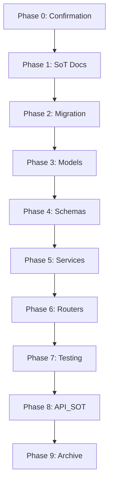

# Tasks: 对账中控系统 SoT 扩展

**Change-ID**: `add-reconciliation-control-center`
**Status**: NOT_STARTED
**Last Updated**: 2025-12-26
**Estimated Effort**: 15-20 人天

---

## Phase 0: SoT & Scope Confirmation (Day 1)

- [ ] 0.1 确认依赖的 SoT 文档版本
  - STATE_MACHINE.md v2.6
  - DATA_SCHEMA.md v5.2
  - BUSINESS_RULES.md v3.2
  - ERROR_CODES_SOT.md v2.1
  - LEDGER_SOT.md v1.1
  - AUTH_SPEC.md v2.0
- [ ] 0.2 确认 Out of Scope 项（与业务方对齐）
- [ ] 0.3 Review proposal.md 完整性
- [ ] 0.4 与业务方确认"甲方确认进粉"与 `conversions_final` 等价性
- [ ] 0.5 确认系统开始日 (system_start_date)

---

## Phase 1: SoT 文档更新 (Day 2-3)

### 1.1 DATA_SCHEMA.md v5.3

- [ ] 1.1.1 更新 projects 表定义（新增 settlement_type, settlement_rules_id）
- [ ] 1.1.2 更新 ad_accounts 表定义（新增 deposit, deposit_updated_at）
- [ ] 1.1.3 新增 §3.5.1 balance_snapshots 表定义
- [ ] 1.1.4 新增 §3.5.2 reconciliation_issues 表定义
- [ ] 1.1.5 新增 §3.5.3 settlement_rules 表定义
- [ ] 1.1.6 更新版本号 v5.2 → v5.3
- [ ] 1.1.7 更新版本历史章节

### 1.2 STATE_MACHINE.md v2.7

- [ ] 1.2.1 新增 §11.4 ReconciliationIssue 状态机
- [ ] 1.2.2 新增状态流转图 (Mermaid)
- [ ] 1.2.3 新增状态流转白名单
- [ ] 1.2.4 新增角色权限矩阵
- [ ] 1.2.5 更新版本号 v2.6 → v2.7
- [ ] 1.2.6 更新版本历史章节

### 1.3 BUSINESS_RULES.md v4.0

- [ ] 1.3.1 新增 BR-REC-001 对账守恒公式
- [ ] 1.3.2 新增 BR-REC-002 差异单 SLA 规则
- [ ] 1.3.3 新增 BR-REC-003 快照缺失处理
- [ ] 1.3.4 新增 BR-REC-004 押款变化记录
- [ ] 1.3.5 新增 BR-SET-001 Fixed 结算规则
- [ ] 1.3.6 新增 BR-SET-002 Tiered 结算规则
- [ ] 1.3.7 新增 BR-SET-003 Markup 结算规则
- [ ] 1.3.8 更新规则索引表
- [ ] 1.3.9 更新版本号 v3.2 → v4.0

### 1.4 ERROR_CODES_SOT.md v2.2

- [ ] 1.4.1 新增 REC-001 ~ REC-006 错误码
- [ ] 1.4.2 新增 SET-001 ~ SET-004 错误码
- [ ] 1.4.3 更新错误码索引表
- [ ] 1.4.4 更新版本号 v2.1 → v2.2

### 1.5 LEDGER_SOT.md v1.2

- [ ] 1.5.1 新增 DEPOSIT_CHANGE entry_type 定义
- [ ] 1.5.2 更新 entry_type 白名单矩阵
- [ ] 1.5.3 更新版本号 v1.1 → v1.2

---

## Phase 2: Database Migration (Day 4-5)

### 2.1 创建迁移脚本

- [ ] 2.1.1 创建 Alembic 迁移文件
  ```bash
  alembic revision --autogenerate -m "add_reconciliation_control_center"
  ```
- [ ] 2.1.2 验证自动生成的迁移脚本
- [ ] 2.1.3 添加手动调整（如有需要）

### 2.2 迁移脚本内容

- [ ] 2.2.1 创建 settlement_rules 表
- [ ] 2.2.2 创建 balance_snapshots 表
- [ ] 2.2.3 创建 reconciliation_issues 表
- [ ] 2.2.4 修改 projects 表（ADD COLUMN）
- [ ] 2.2.5 修改 ad_accounts 表（ADD COLUMN）
- [ ] 2.2.6 创建所有必要索引
- [ ] 2.2.7 添加外键约束

### 2.3 迁移验证

- [ ] 2.3.1 本地数据库迁移测试
- [ ] 2.3.2 回滚测试 (alembic downgrade -1)
- [ ] 2.3.3 数据完整性验证

---

## Phase 3: Models 实现 (Day 5-6)

### 3.1 新增 Models

- [ ] 3.1.1 创建 `backend/models/balance_snapshot.py`
  - BalanceSnapshot 模型
  - 关系定义 (ad_account, created_by)
- [ ] 3.1.2 创建 `backend/models/reconciliation_issue.py`
  - ReconciliationIssue 模型
  - IssueType Enum
  - IssueStatus Enum
  - ResolutionType Enum
  - 关系定义
- [ ] 3.1.3 创建 `backend/models/settlement_rule.py`
  - SettlementRule 模型
  - RuleType Enum
  - 配置 JSONB 校验

### 3.2 修改现有 Models

- [ ] 3.2.1 修改 `backend/models/project.py`
  - 新增 settlement_type 字段
  - 新增 settlement_rules_id 外键
  - 新增 SettlementType Enum
- [ ] 3.2.2 修改 `backend/models/ad_account.py`
  - 新增 deposit 字段
  - 新增 deposit_updated_at 字段

### 3.3 更新 Models 索引

- [ ] 3.3.1 更新 `backend/models/__init__.py`

---

## Phase 4: Schemas 实现 (Day 6-7)

### 4.1 新增 Schemas

- [ ] 4.1.1 创建 `backend/schemas/balance_snapshot.py`
  - BalanceSnapshotCreate
  - BalanceSnapshotUpdate
  - BalanceSnapshotResponse
  - BalanceSnapshotBatchImport
- [ ] 4.1.2 创建 `backend/schemas/reconciliation_issue.py`
  - ReconciliationIssueCreate
  - ReconciliationIssueAssign
  - ReconciliationIssueResolve
  - ReconciliationIssueResponse
  - ReconciliationIssueListResponse
- [ ] 4.1.3 创建 `backend/schemas/settlement_rule.py`
  - SettlementRuleCreate
  - SettlementRuleUpdate
  - SettlementRuleResponse
  - TieredConfig (Pydantic Model)
  - MarkupConfig (Pydantic Model)

### 4.2 修改现有 Schemas

- [ ] 4.2.1 修改 `backend/schemas/project.py`
  - 新增 settlement_type 字段
  - 新增 settlement_rules_id 字段
- [ ] 4.2.2 修改 `backend/schemas/ad_account.py`
  - 新增 deposit 字段

---

## Phase 5: Services 实现 (Day 7-10)

### 5.1 SnapshotService

- [ ] 5.1.1 创建 `backend/services/snapshot_service.py`
- [ ] 5.1.2 实现 `create_snapshot()` - 创建单个快照
- [ ] 5.1.3 实现 `batch_import_snapshots()` - 批量导入快照
- [ ] 5.1.4 实现 `get_snapshot_by_date()` - 按日期查询
- [ ] 5.1.5 实现 `get_snapshots_range()` - 查询日期范围内的快照
- [ ] 5.1.6 实现 `check_snapshot_gaps()` - 检查快照缺失

### 5.2 ReconciliationService

- [ ] 5.2.1 创建 `backend/services/reconciliation_service.py`
- [ ] 5.2.2 实现 `validate_conservation()` - 守恒公式校验
  - 计算 Σ(充值到账)
  - 计算 Σ(实际消耗)
  - 计算 Δ(余额)
  - 计算 Δ(押款)
  - 差异比对与阈值判断
- [ ] 5.2.3 实现 `create_issue()` - 创建差异单
- [ ] 5.2.4 实现 `assign_issue()` - 分配责任人
- [ ] 5.2.5 实现 `resolve_issue()` - 处理差异单
- [ ] 5.2.6 实现 `close_issue()` - 关闭差异单
- [ ] 5.2.7 实现 `check_sla_breaches()` - 检查 SLA 超时
- [ ] 5.2.8 实现 `run_daily_reconciliation()` - 每日对账批处理

### 5.3 SettlementService

- [ ] 5.3.1 创建 `backend/services/settlement_service.py`
- [ ] 5.3.2 实现 `calculate_revenue()` - 统一收入计算入口
- [ ] 5.3.3 实现 `calculate_fixed_revenue()` - Fixed 计算
- [ ] 5.3.4 实现 `calculate_tiered_revenue()` - Tiered 计算
  - cumulative 模式
  - incremental 模式
- [ ] 5.3.5 实现 `calculate_markup_revenue()` - Markup 计算
- [ ] 5.3.6 实现 `validate_tiered_config()` - 阶梯配置校验
- [ ] 5.3.7 实现 `create_settlement_rule()` - 创建结算规则
- [ ] 5.3.8 实现 `get_effective_rule()` - 获取生效规则

---

## Phase 6: Routers 实现 (Day 10-12)

### 6.1 Snapshot Router

- [ ] 6.1.1 创建 `backend/routers/snapshots.py`
- [ ] 6.1.2 `POST /api/v1/snapshots` - 创建快照
- [ ] 6.1.3 `POST /api/v1/snapshots/batch` - 批量导入
- [ ] 6.1.4 `GET /api/v1/snapshots` - 查询快照列表
- [ ] 6.1.5 `GET /api/v1/snapshots/{id}` - 查询单个快照
- [ ] 6.1.6 `GET /api/v1/accounts/{id}/snapshots` - 账户快照历史

### 6.2 Reconciliation Router

- [ ] 6.2.1 创建 `backend/routers/reconciliation.py`
- [ ] 6.2.2 `POST /api/v1/reconciliation/validate` - 触发对账校验
- [ ] 6.2.3 `GET /api/v1/reconciliation/issues` - 差异单列表
- [ ] 6.2.4 `GET /api/v1/reconciliation/issues/{id}` - 差异单详情
- [ ] 6.2.5 `PUT /api/v1/reconciliation/issues/{id}/assign` - 分配责任人
- [ ] 6.2.6 `PUT /api/v1/reconciliation/issues/{id}/resolve` - 处理差异单
- [ ] 6.2.7 `PUT /api/v1/reconciliation/issues/{id}/close` - 关闭差异单
- [ ] 6.2.8 `GET /api/v1/reconciliation/dashboard` - 对账看板数据

### 6.3 Settlement Router

- [ ] 6.3.1 创建 `backend/routers/settlements.py`
- [ ] 6.3.2 `POST /api/v1/settlement-rules` - 创建结算规则
- [ ] 6.3.3 `GET /api/v1/settlement-rules` - 结算规则列表
- [ ] 6.3.4 `GET /api/v1/settlement-rules/{id}` - 结算规则详情
- [ ] 6.3.5 `PUT /api/v1/settlement-rules/{id}` - 更新结算规则
- [ ] 6.3.6 `POST /api/v1/projects/{id}/calculate-revenue` - 计算项目收入

### 6.4 注册路由

- [ ] 6.4.1 更新 `backend/main.py` 注册新路由

---

## Phase 7: Testing (Day 12-14)

### 7.1 单元测试 - Services

- [ ] 7.1.1 创建 `backend/tests/services/test_snapshot_service.py`
  - test_create_snapshot_success
  - test_batch_import_snapshots
  - test_check_snapshot_gaps
- [ ] 7.1.2 创建 `backend/tests/services/test_reconciliation_service.py`
  - test_validate_conservation_pass
  - test_validate_conservation_fail_red
  - test_validate_conservation_fail_yellow
  - test_create_issue_auto
  - test_issue_state_transitions (全状态机覆盖)
  - test_sla_breach_detection
- [ ] 7.1.3 创建 `backend/tests/services/test_settlement_service.py`
  - test_calculate_fixed_revenue
  - test_calculate_tiered_cumulative
  - test_calculate_tiered_incremental
  - test_calculate_markup_percentage
  - test_calculate_markup_fixed
  - test_validate_tiered_config_invalid

### 7.2 单元测试 - Routers

- [ ] 7.2.1 创建 `backend/tests/routers/test_snapshot_api.py`
- [ ] 7.2.2 创建 `backend/tests/routers/test_reconciliation_api.py`
- [ ] 7.2.3 创建 `backend/tests/routers/test_settlement_api.py`

### 7.3 集成测试

- [ ] 7.3.1 创建 `backend/tests/integration/test_reconciliation_flow.py`
  - 完整对账流程：快照 → 对账 → 差异单 → 关闭
  - 守恒公式验证（10 个测试案例）
- [ ] 7.3.2 创建 `backend/tests/integration/test_settlement_flow.py`
  - 项目结算全流程

### 7.4 回归测试

- [ ] 7.4.1 运行现有回归测试: `python run_tests.py --type regression`
- [ ] 7.4.2 验证无破坏性变更
- [ ] 7.4.3 更新回归测试基线（如需要）

---

## Phase 8: API_SOT.md 更新 (Day 14)

- [ ] 8.1 新增 §15 对账中心 API
  - §15.1 快照管理 API
  - §15.2 对账校验 API
  - §15.3 差异单管理 API
  - §15.4 结算规则 API
- [ ] 8.2 更新版本号 v9.0 → v9.1
- [ ] 8.3 更新 API 索引表

---

## Phase 9: Documentation & Archive (Day 15)

### 9.1 文档完善

- [ ] 9.1.1 更新 DEVELOPMENT_PROGRESS_REPORT.md
- [ ] 9.1.2 创建 RECONCILIATION_IMPLEMENTATION_REPORT.md
- [ ] 9.1.3 更新 docs/README.md 索引

### 9.2 OpenSpec 归档

- [ ] 9.2.1 运行 `openspec validate add-reconciliation-control-center --strict`
- [ ] 9.2.2 更新 proposal.md 状态为 READY_FOR_ARCHIVE
- [ ] 9.2.3 运行 `openspec archive add-reconciliation-control-center --yes`

### 9.3 代码提交

- [ ] 9.3.1 创建 PR: `feature/add-reconciliation-control-center`
- [ ] 9.3.2 附上回归测试结果
- [ ] 9.3.3 代码审查
- [ ] 9.3.4 合并到主分支

---

## Summary

| Phase | Tasks | Estimated Days | Status |
|-------|-------|----------------|--------|
| Phase 0: Confirmation | 5 | 1 | ⏳ |
| Phase 1: SoT Docs | 21 | 2 | ⏳ |
| Phase 2: Migration | 10 | 2 | ⏳ |
| Phase 3: Models | 7 | 2 | ⏳ |
| Phase 4: Schemas | 7 | 1 | ⏳ |
| Phase 5: Services | 22 | 4 | ⏳ |
| Phase 6: Routers | 17 | 2 | ⏳ |
| Phase 7: Testing | 12 | 3 | ⏳ |
| Phase 8: API_SOT | 3 | 1 | ⏳ |
| Phase 9: Archive | 7 | 1 | ⏳ |
| **Total** | **111** | **19** | ⏳ |

---

## Dependencies



---

## Notes

1. **并行优化**: Phase 3-4 可以并行进行
2. **风险点**: Phase 5.2 (ReconciliationService) 是最复杂的部分，预留缓冲时间
3. **测试优先**: 建议在 Phase 5 开发时采用 TDD 方式

---

**END OF TASKS**
