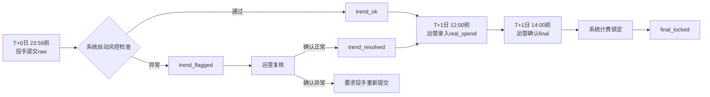
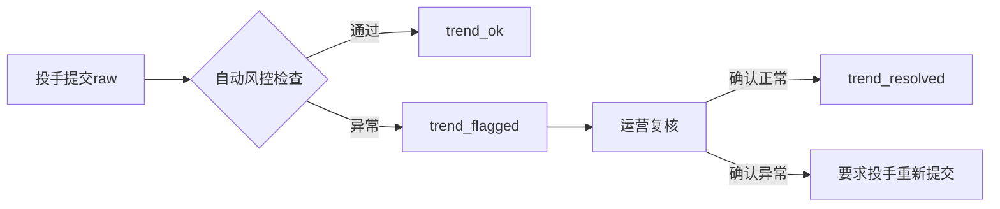
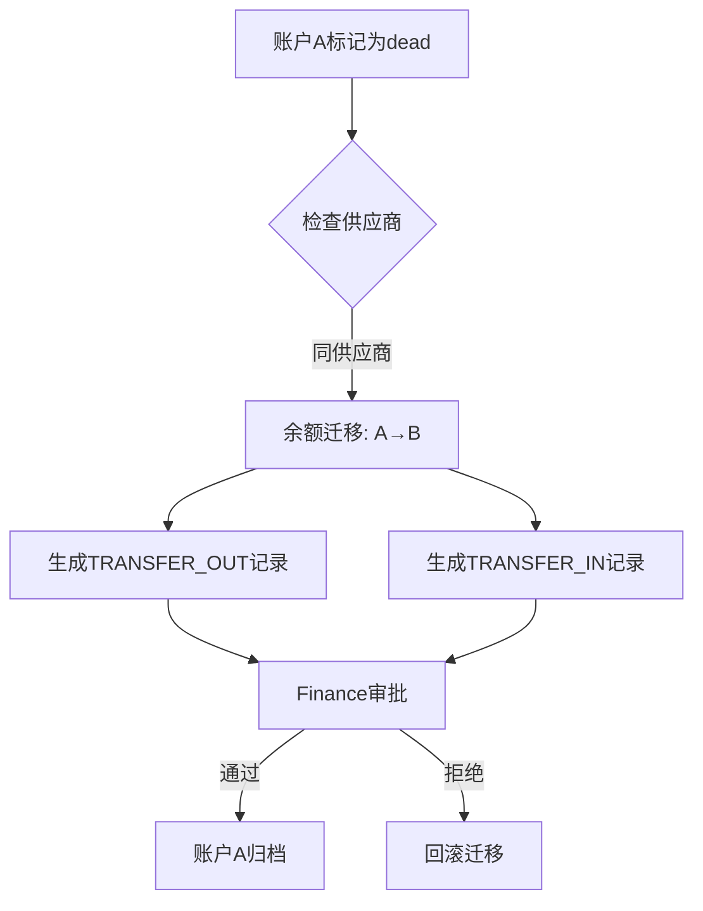
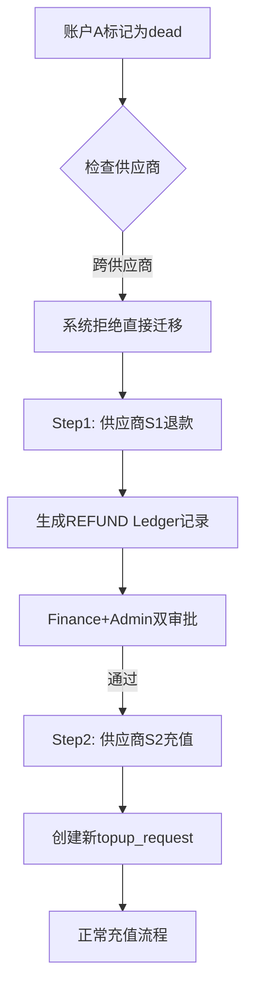

# AI广告代投系统·总览 (System Overview)

> **文档版本**: v2.2
> **发布日期**: 2025-11-22
> **文档定位**: 高层级系统说明（面向产品、运营、技术、管理层）
> **对齐基准**: MASTER_SPEC.md v1.1 + BRD_chapter1_v3.1.md

---

## 📋 目录

1. [系统背景与定位](#1-系统背景与定位)
2. [核心业务目标](#2-核心业务目标)
3. [核心业务流程总览](#3-核心业务流程总览)
4. [三数据流设计总览](#4-三数据流设计总览)
5. [双账本模型](#5-双账本模型)
6. [核心角色与职责](#6-核心角色与职责)
7. [系统模块划分](#7-系统模块划分)
8. [技术架构简述](#8-技术架构简述)
9. [关键风控点与机制](#9-关键风控点与机制)
10. [文档体系说明](#10-文档体系说明)

---

## 1. 系统背景与定位

### 1.1 业务背景

AI广告代投系统是一个专为Facebook广告代理商设计的全流程管理平台，解决传统代投业务中的核心痛点：

- **效率低下**: 人工处理日报、充值申请耗时耗力，每日数据录入和审核占用大量人力
- **财务风险**: 缺乏精确的对账系统，收入（粉数计费）与成本（消耗核算）易混淆
- **管理困难**: 多项目、多账户、多供应商管理复杂，缺乏统一视图
- **数据失真**: 投手提交数据与真实消耗存在偏差，缺少趋势风控

### 1.2 系统定位

**AI广告代投系统是一个业务驱动的数字化平台，核心职责是：**

1. **全流程数字化**: 从项目创建、账户分配、日报审核、充值审批到财务对账的完整流程管理
2. **三数据流分离**: 区分raw（趋势监控）、real（成本核算）、final（计费基准）三类数据，实现精准核算
3. **双账本核算**: 分离项目收入账本（PROJECT）和供应商成本账本（SUPPLIER），独立核算利润
4. **智能风控**: 基于趋势算法（TF-001/002/003）自动检测数据异常，人工复核确认
5. **角色协同**: 五大角色（投手、数据操作员、客户经理、财务、管理员）各司其职，高效协作

### 1.3 核心价值

- **效率提升**: 自动化日报处理、趋势风控、Ledger记账，节省80%人工时间
- **成本精准**: 双账本独立核算收入与成本，毛利计算准确无误
- **风险可控**: 趋势风控实时监控，死号迁移规范，红冲机制保障数据可追溯
- **决策有据**: 基于final_locked数据生成财务报表，为管理决策提供可靠依据

---

## 2. 核心业务目标

### 2.1 收入目标

**计费模型**: 按粉数计费（Per Lead）

```
项目收入 = conversions_final × unit_price
```

- **conversions_final**: 运营确认的最终粉数（非投手提交的raw粉数）
- **unit_price**: 项目单粉价格（项目创建时约定）

**关键业务规则**:
- ✅ 仅 `final_locked` 状态的粉数参与计费
- ✅ 粉数必须经过趋势风控检查（TF-001/002/003）
- ✅ 运营有权调整 `conversions_raw` → `conversions_final`

### 2.2 成本目标

**成本模型**: 真实消耗 + 手续费

```
供应商成本 = real_spend + fee
项目毛利 = 项目收入 - 供应商成本
```

- **real_spend**: 运营录入的真实消耗（T+1日从供应商后台获取）
- **fee**: 供应商手续费（通常为0或固定值）

**关键业务规则**:
- ✅ 成本与收入独立核算（SUPPLIER账本 vs PROJECT账本）
- ✅ 死号余额迁移必须符合供应商规则（同供应商vs跨供应商）
- ✅ 成本记录与收入记录通过 `ledger_entries` 表统一追溯

### 2.3 流程目标

**核心指标**:

| 流程 | 目标时效 | 关键状态 |
|-----|---------|---------|
| **粉数确认流程** | T+0日 23:59投手提交raw<br>T+1日 12:00运营录入real<br>T+1日 14:00运营确认final | raw→trend→final→locked |
| **充值审批流程** | 申请后24小时内完成审批 | draft→pending→finance_approve→paid→completed |
| **死号迁移流程** | 24小时内完成余额迁移 | 同供应商: TRANSFER_OUT+IN<br>跨供应商: 拒绝+提示 |
| **财务对账流程** | 月度对账批次3日内完成 | draft→pending_review→approved→completed |

---

## 3. 核心业务流程总览

### 3.1 项目生命周期

```
甲方签约 → 创建项目 → 分配客户经理 → 申请广告账户 → 分配投手
    ↓
项目启动 → 日常投放 → 粉数确认 → 充值循环 → 月度对账
    ↓
项目结算 → 盈利分析 → 项目归档
```

**关键角色**:
- **account_manager（客户经理）**: 创建项目、分配账户
- **media_buyer（投手）**: 日常投放、提交raw粉数
- **data_operator（数据操作员）**: 审核日报、确认final粉数
- **finance（财务）**: 审批充值、月度对账

### 3.2 粉数确认流程（核心）



**6状态说明**:

| 状态 | 说明 | 触发者 | 可修改字段 |
|-----|------|-------|-----------|
| `raw_submitted` | 投手提交原始粉数 | 投手 | `conversions_raw`, `raw_spend` |
| `trend_pending` | 等待风控检查 | 系统自动 | 无 |
| `trend_ok` | 趋势正常 | 系统自动 | 无 |
| `trend_flagged` | 趋势异常 | 系统自动 | `trend_flag_reason` |
| `trend_resolved` | 运营复核通过 | 运营 | `trend_resolution_note` |
| `final_pending` | 等待final确认 | 运营 | `conversions_final`, `real_spend` |
| `final_confirmed` | final已确认 | 运营 | 无 |
| `final_locked` | 已计费锁定 | 系统自动 | 无（仅可红冲） |

### 3.3 充值审批流程

```
投手/客户经理申请 → 数据操作员初审（复核数据） → 财务终审（审批金额）
    → 财务打款 → 到账确认 → 余额更新 → 生成Ledger记录
```

**状态流转**: `draft` → `pending_review` → `finance_approve` → `paid` → `completed`

**角色权限**:
- **media_buyer/account_manager**: 发起申请
- **data_operator**: 复核数据（检查账户是否需要充值）
- **finance**: 终审+打款+到账确认

### 3.4 死号迁移流程

**场景1: 同供应商迁移**

```
账户A标记为dead → 检查供应商 → 同供应商 → 余额迁移A→B
    → 生成TRANSFER_OUT记录 → 生成TRANSFER_IN记录 → Finance审批 → 账户A归档
```

**场景2: 跨供应商迁移（禁止）**

```
账户A标记为dead → 检查供应商 → 跨供应商 → 系统拒绝
    → 提示操作流程: 供应商S1退款 → 供应商S2新充值 → Finance+Admin双审批
```

**业务规则**:
- ✅ 同供应商: 自动生成两条Ledger记录（TRANSFER_OUT + TRANSFER_IN）
- ❌ 跨供应商: 系统拒绝直接迁移，必须拆分为退款+新充值

---

## 4. 三数据流设计总览

### 4.1 设计理念

**为什么需要三数据流？**

传统代投业务中，投手提交的粉数与真实消耗、计费粉数常常混淆：

1. **投手提交的数据不准确**: 投手为了好看的数据，可能虚报粉数或低报消耗
2. **真实消耗滞后**: 供应商后台数据T+1日才能获取
3. **计费需要确认**: 运营需要人工复核粉数质量，剔除无效线索

**解决方案**: 分离三类数据流

| 数据流 | 字段名 | 提交者 | 时效性 | 用途 |
|-------|-------|--------|--------|------|
| **raw数据流** | `conversions_raw`, `raw_spend` | 投手 | T+0 23:59前 | 趋势监控，风控检查 |
| **real数据流** | `real_spend` | 运营 | T+1 12:00前 | 成本核算 |
| **final数据流** | `conversions_final` | 运营 | T+1 14:00前 | 计费基准 |

### 4.2 数据流使用场景

#### 场景1: 趋势风控（基于raw数据）

```python
# 系统自动检查
if conversions_raw < 昨日最大值 × 0.5:
    raise TrendFlag("TF-001: 粉数骤降")

if conversions_raw > 昨日最大值 × 3:
    raise TrendFlag("TF-002: 粉数骤增")

if raw_spend > 昨日 × 2:  # 数据库字段: daily_reports.spend
    raise TrendFlag("TF-003: 消耗异常")
```

**触发后**: 状态变为 `trend_flagged`，运营需人工复核

#### 场景2: 成本核算（基于real数据）

```python
# 运营录入real_spend后，生成SUPPLIER账本记录
cost = real_spend + fee  # fee通常为0
ledger_entry = LedgerEntry(
    ledger_type="SUPPLIER",
    entry_type="COST",
    amount=cost,
    supplier_id=ad_account.supplier_id
)
```

#### 场景3: 计费基准（基于final数据）

```python
# 运营确认final后，系统计费锁定
revenue = conversions_final × unit_price
ledger_entry = LedgerEntry(
    ledger_type="PROJECT",
    entry_type="REVENUE",
    amount=revenue,
    project_id=daily_report.project_id
)
```

### 4.3 业务规则

- ✅ `conversions_raw` ≠ `conversions_final` （允许运营调整）
- ✅ `raw_spend` ≠ `real_spend` （真实消耗以供应商后台为准）
- ✅ `conversions_final` 一旦确认，除红冲外不可修改
- ❌ 禁止使用`raw_spend`计算成本
- ❌ 禁止跳过final直接计费

---

## 5. 双账本模型

### 5.1 设计理念

**为什么需要双账本？**

传统单一Ledger设计无法区分收入与成本来源：

1. **收入来源**: 项目粉数计费（基于final_conversions）
2. **成本来源**: 供应商消耗费用（基于real_spend）
3. **死号迁移**: 同供应商vs跨供应商的余额处理逻辑不同

**解决方案**: 分离两套账本

| 账本类型 | 用途 | 关联实体 | entry_type范围 | 金额符号 |
|---------|------|---------|---------------|---------|
| **PROJECT** | 项目收入账本 | `project_id` | `REVENUE`, `REVERSAL` | 正数(收入)/负数(红冲) |
| **SUPPLIER** | 供应商成本账本 | `supplier_id` | `COST`, `TRANSFER_OUT`, `TRANSFER_IN`, `REVERSAL` | 正数(成本增加)/负数(成本减少) |

### 5.2 五种Entry类型

| entry_type | 账本类型 | 说明 | 触发场景 | 金额示例 |
|-----------|---------|------|---------|---------|
| **REVENUE** | PROJECT | 粉数计费收入 | `final_locked`后自动生成 | +5000.00 (收入5000) |
| **COST** | SUPPLIER | 真实消耗成本 | 运营录入`real_spend`后生成 | +3000.00 (成本3000) |
| **TRANSFER_OUT** | SUPPLIER | 死号余额迁出 | 同供应商死号迁移 | -1234.56 (余额减少) |
| **TRANSFER_IN** | SUPPLIER | 死号余额迁入 | 同供应商死号迁移 | +1234.56 (余额增加) |
| **REVERSAL** | BOTH | 红冲修正 | `final_locked`后的修正 | -5000.00 (冲销收入) |

### 5.3 示例数据流

```
T+0日: 投手提交raw
├─ conversions_raw = 100
├─ raw_spend = 5000  (数据库字段: daily_reports.spend)
└─ status = raw_submitted

T+0日: 系统风控检查
└─ status = trend_ok (或trend_flagged)

T+1日: 运营确认final
├─ conversions_final = 95  (运营调整-5)
├─ real_spend = 4800  (运营录入真实消耗)
└─ status = final_confirmed

T+1日: 系统计费锁定
├─ status = final_locked
├─ Ledger记录1 (PROJECT账本):
│   ├─ entry_type = REVENUE
│   ├─ amount = 95 × 50 = 4750.00
│   └─ project_id = 123
└─ Ledger记录2 (SUPPLIER账本):
    ├─ entry_type = COST
    ├─ amount = 4800.00
    └─ supplier_id = 456

项目毛利 = 4750 - 4800 = -50.00 (亏损)
```

### 5.4 事务锁机制

**防止并发扣减余额**: 使用 `SELECT FOR UPDATE` 锁

```python
# 伪代码示例
with db.begin():
    # 1. 锁定日报记录
    report = db.query(DailyReport).filter(...).with_for_update().first()

    # 2. 锁定项目记录
    project = db.query(Project).filter(...).with_for_update().first()

    # 3. 计算收入
    revenue = report.conversions_final * project.unit_price

    # 4. 生成Ledger记录
    entry = LedgerEntry(ledger_type="PROJECT", entry_type="REVENUE", amount=revenue)

    # 5. 更新项目余额（原子操作）
    project.balance = project.balance - revenue
```

---

## 6. 核心角色与职责

### 6.1 五大角色

| 角色代码 | 角色名称 | 权限级别 | 主要职责 |
|---------|---------|---------|---------|
| `admin` | 系统管理员 | L5 (最高) | 系统配置、全局审计、紧急干预、用户管理 |
| `finance` | 财务 | L4 | 充值终审、资金监控、财务对账、账本管理 |
| `data_operator` | 数据操作员/户管 | L3 | 日报审核、数据校验、Excel导入导出 |
| `account_manager` | 客户经理 | L2 | 项目维护、成员管理、充值初审 |
| `media_buyer` | 投手/媒体采购 | L1 (最低) | 日报提交、充值申请、凭证上传 |

**历史兼容说明**:
- ⚠️ 旧角色名 `data_clerk` 已废弃，统一使用 `data_operator`
- ⚠️ 旧角色名 `manager` 已废弃，统一使用 `account_manager`

### 6.2 数据访问范围

| 角色 | 数据访问范围 (SQL过滤条件) | 典型用例 |
|-----|--------------------------|---------|
| **admin** | 无过滤 (`WHERE 1=1`) | 修改系统配置、强制解锁流程 |
| **finance** | 充值无过滤<br>财务数据无过滤 | 审批充值申请、生成财务报表 |
| **data_operator** | 项目无过滤<br>日报/账户全局视野 | 审核日报、批量导入消费数据 |
| **account_manager** | 项目: `WHERE account_manager_id = :user_id` | 创建项目、分配账户 |
| **media_buyer** | 账户: `WHERE assigned_to = :user_id` | 提交日报、申请充值 |

### 6.3 权限矩阵（核心操作）

| 操作 | admin | finance | data_operator | account_manager | media_buyer |
|-----|-------|---------|---------------|----------------|-------------|
| **用户管理** |
| 创建用户 | ✅ | ❌ | ❌ | ❌ | ❌ |
| 修改他人角色 | ✅ | ❌ | ❌ | ❌ | ❌ |
| **项目管理** |
| 创建项目 | ✅ | ❌ | ❌ | ✅ | ❌ |
| 编辑项目 | ✅ | ❌ | ❌ | ✅ (仅自己管理的) | ❌ |
| **粉数确认** |
| 提交raw粉数 | ✅ | ❌ | ❌ | ❌ | ✅ |
| 趋势风控复核 | ✅ | ❌ | ✅ | ❌ | ❌ |
| 确认final粉数 | ✅ | ❌ | ✅ | ❌ | ❌ |
| 锁定计费 | ✅ (系统自动) | ❌ | ❌ | ❌ | ❌ |
| **充值管理** |
| 发起充值申请 | ✅ | ❌ | ❌ | ✅ | ✅ |
| 数据审核 (复核) | ✅ | ❌ | ✅ | ❌ | ❌ |
| 财务审批 (终审) | ✅ | ✅ | ❌ | ❌ | ❌ |
| 标记支付完成 | ✅ | ✅ | ❌ | ❌ | ❌ |
| **死号迁移** |
| 同供应商迁移 | ✅ | ✅ (审批) | ❌ | ❌ | ❌ |
| 跨供应商退款 | ✅ | ✅ (双审) | ❌ | ❌ | ❌ |

---

## 7. 系统模块划分

### 7.1 核心业务模块

#### 模块1: 项目管理 (Projects)

**职责**: 项目全生命周期管理

**核心功能**:
- 项目创建、编辑、归档
- 项目成员管理（project_members表）
- 项目预算配置（budget_total, unit_price）
- 项目状态流转（draft → active → suspended → archived）

**关键API**:
- `POST /api/v1/projects` - 创建项目
- `GET /api/v1/projects` - 查询项目列表（基于角色过滤）
- `PUT /api/v1/projects/{id}` - 编辑项目
- `POST /api/v1/projects/{id}/archive` - 归档项目

#### 模块2: 广告账户管理 (Ad Accounts)

**职责**: 广告账户分配、状态管理、死号处理

**核心功能**:
- 账户分配给投手（assigned_to字段）
- 账户状态流转（new → testing → active → suspended → dead → archived）
- 死号余额迁移（同供应商vs跨供应商）

**关键API**:
- `POST /api/v1/ad-accounts` - 创建账户
- `PUT /api/v1/ad-accounts/{id}/assign` - 分配账户
- `POST /api/v1/ad-accounts/{id}/mark-dead` - 标记死号
- `POST /api/v1/ad-accounts/{id}/balance-transfer` - 余额迁移（新增v2.2）

#### 模块3: 日报管理 (Daily Reports)

**职责**: 粉数确认全流程（6状态流转）

**核心功能**:
- 投手提交raw粉数（conversions_raw, raw_spend）
- 系统自动趋势风控检查（TF-001/002/003）
- 运营录入real粉数（real_spend）
- 运营确认final粉数（conversions_final）
- 系统计费锁定（final_locked）

**关键API**:
- `POST /api/v1/daily-reports` - 提交日报（投手）
- `POST /api/v1/daily-reports/{id}/trend-check` - 手动触发风控（新增v2.2）
- `PUT /api/v1/daily-reports/{id}/final-confirm` - 确认final（新增v2.2）
- `POST /api/v1/daily-reports/{id}/final-lock` - 锁定计费（新增v2.2）

#### 模块4: 充值管理 (Topup Requests)

**职责**: 充值申请、审批、到账确认

**核心功能**:
- 投手/客户经理发起申请（draft状态）
- 数据操作员初审（pending_review → finance_approve）
- 财务终审+打款（finance_approve → paid）
- 到账确认（paid → completed）
- 生成充值Ledger记录

**关键API**:
- `POST /api/v1/topup-requests` - 发起充值
- `POST /api/v1/topup-requests/{id}/review` - 数据审核
- `POST /api/v1/topup-requests/{id}/approve` - 财务审批
- `POST /api/v1/topup-requests/{id}/confirm-paid` - 到账确认

#### 模块5: 资金账本 (Ledger)

**职责**: 双账本记账、余额管理、红冲修正

**核心功能**:
- PROJECT账本: REVENUE记录
- SUPPLIER账本: COST、TRANSFER_OUT、TRANSFER_IN记录
- 红冲机制: REVERSAL记录
- 事务锁: SELECT FOR UPDATE防并发

**关键API**:
- `GET /api/v1/ledger/project/{project_id}` - 查询项目Ledger
- `GET /api/v1/ledger/supplier/{supplier_id}` - 查询供应商Ledger
- `POST /api/v1/ledger/reversal` - 创建红冲记录

#### 模块6: 财务对账 (Reconciliation)

**职责**: 月度对账、差异分析、报告生成

**核心功能**:
- 创建对账批次（batch_no, period_start, period_end）
- 提交对账数据（reconciliation_details表）
- 确认对账结果（reconciliation_reports表）
- 差异调整（reconciliation_adjustments表）

**关键API**:
- `POST /api/v1/reconciliation/batches` - 创建批次
- `POST /api/v1/reconciliation/details` - 提交数据
- `POST /api/v1/reconciliation/batches/{id}/confirm` - 确认结果

---

## 8. 技术架构简述

### 8.1 三层架构

```
┌─────────────────────────────────────────────────────────┐
│  前端 (Next.js 16 + TypeScript)                          │
│  - Server Components + Client Components                │
│  - 通过 lib/api.ts::apiFetch 调用后端                   │
│  ❌ 禁止直接访问 Supabase/数据库                        │
└────────────────┬────────────────────────────────────────┘
                 │ HTTPS + JWT Bearer Token
                 ▼
┌─────────────────────────────────────────────────────────┐
│  后端 (FastAPI + Python 3.11+)                           │
│  ┌──────────┐  ┌──────────┐  ┌──────────┐              │
│  │ Router   │→ │ Service  │→ │ Model    │              │
│  │ (路由层) │  │ (业务层) │  │ (数据层) │              │
│  └──────────┘  └──────────┘  └──────────┘              │
│  - Router: 权限校验、参数验证、响应封装                 │
│  - Service: 业务逻辑、事务管理、审计日志                │
│  - Model: SQLAlchemy 2.x 模型                           │
└────────────────┬────────────────────────────────────────┘
                 │ SQLAlchemy (同步)
                 ▼
┌─────────────────────────────────────────────────────────┐
│  PostgreSQL 15 (Supabase托管)                            │
│  - 当前未启用RLS,所有权限在Service层实现                │
│  - Schema以DATA_SCHEMA.md为准                           │
└─────────────────────────────────────────────────────────┘
```

### 8.2 核心技术栈

**前端**:
- 框架: Next.js 16 (App Router)
- 语言: TypeScript 5.x (严格模式)
- UI: shadcn/ui + Tailwind CSS 3.x
- 状态管理: Zustand
- 表单: React Hook Form + Zod

**后端**:
- 框架: FastAPI (latest stable)
- 语言: Python 3.11+ (类型注解必须)
- ORM: SQLAlchemy 2.x (同步版本)
- 验证: Pydantic v2
- 认证: Supabase Auth SDK (唯一认证方案)

**数据库**:
- PostgreSQL 15 (Supabase托管)
- Redis 7.x (缓存/速率限制)
- Supabase Storage (文件存储)

### 8.3 核心设计原则

#### 原则1: SoT策略 (Single Source of Truth)

**每类信息只有一个权威来源**:

| 信息类别 | 唯一来源 | 禁止行为 |
|---------|---------|---------|
| **表结构** | `DATA_SCHEMA.md` | ❌ 在代码注释/API文档中重复定义字段 |
| **状态枚举** | `STATE_MACHINE.md` | ❌ 在Service层硬编码状态列表 |
| **错误码** | `ERROR_CODES.md` | ❌ 自创错误码字符串 |
| **角色定义** | 本文档6.1节 | ❌ 引用旧角色名(`data_clerk`) |

#### 原则2: Envelope响应格式

**所有API响应必须使用统一格式**:

```json
// 成功响应
{
  "success": true,
  "data": { /* 业务数据 */ },
  "message": "操作成功",
  "code": "SUCCESS",
  "request_id": "uuid-v4",
  "timestamp": "2025-01-21T10:30:00Z"
}

// 失败响应
{
  "success": false,
  "error": {
    "code": "AUTH_500",
    "message": "权限不足",
    "detail": { /* 可选 */ }
  },
  "request_id": "uuid-v4",
  "timestamp": "2025-01-21T10:30:00Z"
}
```

#### 原则3: 认证与授权

**Supabase Auth是唯一认证方案**:

```
1. 用户注册/登录 → Supabase Auth API
2. Supabase返回JWT (Access Token + Refresh Token)
3. 前端携带 Authorization: Bearer <token>
4. 后端通过Supabase Auth SDK验证Token
5. 从users表查询角色等业务信息
6. Service层根据角色过滤数据
```

**强制约束**:
- ✅ 使用Supabase Auth SDK验证Token
- ✅ 角色信息从`users.role`字段查询
- ❌ 当前未启用数据库级RLS
- ❌ 禁止在`users`表存储`password_hash`

---

## 9. 关键风控点与机制

### 9.1 趋势风控（三大规则）

**规则编号**: TF-001/002/003 (定义于 `STATE_MACHINE.md`)

| 规则编号 | 规则名称 | 判断逻辑 | 触发后果 |
|---------|---------|---------| ---------|
| **TF-001** | 粉数骤降检查 | `conversions_raw < 昨日最大值 × 0.5` | `trend_flagged` |
| **TF-002** | 粉数骤增检查 | `conversions_raw > 昨日最大值 × 3` | `trend_flagged` |
| **TF-003** | 消耗异常检查 | `raw_spend > 昨日 × 2` | `trend_flagged` |

**触发后的处理流程**:



**业务规则**:
- ✅ trend_flagged状态下,禁止进入final_pending
- ✅ 运营必须填写`trend_resolution_note`
- ✅ 风控检查自动执行,运营可手动重新检查
- ❌ 禁止关闭风控检查

### 9.2 死号迁移规则

#### 场景1: 同供应商迁移



#### 场景2: 跨供应商迁移（禁止）



**业务规则**:
- ✅ 源账户必须为`dead`状态
- ✅ 迁移金额不得超过源账户余额
- ✅ 同供应商迁移: 自动生成两条Ledger记录
- ✅ 跨供应商迁移: 系统拒绝,提示操作流程
- ✅ 迁移后源账户自动归档(`archived`)
- ❌ 禁止迁移到非同项目账户

### 9.3 红冲修正机制

**核心原则**: `final_locked`状态后,所有修正必须通过红冲机制。

**红冲流程**:


**示例场景**:

```
原始数据:
├─ conversions_final = 100
├─ revenue = 100 × 50 = 5000
└─ Ledger记录: entry_type=REVENUE, amount=5000

发现错误(应为95粉):
├─ Step1: 创建红冲记录
│   ├─ entry_type = REVERSAL
│   ├─ amount = -5000
│   └─ notes = "红冲原记录#12345,粉数错误"
├─ Step2: 生成新记录
│   ├─ entry_type = REVENUE
│   ├─ amount = 95 × 50 = 4750
│   └─ notes = "修正后的正确记录"
└─ Step3: 更新项目余额
    └─ balance = balance + 5000 - 4750 = balance + 250
```

**业务规则**:
- ✅ 红冲金额 = -原金额
- ✅ 红冲后重新生成正确的Ledger记录
- ✅ 审计日志记录完整链条
- ❌ 禁止直接UPDATE daily_reports的conversions_final
- ❌ 禁止直接DELETE Ledger记录

---

## 10. 文档体系说明

### 10.1 核心文档清单（SoT Network）

本系统采用**SoT（Single Source of Truth）策略**，每类信息只有一个权威来源：

```
MASTER_SPEC.md v1.1 (系统架构宪法)
    │
    ├─→ DATA_SCHEMA.md               (数据结构唯一真相源)
    ├─→ STATE_MACHINE.md              (状态机唯一真相源)
    ├─→ AUTH_SPEC.md                  (认证授权规范)
    ├─→ LEDGER_SOT.md                 (账本业务逻辑)
    ├─→ BUSINESS_RULES.md             (业务规则SoT)
    ├─→ ERROR_CODES_SOT.md            (错误码SoT)
    ├─→ RLS_POLICIES_SOT.md           (RLS策略,当前未启用)
    ├─→ API_DEVELOPMENT_FLOW.md       (API开发流程)
    └─→ BRD_chapter1_v3.1.md          (业务需求基线)
```

### 10.2 文档阅读顺序

**新员工入职**:
1. 阅读本文档（SYSTEM_OVERVIEW.md）- 理解系统全貌
2. 阅读BRD_chapter1_v3.1.md - 理解业务需求
3. 阅读MASTER_SPEC.md 第1-6章 - 技术细节
4. 查阅对应模块的详细文档

**产品/运营人员**:
1. 阅读本文档（SYSTEM_OVERVIEW.md）
2. 阅读BRD_chapter1_v3.1.md
3. 查阅BUSINESS_RULES.md中的具体业务规则

**技术开发人员**:
1. 阅读本文档（SYSTEM_OVERVIEW.md）- 业务背景
2. 阅读MASTER_SPEC.md - 技术规范
3. 查阅DATA_SCHEMA.md、STATE_MACHINE.md、ERROR_CODES_SOT.md - 实现细节
4. 遵循API_DEVELOPMENT_FLOW.md - 开发流程

**管理层**:
1. 阅读本文档（SYSTEM_OVERVIEW.md）第1-5节 - 业务价值
2. 查阅第9节 - 风控机制

### 10.3 冲突仲裁规则

当文档之间出现冲突时,按以下优先级仲裁:

| 领域 | 最高权威 |
|-----| ---------|
| **数据结构** | DATA_SCHEMA.md |
| **状态流转** | STATE_MACHINE.md |
| **认证授权** | AUTH_SPEC.md |
| **错误处理** | ERROR_CODES.md |
| **业务约束** | BUSINESS_RULES.md |
| **技术栈/架构** | MASTER_SPEC.md |

---

## 📅 版本历史

| 版本 | 日期 | 主要变更 | 作者 |
|------|------|---------|------|
| v2.0 | 2025-01-21 | **完全重写,对齐BRD v3.1**<br>• 新增三数据流设计总览<br>• 新增双账本模型说明<br>• 新增6状态粉数确认状态机<br>• 新增趋势风控规则详解<br>• 新增死号迁移流程<br>• 新增红冲修正机制<br>• 重写角色职责与权限矩阵<br>• 重写系统模块划分<br>• 面向产品/运营/技术/管理层多种受众 | 系统架构团队 |
| v2.1 | 2025-11-22 | **SOT对齐更新**<br>• 修正所有AI_AD_SYSTEM_MASTER_SPEC_v2.2.md引用→MASTER_SPEC.md v1.1<br>• 修正ERROR_CODES.md→ERROR_CODES_SOT.md<br>• 修正RLS_POLICIES.md→RLS_POLICIES_SOT.md v2.1<br>• 补充LEDGER_SOT.md到SoT文档体系<br>• 更新STATE_MACHINE.md v2.6 (新增reconciliation/transfer状态机) | SOT审查团队 |
| v1.0 | 2025-11-11 | 初始版本 | 系统架构团队 |

---

**文档状态**: ✅ 已完成 - 与 MASTER_SPEC.md v1.1 完全对齐

**维护责任**: 系统架构团队
**下次审查**: 每季度或重大变更时
**反馈渠道**: 提交Issue或PR到 `docs/1.overview/` 目录
