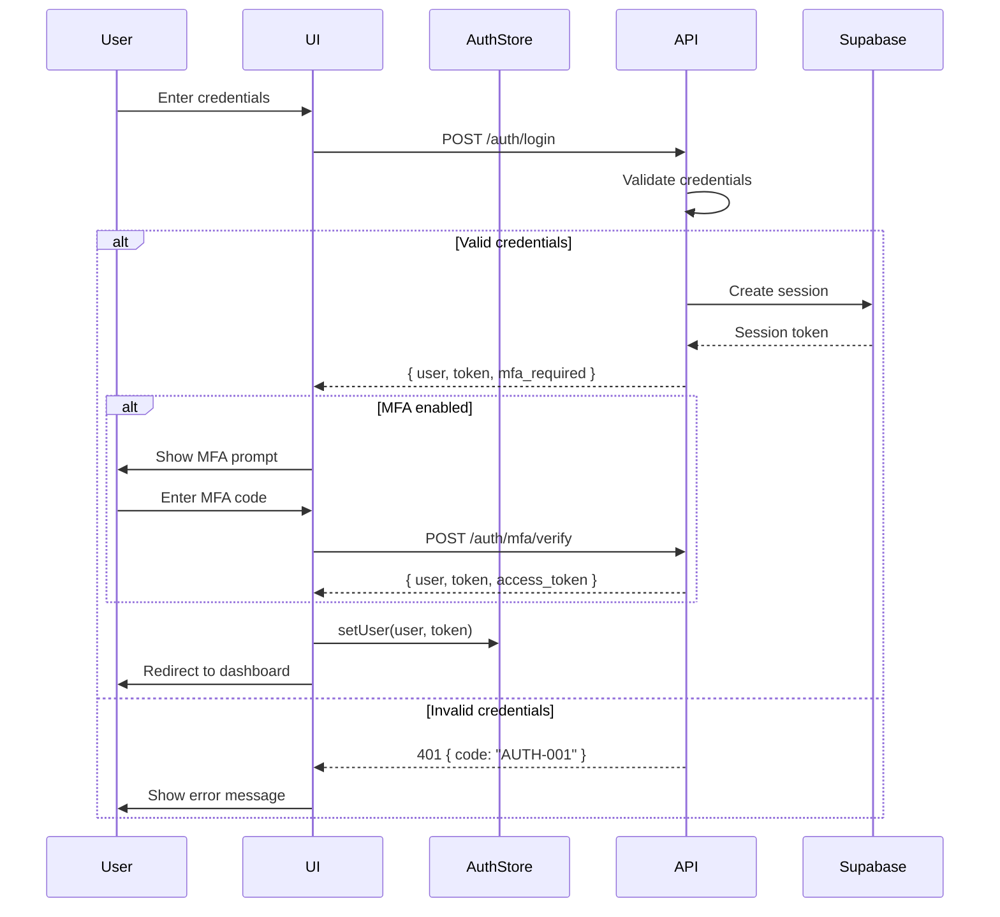

# Frontend Development Rules

## 1. Purpose

This document defines mandatory rules and best practices for frontend development in the AI Ad Spend Management System. It ensures:

- **Consistency**: Unified coding standards across the frontend codebase
- **SoT Alignment**: Frontend UI/UX strictly follows backend state machines and business rules
- **Security**: Proper authentication, authorization, and data protection
- **Maintainability**: Clear component architecture and testing requirements
- **User Experience**: Error handling, loading states, and user feedback mechanisms

All frontend developers MUST adhere to these rules. Any deviation requires RFC approval through the SoT governance process.

## 2. Scope

### In Scope
- React component architecture and patterns
- State management with Zustand
- Data fetching with React Query
- Authentication UI flows (login, MFA, session management)
- Authorization UI (role-based rendering, permission checks)
- Error handling and user feedback
- Testing requirements (unit, integration, E2E)
- SoT-driven UI state mapping

### Out of Scope
- Backend API implementation (see `API_DEVELOPMENT_FLOW.md`)
- Database schema changes (see `DATA_SCHEMA.md` v5.2)
- Business rule definitions (see `BUSINESS_RULES.md` v3.1)
- Infrastructure/deployment (see separate DevOps docs)

## 3. Frontend Architecture

### 3.1 Technology Stack

**Core Framework**: React 18+ with TypeScript 5+

**Required Libraries**:
```json
{
  "dependencies": {
    "react": "^18.2.0",
    "react-router-dom": "^6.20.0",
    "zustand": "^4.4.0",
    "@tanstack/react-query": "^5.0.0",
    "zod": "^3.22.0",
    "@supabase/supabase-js": "^2.38.0"
  },
  "devDependencies": {
    "vitest": "^1.0.0",
    "@testing-library/react": "^14.1.0",
    "playwright": "^1.40.0"
  }
}
```

**Rationale**:
- **Zustand**: Lightweight state management, minimal boilerplate
- **React Query**: Server state management, caching, and invalidation
- **Zod**: Runtime type validation for API responses
- **Supabase Client**: Authentication and real-time subscriptions

### 3.2 Project Structure

```
frontend/
├── src/
│   ├── components/          # Reusable UI components
│   │   ├── common/         # Generic components (Button, Input, etc.)
│   │   ├── layout/         # Layout components (Header, Sidebar, etc.)
│   │   └── domain/         # Domain-specific components (AdAccountCard, etc.)
│   ├── features/           # Feature-based modules
│   │   ├── auth/
│   │   │   ├── components/
│   │   │   ├── hooks/
│   │   │   ├── stores/
│   │   │   └── types.ts
│   │   ├── ad-accounts/
│   │   ├── daily-reports/
│   │   ├── topups/
│   │   └── reconciliation/
│   ├── hooks/              # Shared custom hooks
│   ├── lib/                # Utility libraries
│   │   ├── api/           # API client and helpers
│   │   ├── supabase/      # Supabase client setup
│   │   └── validation/    # Zod schemas
│   ├── stores/             # Global Zustand stores
│   ├── types/              # Shared TypeScript types
│   ├── utils/              # Helper functions
│   └── App.tsx
└── tests/
    ├── unit/
    ├── integration/
    └── e2e/
```

**Rules**:
- **Feature Folders**: Group by domain feature, not technical role
- **Colocate Related Code**: Keep components, hooks, stores together
- **Single Responsibility**: Each file/component has one clear purpose

### 3.3 Naming Conventions

| Type | Convention | Example |
|------|------------|---------|
| Components | PascalCase | `AdAccountCard.tsx` |
| Hooks | camelCase with `use` prefix | `useAdAccounts.ts` |
| Stores | camelCase with `Store` suffix | `authStore.ts` |
| Types/Interfaces | PascalCase | `DailyReport`, `TopupRequest` |
| Constants | UPPER_SNAKE_CASE | `API_BASE_URL` |
| Utility Functions | camelCase | `formatCurrency` |
| Test Files | `*.test.tsx` or `*.spec.tsx` | `AdAccountCard.test.tsx` |

**Type Definitions**:
```typescript
// ✅ Correct: Descriptive interface names
interface AdAccountCardProps {
  account: AdAccount;
  onEdit: (id: string) => void;
  onDelete: (id: string) => void;
}

// ✅ Correct: Type alias for complex unions
type ReportStatus =
  | "raw_submitted"
  | "trend_pending"
  | "trend_ok"
  | "trend_flagged"
  | "trend_resolved"
  | "final_pending"
  | "final_confirmed"
  | "final_locked";

// ❌ Wrong: Generic names
interface Props { ... }
type State = string;
```

## 4. Component Development

### 4.1 Component Structure

**Functional Components Only**: Use React Hooks (no class components)

**Standard Component Template**:
```typescript
import { FC } from 'react';
import { ComponentProps } from './types';
import styles from './Component.module.css';

/**
 * Component description
 *
 * @param props - Component properties
 * @returns Rendered component
 */
export const Component: FC<ComponentProps> = ({ prop1, prop2 }) => {
  // 1. Hooks (in order: context, state, refs, effects)
  const [state, setState] = useState<StateType>(initialState);

  // 2. Event handlers
  const handleClick = () => {
    // handler logic
  };

  // 3. Derived values
  const computedValue = useMemo(() => {
    return expensiveComputation(state);
  }, [state]);

  // 4. Early returns (loading, error states)
  if (isLoading) return <LoadingSpinner />;
  if (error) return <ErrorMessage error={error} />;

  // 5. Main render
  return (
    <div className={styles.container}>
      {/* JSX content */}
    </div>
  );
};
```

**Rules**:
- **Type Safety**: All props/state must have explicit types
- **Prop Destructuring**: Destructure props in function signature
- **Early Returns**: Handle loading/error states early
- **JSDoc Comments**: Document public components

### 4.2 Props and State

**Props Best Practices**:
```typescript
// ✅ Correct: Optional props with defaults
interface ButtonProps {
  label: string;
  variant?: 'primary' | 'secondary' | 'danger';
  disabled?: boolean;
  onClick?: () => void;
}

export const Button: FC<ButtonProps> = ({
  label,
  variant = 'primary',
  disabled = false,
  onClick
}) => {
  // component logic
};

// ✅ Correct: Discriminated unions for conditional props
type InputProps =
  | { type: 'text'; value: string; onChange: (value: string) => void }
  | { type: 'number'; value: number; onChange: (value: number) => void };

// ❌ Wrong: Any type
interface BadProps {
  data: any; // Never use 'any'
}
```

**State Management Rules**:
- **Local State**: Use `useState` for UI-only state (modals, tabs, forms)
- **Global State**: Use Zustand stores for shared state (auth, user preferences)
- **Server State**: Use React Query for API data (ad accounts, reports, topups)

```typescript
// ✅ Correct: Local UI state
const [isModalOpen, setIsModalOpen] = useState(false);

// ✅ Correct: Global state with Zustand
const user = useAuthStore((state) => state.user);

// ✅ Correct: Server state with React Query
const { data: accounts, isLoading } = useQuery({
  queryKey: ['adAccounts'],
  queryFn: fetchAdAccounts
});

// ❌ Wrong: useState for server data
const [accounts, setAccounts] = useState([]); // Use React Query instead
```

### 4.3 Event Handling

**Naming Convention**: `handle` + `Event` (e.g., `handleClick`, `handleSubmit`)

**Examples**:
```typescript
// ✅ Correct: Inline handlers for simple cases
<button onClick={() => setIsOpen(true)}>Open</button>

// ✅ Correct: Named handlers for complex logic
const handleSubmit = async (e: FormEvent) => {
  e.preventDefault();

  try {
    await createAdAccount(formData);
    toast.success('Account created');
    navigate('/ad-accounts');
  } catch (error) {
    toast.error(parseErrorMessage(error));
  }
};

// ✅ Correct: Callbacks with parameters
const handleDelete = (id: string) => {
  if (confirm('Delete this account?')) {
    deleteAccount(id);
  }
};

// ❌ Wrong: Arrow functions in render (performance issue)
{accounts.map(account => (
  <Card onClick={() => handleEdit(account.id)} /> // Creates new function on every render
))}

// ✅ Correct: Use useCallback for stable references
const handleEdit = useCallback((id: string) => {
  navigate(`/ad-accounts/${id}/edit`);
}, [navigate]);
```

### 4.4 Code Examples

**Example 1: Ad Account Card Component**
```typescript
// src/features/ad-accounts/components/AdAccountCard.tsx
import { FC } from 'react';
import { AdAccount } from '../types';
import { formatCurrency } from '@/utils/format';
import styles from './AdAccountCard.module.css';

interface AdAccountCardProps {
  account: AdAccount;
  onEdit: (id: string) => void;
  onDelete: (id: string) => void;
}

export const AdAccountCard: FC<AdAccountCardProps> = ({
  account,
  onEdit,
  onDelete
}) => {
  const statusColor = {
    active: 'green',
    suspended: 'red',
    pending: 'yellow'
  }[account.status];

  return (
    <div className={styles.card}>
      <div className={styles.header}>
        <h3>{account.platform_name}</h3>
        <span
          className={styles.status}
          style={{ backgroundColor: statusColor }}
        >
          {account.status}
        </span>
      </div>

      <div className={styles.body}>
        <p>Account ID: {account.platform_account_id}</p>
        <p>Balance: {formatCurrency(account.balance_local)}</p>
        <p>Currency: {account.currency_code}</p>
      </div>

      <div className={styles.actions}>
        <button onClick={() => onEdit(account.id)}>Edit</button>
        <button onClick={() => onDelete(account.id)} className={styles.danger}>
          Delete
        </button>
      </div>
    </div>
  );
};
```

**Example 2: Form with Validation**
```typescript
// src/features/topups/components/TopupForm.tsx
import { FC, FormEvent, useState } from 'react';
import { z } from 'zod';
import { useCreateTopup } from '../hooks/useCreateTopup';

const topupSchema = z.object({
  ad_account_id: z.string().uuid(),
  amount_requested: z.number().positive(),
  currency_code: z.string().length(3),
  urgency_level: z.enum(['normal', 'urgent']),
  notes: z.string().optional()
});

type TopupFormData = z.infer<typeof topupSchema>;

export const TopupForm: FC = () => {
  const [formData, setFormData] = useState<TopupFormData>({
    ad_account_id: '',
    amount_requested: 0,
    currency_code: 'CNY',
    urgency_level: 'normal',
    notes: ''
  });

  const [errors, setErrors] = useState<Record<string, string>>({});
  const { mutate: createTopup, isPending } = useCreateTopup();

  const handleSubmit = (e: FormEvent) => {
    e.preventDefault();

    // Validate with Zod
    const result = topupSchema.safeParse(formData);
    if (!result.success) {
      const fieldErrors = result.error.flatten().fieldErrors;
      setErrors(
        Object.fromEntries(
          Object.entries(fieldErrors).map(([key, value]) => [key, value?.[0] || ''])
        )
      );
      return;
    }

    // Submit data
    createTopup(result.data, {
      onSuccess: () => {
        toast.success('Topup request created');
        setFormData({ /* reset */ });
      },
      onError: (error) => {
        toast.error(parseErrorMessage(error));
      }
    });
  };

  return (
    <form onSubmit={handleSubmit}>
      <div>
        <label>Amount</label>
        <input
          type="number"
          value={formData.amount_requested}
          onChange={(e) => setFormData(prev => ({
            ...prev,
            amount_requested: parseFloat(e.target.value)
          }))}
        />
        {errors.amount_requested && (
          <span className="error">{errors.amount_requested}</span>
        )}
      </div>

      <div>
        <label>Urgency</label>
        <select
          value={formData.urgency_level}
          onChange={(e) => setFormData(prev => ({
            ...prev,
            urgency_level: e.target.value as 'normal' | 'urgent'
          }))}
        >
          <option value="normal">Normal</option>
          <option value="urgent">Urgent</option>
        </select>
      </div>

      <button type="submit" disabled={isPending}>
        {isPending ? 'Creating...' : 'Create Topup'}
      </button>
    </form>
  );
};
```

## 5. State Management & Data Fetching

### 5.1 Zustand Store Patterns

**Store Definition**:
```typescript
// src/stores/authStore.ts
import { create } from 'zustand';
import { persist } from 'zustand/middleware';
import { User } from '@/types/auth';

interface AuthState {
  user: User | null;
  token: string | null;
  isAuthenticated: boolean;

  // Actions
  setUser: (user: User, token: string) => void;
  logout: () => void;
  updateUser: (updates: Partial<User>) => void;
}

export const useAuthStore = create<AuthState>()(
  persist(
    (set) => ({
      user: null,
      token: null,
      isAuthenticated: false,

      setUser: (user, token) => set({
        user,
        token,
        isAuthenticated: true
      }),

      logout: () => set({
        user: null,
        token: null,
        isAuthenticated: false
      }),

      updateUser: (updates) => set((state) => ({
        user: state.user ? { ...state.user, ...updates } : null
      }))
    }),
    {
      name: 'auth-storage',
      partialize: (state) => ({
        user: state.user,
        token: state.token
      })
    }
  )
);

// Usage in components
const user = useAuthStore((state) => state.user);
const logout = useAuthStore((state) => state.logout);
```

**Rules**:
- **Single Responsibility**: One store per domain (auth, preferences, etc.)
- **Immutable Updates**: Use spread operators, never mutate state directly
- **Persistence**: Use `persist` middleware for data that should survive refresh
- **Selectors**: Destructure only needed fields to optimize re-renders

### 5.2 React Query Integration

**API Client Setup**:
```typescript
// src/lib/api/client.ts
import { useAuthStore } from '@/stores/authStore';

export class ApiError extends Error {
  constructor(
    public code: string,
    message: string,
    public status: number
  ) {
    super(message);
    this.name = 'ApiError';
  }
}

export async function apiFetch<T>(
  endpoint: string,
  options: RequestInit = {}
): Promise<T> {
  const token = useAuthStore.getState().token;

  const response = await fetch(`${import.meta.env.VITE_API_URL}${endpoint}`, {
    ...options,
    headers: {
      'Content-Type': 'application/json',
      ...(token && { Authorization: `Bearer ${token}` }),
      ...options.headers
    }
  });

  if (!response.ok) {
    const error = await response.json();
    throw new ApiError(
      error.code || 'UNKNOWN',
      error.message || 'Request failed',
      response.status
    );
  }

  return response.json();
}
```

**Query Hook Pattern**:
```typescript
// src/features/ad-accounts/hooks/useAdAccounts.ts
import { useQuery } from '@tanstack/react-query';
import { apiFetch } from '@/lib/api/client';
import { AdAccount } from '../types';

export function useAdAccounts() {
  return useQuery({
    queryKey: ['adAccounts'],
    queryFn: () => apiFetch<AdAccount[]>('/api/v1/ad-accounts'),
    staleTime: 5 * 60 * 1000, // 5 minutes
    gcTime: 10 * 60 * 1000 // 10 minutes (formerly cacheTime)
  });
}

// Usage
const { data: accounts, isLoading, error, refetch } = useAdAccounts();
```

**Mutation Hook Pattern**:
```typescript
// src/features/ad-accounts/hooks/useCreateAdAccount.ts
import { useMutation, useQueryClient } from '@tanstack/react-query';
import { apiFetch } from '@/lib/api/client';
import { AdAccount } from '../types';

interface CreateAdAccountInput {
  platform: string;
  platform_account_id: string;
  currency_code: string;
  // ... other fields
}

export function useCreateAdAccount() {
  const queryClient = useQueryClient();

  return useMutation({
    mutationFn: (input: CreateAdAccountInput) =>
      apiFetch<AdAccount>('/api/v1/ad-accounts', {
        method: 'POST',
        body: JSON.stringify(input)
      }),

    onSuccess: (newAccount) => {
      // Invalidate and refetch
      queryClient.invalidateQueries({ queryKey: ['adAccounts'] });

      // Or optimistic update
      queryClient.setQueryData<AdAccount[]>(
        ['adAccounts'],
        (old) => old ? [...old, newAccount] : [newAccount]
      );
    }
  });
}
```

### 5.3 Data Synchronization

**Optimistic Updates**:
```typescript
export function useUpdateAdAccount() {
  const queryClient = useQueryClient();

  return useMutation({
    mutationFn: ({ id, updates }: { id: string; updates: Partial<AdAccount> }) =>
      apiFetch(`/api/v1/ad-accounts/${id}`, {
        method: 'PATCH',
        body: JSON.stringify(updates)
      }),

    onMutate: async ({ id, updates }) => {
      // Cancel outgoing refetches
      await queryClient.cancelQueries({ queryKey: ['adAccounts'] });

      // Snapshot previous value
      const previous = queryClient.getQueryData(['adAccounts']);

      // Optimistically update
      queryClient.setQueryData<AdAccount[]>(
        ['adAccounts'],
        (old) => old?.map(acc =>
          acc.id === id ? { ...acc, ...updates } : acc
        )
      );

      return { previous };
    },

    onError: (err, variables, context) => {
      // Rollback on error
      if (context?.previous) {
        queryClient.setQueryData(['adAccounts'], context.previous);
      }
    },

    onSettled: () => {
      queryClient.invalidateQueries({ queryKey: ['adAccounts'] });
    }
  });
}
```

**Real-time Subscriptions** (Supabase):
```typescript
// src/features/daily-reports/hooks/useReportSubscription.ts
import { useEffect } from 'react';
import { useQueryClient } from '@tanstack/react-query';
import { supabase } from '@/lib/supabase';

export function useReportSubscription(reportId: string) {
  const queryClient = useQueryClient();

  useEffect(() => {
    const channel = supabase
      .channel(`report:${reportId}`)
      .on(
        'postgres_changes',
        {
          event: 'UPDATE',
          schema: 'public',
          table: 'daily_reports',
          filter: `id=eq.${reportId}`
        },
        (payload) => {
          // Update React Query cache
          queryClient.setQueryData(
            ['dailyReport', reportId],
            payload.new
          );
        }
      )
      .subscribe();

    return () => {
      supabase.removeChannel(channel);
    };
  }, [reportId, queryClient]);
}
```

### 5.4 Cache Management

**Invalidation Strategies**:
```typescript
// After successful mutation
queryClient.invalidateQueries({ queryKey: ['adAccounts'] });

// Invalidate specific item
queryClient.invalidateQueries({
  queryKey: ['adAccount', accountId]
});

// Invalidate all queries starting with key
queryClient.invalidateQueries({
  queryKey: ['adAccounts'],
  refetchType: 'active' // Only refetch active queries
});

// Remove from cache without refetching
queryClient.removeQueries({ queryKey: ['adAccount', accountId] });

// Prefetch for faster navigation
queryClient.prefetchQuery({
  queryKey: ['adAccount', accountId],
  queryFn: () => apiFetch(`/api/v1/ad-accounts/${accountId}`)
});
```

**Cache Time Configuration**:
```typescript
// Global defaults
const queryClient = new QueryClient({
  defaultOptions: {
    queries: {
      staleTime: 1 * 60 * 1000, // 1 minute
      gcTime: 5 * 60 * 1000, // 5 minutes
      retry: 3,
      refetchOnWindowFocus: false
    }
  }
});

// Per-query overrides
useQuery({
  queryKey: ['criticalData'],
  queryFn: fetchCriticalData,
  staleTime: 0, // Always fetch fresh
  gcTime: 0 // Don't cache
});
```

## 6. Authentication & Authorization UI

### 6.1 Authentication Flow

**Mermaid Diagram**:


**Login Component**:
```typescript
// src/features/auth/components/LoginForm.tsx
import { FC, FormEvent, useState } from 'react';
import { useNavigate } from 'react-router-dom';
import { useAuthStore } from '@/stores/authStore';
import { apiFetch } from '@/lib/api/client';

export const LoginForm: FC = () => {
  const [email, setEmail] = useState('');
  const [password, setPassword] = useState('');
  const [mfaCode, setMfaCode] = useState('');
  const [showMfa, setShowMfa] = useState(false);
  const [error, setError] = useState('');
  const [isLoading, setIsLoading] = useState(false);

  const setUser = useAuthStore((state) => state.setUser);
  const navigate = useNavigate();

  const handleLogin = async (e: FormEvent) => {
    e.preventDefault();
    setError('');
    setIsLoading(true);

    try {
      const response = await apiFetch<{
        user: User;
        token: string;
        mfa_required: boolean;
      }>('/api/v1/auth/login', {
        method: 'POST',
        body: JSON.stringify({ email, password })
      });

      if (response.mfa_required) {
        setShowMfa(true);
      } else {
        setUser(response.user, response.token);
        navigate('/dashboard');
      }
    } catch (err) {
      if (err instanceof ApiError) {
        setError(err.message);
      } else {
        setError('Login failed. Please try again.');
      }
    } finally {
      setIsLoading(false);
    }
  };

  const handleMfaVerify = async (e: FormEvent) => {
    e.preventDefault();
    setError('');
    setIsLoading(true);

    try {
      const response = await apiFetch<{
        user: User;
        token: string;
      }>('/api/v1/auth/mfa/verify', {
        method: 'POST',
        body: JSON.stringify({ email, mfa_code: mfaCode })
      });

      setUser(response.user, response.token);
      navigate('/dashboard');
    } catch (err) {
      setError('Invalid MFA code');
    } finally {
      setIsLoading(false);
    }
  };

  if (showMfa) {
    return (
      <form onSubmit={handleMfaVerify}>
        <h2>Enter MFA Code</h2>
        <input
          type="text"
          value={mfaCode}
          onChange={(e) => setMfaCode(e.target.value)}
          placeholder="6-digit code"
          maxLength={6}
        />
        {error && <div className="error">{error}</div>}
        <button type="submit" disabled={isLoading}>
          Verify
        </button>
      </form>
    );
  }

  return (
    <form onSubmit={handleLogin}>
      <h2>Login</h2>
      <input
        type="email"
        value={email}
        onChange={(e) => setEmail(e.target.value)}
        placeholder="Email"
        required
      />
      <input
        type="password"
        value={password}
        onChange={(e) => setPassword(e.target.value)}
        placeholder="Password"
        required
      />
      {error && <div className="error">{error}</div>}
      <button type="submit" disabled={isLoading}>
        {isLoading ? 'Logging in...' : 'Login'}
      </button>
    </form>
  );
};
```

### 6.2 Protected Routes

**Route Guard Component**:
```typescript
// src/components/layout/ProtectedRoute.tsx
import { FC, ReactNode } from 'react';
import { Navigate, useLocation } from 'react-router-dom';
import { useAuthStore } from '@/stores/authStore';

interface ProtectedRouteProps {
  children: ReactNode;
  requiredPermissions?: string[];
}

export const ProtectedRoute: FC<ProtectedRouteProps> = ({
  children,
  requiredPermissions = []
}) => {
  const { isAuthenticated, user } = useAuthStore();
  const location = useLocation();

  if (!isAuthenticated) {
    return <Navigate to="/login" state={{ from: location }} replace />;
  }

  if (requiredPermissions.length > 0) {
    const hasPermission = requiredPermissions.every(permission =>
      user?.permissions?.includes(permission)
    );

    if (!hasPermission) {
      return <Navigate to="/unauthorized" replace />;
    }
  }

  return <>{children}</>;
};

// Usage in App.tsx
<Routes>
  <Route path="/login" element={<LoginForm />} />
  <Route
    path="/dashboard"
    element={
      <ProtectedRoute>
        <Dashboard />
      </ProtectedRoute>
    }
  />
  <Route
    path="/admin"
    element={
      <ProtectedRoute requiredPermissions={['admin:write']}>
        <AdminPanel />
      </ProtectedRoute>
    }
  />
</Routes>
```

### 6.3 Permission-Based UI Rendering

**useAuth Hook**:
```typescript
// src/hooks/useAuth.ts
import { useAuthStore } from '@/stores/authStore';

export function useAuth() {
  const { user, isAuthenticated, logout } = useAuthStore();

  const hasPermission = (permission: string): boolean => {
    return user?.permissions?.includes(permission) ?? false;
  };

  const hasRole = (role: string): boolean => {
    return user?.role === role;
  };

  const hasAnyPermission = (permissions: string[]): boolean => {
    return permissions.some(hasPermission);
  };

  return {
    user,
    isAuthenticated,
    logout,
    hasPermission,
    hasRole,
    hasAnyPermission
  };
}

// Usage in components
const { hasPermission } = useAuth();

return (
  <div>
    {hasPermission('ad_accounts:create') && (
      <button onClick={handleCreate}>Create Account</button>
    )}

    {hasPermission('topups:approve') && (
      <button onClick={handleApprove}>Approve Topup</button>
    )}
  </div>
);
```

**Permission Component**:
```typescript
// src/components/common/Permission.tsx
import { FC, ReactNode } from 'react';
import { useAuth } from '@/hooks/useAuth';

interface PermissionProps {
  permission: string | string[];
  children: ReactNode;
  fallback?: ReactNode;
}

export const Permission: FC<PermissionProps> = ({
  permission,
  children,
  fallback = null
}) => {
  const { hasPermission, hasAnyPermission } = useAuth();

  const hasAccess = Array.isArray(permission)
    ? hasAnyPermission(permission)
    : hasPermission(permission);

  return hasAccess ? <>{children}</> : <>{fallback}</>;
};

// Usage
<Permission permission="topups:approve">
  <ApproveButton />
</Permission>

<Permission
  permission={['reports:create', 'reports:edit']}
  fallback={<ReadOnlyView />}
>
  <EditableReportForm />
</Permission>
```

## 7. Error Handling & User Feedback

### 7.1 Error Code Mapping

**Error Handler Utility** (aligned with `ERROR_CODES_SOT.md` v2.1):
```typescript
// src/utils/errorHandling.ts
import { ApiError } from '@/lib/api/client';

const ERROR_MESSAGES: Record<string, string> = {
  // Validation errors (VAL-xxx)
  'VAL-001': 'Missing required field',
  'VAL-002': 'Invalid data format',
  'VAL-003': 'Value out of allowed range',

  // Authentication errors (AUTH-xxx)
  'AUTH-001': 'Invalid credentials',
  'AUTH-002': 'Session expired. Please login again.',
  'AUTH-003': 'MFA verification required',
  'AUTH-004': 'Invalid MFA code',

  // Authorization errors (AUTHZ-xxx)
  'AUTHZ-001': 'You do not have permission to perform this action',
  'AUTHZ-002': 'Resource access denied',

  // State machine errors (SM-xxx)
  'SM-001': 'Invalid state transition',
  'SM-002': 'Operation not allowed in current state',
  'SM-003': 'Terminal state cannot be modified',

  // Business logic errors (BIZ-xxx)
  'BIZ-001': 'Insufficient balance',
  'BIZ-002': 'Duplicate request detected',
  'BIZ-003': 'Operation violates business rules',

  // System errors (SYS-xxx)
  'SYS-001': 'Internal server error',
  'SYS-002': 'Database connection failed',
  'SYS-003': 'External service unavailable'
};

export function parseErrorMessage(error: unknown): string {
  if (error instanceof ApiError) {
    return ERROR_MESSAGES[error.code] || error.message;
  }

  if (error instanceof Error) {
    return error.message;
  }

  return 'An unexpected error occurred';
}

export function getErrorSeverity(code: string): 'error' | 'warning' | 'info' {
  if (code.startsWith('VAL-')) return 'warning';
  if (code.startsWith('AUTH-') || code.startsWith('AUTHZ-')) return 'error';
  if (code.startsWith('SM-') || code.startsWith('BIZ-')) return 'warning';
  if (code.startsWith('SYS-')) return 'error';
  return 'error';
}
```

### 7.2 Toast Notifications

**Toast Setup** (using `react-hot-toast`):
```typescript
// src/lib/toast.ts
import toast from 'react-hot-toast';
import { ApiError } from './api/client';
import { parseErrorMessage, getErrorSeverity } from '@/utils/errorHandling';

export function showSuccessToast(message: string) {
  toast.success(message, {
    duration: 3000,
    position: 'top-right'
  });
}

export function showErrorToast(error: unknown) {
  const message = parseErrorMessage(error);
  const severity = error instanceof ApiError
    ? getErrorSeverity(error.code)
    : 'error';

  if (severity === 'error') {
    toast.error(message, {
      duration: 5000,
      position: 'top-right'
    });
  } else {
    toast(message, {
      icon: '⚠️',
      duration: 4000,
      position: 'top-right'
    });
  }
}

export function showLoadingToast(message: string) {
  return toast.loading(message, {
    position: 'top-right'
  });
}

// Usage in components
const { mutate: createAccount } = useCreateAdAccount();

const handleCreate = () => {
  const toastId = showLoadingToast('Creating account...');

  createAccount(formData, {
    onSuccess: () => {
      toast.dismiss(toastId);
      showSuccessToast('Account created successfully');
    },
    onError: (error) => {
      toast.dismiss(toastId);
      showErrorToast(error);
    }
  });
};
```

### 7.3 Loading States

**Loading Patterns**:
```typescript
// Pattern 1: Query loading state
const { data, isLoading, isError, error } = useAdAccounts();

if (isLoading) {
  return <LoadingSpinner />;
}

if (isError) {
  return <ErrorMessage error={error} />;
}

return <AdAccountsList accounts={data} />;

// Pattern 2: Mutation loading state
const { mutate, isPending } = useCreateAdAccount();

<button onClick={handleCreate} disabled={isPending}>
  {isPending ? 'Creating...' : 'Create Account'}
</button>

// Pattern 3: Skeleton loading
import { Skeleton } from '@/components/common/Skeleton';

if (isLoading) {
  return (
    <div>
      <Skeleton width="100%" height={60} />
      <Skeleton width="100%" height={60} />
      <Skeleton width="100%" height={60} />
    </div>
  );
}

// Pattern 4: Progressive loading
const { data, isFetching } = useAdAccounts();

return (
  <div>
    {isFetching && <LinearProgress />}
    <AdAccountsList accounts={data || []} />
  </div>
);
```

**Suspense Boundaries**:
```typescript
// src/App.tsx
import { Suspense } from 'react';
import { ErrorBoundary } from 'react-error-boundary';

function App() {
  return (
    <ErrorBoundary
      FallbackComponent={ErrorFallback}
      onReset={() => window.location.href = '/'}
    >
      <Suspense fallback={<LoadingSpinner />}>
        <Router>
          <Routes>
            {/* routes */}
          </Routes>
        </Router>
      </Suspense>
    </ErrorBoundary>
  );
}

function ErrorFallback({ error, resetErrorBoundary }) {
  return (
    <div role="alert">
      <h2>Something went wrong</h2>
      <pre>{error.message}</pre>
      <button onClick={resetErrorBoundary}>Try again</button>
    </div>
  );
}
```

## 8. Testing Requirements

### 8.1 Unit Testing

**Component Tests** (Vitest + React Testing Library):
```typescript
// src/features/ad-accounts/components/AdAccountCard.test.tsx
import { describe, it, expect, vi } from 'vitest';
import { render, screen, fireEvent } from '@testing-library/react';
import { AdAccountCard } from './AdAccountCard';

describe('AdAccountCard', () => {
  const mockAccount = {
    id: '123',
    platform_name: 'Google Ads',
    platform_account_id: 'GA-12345',
    balance_local: 1000,
    currency_code: 'CNY',
    status: 'active' as const
  };

  it('renders account information correctly', () => {
    render(
      <AdAccountCard
        account={mockAccount}
        onEdit={vi.fn()}
        onDelete={vi.fn()}
      />
    );

    expect(screen.getByText('Google Ads')).toBeInTheDocument();
    expect(screen.getByText(/GA-12345/)).toBeInTheDocument();
    expect(screen.getByText(/1000/)).toBeInTheDocument();
  });

  it('calls onEdit when edit button clicked', () => {
    const onEdit = vi.fn();

    render(
      <AdAccountCard
        account={mockAccount}
        onEdit={onEdit}
        onDelete={vi.fn()}
      />
    );

    fireEvent.click(screen.getByText('Edit'));
    expect(onEdit).toHaveBeenCalledWith('123');
  });

  it('calls onDelete when delete button clicked', () => {
    const onDelete = vi.fn();

    render(
      <AdAccountCard
        account={mockAccount}
        onEdit={vi.fn()}
        onDelete={onDelete}
      />
    );

    fireEvent.click(screen.getByText('Delete'));
    expect(onDelete).toHaveBeenCalledWith('123');
  });
});
```

**Hook Tests**:
```typescript
// src/hooks/useAuth.test.ts
import { describe, it, expect, beforeEach } from 'vitest';
import { renderHook, act } from '@testing-library/react';
import { useAuthStore } from '@/stores/authStore';
import { useAuth } from './useAuth';

describe('useAuth', () => {
  beforeEach(() => {
    // Reset store
    useAuthStore.setState({
      user: null,
      token: null,
      isAuthenticated: false
    });
  });

  it('returns authenticated state', () => {
    const mockUser = {
      id: '123',
      email: 'test@example.com',
      role: 'admin',
      permissions: ['ad_accounts:read', 'ad_accounts:write']
    };

    act(() => {
      useAuthStore.getState().setUser(mockUser, 'mock-token');
    });

    const { result } = renderHook(() => useAuth());

    expect(result.current.isAuthenticated).toBe(true);
    expect(result.current.user).toEqual(mockUser);
  });

  it('checks permissions correctly', () => {
    const mockUser = {
      id: '123',
      email: 'test@example.com',
      role: 'user',
      permissions: ['ad_accounts:read']
    };

    act(() => {
      useAuthStore.getState().setUser(mockUser, 'mock-token');
    });

    const { result } = renderHook(() => useAuth());

    expect(result.current.hasPermission('ad_accounts:read')).toBe(true);
    expect(result.current.hasPermission('ad_accounts:write')).toBe(false);
  });
});
```

### 8.2 Integration Testing

**React Query Integration Tests**:
```typescript
// src/features/ad-accounts/hooks/useAdAccounts.test.tsx
import { describe, it, expect, vi } from 'vitest';
import { renderHook, waitFor } from '@testing-library/react';
import { QueryClient, QueryClientProvider } from '@tanstack/react-query';
import { useAdAccounts } from './useAdAccounts';
import * as apiClient from '@/lib/api/client';

const createWrapper = () => {
  const queryClient = new QueryClient({
    defaultOptions: {
      queries: { retry: false },
      mutations: { retry: false }
    }
  });

  return ({ children }) => (
    <QueryClientProvider client={queryClient}>
      {children}
    </QueryClientProvider>
  );
};

describe('useAdAccounts', () => {
  it('fetches ad accounts successfully', async () => {
    const mockAccounts = [
      { id: '1', platform_name: 'Google Ads' },
      { id: '2', platform_name: 'Facebook Ads' }
    ];

    vi.spyOn(apiClient, 'apiFetch').mockResolvedValue(mockAccounts);

    const { result } = renderHook(() => useAdAccounts(), {
      wrapper: createWrapper()
    });

    await waitFor(() => expect(result.current.isSuccess).toBe(true));

    expect(result.current.data).toEqual(mockAccounts);
    expect(apiClient.apiFetch).toHaveBeenCalledWith('/api/v1/ad-accounts');
  });

  it('handles fetch errors', async () => {
    const mockError = new apiClient.ApiError('SYS-001', 'Server error', 500);
    vi.spyOn(apiClient, 'apiFetch').mockRejectedValue(mockError);

    const { result } = renderHook(() => useAdAccounts(), {
      wrapper: createWrapper()
    });

    await waitFor(() => expect(result.current.isError).toBe(true));

    expect(result.current.error).toEqual(mockError);
  });
});
```

### 8.3 E2E Testing

**Playwright E2E Tests**:
```typescript
// tests/e2e/auth.spec.ts
import { test, expect } from '@playwright/test';

test.describe('Authentication Flow', () => {
  test('successful login without MFA', async ({ page }) => {
    await page.goto('/login');

    await page.fill('input[type="email"]', 'user@example.com');
    await page.fill('input[type="password"]', 'password123');
    await page.click('button[type="submit"]');

    await expect(page).toHaveURL('/dashboard');
    await expect(page.locator('h1')).toContainText('Dashboard');
  });

  test('successful login with MFA', async ({ page }) => {
    await page.goto('/login');

    await page.fill('input[type="email"]', 'admin@example.com');
    await page.fill('input[type="password"]', 'admin123');
    await page.click('button[type="submit"]');

    // MFA prompt appears
    await expect(page.locator('h2')).toContainText('Enter MFA Code');

    await page.fill('input[placeholder="6-digit code"]', '123456');
    await page.click('button[type="submit"]');

    await expect(page).toHaveURL('/dashboard');
  });

  test('shows error on invalid credentials', async ({ page }) => {
    await page.goto('/login');

    await page.fill('input[type="email"]', 'invalid@example.com');
    await page.fill('input[type="password"]', 'wrongpassword');
    await page.click('button[type="submit"]');

    await expect(page.locator('.error')).toContainText('Invalid credentials');
    await expect(page).toHaveURL('/login');
  });
});

// tests/e2e/ad-accounts.spec.ts
test.describe('Ad Accounts Management', () => {
  test.beforeEach(async ({ page }) => {
    // Login before each test
    await page.goto('/login');
    await page.fill('input[type="email"]', 'user@example.com');
    await page.fill('input[type="password"]', 'password123');
    await page.click('button[type="submit"]');
    await page.waitForURL('/dashboard');
  });

  test('creates new ad account', async ({ page }) => {
    await page.goto('/ad-accounts');
    await page.click('button:has-text("Create Account")');

    await page.fill('input[name="platform_name"]', 'Google Ads');
    await page.fill('input[name="platform_account_id"]', 'GA-99999');
    await page.selectOption('select[name="currency_code"]', 'CNY');
    await page.click('button[type="submit"]');

    await expect(page.locator('.toast.success')).toContainText('Account created');
    await expect(page.locator('text=GA-99999')).toBeVisible();
  });

  test('edits existing ad account', async ({ page }) => {
    await page.goto('/ad-accounts');
    await page.click('text=GA-12345 >> .. >> button:has-text("Edit")');

    await page.fill('input[name="platform_name"]', 'Google Ads Updated');
    await page.click('button[type="submit"]');

    await expect(page.locator('.toast.success')).toContainText('Account updated');
    await expect(page.locator('text=Google Ads Updated')).toBeVisible();
  });
});
```

### 8.4 Coverage Requirements

**Minimum Coverage Thresholds**:
```json
// vitest.config.ts
export default defineConfig({
  test: {
    coverage: {
      provider: 'v8',
      reporter: ['text', 'html', 'lcov'],
      thresholds: {
        lines: 80,
        functions: 80,
        branches: 75,
        statements: 80
      },
      exclude: [
        'node_modules/',
        'tests/',
        '**/*.test.ts',
        '**/*.spec.ts',
        '**/types.ts',
        '**/index.ts'
      ]
    }
  }
});
```

**Test Organization**:
- **Unit Tests**: 80% coverage for utilities, hooks, stores
- **Component Tests**: 75% coverage for UI components
- **Integration Tests**: 70% coverage for API hooks and data flows
- **E2E Tests**: Critical user flows (login, CRUD operations, state transitions)

**CI/CD Integration**:
```yaml
# .github/workflows/test.yml
name: Frontend Tests

on: [push, pull_request]

jobs:
  test:
    runs-on: ubuntu-latest
    steps:
      - uses: actions/checkout@v3
      - uses: actions/setup-node@v3
        with:
          node-version: '18'

      - run: npm ci
      - run: npm run test:unit -- --coverage
      - run: npm run test:e2e

      - name: Upload coverage
        uses: codecov/codecov-action@v3
        with:
          files: ./coverage/lcov.info
```

## 9. Relation to SoT

### SoT Version Alignment

| SoT Document | Version | Relation to Frontend |
|--------------|---------|---------------------|
| `API_SOT.md` | v9.0 | Defines all API endpoints, request/response schemas, error codes used by `apiFetch` and React Query hooks |
| `AUTH_SPEC.md` | v2.0 | Defines authentication flows (login, MFA, session), permissions model used by `useAuth` and `ProtectedRoute` |
| `STATE_MACHINE.md` | v2.6 | Defines 8-state report lifecycle (`raw_submitted` → `final_locked`) rendered in UI status badges and transition buttons |
| `ERROR_CODES_SOT.md` | v2.1 | Defines error codes (`VAL-xxx`, `AUTH-xxx`, `SM-xxx`, etc.) mapped to user-friendly messages in `errorHandling.ts` |
| `BUSINESS_RULES.md` | v3.1 | Defines validation rules (BR-RPT-xxx, BR-ACC-xxx) enforced in form validation and UI constraints |
| `DATA_SCHEMA.md` | v5.2 | Defines data models (AdAccount, DailyReport, Topup) used as TypeScript types in frontend code |
| `MASTER.md` | v3.4 | Defines global invariants (INV-002: terminal state immutability) enforced by disabling edit buttons for locked reports |

### State Machine UI Mapping

**8-State Lifecycle Rendering** (aligned with `STATE_MACHINE.md` v2.6):

| State | Status Badge Color | Actions Enabled | Transition Button |
|-------|-------------------|-----------------|-------------------|
| `raw_submitted` | Blue | Edit, Delete | "Submit for Trend Check" |
| `trend_pending` | Yellow | View only | (Waiting for system) |
| `trend_ok` | Green | Edit (if BR-RPT-004 allows) | "Submit for Final" |
| `trend_flagged` | Orange | Edit, Resolve | "Resolve Issues" |
| `trend_resolved` | Green | Edit | "Submit for Final" |
| `final_pending` | Yellow | View only | (Waiting for approval) |
| `final_confirmed` | Green | View only | "Lock Report" |
| `final_locked` | Gray | View only (INV-002) | None (terminal) |

**Implementation Example**:
```typescript
// src/features/daily-reports/components/ReportStatusBadge.tsx
const STATUS_CONFIG = {
  raw_submitted: { color: 'blue', label: 'Draft Submitted' },
  trend_pending: { color: 'yellow', label: 'Trend Check Pending' },
  trend_ok: { color: 'green', label: 'Trend OK' },
  trend_flagged: { color: 'orange', label: 'Trend Flagged' },
  trend_resolved: { color: 'green', label: 'Trend Resolved' },
  final_pending: { color: 'yellow', label: 'Final Pending' },
  final_confirmed: { color: 'green', label: 'Final Confirmed' },
  final_locked: { color: 'gray', label: 'Locked' }
} as const;

// src/features/daily-reports/components/ReportActions.tsx
function canEdit(status: ReportStatus): boolean {
  // INV-002: Terminal state immutability
  if (status === 'final_locked') return false;

  // Allow edit for draft and flagged states
  return ['raw_submitted', 'trend_flagged', 'trend_resolved'].includes(status);
}
```

### Invariant Enforcement

**INV-002: Terminal State Immutability**:
```typescript
// UI enforces by disabling edit/delete buttons
{report.status !== 'final_locked' && (
  <button onClick={handleEdit}>Edit Report</button>
)}

// Show warning for locked reports
{report.status === 'final_locked' && (
  <Alert severity="info">
    This report is locked and cannot be modified (INV-002)
  </Alert>
)}
```

**INV-003: State Transition Validation**:
```typescript
// Only show transition buttons for valid next states
const ALLOWED_TRANSITIONS = {
  raw_submitted: ['trend_pending'],
  trend_ok: ['final_pending'],
  trend_flagged: ['trend_resolved'],
  trend_resolved: ['final_pending'],
  final_confirmed: ['final_locked']
};

function getAvailableActions(status: ReportStatus) {
  return ALLOWED_TRANSITIONS[status] || [];
}
```

## 10. References

### Internal SoT Documents
- `../sot/MASTER.md` v3.4 - Global invariants and SoT governance
- `../sot/API_SOT.md` v9.0 - API endpoint specifications
- `../sot/AUTH_SPEC.md` v2.0 - Authentication and authorization
- `../sot/STATE_MACHINE.md` v2.6 - 8-state report lifecycle
- `../sot/ERROR_CODES_SOT.md` v2.1 - Standardized error codes
- `../sot/BUSINESS_RULES.md` v3.1 - Business validation rules
- `../sot/DATA_SCHEMA.md` v5.2 - Database schema and data models
- `./API_DEVELOPMENT_FLOW.md` - Backend API development guide

### External References
- [React 18 Documentation](https://react.dev)
- [TypeScript Handbook](https://www.typescriptlang.org/docs/)
- [Zustand Documentation](https://docs.pmnd.rs/zustand/)
- [TanStack Query (React Query)](https://tanstack.com/query/latest)
- [Zod Validation](https://zod.dev)
- [Vitest Testing Framework](https://vitest.dev)
- [React Testing Library](https://testing-library.com/react)
- [Playwright E2E Testing](https://playwright.dev)
- [Supabase JavaScript Client](https://supabase.com/docs/reference/javascript)

### Compliance Checklist
Before submitting frontend code, verify:
- [ ] All API calls use `apiFetch` with proper error handling
- [ ] All mutations invalidate React Query cache correctly
- [ ] State machine states use exact names from `STATE_MACHINE.md` v2.6
- [ ] Error codes map to `ERROR_CODES_SOT.md` v2.1
- [ ] Protected routes check permissions from `AUTH_SPEC.md` v2.0
- [ ] Terminal state (`final_locked`) is immutable (INV-002)
- [ ] Form validation aligns with `BUSINESS_RULES.md` v3.1
- [ ] TypeScript types match `DATA_SCHEMA.md` v5.2
- [ ] Unit tests cover 80%+ of code
- [ ] E2E tests cover critical user flows

---

**Document Control**:
- **Baseline**: SoT Freeze v1.0
- **Next Review**: 2025-12-27
- **Change Process**: RFC required for modifications (see `MASTER.md` v3.4)
