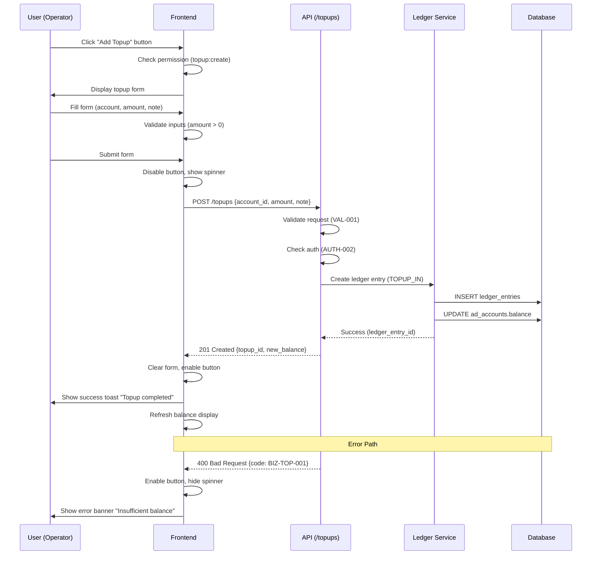
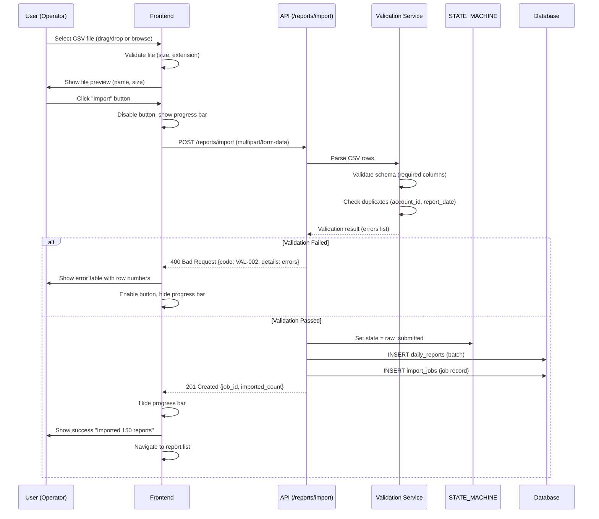
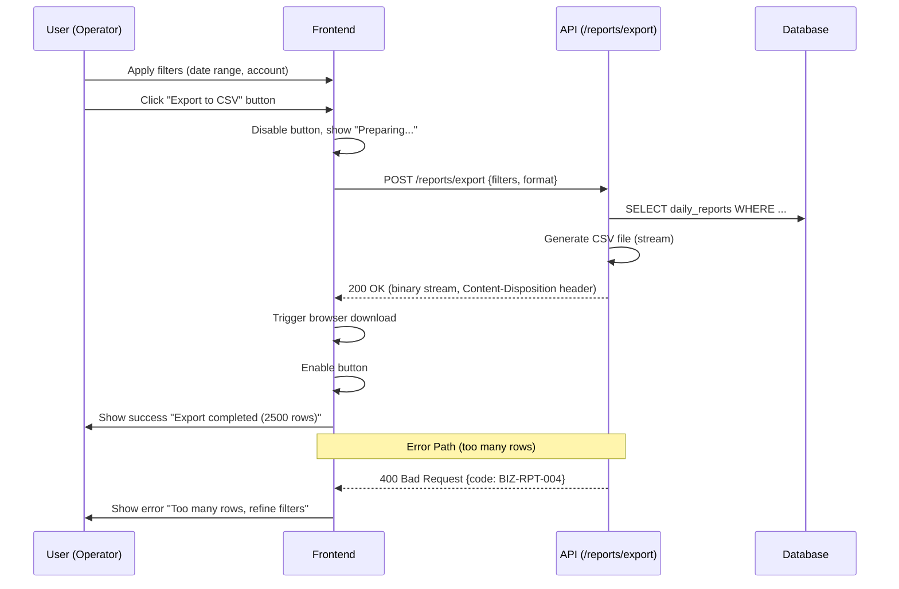
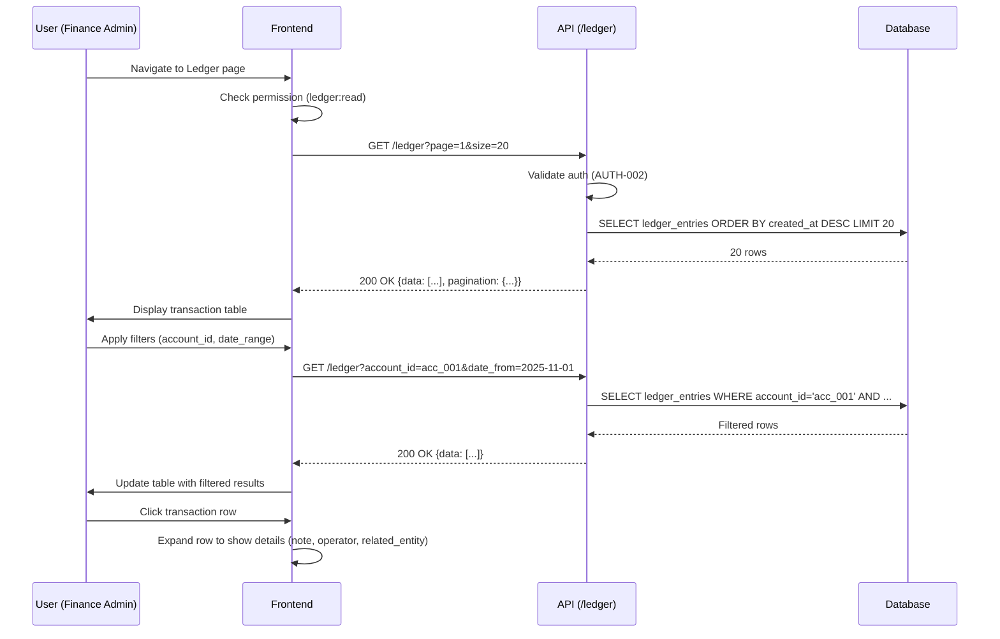
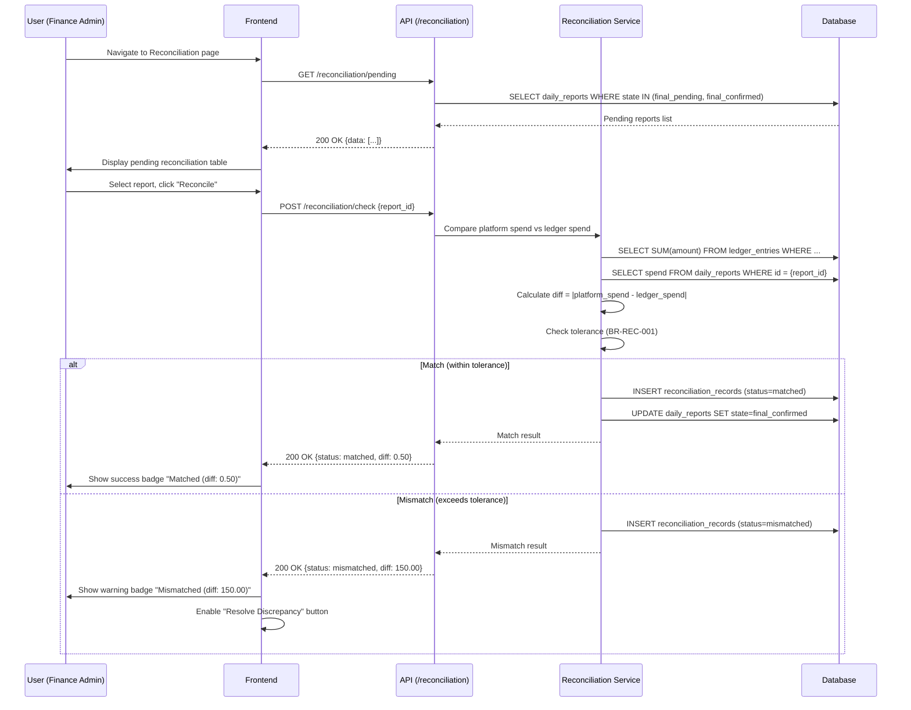
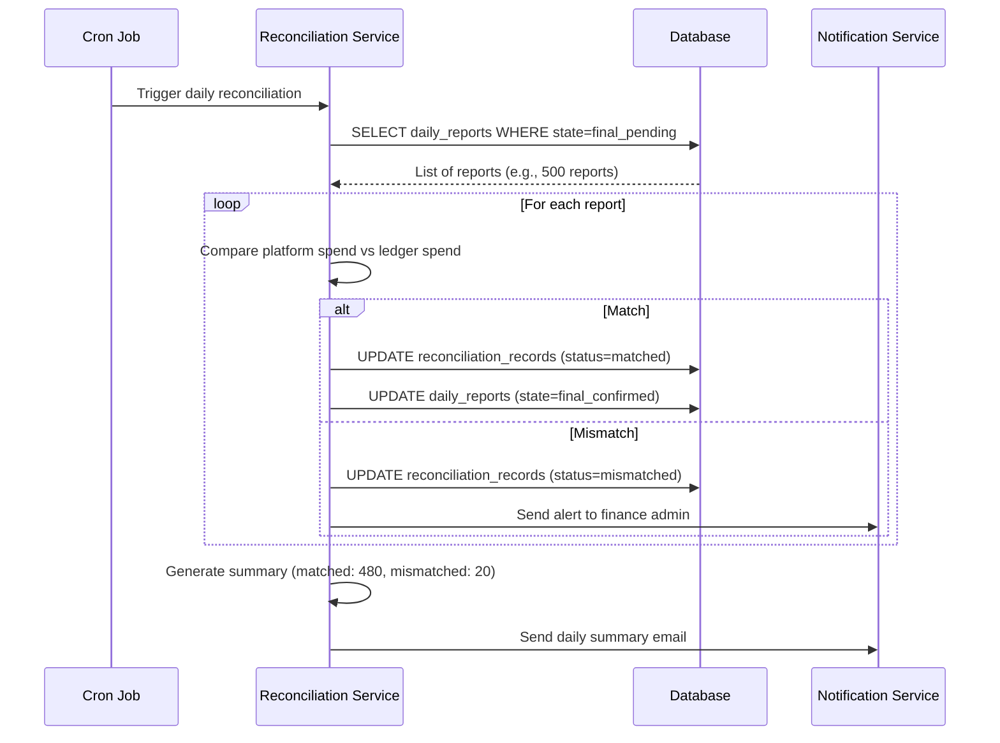
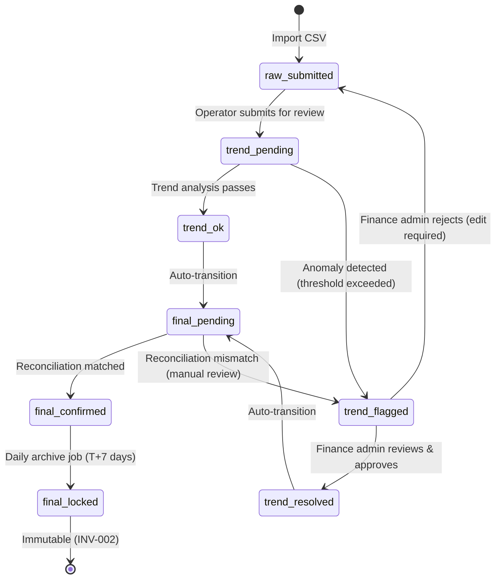
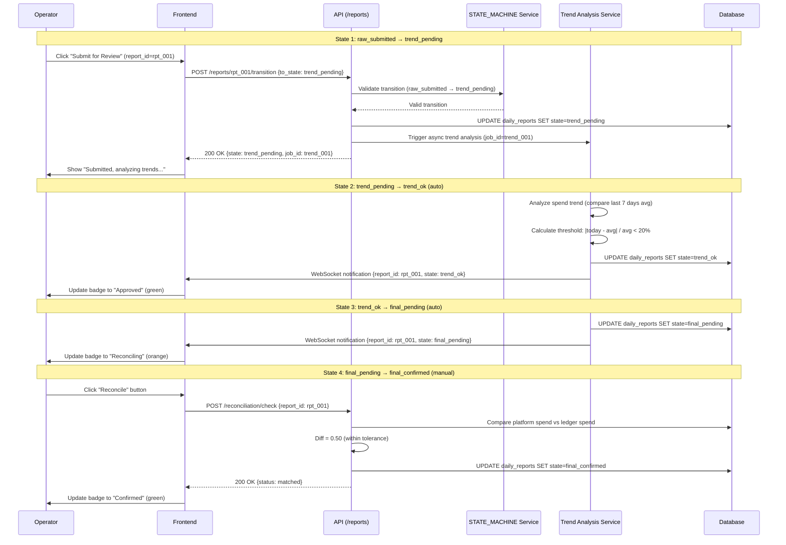

# UI Flow Specification

## 1. Purpose

This document specifies the complete user interface interaction flows for the AI Ad Spend Management System. It defines how users interact with the frontend, how the frontend communicates with backend APIs, and how different UI states transition based on user actions and system responses.

This specification serves as the authoritative reference for:
- Frontend developers implementing UI workflows
- QA engineers validating user interaction paths
- Product managers understanding system behavior
- Backend developers ensuring API contract compliance

All UI flows must comply with the underlying SoT specifications (API_SOT, STATE_MACHINE, AUTH_SPEC, BUSINESS_RULES).

## 2. Scope

### 2.1 Covered Flows

This document covers the following core UI interaction flows:

| Flow Category | Business Scenarios | Key States |
|--------------|-------------------|------------|
| Topup/Transfer | Manual topup, auto-transfer, balance adjustment | form_input, processing, completed, failed |
| Daily Report Import/Export | CSV upload, validation, export | uploading, validating, success, error |
| Ledger Transaction View | Browse history, filter by account/date | loading, displaying, empty |
| Reconciliation | Manual reconciliation, auto-check | pending, in_progress, matched, mismatched |
| Daily Report Approval | 8-state workflow from raw_submitted to final_locked | 8 states per STATE_MACHINE v2.6 |

### 2.2 Out of Scope

- Low-level component design (buttons, forms, tables)
- Visual design specifications (colors, fonts, spacing)
- Browser compatibility matrix
- Accessibility (WCAG) compliance details
- Performance optimization strategies

### 2.3 Assumptions

1. Frontend uses RESTful API calls to backend endpoints defined in API_SOT v9.0
2. All authentication follows AUTH_SPEC v2.0 with JWT tokens
3. Error responses follow ERROR_CODES_SOT v2.1 format
4. Daily report state transitions follow STATE_MACHINE v2.6
5. All monetary operations respect LEDGER_SOT v1.1 invariants

## 3. Common UI Patterns

### 3.1 Standard Form Submission Flow

All form submissions follow this pattern:

```
User Input → Frontend Validation → API Call → Loading State
→ Success/Error Response → UI Update → User Feedback
```

**Frontend Validation Rules**:
- Required fields: Non-empty check before API call
- Amount fields: Positive decimal validation (max 2 decimal places)
- Date fields: ISO 8601 format (YYYY-MM-DD)
- File uploads: Size limit 10MB, CSV/XLSX only

**Loading State Indicators**:
- Button: Disabled with spinner icon
- Form: Overlay with "Processing..." message
- Page: Global loading bar at top

### 3.2 Standard Error Display

All errors follow this hierarchy:

1. **Field-level errors**: Red text below input field (validation errors)
2. **Form-level errors**: Alert banner at top of form (API errors)
3. **Page-level errors**: Toast notification (system errors)

Error messages use `ERROR_CODES_SOT.md v2.1` format:
```json
{
  "code": "VAL-001",
  "message": "Invalid amount format",
  "details": {"field": "amount", "value": "abc"}
}
```

**Display Format**:
```
[ERROR_ICON] {message} (Code: {code})
[Details] button to toggle {details} object
```

### 3.3 Standard Permission Check

Before rendering any action button/link, frontend checks:

```javascript
// Pseudocode
if (userHasPermission(requiredPermission)) {
  renderButton(enabled=true)
} else {
  renderButton(enabled=false, tooltip="Insufficient permission")
}
```

Permissions are cached from `/auth/me` endpoint (AUTH_SPEC v2.0 § 3.2).

### 3.4 Standard Data Loading

All list/table views follow:

```
Page Mount → API Call → Loading Skeleton → Data Render → Empty State (if no data)
```

**Empty State Template**:
- Icon: Relevant illustration (e.g., empty box)
- Message: "No {resource} found"
- Action: "Create {resource}" button (if user has permission)

### 3.5 Standard Pagination

For paginated endpoints (API_SOT v9.0 § 4.1):

```
Request: GET /api/{resource}?page=1&size=20
Response: {
  "data": [...],
  "pagination": {
    "total": 150,
    "page": 1,
    "size": 20,
    "total_pages": 8
  }
}
```

**UI Controls**:
- Previous/Next buttons (disabled at boundaries)
- Page number display: "Page 1 of 8"
- Items per page selector: [10, 20, 50, 100]

## 4. Topup/Transfer Flow

### 4.1 Context & Business Purpose

Topup operations allow operators to add funds to ad account balances. Transfer operations move funds between accounts. Both operations must:
- Create audit trail via `ledger_entries` table (LEDGER_SOT v1.1)
- Respect balance invariants (MASTER.md v4.4 § 6 INV-001)
- Enforce operator permissions (AUTH_SPEC v2.0 § 5.2)

**Key Business Rules** (BUSINESS_RULES v3.1):
- BR-TOP-001: Topup amount must be positive
- BR-TOP-002: Transfer requires sufficient source balance
- BR-TOP-003: All monetary transactions recorded in ledger

### 4.2 Sequence Diagram



### 4.3 UI States

| State | Trigger | UI Elements | User Actions |
|-------|---------|-------------|--------------|
| **form_input** | Page load, form reset | Empty form, enabled submit button | Fill fields, click submit |
| **validating** | Submit click | Disabled button, field-level error messages | Wait or fix errors |
| **processing** | API call initiated | Disabled button, spinner, overlay | Wait (no interaction) |
| **success** | 201 response | Success toast, cleared form, updated balance | Close toast, create another |
| **error** | 4xx/5xx response | Error banner, enabled button | Retry or cancel |

**State Transitions**:
```
form_input → validating → processing → success → form_input
                ↓              ↓
           form_input      error → form_input
```

### 4.4 Permissions (AUTH_SPEC v2.0)

| Action | Required Permission | Role Mapping |
|--------|-------------------|--------------|
| View topup list | `topup:read` | operator, admin, super_admin |
| Create topup | `topup:create` | operator, admin, super_admin |
| View topup details | `topup:read` | operator, admin, super_admin |
| Cancel topup | `topup:delete` | admin, super_admin |

**Permission Check Example**:
```javascript
// Before rendering "Add Topup" button
const canCreateTopup = currentUser.permissions.includes('topup:create');
<Button disabled={!canCreateTopup}>Add Topup</Button>
```

### 4.5 API Endpoints (API_SOT v9.0)

| Endpoint | Method | Purpose | Request Body | Success Response |
|----------|--------|---------|--------------|------------------|
| `/topups` | GET | List topups | Query params | 200 + topup list |
| `/topups` | POST | Create topup | `{account_id, amount, note}` | 201 + topup object |
| `/topups/{id}` | GET | Topup details | - | 200 + topup object |
| `/topups/{id}` | DELETE | Cancel topup | - | 204 No Content |

**Request Example**:
```http
POST /api/topups
Authorization: Bearer {jwt_token}
Content-Type: application/json

{
  "account_id": "acc_123",
  "amount": 5000.00,
  "note": "Initial balance for Q4 campaign"
}
```

**Response Example**:
```json
{
  "id": "top_789",
  "account_id": "acc_123",
  "amount": 5000.00,
  "balance_after": 5000.00,
  "ledger_entry_id": "led_456",
  "note": "Initial balance for Q4 campaign",
  "created_at": "2025-11-27T10:30:00Z",
  "created_by": "user_001"
}
```

### 4.6 Error Handling

| Error Code | Scenario | User Message | Recovery Action |
|------------|----------|--------------|-----------------|
| VAL-001 | Invalid amount format | "Amount must be a positive number" | Correct input, resubmit |
| AUTH-002 | Missing permission | "You don't have permission to create topups" | Contact admin |
| BIZ-TOP-001 | Transfer source insufficient balance | "Source account has insufficient balance" | Reduce amount or topup source |
| STA-001 | Account locked | "Account is locked and cannot receive topups" | Unlock account first |
| SYS-001 | Database timeout | "System error, please try again" | Retry after 5 seconds |

**Error Display Logic**:
```javascript
// Pseudocode
function handleTopupError(error) {
  if (error.code.startsWith('VAL-')) {
    showFieldError(error.details.field, error.message);
  } else if (error.code.startsWith('AUTH-')) {
    showFormBanner(error.message, 'warning');
    disableSubmitButton();
  } else {
    showToast(error.message + ` (Code: ${error.code})`, 'error');
  }
}
```

## 5. Daily Report Import/Export Flow

### 5.1 Context & Business Purpose

Daily reports are imported from platforms (Meta, Google Ads) via CSV/Excel files. The system validates data structure, detects anomalies, and triggers the 8-state approval workflow. Export allows operators to download processed reports for offline analysis.

**Key Business Rules** (BUSINESS_RULES v3.1):
- BR-RPT-001: Daily report must have unique (account_id, report_date)
- BR-RPT-002: Import creates report in `raw_submitted` state
- BR-RPT-003: Export requires read permission + appropriate state

### 5.2 Import Sequence Diagram



### 5.3 Export Sequence Diagram



### 5.4 UI States

| State | Trigger | UI Elements | User Actions |
|-------|---------|-------------|--------------|
| **idle** | Page load | File dropzone, disabled import button | Select file |
| **file_selected** | File selected | File preview card, enabled import button | Import or remove file |
| **uploading** | Import clicked | Progress bar (0-100%), disabled button | Wait (no cancel) |
| **validating** | Upload complete | Indeterminate spinner "Validating..." | Wait |
| **validation_error** | 400 response | Error table (row, column, error), enabled retry | Fix file, retry |
| **success** | 201 response | Success message, cleared file input | Import another or view reports |
| **exporting** | Export clicked | "Preparing export..." spinner | Wait |
| **export_complete** | Browser download triggered | Success toast | Close toast |

### 5.5 API Endpoints (API_SOT v9.0)

| Endpoint | Method | Purpose | Request Body | Success Response |
|----------|--------|---------|--------------|------------------|
| `/reports/import` | POST | Import CSV | `multipart/form-data` (file) | 201 + job summary |
| `/reports/export` | POST | Export CSV | `{filters, format}` | 200 + binary stream |
| `/import-jobs/{id}` | GET | Import job status | - | 200 + job details |

**Import Request Example**:
```http
POST /api/reports/import
Authorization: Bearer {jwt_token}
Content-Type: multipart/form-data; boundary=----WebKitFormBoundary

------WebKitFormBoundary
Content-Disposition: form-data; name="file"; filename="daily_report_2025-11-27.csv"
Content-Type: text/csv

account_id,report_date,impressions,clicks,spend,conversions
acc_001,2025-11-26,10000,500,1200.50,25
acc_002,2025-11-26,15000,750,1800.75,40
------WebKitFormBoundary--
```

**Import Response Example**:
```json
{
  "job_id": "job_123",
  "status": "completed",
  "imported_count": 2,
  "failed_count": 0,
  "errors": [],
  "created_at": "2025-11-27T10:45:00Z"
}
```

**Export Request Example**:
```http
POST /api/reports/export
Authorization: Bearer {jwt_token}
Content-Type: application/json

{
  "filters": {
    "account_ids": ["acc_001", "acc_002"],
    "date_from": "2025-11-01",
    "date_to": "2025-11-30",
    "states": ["final_confirmed", "final_locked"]
  },
  "format": "csv"
}
```

### 5.6 Error Handling

| Error Code | Scenario | User Message | Recovery Action |
|------------|----------|--------------|-----------------|
| VAL-002 | Missing required column | "Missing column: spend" | Check file template |
| VAL-003 | Duplicate report | "Duplicate: acc_001 on 2025-11-26 (row 5)" | Remove duplicate row |
| BIZ-RPT-001 | Account not found | "Account acc_999 does not exist (row 10)" | Verify account ID |
| BIZ-RPT-004 | Export row limit exceeded | "Too many rows (max 10,000), refine filters" | Add date range filter |
| SYS-002 | File processing timeout | "File too large, split into smaller files" | Split file, retry |

## 6. Ledger Transaction View

### 6.1 Context & Business Purpose

The ledger view displays all financial transactions (topups, spends, refunds, adjustments) in chronological order. It serves as the audit trail for balance calculations, ensuring compliance with LEDGER_SOT v1.1 and MASTER.md § 6 INV-001:

**INV-001**: `account.balance = SUM(ledger_entries WHERE account_id = account.id)`

Users can filter by account, date range, transaction type, and operator to investigate balance discrepancies or audit financial history.

### 6.2 Sequence Diagram



### 6.3 UI States

| State | Trigger | UI Elements | User Actions |
|-------|---------|-------------|--------------|
| **loading** | Page mount, filter change | Skeleton table rows (shimmer effect) | Wait |
| **displaying** | API response received | Populated table, enabled filters | Browse, filter, paginate |
| **empty** | No results | Empty state illustration "No transactions found" | Clear filters or create topup |
| **error** | API error | Error banner with retry button | Click retry or contact support |

### 6.4 Table Columns & Formatting

| Column | Data Source | Format | Example |
|--------|-------------|--------|---------|
| Transaction ID | `ledger_entries.id` | Monospace font, truncated | `led_abc123...` |
| Date/Time | `ledger_entries.created_at` | `YYYY-MM-DD HH:mm:ss` | `2025-11-27 10:30:15` |
| Account | `ad_accounts.name` (join) | Link to account detail | `Meta - Campaign Q4` |
| Type | `ledger_entries.transaction_type` | Badge color | TOPUP_IN (green), SPEND (red) |
| Amount | `ledger_entries.amount` | Currency, signed | `+5000.00` / `-1200.50` |
| Balance After | `ledger_entries.balance_after` | Currency | `8500.00` |
| Operator | `users.name` (join) | Text | `John Doe` |
| Note | `ledger_entries.note` | Truncated, expandable | `Initial topup for...` |

**Transaction Type Badges**:
- `TOPUP_IN`: Green badge
- `SPEND`: Red badge
- `REFUND`: Blue badge
- `ADJUSTMENT`: Yellow badge
- `TRANSFER_OUT`: Orange badge
- `TRANSFER_IN`: Green badge

### 6.5 API Endpoints (API_SOT v9.0)

| Endpoint | Method | Purpose | Query Params | Success Response |
|----------|--------|---------|--------------|------------------|
| `/ledger` | GET | List transactions | `page, size, account_id, date_from, date_to, type` | 200 + ledger list |
| `/ledger/{id}` | GET | Transaction details | - | 200 + ledger entry |

**Request Example**:
```http
GET /api/ledger?account_id=acc_001&date_from=2025-11-01&date_to=2025-11-30&page=1&size=50
Authorization: Bearer {jwt_token}
```

**Response Example**:
```json
{
  "data": [
    {
      "id": "led_789",
      "account_id": "acc_001",
      "transaction_type": "TOPUP_IN",
      "amount": 5000.00,
      "balance_before": 0.00,
      "balance_after": 5000.00,
      "related_entity_type": "topup",
      "related_entity_id": "top_123",
      "note": "Initial balance for Q4 campaign",
      "created_at": "2025-11-27T10:30:00Z",
      "created_by": "user_001",
      "operator_name": "John Doe"
    },
    {
      "id": "led_790",
      "account_id": "acc_001",
      "transaction_type": "SPEND",
      "amount": -1200.50,
      "balance_before": 5000.00,
      "balance_after": 3799.50,
      "related_entity_type": "daily_report",
      "related_entity_id": "rpt_456",
      "note": "Daily spend for 2025-11-26",
      "created_at": "2025-11-27T11:00:00Z",
      "created_by": "system",
      "operator_name": "System (auto-import)"
    }
  ],
  "pagination": {
    "total": 150,
    "page": 1,
    "size": 50,
    "total_pages": 3
  }
}
```

### 6.6 Error Handling

| Error Code | Scenario | User Message | Recovery Action |
|------------|----------|--------------|-----------------|
| AUTH-003 | Missing ledger:read permission | "You don't have permission to view ledger" | Contact admin |
| VAL-004 | Invalid date format | "Date must be YYYY-MM-DD format" | Correct date input |
| SYS-001 | Database timeout | "Failed to load transactions, please retry" | Click retry button |

## 7. Reconciliation Flow

### 7.1 Context & Business Purpose

Reconciliation compares platform-reported spend (from daily reports) against internal ledger spend records to detect discrepancies. The system supports:
- **Auto-reconciliation**: Scheduled job that checks all accounts daily
- **Manual reconciliation**: Operator-triggered check for specific accounts/dates

Reconciliation status is stored in `reconciliation_records` table and follows RECONCILIATION_SOT v1.0.

**Key Business Rules** (BUSINESS_RULES v3.1):
- BR-REC-001: Reconciliation tolerance is ±1% or ±10 currency units (whichever is smaller)
- BR-REC-002: Mismatched reconciliation requires finance admin review
- BR-REC-003: Reconciliation locks related daily reports (prevents edits)

### 7.2 Manual Reconciliation Sequence Diagram



### 7.3 Auto-Reconciliation Flow

Auto-reconciliation runs daily at 2:00 AM UTC via scheduled job:



### 7.4 UI States

| State | Trigger | UI Elements | User Actions |
|-------|---------|-------------|--------------|
| **pending** | Page load | List of reports awaiting reconciliation | Select report, click reconcile |
| **in_progress** | Reconcile button clicked | Spinner on selected row | Wait |
| **matched** | API returns matched | Green badge, checkmark icon | View details, reconcile next |
| **mismatched** | API returns mismatched | Red badge, warning icon, diff amount | Click "Resolve Discrepancy" |
| **resolving** | Resolve button clicked | Modal with adjustment form | Enter adjustment reason, submit |

### 7.5 API Endpoints (API_SOT v9.0)

| Endpoint | Method | Purpose | Request Body | Success Response |
|----------|--------|---------|--------------|------------------|
| `/reconciliation/pending` | GET | List pending reconciliations | - | 200 + report list |
| `/reconciliation/check` | POST | Manual reconciliation | `{report_id}` | 200 + reconciliation result |
| `/reconciliation/{id}` | GET | Reconciliation details | - | 200 + reconciliation record |
| `/reconciliation/{id}/resolve` | POST | Resolve discrepancy | `{adjustment_amount, note}` | 200 + updated record |

**Reconciliation Check Response**:
```json
{
  "id": "rec_789",
  "report_id": "rpt_456",
  "status": "mismatched",
  "platform_spend": 1200.50,
  "ledger_spend": 1050.50,
  "difference": 150.00,
  "tolerance": 12.01,
  "checked_at": "2025-11-27T12:00:00Z",
  "checked_by": "user_001"
}
```

### 7.6 Error Handling

| Error Code | Scenario | User Message | Recovery Action |
|------------|----------|--------------|-----------------|
| BIZ-REC-001 | Report not in reconcilable state | "Report must be in final_pending state" | Check report status |
| BIZ-REC-002 | Reconciliation already exists | "Reconciliation already performed" | View existing record |
| AUTH-004 | Missing reconciliation permission | "You don't have reconciliation permission" | Contact admin |
| SYS-003 | Ledger calculation timeout | "Failed to calculate ledger total, retry" | Retry after 10 seconds |

## 8. Daily Report Approval Flow (8-State Workflow)

### 8.1 Context & 8-State Overview

Daily report approval follows the 8-state workflow defined in STATE_MACHINE.md v2.7 § 8:

```
raw_submitted → trend_pending → trend_ok / trend_flagged
→ trend_resolved → final_pending → final_confirmed → final_locked
```

**State Definitions**:

| State | Description | Terminal? | Editable? |
|-------|-------------|-----------|-----------|
| `raw_submitted` | Initial import state | No | Yes (operator) |
| `trend_pending` | Awaiting trend analysis | No | No (system processing) |
| `trend_ok` | Trend analysis passed | No | No |
| `trend_flagged` | Anomaly detected | No | Yes (finance admin) |
| `trend_resolved` | Anomaly reviewed and resolved | No | No |
| `final_pending` | Awaiting reconciliation | No | No |
| `final_confirmed` | Reconciliation matched | No | No |
| `final_locked` | Archived, immutable | Yes | No (INV-002) |

**MASTER.md § 8 INV-002**: Terminal states (`final_locked`) are immutable. Any modification requires creating a new report with reference to original.

### 8.2 State Transition Diagram



### 8.3 UI State Mapping Table

| Report State | Badge Color | Badge Text | Available Actions | Required Permission | Next States |
|--------------|-------------|------------|-------------------|---------------------|-------------|
| `raw_submitted` | Gray | Draft | Edit, Submit for Review, Delete | `report:write` | `trend_pending` |
| `trend_pending` | Blue | Analyzing | View, Cancel | `report:read` | `trend_ok`, `trend_flagged` |
| `trend_ok` | Green | Approved | View | `report:read` | `final_pending` (auto) |
| `trend_flagged` | Yellow | Flagged | View, Resolve, Reject | `report:approve` | `trend_resolved`, `raw_submitted` |
| `trend_resolved` | Teal | Resolved | View | `report:read` | `final_pending` (auto) |
| `final_pending` | Orange | Reconciling | View, Reconcile | `reconciliation:execute` | `final_confirmed`, `trend_flagged` |
| `final_confirmed` | Green | Confirmed | View, Export | `report:read` | `final_locked` (auto, T+7) |
| `final_locked` | Black | Locked | View (read-only), Export | `report:read` | None (terminal) |

### 8.4 State Transition Sequence Diagram



### 8.5 Permissions by State (AUTH_SPEC v2.0)

| Action | State Applicability | Required Permission | Role Mapping |
|--------|---------------------|---------------------|--------------|
| View report | All states | `report:read` | operator, finance_admin, admin |
| Edit report | `raw_submitted` only | `report:write` | operator, admin |
| Submit for review | `raw_submitted` | `report:submit` | operator, admin |
| Resolve flagged report | `trend_flagged` | `report:approve` | finance_admin, admin |
| Reconcile report | `final_pending` | `reconciliation:execute` | finance_admin, admin |
| Lock report (archive) | `final_confirmed` | `report:lock` | system (auto), admin |

**Permission Check Before Action**:
```javascript
// Pseudocode
function canPerformAction(report, action, user) {
  const permissionMap = {
    'edit': ['report:write'],
    'submit': ['report:submit'],
    'resolve': ['report:approve'],
    'reconcile': ['reconciliation:execute']
  };

  const stateMap = {
    'edit': ['raw_submitted'],
    'submit': ['raw_submitted'],
    'resolve': ['trend_flagged'],
    'reconcile': ['final_pending']
  };

  const hasPermission = user.permissions.some(p =>
    permissionMap[action].includes(p)
  );
  const validState = stateMap[action].includes(report.state);

  return hasPermission && validState;
}
```

### 8.6 Error Handling for State Transitions

| Error Code | Scenario | User Message | Recovery Action |
|------------|----------|--------------|-----------------|
| STA-001 | Invalid state transition | "Cannot transition from trend_ok to raw_submitted" | Check STATE_MACHINE v2.6 |
| STA-002 | Terminal state modification | "Cannot edit locked report (INV-002)" | Create new report |
| BIZ-RPT-002 | Submit incomplete report | "Report missing required fields (spend, impressions)" | Complete fields, resubmit |
| AUTH-005 | Missing approval permission | "Only finance admins can resolve flagged reports" | Assign to finance admin |

## 9. Error Handling & Edge Cases

### 9.1 Network Error Handling

**Scenarios**:
- Request timeout (> 30 seconds)
- Network disconnected (offline)
- 5xx server errors

**UI Response**:
```
[ERROR_ICON] Network error, please check your connection
[Retry] button | [Dismiss] button
```

**Implementation**:
```javascript
// Pseudocode
async function apiCall(endpoint, options) {
  try {
    const response = await fetch(endpoint, {
      ...options,
      timeout: 30000
    });
    return response;
  } catch (error) {
    if (error.name === 'AbortError') {
      showToast('Request timeout, please retry', 'error');
    } else if (!navigator.onLine) {
      showToast('No internet connection', 'error');
    } else {
      showToast('Network error, please retry', 'error');
    }
    enableRetryButton();
  }
}
```

### 9.2 Session Expiration Handling

**Scenario**: JWT token expires (1 hour default per AUTH_SPEC v2.0)

**UI Response**:
1. API returns `401 Unauthorized` with `{code: "AUTH-001", message: "Token expired"}`
2. Frontend intercepts response globally
3. Show modal: "Your session has expired, please log in again"
4. Redirect to `/login` with `redirect_url` parameter
5. After re-login, restore previous page state

**Implementation**:
```javascript
// Pseudocode
axios.interceptors.response.use(
  response => response,
  error => {
    if (error.response?.status === 401 && error.response?.data?.code === 'AUTH-001') {
      showSessionExpiredModal();
      saveCurrentPageState();
      redirectToLogin(window.location.pathname);
    }
    return Promise.reject(error);
  }
);
```

### 9.3 Concurrent Modification Handling

**Scenario**: Two users edit the same report simultaneously

**Backend Protection** (Optimistic Locking):
- Daily reports table has `version` column (integer, auto-increment on update)
- Update requests include current version: `PUT /reports/{id}?version=5`
- If current DB version ≠ request version, return `409 Conflict`

**UI Response**:
```json
{
  "code": "BIZ-RPT-003",
  "message": "Report was modified by another user",
  "details": {
    "your_version": 5,
    "current_version": 7,
    "modified_by": "user_002",
    "modified_at": "2025-11-27T12:05:00Z"
  }
}
```

**Recovery**:
1. Show modal: "This report was modified by John Doe at 12:05 PM"
2. Options:
   - [Reload] button: Discard local changes, reload fresh data
   - [View Changes] button: Show diff between local and server version
   - [Force Save] button: Overwrite server version (admin only)

### 9.4 File Upload Error Handling

**Scenarios**:
- File too large (> 10MB)
- Invalid file format (not CSV/XLSX)
- Corrupted file (parse error)
- Virus detected (backend scan)

**UI Response Table**:

| Error Code | Scenario | User Message | Recovery Action |
|------------|----------|--------------|-----------------|
| VAL-005 | File too large | "File size exceeds 10MB limit (current: 15.2MB)" | Compress or split file |
| VAL-006 | Invalid format | "Only CSV and XLSX files are supported" | Convert file format |
| VAL-007 | Parse error | "Failed to parse file at row 150: invalid date format" | Fix row 150, re-upload |
| SEC-001 | Virus detected | "File contains malicious content, upload blocked" | Scan file locally, contact IT |

**Pre-upload Validation**:
```javascript
// Pseudocode
function validateFileBeforeUpload(file) {
  const maxSize = 10 * 1024 * 1024; // 10MB
  const allowedTypes = ['text/csv', 'application/vnd.ms-excel', 'application/vnd.openxmlformats-officedocument.spreadsheetml.sheet'];

  if (file.size > maxSize) {
    showError('VAL-005', `File size exceeds 10MB limit (current: ${(file.size / 1024 / 1024).toFixed(1)}MB)`);
    return false;
  }

  if (!allowedTypes.includes(file.type)) {
    showError('VAL-006', 'Only CSV and XLSX files are supported');
    return false;
  }

  return true;
}
```

### 9.5 Balance Calculation Discrepancy

**Scenario**: UI displays balance that doesn't match ledger sum (violates INV-001)

**Detection**:
- Frontend calculates: `display_balance = SUM(ledger_entries.amount)`
- Compare with `ad_accounts.balance`
- If `|display_balance - account.balance| > 0.01`, trigger alert

**UI Response**:
```
[WARNING_ICON] Balance discrepancy detected
Expected: $5,000.00 | Actual: $4,985.00 | Diff: -$15.00
[Recalculate Balance] button (admin only)
```

**Recalculation Flow**:
1. Admin clicks "Recalculate Balance"
2. API call: `POST /admin/accounts/{id}/recalculate-balance`
3. Backend recalculates: `new_balance = SUM(ledger_entries)`
4. Update `ad_accounts.balance = new_balance`
5. Create audit log entry
6. Return new balance to frontend
7. Frontend refreshes display

**Error Handling**:
```json
{
  "code": "BIZ-BAL-001",
  "message": "Balance recalculation failed",
  "details": {
    "account_id": "acc_001",
    "expected": 5000.00,
    "calculated": 4985.00,
    "difference": -15.00,
    "ledger_entry_count": 150
  }
}
```

## 10. Relation to SoT

This UI Flow Specification is derived from and must comply with the following Source of Truth documents:

| SoT Document | Version | Relevant Sections | Impact on UI Flows |
|--------------|---------|-------------------|-------------------|
| **API_SOT.md** | v9.0 | § 4 (Endpoints), § 6 (Request/Response) | All API calls, request payloads, response structures |
| **STATE_MACHINE.md** | v2.6 | § 8 (8 States) | Daily report approval flow, state transition logic, terminal state handling |
| **AUTH_SPEC.md** | v2.0 | § 3.2 (JWT Auth), § 5 (Permissions) | Permission checks before rendering actions, session expiration handling |
| **BUSINESS_RULES.md** | v3.1 | § BR-TOP-001~003, BR-RPT-001~004, BR-REC-001~003 | Form validation rules, business constraint enforcement |
| **TRANSFER_SOT.md** | v1.0 | § 3 (Transfer Types) | Transfer flow UI, source/destination selection |
| **RECONCILIATION_SOT.md** | v1.0 | § 4 (Tolerance Rules) | Reconciliation result display, mismatch thresholds |
| **LEDGER_SOT.md** | v1.1 | § 2 (Transaction Types), § 5 (Balance Invariant) | Ledger view table structure, balance calculation display |
| **ERROR_CODES_SOT.md** | v2.1 | All error codes (VAL-*, AUTH-*, BIZ-*, STA-*, SYS-*, SEC-*) | Error message display, recovery actions |
| **DATA_SCHEMA.md** | v5.2 | Tables: `daily_reports`, `ad_accounts`, `ledger_entries`, `reconciliation_records` | Data model understanding, field constraints |

**Compliance Validation**:
- ✅ All API endpoints match API_SOT v9.0 definitions
- ✅ 8-state workflow matches STATE_MACHINE v2.6 § 8
- ✅ Permission checks reference AUTH_SPEC v2.0 § 5
- ✅ Error codes comply with ERROR_CODES_SOT v2.1 format
- ✅ Balance calculations respect LEDGER_SOT v1.1 invariants
- ✅ Reconciliation tolerance follows RECONCILIATION_SOT v1.0 § 4

**Deviation Protocol**:
If UI requirements cannot be satisfied by existing SoT specifications:
1. Document the gap in this section
2. Propose RFC (Request for Comment) to SoT owner
3. Wait for SoT update approval
4. Update UI_FLOW_SPEC.md to reference new SoT version

## 11. References

### 11.1 Internal Documents

- [MASTER.md](../sot/MASTER.md) v3.4 - System invariants (INV-001, INV-002)
- [API_SOT.md](../sot/API_SOT.md) v9.0 - API endpoint specifications
- [STATE_MACHINE.md](../sot/STATE_MACHINE.md) v2.6 - 8-state workflow definitions
- [AUTH_SPEC.md](../sot/AUTH_SPEC.md) v2.0 - Authentication & permission model
- [BUSINESS_RULES.md](../sot/BUSINESS_RULES.md) v3.1 - Business constraint rules
- [TRANSFER_SOT.md](../sot/TRANSFER_SOT.md) v1.0 - Transfer operation specifications
- [RECONCILIATION_SOT.md](../sot/RECONCILIATION_SOT.md) v1.0 - Reconciliation logic
- [LEDGER_SOT.md](../sot/LEDGER_SOT.md) v1.1 - Ledger system design
- [ERROR_CODES_SOT.md](../sot/ERROR_CODES_SOT.md) v2.1 - Error code definitions
- [DATA_SCHEMA.md](../sot/DATA_SCHEMA.md) v5.2 - Database schema reference

### 11.2 External Standards

- **REST API Design**: [Roy Fielding's Dissertation](https://www.ics.uci.edu/~fielding/pubs/dissertation/rest_arch_style.htm)
- **HTTP Status Codes**: [RFC 7231](https://tools.ietf.org/html/rfc7231)
- **JWT**: [RFC 7519](https://tools.ietf.org/html/rfc7519)
- **CSV Format**: [RFC 4180](https://tools.ietf.org/html/rfc4180)

### 11.3 Change Log

| Version | Date | Changes | Author |
|---------|------|---------|--------|
| v1.0 | 2025-11-27 | Initial draft with 5 core flows, 8-state mapping, SoT compliance table | wade |

---

**Document Status**: Draft
**Next Review**: 2025-12-04
**Approval Required**: Product Manager, Frontend Lead, Backend Lead