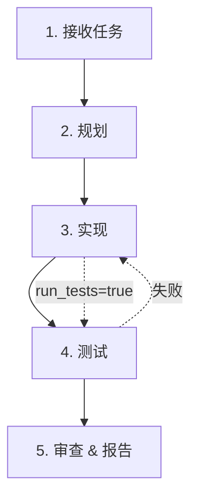

# AI_CODE_DEV_ORCHESTRATION_SOT v1.0

> **AI 辅助代码开发编排规范**

---

## 1. 文档目的与范围

### 1.1 文档定位

本规范定义 **AI 辅助代码开发流水线** 的架构、角色职责、I/O 契约和安全约束。

**当前版本（v1.0）强制约束范围**：

| 范围 | 状态 | 说明 |
|------|------|------|
| **后端 API 开发** | ✅ 强制约束 | HTTP 接口的 schema/service/router/tests |
| **后端 API 测试** | ✅ 强制约束 | 通过 `be_test_ci` Flow + `ap_run_pytest` |

**重要声明**：
- 本版本 v1.0 的 SoT 约束效力 **仅限于上述两项**
- 其他开发场景（通用后端模块、前端、测试框架、Infra）的扩展方向见 [附录 D：未来扩展规划](#附录-d未来扩展规划non-binding)，当前不具有 SoT 约束效力

### 1.2 与其他 SoT 文档的关系

本文档类型为 **SYSTEM_ORCHESTRATION_SOT**，定义 AI 参与代码开发时的行为规范和编排规则，**不负责定义业务规则本身**。

**SoT 优先级链（从高到低）**：

```
MASTER.md v3.6
    ↓
业务 SoT（STATE_MACHINE.md v2.6, BUSINESS_RULES.md v3.1, LEDGER_SOT.md v1.1 等）
    ↓
技术 SoT（API_SOT.md v9.0, DATA_SCHEMA.md v5.2, ERROR_CODES_SOT.md v2.1）
    ↓
开发流程 SoT（API_DEVELOPMENT_FLOW.md v2.3）
    ↓
本文档（AI_CODE_DEV_ORCHESTRATION_SOT v1.0）
```

**冲突解决规则**：
- 本规范与 `API_DEVELOPMENT_FLOW.md` 发生冲突时，以后者为准
- 本规范与 `API_SOT.md` / `ERROR_CODES_SOT.md` 发生冲突时，以后者为准
- AI 生成的代码与任何业务 SoT 冲突时，以业务 SoT 为准

### 1.3 核心目标

所有 AI 代码开发行为必须：

1. **严格对齐 SoT**：不得发明新的错误码、权限、状态枚举
2. **通过统一编排**：Orchestrator + MCP 工具 + agent_platform 协同
3. **可审计可回溯**：所有正式分支改动必须有日志记录

---

## 2. 整体分层架构

### 2.1 分层概览

从上到下分为五层：

```
┌─────────────────────────────────────────────────────────────┐
│  Layer 1: 调用入口层                                         │
│  Claude / Cursor / Claude Desktop / CLI                     │
└─────────────────────────┬───────────────────────────────────┘
                          ↓
┌─────────────────────────────────────────────────────────────┐
│  Layer 2: Skill 编排层（Claude Skills）                      │
│  ai-ad-api-dev-orchestrator → api-dev-planner              │
│                            → api-dev-impl                   │
│                            → api-dev-reviewer               │
└─────────────────────────┬───────────────────────────────────┘
                          ↓
┌─────────────────────────────────────────────────────────────┐
│  Layer 3: MCP 工具层（ai-ad-agents）                         │
│  ap_read_file | ap_write_file | ap_run_pytest              │
│  orch_be_test_ci                                            │
└─────────────────────────┬───────────────────────────────────┘
                          ↓
┌─────────────────────────────────────────────────────────────┐
│  Layer 4: agent_platform 层                                  │
│  Orchestrator + BEAgent + TestAgent                         │
│  Flow: be_test_ci (当前唯一正式 Flow)                        │
└─────────────────────────┬───────────────────────────────────┘
                          ↓
┌─────────────────────────────────────────────────────────────┐
│  Layer 5: 代码仓库 + SoT 文档层                              │
│  backend/ | frontend/ | tests/ | docs/2.sot/                │
└─────────────────────────────────────────────────────────────┘
```

### 2.2 各层职责

| 层级 | 职责 | 约束 |
|------|------|------|
| 调用入口 | 接收用户指令 | 不直接操作代码 |
| Skill 编排 | 理解需求、拆步骤、调用工具 | 不直接编辑大量代码 |
| MCP 工具 | 执行文件读写、测试运行 | 受安全边界约束 |
| agent_platform | 执行代码生成/修改 | 受 Flow 规范约束 |
| 代码仓库 | 存储代码和 SoT | 唯一真相来源 |

---

## 3. 核心角色与职责

### 3.1 Orchestrator Skill（总控）

**当前实现**：`ai-ad-api-dev-orchestrator`

**版本状态**：
- **当前版本**：v1.1.1
- **Freeze 状态**：✅ **已 Freeze**（2025-12-05）
- **后续改动要求**：必须走 OpenSpec Proposal 流程

**职责**：
- 接收开发任务（结构化输入）
- 选择对应的子 Skill/Flow
- 串联执行：planner → impl → pytest → reviewer → report
- 汇总输出最终报告

**它不关心具体怎么写代码**，只关心：哪个子流程来做 + 顺序是什么。

### 3.2 Planner Skill（规划）

**当前实现**：`api-dev-planner`（建设中）

**职责**：
- 只读 SoT 文档 + 代码结构
- 输出任务蓝图：`files_to_touch` + `dev_steps` + `review_checklist`
- **不写代码**

### 3.3 Impl Skill（实现）

**当前实现**：`api-dev-impl`

**职责**：
- 接收任务输入 + planner 产出的 plan
- 大块改动通过 MCP 调用 `orch_be_test_ci`
- 小范围补丁直接通过 `ap_write_file`
- 输出：`files_changed` + `pytest_summary` + `warnings`

### 3.4 Reviewer Skill（审查）

**当前实现**：`api-dev-reviewer`（建设中）

**职责**：
- 对照 SoT + plan + 实际改动
- 输出 P0/P1/P2 问题列表
- **不直接改代码**，只给审查报告

### 3.5 命名规范

**Skill 命名格式**：`{domain}-{role}-{function}`

| 模式 | 示例 | 状态 |
|------|------|------|
| API 开发 | `api-dev-planner`, `api-dev-impl`, `api-dev-reviewer` | ✅ 当前有效 |
| 通用后端 | `be-dev-planner`, `be-dev-impl` | ⏳ 规划示例 |
| 前端 | `fe-dev-planner`, `fe-dev-impl` | ⏳ 规划示例 |

**Flow 命名格式**：`{layer}_{purpose}_{suffix}`

| Flow | 状态 | 说明 |
|------|------|------|
| `be_test_ci` | ✅ **当前唯一正式 Flow** | 后端代码生成 + 测试运行 |

> **重要**：在 v1.0 中，所有后端 API 开发任务 **默认应通过 `be_test_ci` Flow 落地**。其他 Flow 名称（如 `be_only`, `test_only`, `fe_dev`）仅作为未来扩展示例，不视为 SoT 已生效能力。

---

## 4. MCP 工具与 agent_platform 协作

### 4.1 MCP 工具清单

**基础 IO 工具**：

| 工具 | 功能 | 约束 |
|------|------|------|
| `ap_read_file(path)` | 读取文件 | 只读 |
| `ap_write_file(path, content)` | 写入文件 | 受 `auto_write` 控制 |
| `ap_run_pytest(path)` | 执行测试 | 返回结构化结果 |
| `ap_run_cli(cmd)` | 执行命令 | 仅限白名单命令 |

**流程级工具（agent_platform 入口）**：

| 工具 | 功能 | 对应 Flow | 状态 |
|------|------|----------|------|
| `orch_be_test_ci(payload)` | 后端开发 + 测试 | `be_test_ci` | ✅ 当前唯一 |

**重要**：所有 Skill **MUST NOT** 直接绕过 MCP 操作本地代码或环境。

### 4.2 I/O 契约规范

#### 4.2.1 Orchestrator 输入契约

```json
{
  "change_type": "api" | "api_test",
  "mode": "feature" | "bugfix" | "refactor",
  "module": "finance_profit" | "daily_reports" | "topups" | "...",
  "description": "自然语言需求描述",
  "auto_write": false,
  "run_tests": true,
  "pytest_path": "backend/tests/api",
  "extra": {}
}
```

| 字段 | 类型 | 必填 | 默认值 | 说明 |
|------|------|------|--------|------|
| `change_type` | enum | ✅ | - | 变更类型（见下文约束说明） |
| `mode` | enum | ❌ | `"feature"` | 开发性质：feature / bugfix / refactor |
| `module` | string | ✅ | - | 目标模块名 |
| `description` | string | ✅ | - | 需求描述 |
| `auto_write` | bool | ❌ | `false` | 是否自动写入文件 |
| `run_tests` | bool | ❌ | `true` | 是否运行测试 |
| `pytest_path` | string | ❌ | `"backend/tests/api"` | 测试路径 |
| `extra` | object | ❌ | `{}` | 扩展参数 |

**change_type 约束说明**：

| change_type | 本版本约束级别 | 说明 |
|-------------|----------------|------|
| `api` | ✅ **强制约束** | 后端 API 开发，必须遵守本规范全部规则 |
| `api_test` | ✅ **强制约束** | 后端 API 测试，必须遵守本规范全部规则 |
| 其他值 | ⚠️ 实验性 | 建议遵守本规范，但不构成 SoT 违规依据 |

#### 4.2.2 Orchestrator 输出契约

```json
{
  "status": "SUCCESS" | "FAILURE" | "PARTIAL",
  "plan_summary": {
    "files_to_touch": ["backend/schemas/...", "..."],
    "dev_steps": ["Step 1: ...", "Step 2: ..."],
    "review_checklist": ["检查项1", "检查项2"]
  },
  "impl_summary": {
    "files_changed": ["backend/services/...", "..."],
    "code_summary": "Created 3 files, modified 1 file",
    "warnings": []
  },
  "pytest_summary": {
    "executed": true,
    "passed": 5,
    "failed": 0,
    "errors": 0,
    "skipped": 0,
    "duration": "2.3s",
    "failure_details": []
  },
  "review_summary": {
    "passed": true,
    "issues": [],
    "suggestions": []
  },
  "open_issues": [
    {"priority": "P1", "issue": "需新增权限", "suggestion": "更新 AUTH_SPEC.md"}
  ],
  "run_id": "uuid-xxx",
  "timestamp": "2025-12-06T10:30:00Z"
}
```

> **字段说明**：日志结构（§7.5）是 Orchestrator 输出的子集/投影，字段名应保持一致。

#### 4.2.3 be_test_ci Flow 输出契约

```json
{
  "status": "SUCCESS" | "FAILURE" | "PARTIAL",
  "run_id": "flow-xxx-xxx",
  "files_written": [
    "backend/schemas/finance_profit.py",
    "backend/services/finance_profit_service.py"
  ],
  "pytest_summary": {
    "total": 10,
    "passed": 9,
    "failed": 1,
    "errors": 0,
    "skipped": 0,
    "duration": "3.5s"
  },
  "steps": [
    {"step": 1, "name": "BEAgent.generate", "status": "success"},
    {"step": 2, "name": "TestAgent.run", "status": "partial"}
  ],
  "error_message": null
}
```

### 4.3 auto_write / run_tests 参数规范

本节定义 `auto_write` 和 `run_tests` 参数的语义、默认值和行为约束。违反本节规则的严重等级定义见 §7.4。

#### 4.3.1 参数默认值

| 参数 | 默认值 | 语义 |
|------|--------|------|
| `auto_write` | `false` | Dry-run 模式，只生成计划/补丁，不写文件 |
| `run_tests` | `true` | 实现后运行测试 |

#### 4.3.2 auto_write 行为规则

**定义**："首次执行"指对同一 `(change_type, module, description)` 组合的首次 Orchestrator 运行。

**规则**：

1. **首次执行 MUST 使用 `auto_write=false`**：
   - Skill/Flow **MUST** 只输出代码建议/补丁
   - **MUST NOT** 调用 `ap_write_file` 或 `orch_*` 的写入功能

2. **切换为 `auto_write=true` 的条件**：
   - 用户已审阅 dry-run 输出
   - 用户明确确认接受自动写入
   - Orchestrator **MUST** 在报告中提示："注意：此操作会直接修改文件"

#### 4.3.3 run_tests 行为规则

1. **默认行为**：`run_tests=true`，实现完成后自动运行对应范围的 pytest

2. **设置 `run_tests=false` 时**：
   - 对于 `be_test_ci` Flow，**MUST** 在输出报告中标记为 **P1 流程警告**
   - 报告 **MUST** 包含提示："测试被跳过，上线前必须手动验证"

---

## 5. 当前已支持场景

本节仅列出 v1.0 版本中具有 SoT 约束效力的开发场景。

| 场景 | SoT 依赖 | Skill | Flow |
|------|----------|-------|------|
| 后端 API 开发 | API_SOT v9.0, API_DEVELOPMENT_FLOW v2.3 | `api-dev-*` | `be_test_ci` |
| 后端 API 测试 | ERROR_CODES_SOT v2.1, STATE_MACHINE.md v2.6 | `api-dev-impl` | `be_test_ci` |

**强调**：在 v1.0 中，所有后端 API 开发任务 **MUST** 通过 `be_test_ci` Flow 落地。

---

## 6. 通用开发流程

### 6.1 五步模型



### 6.2 步骤详解

| 步骤 | 执行者 | 输入 | 输出 |
|------|--------|------|------|
| 1. 接收任务 | Orchestrator | 用户指令 | 结构化任务对象 |
| 2. 规划 | Planner | 任务 + SoT | `files_to_touch`, `dev_steps`, `review_checklist` |
| 3. 实现 | Impl + agent_platform | plan + SoT | `files_changed`, `warnings` |
| 4. 测试 | `ap_run_pytest` | 测试路径 | `pytest_summary` |
| 5. 审查 & 报告 | Reviewer + Orchestrator | 所有中间结果 | 最终报告 |

---

## 7. 统一约束与安全边界

### 7.1 SoT 优先级约束

**MUST**：
- 任意 Skill / Agent 的行为 **MUST** 遵守 SoT 文档约束
- 代码生成 **MUST** 使用 ERROR_CODES_SOT 定义的错误码
- 状态转换 **MUST** 遵循 STATE_MACHINE.md 定义的合法路径
- 权限检查 **MUST** 使用 AUTH_SPEC.md 定义的 `resource:action` 格式

**MUST NOT**：
- **MUST NOT** 发明不在 SoT 中的错误码、权限、状态枚举
- **MUST NOT** 绕过 SoT 定义的业务规则

**如需突破 SoT**：
- **MUST** 在输出中标记为"需要 SoT 变更"
- **MUST** 通过 OpenSpec/Proposal 流程更新 SoT

### 7.2 文件操作安全边界

**MUST**：
- 所有写操作 **MUST** 通过 `ap_write_file` 或 `orch_*` 完成
- 所有 Flow **MUST** 记录本次写入的文件列表

**路径黑名单（MUST NOT 修改）**：

```
.git/                 # Git 元数据
.venv/                # 虚拟环境
.mcp/                 # MCP 配置
.idea/                # IDE 配置
.vscode/              # IDE 配置
node_modules/         # Node 依赖
__pycache__/          # Python 缓存
env/                  # 环境目录
.env                  # 环境变量文件
.env.*                # 环境变量文件
config/prod.*         # 生产配置
config/production.*   # 生产配置
secrets/              # 密钥目录
*.key                 # 密钥文件
*.pem                 # 证书文件
```

### 7.3 命令执行安全边界

**`ap_run_cli` 命令白名单**（仅允许）：

```
pytest                # 测试执行
python -m pytest      # 测试执行
alembic               # 数据库迁移（需审核）
git status            # Git 状态查看
git diff              # Git 差异查看
```

**命令黑名单（MUST NOT 执行）**：

```
rm -rf                # 递归删除
rm -r                 # 递归删除
docker                # 容器操作
kubectl               # K8s 操作
ssh                   # 远程连接
scp                   # 远程复制
curl                  # 网络请求（除非明确需要）
wget                  # 网络下载
pip install           # 包安装（需人工确认）
npm install           # 包安装（需人工确认）
DROP TABLE            # 数据库删除
TRUNCATE              # 数据库清空
DELETE FROM           # 数据库删除（无 WHERE）
```

### 7.4 测试与流程违规

本节定义违反 §4.3 规则时的严重等级。参数语义与默认值详见 §4.3。

**P0 流程违规**（阻塞合并/上线）：
- 改动未经任何测试验证即尝试合并到正式分支

**P1 流程警告**（需在报告中明确标注）：
- 使用 `run_tests=false` 且改动涉及核心业务逻辑
- 首次执行使用 `auto_write=true`（跳过 dry-run 审阅）

**报告要求**：
- 所有 P0/P1 问题 **MUST** 在 Orchestrator 输出的 `open_issues` 字段中列出
- 存在 P0 问题时，`status` **MUST** 为 `FAILURE`

### 7.5 审计日志规范

**日志记录要求**：

| 场景 | 要求 | 说明 |
|------|------|------|
| 正式分支 / 准生产 | **MUST** 写入日志 | 包括 main, master, develop, release/* 等 |
| 本地实验 / 个人分支 | SHOULD 写入日志 | 开发者本机调试可选 |

**日志存储路径**：`logs/ai_dev_runs/`

**日志结构**（字段名与 §4.2.2 Orchestrator 输出保持一致）：

```json
{
  "run_id": "uuid-xxx-xxx-xxx",
  "timestamp": "2025-12-06T10:30:00Z",
  "caller": "ai-ad-api-dev-orchestrator",
  "change_type": "api",
  "mode": "feature",
  "module": "finance_profit",
  "description": "新增利润查询 API",
  "flow": "be_test_ci",
  "auto_write": true,
  "run_tests": true,
  "impl_summary": {
    "files_changed": ["backend/services/..."],
    "code_summary": "..."
  },
  "pytest_summary": {
    "passed": 5,
    "failed": 0
  },
  "review_summary": {
    "passed": true,
    "issues": []
  },
  "status": "SUCCESS"
}
```

---

## 8. context7 使用约定

### 8.1 核心原则

**context7 用于检索和导航，不是 SoT 版本的最终权威来源。**

### 8.2 Skill 层使用

**用途**：通过 context7 访问 SoT 文档与代码摘要

**约束**：
- **只读访问**，不通过 context7 修改文件
- 用于快速检索 API_SOT、ERROR_CODES_SOT 等规范
- 用于获取代码结构概览

### 8.3 版本判断规则

**MUST NOT**：
- Skill / Agent 在判断 SoT 版本时 **MUST NOT** 仅依赖 context7 索引内容

**MUST**：
- **MUST** 优先读取仓库中 SoT 文档 frontmatter 的 `version` 字段
- 如发现 context7 内容与仓库实际文件版本不一致，**MUST** 以仓库文件为准

**检测方法**：
1. 从 context7 获取文档内容
2. 读取仓库中对应文件的 YAML frontmatter `version` 字段
3. 如不一致，以仓库文件为准

### 8.4 agent_platform 层使用

**约束**：
- agent_platform 层 **不强制使用 context7**
- 可以只依赖本地文件与传入参数
- 如使用 context7，**MUST** 以仓库实际文件为最终真相

---

## 9. 版本与扩展策略

### 9.1 当前版本

- **版本**：v1.0
- **状态**：active
- **强制约束范围**：后端 API 开发 + 后端 API 测试
- **唯一正式 Flow**：`be_test_ci`

### 9.2 扩展策略

后续新增能力时：
1. 在本规范中增加对应章节
2. 定义新的 SoT 文档链接
3. 定义新的 Skill 族和 Flow
4. **保持分层模型不变**，避免各搞一套

### 9.3 待补充清单

| 优先级 | 事项 | 状态 |
|--------|------|------|
| P1 | 完善 `api-dev-planner` Skill | 建设中 |
| P1 | 完善 `api-dev-reviewer` Skill | 建设中 |
| P2 | 实现 `be_only` / `test_only` Flow | 规划中 |

---

## 附录 A：术语对照

| 术语 | 说明 |
|------|------|
| **SoT** | Source of Truth，规范的唯一来源文档 |
| **Skill** | Claude 侧的"角色/工具"，负责编排和决策，不直接大量编辑代码 |
| **MCP** | Model Context Protocol，Claude ↔ 本地工具的桥梁 |
| **agent_platform** | 多 Agent 执行框架（BEAgent / TestAgent 等） |
| **Flow** | agent_platform 内部的执行流程（如 `be_test_ci`） |
| **Envelope** | 统一 API 响应格式（success + data/error + request_id + timestamp） |

---

## 附录 B：已注册 Flow

| Flow | 状态 | 输入 | 输出 | 说明 |
|------|------|------|------|------|
| `be_test_ci` | ✅ **当前唯一正式 Flow** | task, target_files, auto_write | status, files_written, pytest_summary, steps | 后端代码生成 + 测试 |

---

## 附录 C：Change Log

| Version | Date | Changes |
|---------|------|---------|
| v1.0 | 2025-12-06 | 二次补丁：统一 API_DEVELOPMENT_FLOW 引用为 v2.3；拆分 change_type 与 mode 字段并明确约束范围；统一 Orchestrator 输出与日志字段名（review_summary）；明确 auto_write/run_tests 首次执行规则；升级日志要求为正式分支 MUST；强化 context7 版本判断规则；强调 be_test_ci 为当前唯一正式 Flow |
| v1.0 | 2025-12-06 | 初版修订：明确范围为 Backend/API-first；新增 SoT 优先级链；补充 I/O 契约规范；强化安全边界为 MUST/MUST NOT；新增命名规范、日志结构、context7 约定 |
| v1.0-draft | 2025-12-05 | 初始草稿 |

**Skill Freeze 记录**：

| Skill 名称 | 版本 | Freeze 日期 | 后续改动要求 |
|-----------|------|------------|-------------|
| `ai-ad-api-dev-orchestrator` | v1.1.1 | 2025-12-05 | 必须走 OpenSpec Proposal 流程 |

---

## 附录 C.1：Golden Pipeline Samples（金样本流水线）

本附录记录通过完整 API 开发流水线验证的"金样本"案例，作为后续开发的参考模板。

### Sample #1: Finance Profit Summary API

**登记日期**: 2025-12-06  
**run_id**: `orch-20251206-finance-profit-summary-002`

| 字段 | 值 |
|------|-----|
| **模块** | `finance_profit` |
| **端点** | `GET /api/v1/finance/profit/summary` |
| **Orchestrator 版本** | `ai-ad-api-dev-orchestrator v1.1.1` |
| **change_type** | `api` |
| **mode** | `feature` |
| **auto_write** | `true`（已启用，代码无需修改） |
| **run_tests** | `true`（已执行） |

**流水线结果摘要**：

| 阶段 | 结果 |
|------|------|
| **Pytest** | executed=true, passed=15, failed=0, errors=0, duration=~1.3s |
| **Review** | status=pass, p0_count=0, p1_count=0, p2_count=0, recommend_deploy=true |
| **Doc Sync** | docs_to_update_count=0, openspec_required=false, doc_desync_risk=low |

**测试覆盖**：
- Happy Path: 6 个用例（生成聚合、月度/日度/项目/账户利润、整体汇总）
- Validation: 3 个用例（无效日期范围、未来日期、日期范围超限）
- Permissions: 4 个用例（media_buyer 角色权限检查）
- Error Codes: 2 个用例（项目/账户不存在 404）

**SoT 对齐验证**：
- ✅ 实现与 `PROFIT_SOT.md v1.1 §3.7` 规范一致
- ✅ 权限控制：`require_role(["admin", "finance"])` 符合 SoT
- ✅ 参数校验：`year` (2020-2099), `month` (1-12) 符合 SoT
- ✅ 响应结构：符合 API_SOT.md v9.0 Envelope 格式

**备注**：
- 这条流水线是"实现已完整，无需代码修改"的 noop 分支样本
- 可作为后续类似端点的开发参考模板
- 已纳入回归基线 v1.1（见 `BACKEND_REGRESSION_FREEZE_REPORT_v1.1.md`）

---

### Sample #2: Dashboard Frontend Integration (Pending)

**登记日期**: 2025-12-06
**测试报告**: `DASHBOARD_INTEGRATION_TEST_REPORT_v1.0.md`

| 字段 | 值 |
|------|-----|
| **模块** | `dashboard` (Frontend) |
| **页面** | `http://localhost:3000/dashboard` |
| **测试基准** | `FRONTEND_DEVELOPMENT_FLOW_v1.0.md §3.4.1` (14 项联调检查清单) |
| **状态** | 🟡 **Pending** - 待实现真实 API 调用 |

**当前测试结果**：

| 阶段 | 结果 |
|------|------|
| **14 项联调检查** | 7/14 PASS, 0/14 FAIL, 7/14 BLOCKED |
| **P0 项通过率** | 1/5 (20%) - 仅环境变量配置通过 |
| **P1 项通过率** | 1/4 (25%) - 仅类型对齐通过 |
| **P2 项通过率** | 5/5 (100%) - 全部通过 |
| **阻塞原因** | Dashboard 使用 Mock 数据，无真实 API 请求 |

**测试覆盖详情**：

✅ **已通过项** (7/14):
1. ✅ 环境变量配置 (P0)
2. ✅ 类型对齐 (P1)
3. ✅ Loading 状态 (P2)
4. ✅ 空状态处理 (P2)
5. ✅ 数据刷新 (P2)
6. ✅ 多环境配置 (P2)
7. ⚠️ 控制台无错误 (P1) - 有 2 个 Warning (图表尺寸问题)

🟡 **阻塞项** (7/14) - 需实现真实 API:
1. 🟡 后端服务启动 (P0) - 健康检查端点未响应
2. 🟡 CORS 配置 (P0) - 无 API 请求，无法验证
3. 🟡 API 路由对齐 (P0) - 无 API 请求，无法验证
4. 🟡 Envelope 格式 (P0) - 无 API 请求，无法验证
5. 🟡 数据解包 (P1) - 无 API 请求，无法验证
6. 🟡 错误处理 (P1) - 无 API 请求，无法验证
7. 🟡 鉴权 Token (P1) - 无 API 请求，无法验证

**待实现 API 端点** (需后端支持):
- `GET /api/v1/dashboard/kpi` - KPI 指标
- `GET /api/v1/dashboard/trend` - 趋势图数据
- `GET /api/v1/dashboard/alerts` - 风险预警
- `GET /api/v1/dashboard/tasks` - 今日待办
- `GET /api/v1/dashboard/funds` - 资金概览

**SoT 对齐要求**：
- ✅ 响应格式必须符合 `API_SOT.md v9.0` Envelope 格式
- ✅ 错误码必须符合 `ERROR_CODES_SOT.md v2.1`
- ✅ 权限控制必须符合 `AUTH_SPEC.md v2.0`
- ✅ 状态映射必须符合 `STATE_MACHINE.md v2.6`

**下一步行动**：
1. **实现 Dashboard API 服务层** (`frontend/src/modules/dashboard/services/dashboardApi.ts`)
2. **更新 useDashboardData Hook** - 替换 Mock 数据为真实 API 调用
3. **后端实现 5 个 Dashboard API 端点** - 符合 API_SOT.md v9.0 规范
4. **配置后端 CORS** - 允许 `http://localhost:3000` 跨域
5. **重新执行 14 项联调验收测试** - 目标：14/14 PASS
6. **通过后正式纳入 Golden Pipeline** - 更新状态为 ✅ Ready

**备注**：
- 这是第一条前端联调 Golden Pipeline 候选
- 当前处于 "UI/架构金样本" 状态（Mock 数据）
- 待完成真实 API 联调后，将成为完整的前端 Golden Pipeline
- 详细测试报告见 `docs/4.testing/DASHBOARD_INTEGRATION_TEST_REPORT_v1.0.md`

---

## 附录 D：未来扩展规划（non-binding）

以下内容为未来版本目标，**当前不具有 SoT 约束效力**。

### D.1 规划中的开发场景

| 场景 | 待补充 SoT | 待补充 Skill | 待补充 Flow |
|------|------------|--------------|-------------|
| 通用后端模块 | BACKEND_MODULE_SOT | `be-dev-*` | `be_only` |
| 前端模块 | FRONTEND_SOT | `fe-dev-*` | `fe_dev` |
| 测试框架 | TEST_SOT | `test-dev-*` | `test_only` |
| Infra/DevOps | INFRA_SOT | `infra-dev-*` | `infra_task` |

### D.2 规划中的 Flow 示例

| Flow | 说明 |
|------|------|
| `be_only` | 仅后端代码生成，不跑测试 |
| `test_only` | 仅运行测试 |
| `fe_dev` | 前端模块开发 |
| `infra_task` | 基础设施任务 |

> **注意**：上述 Flow 名称仅为示例，实际实现时需要在本规范中正式注册并更新 [附录 B](#附录-b已注册-flow)。
