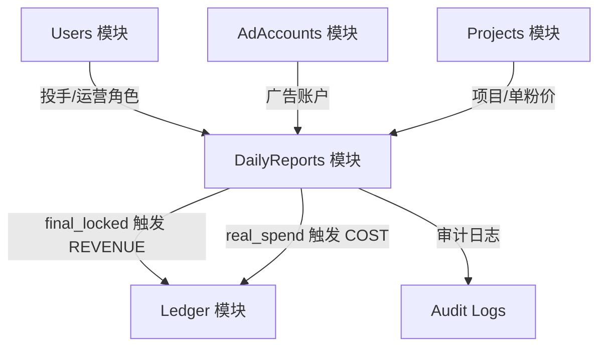
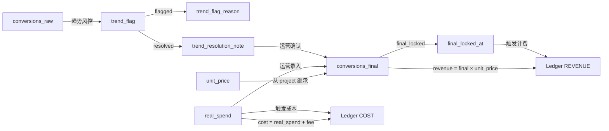
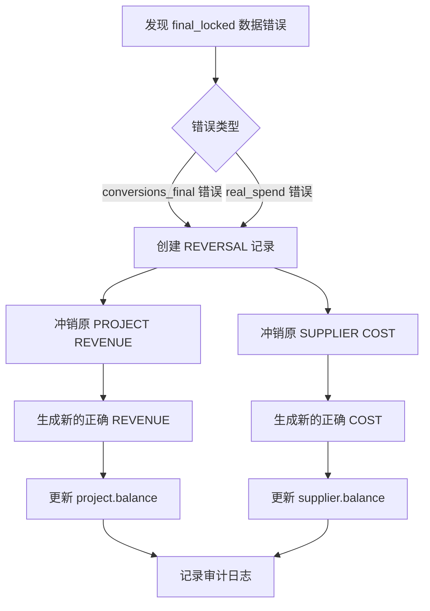

# Daily Report 模块规范（DAILY_REPORT_SOT - Single Source of Truth）

> **文档版本**: v1.0
> **status**: active
> **owner**: wade
> **last_reviewed**: 2025-11-27
> **发布日期**: 2025-01-22
> **文档类型**: 日报模块领域唯一真相源（SoT-DailyReport）
> **适用范围**: 后端开发、前端开发、数据运营、财务团队、测试工程师
> **规范级别**: 🔴 强制执行（PR 必查）
> **文档定位**: 日报模块的数据模型、三数据流、状态机、并发控制、业务规则的唯一定义

---

## ⚡ 快速导航

| 章节 | 内容 | 适用人员 |
|-----|------|---------|
| [1. 文档定位](#1-文档定位) | DailyReport 模块职责、仲裁规则 | 架构师、Tech Lead |
| [2. 模块范围](#2-模块范围module-boundary) | 业务目的、模块边界、依赖关系 | 全员 |
| [3. 数据模型 SoT](#3-数据模型-sotdata-schema-mapping) | 字段职责、逻辑关系、三数据流标记 | 后端开发、DBA |
| [4. 三数据流定义](#4-三数据流定义raw--real--final) | raw/real/final 来源、目的、边界 | 后端开发、运营 |
| [5. 状态机](#5-状态机dailyreport-status-machine) | 状态清单、流转白名单、终态说明 | 后端开发 |
| [6. 并发控制](#6-并发控制concurrency-control) | 乐观锁、版本控制、禁止场景 | 后端开发 |
| [7. 业务规则](#7-业务规则business-rules) | 一天一日报、死号禁止、顺序性 | 全员 |
| [8. 风控规则](#8-风控规则trend-risk-control) | 趋势判断、触发条件、处理流程 | 后端开发、运营 |
| [9. 红冲规则](#9-红冲规则reversal-rules) | final_locked 后修正路径 | 后端开发、财务 |
| [10. Ledger 关联](#10-ledger-关联规则双账本映射) | PROJECT/SUPPLIER 账本触发 | 后端开发、财务 |
| [11. 幂等性](#11-幂等性idempotency) | 唯一约束、重复提交处理 | 后端开发 |
| [12. 错误码引用](#12-错误码引用来自-error_codes_sot) | 日报相关错误码列表 | 全栈开发 |
| [13. 安全与权限](#13-安全与权限引用-auth_spec--rls_policies_sot) | 角色权限、数据可见性 | 后端开发、安全 |
| [14. 测试范围 SoT](#14-测试范围-sottest-scope) | 测试点要求、覆盖范围 | 测试工程师 |
| [15. 版本控制规则](#15-版本控制规则) | 变更流程、仲裁规则 | 全员 |

---

## 1. 文档定位

### 1.1 DailyReport 模块的职责

**DailyReport 模块是 AI_AD_SYSTEM 业务闭环的核心模块**，负责：

- ✅ **三数据流分离**: raw（投手提交）、real（真实消耗）、final（最终粉数）独立管理
- ✅ **趋势风控**: 粉数骤降/骤增/消耗异常自动检测（TF-001/002/003）
- ✅ **计费基准锁定**: final_locked 后触发 PROJECT 账本计费
- ✅ **成本核算**: real_spend 录入后触发 SUPPLIER 账本成本记账
- ✅ **数据可追溯**: 完整审计日志记录所有状态变更
- ✅ **并发安全**: 乐观锁 + 唯一约束保证数据一致性

### 1.2 在 SoT 体系中的位置

```
AI_AD_SYSTEM 文档体系
│
├─ MASTER_SPEC.md v1.1         ← 系统架构总纲、全局规则
├─ DATA_SCHEMA.md v5.2         ← daily_reports 表结构的唯一来源
├─ STATE_MACHINE.md v2.6       ← 粉数确认状态机的唯一来源
├─ LEDGER_SOT.md v1.1          ← 双账本逻辑的唯一来源
├─ BUSINESS_RULES.md v3.1      ← 业务规则的唯一来源
├─ ERROR_CODES_SOT.md v2.1     ← 错误码定义的唯一来源
├─ AUTH_SPEC.md v2.0           ← 权限控制的唯一来源
│
└─ DAILY_REPORT_SOT.md v1.0 (本文档) ← DailyReport 业务逻辑的唯一来源
    ├─ 引用 DATA_SCHEMA (daily_reports 表)
    ├─ 引用 STATE_MACHINE (粉数确认状态机)
    ├─ 引用 LEDGER_SOT (计费触发规则)
    ├─ 引用 BUSINESS_RULES (BR-RPT-*)
    ├─ 引用 ERROR_CODES_SOT (REPORT_*/TREND_*)
    └─ 定义 三数据流逻辑、风控规则、并发控制
```

### 1.3 仲裁规则（冲突优先级）

| 领域 | 唯一真相源 | 仲裁规则 | 示例 |
|-----|-----------|---------|------|
| **数据库字段** | DATA_SCHEMA.md v5.2 | 字段名/类型/约束以 DATA_SCHEMA 为准 | `conversions_raw` 字段类型 |
| **业务状态** | STATE_MACHINE.md v2.6 | 状态枚举/流转以 STATE_MACHINE 为准 | 8 状态粉数确认状态机 |
| **错误码** | ERROR_CODES_SOT.md v2.1 | 错误码/HTTP 状态以 ERROR_CODES 为准 | `TREND_001` 趋势异常 |
| **三数据流逻辑** | DAILY_REPORT_SOT.md (本文档) | raw/real/final 分离规则以本文档为准 | conversions_final 计费 |
| **风控规则** | DAILY_REPORT_SOT.md (本文档) | TF-001/002/003 规则以本文档为准 | 粉数骤降 50% |
| **并发控制** | DAILY_REPORT_SOT.md (本文档) | 乐观锁策略以本文档为准 | version 字段 |
| **权限控制** | AUTH_SPEC.md v2.0 | 角色权限以 AUTH_SPEC 为准 | media_buyer 提交权限 |

**冲突处理规则**:
- ✅ 如果 DATA_SCHEMA 与 DAILY_REPORT_SOT 字段定义冲突 → **以 DATA_SCHEMA 为准，修改 DAILY_REPORT_SOT**
- ✅ 如果 STATE_MACHINE 与 DAILY_REPORT_SOT 状态规则冲突 → **以 STATE_MACHINE 为准，修改 DAILY_REPORT_SOT**
- ✅ 如果 ERROR_CODES 与 DAILY_REPORT_SOT 错误码冲突 → **以 ERROR_CODES 为准，修改 DAILY_REPORT_SOT**
- ✅ 如果 API_SOT.md 与 DAILY_REPORT_SOT 业务流程冲突 → **修改 API_SOT.md，以 DAILY_REPORT_SOT 为准**

---

## 2. 模块范围（Module Boundary）

### 2.1 业务目的

DailyReport 模块实现以下业务目标：

1. **投手日报提交**: 投手（media_buyer）每日提交原始粉数（conversions_raw）和原始消耗（raw_spend）
2. **趋势风控检查**: 系统自动检测粉数骤降/骤增/消耗异常，标记异常日报
3. **运营数据确认**: 运营（data_operator）录入真实消耗（real_spend）和最终粉数（conversions_final）
4. **计费锁定**: 系统自动将 final_confirmed 日报锁定为 final_locked，触发计费
5. **红冲修正**: final_locked 后的修正必须通过红冲机制（REVERSAL）

### 2.2 与其他模块的关系



| 依赖模块 | 依赖关系 | 说明 |
|---------|---------|------|
| **Users** | daily_reports.created_by → users.id | 投手/运营角色验证 |
| **AdAccounts** | daily_reports.ad_account_id → ad_accounts.id | 关联广告账户，验证账户状态 |
| **Projects** | ad_accounts.project_id → projects.id | 继承单粉价（unit_price） |
| **Ledger** | final_locked 触发 ledger_entries 插入 | PROJECT REVENUE + SUPPLIER COST |
| **AuditLogs** | daily_report_audit_logs 记录状态变更 | 完整审计链 |

### 2.3 本 SoT 包含的内容

| 内容类型 | 是否包含 | 说明 |
|---------|---------|------|
| **数据模型定义** | ✅ 包含 | 字段职责、逻辑关系、三数据流标记（引用 DATA_SCHEMA.md） |
| **三数据流逻辑** | ✅ 包含 | raw/real/final 来源、目的、边界、禁止混用规则 |
| **状态机定义** | ✅ 包含 | 8 状态粉数确认状态机（引用 STATE_MACHINE.md） |
| **风控规则** | ✅ 包含 | TF-001/002/003 趋势风控规则、触发条件、处理流程 |
| **并发控制** | ✅ 包含 | 乐观锁（version）、唯一约束、幂等性 |
| **红冲规则** | ✅ 包含 | final_locked 后修正路径、REVERSAL 流程 |
| **Ledger 触发规则** | ✅ 包含 | 哪个状态触发 PROJECT/SUPPLIER 账本记账 |
| **业务规则** | ✅ 包含 | 一天一日报、死号禁止、顺序性（引用 BUSINESS_RULES.md） |
| **API 端点定义** | ❌ 不包含 | 由 API_SOT.md 定义 |
| **Schema 定义** | ❌ 不包含 | 由 API_SOT.md 定义（DailyReportCreate/Update） |
| **Service 层实现** | ❌ 不包含 | 由开发实现，参考本 SoT 规范 |

---

## 3. 数据模型 SoT（Data Schema Mapping）

### 3.1 daily_reports 表字段职责

**引用**: DATA_SCHEMA.md v5.2 - 第 3.3.1 节

| 字段分类 | 字段列表 | 职责说明 |
|---------|---------|---------|
| **主键/外键** | id, ad_account_id | 关联广告账户，验证账户状态 |
| **日期字段** | report_date | 日报日期，与 ad_account_id 组成唯一约束 |
| **三数据流（Raw）** | conversions_raw, raw_spend | 投手提交，用于趋势风控，**不计费/不计成本** |
| **三数据流（Real）** | real_spend | 运营录入，用于成本核算，公式: `cost = real_spend + fee` |
| **三数据流（Final）** | conversions_final | 运营确认，用于计费，公式: `revenue = conversions_final × unit_price` |
| **计费相关** | unit_price | 从 projects.unit_price 继承，用于计算收入 |
| **状态机** | status | 粉数确认状态机（8 状态），详见 STATE_MACHINE.md 第 8 章 |
| **风控相关** | trend_flag, trend_flag_reason, trend_resolution_note | 趋势异常标记、原因、运营复核说明 |
| **锁定相关** | final_locked_at | 计费锁定时间戳（系统自动设置，status=final_locked 时） |
| **审计相关** | created_by, updated_by, submitted_by, audit_user_id | 记录操作者 |
| **时间戳** | created_at, updated_at, submitted_at, approved_at | 记录操作时间 |
| **扩展字段** | notes, attachments | 备注、附件（JSONB） |

### 3.2 字段之间的逻辑关系



**核心逻辑关系**:
1. **conversions_raw → trend_flag**: 趋势风控检查，触发 flagged/resolved
2. **trend_resolved + real_spend → conversions_final**: 运营确认最终粉数
3. **conversions_final + unit_price → REVENUE**: 计费公式
4. **real_spend + fee → COST**: 成本公式
5. **final_confirmed → final_locked → Ledger**: 计费锁定触发账本记账

### 3.3 三数据流字段标记

| 数据流类型 | 字段 | 来源 | 时效性 | 用途 | 计费/成本 |
|-----------|------|------|--------|------|----------|
| **Raw Line** | conversions_raw | media_buyer 提交 | T+0 23:59 前 | 趋势风控 | ❌ 不计费/不计成本 |
| **Raw Line** | raw_spend | media_buyer 提交 | T+0 23:59 前 | 趋势风控 | ❌ 不计费/不计成本 |
| **Real Line** | real_spend | data_operator 录入 | T+1 12:00 前 | 成本核算 | ✅ 计成本（SUPPLIER COST） |
| **Final Line** | conversions_final | data_operator 确认 | T+1 14:00 前 | 计费基准 | ✅ 计费（PROJECT REVENUE） |

---

## 4. 三数据流定义（raw / real / final）

### 4.1 三数据流设计目标

**设计目标**: 分离投手提交数据、真实消耗数据、最终计费数据，确保计费准确性与可追溯性。

| 设计目标 | 说明 | 实现方式 |
|---------|------|---------|
| **防止数据造假** | 投手提交的 raw 数据不直接计费 | conversions_raw 仅用于趋势风控 |
| **成本准确核算** | 真实消耗 real_spend 独立录入 | 运营从供应商后台获取 |
| **计费基准锁定** | final_conversions 经过运营确认后锁定 | final_locked 后不可修改，仅可红冲 |
| **数据可追溯** | 三条数据流完整保留 | 审计日志记录所有变更 |

### 4.2 raw_conversions / raw_spend 定义

**引用**: STATE_MACHINE.md v2.6 - 第 8.4 节

| 属性 | 定义 |
|-----|------|
| **来源** | 投手（media_buyer）提交 |
| **时效性** | T+0 日 23:59 前提交 |
| **用途** | 趋势风控检查（TF-001/002/003） |
| **计费** | ❌ **不计费** |
| **计成本** | ❌ **不计成本** |
| **可修改性** | 仅在 raw_submitted 状态可修改 |
| **审计要求** | [AUDIT] 强制，记录 daily_report_audit_logs |

**禁止行为**:
- ❌ 禁止使用 conversions_raw 计算收入
- ❌ 禁止使用 raw_spend 计算成本
- ❌ 禁止跳过趋势风控直接确认 final

### 4.3 real_spend 定义

**引用**: MASTER_SPEC.md v1.0 - 第 3.1 节

| 属性 | 定义 |
|-----|------|
| **来源** | 运营（data_operator）从供应商后台录入 |
| **时效性** | T+1 日 12:00 前录入 |
| **用途** | 供应商成本核算 |
| **计费** | ❌ **不计费** |
| **计成本** | ✅ **成本唯一来源**，公式: `cost = real_spend + fee` |
| **可修改性** | 仅在 final_pending 状态前可修改 |
| **触发 Ledger** | real_spend 录入后触发 SUPPLIER COST 记账 |
| **审计要求** | [AUDIT] 强制，记录 daily_report_audit_logs |

**禁止行为**:
- ❌ 禁止使用 real_spend 计算收入
- ❌ 禁止跳过 real_spend 直接锁定 final

### 4.4 conversions_final 定义

**引用**: LEDGER_SOT.md v1.1 - 第 7 章

| 属性 | 定义 |
|-----|------|
| **来源** | 运营（data_operator）最终确认 |
| **时效性** | T+1 日 14:00 前确认 |
| **用途** | 项目计费 |
| **计费** | ✅ **计费唯一来源**，公式: `revenue = conversions_final × unit_price` |
| **计成本** | ❌ **不计成本** |
| **可修改性** | ❌ final_locked 后不可修改，仅可红冲 |
| **触发 Ledger** | final_locked 后触发 PROJECT REVENUE 记账 |
| **审计要求** | [AUDIT] 强制，记录 daily_report_audit_logs |

**禁止行为**:
- ❌ 禁止使用 conversions_final 计算成本
- ❌ 禁止 final_locked 后直接修改 conversions_final（必须红冲）

### 4.5 三数据流分离原则

| 原则 | 说明 | 强制规则 |
|-----|------|---------|
| **raw 不计费** | conversions_raw 仅用于趋势风控 | ❌ 禁止使用 conversions_raw 计算收入 |
| **final 计费** | conversions_final 计费，公式: `revenue = conversions_final × unit_price` | ✅ 收入唯一来源 |
| **real_spend 计成本** | 公式: `cost = real_spend + fee` | ✅ 成本唯一来源 |
| **raw_spend 不计成本** | raw_spend 仅用于趋势判断 | ❌ 禁止使用 raw_spend 计算成本 |
| **禁止跳过 final** | 必须经过完整状态机 | ❌ 禁止跳过 final 直接计费 |
| **禁止混用** | raw/real/final 数据流不得混用 | ❌ 禁止 conversions_raw = conversions_final（允许不同） |

### 4.6 三数据流边界与禁止混用

```
┌──────────────────────────────────────────────────────────┐
│  Raw Line (投手提交)                                       │
│  conversions_raw, raw_spend                               │
│  用途: 趋势风控                                            │
│  禁止: 计费、计成本                                        │
└──────────────────────────────────────────────────────────┘
                            │
                            ▼ 趋势风控检查
┌──────────────────────────────────────────────────────────┐
│  Real Line (真实消耗)                                      │
│  real_spend                                               │
│  用途: 成本核算                                            │
│  禁止: 计费                                               │
└──────────────────────────────────────────────────────────┘
                            │
                            ▼ 运营确认
┌──────────────────────────────────────────────────────────┐
│  Final Line (最终粉数)                                     │
│  conversions_final                                        │
│  用途: 计费基准                                            │
│  禁止: 计成本                                             │
└──────────────────────────────────────────────────────────┘
                            │
                            ▼ final_locked
┌──────────────────────────────────────────────────────────┐
│  Ledger 记账                                              │
│  PROJECT REVENUE: conversions_final × unit_price          │
│  SUPPLIER COST: real_spend + fee                          │
└──────────────────────────────────────────────────────────┘
```

---

## 5. 状态机（DailyReport Status Machine）

### 5.1 状态清单

**引用**: STATE_MACHINE.md v2.6 - 第 8.1 节

| 状态 | 说明 | 触发条件 | 角色权限 | 可修改字段 |
|-----|------|---------|---------|-----------|
| **raw_submitted** | 投手提交原始粉数 | 投手提交 daily_report | media_buyer | conversions_raw, raw_spend |
| **trend_pending** | 等待趋势风控检查 | 自动触发（raw 提交后） | 系统自动 | 无 |
| **trend_ok** | 趋势正常 | 风控规则通过 | 系统自动 | 无 |
| **trend_flagged** | 趋势异常，需人工复核 | 风控规则触发异常 | 系统自动 | trend_flag_reason |
| **trend_resolved** | 运营确认异常已解决 | 运营复核后确认 | data_operator | trend_resolution_note |
| **final_pending** | 等待最终粉数确认 | 运营录入 real_spend 后 | data_operator | conversions_final, real_spend |
| **final_confirmed** | 最终粉数已确认 | 运营确认 final | data_operator | 无 |
| **final_locked** | 已进入计费，锁定 | 系统计费后锁定 | 系统自动 | 无（仅可红冲） |

### 5.2 状态含义详解

**初始态**: `raw_submitted`
- 投手提交 conversions_raw 和 raw_spend
- 系统自动流转至 trend_pending

**过渡态**: `trend_pending`, `trend_ok`, `trend_flagged`, `trend_resolved`, `final_pending`, `final_confirmed`
- 趋势风控检查: trend_pending → trend_ok/trend_flagged
- 运营复核: trend_flagged → trend_resolved
- 运营确认: final_pending → final_confirmed

**终态**: `final_locked`
- ❌ 不可回退
- ❌ 不可直接修改数据
- ✅ 仅可通过红冲（REVERSAL）修正

### 5.3 状态间允许的流转（白名单）

**引用**: STATE_MACHINE.md v2.6 - 第 8.2 节

```python
"daily_reports.status": {
    "raw_submitted": ["trend_pending"],
    "trend_pending": ["trend_ok", "trend_flagged"],
    "trend_ok": ["final_pending"],
    "trend_flagged": ["trend_resolved", "raw_submitted"],
    "trend_resolved": ["final_pending"],
    "final_pending": ["final_confirmed"],
    "final_confirmed": ["final_locked"],
    "final_locked": []  # 终态，仅可通过红冲修正
}
```

**非法流转示例**:
- ❌ raw_submitted → final_pending（跳过趋势风控）
- ❌ trend_flagged → final_pending（未解决异常）
- ❌ final_locked → final_confirmed（终态回退）
- ❌ trend_ok → trend_flagged（非法回退）

### 5.4 终态说明（final_locked）

**引用**: STATE_MACHINE.md v2.6 - 第 8.8 节

| 属性 | 说明 |
|-----|------|
| **触发条件** | final_confirmed 状态后，系统自动锁定 |
| **锁定时间** | final_locked_at 字段自动设置 |
| **触发 Ledger** | 插入 PROJECT REVENUE + SUPPLIER COST 记录 |
| **可修改性** | ❌ 不可回退，不可直接修改数据 |
| **修正机制** | ✅ 仅可通过红冲（REVERSAL）修正 |
| **审计要求** | [AUDIT] 强制，记录 daily_report_audit_logs |

**红冲流程**:
```
1. 发现 final_locked 数据错误
2. 创建 REVERSAL 记录（entry_type=REVERSAL, amount=-原金额）
3. 冲销原 Ledger 记录
4. 生成新的正确 Ledger 记录
5. 更新项目余额
6. 记录审计日志
```

---

## 6. 并发控制（Concurrency Control）

### 6.1 乐观锁（version + expected_version）

**设计目标**: 防止并发修改同一条日报导致数据不一致。

| 字段 | 类型 | 说明 |
|-----|------|------|
| **version** | INTEGER DEFAULT 0 | 当前版本号，每次更新 +1 |
| **expected_version** | - | 前端/API 传递的期望版本号 |

**乐观锁流程**:
```python
# 前端读取日报
daily_report = GET /daily-reports/{id}
# 返回: { id: 123, version: 5, ... }

# 前端修改日报
PUT /daily-reports/{id}
Body: {
    "conversions_final": 100,
    "expected_version": 5  # 期望版本号
}

# 后端验证版本
if daily_report.version != expected_version:
    raise ConcurrencyException("VERSION_CONFLICT")

# 更新成功，version +1
daily_report.version = 6
```

### 6.2 哪些操作需要提供版本

| 操作 | HTTP 方法 | 需要 expected_version | 说明 |
|-----|----------|---------------------|------|
| **创建日报** | POST /daily-reports | ❌ 不需要 | 新建记录无版本冲突 |
| **修改 raw 数据** | PUT /daily-reports/{id} | ✅ 需要 | 修改 conversions_raw/raw_spend |
| **录入 real_spend** | PUT /daily-reports/{id}/real-spend | ✅ 需要 | 修改 real_spend |
| **确认 final** | PUT /daily-reports/{id}/final-confirm | ✅ 需要 | 修改 conversions_final |
| **查询日报** | GET /daily-reports/{id} | ❌ 不需要 | 只读操作 |
| **红冲修正** | POST /daily-reports/{id}/reversal | ✅ 需要 | 修正 final_locked 数据 |

### 6.3 禁止并发修改的场景

| 场景 | 禁止原因 | 错误码 |
|-----|---------|--------|
| **同时修改 raw 数据** | 投手 A/B 同时修改同一日报 | `VERSION_CONFLICT` |
| **同时确认 final** | 运营 A/B 同时确认同一日报 | `VERSION_CONFLICT` |
| **final_locked 后修改** | 终态后禁止直接修改 | `STATE_402` |
| **trend_flagged 时确认 final** | 异常未解决，禁止确认 | `STATE_400` |

---

## 7. 业务规则（Business Rules）

### 7.1 引用 BUSINESS_RULES.md

**引用**: BUSINESS_RULES.md v3.1

| 规则编号 | 规则名称 | 说明 |
|---------|---------|------|
| **BR-RPT-001** | 一天一个日报 | `UNIQUE (report_date, ad_account_id)` |
| **BR-RPT-002** | 死号禁止提交日报 | `ad_accounts.status = 'dead'` 时禁止提交 |
| **BR-RPT-003** | raw → real → final 顺序性 | 必须先提交 raw，再录入 real，最后确认 final |
| **BR-RPT-004** | 趋势风控前置 | 必须通过趋势风控检查（trend_ok/trend_resolved）才能确认 final |
| **BR-RPT-005** | final_locked 禁止修改 | 终态后仅可红冲 |
| **BR-RPT-006** | SOD（职责分离） | 提交人 ≠ 审核人 |

### 7.2 一天一个日报（BR-RPT-001）

**约束**: `UNIQUE (report_date, ad_account_id)`

| 规则 | 说明 |
|-----|------|
| **唯一约束** | 同一广告账户同一天只能有一条日报 |
| **冲突处理** | 重复提交返回 `DB_004` 错误码 |
| **幂等性** | POST /daily-reports 幂等，重复提交返回已有记录 |

### 7.3 死号禁止提交（BR-RPT-002）

**约束**: `ad_accounts.status = 'dead'` 时禁止提交

| 规则 | 说明 |
|-----|------|
| **验证时机** | POST /daily-reports 时验证账户状态 |
| **允许状态** | new, testing, active |
| **禁止状态** | dead, archived |
| **错误码** | `BIZ_002` 账户已死亡 |

### 7.4 raw → real → final 顺序性（BR-RPT-003）

**约束**: 必须先提交 raw，再录入 real，最后确认 final

| 阶段 | 状态 | 必须字段 | 说明 |
|-----|------|---------|------|
| **T+0 日 23:59 前** | raw_submitted | conversions_raw, raw_spend | 投手提交 |
| **T+1 日 12:00 前** | final_pending | real_spend | 运营录入真实消耗 |
| **T+1 日 14:00 前** | final_confirmed | conversions_final | 运营确认最终粉数 |
| **系统自动** | final_locked | - | 系统锁定并计费 |

**禁止行为**:
- ❌ 禁止跳过 raw 直接录入 real
- ❌ 禁止跳过 real 直接确认 final
- ❌ 禁止跳过 trend_ok/trend_resolved 直接确认 final

### 7.5 趋势风控前置（BR-RPT-004）

**约束**: 必须通过趋势风控检查（trend_ok/trend_resolved）才能确认 final

| 状态 | 允许确认 final | 说明 |
|-----|--------------|------|
| **trend_ok** | ✅ 允许 | 风控通过 |
| **trend_resolved** | ✅ 允许 | 运营复核通过 |
| **trend_flagged** | ❌ 禁止 | 异常未解决 |
| **trend_pending** | ❌ 禁止 | 风控检查中 |

### 7.6 final_locked 禁止修改，需走红冲（BR-RPT-005）

**约束**: final_locked 后仅可红冲

| 操作 | 允许 | 错误码 |
|-----|-----|--------|
| **直接修改 conversions_final** | ❌ | `STATE_402` |
| **直接修改 real_spend** | ❌ | `STATE_402` |
| **直接 DELETE 日报** | ❌ | `STATE_402` |
| **红冲修正（REVERSAL）** | ✅ | - |

---

## 8. 风控规则（Trend Risk Control）

### 8.1 趋势判断触发条件

**引用**: STATE_MACHINE.md v2.6 - 第 8.3 节

| 规则编号 | 规则名称 | 判断逻辑 | 触发后果 |
|---------|---------|---------|---------|
| **TF-001** | 粉数骤降检查 | `conversions_raw < 昨日最大值 × 0.5` | trend_flagged |
| **TF-002** | 粉数骤增检查 | `conversions_raw > 昨日最大值 × 3` | trend_flagged |
| **TF-003** | 消耗异常检查 | `raw_spend > 昨日 × 2` | trend_flagged |

**昨日最大值**:
- 查询 `SELECT MAX(conversions_raw) FROM daily_reports WHERE ad_account_id = :ad_account_id AND report_date = :yesterday`
- 如果昨日无数据，则不触发风控

### 8.2 trend_flagged 的限制

| 限制 | 说明 |
|-----|------|
| **禁止确认 final** | trend_flagged 状态下禁止流转至 final_pending |
| **必须填写 trend_flag_reason** | 系统自动填写触发原因（如 "TF-001: 粉数骤降 50%"） |
| **必须运营复核** | data_operator 填写 trend_resolution_note |
| **通知运营** | 系统自动通知 data_operator 复核 |

### 8.3 trend_resolved 的处理

**处理流程**:
```
1. data_operator 查看异常日报
2. 核对供应商后台数据
3. 确认数据真实性
4. 填写 trend_resolution_note（如 "已核对，数据正确"）
5. 流转至 trend_resolved 状态
6. 允许进入 final_pending
```

**审计要求**:
- [AUDIT] 强制，记录 daily_report_audit_logs
- trend_resolution_note 必填
- audit_user_id 必填

---

## 9. 红冲规则（Reversal Rules）

### 9.1 final_locked 后的修正路径

**引用**: STATE_MACHINE.md v2.6 - 第 8.8 节



### 9.2 负向 + 正向两条账本记录

**红冲记录**:
```python
# 负向记录（冲销原金额）
{
    "ledger_type": "PROJECT",
    "entry_type": "REVERSAL",
    "amount": -100.00,  # 负数
    "reference_id": original_ledger_entry_id,
    "notes": "红冲修正：原金额错误"
}

# 正向记录（新的正确金额）
{
    "ledger_type": "PROJECT",
    "entry_type": "REVENUE",
    "amount": 120.00,  # 正数
    "reference_id": daily_report_id,
    "notes": "修正后的正确金额"
}
```

### 9.3 审批要求

| 角色 | 权限 | 审批流程 |
|-----|------|---------|
| **admin** | ✅ 可执行红冲 | [AUDIT] 强制，填写 reason |
| **finance** | ✅ 可执行红冲 | [AUDIT] 强制，填写 reason |
| **data_operator** | ❌ 禁止执行红冲 | - |
| **media_buyer** | ❌ 禁止执行红冲 | - |

**审计要求**:
- [AUDIT] 强制，记录 audit_logs
- reason 必填（说明修正原因）
- performed_by 必填（操作者 user_id）
- 完整链条：原记录 → REVERSAL → 新记录

---

## 10. Ledger 关联规则（双账本映射）

### 10.1 哪个阶段触发 PROJECT ledger 记账

**引用**: LEDGER_SOT.md v1.1 - 第 7 章

| 状态 | 触发 Ledger | entry_type | 金额计算 |
|-----|------------|-----------|---------|
| **final_locked** | ✅ 触发 | PROJECT REVENUE | `conversions_final × unit_price` |
| **final_confirmed** | ❌ 不触发 | - | - |
| **final_pending** | ❌ 不触发 | - | - |

**触发流程**:
```python
# Service 层伪代码
def transition_to_final_locked(daily_report_id: int):
    # Step 1: 锁定日报
    daily_report = db.query(DailyReport).filter(
        DailyReport.id == daily_report_id,
        DailyReport.status == "final_confirmed"
    ).with_for_update().first()

    # Step 2: 计算收入
    revenue = daily_report.conversions_final * daily_report.unit_price

    # Step 3: 插入 PROJECT REVENUE
    ledger_entry = LedgerEntry(
        ledger_type="PROJECT",
        project_id=daily_report.project_id,
        entry_type="REVENUE",
        amount=revenue,
        reference_id=daily_report.id,
        occurred_at=datetime.now(timezone.utc),
        created_by=current_user["user_id"],
        notes=f"粉数计费: {daily_report.conversions_final} × {daily_report.unit_price}"
    )
    db.add(ledger_entry)

    # Step 4: 更新日报状态
    daily_report.status = "final_locked"
    daily_report.final_locked_at = datetime.now(timezone.utc)

    # Step 5: 提交事务
    db.commit()
```

### 10.2 哪个阶段触发 SUPPLIER ledger 记账

**引用**: LEDGER_SOT.md v1.1 - 第 7 章

| 状态 | 触发 Ledger | entry_type | 金额计算 |
|-----|------------|-----------|---------|
| **real_spend 录入后** | ✅ 触发 | SUPPLIER COST | `real_spend + fee` |
| **final_locked** | ❌ 不触发（已触发） | - | - |

**触发流程**:
```python
# Service 层伪代码
def update_real_spend(daily_report_id: int, real_spend: Decimal):
    # Step 1: 查询日报
    daily_report = db.query(DailyReport).filter(
        DailyReport.id == daily_report_id
    ).first()

    # Step 2: 更新 real_spend
    daily_report.real_spend = real_spend

    # Step 3: 计算成本
    fee = calculate_fee(real_spend)  # 根据项目/渠道配置计算手续费
    cost = real_spend + fee

    # Step 4: 插入 SUPPLIER COST
    ledger_entry = LedgerEntry(
        ledger_type="SUPPLIER",
        supplier_id=daily_report.ad_account.supplier_id,
        entry_type="COST",
        amount=cost,
        reference_id=daily_report.id,
        occurred_at=datetime.now(timezone.utc),
        created_by=current_user["user_id"],
        notes=f"真实消耗: {real_spend} + 手续费: {fee}"
    )
    db.add(ledger_entry)

    # Step 5: 提交事务
    db.commit()
```

### 10.3 哪些字段影响金额计算

| 账本类型 | 公式 | 影响字段 | 说明 |
|---------|------|---------|------|
| **PROJECT REVENUE** | `conversions_final × unit_price` | conversions_final, unit_price | 项目收入 |
| **SUPPLIER COST** | `real_spend + fee` | real_spend, fee | 供应商成本 |

**unit_price 来源**:
- 从 `projects.unit_price` 继承
- 日报创建时自动填充
- 项目 unit_price 变更不影响已提交日报

**fee 计算**:
- 根据项目/渠道配置计算
- 典型计算方式：`fee = real_spend × fee_rate`
- 详见 BUSINESS_RULES.md BR-FIN-003

### 10.4 哪些状态不可触发记账

| 状态 | 不触发原因 |
|-----|----------|
| **raw_submitted** | 仅 raw 数据，未确认 final |
| **trend_pending** | 风控检查中 |
| **trend_ok** | 未录入 real_spend |
| **trend_flagged** | 异常未解决 |
| **trend_resolved** | 未录入 real_spend |
| **final_pending** | 未确认 final |
| **final_confirmed** | 未锁定 |

---

## 11. 幂等性（Idempotency）

### 11.1 (ad_account_id, report_date) 唯一约束

**约束**: `UNIQUE (report_date, ad_account_id)`

| 场景 | 处理方式 | 错误码 |
|-----|---------|--------|
| **重复提交同一天日报** | 返回已有记录 | `DB_004` |
| **并发提交同一天日报** | 唯一约束冲突 | `DB_004` |
| **修改已有日报** | PUT /daily-reports/{id} | - |

**幂等性保证**:
```python
# Service 层伪代码
def create_daily_report(ad_account_id: int, report_date: date, data: dict):
    # 检查是否已存在
    existing = db.query(DailyReport).filter(
        DailyReport.ad_account_id == ad_account_id,
        DailyReport.report_date == report_date
    ).first()

    if existing:
        # 幂等返回
        return existing

    # 创建新日报
    daily_report = DailyReport(
        ad_account_id=ad_account_id,
        report_date=report_date,
        **data
    )
    db.add(daily_report)
    db.commit()
    return daily_report
```

### 11.2 状态机幂等返回

| 操作 | 当前状态 | 幂等返回 | 说明 |
|-----|---------|---------|------|
| **POST /daily-reports/{id}/trend-check** | trend_pending | 返回当前状态 | 已触发风控检查 |
| **PUT /daily-reports/{id}/final-confirm** | final_confirmed | 返回当前状态 | 已确认 final |
| **POST /daily-reports/{id}/final-lock** | final_locked | 返回当前状态 | 已锁定 |

### 11.3 重复提交的处理方式

| 场景 | 处理方式 | 错误码 |
|-----|---------|--------|
| **重复提交 raw 数据** | 更新现有日报（仅 raw_submitted 状态） | - |
| **重复确认 final** | 幂等返回（final_confirmed 状态） | - |
| **重复锁定** | 幂等返回（final_locked 状态） | - |
| **锁定后重复提交** | 拒绝，返回错误 | `STATE_402` |

---

## 12. 错误码引用（来自 ERROR_CODES_SOT）

**引用**: ERROR_CODES_SOT.md v2.1

### 12.1 日报模块涉及的错误码

| 错误码 | 错误名称 | HTTP 状态码 | 说明 |
|-------|---------|------------|------|
| **REPORT_001** | 日报不存在 | 404 | 日报 ID 不存在 |
| **REPORT_002** | 日报已锁定 | 400 | final_locked 后禁止修改 |
| **REPORT_003** | 日报状态不允许操作 | 400 | 状态机非法流转 |
| **REPORT_004** | 日报已存在 | 409 | 重复提交同一天日报 |
| **TREND_001** | 趋势异常 | 400 | 触发风控规则 |
| **TREND_002** | 趋势未解决 | 400 | trend_flagged 状态下禁止确认 final |
| **VERSION_CONFLICT** | 版本冲突 | 409 | 并发修改冲突 |
| **STATE_400** | 状态流转非法 | 400 | 非法状态流转 |
| **STATE_402** | 终态禁止修改 | 400 | final_locked 后禁止直接修改 |
| **DB_004** | 唯一约束冲突 | 409 | (ad_account_id, report_date) 重复 |
| **BIZ_002** | 账户已死亡 | 400 | 死号禁止提交日报 |

---

## 13. 安全与权限（引用 AUTH_SPEC / RLS_POLICIES_SOT）

**引用**: AUTH_SPEC.md v2.0 - 第 5 章

### 13.1 哪些角色可查看哪些数据

| 角色 | 可查看数据范围 | SQL 过滤条件 |
|-----|--------------|-------------|
| **admin** | 所有日报 | `WHERE 1=1` |
| **finance** | 所有日报 | `WHERE 1=1` |
| **data_operator** | 所有日报 | `WHERE 1=1` |
| **account_manager** | 所管理项目的日报 | `JOIN ad_accounts aa JOIN projects p WHERE p.account_manager_id = :user_id` |
| **media_buyer** | 仅自己提交的日报 | `WHERE created_by = :user_id` |

### 13.2 哪些字段在 RLS 下可见

**当前版本**: RLS 默认关闭（`ENABLE_RLS=false`），权限由 Service 层控制

**未来规划**: 启用 RLS 后

| 角色 | 可见字段 | 不可见字段 |
|-----|---------|----------|
| **media_buyer** | conversions_raw, raw_spend, status | conversions_final, real_spend, unit_price |
| **data_operator** | 所有字段 | - |
| **account_manager** | 所有字段（所管项目） | - |
| **finance** | 所有字段 | - |
| **admin** | 所有字段 | - |

---

## 14. 测试范围 SoT（Test Scope）

### 14.1 单元测试点

| 测试点 | 测试内容 | 预期结果 |
|-------|---------|---------|
| **单日唯一性** | 同一账户同一天重复提交日报 | 返回 `DB_004` 错误码 |
| **状态机非法流转** | raw_submitted → final_pending（跳过风控） | 返回 `STATE_400` 错误码 |
| **并发冲突检测** | 并发修改同一日报 | 返回 `VERSION_CONFLICT` 错误码 |
| **风控触发正确性** | conversions_raw < 昨日 × 0.5 | 状态变为 trend_flagged |
| **final_locked 禁止修改** | 修改 final_locked 日报 | 返回 `STATE_402` 错误码 |
| **三数据流分离** | conversions_raw ≠ conversions_final | 允许不同 |
| **计费公式正确性** | revenue = conversions_final × unit_price | Ledger 金额正确 |
| **成本公式正确性** | cost = real_spend + fee | Ledger 金额正确 |

### 14.2 集成测试点

| 测试点 | 测试内容 | 预期结果 |
|-------|---------|---------|
| **完整业务流程** | raw → trend_ok → real → final → locked | 状态流转正常 |
| **趋势风控流程** | raw → trend_flagged → trend_resolved → final | 状态流转正常 |
| **Ledger 触发** | final_locked 后 PROJECT/SUPPLIER Ledger 插入 | Ledger 记录正确 |
| **红冲流程** | final_locked 后红冲修正 | REVERSAL + 新记录正确 |
| **权限验证** | media_buyer 禁止修改他人日报 | 返回 `AUTH_500` 错误码 |

### 14.3 性能测试点

| 测试点 | 测试内容 | 预期结果 |
|-------|---------|---------|
| **并发提交** | 100 并发提交日报 | 无死锁，唯一约束生效 |
| **批量查询** | 查询 10000 条日报 | 响应时间 < 500ms |
| **Ledger 插入** | 1000 日报 final_locked | Ledger 插入性能 < 1s |

---

## 15. 版本控制规则

### 15.1 任何变更必须更新 DAILY_REPORT_SOT.md

| 变更类型 | 更新要求 | 审批流程 |
|---------|---------|---------|
| **新增字段** | 1. 更新 DATA_SCHEMA.md<br/>2. 更新 DAILY_REPORT_SOT.md<br/>3. 生成迁移脚本 | 架构团队审批 |
| **新增状态** | 1. 更新 STATE_MACHINE.md<br/>2. 更新 DAILY_REPORT_SOT.md<br/>3. 更新状态流转白名单 | 架构团队审批 |
| **修改业务规则** | 1. 更新 BUSINESS_RULES.md<br/>2. 更新 DAILY_REPORT_SOT.md | 产品负责人审批 |
| **修改风控规则** | 1. 更新 DAILY_REPORT_SOT.md<br/>2. 运行回归测试 | 架构团队审批 |

### 15.2 优先级遵守 MASTER_SPEC 仲裁规则

**引用**: MASTER_SPEC.md v1.0 - 第 10 章

| 冲突类型 | 仲裁依据 | 处理方式 |
|---------|---------|---------|
| **字段定义冲突** | DATA_SCHEMA.md | 修改 DAILY_REPORT_SOT.md |
| **状态机冲突** | STATE_MACHINE.md | 修改 DAILY_REPORT_SOT.md |
| **错误码冲突** | ERROR_CODES_SOT.md | 修改 DAILY_REPORT_SOT.md |
| **三数据流逻辑冲突** | DAILY_REPORT_SOT.md | 修改其他文档 |
| **风控规则冲突** | DAILY_REPORT_SOT.md | 修改其他文档 |

---

**文档性质**: DailyReport 模块领域唯一真相源（SoT-DailyReport）
**执行级别**: 🔴 强制执行（PR 必查）
**违规处理**: PR 自动拒绝 / 代码回滚
**最后更新**: 2025-01-22
**版本**: v1.0

---

**END OF DOCUMENT**
