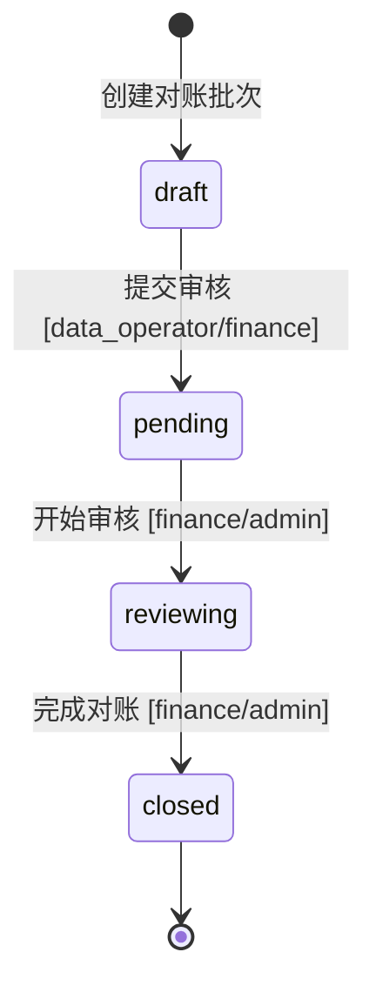
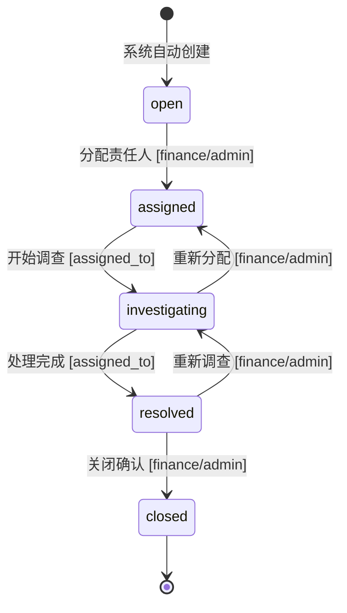
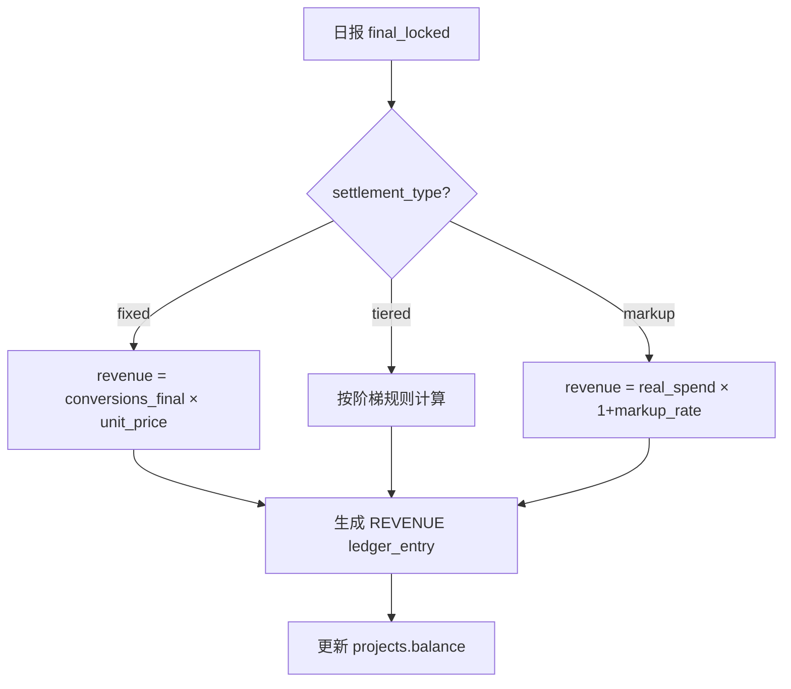
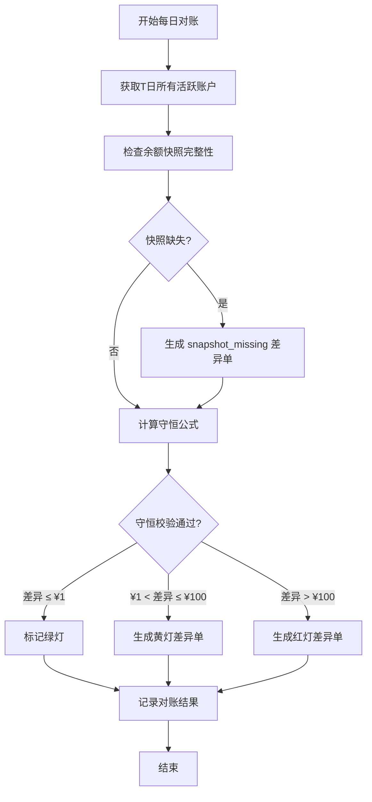
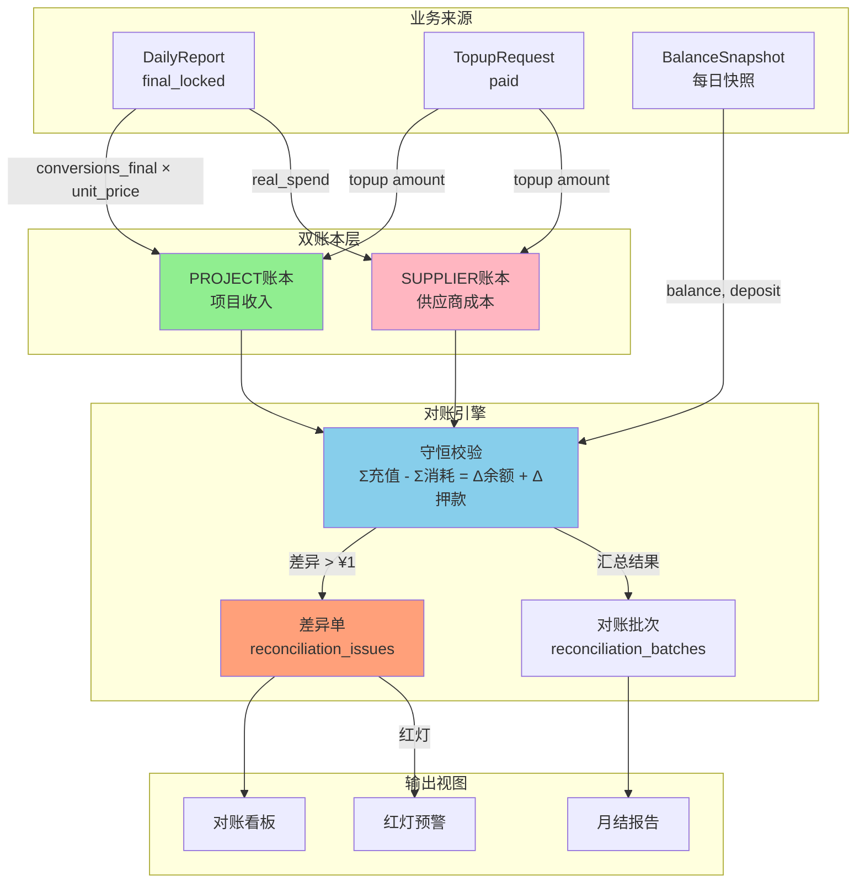
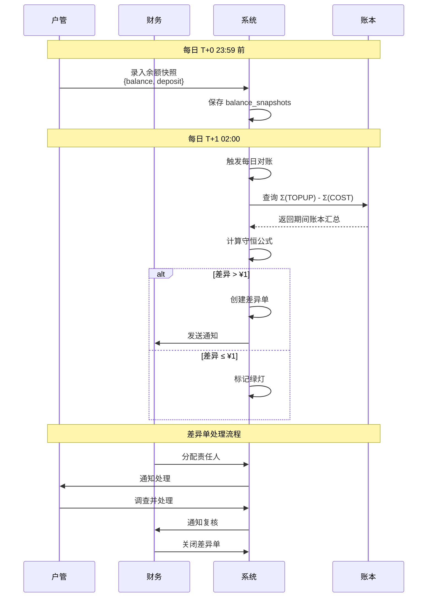
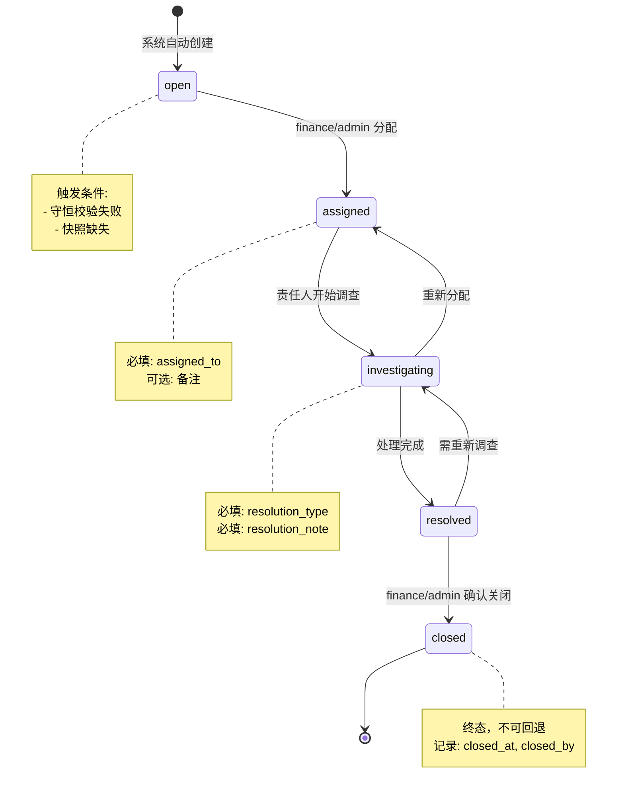

# 对账管控中心规范（RECONCILIATION_CONTROL_CENTER_SOT - Single Source of Truth）

> **文档版本**: v2.0
> **status**: active
> **owner**: Architecture Team
> **last_reviewed**: 2025-12-26
> **发布日期**: 2025-12-26
> **文档类型**: 对账管控领域唯一真相源（SoT-Reconciliation-Control）
> **适用范围**: 后端开发、财务团队、运营团队、对账、审计、结算
> **规范级别**: 🔴 强制执行（PR必查）
> **文档定位**: 财务/运营/开发都可单独依赖本文件完成对账管控相关业务
> **PRD来源**: 公司运营与对账中控系统（MVP）v1.0

> ⚠️ **Phase 适用性声明**（对齐 MASTER.md v4.4）
>
> **Phase 1（照亮）规则**：
> - 记录事实、展示状态、提示异常，**不强制阻断**
> - 对账红灯可生成，但不阻止业务流程
> - 差异单可创建，但关闭非强制
> - 结算规则可配置，但不强制校验
>
> **Phase 2（问责）启用条件**：Phase 1 稳定运行 2 个月后启用
> - 对账红灯阻断月结流程
> - 差异单 SLA 强制执行
> - 结算规则强制校验

---

## 📑 快速导航

| 章节 | 内容 | 适用人员 |
|-----|------|---------|
| [1. 文档定位](#1-文档定位与核心目标) | 系统目标、职责边界、仲裁规则 | 架构师、Tech Lead |
| [2. 核心概念](#2-核心概念定义) | 三本账、守恒公式、口径宪法 | 全员 |
| [3. 数据模型](#3-数据模型sot) | 新增表结构、字段扩展 | 后端开发、DBA |
| [4. 状态机](#4-状态机sot) | 对账批次状态机 + 差异单状态机 | 后端开发、财务 |
| [5. 业务规则](#5-业务规则sot) | BR-REC-*、BR-SET-* 规则 | 全员 |
| [6. 结算规则](#6-结算规则sot) | Fixed/Tiered/Markup 计算 | 财务、开发 |
| [7. 对账流程](#7-对账流程sot) | 每日对账、月结对账 | 财务、开发 |
| [8. 角色权限](#8-角色权限7角色体系) | **7角色权限矩阵** | 全员 |
| [9. 错误码](#9-错误码sot) | E-RECON-*、E-SET-* 错误码 | 全栈开发 |
| [10. API规范](#10-api规范) | 对账中心API端点 | 后端开发 |
| [11. 测试矩阵](#11-测试矩阵) | QA测试用例 | 测试工程师 |
| [12. 流程图](#12-mermaid流程图) | 架构图、数据流图 | 架构师、开发 |
| [13. 参考文档](#13-参考文档) | 依赖文档列表 | 全员 |
| [14. 版本历史](#14-版本历史) | 版本变更记录 | 全员 |
| [⭐ 15. 角色输入/输出矩阵](#15-角色输入输出矩阵全系统视角) | **谁输入什么、看到什么** | **全员必读** |

---

## 1. 文档定位与核心目标

### 1.1 系统核心目标

**对账管控中心是AI_AD_SYSTEM财务运营的核心模块**，解决以下问题：

| 问题 | 当前痛点 | 系统解决方案 |
|------|---------|-------------|
| 对账能力缺失 | 人工拼合多来源数据，耗时高、错误率高 | 三本账自动守恒校验 |
| 差异追溯困难 | 翻截图扯皮，定位耗时数小时 | 差异单定位到「账户×日期×差异项」|
| 结算规则单一 | 仅支持固定单价 | 支持 Fixed/Tiered/Markup |
| 月结效率低 | 拼表重算 3-5 天 | 一键生成，≤1 工作日 |

### 1.2 核心管理目标（三权清晰 - 对齐 MASTER.md v4.4 §2.4）

```
┌─────────────────────────────────────────────────────────┐
│  谁对钱负责：project_owner 申请 → finance 审核 → ceo 批准  │
│  谁对结果负责：project_owner 对盈亏负责                    │
│  谁能纠偏：日级 supervisor、周级 project_owner、月级 ceo    │
└─────────────────────────────────────────────────────────┘
```

### 1.3 在 SoT 体系中的位置

```
AI_AD_SYSTEM 文档体系 (SoT 裁判链 v4.4)
├─ MASTER.md v4.4                        → 架构宪法，最高优先级
├─ BUSINESS_FLOW_MANAGEMENT.md           → 业务流程与责任模型
├─ MVP_PHASE_DESIGN.md                   → Phase 边界与页面定义
├─ STATE_MACHINE.md v2.6                 → 业务状态流转的唯一来源
├─ DATA_SCHEMA.md v5.2                   → 数据库结构的唯一来源
├─ LEDGER_SOT.md v1.1                    → 双账本规则的唯一来源
├─ BUSINESS_RULES.md v3.2                → 业务规则的唯一来源
├─ API_SOT.md v9.0                       → API规范的唯一来源
├─ ERROR_CODES_SOT.md v2.1               → 错误码的唯一来源
├─ AUTH_SPEC.md v2.0                     → 权限控制的唯一来源
│
└─ RECONCILIATION_CONTROL_CENTER_SOT.md v2.0 (本文档) → 对账管控的唯一来源
    ├─ 引用 LEDGER_SOT (三本账 → 双账本映射)
    ├─ 引用 STATE_MACHINE (对账批次/差异单状态机)
    ├─ 引用 DATA_SCHEMA (表结构)
    ├─ 引用 BUSINESS_RULES (BR-REC-*, BR-SET-*)
    ├─ 引用 ERROR_CODES_SOT (E-RECON-*, E-SET-*)
    ├─ 引用 AUTH_SPEC (7角色权限)
    └─ 定义 守恒公式、结算规则、对账流程
```

### 1.4 仲裁规则（冲突优先级）

| 领域 | 唯一真相源 | 仲裁规则 |
|-----|-----------|---------|
| **数据库字段** | DATA_SCHEMA.md v5.2 | 字段名/类型/约束以DATA_SCHEMA为准 |
| **业务状态** | STATE_MACHINE.md v2.6 | 状态以STATE_MACHINE为准 |
| **账本规则** | LEDGER_SOT.md v1.1 | 账本记录规则以LEDGER_SOT为准 |
| **守恒公式** | 本文档 §2.3 | 对账守恒公式以本文档为准 |
| **结算规则** | 本文档 §6 | 收入计算规则以本文档为准 |
| **错误码** | ERROR_CODES_SOT.md v2.1 | 错误码格式以ERROR_CODES为准 |
| **角色权限** | AUTH_SPEC.md v2.0 | 7角色定义以AUTH_SPEC为准 |

**冲突处理规则**:
- ✅ 如果 DATA_SCHEMA 与本文档字段定义冲突 → **以 DATA_SCHEMA 为准，修改本文档**
- ✅ 如果 LEDGER_SOT 与本文档账本规则冲突 → **以 LEDGER_SOT 为准，修改本文档**
- ✅ 如果 STATE_MACHINE 与本文档状态机冲突 → **以 STATE_MACHINE 为准，修改本文档**
- ✅ 如果 API_SOT 与本文档 API 流程冲突 → **修改 API_SOT，以本文档为准**

---

## 2. 核心概念定义

### 2.1 口径宪法（数字唯一来源）

**核心原则**：同一个数字，只能有一个来源，不允许多头计算。

| 数据项 | 唯一来源 | 禁止来源 | 说明 |
|--------|---------|---------|------|
| **实际消耗** | `ledger_entries WHERE entry_type='COST'` | daily_reports.raw_spend | 财务确认的消耗 |
| **充值到账** | `ledger_entries WHERE entry_type='TOPUP'` | 投手申请金额 | 实际到账金额 |
| **账户余额** | `ad_accounts.balance` | Ledger聚合计算 | 实时余额（余额唯一真相源原则）|
| **账户押款** | `ad_accounts.deposit` | 无 | 代理商扣押保证金 |
| **余额快照** | `balance_snapshots` | 无 | 按日期的历史余额 |
| **确认进粉** | `daily_reports.conversions_final` | conversions_raw | 甲方确认的计费基准 |
| **项目收入** | `ledger_entries WHERE ledger_type='PROJECT' AND entry_type='REVENUE'` | 临时计算 | final_locked后生成 |

> **引用**: LEDGER_SOT.md v1.1 §2.4 "余额唯一真相源原则"

### 2.2 三本账与双账本映射

PRD 定义的「三本账」与 LEDGER_SOT.md v1.1 双账本的映射关系：

| PRD 三本账 | SoT 双账本 | ledger_type | entry_type | 数据来源 |
|-----------|-----------|-------------|------------|---------|
| **消耗账** | SUPPLIER账本 | `SUPPLIER` | `COST` | `real_spend + fee` |
| **充值到账账（项目）** | PROJECT账本 | `PROJECT` | `TOPUP` | 项目充值入账 |
| **充值到账账（供应商）** | SUPPLIER账本 | `SUPPLIER` | `TOPUP` | 供应商充值入账 |
| **余额/押款快照** | `balance_snapshots` 表 | - | - | 每日快照 |

**三本账数据流**：
```
┌─────────────────────────────────────────────────────────────┐
│  消耗账 (Spend Ledger)                                       │
│  来源: 财务确认的 real_spend                                  │
│  存储: ledger_entries WHERE ledger_type='SUPPLIER'           │
│        AND entry_type='COST'                                 │
│  金额方向: 负数（成本增加）                                   │
└─────────────────────────────────────────────────────────────┘
                              ↓
┌─────────────────────────────────────────────────────────────┐
│  充值到账账 (Topup Ledger)                                   │
│  来源: 财务确认的充值到账                                     │
│  存储: ledger_entries WHERE entry_type='TOPUP'               │
│  金额方向: 正数（余额增加）                                   │
└─────────────────────────────────────────────────────────────┘
                              ↓
┌─────────────────────────────────────────────────────────────┐
│  余额/押款快照 (Balance Snapshots)                           │
│  来源: 户管每日录入/批量导入                                  │
│  存储: balance_snapshots 表                                  │
│  字段: balance, deposit, remaining_balance                   │
└─────────────────────────────────────────────────────────────┘
```

> **引用**: LEDGER_SOT.md v1.1 §2.2 "两套独立账本定义"

### 2.3 守恒公式（对账核心）

**公式定义**：

```
对于任意账户 A 在任意时间段 [T1, T2]：

Σ(充值到账) - Σ(实际消耗) = Δ(余额) + Δ(押款)
```

**公式分解**：

| 变量 | 计算方式 | SQL 表达 |
|------|---------|---------|
| Σ(充值到账) | 期间内所有TOPUP金额之和 | `SUM(amount) FROM ledger_entries WHERE entry_type='TOPUP' AND ledger_type='SUPPLIER' AND occurred_at BETWEEN T1 AND T2` |
| Σ(实际消耗) | 期间内所有COST金额绝对值之和 | `SUM(ABS(amount)) FROM ledger_entries WHERE entry_type='COST' AND ledger_type='SUPPLIER' AND occurred_at BETWEEN T1 AND T2` |
| Δ(余额) | T2余额 - T1余额 | `snapshots(T2).balance - snapshots(T1).balance` |
| Δ(押款) | T2押款 - T1押款 | `snapshots(T2).deposit - snapshots(T1).deposit` |

**校验阈值**：

| 差异范围 | 警报等级 | 系统行为 | SLA |
|---------|---------|---------|-----|
| ≤ ¥1.00 | ✅ 通过 | 自动通过（浮点精度容差） | - |
| > ¥1.00 且 ≤ ¥100.00 | 🟡 黄灯 | 生成警告差异单 | T+5 工作日 |
| > ¥100.00 | 🔴 红灯 | 生成紧急差异单 | T+2 工作日 |

### 2.4 成本口径表

**成本构成**（入项目成本）：

| 成本项 | 计算来源 | 是否入成本 | 分摊规则 |
|--------|---------|-----------|---------|
| 广告消耗 | `real_spend` | ✅ 入成本 | 按账户归属项目 |
| 手续费 | 到账回执/财务记录 | ✅ 入成本 | 按账户归属项目 |
| 开户费 | 代理商账单 | ✅ 入成本 | 按账户归属/单列 |
| 押款 | 状态项 | ❌ 不入成本 | 用于对账校验 |
| 换汇差额 | MVP 单列 | ❌ 暂不分摊 | Phase 2 再细化 |

### 2.5 系统开始日策略

**历史数据处理规则**：

| 数据类型 | 系统开始日前 | 系统开始日后 |
|---------|-------------|-------------|
| 对账校验 | 仅供查询参考，不生成差异单 | 强制走系统闭环 |
| 余额快照 | 可选录入 | 必须每日录入 |
| 结算计算 | 按历史汇总 | 按系统规则计算 |
| 差异单 | 不追溯创建 | 自动生成 |

**建议系统开始日**：上线日期或次月 1 日

---

## 3. 数据模型 SoT

> **引用**: DATA_SCHEMA.md v5.2 - 本节定义的表结构需同步更新到 DATA_SCHEMA.md

### 3.1 balance_snapshots 表（新增）

**用途**：记录广告账户的每日余额/押款快照，用于对账守恒校验。

| 字段 | 类型 | 约束 | 说明 |
|------|------|------|------|
| id | UUID | PK, DEFAULT gen_random_uuid() | 主键 |
| ad_account_id | UUID | FK → ad_accounts.id, NOT NULL | 关联账户 |
| snapshot_date | DATE | NOT NULL | 快照日期 |
| balance | DECIMAL(15,2) | NOT NULL | 当日余额 |
| deposit | DECIMAL(15,2) | NOT NULL, DEFAULT 0 | 当日押款 |
| remaining_balance | DECIMAL(15,2) | GENERATED ALWAYS AS (balance - deposit) STORED | 当日剩余可用（计算列）|
| source | VARCHAR(20) | NOT NULL, DEFAULT 'manual' | 数据来源 |
| created_by | UUID | FK → users.id, NOT NULL | 创建人 |
| created_at | TIMESTAMPTZ | DEFAULT NOW() | 创建时间 |
| notes | TEXT | | 备注 |

**约束**：
```sql
UNIQUE (ad_account_id, snapshot_date)
CHECK (source IN ('manual', 'api', 'import'))
CHECK (balance >= 0)
CHECK (deposit >= 0)
```

**索引**：
```sql
CREATE INDEX idx_balance_snapshots_date ON balance_snapshots(snapshot_date);
CREATE INDEX idx_balance_snapshots_account ON balance_snapshots(ad_account_id);
CREATE INDEX idx_balance_snapshots_account_date ON balance_snapshots(ad_account_id, snapshot_date);
```

### 3.2 reconciliation_issues 表（新增）

**用途**：记录对账差异单，支持完整的工单闭环流程。

| 字段 | 类型 | 约束 | 说明 |
|------|------|------|------|
| id | UUID | PK | 主键 |
| issue_no | VARCHAR(50) | UNIQUE, NOT NULL | 差异单号，格式如 `ISSUE-20251226-001` |
| reconciliation_batch_id | UUID | FK → reconciliation_batches.id | 关联对账批次 |
| ad_account_id | UUID | FK → ad_accounts.id | 关联账户 |
| issue_date | DATE | NOT NULL | 差异日期 |
| issue_type | VARCHAR(30) | NOT NULL, CHECK | 差异类型 |
| alert_level | VARCHAR(10) | NOT NULL, DEFAULT 'yellow' | 警报等级 |
| expected_amount | DECIMAL(15,2) | | 预期金额 |
| actual_amount | DECIMAL(15,2) | | 实际金额 |
| difference_amount | DECIMAL(15,2) | GENERATED ALWAYS AS (actual_amount - expected_amount) STORED | 差异金额（计算列）|
| status | VARCHAR(20) | NOT NULL, DEFAULT 'open' | 状态 |
| assigned_to | UUID | FK → users.id | 责任人 |
| assigned_at | TIMESTAMPTZ | | 分配时间 |
| resolution_type | VARCHAR(30) | CHECK | 处理类型 |
| resolution_note | TEXT | | 处理说明 |
| resolved_at | TIMESTAMPTZ | | 处理时间 |
| resolved_by | UUID | FK → users.id | 处理人 |
| attachments | JSONB | DEFAULT '[]' | 附件 |
| sla_deadline | TIMESTAMPTZ | | SLA 截止时间 |
| sla_breached | BOOLEAN | DEFAULT FALSE | SLA 超时标记 |
| created_at | TIMESTAMPTZ | DEFAULT NOW() | 创建时间 |
| created_by | UUID | FK → users.id, NOT NULL | 创建人 |
| updated_at | TIMESTAMPTZ | DEFAULT NOW() | 更新时间 |
| version | INTEGER | DEFAULT 1 | 乐观锁版本号 |

**issue_type 枚举值**：
```sql
CHECK (issue_type IN (
  'topup_mismatch',      -- 充值差异
  'spend_mismatch',      -- 消耗差异
  'deposit_change',      -- 押款变化
  'balance_anomaly',     -- 余额异常
  'snapshot_missing',    -- 快照缺失
  'conservation_failed', -- 守恒校验失败
  'other'
))
```

**alert_level 枚举值**：
```sql
CHECK (alert_level IN ('green', 'yellow', 'red'))
```

**resolution_type 枚举值**：
```sql
CHECK (resolution_type IN (
  'data_correction',     -- 数据修正
  'ledger_adjustment',   -- 账本调整
  'external_confirm',    -- 外部确认（代理商/甲方）
  'write_off',           -- 核销
  'false_positive'       -- 误报
))
```

### 3.3 settlement_rules 表（新增）

**用途**：存储阶梯计价(tiered)和加成计价(markup)的结算规则配置。

| 字段 | 类型 | 约束 | 说明 |
|------|------|------|------|
| id | UUID | PK | 主键 |
| name | VARCHAR(100) | NOT NULL | 规则名称 |
| rule_type | VARCHAR(20) | NOT NULL, CHECK | 规则类型 |
| config | JSONB | NOT NULL | 规则配置 |
| effective_from | DATE | NOT NULL | 生效开始日 |
| effective_to | DATE | | 生效结束日 |
| created_by | UUID | FK → users.id, NOT NULL | 创建人 |
| created_at | TIMESTAMPTZ | DEFAULT NOW() | 创建时间 |
| updated_at | TIMESTAMPTZ | DEFAULT NOW() | 更新时间 |

**rule_type 枚举值**：
```sql
CHECK (rule_type IN ('tiered', 'markup'))
CHECK (effective_to IS NULL OR effective_to > effective_from)
```

**config 结构示例**：

```json
// tiered 规则
{
  "mode": "incremental",  // incremental | cumulative
  "tiers": [
    {"min": 0, "max": 1000, "price": 50.00},
    {"min": 1001, "max": 5000, "price": 45.00},
    {"min": 5001, "max": null, "price": 40.00}
  ]
}

// markup 规则
{
  "markup_rate": 0.15,  // 15% 加成
  "base_field": "real_spend"
}
```

### 3.4 projects 表扩展

**新增字段**（需同步更新 DATA_SCHEMA.md v5.2）：

| 字段 | 类型 | 约束 | 说明 |
|------|------|------|------|
| settlement_type | VARCHAR(20) | DEFAULT 'fixed', CHECK | 结算类型 |
| settlement_rules_id | UUID | FK → settlement_rules.id | 结算规则 |

```sql
CHECK (settlement_type IN ('fixed', 'tiered', 'markup'))
```

### 3.5 ad_accounts 表扩展

**新增字段**（需同步更新 DATA_SCHEMA.md v5.2）：

| 字段 | 类型 | 约束 | 说明 |
|------|------|------|------|
| deposit | DECIMAL(15,2) | DEFAULT 0.00, CHECK (deposit >= 0) | 押款金额 |
| deposit_updated_at | TIMESTAMPTZ | | 押款更新时间 |

---

## 4. 状态机 SoT

> **引用**: STATE_MACHINE.md v2.6 - 本节定义的状态机需同步更新到 STATE_MACHINE.md

### 4.1 对账批次状态机（ReconciliationBatch）

**引用**: 基于 RECONCILIATION_SOT.md v1.0 §5.1，与现有对账模块对齐。

**状态枚举**：`draft`, `pending`, `reviewing`, `closed`
**终态**：`closed`
**初始态**：`draft`

**状态流转图**：



**状态流转白名单**：

```python
RECONCILIATION_BATCH_TRANSITIONS = {
    "draft": ["pending"],
    "pending": ["reviewing"],
    "reviewing": ["closed"],
    "closed": []  # 终态，不可流转
}
```

**角色权限矩阵**：

| 状态转换 | 允许角色 | 前置条件 | 审计要求 |
|---------|---------|---------|---------|
| draft → pending | finance, admin, account_manager | 差异金额已计算 | [AUDIT] 记录提交时间 |
| pending → reviewing | finance, admin | - | [AUDIT] 记录审核人 |
| reviewing → closed | finance, admin | 所有差异单已关闭或核销 | [AUDIT] 记录关闭时间 |

### 4.2 差异单状态机（ReconciliationIssue）

**状态枚举**：`open`, `assigned`, `investigating`, `resolved`, `closed`
**终态**：`closed`
**初始态**：`open`

**状态流转图**：



**状态流转白名单**：

```python
RECONCILIATION_ISSUE_TRANSITIONS = {
    "open": ["assigned"],
    "assigned": ["investigating"],
    "investigating": ["resolved", "assigned"],
    "resolved": ["closed", "investigating"],
    "closed": []  # 终态，不可流转
}
```

**角色权限矩阵**：

| 状态转换 | 允许角色 | 前置条件 | 审计要求 |
|---------|---------|---------|---------|
| open → assigned | finance, admin | 指定 assigned_to | [AUDIT] 记录分配人、分配时间 |
| assigned → investigating | assigned_to 本人 | 本人操作 | [AUDIT] 记录开始时间 |
| investigating → resolved | assigned_to 本人 | 填写 resolution_type, resolution_note | [AUDIT] 记录处理结论 |
| investigating → assigned | finance, admin | 填写重分配原因 | [AUDIT] 记录重分配原因 |
| resolved → closed | finance, admin | - | [AUDIT] 记录关闭确认 |
| resolved → investigating | finance, admin | 填写重开原因 | [AUDIT] 记录重开原因 |

---

## 5. 业务规则 SoT

> **引用**: BUSINESS_RULES.md v3.2 - 本节定义的规则需同步更新到 BUSINESS_RULES.md

### 5.1 对账规则（BR-REC-*）

#### BR-REC-001: 对账守恒公式

**规则ID**: BR-REC-001
**规则名称**: 对账守恒公式校验
**规则级别**: 🔴 强制

**规则定义**：
```
Σ(充值到账) - Σ(实际消耗) = Δ(余额) + Δ(押款)
```

**校验时机**：
- 每日 02:00 批量校验前一日
- 手动触发对账批次时
- 月结前校验整月数据

**违规处理**：
- Phase 1: 生成差异单，不阻断业务
- Phase 2: 差异未关闭阻断月结

---

#### BR-REC-002: 差异单 SLA 规则

**规则ID**: BR-REC-002
**规则名称**: 差异单处理时效
**规则级别**: 🟡 Phase 2 强制

**规则定义**：
| 差异等级 | SLA 期限 | 超时处理 |
|---------|---------|---------|
| 红灯 (>¥100) | T+2 工作日 | 自动上报 ceo |
| 黄灯 (¥1-¥100) | T+5 工作日 | 自动上报 finance 负责人 |

**SLA 计算**：
```python
def calculate_sla_deadline(created_at: datetime, alert_level: str) -> datetime:
    days = 2 if alert_level == 'red' else 5
    return add_business_days(created_at, days)  # 排除周末和法定节假日
```

---

#### BR-REC-003: 快照缺失处理

**规则ID**: BR-REC-003
**规则名称**: 余额快照缺失自动补录
**规则级别**: 🟡 警告

**规则定义**：
- 对账期间内任意账户缺少余额快照 → 生成 `snapshot_missing` 类型差异单
- 差异单自动分配给 account_manager（户管）
- 补录快照后，差异单自动流转至 `investigating`

---

#### BR-REC-004: 押款变化记录

**规则ID**: BR-REC-004
**规则名称**: 押款变化审计追踪
**规则级别**: 🔴 强制

**规则定义**：
- 押款变化必须记录变化原因
- 押款变化 ≥ ¥1000.00 需要财务审批（Phase 2）
- 押款变化生成差异单类型 `deposit_change`

---

#### BR-REC-005: 对账批次唯一性

**规则ID**: BR-REC-005
**规则名称**: 对账批次唯一性约束
**规则级别**: 🔴 强制

**规则定义**：
- `(supplier_id, channel_id, period_start, period_end)` 必须唯一
- 禁止创建重叠周期的对账批次
- 违反时抛出 `E-RECON-001`

---

### 5.2 结算规则（BR-SET-*）

#### BR-SET-001: Fixed 结算规则

**规则ID**: BR-SET-001
**规则名称**: 固定单价结算
**规则级别**: 🔴 强制

**规则定义**：
```
revenue = conversions_final × unit_price
```

**适用条件**：
- `projects.settlement_type = 'fixed'`
- 使用 `projects.unit_price` 字段

---

#### BR-SET-002: Tiered 结算规则

**规则ID**: BR-SET-002
**规则名称**: 阶梯计价结算
**规则级别**: 🔴 强制

**规则定义**：
根据 `settlement_rules.config.tiers` 配置，按阶梯计算收入。

**计算模式**：

| 模式 | 说明 | 示例（粉数=3000）|
|------|------|-----------------|
| cumulative | 所有粉数按达到的最高阶梯价格 | 3000 × 45 = 135,000 |
| incremental | 各阶梯内粉数按该阶梯价格分别计算 | 1000×50 + 2000×45 = 140,000 |

**计算公式（incremental 模式）**：
```python
def calculate_tiered_revenue(conversions: int, tiers: List[dict]) -> Decimal:
    revenue = Decimal('0.00')
    remaining = conversions
    for tier in sorted(tiers, key=lambda t: t['min']):
        tier_min = tier['min']
        tier_max = tier['max'] or float('inf')
        tier_price = Decimal(str(tier['price']))
        tier_volume = min(remaining, tier_max - tier_min + 1)
        if tier_volume > 0:
            revenue += tier_volume * tier_price
            remaining -= tier_volume
        if remaining <= 0:
            break
    return revenue
```

---

#### BR-SET-003: Markup 结算规则

**规则ID**: BR-SET-003
**规则名称**: 加成计价结算
**规则级别**: 🔴 强制

**规则定义**：
```
revenue = real_spend × (1 + markup_rate)
```

**适用条件**：
- `projects.settlement_type = 'markup'`
- 使用 `settlement_rules.config.markup_rate` 字段

---

## 6. 结算规则 SoT

### 6.1 结算类型对比

| 结算类型 | 计费基准 | 价格来源 | 适用场景 |
|---------|---------|---------|---------|
| **fixed** | conversions_final | projects.unit_price | 标准 CPA/CPL 项目 |
| **tiered** | conversions_final | settlement_rules.config.tiers | 大客户阶梯优惠 |
| **markup** | real_spend | settlement_rules.config.markup_rate | 代运营/服务费项目 |

### 6.2 结算计算流程



### 6.3 结算规则配置示例

**Fixed 规则**（默认）：
```json
{
  "settlement_type": "fixed",
  "unit_price": 50.00
}
```

**Tiered 规则**：
```json
{
  "settlement_type": "tiered",
  "settlement_rules_id": "uuid-xxx",
  "rule_config": {
    "mode": "incremental",
    "tiers": [
      {"min": 0, "max": 1000, "price": 50.00},
      {"min": 1001, "max": 5000, "price": 45.00},
      {"min": 5001, "max": null, "price": 40.00}
    ]
  }
}
```

**Markup 规则**：
```json
{
  "settlement_type": "markup",
  "settlement_rules_id": "uuid-xxx",
  "rule_config": {
    "markup_rate": 0.15,
    "base_field": "real_spend"
  }
}
```

---

## 7. 对账流程 SoT

### 7.1 每日对账流程

**触发时机**：每日 02:00 自动执行（T+1 对 T 日数据）

**流程步骤**：



### 7.2 月结对账流程

**触发时机**：每月 1-3 日手动触发

**流程步骤**：

1. **创建对账批次**（finance/admin）
   - 选择供应商、渠道、对账周期
   - 系统自动计算 our_total_spend

2. **差异分析**（finance）
   - 系统展示逐账户差异明细
   - 标记需处理的差异项

3. **差异处理**（finance）
   - 分配责任人调查
   - 创建调整记录

4. **生成月结报告**（finance）
   - 汇总月度消耗/收入/利润
   - 导出 Excel/PDF 报告

5. **关闭对账批次**（finance/admin）
   - 确认所有差异已处理
   - 锁定批次数据

### 7.3 对账看板指标

| 指标 | 计算方式 | 刷新频率 |
|------|---------|---------|
| 待处理差异单 | `COUNT(*) WHERE status NOT IN ('closed')` | 实时 |
| 红灯数量 | `COUNT(*) WHERE alert_level='red' AND status NOT IN ('closed')` | 实时 |
| SLA 超时率 | `COUNT(sla_breached=true) / COUNT(*)` | 每日 |
| 本月对账进度 | `已关闭批次数 / 总批次数` | 实时 |
| 守恒通过率 | `绿灯账户数 / 总账户数` | 每日 |

---

## 8. 角色权限（7角色体系）

> **引用**: AUTH_SPEC.md v2.0 + MASTER.md v4.4 §2.4

### 8.1 七角色定义

| 角色ID | 中文名 | 职责范围 | 对账模块权限 |
|--------|-------|---------|-------------|
| **ceo** | 老板 | 资金安全、公司盈亏、最终决策 | 查看全局、审批大额充值 |
| **project_owner** | 项目负责人 | 项目盈亏、资金使用效率 | 查看自己项目的对账数据 |
| **finance** | 财务 | 资金出入准确、数据真实、对账 | **对账模块完整权限** |
| **supervisor** | 主管 | 团队产出、投手管理、日常监督 | 查看团队相关对账数据 |
| **pitcher** | 投手 | CPL 达标、日报准确、执行投放 | ❌ 无对账权限 |
| **account_manager** | 户管 | 账户分配、账户状态监控、余额快照 | **余额快照录入权限** |
| **admin** | 管理员 | 系统配置（不参与业务） | **对账模块完整权限** |

### 8.2 对账模块权限矩阵

| 操作 | ceo | project_owner | finance | supervisor | pitcher | account_manager | admin |
|-----|-----|--------------|---------|------------|---------|-----------------|-------|
| **查看对账批次** | ✅ 全局 | ✅ 自己项目 | ✅ 全局 | ✅ 团队 | ❌ | ✅ 全局 | ✅ 全局 |
| **创建对账批次** | ❌ | ❌ | ✅ | ❌ | ❌ | ✅ | ✅ |
| **提交审核** | ❌ | ❌ | ✅ | ❌ | ❌ | ✅ | ✅ |
| **审批对账** | ❌ | ❌ | ✅ | ❌ | ❌ | ❌ | ✅ |
| **关闭对账批次** | ❌ | ❌ | ✅ | ❌ | ❌ | ❌ | ✅ |
| **查看差异单** | ✅ 全局 | ✅ 自己项目 | ✅ 全局 | ✅ 团队 | ❌ | ✅ 全局 | ✅ 全局 |
| **分配差异单** | ❌ | ❌ | ✅ | ❌ | ❌ | ❌ | ✅ |
| **处理差异单** | ❌ | ❌ | ✅ | ❌ | ❌ | ✅ (快照类) | ✅ |
| **关闭差异单** | ❌ | ❌ | ✅ | ❌ | ❌ | ❌ | ✅ |
| **录入余额快照** | ❌ | ❌ | ✅ | ❌ | ❌ | ✅ | ✅ |
| **查看结算规则** | ✅ | ✅ 自己项目 | ✅ | ✅ | ❌ | ❌ | ✅ |
| **配置结算规则** | ❌ | ✅ 自己项目 | ✅ | ❌ | ❌ | ❌ | ✅ |
| **查看利润表** | ✅ 全局 | ✅ 自己项目 | ✅ 全局 | ❌ | ❌ | ❌ | ✅ |

---

## 9. 错误码 SoT

> **引用**: ERROR_CODES_SOT.md v2.1 - 本节定义的错误码需同步更新到 ERROR_CODES_SOT.md

### 9.1 对账模块错误码（E-RECON-*）

| 错误码 | 消息 | HTTP | 触发场景 |
|--------|------|------|----------|
| `E-RECON-001` | 对账批次已存在 | 409 | 违反 `(supplier_id, channel_id, period)` 唯一约束 |
| `E-RECON-002` | 对账周期无效 | 400 | `period_end < period_start` 或超过365天 |
| `E-RECON-003` | 非法状态流转 | 400 | 不在白名单的状态流转 |
| `E-RECON-004` | 审批人与创建人相同 | 403 | 违反职责分离原则（SOD） |
| `E-RECON-005` | 终态批次禁止修改 | 403 | 尝试修改 `closed` 状态的批次 |
| `E-RECON-006` | 差异单未全部关闭 | 400 | 批次下存在未关闭的差异单 |
| `E-RECON-007` | 余额快照缺失 | 400 | 对账期间内账户缺少快照 |
| `E-RECON-008` | 守恒校验失败 | 400 | 守恒公式校验不通过 |

### 9.2 结算模块错误码（E-SET-*）

| 错误码 | 消息 | HTTP | 触发场景 |
|--------|------|------|----------|
| `E-SET-001` | 结算规则配置无效 | 400 | tiered/markup 规则配置格式错误 |
| `E-SET-002` | 结算类型不支持 | 400 | settlement_type 不在枚举范围内 |
| `E-SET-003` | 阶梯配置重叠 | 400 | tiered 规则的区间有重叠 |
| `E-SET-004` | 加成比例无效 | 400 | markup_rate < 0 或 > 1 |
| `E-SET-005` | 结算规则未生效 | 400 | 当前日期不在规则有效期内 |

### 9.3 通用错误码引用

| 错误码 | 说明 | 使用场景 |
|--------|------|----------|
| `BIZ_002` | 资源不存在 | 查询不存在的批次/差异单 |
| `BIZ_003` | 资源已存在 | 重复创建对账批次 |
| `BIZ_100` | 金额无效 | `supplier_total_spend <= 0` |
| `AUTH_500` | 权限不足 | 非授权角色操作 |
| `STATE_400` | 非法状态流转 | 违反状态机规则 |
| `STATE_409` | 并发冲突 | 乐观锁版本号不匹配 |

---

## 10. API 规范

> **引用**: API_SOT.md v9.0 §12 - 对账管理 API

### 10.1 对账批次 API

| 端点 | 方法 | 说明 | 权限 |
|------|------|------|------|
| `GET /api/v1/reconciliation/batches` | GET | 获取对账批次列表 | finance, admin, account_manager |
| `POST /api/v1/reconciliation/batches` | POST | 创建对账批次 | finance, admin, account_manager |
| `GET /api/v1/reconciliation/batches/{id}` | GET | 获取批次详情 | finance, admin, account_manager |
| `POST /api/v1/reconciliation/batches/{id}/submit` | POST | 提交审核 | finance, admin, account_manager |
| `POST /api/v1/reconciliation/batches/{id}/review` | POST | 开始审核 | finance, admin |
| `POST /api/v1/reconciliation/batches/{id}/close` | POST | 关闭批次 | finance, admin |

### 10.2 差异单 API

| 端点 | 方法 | 说明 | 权限 |
|------|------|------|------|
| `GET /api/v1/reconciliation/issues` | GET | 获取差异单列表 | finance, admin, account_manager |
| `GET /api/v1/reconciliation/issues/{id}` | GET | 获取差异单详情 | finance, admin, account_manager |
| `POST /api/v1/reconciliation/issues/{id}/assign` | POST | 分配责任人 | finance, admin |
| `POST /api/v1/reconciliation/issues/{id}/start` | POST | 开始调查 | assigned_to |
| `POST /api/v1/reconciliation/issues/{id}/resolve` | POST | 处理完成 | assigned_to |
| `POST /api/v1/reconciliation/issues/{id}/close` | POST | 关闭差异单 | finance, admin |

### 10.3 余额快照 API

| 端点 | 方法 | 说明 | 权限 |
|------|------|------|------|
| `GET /api/v1/balance-snapshots` | GET | 获取快照列表 | finance, admin, account_manager |
| `POST /api/v1/balance-snapshots` | POST | 创建快照 | finance, admin, account_manager |
| `POST /api/v1/balance-snapshots/bulk` | POST | 批量导入快照 | finance, admin, account_manager |
| `GET /api/v1/balance-snapshots/{id}` | GET | 获取快照详情 | finance, admin, account_manager |

### 10.4 结算规则 API

| 端点 | 方法 | 说明 | 权限 |
|------|------|------|------|
| `GET /api/v1/settlement-rules` | GET | 获取规则列表 | finance, admin, project_owner |
| `POST /api/v1/settlement-rules` | POST | 创建规则 | finance, admin |
| `GET /api/v1/settlement-rules/{id}` | GET | 获取规则详情 | finance, admin, project_owner |
| `PUT /api/v1/settlement-rules/{id}` | PUT | 更新规则 | finance, admin |

### 10.5 请求/响应格式

**创建对账批次请求**：
```json
{
  "supplier_id": "uuid-xxx",
  "channel_id": "uuid-xxx",
  "period_start": "2025-12-01",
  "period_end": "2025-12-31"
}
```

**对账批次响应**：
```json
{
  "success": true,
  "data": {
    "id": "uuid-xxx",
    "batch_no": "RECON-202512-001",
    "status": "draft",
    "supplier_id": "uuid-xxx",
    "channel_id": "uuid-xxx",
    "period_start": "2025-12-01",
    "period_end": "2025-12-31",
    "our_total_spend": "125000.00",
    "supplier_total_spend": "124800.00",
    "difference": "200.00",
    "difference_rate": "0.16",
    "issues_count": 3,
    "created_by": "uuid-xxx",
    "created_at": "2025-12-26T10:00:00Z"
  }
}
```

---

## 11. 测试矩阵

### 11.1 守恒校验测试

| 测试用例编号 | 测试场景 | 前置条件 | 操作 | 期望结果 | 优先级 |
|------------|---------|---------|------|---------|--------|
| TC-REC-001 | 守恒校验通过 | 账户有完整快照<br>差异≤¥1 | 执行对账 | 返回绿灯<br>不生成差异单 | P0 |
| TC-REC-002 | 守恒校验黄灯 | 差异¥50 | 执行对账 | 生成黄灯差异单<br>SLA=T+5 | P0 |
| TC-REC-003 | 守恒校验红灯 | 差异¥500 | 执行对账 | 生成红灯差异单<br>SLA=T+2 | P0 |
| TC-REC-004 | 快照缺失 | 账户缺少T日快照 | 执行对账 | 生成snapshot_missing差异单 | P0 |

### 11.2 差异单流转测试

| 测试用例编号 | 测试场景 | 前置条件 | 操作 | 期望结果 | 优先级 |
|------------|---------|---------|------|---------|--------|
| TC-REC-005 | 分配责任人 | 差异单status=open | finance分配给account_manager | status=assigned | P0 |
| TC-REC-006 | 开始调查 | status=assigned | assigned_to点击开始 | status=investigating | P0 |
| TC-REC-007 | 处理完成 | status=investigating | 填写resolution后提交 | status=resolved | P0 |
| TC-REC-008 | 关闭差异单 | status=resolved | finance确认关闭 | status=closed | P0 |
| TC-REC-009 | 非法流转 | status=open | 直接尝试close | 返回E-RECON-003 | P1 |

### 11.3 结算规则测试

| 测试用例编号 | 测试场景 | 前置条件 | 操作 | 期望结果 | 优先级 |
|------------|---------|---------|------|---------|--------|
| TC-SET-001 | Fixed结算 | settlement_type=fixed<br>unit_price=50<br>conversions_final=100 | 计算收入 | revenue=5000 | P0 |
| TC-SET-002 | Tiered增量模式 | tiers=[0-1000:50, 1001-5000:45]<br>conversions_final=2000 | 计算收入 | 1000×50+1000×45=95000 | P0 |
| TC-SET-003 | Tiered累计模式 | mode=cumulative<br>conversions_final=2000 | 计算收入 | 2000×45=90000 | P0 |
| TC-SET-004 | Markup结算 | markup_rate=0.15<br>real_spend=10000 | 计算收入 | 10000×1.15=11500 | P0 |

### 11.4 权限测试

| 测试用例编号 | 测试场景 | 前置条件 | 操作 | 期望结果 | 优先级 |
|------------|---------|---------|------|---------|--------|
| TC-REC-010 | pitcher无权限 | 用户角色=pitcher | 访问对账列表 | 返回AUTH_500 | P0 |
| TC-REC-011 | account_manager录入快照 | 用户角色=account_manager | 创建余额快照 | 成功创建 | P0 |
| TC-REC-012 | account_manager无法关闭 | 用户角色=account_manager | 尝试关闭批次 | 返回AUTH_500 | P0 |

---

## 12. Mermaid 流程图

### 12.1 对账管控架构图



### 12.2 对账流程时序图



### 12.3 差异单状态机图



---

## 13. 参考文档

本文档基于以下 SoT 文档编写：

| SoT 文档 | 版本 | 引用章节 | 引用次数 |
|---------|------|---------|---------|
| **MASTER.md** | v4.4 | §2.4 7角色定义, §3 Phase边界 | 8+ |
| **DATA_SCHEMA.md** | v5.2 | 表结构定义 | 15+ |
| **STATE_MACHINE.md** | v2.6 | §5 对账批次状态机 | 10+ |
| **BUSINESS_RULES.md** | v3.2 | BR-REC-*, BR-SET-* | 12+ |
| **LEDGER_SOT.md** | v1.1 | §2 双账本模型, §4 金额方向 | 20+ |
| **ERROR_CODES_SOT.md** | v2.1 | E-RECON-*, E-SET-* | 15+ |
| **AUTH_SPEC.md** | v2.0 | §3 角色权限定义 | 6+ |
| **API_SOT.md** | v9.0 | §12 对账管理API | 8+ |
| **RECONCILIATION_SOT.md** | v1.0 | 对账批次模块（合并） | 10+ |

---

## 14. 版本历史

| 版本 | 日期 | 变更内容 | 作者 |
|------|------|----------|------|
| v2.0 | 2025-12-26 | **v2.0 重大更新**<br>- 🔄 对齐 MASTER.md v4.4 7角色定义（ceo/project_owner/finance/supervisor/pitcher/account_manager/admin）<br>- 🔄 对齐 STATE_MACHINE.md v2.6 对账批次状态机（draft/pending/reviewing/closed）<br>- 🔄 统一错误码格式为 E-RECON-* / E-SET-*<br>- 🔄 更新所有 SoT 版本引用至最新<br>- ✅ 合并 RECONCILIATION_SOT.md v1.0 内容<br>- ✅ 增加 remaining_balance 计算列<br>- ✅ 增加 issue_no 差异单编号<br>- ✅ 增加 version 乐观锁字段<br>- ✅ 完善 API 请求/响应格式<br>- ✅ 扩展测试矩阵（权限测试）| 系统架构团队 |
| v1.1 | 2025-12-26 | 添加第15章 角色输入/输出矩阵 | 系统架构团队 |
| v1.0 | 2025-12-26 | 初始版本，基于 PRD 生成完整 SoT | 系统架构团队 |

---

## 15. 角色输入/输出矩阵（全系统视角）

> ⭐ **本章是 PRD 与 SoT 的桥梁**，解答"谁输入什么、看到什么"的问题。

### 15.1 角色数据输入（Data Input by Role）

#### 15.1.1 投手（pitcher）每日输入

| 数据项 | 表/字段 | 频率 | 必填 | 说明 |
|--------|---------|------|------|------|
| **日报提交** | daily_reports | 每日 | | |
| ├─ 项目 | `project_id` | | ✅ | 哪个项目 |
| ├─ 账户 | `ad_account_id` | | ✅ | 哪个广告账户 |
| ├─ 日期 | `report_date` | | ✅ | 哪天的数据 |
| ├─ 消耗 | `raw_spend` | | ✅ | 当天花了多少钱 |
| ├─ 进粉 | `conversions_raw` | | ✅ | 当天进了多少粉 |
| └─ 截图 | `screenshot_url` | | ❌ | 后台截图证据 |

**投手核心职责**：
```
每天填日报（消耗+进粉）→ 等待审核 → 查看绩效
```

---

#### 15.1.2 项目负责人（project_owner）输入

| 数据项 | 表/字段 | 频率 | 必填 | 说明 |
|--------|---------|------|------|------|
| **项目创建** | projects | 一次性 | | |
| ├─ 项目名 | `name` | | ✅ | 项目名称 |
| ├─ 甲方 | `client_id` | | ✅ | 哪个甲方 |
| ├─ 地区 | `region` | | ❌ | 投放地区 |
| ├─ 单价 | `unit_price` | | ✅ | 每粉多少钱 |
| ├─ 结算类型 | `settlement_type` | | ❌ | fixed/tiered/markup |
| └─ 结算规则 | `settlement_rules_id` | | ❌ | 关联规则ID |
| **确认进粉** | daily_reports | 按需 | | |
| └─ 甲方确认粉数 | `conversions_final` | | ✅ | 甲方确认的粉数 |
| **充值申请** | topup_requests | 按需 | | |
| ├─ 金额 | `amount` | | ✅ | 申请充值金额 |
| └─ 项目 | `project_id` | | ✅ | 哪个项目需要充值 |

**项目负责人核心职责**：
```
创建项目 → 配置结算规则 → 每日确认甲方粉数 → 申请充值 → 查看项目盈亏
```

---

#### 15.1.3 财务（finance）输入

| 数据项 | 表/字段 | 频率 | 必填 | 说明 |
|--------|---------|------|------|------|
| **消耗确认** | daily_reports | 每日 | | |
| └─ 真实消耗 | `real_spend` | | ✅ | 核对后的真实消耗 |
| **充值确认** | topup_requests | 按需 | | |
| ├─ 审批 | `status` → `finance_approve` | | ✅ | 财务审批 |
| └─ 到账金额 | `actual_amount` | | ✅ | 实际到账金额 |
| **差异单处理** | reconciliation_issues | 按需 | | |
| ├─ 分配责任人 | `assigned_to` | | ✅ | 谁来处理 |
| ├─ 处理类型 | `resolution_type` | | ✅ | 如何处理 |
| └─ 处理说明 | `resolution_note` | | ✅ | 处理详情 |
| **对账批次** | reconciliation_batches | 按月 | | |
| ├─ 供应商 | `supplier_id` | | ✅ | 对哪个供应商 |
| ├─ 周期 | `period_start/end` | | ✅ | 对账周期 |
| └─ 供应商消耗 | `supplier_total_spend` | | ✅ | 供应商账单金额 |

**财务核心职责**：
```
确认消耗 → 审批充值 → 创建对账批次 → 处理差异单 → 生成月结报告
```

---

#### 15.1.4 户管（account_manager）输入

| 数据项 | 表/字段 | 频率 | 必填 | 说明 |
|--------|---------|------|------|------|
| **开户登记** | ad_accounts | 按需 | | |
| ├─ 代理商 | `supplier_id` | | ✅ | 哪家代理商 |
| ├─ 平台 | `platform` | | ✅ | FB/TK/Google |
| ├─ 账户ID | `platform_account_id` | | ✅ | 平台返回的账户ID |
| ├─ 账户名称 | `name` | | ✅ | 账户备注名 |
| └─ 开户费 | `opening_fee` | | ❌ | 开户费用 |
| **账户分配** | ad_accounts | 按需 | | |
| ├─ 账户 | `ad_account_id` | | ✅ | 分配哪个账户 |
| ├─ 投手 | `assigned_to` | | ✅ | 分给哪个投手 |
| └─ 分配日期 | `assigned_at` | | 系统 | 自动记录 |
| **死户登记** | ad_accounts | 按需 | | |
| ├─ 账户 | `ad_account_id` | | ✅ | 哪个账户死了 |
| ├─ 死亡原因 | `death_reason` | | ✅ | 封号/欠费/其他 |
| └─ 死亡日期 | `death_date` | | ✅ | |
| **余额快照** | balance_snapshots | 每日 | | ⭐ 对账核心输入 |
| ├─ 账户 | `ad_account_id` | | ✅ | 哪个账户 |
| ├─ 快照日期 | `snapshot_date` | | ✅ | 哪天的余额 |
| ├─ 余额 | `balance` | | ✅ | 账户还剩多少钱 |
| ├─ 押款 | `deposit` | | ✅ | 代理商扣押多少 |
| └─ 剩余可用 | `remaining_balance` | | 计算 | = balance - deposit |
| **充值申请** | topup_requests | 按需 | | |
| ├─ 代理商 | `supplier_id` | | ✅ | 给哪家代理商充值 |
| ├─ 申请金额 | `requested_amount` | | ✅ | 需要充多少 |
| └─ 紧急程度 | `priority` | | ❌ | normal/urgent |

**户管核心职责**：
```
开户登记 → 分配给投手 → 每日录入余额快照 → 标记死户 → 申请充值
```

---

### 15.2 角色输出视图（Data Output Views）

#### 15.2.1 投手看到什么

| 视图 | 内容 | 权限范围 |
|------|------|---------|
| **我的日报** | 自己提交的所有日报 | 仅自己 |
| **日报状态** | 待审核/已通过/被退回 | 仅自己 |
| **我的账户** | 分配给自己的广告账户 | 仅自己 |
| **账户余额** | 分配账户的当前余额 | 仅自己 |
| **我的绩效** | 消耗、进粉、CPL | 仅自己 |

**投手看不到**：
- ❌ 其他投手的日报
- ❌ 其他投手的账户
- ❌ 项目利润
- ❌ 公司财务数据
- ❌ 对账信息

---

#### 15.2.2 项目负责人看到什么

| 视图 | 内容 | 权限范围 |
|------|------|---------|
| **项目列表** | 自己负责的所有项目 | 自己的项目 |
| **项目日报汇总** | 项目下所有投手的日报 | 自己的项目 |
| **项目进粉统计** | 原始进粉 vs 确认进粉 | 自己的项目 |
| **项目收入** | 按结算规则计算的收入 | 自己的项目 |
| **项目成本** | 项目关联的消耗成本 | 自己的项目 |
| **项目盈亏** | 收入 - 成本 = 利润 | 自己的项目 |
| **充值申请** | 自己发起的充值申请 | 自己的 |
| **项目对账数据** | 自己项目的对账情况 | 自己的项目 |

**项目负责人看不到**：
- ❌ 其他项目负责人的项目
- ❌ 公司级财务汇总
- ❌ 代理商合同细节

---

#### 15.2.3 财务看到什么

| 视图 | 内容 | 权限范围 |
|------|------|---------|
| **充值总览** | 所有充值申请和状态 | 全公司 |
| **账本流水** | 双账本所有记录 | 全公司 |
| **对账看板** | 三本账守恒状态 | 全公司 |
| **差异单列表** | 所有对账差异单 | 全公司 |
| **代理商账单** | 各代理商消耗汇总 | 全公司 |
| **项目利润表** | 所有项目的利润 | 全公司 |
| **公司汇总表** | 公司级收入/成本/利润 | 全公司 |
| **应收未收表** | 甲方欠款明细 | 全公司 |

---

#### 15.2.4 户管看到什么

| 视图 | 内容 | 权限范围 |
|------|------|---------|
| **账户列表** | 所有广告账户 | 全公司 |
| **账户状态** | 正常/受限/死号 | 全公司 |
| **账户归属** | 账户分配给谁 | 全公司 |
| **账户余额** | 所有账户的余额/押款 | 全公司 |
| **快照缺失** | 哪些账户缺少快照 | 全公司 |
| **死户统计** | 死户数量和原因分布 | 全公司 |
| **代理商统计** | 各代理商的账户数 | 全公司 |
| **差异单（快照类）** | 需自己处理的差异单 | 被分配的 |

---

#### 15.2.5 主管看到什么

| 视图 | 内容 | 权限范围 |
|------|------|---------|
| **团队日报** | 团队内投手的日报 | 团队 |
| **团队绩效** | 团队整体消耗/进粉/CPL | 团队 |
| **日报审核** | 待审核的团队日报 | 团队 |
| **团队账户** | 团队使用的账户 | 团队 |
| **团队对账数据** | 团队相关的对账情况 | 团队 |

---

#### 15.2.6 老板（CEO）看到什么

| 视图 | 内容 | 权限范围 |
|------|------|---------|
| **驾驶舱** | 全公司核心指标 | 全公司 |
| ├─ 本月消耗 | 累计广告消耗 | |
| ├─ 本月进粉 | 累计确认进粉 | |
| ├─ 本月收入 | 累计结算收入 | |
| ├─ 本月利润 | 收入 - 成本 | |
| ├─ 资金余额 | 所有账户余额总和 | |
| └─ 对账红灯 | 未关闭的差异单数 | |
| **项目排行** | 按利润排序的项目 | 全公司 |
| **投手排行** | 按 CPL 排序的投手 | 全公司 |
| **审批待办** | 需要审批的充值申请 | 全公司 |

---

### 15.3 数据流转全景图

```
┌─────────────────────────────────────────────────────────────────────────────┐
│                           数据输入层（Daily Input）                          │
├─────────────────────────────────────────────────────────────────────────────┤
│                                                                             │
│   pitcher        project_owner      finance         account_manager   ceo   │
│   ┌─────────┐   ┌─────────┐       ┌─────────┐      ┌─────────┐      │审批│ │
│   │ 日报    │   │ 项目    │       │ 充值    │      │ 开户    │      └──┬──┘ │
│   │ 消耗+粉 │   │ 确认粉  │       │ 确认    │      │ 分配    │         │    │
│   └────┬────┘   └────┬────┘       └────┬────┘      │ 死户    │         │    │
│        │             │                 │           │ 余额    │         │    │
│        │             │                 │           └────┬────┘         │    │
│        ▼             ▼                 ▼                ▼              ▼    │
├─────────────────────────────────────────────────────────────────────────────┤
│                           数据处理层（Processing）                           │
├─────────────────────────────────────────────────────────────────────────────┤
│                                                                             │
│   ┌─────────────────────────────────────────────────────────────────────┐   │
│   │                         日报状态机 (8状态)                           │   │
│   │  raw_submitted → trend_pending → trend_ok → final_pending           │   │
│   │                → trend_flagged → trend_resolved                     │   │
│   │                → final_confirmed → final_locked                     │   │
│   └─────────────────────────────────────────────────────────────────────┘   │
│                                    │                                        │
│                                    ▼                                        │
│   ┌─────────────┐   ┌─────────────┐   ┌─────────────┐                      │
│   │ 消耗账      │   │ 充值账      │   │ 余额快照    │                      │
│   │ (SUPPLIER)  │   │ (PROJECT/   │   │ (Snapshots) │                      │
│   │             │   │  SUPPLIER)  │   │             │                      │
│   └──────┬──────┘   └──────┬──────┘   └──────┬──────┘                      │
│          │                 │                 │                              │
│          └────────────────┬┴─────────────────┘                              │
│                           │                                                 │
│                           ▼                                                 │
│   ┌─────────────────────────────────────────────────────────────────────┐   │
│   │                         对账引擎                                     │   │
│   │           Σ(充值) - Σ(消耗) = Δ(余额) + Δ(押款)                      │   │
│   └─────────────────────────────────────────────────────────────────────┘   │
│                                                                             │
├─────────────────────────────────────────────────────────────────────────────┤
│                           数据输出层（Output Views）                         │
├─────────────────────────────────────────────────────────────────────────────┤
│                                                                             │
│   pitcher      project_owner   finance     account_mgr  supervisor    ceo   │
│   ┌───────┐    ┌───────┐      ┌───────┐    ┌───────┐   ┌───────┐  ┌───────┐│
│   │我的日报│    │项目盈亏│      │账本流水│    │账户列表│   │团队日报│  │驾驶舱 ││
│   │我的绩效│    │进粉统计│      │对账看板│    │余额监控│   │团队绩效│  │项目排行││
│   │我的账户│    │项目收入│      │差异单  │    │死户统计│   │日报审核│  │投手排行││
│   └───────┘    └───────┘      │利润表  │    └───────┘   └───────┘  │审批待办││
│                               └───────┘                            └───────┘│
│                                                                             │
└─────────────────────────────────────────────────────────────────────────────┘
```

---

### 15.4 输入频率汇总

| 角色 | 每日必填 | 按需填写 | 一次性配置 |
|------|---------|---------|-----------|
| **pitcher** | 日报（消耗+进粉）| 异常说明 | - |
| **project_owner** | 甲方确认进粉 | 周报、充值申请 | 项目创建、结算规则 |
| **finance** | 充值确认、消耗确认 | 差异单处理 | - |
| **account_manager** | 余额快照（批量）| 开户、分配、死户 | - |
| **supervisor** | 日报审核 | 绩效点评 | - |
| **ceo** | - | 充值审批 | - |
| **admin** | - | 系统配置 | 角色分配 |

---

### 15.5 系统是否体现（Gap Analysis）

| PRD描述 | 当前SoT覆盖 | 状态 | 补充说明 |
|---------|------------|------|---------|
| 投手输入日报（消耗+进粉）| daily_reports.raw_spend/conversions_raw | ✅ 已覆盖 | STATE_MACHINE.md §8 |
| 投手做的哪些项目 | daily_reports.project_id | ✅ 已覆盖 | DATA_SCHEMA.md |
| 项目经理创建项目 | projects 表 | ✅ 已覆盖 | DATA_SCHEMA.md |
| 项目名字、地区、单价 | projects.name/region/unit_price | ✅ 已覆盖 | DATA_SCHEMA.md |
| 结算规则配置 | settlement_type + settlement_rules | ✅ 本文档新增 | §6 结算规则 |
| 甲方确认进粉 | daily_reports.conversions_final | ✅ 已覆盖 | DAILY_REPORT_SOT |
| 财务核对实际消耗 | daily_reports.real_spend | ✅ 已覆盖 | DAILY_REPORT_SOT |
| 给代理商充值 | topup_requests 表 | ✅ 已覆盖 | STATE_MACHINE.md §10 |
| 账户种类（平台）| ad_accounts.platform | ✅ 已覆盖 | DATA_SCHEMA.md |
| 手续费 | topup_requests.fee_rate | ✅ 已覆盖 | LEDGER_SOT §4 |
| 户管开户登记 | ad_accounts 创建 | ✅ 已覆盖 | DATA_SCHEMA.md |
| 账户分配给谁 | ad_accounts.assigned_to | ✅ 已覆盖 | DATA_SCHEMA.md |
| 死户登记 | ad_accounts.status → 'dead' | ✅ 已覆盖 | STATE_MACHINE.md §7 |
| 账户余额/押款 | balance_snapshots 表 | ✅ 本文档新增 | §3.1 |
| 充值申请提交 | topup_requests 表 | ✅ 已覆盖 | STATE_MACHINE.md §10 |
| 7角色体系 | AUTH_SPEC.md v2.0 + 本文档 §8 | ✅ v2.0更新 | 对齐MASTER.md v4.4 |
| 对账批次状态机 | STATE_MACHINE.md v2.6 | ✅ v2.0更新 | 对齐现有SoT |

**结论**：所有 PRD 描述的输入项在 SoT 体系中都有对应覆盖。v2.0 已修复所有对齐问题。

---

## 附录 A: 最小输入集

**MVP 阶段各角色每日必填字段**（来自 PRD）：

| 角色 | 必填项 | 频率 | 说明 |
|------|--------|------|------|
| pitcher | 项目/账户选择 + 异常说明 | 每日 | 截图可选 |
| account_manager | 余额/押款快照 | 每日（批量）| 有变更才填分配/死户 |
| project_owner | 项目规则 + 甲方确认进粉 | 一次性 + 按需 | 关键项目按需 |
| finance | 到账确认 + 消耗确认 | 每日（批量）| 仅差异时填调整单 |

---

## 附录 B: 成功指标

| 指标 | 当前基线 | 目标值 | 测量方式 |
|------|---------|--------|---------|
| 财务每日对账耗时 | 待采集 | 降低 ≥50% | 财务打点 + 系统日志 |
| 月底出项目利润表耗时 | 待采集 | ≤1 工作日 | 月结流程记录 |
| 对账差异定位耗时 | 待采集 | ≤10 分钟 | 差异单处理时长 |
| 对账红灯闭环率 | 待采集 | ≥90% T+2 关闭 | 差异单状态统计 |
| 数据口径争议次数 | 待采集 | 降低 ≥70% | 争议单归档记录 |

---

## 附录 C: 试点计划

| 维度 | 试点范围 | 通过标准 |
|------|---------|---------|
| 代理商 | 1-2 家 | 对账红灯可闭环关闭 |
| 项目 | 3-5 个 | 月结利润表一键输出 |
| 账户 | 10-20 个 | 快照录入流程顺畅 |
| 投手 | 2-3 人 | 日报填报无障碍 |

---

## 附录 D: v1.1 → v2.0 变更对照表

| 变更项 | v1.1 内容 | v2.0 内容 | 变更原因 |
|--------|---------|---------|---------|
| 角色定义 | 5角色 | 7角色 | 对齐 MASTER.md v4.4 §2.4 |
| 对账批次状态 | draft→pending_review→approved→needs_adjustment→completed | draft→pending→reviewing→closed | 对齐 STATE_MACHINE.md v2.6 |
| 错误码格式 | REC-001 | E-RECON-001 | 对齐 ERROR_CODES_SOT.md v2.1 |
| 权限矩阵 | 5列 | 7列 | 增加 ceo/project_owner/supervisor |
| remaining_balance | 手动计算 | GENERATED ALWAYS AS (balance - deposit) | 改为计算列 |
| issue_no | 无 | VARCHAR(50) UNIQUE | 增加差异单编号 |
| version | 无 | INTEGER DEFAULT 1 | 增加乐观锁 |

---

**文档性质**: 对账管控领域唯一真相源（SoT）
**执行级别**: 🔴 强制执行（PR必查）
**违规处理**: PR自动拒绝 / 代码回滚
**最后更新**: 2025-12-26
**版本**: v2.0

---

**END OF DOCUMENT**
