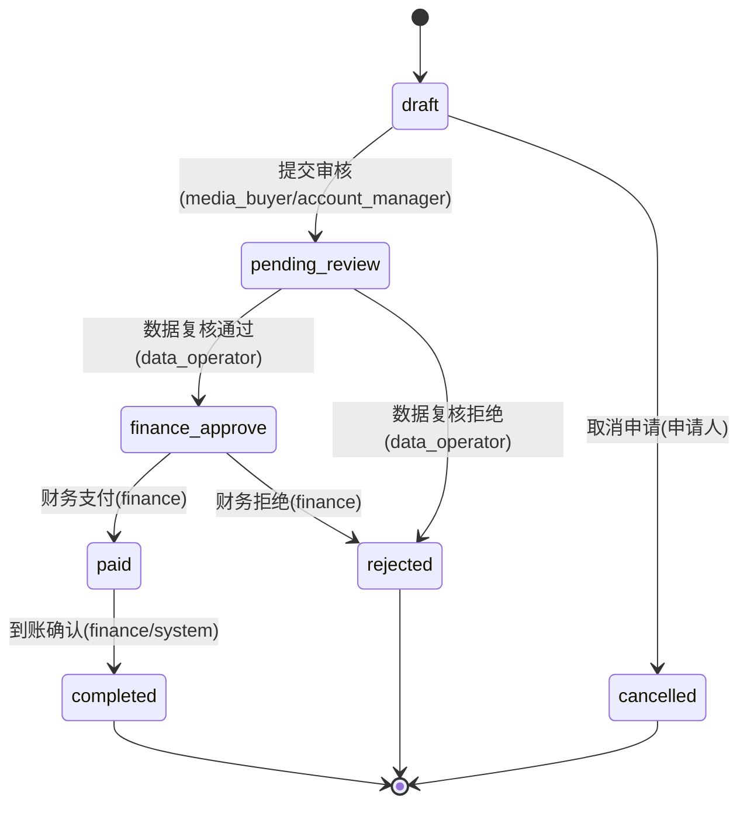

# TOPUP_SOT.md - 充值申请生命周期规范

> **版本**: v1.0
> **status**: draft
> **layer**: sot
> **owner**: wade
> **last_reviewed**: 2025-11-27
> **基准**: STATE_MACHINE.md v2.6, DATA_SCHEMA.md v5.2, LEDGER_SOT.md v1.1, BUSINESS_RULES.md v3.1, ERROR_CODES_SOT.md v2.1, AUTH_SPEC.md v2.0

---

## 文档定位

**本文档是充值申请(topup_requests)生命周期管理的唯一事实来源(Single Source of Truth)**。

- **适用范围**: 项目充值(PROJECT 账本)与供应商充值(SUPPLIER 账本)
- **互锁文档**:
  - 状态机 → STATE_MACHINE.md v2.6 第 9 章
  - 数据结构 → DATA_SCHEMA.md v5.2 第 3.4.1 节
  - 账本规则 → LEDGER_SOT.md v1.1
  - 业务规则 → BUSINESS_RULES.md v3.1
  - 错误码 → ERROR_CODES_SOT.md v2.1
  - 权限控制 → AUTH_SPEC.md v2.0

---

## 1. 充值申请状态机

### 1.1 状态枚举定义

**来源**: STATE_MACHINE.md v2.6 第 9 章(Line 326-335)

**合法状态值**(7个):
- `draft` - 草稿(初始态)
- `pending_review` - 待数据复核
- `finance_approve` - 财务已批准
- `paid` - 已支付
- `completed` - 已完成(终态)
- `rejected` - 已拒绝(终态)
- `cancelled` - 已取消(终态)

**终态定义**:
- `completed`, `rejected`, `cancelled` 为终态
- 终态不可流转至任何其他状态
- 违反终态流转规则抛出 `STATE-402` 错误

**初始态**: `draft`

### 1.2 标准流转路径



**正常流程**:
```
draft → pending_review → finance_approve → paid → completed
```

**异常分支**:
```
draft → cancelled (申请人主动取消)
pending_review → rejected (数据复核不通过)
finance_approve → rejected (财务终审拒绝)
```

### 1.3 状态流转白名单

**来源**: STATE_MACHINE.md v2.6 Line 1052-1060

| 当前状态 | 允许流转至 | 触发角色 | 前置条件 | 审计要求 |
|---------|-----------|---------|---------|---------|
| `draft` | `pending_review` | media_buyer / account_manager | amount > 0 AND project_id EXISTS | [AUDIT] 记录提交者、金额 |
| `draft` | `cancelled` | media_buyer / account_manager (申请人) | 申请人主动取消 | [AUDIT] 记录取消原因 |
| `pending_review` | `finance_approve` | data_operator | 数据复核通过 | [AUDIT] 记录复核意见 |
| `pending_review` | `rejected` | data_operator | 数据异常/不符规则 | [AUDIT] 记录拒绝原因(status_reason) |
| `finance_approve` | `paid` | finance | 支付完成,凭证已上传 | [AUDIT] 记录支付方式、凭证 URL |
| `finance_approve` | `rejected` | finance | 财务拒绝支付 | [AUDIT] 记录拒绝原因 |
| `paid` | `completed` | finance / system | 到账确认 + Ledger Entry 创建 | [AUDIT] 记录 ledger_entry_id |

**Python 白名单字典** (用于后端校验):

```python
# 来源: STATE_MACHINE.md Line 1052-1060
TOPUP_STATUS_FLOW_WHITELIST = {
    "draft": ["pending_review", "cancelled"],
    "pending_review": ["finance_approve", "rejected"],
    "finance_approve": ["paid", "rejected"],
    "paid": ["completed"],
    "completed": [],  # 终态
    "rejected": [],   # 终态
    "cancelled": []   # 终态
}

# 使用示例
def validate_status_transition(current: str, target: str) -> bool:
    allowed = TOPUP_STATUS_FLOW_WHITELIST.get(current, [])
    if target not in allowed:
        raise StateTransitionError(
            f"非法状态流转: {current} → {target}",
            error_code="STATE_400",
            details={"current": current, "target": target, "allowed": allowed}
        )
    return True
```

### 1.4 禁止的状态流转

**违反以下规则抛出 `STATE_400` 或 `STATE_402` 错误**:

| 禁止流转 | 错误码 | 理由 |
|---------|--------|------|
| `draft` → `completed` | STATE_401 | 跳过审批流程 |
| `draft` → `paid` | STATE_401 | 跳过审批与支付流程 |
| `pending_review` → `paid` | STATE_401 | 跳过财务审批 |
| `pending_review` → `completed` | STATE_401 | 跳过支付与入账 |
| `completed` → 任意状态 | STATE_402 | 终态不可回退(见 STATE_MACHINE Line 616) |
| `rejected` → 任意状态 | STATE_402 | 终态不可回退 |
| `cancelled` → 任意状态 | STATE_402 | 终态不可回退 |

**终态回退禁止**:
- **规则**: `completed`, `rejected`, `cancelled` 为绝对终态,即使 admin 也不得回退
- **来源**: STATE_MACHINE.md §14.2.3 Line 616 "禁止的终态回退场景"
- **例外说明**: 虽然 STATE_MACHINE.md §9 Line 333 允许一般终态的 admin 回退,但 topup_requests 属于**明确禁止例外**(Line 616 表格第1行)
- **理由**:
  - `completed` 状态已创建不可变 ledger_entry (entry_type=TOPUP),影响双账本完整性
  - `rejected`/`cancelled` 保留原金额用于审计追溯,防止历史篡改
  - 违反 Ledger 不可修改原则(LEDGER_SOT.md §2)
- **替代方案**:
  - `completed` 充值错误 → 创建 REVERSAL 类型 ledger_entry 冲正(LEDGER_SOT.md §5.3)
  - `rejected`/`cancelled` 重新申请 → 创建新 topup_request

---

## 2. 数据结构与字段验证

### 2.1 核心表定义

**来源**: DATA_SCHEMA.md v5.2 Line 340-360

**表名**: `topup_requests`
**主键**: `id` (BIGSERIAL)
**唯一约束**: `request_no` (VARCHAR(50) UNIQUE)

### 2.2 字段验证规则

| 字段名 | 类型 | 约束 | 验证规则 | 错误码 |
|--------|------|------|---------|--------|
| `id` | BIGSERIAL | PK | 自增主键 | - |
| `request_no` | VARCHAR(50) | UNIQUE, NOT NULL | 格式: `TOP-YYYYMMDD-{序号}`, 如 `TOP-20251127-000001` (6位序号,按日重置) | VALIDATION_001 |
| `project_id` | BIGINT | FK → projects.id | 项目必须存在且 `status IN ('draft', 'active')` | BIZ_002 |
| `ad_account_id` | BIGINT | FK → ad_accounts.id, NULLABLE | 可选,若填写则账户必须存在且 status ≠ 'dead' | BIZ_002 |
| `applicant_id` | UUID | FK → users.id, NOT NULL | 申请人必须存在且角色为 `media_buyer` 或 `account_manager` | AUTH_004 |
| `amount` | DECIMAL(15,2) | NOT NULL, > 0 | 金额必须 > 0, <= 1,000,000 (单笔限额,见 BUSINESS_RULES.md §X.X) | BIZ_100 |
| `currency` | VARCHAR(10) | NOT NULL, DEFAULT 'CNY' | 固定枚举: `CNY`, `USD`, `EUR` | VALIDATION_006 |
| `urgency_level` | VARCHAR(20) | NOT NULL | 固定枚举: `low`, `normal`, `high`, `urgent` (非状态机) | VALIDATION_006 |
| `status` | VARCHAR(20) | NOT NULL, DEFAULT 'draft' | 枚举值见第 1 章,CHECK 约束对齐 STATE_MACHINE | BIZ_300 |
| `status_reason` | TEXT | NULLABLE | 拒绝/取消原因,status IN ('rejected', 'cancelled') 时必填 | VALIDATION_001 |
| `expected_pay_date` | DATE | NULLABLE | 若填写必须 >= CURRENT_DATE | BIZ_200 |
| `voucher_url` | TEXT | NULLABLE | 支付凭证 URL, status >= 'paid' 时必填 | VALIDATION_001 |
| `created_by` | UUID | FK → users.id, NOT NULL | 创建人(同 applicant_id) | - |
| `updated_by` | UUID | FK → users.id | 最后更新人 | - |
| `created_at` | TIMESTAMPTZ | NOT NULL, DEFAULT NOW() | 创建时间(UTC) | - |
| `updated_at` | TIMESTAMPTZ | NOT NULL, DEFAULT NOW() | 更新时间(UTC) | - |

### 2.3 关联表

| 关联表 | 关系 | 说明 |
|--------|------|------|
| `topup_transactions` | 1:N | 支付到账流水,记录实际支付金额、支付方式、支付凭证 |
| `topup_approval_logs` | 1:N | 审批操作记录,记录每次状态流转的 old_status, new_status, operator_id, comments |
| `ledger_entries` | 1:1 | 资金总账分录,status = 'completed' 时创建,`reference_type = 'topup_request'`, `reference_id = topup_requests.id` |

### 2.4 索引定义

**来源**: DATA_SCHEMA.md Line 453

- `idx_topup_requests_project` - 项目查询优化: `(project_id, status)`
- `idx_topup_requests_status` - 状态查询优化: `(status, created_at)`
- `idx_topup_requests_applicant` - 申请人查询优化: `(applicant_id, created_at)`

---

## 3. 金额锁定与修改规则

### 3.1 金额锁定时机

**来源**: STATE_MACHINE.md v2.6 Line 690-801 "充值申请金额锁定规则"

**核心原则**: `amount` 字段在进入审批流程后锁定,禁止修改。

| 状态 | 金额可编辑 | 修改权限 | 说明 |
|------|-----------|---------|------|
| `draft` | ✅ | applicant (申请人) | 草稿阶段可自由修改 |
| `pending_review` | ❌ | admin (强制修改,需回退至 draft) | 已提交,金额锁定 |
| `finance_approve` | ❌ | admin (强制修改,需回退至 draft) | 财务已批准,金额锁定 |
| `paid` | ❌ | 不可修改 | 已支付,禁止任何修改 |
| `completed` | ❌ | 不可修改(终态) | 已完成,仅可创建 Adjustment Entry 冲正 |
| `rejected` | ❌ | 不可修改(终态) | 保留原金额用于审计 |
| `cancelled` | ❌ | 不可修改(终态) | 保留原金额用于审计 |

### 3.2 Admin 强制修改金额规则

**来源**: STATE_MACHINE.md Line 731-783

**场景**: 审批流程中发现金额错误(如申请人误填 200000 为 2000000)

**允许条件**:
1. **执行者**: 仅 `admin` 角色可执行
2. **允许状态**: 仅在 `pending_review` 或 `finance_approve` 状态
3. **操作结果**: 修改金额 + **状态回退至 `draft`** (重新提交审批)
4. **审计要求**: 必须提供修改理由(>=10 字符)

**实施代码示例**:

```python
def admin_force_update_topup_amount(
    topup_id: int,
    new_amount: Decimal,
    reason: str,
    operator: AuthenticatedUser
) -> Result:
    # 1. 权限校验
    if operator.role != "admin":
        raise PermissionDeniedError(
            "仅 admin 可修改审批中的充值金额",
            error_code="AUTH_500"
        )

    # 2. 状态校验
    topup = get_topup_request(topup_id)
    if topup.status not in ["pending_review", "finance_approve"]:
        raise BusinessLogicError(
            f"当前状态 {topup.status} 不允许修改金额",
            error_code="STATE_400"
        )

    # 3. 金额校验
    if new_amount <= 0 or new_amount > 1_000_000:
        raise ValidationError(
            "金额必须在 0 < amount <= 1,000,000 范围内",
            error_code="BIZ_100"
        )

    # 4. 理由校验
    if len(reason.strip()) < 10:
        raise ValidationError(
            "修改理由至少 10 个字符",
            error_code="VALIDATION_001"
        )

    # 5. 执行修改 + 状态回退 + 审计
    with transaction():
        old_amount = topup.amount
        old_status = topup.status

        topup.amount = new_amount
        topup.status = "draft"  # 回退至草稿,重新审批
        topup.updated_by = operator.id
        db.commit()

        # 审计日志
        create_audit_log(
            module="topup_requests",
            action="admin_force_update_amount",
            entity_id=topup_id,
            performed_by=operator.id,
            role="admin",
            payload_before={"amount": old_amount, "status": old_status},
            payload_after={"amount": new_amount, "status": "draft"},
            reason=f"Admin 强制修改金额: {reason}",
            ip_address=request.client_ip
        )
```

### 3.3 Rejected / Cancelled 状态金额处理

**来源**: STATE_MACHINE.md Line 784-800

**规则**: `rejected` 和 `cancelled` 状态的充值申请**不归零金额**,保留原申请金额用于审计。

**理由**:
1. 保留完整的申请记录供审计追溯
2. 拒绝/取消原因可能与金额无关(如资金暂时紧张、项目变更等)
3. 申请人可基于原金额创建新申请(复制场景)

**禁止操作**:
- ❌ 将 `rejected` / `cancelled` 申请的金额设为 0
- ❌ 删除 `rejected` / `cancelled` 申请记录
- ❌ 修改 `rejected` / `cancelled` 申请的任何字段

**允许操作**:
- ✅ 查询 `rejected` / `cancelled` 申请的原始金额
- ✅ 基于 `rejected` 申请创建新申请(复制 amount, project_id 等字段)

---

## 4. 账本写入规则

### 4.1 Ledger Entry 创建触发条件

**来源**: LEDGER_SOT.md v1.1, MASTER.md INV-001

**唯一触发时机**: 状态流转 `paid` → `completed`

**前置条件**(3 个必须同时满足):
1. `topup_transactions` 表已创建支付流水记录
2. 支付凭证已验证(`voucher_url` 非空)
3. 金额匹配: `topup_transactions.paid_amount` = `topup_requests.amount`

**若前置条件不满足**: 抛出 `BIZ-105` 错误,阻止流转至 `completed`

### 4.2 Ledger Entry 字段映射

| Ledger 字段 | 来源 | 规则 |
|------------|------|------|
| `entry_type` | 固定值 | `'TOPUP'` (充值类型,见 LEDGER_SOT.md entry_type 枚举) |
| `ledger_type` | 根据充值对象判断 | 项目充值 → `'PROJECT'`, 供应商充值 → `'SUPPLIER'` |
| `amount` | `topup_requests.amount` | **正值**(增加余额),如 `+10000.00` |
| `project_id` | `topup_requests.project_id` | 若 category = 'PROJECT' (非空) |
| `supplier_id` | `topup_requests.supplier_id` | 若 category = 'SUPPLIER' (非空) |
| `occurred_at` | `topup_transactions.paid_at` | 支付到账时间(TIMESTAMPTZ) |
| `reference_type` | 固定值 | `'topup_request'` |
| `reference_id` | `topup_requests.id` | 关联充值申请 ID |
| `created_by` | finance user_id | 财务确认人(或 system) |
| `created_at` | NOW() | Ledger Entry 创建时间 |
| `notes` | 自动生成 | `"充值申请 TOP-20251127-0001 到账确认"` |

### 4.3 双账本隔离规则

**来源**: MASTER.md INV-001, LEDGER_SOT.md

**PROJECT 账本** (收入侧):
- `ledger_type = 'PROJECT'`
- 仅记录客户充值(TOPUP) 和 计费(REVENUE)
- 余额计算: `SUM(ledger_entries.amount) WHERE ledger_type = 'PROJECT' AND project_id = {id}`

**SUPPLIER 账本** (成本侧):
- `ledger_type = 'SUPPLIER'`
- 仅记录供应商充值(TOPUP) 和 成本(COST)
- 余额计算: `SUM(ledger_entries.amount) WHERE ledger_type = 'SUPPLIER' AND supplier_id = {id}`

**严格禁止**:
- ❌ 在 PROJECT 账本记录 COST 类型
- ❌ 在 SUPPLIER 账本记录 REVENUE 类型
- ❌ 跨 category 进行余额聚合查询
- ❌ 直接 UPDATE `projects.balance` 或 `suppliers.balance` 字段

**余额更新原则**: 余额必须通过 `SUM(ledger_entries.amount)` 重新计算,禁止直接修改 balance 字段。

### 4.4 账本写入事务边界

**最关键事务**: 到账确认 (`paid` → `completed`)

```python
def complete_topup_request(topup_id: int, operator: User) -> Result:
    with transaction():  # 原子性保障
        # 1. 更新状态
        topup = get_topup_request(topup_id)
        if topup.status != 'paid':
            raise StateTransitionError("仅 paid 状态可流转至 completed")

        topup.status = 'completed'
        topup.updated_by = operator.id
        topup.save()

        # 2. 创建账本分录
        ledger_entry = create_ledger_entry(
            entry_type='TOPUP',
            ledger_type='PROJECT' if topup.project_id else 'SUPPLIER',
            amount=topup.amount,  # 正值
            project_id=topup.project_id,
            supplier_id=topup.supplier_id,
            occurred_at=get_payment_time(topup.id),
            reference_type='topup_request',
            reference_id=topup.id,
            created_by=operator.id
        )

        # 3. 更新余额(通过 SUM 重新计算)
        if topup.project_id:
            project = Project.get(topup.project_id)
            project.balance = calculate_balance_from_ledger(
                category='PROJECT',
                project_id=topup.project_id
            )
            project.save()

        # 4. 审计日志
        create_approval_log(
            topup_request_id=topup.id,
            action='complete',
            from_status='paid',
            to_status='completed',
            operator_id=operator.id,
            comments=f"到账确认,ledger_entry_id={ledger_entry.id}"
        )

        # 5. 事务提交(任一步骤失败则全部回滚)
```

**回滚条件**:
- Ledger Entry 创建失败 → 全部回滚
- 余额计算失败 → 全部回滚
- 审计日志写入失败 → 全部回滚

---

## 5. System 自动流转规则

### 5.1 允许的 System 自动流转

**来源**: STATE_MACHINE.md v2.6 Line 486-493

**唯一允许的 System 流转**: `paid` → `completed` (支付回调确认到账)

| 流转 | 触发来源 | 前置条件 | 审计要求 |
|------|---------|---------|---------|
| `paid` → `completed` | 支付平台回调(支付宝/微信/银行) | 1. Topup Transaction 已创建<br>2. 支付凭证已验证<br>3. 金额匹配<br>4. 幂等性检查通过 | [AUDIT] 必须记录: 回调时间、支付流水号(payment_ref)、实际到账金额 |

### 5.2 禁止的 System 自动流转

**来源**: STATE_MACHINE.md Line 506-522

以下流转**严格禁止** system 自动执行,必须由人工角色操作:

| 禁止流转 | 错误码 | 理由 |
|---------|--------|------|
| `pending_review` → `finance_approve` | STATE-403 | 禁止自动审批,必须 data_operator 人工复核 |
| `finance_approve` → `paid` | STATE-403 | 禁止自动支付,必须 finance 人工操作 |
| 任意状态 → `rejected` | STATE-403 | 禁止自动拒绝,必须人工决策并提供 status_reason |
| `completed` → 任意状态 | STATE-402 | 禁止终态回退(即使 system 也不可) |

### 5.3 支付回调幂等性保障

**场景**: 支付平台可能重复发送回调通知

**实施方案**:

```python
def handle_payment_callback(
    payment_ref: str,  # 支付流水号(如 ALI202511270001)
    amount: Decimal,
    paid_at: datetime
) -> Result:
    # 1. 幂等性检查
    if topup_transaction_exists(payment_ref):
        logger.info(f"Payment {payment_ref} already processed, skip")
        return Result.success("Already processed")

    # 2. 验证签名 + 金额
    verify_payment_signature(payment_ref)

    # 3. 查找对应的 topup_request
    topup = find_topup_by_payment_ref(payment_ref)
    if not topup or topup.status != 'paid':
        raise BusinessLogicError(
            f"Topup {topup.id} status={topup.status}, expected 'paid'",
            error_code="STATE-400"
        )

    # 4. 金额匹配检查
    if abs(amount - topup.amount) > 0.01:  # 允许 0.01 误差
        raise BusinessLogicError(
            f"Amount mismatch: requested={topup.amount}, paid={amount}",
            error_code="BIZ-106"
        )

    # 5. 创建 Transaction + 流转状态 + 创建 Ledger Entry (事务)
    with transaction():
        create_topup_transaction(
            topup_request_id=topup.id,
            payment_ref=payment_ref,
            paid_amount=amount,
            paid_at=paid_at
        )

        complete_topup_request(topup.id, operator=None)  # system 操作
```

---

## 6. 权限与角色控制

### 6.1 角色权限矩阵

**来源**: AUTH_SPEC.md v2.0, STATE_MACHINE.md 第 14 章

| 角色 | 允许操作 | 禁止操作 |
|------|---------|---------|
| `media_buyer` | 创建申请(draft)、编辑草稿、提交审核(→ pending_review)、取消草稿(→ cancelled) | 审批、修改他人申请、查看其他 media_buyer 的申请、修改金额(审批后) |
| `account_manager` | 创建申请、编辑草稿、提交审核、取消草稿、查看所属项目的所有申请 | 审批、修改金额(审批后)、查看其他项目的申请 |
| `data_operator` | 数据复核(pending_review → finance_approve/rejected)、查看所有申请 | 创建申请、财务终审、强制修改金额 |
| `finance` | 财务终审(finance_approve → paid/rejected)、到账确认(paid → completed)、查看所有申请、导出财务报表 | 创建申请、数据复核、修改审批后的金额 |
| `admin` | 强制修改金额(需回退至 draft) + 强制解锁流程 + 查看所有数据 + 导出审计报表 + 标记支付完成(mark-paid) | **禁止**: (1) 创建充值申请(职责分离原则), (2) 数据复核/终审(职责分离), (3) 终态回退(见 STATE_MACHINE.md §14.2.3 Line 616) |

### 6.2 RLS 策略(Row-Level Security)

**来源**: AUTH_SPEC.md v2.0, RLS_POLICIES_SOT.md

**RLS 状态**:
- **当前版本**: RLS 未启用 (ENABLE_RLS=false)
- **实施策略**: 权限控制在应用层实现 (Service 层 + @require_role 装饰器)
- **未来规划**: RLS 保留作为备用方案,待性能测试和团队评估后决定是否启用 (见 AUTH_SPEC.md §6)

**应用层权限规则**:

| 角色 | 可见范围 | SQL 过滤条件示例 |
|------|---------|----------------|
| `media_buyer` | 仅自己创建的申请 | `WHERE applicant_id = current_user_id` |
| `account_manager` | 所属项目的所有申请 | `WHERE project_id IN (SELECT project_id FROM project_members WHERE user_id = current_user_id)` |
| `data_operator` | 所有申请 | 无过滤 |
| `finance` | 所有申请 | 无过滤 |
| `admin` | 所有申请 | 无过滤 |

### 6.3 审批分离原则

**来源**: STATE_MACHINE.md Line 29 "审批分离"

**规则**:
- **提交者不能审批自身请求**
- 若 `applicant_id = current_user_id`,则禁止执行 `pending_review → finance_approve` 操作
- 违反抛出 `AUTH_500` 错误 (见 Chapter 7.1 "审批分离违规")

**实施代码**:

```python
def approve_topup(topup_id: int, operator: User) -> Result:
    topup = get_topup_request(topup_id)

    # 审批分离检查
    if topup.applicant_id == operator.id:
        raise PermissionDeniedError(
            "提交者不能审批自身请求",
            error_code="AUTH-002"
        )

    # 角色检查
    if operator.role != 'data_operator':
        raise PermissionDeniedError(
            "仅 data_operator 可执行数据复核",
            error_code="AUTH-001"
        )

    # 执行审批...
```

---

## 7. 错误码定义

### 7.1 充值特定错误码

**来源**: ERROR_CODES_SOT.md v2.1

| 错误码 | 说明 | HTTP | 触发场景 |
|--------|------|------|---------|
| `BIZ_100` | 充值金额无效 | 400 | amount <= 0 或 > 1,000,000 |
| `BIZ_002` | 项目不存在 | 404 | project_id 无效或 status 非 'active' / 'draft' |
| `BIZ_002` | 广告账户不存在 | 404 | ad_account_id 填写但不存在或 status = 'dead' |
| `VALIDATION_001` | 支付凭证缺失 | 400 | status >= 'paid' 但 voucher_url 为空 |
| `VALIDATION_001` | 拒绝/取消原因缺失 | 400 | status IN ('rejected', 'cancelled') 但 status_reason 为空 |
| `BIZ_001` | 到账确认前置条件不满足 | 400 | paid → completed 时 topup_transaction 不存在或金额不匹配 |
| `BIZ_100` | 支付金额不匹配 | 400 | paid_amount ≠ requested_amount (超过 0.01 误差) |
| `STATE_400` | 非法状态流转 | 400 | 不在白名单的流转(如 draft → completed) |
| `STATE_400` | 跳过必要步骤 | 400 | 如 pending_review → paid (跳过 finance_approve) |
| `STATE_402` | 终态非法回退 | 400 | 终态 → 非终态(completed/rejected/cancelled → 任意状态) |
| `AUTH_500` | 系统无权限流转 | 403 | system 尝试禁止的流转(如自动审批) |
| `STATE_402` | 绝对禁止的流转 | 400 | completed 充值尝试回退 |
| `AUTH_004` | 申请人不存在 | 404 | applicant_id 对应用户不存在 |
| `AUTH_500` | 审批分离违规 | 403 | 提交者尝试审批自身请求 |
| `AUTH_500` | 金额修改权限不足 | 403 | 非 admin 尝试修改审批中的金额 |
| `VALIDATION_002` | request_no 格式错误 | 400 | 不符合 `TOP-YYYYMMDD-{序号}` 格式 |
| `VALIDATION_006` | 币种无效 | 400 | currency 非 CNY / USD / EUR |
| `VALIDATION_006` | 紧急程度无效 | 400 | urgency_level 非 low / normal / high / urgent |
| `BIZ_200` | 期望支付日期无效 | 400 | expected_pay_date < CURRENT_DATE |
| `VALIDATION_001` | 修改理由过短 | 400 | admin 修改金额但 reason 少于 10 字符 |

### 7.2 错误码使用规范

**示例**:

```python
# 金额验证
if amount <= 0 or amount > 1_000_000:
    raise ValidationError(
        "充值金额必须在 0 < amount <= 1,000,000 范围内",
        error_code="BIZ_100",
        details={"amount": amount, "max_limit": 1_000_000}
    )

# 项目状态验证
project = Project.get(project_id)
if not project or project.status not in ['draft', 'active']:
    raise BusinessLogicError(
        f"项目 {project_id} 不存在或状态异常(仅 draft/active 可充值)",
        error_code="BIZ_002",
        details={"project_status": project.status if project else None}
    )

# 状态流转验证
if current_status == 'completed':
    raise StateTransitionError(
        "completed 为终态,不可流转至任何其他状态",
        error_code="STATE_402",
        details={"current_status": "completed", "target_status": target_status}
    )
```

---

## 8. 幂等性与并发控制

### 8.1 幂等性保障

**request_no 唯一性**:
- UNIQUE 约束防止重复提交
- 格式: `TOP-{date}-{序号}`, 如 `TOP-20251127-0001`
- 前端禁用"提交"按钮防止双击

**支付回调幂等**:
- 基于 `topup_transactions.payment_ref` 去重
- 若 payment_ref 已存在,直接返回成功(见第 5.3 节)

**Ledger Entry 幂等**:
- 检查 `ledger_entries` 表是否已存在 `reference_type = 'topup_request' AND reference_id = {topup_id}`
- 若已存在,抛出 `BIZ-107` 错误,阻止重复创建

### 8.2 并发控制策略

**乐观锁**(基于 `updated_at` 版本号):

```sql
-- 状态流转(draft → pending_review)
UPDATE topup_requests
SET
    status = 'pending_review',
    updated_at = NOW(),
    updated_by = :operator_id
WHERE id = :topup_id
  AND status = 'draft'  -- 前置状态校验
  AND updated_at = :expected_version;  -- 乐观锁

-- 检查影响行数
IF @@ROWCOUNT = 0 THEN
    RAISE EXCEPTION 'Concurrent modification detected or invalid state transition'
    USING ERRCODE = 'STATE-409';
END IF;
```

**悲观锁**(关键场景):

```python
# 到账确认(paid → completed) 使用悲观锁
with transaction():
    topup = TopupRequest.objects.select_for_update().get(id=topup_id)

    if topup.status != 'paid':
        raise StateTransitionError("Status must be 'paid'")

    # 执行流转 + 创建 Ledger Entry...
```

### 8.3 高并发场景处理

| 场景 | 并发风险 | 解决方案 |
|------|---------|---------|
| 同一用户多次点击"提交" | request_no 重复 | UNIQUE 约束 + 前端按钮禁用 |
| 支付回调重复通知 | 重复创建 Transaction | payment_ref 幂等性检查 |
| Admin 同时修改金额 | 覆盖写 | 乐观锁(updated_at 版本号) |
| 到账确认并发执行 | 重复创建 Ledger Entry | 悲观锁(SELECT FOR UPDATE) + reference_id 唯一性检查 |

---

## 9. 事务边界与回滚规则

### 9.1 关键事务边界

| 操作 | 事务包含 | 回滚条件 |
|------|---------|---------|
| **提交申请** (`draft` → `pending_review`) | 1. 更新 status<br>2. 创建 approval_log | 任一步骤失败 |
| **财务支付** (`finance_approve` → `paid`) | 1. 更新 status<br>2. 创建 topup_transaction<br>3. 创建 approval_log | 任一步骤失败 |
| **到账确认** (`paid` → `completed`) | 1. 更新 status<br>2. 创建 ledger_entry<br>3. 更新 project/supplier balance<br>4. 创建 approval_log | **任一步骤失败,全部回滚** |

**最关键事务**: 到账确认 (`paid` → `completed`)

- **原子性要求**: 4 个操作必须全部成功或全部回滚
- **一致性要求**: balance 必须与 SUM(ledger_entries) 一致
- **隔离性要求**: 使用悲观锁防止并发
- **持久性要求**: 事务提交后,Ledger Entry 不可删除/修改

### 9.2 回滚后处理

**状态回退**:
- 若事务失败,`status` 自动回滚至原状态(如 paid)
- 不会产生中间状态

**审计记录**:
- 事务失败后,记录失败原因到 `audit_logs` (severity = ERROR)
- 包含: 失败的事务类型、entity_id、错误信息、堆栈追踪

**告警通知**:
- 关键事务失败(如到账确认)发送告警给 finance + admin
- 包含: topup_request_id, amount, error_code, error_message

**示例**:

```python
try:
    with transaction():
        complete_topup_request(topup_id, operator)
except Exception as e:
    # 1. 审计日志
    create_audit_log(
        module="topup_requests",
        action="complete_failed",
        entity_id=topup_id,
        severity="ERROR",
        payload_before={"status": "paid"},
        error_message=str(e),
        stacktrace=traceback.format_exc()
    )

    # 2. 发送告警
    send_alert_to_finance_and_admin(
        alert_type="TOPUP_COMPLETE_FAILED",
        topup_id=topup_id,
        amount=topup.amount,
        error=str(e)
    )

    # 3. 重新抛出异常
    raise
```

---

## 10. API 接口定义

### 10.1 核心 API 端点

**来源**: API_SOT.md (待补充,本节定义接口规范)

| 端点 | 方法 | 说明 | 角色权限 |
|------|------|------|---------|
| `POST /api/topups` | POST | 创建充值申请 | media_buyer / account_manager |
| `GET /api/topups` | GET | 查询充值列表(支持分页、过滤) | 根据 RLS 策略 |
| `GET /api/topups/:id` | GET | 查询单个申请详情 | 根据 RLS 策略 |
| `PATCH /api/topups/:id` | PATCH | 更新草稿(仅 draft 状态) | 申请人(applicant_id) |
| `POST /api/topups/:id/submit` | POST | 提交审核(draft → pending_review) | 申请人 |
| `POST /api/topups/:id/review` | POST | 数据复核(→ finance_approve/rejected) | data_operator |
| `POST /api/topups/:id/pay` | POST | 财务支付(→ paid) | finance |
| `POST /api/topups/:id/complete` | POST | 到账确认(→ completed) | finance / system |
| `POST /api/topups/:id/cancel` | POST | 取消申请(draft → cancelled) | 申请人 |
| `POST /api/topups/:id/admin-update-amount` | POST | Admin 强制修改金额(需回退至 draft) | admin |

### 10.2 请求/响应结构

**创建申请**:

```typescript
// POST /api/topups
interface CreateTopupRequest {
  project_id: number;           // 必填
  ad_account_id?: number;       // 可选
  amount: number;               // 必填, > 0, <= 1000000
  currency: 'CNY' | 'USD' | 'EUR';  // 默认 CNY
  urgency_level: 'low' | 'normal' | 'high' | 'urgent';  // 默认 normal
  expected_pay_date?: string;   // ISO 8601 date, 可选
}

// 响应
interface TopupResponse {
  id: number;
  request_no: string;           // TOP-20251127-0001
  status: TopupStatus;
  amount: number;
  currency: string;
  urgency_level: string;
  project: {
    id: number;
    name: string;
    status: string;
  };
  applicant: {
    id: string;
    username: string;
    role: string;
  };
  created_at: string;           // ISO 8601
  updated_at: string;
}
```

**数据复核**:

```typescript
// POST /api/topups/:id/review
interface ReviewTopupRequest {
  approve: boolean;             // true=通过, false=拒绝
  comments: string;             // 复核意见(必填)
  status_reason?: string;       // 若 approve=false, 必填(拒绝原因)
}
```

**财务支付**:

```typescript
// POST /api/topups/:id/pay
interface PayTopupRequest {
  payment_method: 'bank_transfer' | 'alipay' | 'wechat' | 'paypal' | 'other';
  payment_ref: string;          // 支付流水号
  voucher_url: string;          // 支付凭证 URL(必填)
  paid_at: string;              // 支付时间(ISO 8601)
  comments?: string;            // 备注
}
```

---

## 11. 审计与日志要求

### 11.1 必须记录的审计事件

**来源**: STATE_MACHINE.md Line 315-323 "审计日志要求"

| 事件 | 记录字段 | 存储位置 |
|------|---------|---------|
| **状态流转** | `topup_request_id`, `action`, `from_status`, `to_status`, `operator_id`, `comments`, `created_at` | `topup_approval_logs` |
| **金额修改** | `entity_id`, `old_amount`, `new_amount`, `reason`, `operator_id`, `ip_address` | `audit_logs` |
| **支付到账** | `topup_request_id`, `payment_ref`, `paid_amount`, `paid_at`, `payment_method`, `receipt_url` | `topup_transactions` |
| **Ledger Entry 创建** | `topup_request_id`, `ledger_entry_id`, `amount`, `category`, `created_at` | `topup_approval_logs` (comments 字段) |

### 11.2 审计日志格式

**topup_approval_logs 表结构**:

| 字段 | 类型 | 说明 |
|------|------|------|
| `id` | BIGSERIAL | 主键 |
| `topup_request_id` | BIGINT | FK → topup_requests.id |
| `action` | VARCHAR(50) | 操作类型(submit/review/pay/complete/cancel) |
| `from_status` | VARCHAR(20) | 旧状态 |
| `to_status` | VARCHAR(20) | 新状态 |
| `operator_id` | UUID | FK → users.id (NULL 表示 system) |
| `comments` | TEXT | 操作说明/理由 |
| `created_at` | TIMESTAMPTZ | 操作时间 |

**audit_logs 表示例**(全局审计日志):

```json
{
  "module": "topup_requests",
  "action": "admin_force_update_amount",
  "entity_id": 12345,
  "performed_by": "admin_user_uuid",
  "role": "admin",
  "payload_before": {
    "amount": 200000.00,
    "status": "pending_review"
  },
  "payload_after": {
    "amount": 20000.00,
    "status": "draft"
  },
  "reason": "申请人误填金额,实际应为 2 万而非 20 万",
  "ip_address": "192.168.1.100",
  "user_agent": "Mozilla/5.0...",
  "created_at": "2025-11-27T10:30:00Z"
}
```

---

## 12. 风控与异常处理

### 12.1 风控规则

**来源**: BUSINESS_RULES.md v3.1 (待补充)

| 规则编号 | 说明 | 触发条件 | 处理方式 |
|---------|------|---------|---------|
| **RISK-TOP-001** | 单笔充值金额异常 | amount > 500,000 (50 万) | 自动标记 `urgency_level = 'urgent'`, 发送告警给 finance + admin 审核 |
| **RISK-TOP-002** | 频繁充值 | 同一 project_id 24 小时内提交 > 5 笔 | 发送告警给 data_operator,人工审核是否异常 |
| **RISK-TOP-003** | 项目余额异常低 | project.balance < -100,000 (负 10 万) | 禁止新充值申请,需 finance 审批解除限制 |
| **RISK-TOP-004** | 支付凭证异常 | voucher_url 文件大小 > 10MB 或格式非 jpg/png/pdf | 自动拒绝,要求重新上传 |

### 12.2 异常场景处理

| 异常场景 | 触发条件 | 处理方式 | 错误码 |
|---------|---------|---------|--------|
| **支付回调超时** | status = 'paid' 持续 24 小时未收到回调 | 自动告警 finance,人工确认是否到账 | - |
| **金额不匹配** | `paid_amount ≠ requested_amount` (误差 > 0.01) | 拒绝流转至 completed,记录差异到 audit_logs | BIZ_100 |
| **凭证缺失** | status >= 'paid' 但 `voucher_url` 为空 | 阻止流转,要求上传凭证 | VALIDATION_001 |
| **重复提交** | request_no UNIQUE 冲突 | 返回 409 Conflict,提示用户刷新页面 | VALIDATION_002 |
| **并发修改** | updated_at 乐观锁冲突 | 返回 409 Conflict,提示用户重新加载 | DB_002 |

### 12.3 监控指标

**Prometheus Metrics**:

```python
# 充值申请创建次数
topup_requests_created_total = Counter(
    "topup_requests_created_total",
    "充值申请创建次数",
    ["project_id", "applicant_role", "currency"]
)

# 充值金额分布
topup_amount_distribution = Histogram(
    "topup_amount_distribution",
    "充值金额分布",
    buckets=[1000, 5000, 10000, 50000, 100000, 500000, 1000000]
)

# 状态流转耗时
topup_status_transition_duration_seconds = Histogram(
    "topup_status_transition_duration_seconds",
    "状态流转耗时",
    ["from_status", "to_status"]
)

# 失败的状态流转
topup_status_transition_failed_total = Counter(
    "topup_status_transition_failed_total",
    "失败的状态流转次数",
    ["from_status", "to_status", "error_code"]
)
```

---

## 13. 与其他 SoT 的引用链

### 13.1 上游依赖

| SoT 文档 | 引用章节 | 用途 |
|---------|---------|------|
| **STATE_MACHINE.md v2.6** | 第 9 章(Line 326-335) | 状态枚举定义 |
| | Line 1052-1060 | 状态流转白名单 |
| | Line 690-801 | 金额锁定规则 |
| | Line 486-493 | System 自动流转规则 |
| | Line 616 | 终态回退禁止 |
| **DATA_SCHEMA.md v5.2** | Line 340-360 | topup_requests 表结构 |
| | Line 362-368 | 关联表(topup_transactions, topup_approval_logs) |
| | Line 453 | 索引定义 |
| **LEDGER_SOT.md v1.1** | 第 2 章 | 账本写入规则 |
| | 双账本隔离规则 | PROJECT vs SUPPLIER 账本 |
| | 余额计算公式 | SUM(ledger_entries.amount) |
| **BUSINESS_RULES.md v3.1** | BR-FIN-* | 充值金额上限(1,000,000)、风控规则 |
| **ERROR_CODES_SOT.md v2.1** | BIZ-100 ~ BIZ-107 | 业务错误码 |
| | STATE-400 ~ STATE-405 | 状态流转错误码 |
| | AUTH-001, AUTH-002 | 权限错误码 |
| **AUTH_SPEC.md v2.0** | 第 5 章 | 5 个角色定义及权限 |
| | RLS 策略 | Row-Level Security 规则 |

### 13.2 下游影响

| SoT 文档 | 影响内容 | 说明 |
|---------|---------|------|
| **API_SOT.md** | 充值 API 端点定义 | POST /api/topups, GET /api/topups/:id 等 10 个端点 |
| **RECONCILIATION_SOT.md** | 充值金额参与对账 | completed 充值记录需与银行流水对账 |
| **TRANSFER_SOT.md** | 充值后余额可用于转账 | completed 后 project.balance 增加,可执行死号迁移 |
| **DAILY_REPORT_SOT.md** | 无直接影响 | 充值与日报独立,不互相依赖 |

---

## 附录 A: 状态流转示例

### A.1 正常流程示例

```
场景: media_buyer 为项目 #123 申请充值 10,000 元

1. media_buyer 创建申请
   - POST /api/topups
   - {project_id: 123, amount: 10000, currency: 'CNY'}
   - 系统生成: request_no = TOP-20251127-0001, status = draft

2. media_buyer 提交审核
   - POST /api/topups/1/submit
   - 状态流转: draft → pending_review
   - 审计记录: topup_approval_logs (action=submit, from_status=draft, to_status=pending_review)

3. data_operator 复核通过
   - POST /api/topups/1/review {approve: true, comments: "数据无误,金额合理"}
   - 状态流转: pending_review → finance_approve
   - 审计记录: topup_approval_logs (action=review, to_status=finance_approve)

4. finance 完成支付
   - POST /api/topups/1/pay {payment_method: 'bank_transfer', payment_ref: 'BANK202511270001', voucher_url: 'https://...', paid_at: '2025-11-27T10:00:00Z'}
   - 状态流转: finance_approve → paid
   - 创建记录: topup_transactions (payment_ref, paid_amount=10000)

5. finance/system 确认到账
   - POST /api/topups/1/complete (或支付回调自动触发)
   - 状态流转: paid → completed
   - 创建记录: ledger_entries (entry_type=TOPUP, ledger_type=PROJECT, amount=+10000, reference_id=1)
   - 更新余额: project.balance = SUM(ledger_entries) = old_balance + 10000
   - 审计记录: topup_approval_logs (action=complete, ledger_entry_id=456)
```

### A.2 拒绝流程示例

```
场景: 申请金额超限,data_operator 复核拒绝

1. media_buyer 创建申请
   - {project_id: 123, amount: 2000000, currency: 'CNY'}  # 超过 100 万限额
   - status = draft

2. media_buyer 提交审核
   - draft → pending_review

3. data_operator 复核拒绝
   - POST /api/topups/1/review {approve: false, status_reason: "单笔充值金额不得超过 100 万"}
   - 状态流转: pending_review → rejected (终态)
   - 审计记录: topup_approval_logs (action=review, to_status=rejected, comments=拒绝原因)
   - 金额保留: amount = 2000000 (不归零,用于审计)
```

### A.3 Admin 强制修改金额示例

```
场景: 申请人误填 200000 为 2000000,已提交审批

1. 当前状态: pending_review, amount = 2000000
2. admin 发现错误,强制修改金额
   - POST /api/topups/1/admin-update-amount {new_amount: 200000, reason: "申请人误填,实际应为 20 万"}
   - 状态流转: pending_review → draft (回退至草稿)
   - 金额修改: amount = 2000000 → 200000
   - 审计记录: audit_logs (action=admin_force_update_amount, old_amount=2000000, new_amount=200000, reason=...)
3. 申请人重新提交审核,流程重新开始
```

---

## 附录 B: SQL 迁移检查清单

### B.1 CHECK 约束

```sql
-- topup_requests.status CHECK 约束
ALTER TABLE topup_requests
ADD CONSTRAINT chk_topup_requests_status
CHECK (status IN (
    'draft',
    'pending_review',
    'finance_approve',
    'paid',
    'completed',
    'rejected',
    'cancelled'
));

-- topup_requests.currency CHECK 约束
ALTER TABLE topup_requests
ADD CONSTRAINT chk_topup_requests_currency
CHECK (currency IN ('CNY', 'USD', 'EUR'));

-- topup_requests.urgency_level CHECK 约束
ALTER TABLE topup_requests
ADD CONSTRAINT chk_topup_requests_urgency_level
CHECK (urgency_level IN ('low', 'normal', 'high', 'urgent'));

-- topup_requests.amount CHECK 约束
ALTER TABLE topup_requests
ADD CONSTRAINT chk_topup_requests_amount_positive
CHECK (amount > 0 AND amount <= 1000000);
```

### B.2 UNIQUE 约束

```sql
-- request_no 唯一性
ALTER TABLE topup_requests
ADD CONSTRAINT uq_topup_requests_request_no
UNIQUE (request_no);
```

### B.3 外键约束

```sql
-- project_id 外键
ALTER TABLE topup_requests
ADD CONSTRAINT fk_topup_requests_project_id
FOREIGN KEY (project_id) REFERENCES projects(id) ON DELETE RESTRICT;

-- ad_account_id 外键(可空)
ALTER TABLE topup_requests
ADD CONSTRAINT fk_topup_requests_ad_account_id
FOREIGN KEY (ad_account_id) REFERENCES ad_accounts(id) ON DELETE SET NULL;

-- applicant_id 外键
ALTER TABLE topup_requests
ADD CONSTRAINT fk_topup_requests_applicant_id
FOREIGN KEY (applicant_id) REFERENCES users(id) ON DELETE RESTRICT;
```

### B.4 索引

```sql
-- 项目查询优化
CREATE INDEX idx_topup_requests_project
ON topup_requests(project_id, status);

-- 状态查询优化
CREATE INDEX idx_topup_requests_status
ON topup_requests(status, created_at DESC);

-- 申请人查询优化
CREATE INDEX idx_topup_requests_applicant
ON topup_requests(applicant_id, created_at DESC);
```

### B.5 默认值

```sql
ALTER TABLE topup_requests
ALTER COLUMN status SET DEFAULT 'draft';

ALTER TABLE topup_requests
ALTER COLUMN currency SET DEFAULT 'CNY';

ALTER TABLE topup_requests
ALTER COLUMN created_at SET DEFAULT NOW();

ALTER TABLE topup_requests
ALTER COLUMN updated_at SET DEFAULT NOW();
```

---

**文档状态**: ✅ Draft - 已生成完整内容,待审计
**下一步**: 提交 ai-ad-sot-codex-loop 审计(AUDIT 阶段)
**预估健康度**: 初步评估 90/100 (待 Codex 审计确认 P0/P1/P2 问题)
