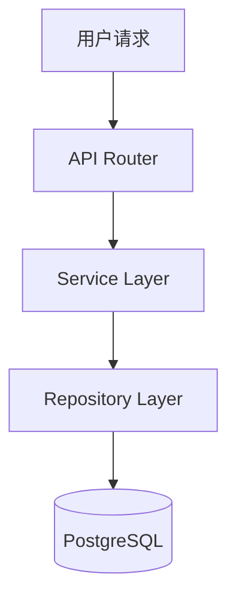

# Architecture Layer Overview

## 1. Layer Purpose and Positioning

### 1.1 Architecture Layer in ASDD 4-Layer Model

本架构层（Architecture Layer）是 ASDD (AI-Spec-Driven Development) 四层文档体系中的第四层，提供系统架构的可视化视图和战略性技术决策指南。

**ASDD 四层架构**:
```
Layer 1: Overview (概览层)
  ├── MASTER.md v4.4 (系统架构宪法)
  ├── PROJECT.md (项目能力边界)
  ├── DOMAIN.md (领域概念索引)
  └── ARCHITECTURE.md, PATTERNS.md, TESTING.md, DEPLOYMENT.md

Layer 2: SoT (Single Source of Truth - 真相源层)
  ├── STATE_MACHINE.md v2.7 (8状态机定义)
  ├── DATA_SCHEMA.md v5.3 (数据结构)
  ├── API_SOT.md v9.3 (API端点规范)
  ├── ERROR_CODES_SOT.md v2.1 (错误码)
  ├── BUSINESS_RULES.md v4.1 (业务规则)
  ├── AUTH_SPEC.md v2.0 (认证授权)
  └── LEDGER_SOT.md v1.2 (账本系统)

Layer 3: Dev-Guides (开发指南层)
  ├── API_DEVELOPMENT_FLOW.md (API开发流程)
  ├── FRONTEND_DEVELOPMENT_RULES.md (前端规范)
  ├── UI_FLOW_SPEC.md (UI交互规范)
  ├── TESTING_STRATEGY.md (测试策略)
  ├── DEPLOYMENT_GUIDE.md (部署指南)
  └── DDD_API_ARCHITECTURE.md (DDD架构模式)

Layer 4: Architecture (架构视图层) ← 当前层
  ├── ARCH_LAYER_OVERVIEW.md (本文档)
  ├── SYSTEM_CONTEXT_VIEW.md (系统上下文视图)
  ├── BOUNDED_CONTEXT_MAP.md (DDD限界上下文)
  ├── SERVICE_COMPONENT_VIEW.md (服务组件视图)
  ├── DATA_FLOW_VIEW.md (数据流视图)
  ├── ERROR_HANDLING_STRATEGY.md (错误处理策略)
  └── PERFORMANCE_AND_CAPACITY_GUIDE.md (性能与容量规划)
```

### 1.2 Relationship to Overview Layer (MASTER.md v4.4)

**继承关系**: Architecture Layer 必须严格遵守 MASTER.md v4.4 定义的三大不可变量：

- **INV-001**: 账务只追加，不修改 (Ledger append-only)
  - 体现在: DATA_FLOW_VIEW.md 的账本流转图
  - 体现在: SERVICE_COMPONENT_VIEW.md 的 LedgerService 设计

- **INV-002**: 终态不可逆 (Terminal states immutable)
  - 体现在: DATA_FLOW_VIEW.md 的状态机流转
  - 体现在: ERROR_HANDLING_STRATEGY.md 的终态检查逻辑

- **INV-003**: 日报状态单向流转 (Daily report one-way state flow)
  - 体现在: DATA_FLOW_VIEW.md 的8状态流转图
  - 体现在: BOUNDED_CONTEXT_MAP.md 的 Daily Report Context

**架构原则继承** (来自 MASTER.md §1.3):
- 双账本架构 (Dual-Ledger): PROJECT账本 vs SUPPLIER账本
- 三数据流分离 (Triple-Stream): raw/real/final数据流隔离
- 审计不可逆 (Immutable Audit Trail): 账本记录只追加不修改

### 1.3 Relationship to SoT Layer (Freeze v1.0)

**真相源依赖**: Architecture Layer 的所有图表和描述必须引用 SoT 层的权威定义，禁止重新定义业务规则。

**SoT版本对齐表**:
| SoT文档 | 版本 | 架构层引用位置 |
|---------|------|---------------|
| STATE_MACHINE.md | v2.7 | DATA_FLOW_VIEW.md (8状态流转图) |
| DATA_SCHEMA.md | v5.3 | SERVICE_COMPONENT_VIEW.md (Repository层设计) |
| API_SOT.md | v9.3 | SERVICE_COMPONENT_VIEW.md (API Router层) |
| ERROR_CODES_SOT.md | v2.1 | ERROR_HANDLING_STRATEGY.md (错误码映射) |
| BUSINESS_RULES.md | v4.1 | BOUNDED_CONTEXT_MAP.md (业务规则引用) |
| AUTH_SPEC.md | v2.0 | SYSTEM_CONTEXT_VIEW.md (用户角色) |
| LEDGER_SOT.md | v1.2 | DATA_FLOW_VIEW.md (账本流转) |

**职责边界**:
- SoT层定义"WHAT" (业务规则是什么)
- Architecture层定义"HOW" (技术实现如何组织)

### 1.4 Relationship to Dev-Guides Layer (Freeze v2.1)

**指导关系**: Architecture Layer 提供高层次技术视图，Dev-Guides Layer 提供具体开发步骤。

**协作关系**:
- **API_DEVELOPMENT_FLOW.md** 的6步开发流程 → 体现在 SERVICE_COMPONENT_VIEW.md 的分层架构设计
- **FRONTEND_DEVELOPMENT_RULES.md** 的前端规范 → 体现在 SYSTEM_CONTEXT_VIEW.md 的Web应用容器
- **TESTING_STRATEGY.md** 的测试策略 → 支持 SERVICE_COMPONENT_VIEW.md 的组件隔离设计
- **DDD_API_ARCHITECTURE.md** 的DDD模式 → 扩展为 BOUNDED_CONTEXT_MAP.md 的限界上下文映射

### 1.5 Document Lifecycle: draft → active → ready_for_production → frozen

**文档状态定义**:
- `draft`: 初稿阶段，内容未完整，可能存在P0/P1问题
- `active`: 内容完整，通过初步审查，P0=0但可能存在P1问题
- `ready_for_production`: 生产就绪，P0=0且P1=0，可能存在P2优化建议
- `frozen`: 冻结状态，禁止修改，作为基准版本

**当前层状态**: 所有架构文档目标状态为 `ready_for_production`

## 2. Architecture Documents Inventory

### 2.1 System Views (Context, Bounded Context, Component, Data Flow)

**视图分类** (基于C4模型 + DDD战略设计):

1. **SYSTEM_CONTEXT_VIEW.md** (C4 Level 1)
   - 外部系统集成 (Meta Ads API, Email Service, File Storage)
   - 用户角色定义 (admin/manager/viewer/robot - 来自 AUTH_SPEC v2.0)
   - 系统边界界定

2. **BOUNDED_CONTEXT_MAP.md** (DDD Strategic Design)
   - 核心域 (Core Domain): Financial Ledger, Daily Report State Machine
   - 支撑域 (Supporting Domain): Project Management, Import Job, Topup Request
   - 通用域 (Generic Domain): Authentication, Audit Logging
   - 上下文映射关系 (Context Mapping)

3. **SERVICE_COMPONENT_VIEW.md** (C4 Level 2/3)
   - 容器视图 (Web App, API Server, PostgreSQL, Task Queue)
   - 组件视图 (Router → Service → Repository 三层架构)
   - 技术栈清单

4. **DATA_FLOW_VIEW.md**
   - 8状态机流转图 (STATE_MACHINE v2.6)
   - 账本记录流转图 (LEDGER_SOT v1.1)
   - Import Job数据流
   - API调用链时序图

### 2.2 Strategic Guides (Error Handling, Performance & Capacity)

**战略性技术决策文档**:

1. **ERROR_HANDLING_STRATEGY.md**
   - 错误码体系 (ERROR_CODES_SOT v2.1)
   - 错误恢复模式 (Retry, Fallback, Circuit Breaker)
   - 前端错误处理UX

2. **PERFORMANCE_AND_CAPACITY_GUIDE.md**
   - 性能目标 (API p95 < 500ms, p99 < 1000ms)
   - 缓存策略 (TanStack Query, Redis缓存规划)
   - 数据库优化 (索引策略, 连接池配置)
   - 容量规划 (存储估算, 计算资源估算)

### 2.3 Governance (ARCHITECTURE_FREEZE_MANIFEST)

**治理文档**:

- **ARCHITECTURE_FREEZE_MANIFEST_v1.0.md**
  - 冻结决策记录
  - P0/P1/P2问题统计
  - 健康度评分
  - SoT/Dev-Guides版本对齐验证

## 3. Design Principles

### 3.1 No New Business Rules (Refer to SoT Layer)

**原则**: Architecture Layer 只整合和可视化现有规则，禁止创造新业务规则。

**示例**:
- ✅ 正确: 在 BOUNDED_CONTEXT_MAP.md 中引用 "BUSINESS_RULES v3.1 §BR-RPT-001" (日报提交规则)
- ❌ 错误: 在架构文档中新增 "日报必须在T+2日锁定" (这应该定义在 BUSINESS_RULES.md 中)

### 3.2 Diagram-First Communication (Mermaid/C4)

**原则**: 使用 Mermaid 图表作为首选沟通方式，文字作为补充说明。

**支持的图表类型**:
- C4 Context/Container Diagram (系统上下文/容器图)
- Mermaid State Diagram (状态机图)
- Mermaid Sequence Diagram (时序图)
- Mermaid Graph/Flowchart (流程图/架构图)

**示例**:


### 3.3 Traceability to SoT/Dev-Guides

**原则**: 每个架构决策必须可追溯到SoT层或Dev-Guides层的权威文档。

**追溯格式**:
```markdown
**引用**: STATE_MACHINE.md v2.7 §8.2 (8状态流转规则)
**引用**: API_SOT.md v9.3 §9 (Daily Reports API端点定义)
**引用**: API_DEVELOPMENT_FLOW.md (6步开发流程)
```

### 3.4 Implementation-Agnostic Views

**原则**: 架构视图应保持实现无关性，避免过度耦合到具体技术选型。

**示例**:
- ✅ 正确: "Service Layer负责业务逻辑编排"
- ❌ 错误: "Service Layer使用FastAPI的Depends注入来实现依赖管理" (这属于实现细节)

**例外**: SERVICE_COMPONENT_VIEW.md 和 PERFORMANCE_AND_CAPACITY_GUIDE.md 需要明确技术栈，因为它们直接影响性能和部署决策。

## 4. Document Usage Guidelines

### 4.1 When to Use System Context View

**适用场景**:
- 向新团队成员介绍系统整体架构
- 规划新的外部系统集成
- 评估系统边界变更的影响范围
- 安全审计 (识别外部攻击面)

**不适用场景**:
- 内部组件设计 (应使用 SERVICE_COMPONENT_VIEW)
- 数据库设计 (应使用 DATA_SCHEMA v5.2)

### 4.2 When to Use Bounded Context Map

**适用场景**:
- 理解业务域划分 (核心域/支撑域/通用域)
- 规划微服务拆分策略
- 识别团队职责边界
- DDD战略设计讨论

**不适用场景**:
- API端点设计 (应使用 API_SOT v9.0)
- 数据库表设计 (应使用 DATA_SCHEMA v5.2)

### 4.3 When to Use Service Component View

**适用场景**:
- 理解系统三层架构 (Router → Service → Repository)
- 规划新组件的职责划分
- 技术栈选型决策
- 容器化部署设计

**不适用场景**:
- 业务流程设计 (应使用 DATA_FLOW_VIEW)
- 具体API开发 (应使用 API_DEVELOPMENT_FLOW.md)

### 4.4 When to Use Data Flow View

**适用场景**:
- 理解8状态机流转逻辑
- 理解账本记录生成时机
- 理解Import Job数据处理流程
- API调用链排查

**不适用场景**:
- 数据库ER图设计 (应使用 DATA_SCHEMA v5.2)
- API端点定义 (应使用 API_SOT v9.0)

### 4.5 When to Use Error Handling Strategy

**适用场景**:
- 理解错误码体系 (ERROR_CODES_SOT v2.1)
- 设计错误恢复机制 (Retry/Fallback/Circuit Breaker)
- 前端错误提示UX设计
- 监控告警阈值设定

**不适用场景**:
- 具体错误码定义 (应使用 ERROR_CODES_SOT v2.1)
- 业务规则校验 (应使用 BUSINESS_RULES v3.1)

### 4.6 When to Use Performance Guide

**适用场景**:
- 性能优化目标设定
- 数据库索引设计
- 缓存策略设计
- 容量规划和成本估算

**不适用场景**:
- 业务逻辑优化 (应使用具体SoT文档)
- 代码级性能优化 (应在具体实现中处理)

## 5. Version Alignment Matrix

### 5.1 SoT Document Versions (STATE_MACHINE v2.6, DATA_SCHEMA v5.2, etc.)

**完整版本对齐表** (基准: SoT Freeze v1.0):

| SoT文档 | 版本 | 冻结日期 | 架构层引用 |
|---------|------|---------|-----------|
| STATE_MACHINE.md | v2.7 | 2025-11-24 | DATA_FLOW_VIEW.md, BOUNDED_CONTEXT_MAP.md |
| DATA_SCHEMA.md | v5.3 | 2025-11-24 | SERVICE_COMPONENT_VIEW.md, PERFORMANCE_AND_CAPACITY_GUIDE.md |
| API_SOT.md | v9.3 | 2025-11-24 | SYSTEM_CONTEXT_VIEW.md, SERVICE_COMPONENT_VIEW.md |
| ERROR_CODES_SOT.md | v2.1 | 2025-11-24 | ERROR_HANDLING_STRATEGY.md |
| BUSINESS_RULES.md | v4.1 | 2025-11-24 | BOUNDED_CONTEXT_MAP.md, DATA_FLOW_VIEW.md |
| AUTH_SPEC.md | v2.0 | 2025-11-24 | SYSTEM_CONTEXT_VIEW.md |
| LEDGER_SOT.md | v1.2 | 2025-11-24 | DATA_FLOW_VIEW.md, BOUNDED_CONTEXT_MAP.md |

### 5.2 Dev-Guides Document References

**Dev-Guides对齐表** (基准: Dev-Guides Freeze v2.1):

| Dev-Guides文档 | 版本 | 架构层引用 |
|---------------|------|-----------|
| API_DEVELOPMENT_FLOW.md | v0.1 | SERVICE_COMPONENT_VIEW.md (三层架构) |
| FRONTEND_DEVELOPMENT_RULES.md | v1.0 | SYSTEM_CONTEXT_VIEW.md (Web App容器) |
| UI_FLOW_SPEC.md | v1.0 | ERROR_HANDLING_STRATEGY.md (前端错误UX) |
| TESTING_STRATEGY.md | v1.0 | SERVICE_COMPONENT_VIEW.md (组件隔离) |
| DEPLOYMENT_GUIDE.md | v1.0 | PERFORMANCE_AND_CAPACITY_GUIDE.md (部署架构) |
| DDD_API_ARCHITECTURE.md | v1.1 | BOUNDED_CONTEXT_MAP.md (DDD战略设计) |

### 5.3 Baseline Compliance Verification

**验证清单**:
- [ ] 所有SoT文档引用使用正确版本号
- [ ] 所有Dev-Guides文档引用使用正确版本号
- [ ] 不可变量 (INV-001/002/003) 在架构设计中得到体现
- [ ] 双账本架构在数据流图中清晰展示
- [ ] 8状态机流转与 STATE_MACHINE v2.6 完全对齐
- [ ] 错误码引用与 ERROR_CODES_SOT v2.1 完全对齐

## 6. Freeze Policy

### 6.1 Freeze Conditions (P0=0, P1=0, metadata compliance)

**冻结前置条件**:
1. **P0问题清零**: 所有阻塞性问题 (如引用不存在的SoT版本) 必须修复
2. **P1问题清零**: 所有高优先级问题 (如缺少frontmatter元数据) 必须修复
3. **元数据合规**: 所有文档必须包含完整YAML frontmatter
4. **SoT版本对齐**: 所有SoT引用必须使用正确版本号
5. **图表完整性**: 所有Mermaid图表必须可正常渲染

### 6.2 Unfreeze Triggers (SoT breaking changes, architectural shifts)

**允许解冻的场景**:

1. **SoT层重大变更** (Breaking Changes):
   - STATE_MACHINE.md 新增或删除状态
   - DATA_SCHEMA.md 重大表结构调整
   - API_SOT.md 端点路径重构

2. **架构重大变更**:
   - 从单体架构迁移到微服务
   - 引入新的外部系统依赖
   - 技术栈重大升级 (如PostgreSQL → MongoDB)

3. **安全漏洞**:
   - P0级安全问题需要架构调整

**禁止解冻的场景**:
- 单个业务规则的微调 (应在 BUSINESS_RULES.md 中处理)
- 代码实现细节优化 (不影响架构视图)
- 文档格式调整 (除非影响可读性)

### 6.3 Change Request Process

**架构变更RFC流程**:

1. **RFC提交** (Request For Change):
   ```markdown
   ## RFC-ARCH-001: 引入Redis缓存层
   **提交人**: wade
   **日期**: 2025-12-01
   **影响范围**: SERVICE_COMPONENT_VIEW.md, PERFORMANCE_AND_CAPACITY_GUIDE.md
   **变更理由**: API p95响应时间超过500ms目标
   **影响分析**:
   - 需新增Redis容器
   - 需调整缓存策略章节
   - 需更新性能目标
   ```

2. **架构评审** (Architecture Review):
   - 评审影响范围
   - 评估SoT/Dev-Guides对齐影响
   - 评估下游代码实现成本

3. **版本递增** (Version Bump):
   - 重大变更 (Breaking): v1.0 → v2.0
   - 新增内容 (Feature): v1.0 → v1.1
   - 修复错误 (Bugfix): v1.0.1 → v1.0.2

4. **重新冻结** (Re-Freeze):
   - 执行完整审计流程
   - 确保P0=0, P1=0
   - 更新 ARCHITECTURE_FREEZE_MANIFEST

---

**文档状态**: ✅ Draft完成，等待审计
**维护责任**: Architecture Team
**下次审查**: 每季度或SoT层重大变更时
