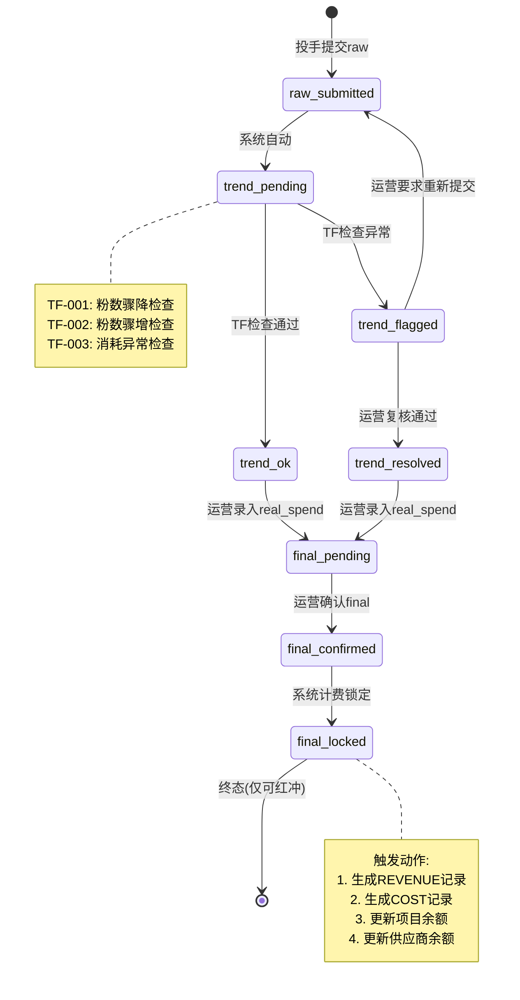
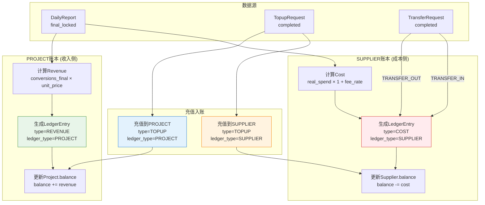
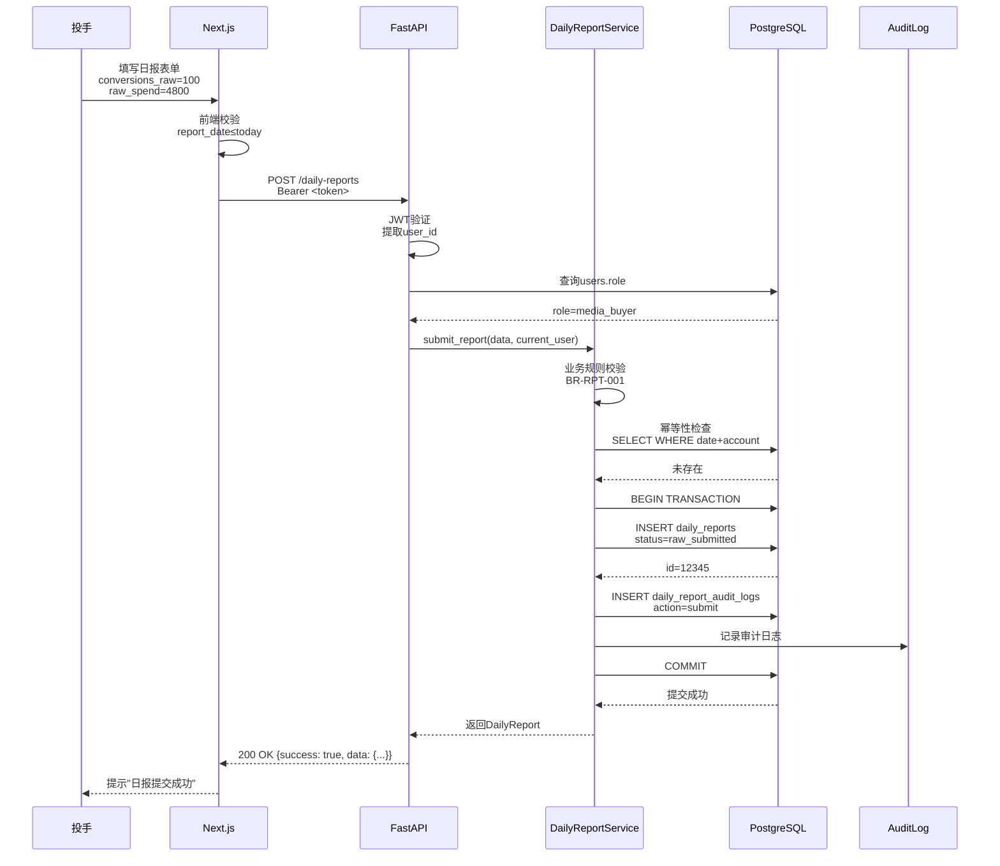
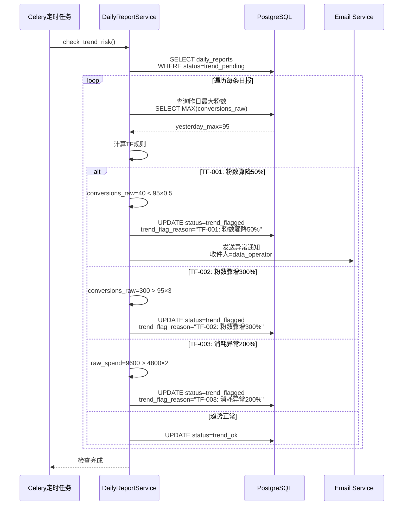
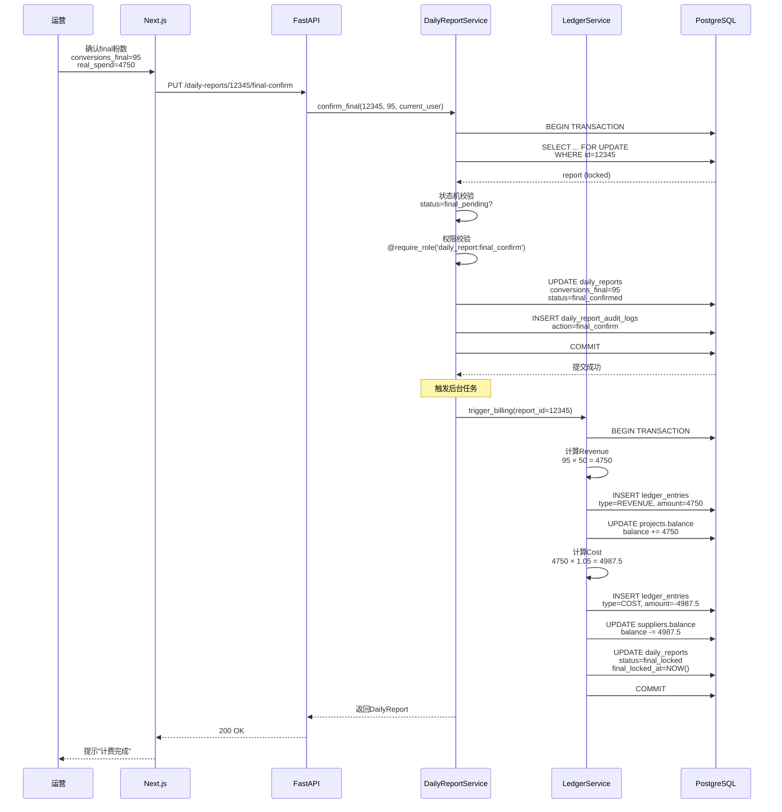
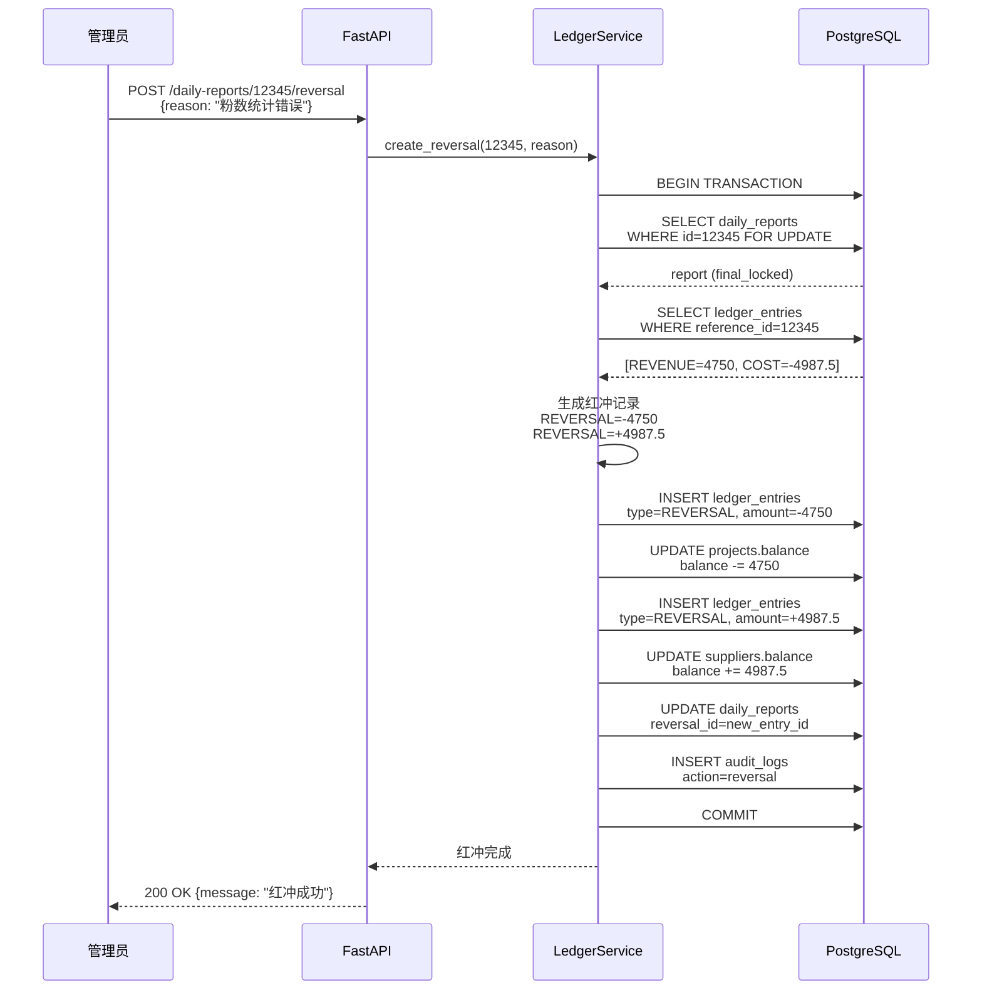
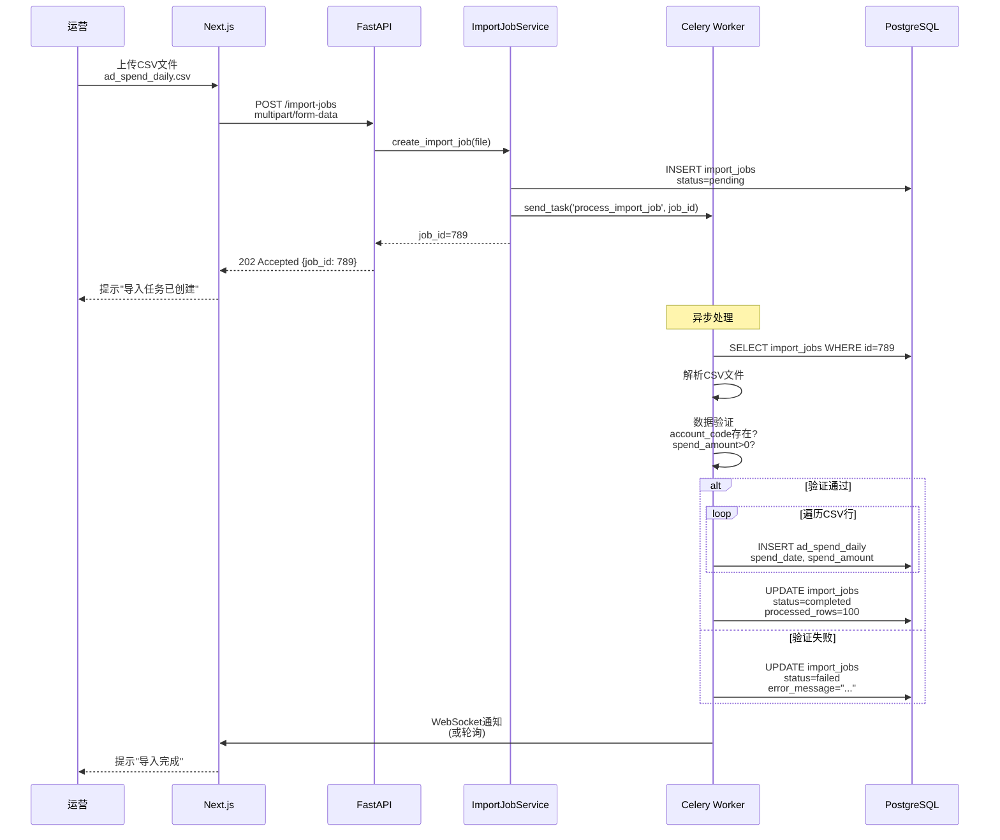
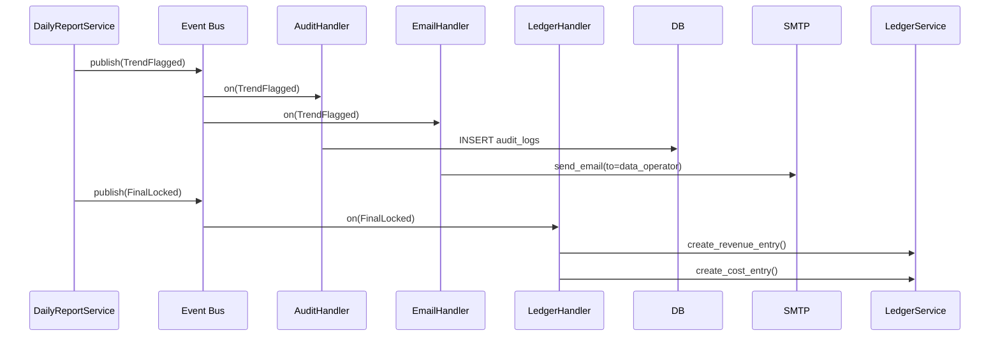

# Data Flow View (数据流视图)

## 1. Overview

### 1.1 Purpose of Data Flow View

数据流视图 (Data Flow View) 展示系统中数据的流转路径和变换过程，帮助理解:

- **How Data Flows**: 数据如何在系统中流动 (Input → Processing → Output)
- **What Transforms**: 数据在流转过程中如何变换 (raw → real → final)
- **When State Changes**: 状态机如何驱动数据流转 (8状态流转)
- **Who Triggers**: 谁触发数据流转 (角色权限)

### 1.2 Relationship to Other Views

**与其他视图的关系**:
- **SYSTEM_CONTEXT_VIEW.md**: 定义外部数据源 (Meta Ads API)
- **BOUNDED_CONTEXT_MAP.md**: 定义业务域边界
- **SERVICE_COMPONENT_VIEW.md**: 定义组件交互
- **DATA_FLOW_VIEW.md** (本文档): 定义数据流转逻辑

### 1.3 Baseline References

**引用**:
- **MASTER.md v4.4 §1.3**: 双账本架构、三数据流分离、8状态机流转
- **STATE_MACHINE.md v2.7 §8**: 粉数确认状态机
- **LEDGER_SOT.md v1.2**: 双账本流转规则
- **BUSINESS_RULES.md v4.1**: 业务规则编号

## 2. Core Data Flows (核心数据流)

### 2.1 Triple-Stream Data Flow (三数据流)

**引用**: MASTER.md v4.4 §INV-002

```mermaid
graph LR
    subgraph "T+0日 23:59前 - 投手提交"
        A1[投手提交<br/>conversions_raw<br/>raw_spend]
        A2[系统自动<br/>status=raw_submitted]
    end

    subgraph "T+0日 23:59后 - 趋势风控"
        B1[系统自动<br/>TF-001/002/003检查]
        B2{风控结果}
        B3[trend_ok<br/>趋势正常]
        B4[trend_flagged<br/>趋势异常]
    end

    subgraph "T+1日 12:00前 - 运营录入"
        C1[运营录入<br/>real_spend]
        C2[系统自动<br/>status=final_pending]
    end

    subgraph "T+1日 14:00前 - 运营确认"
        D1[运营确认<br/>conversions_final]
        D2[系统自动<br/>status=final_confirmed]
    end

    subgraph "T+1日 14:00后 - 计费锁定"
        E1[系统自动<br/>status=final_locked]
        E2[生成Ledger Entry<br/>REVENUE + COST]
        E3[更新Project Balance<br/>更新Supplier Balance]
    end

    A1 --> A2
    A2 --> B1
    B1 --> B2
    B2 -->|通过| B3
    B2 -->|异常| B4
    B4 -->|运营复核| trend_resolved
    B3 --> C1
    trend_resolved --> C1
    C1 --> C2
    C2 --> D1
    D1 --> D2
    D2 --> E1
    E1 --> E2
    E2 --> E3

    style A1 fill:#e3f2fd,stroke:#1976d2
    style C1 fill:#fff3e0,stroke:#f57c00
    style D1 fill:#e8f5e9,stroke:#388e3c
    style E1 fill:#ffebee,stroke:#d32f2f
```



**数据流说明**:

| 数据流 | 字段 | 录入者 | 时效性 | 用途 | 计费/成本 |
|--------|------|--------|--------|------|----------|
| **Raw** | conversions_raw, raw_spend | media_buyer | T+0 23:59前 | 趋势风控 | 永不参与 |
| **Real** | real_spend | data_operator | T+1 12:00前 | 成本核算 | 仅计成本 |
| **Final** | conversions_final | data_operator | T+1 14:00前 | 计费 | 仅计收入 |

**业务规则引用**:
- **BR-RPT-001**: 日报提交约束
- **BR-RPT-005**: 粉数确认流程规则

### 2.2 8-State State Machine Flow (8状态机流转)

**引用**: STATE_MACHINE.md v2.7 §8



**状态详解**:

| 状态 | 说明 | 触发者 | 可修改字段 | 前置条件 |
|------|------|--------|-----------|----------|
| raw_submitted | 投手提交原始粉数 | media_buyer | conversions_raw, raw_spend | - |
| trend_pending | 等待趋势风控检查 | system | - | raw_submitted完成 |
| trend_ok | 趋势正常 | system | - | TF规则通过 |
| trend_flagged | 趋势异常需人工复核 | system | trend_flag_reason | TF规则触发 |
| trend_resolved | 运营确认异常已解决 | data_operator | trend_resolution_note | 运营复核 |
| final_pending | 等待最终粉数确认 | data_operator | conversions_final, real_spend | trend_ok或trend_resolved |
| final_confirmed | 最终粉数已确认 | data_operator | - | final数据填充 |
| final_locked | 已进入计费锁定 | system | - (仅可红冲) | 计费完成 |

### 2.3 Dual-Ledger Flow (双账本流转)

**引用**: LEDGER_SOT.md v1.2, MASTER.md v4.4 §INV-001



**双账本隔离规则**:

| 账本类型 | 允许的entry_type | 禁止的entry_type | 关联字段 |
|---------|-----------------|-----------------|---------|
| PROJECT | REVENUE, TOPUP, REVERSAL | COST, TRANSFER_OUT, TRANSFER_IN | project_id (必填) |
| SUPPLIER | COST, TOPUP, TRANSFER_OUT, TRANSFER_IN, REVERSAL | REVENUE | supplier_id (必填) |

**业务规则引用**:
- **BR-FIN-005**: Ledger双写一致性
- **BR-FIN-003**: 金额字段合规性约束

## 3. Detailed Data Flows (详细数据流)

### 3.1 Daily Report Submission Flow (日报提交流程)



**数据变换**:
```
Input:
{
  "report_date": "2025-01-20",
  "ad_account_id": 456,
  "conversions_raw": 100,
  "raw_spend": 4800.00
}

↓ Service Layer Processing

Database Record:
{
  "id": 12345,
  "report_date": "2025-01-20",
  "ad_account_id": 456,
  "conversions_raw": 100,
  "raw_spend": 4800.00,
  "conversions_final": 0,
  "real_spend": 0.00,
  "status": "raw_submitted",
  "submitted_by": "550e8400-e29b-41d4-a716-446655440000",
  "submitted_at": "2025-01-20T23:45:00Z",
  "created_at": "2025-01-20T23:45:00Z"
}

↓ Audit Log

AuditLog Record:
{
  "module": "daily_report",
  "action": "submit",
  "entity_id": "12345",
  "performed_by": "550e8400-e29b-41d4-a716-446655440000",
  "role": "media_buyer",
  "payload_after": {...}
}
```

### 3.2 Trend Risk Control Flow (趋势风控流程)



**TF规则详解** (引用 STATE_MACHINE.md v2.7 §8.3):

| 规则编号 | 规则名称 | 判断逻辑 | 触发后果 |
|---------|---------|---------|---------|
| TF-001 | 粉数骤降检查 | conversions_raw < 昨日最大值 × 0.5 | status=trend_flagged |
| TF-002 | 粉数骤增检查 | conversions_raw > 昨日最大值 × 3 | status=trend_flagged |
| TF-003 | 消耗异常检查 | raw_spend > 昨日 × 2 | status=trend_flagged |

### 3.3 Final Confirmation Flow (最终确认流程)



**数据变换**:
```
Input (Final Confirmation):
{
  "conversions_final": 95,
  "real_spend": 4750.00
}

↓ Service Layer Processing

Daily Report Update:
{
  "id": 12345,
  "conversions_final": 95,
  "real_spend": 4750.00,
  "status": "final_confirmed",
  "updated_by": "operator-uuid"
}

↓ Trigger Billing

PROJECT Ledger Entry:
{
  "ledger_type": "PROJECT",
  "entry_type": "REVENUE",
  "project_id": 123,
  "amount": 4750.00,  // 95 × 50
  "reference_id": 12345,  // daily_report_id
  "occurred_at": "2025-01-21T14:00:00Z"
}

Project Balance Update:
{
  "id": 123,
  "balance": 10000.00 + 4750.00 = 14750.00
}

SUPPLIER Ledger Entry:
{
  "ledger_type": "SUPPLIER",
  "entry_type": "COST",
  "supplier_id": "uuid-456",
  "amount": -4987.50,  // 4750 × 1.05
  "reference_id": 12345,
  "occurred_at": "2025-01-21T14:00:00Z"
}

Supplier Balance Update:
{
  "id": "uuid-456",
  "balance": 50000.00 - 4987.50 = 45012.50
}

Final Status:
{
  "status": "final_locked",
  "final_locked_at": "2025-01-21T14:00:00Z"
}
```

### 3.4 Reversal Flow (红冲流程)

**引用**: STATE_MACHINE.md v2.7 §8.8



**红冲规则**:
- ✅ REVENUE红冲: amount = -原revenue (负值，减少余额)
- ✅ COST红冲: amount = +原cost (正值，抵消原负值)
- ✅ 数学验证: 原REVENUE + REVERSAL = 0, 原COST + REVERSAL = 0
- ❌ 禁止对REVERSAL记录再次执行REVERSAL
- ❌ 禁止删除REVERSAL记录

### 3.5 Import Job Flow (数据导入流程)



**CSV格式示例**:
```csv
ad_account_code,spend_date,spend_amount,currency
ACC-001,2025-01-20,4800.00,CNY
ACC-002,2025-01-20,3200.00,CNY
```

**数据变换**:
```
CSV Row:
ad_account_code=ACC-001, spend_date=2025-01-20, spend_amount=4800.00

↓ Validation & Transformation

ad_spend_daily Record:
{
  "id": "uuid-generated",
  "source_platform": "Meta",
  "ad_account_code": "ACC-001",
  "spend_date": "2025-01-20",
  "spend_amount": 4800.00,
  "currency": "CNY",
  "imported_by": "operator-uuid",
  "imported_at": "2025-01-21T10:00:00Z"
}
```

## 4. Event-Driven Flows (事件驱动流 - 规划中)

### 4.1 Event Types

**领域事件**:
- `DailyReportSubmitted`: 日报提交
- `TrendFlagged`: 趋势异常
- `FinalConfirmed`: final确认
- `FinalLocked`: 计费锁定
- `LedgerEntryCreated`: 账本记录创建
- `BalanceUpdated`: 余额更新

### 4.2 Event Flow Example



## 5. Data Consistency Patterns (数据一致性模式)

### 5.1 Transaction Boundary

**强一致性场景** (ACID事务):
- Daily Report + Audit Log (同一事务)
- Ledger Entry + Balance Update (同一事务)
- Topup Request + Ledger Entry (同一事务)

**示例代码**:
```python
with db.begin():
    # 1. 更新日报状态
    report.status = "final_confirmed"
    db.flush()

    # 2. 生成审计日志
    audit_log = DailyReportAuditLog(...)
    db.add(audit_log)

    # 3. 事务提交 (两者同时成功或同时失败)
    db.commit()
```

### 5.2 Eventual Consistency

**最终一致性场景** (异步任务):
- Email通知 (允许延迟)
- CSV导入 (批量处理)
- 报表生成 (后台任务)

### 5.3 Idempotency

**幂等性保护**:
- Daily Report: UNIQUE(report_date, ad_account_id)
- Topup Request: request_no (UNIQUE)
- Import Job: file_hash (防止重复导入)

## 6. API Call Chain (API调用链)

### 6.1 Daily Report Submit Chain

```
Client Request:
POST /api/v1/daily-reports

↓ FastAPI Router Layer
routers/daily_reports.py::submit_daily_report()
  - JWT验证: get_current_user()
  - Pydantic校验: DailyReportCreate

↓ Service Layer
services/daily_report_service.py::submit_report()
  - 权限校验: @require_role('daily_report:submit')
  - 业务规则: BR-RPT-001
  - 幂等性检查: UNIQUE(date, account)
  - 状态机: status=raw_submitted

↓ Database Layer
models/daily_report.py::DailyReport
  - INSERT daily_reports
  - INSERT daily_report_audit_logs

↓ Response
Response(success=True, data={...})
```

### 6.2 Ledger Creation Chain

```
Trigger:
DailyReport.status → final_locked

↓ Event Handler (或直接调用)
services/ledger_service.py::create_billing_entries()

↓ Calculate Revenue
revenue = report.conversions_final × project.unit_price

↓ Create PROJECT Ledger Entry
INSERT ledger_entries
  ledger_type=PROJECT
  entry_type=REVENUE
  amount=+revenue

↓ Update Project Balance
UPDATE projects SET balance = balance + revenue

↓ Calculate Cost
cost = report.real_spend × (1 + supplier.fee_rate)

↓ Create SUPPLIER Ledger Entry
INSERT ledger_entries
  ledger_type=SUPPLIER
  entry_type=COST
  amount=-cost

↓ Update Supplier Balance
UPDATE suppliers SET balance = balance - cost

↓ Lock Daily Report
UPDATE daily_reports SET status=final_locked
```

## 7. Traceability (可追溯性)

### 7.1 References to MASTER.md v4.4

- **§1.3 解决方案**: 三数据流分离 → §2.1 Triple-Stream Data Flow
- **§1.3 解决方案**: 8状态机流转 → §2.2 8-State State Machine Flow
- **§1.3 解决方案**: 双账本架构 → §2.3 Dual-Ledger Flow
- **§1.3 解决方案**: 审计不可逆 → §3.4 Reversal Flow

### 7.2 References to STATE_MACHINE.md v2.7

- **§8**: 粉数确认状态机 → §2.2 8-State State Machine Flow
- **§8.3**: 趋势风控规则 → §3.2 Trend Risk Control Flow
- **§8.8**: 红冲修正机制 → §3.4 Reversal Flow

### 7.3 References to LEDGER_SOT.md v1.2

- **§2**: 双账本模型总览 → §2.3 Dual-Ledger Flow
- **§7**: DailyReport→Ledger映射 → §3.3 Final Confirmation Flow
- **§12**: 红冲机制 → §3.4 Reversal Flow

### 7.4 References to BUSINESS_RULES.md v4.1

- **BR-RPT-001**: 日报提交约束 → §3.1 Daily Report Submission Flow
- **BR-RPT-005**: 粉数确认流程规则 → §2.1 Triple-Stream Data Flow
- **BR-FIN-005**: Ledger双写一致性 → §5.1 Transaction Boundary

---

**文档状态**: ✅ Draft完成，等待审计
**维护责任**: Architecture Team + Backend Team
**下次审查**: 每季度或数据流重大变更时
