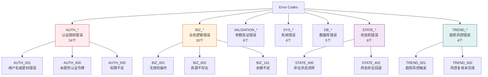
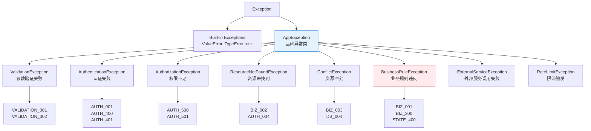

# Error Handling Strategy (错误处理策略)

## 1. Overview

### 1.1 Purpose of Error Handling Strategy

错误处理策略 (Error Handling Strategy) 定义系统如何识别、处理、响应和恢复错误，确保:

- **Consistent Error Response**: 统一的错误响应格式 (Envelope)
- **Meaningful Error Codes**: 语义化的错误码体系 (ERROR_CODES_SOT v2.1)
- **Graceful Degradation**: 优雅降级与错误恢复
- **User-Friendly Messages**: 面向用户的友好错误提示

### 1.2 Baseline References

**引用**:
- **ERROR_CODES_SOT.md v2.1**: 错误码定义
- **API_SOT.md v9.3**: API响应规范
- **BUSINESS_RULES.md v4.1**: 业务规则校验
- **STATE_MACHINE.md v2.7**: 状态机错误

## 2. Error Classification (错误分类)

### 2.1 Error Code Taxonomy

**引用**: ERROR_CODES_SOT.md v2.1 §2



### 2.2 Error Severity Levels

| 级别 | 说明 | HTTP状态码 | 处理策略 | 示例错误码 |
|------|------|-----------|---------|-----------|
| **Critical** | 系统级严重错误 | 500, 503 | 立即告警、人工介入 | SYS_001, DB_001 |
| **High** | 业务阻塞性错误 | 400, 403, 409 | 前端提示、用户修正 | BIZ_101, STATE_400 |
| **Medium** | 可恢复的业务错误 | 400, 404 | 前端提示、重试 | BIZ_002, VALIDATION_001 |
| **Low** | 预期内的业务场景 | 200 | 正常返回、前端处理 | TREND_001 (趋势风控) |

## 3. Error Response Format (错误响应格式)

### 3.1 Global Envelope Structure

**引用**: ERROR_CODES_SOT.md v2.1 §1.3

**标准错误响应**:
```json
{
  "success": false,
  "message": "错误描述信息",
  "code": "ERROR_CODE",
  "data": null,
  "request_id": "550e8400-e29b-41d4-a716-446655440000",
  "timestamp": "2025-01-20T10:30:00Z"
}
```

**字段说明**:
| 字段 | 类型 | 必填 | 说明 |
|------|------|------|------|
| success | boolean | ✅ | 固定为 false |
| message | string | ✅ | 面向开发者的中文错误描述 |
| code | string | ✅ | 错误码 (如 AUTH_001, BIZ_002) |
| data | object/null | ✅ | 错误详情 (通常为 null，特殊场景可携带额外信息) |
| request_id | string (UUID) | ✅ | 请求追踪ID，用于日志关联 |
| timestamp | string (ISO8601) | ✅ | UTC时间戳 |

### 3.2 Error Response Examples

#### 3.2.1 Authentication Error (认证错误)

**场景**: 用户未登录访问受保护接口

```json
{
  "success": false,
  "message": "未提供认证令牌",
  "code": "AUTH_400",
  "data": null,
  "request_id": "a1b2c3d4-e5f6-7890-abcd-ef1234567890",
  "timestamp": "2025-01-20T10:30:00Z"
}
```

**HTTP状态码**: 401 Unauthorized

#### 3.2.2 Business Rule Error (业务规则错误)

**场景**: 余额不足

```json
{
  "success": false,
  "message": "余额不足：当前余额500.00，需要扣减800.00",
  "code": "BIZ_101",
  "data": {
    "current_balance": 500.00,
    "required_amount": 800.00,
    "shortfall": 300.00
  },
  "request_id": "b2c3d4e5-f6a7-8901-bcde-f12345678901",
  "timestamp": "2025-01-20T10:35:00Z"
}
```

**HTTP状态码**: 400 Bad Request

#### 3.2.3 State Machine Error (状态机错误)

**场景**: 非法状态流转

```json
{
  "success": false,
  "message": "非法状态流转：final_locked → final_pending",
  "code": "STATE_400",
  "data": {
    "current_status": "final_locked",
    "target_status": "final_pending",
    "allowed_transitions": []
  },
  "request_id": "c3d4e5f6-a7b8-9012-cdef-123456789012",
  "timestamp": "2025-01-20T10:40:00Z"
}
```

**HTTP状态码**: 400 Bad Request

#### 3.2.4 Trend Risk Control Warning (趋势风控警告)

**场景**: 粉数骤降触发风控

**注意**: 这是业务逻辑的正常返回 (200 OK)，而非错误

```json
{
  "success": true,
  "message": "粉数骤降，已标记trend_flagged",
  "code": "TREND_001",
  "data": {
    "status": "trend_flagged",
    "reason": "TF-001: 粉数骤降50%",
    "conversions_raw": 40,
    "yesterday_max": 95,
    "threshold": 47.5
  },
  "request_id": "d4e5f6a7-b8c9-0123-def1-234567890123",
  "timestamp": "2025-01-20T23:59:30Z"
}
```

**HTTP状态码**: 200 OK (业务逻辑成功，但需要人工复核)

#### 3.2.5 Validation Error (参数验证错误)

**场景**: 必填字段缺失

```json
{
  "success": false,
  "message": "必填字段缺失",
  "code": "VALIDATION_001",
  "data": {
    "field": "conversions_raw",
    "error": "Field required"
  },
  "request_id": "e5f6a7b8-c9d0-1234-ef12-345678901234",
  "timestamp": "2025-01-20T11:00:00Z"
}
```

**HTTP状态码**: 400 Bad Request

### 3.3 Error Response Implementation

**Backend实现** (backend/core/response.py):
```python
from datetime import datetime, timezone
from uuid import uuid4
from typing import Optional, Any

def error_response(
    code: str,
    message: str,
    status_code: int = 400,
    data: Optional[Any] = None,
    request_id: Optional[str] = None
) -> dict:
    """
    生成标准错误响应

    Args:
        code: 错误码 (如 AUTH_001, BIZ_002)
        message: 错误描述
        status_code: HTTP状态码
        data: 错误详情 (可选)
        request_id: 请求ID (可选, 自动生成)

    Returns:
        dict: 标准错误响应
    """
    return {
        "success": False,
        "message": message,
        "code": code,
        "data": data,
        "request_id": request_id or str(uuid4()),
        "timestamp": datetime.now(timezone.utc).isoformat()
    }
```

**Frontend实现** (frontend/lib/api-client.ts):
```typescript
interface ErrorResponse {
  success: false;
  message: string;
  code: string;
  data: any;
  request_id: string;
  timestamp: string;
}

function handleApiError(error: ErrorResponse) {
  // 1. 根据错误码显示不同提示
  const errorMessages: Record<string, string> = {
    'AUTH_400': '请先登录',
    'AUTH_500': '权限不足',
    'BIZ_101': '余额不足，请充值',
    'STATE_400': '当前状态不允许此操作',
  };

  const userMessage = errorMessages[error.code] || error.message;

  // 2. 使用Toast组件显示错误
  toast.error(userMessage, {
    description: `错误码: ${error.code}`,
  });

  // 3. 记录到前端日志
  console.error('[API Error]', {
    code: error.code,
    message: error.message,
    request_id: error.request_id,
  });

  // 4. 特殊错误码处理
  if (error.code === 'AUTH_401' || error.code === 'AUTH_402') {
    // Token过期，跳转登录
    window.location.href = '/login';
  }
}
```

## 4. Exception Handling Patterns (异常处理模式)

### 4.1 Backend Exception Hierarchy

**引用**: ERROR_CODES_SOT.md v2.1 §5



### 4.2 Exception Usage Best Practices

#### 4.2.1 ✅ Recommended: Specific Error Codes

**场景**: 业务规则验证失败

```python
from backend.exceptions import BusinessRuleException
from backend.core.error_codes import BusinessErrorCodes, StateErrorCodes

# ✅ 推荐: 明确指定错误码
if report.status != "final_pending":
    raise BusinessRuleException(
        message=f"当前状态{report.status}不允许确认final",
        code=StateErrorCodes.FORBIDDEN_TRANSITION.code  # STATE_400
    )

# ✅ 推荐: 携带业务详情
if project.balance < required_amount:
    raise BusinessRuleException(
        message=f"余额不足：当前余额{project.balance}，需要扣减{required_amount}",
        code=BusinessErrorCodes.INSUFFICIENT_BALANCE.code,  # BIZ_101
        data={
            "current_balance": float(project.balance),
            "required_amount": float(required_amount),
            "shortfall": float(required_amount - project.balance)
        }
    )
```

#### 4.2.2 ❌ Not Recommended: Generic Error Codes

```python
# ❌ 不推荐: 使用通用错误码 (语义不精确)
if not project:
    raise ResourceNotFoundException(f"项目 {project_id} 不存在")
    # 返回: code="RESOURCE_NOT_FOUND" (通用错误码，无法追溯业务场景)

# ✅ 正确做法: 使用具体错误码
if not project:
    raise ResourceNotFoundException(
        message=f"项目 {project_id} 不存在",
        code=BusinessErrorCodes.RESOURCE_NOT_FOUND.code  # BIZ_002
    )
```

### 4.3 Service Layer Exception Handling

**标准模式**:
```python
from backend.exceptions import BusinessRuleException, ResourceNotFoundException
from backend.core.error_codes import BusinessErrorCodes, StateErrorCodes
from sqlalchemy.orm import Session

class DailyReportService:
    def __init__(self, db: Session):
        self.db = db

    def confirm_final(
        self,
        report_id: int,
        conversions_final: int,
        current_user: User
    ) -> DailyReport:
        """确认final粉数 - 标准异常处理模式"""

        try:
            with self.db.begin():
                # 1. 资源查询
                report = self.db.query(DailyReport).filter(
                    DailyReport.id == report_id
                ).with_for_update().first()

                if not report:
                    raise ResourceNotFoundException(
                        message=f"日报 {report_id} 不存在",
                        code=BusinessErrorCodes.RESOURCE_NOT_FOUND.code  # BIZ_002
                    )

                # 2. 状态机校验
                if report.status != "final_pending":
                    raise BusinessRuleException(
                        message=f"当前状态{report.status}不允许确认final",
                        code=StateErrorCodes.FORBIDDEN_TRANSITION.code,  # STATE_400
                        data={
                            "current_status": report.status,
                            "allowed_from": "final_pending"
                        }
                    )

                # 3. 业务规则校验
                if conversions_final < 0:
                    raise BusinessRuleException(
                        message="粉数不能为负数",
                        code=BusinessErrorCodes.INVALID_OPERATION.code  # BIZ_001
                    )

                # 4. 执行业务逻辑
                report.conversions_final = conversions_final
                report.status = "final_confirmed"
                report.updated_by = current_user.id

                # 5. 审计日志
                audit_log = DailyReportAuditLog(...)
                self.db.add(audit_log)
                self.db.commit()

            return report

        except (ResourceNotFoundException, BusinessRuleException):
            # 业务异常直接抛出，由Router层处理
            raise

        except Exception as e:
            # 未预期的系统异常
            logger.error(f"Unexpected error in confirm_final: {e}", exc_info=True)
            raise BusinessRuleException(
                message="系统内部错误",
                code="SYS_001"
            ) from e
```

### 4.4 Router Layer Exception Handling

```python
from fastapi import APIRouter, Depends, HTTPException
from backend.core.response import success_response, error_response
from backend.exceptions import (
    BusinessRuleException,
    ResourceNotFoundException,
    AuthenticationException,
    AuthorizationException
)

router = APIRouter()

@router.put("/daily-reports/{report_id}/final-confirm")
async def confirm_final(
    report_id: int,
    data: FinalConfirmRequest,
    current_user: User = Depends(get_current_user),
    service: DailyReportService = Depends()
):
    """确认final粉数 - Router层异常处理"""

    try:
        report = service.confirm_final(
            report_id,
            data.conversions_final,
            current_user
        )
        return success_response(data=report)

    except ResourceNotFoundException as e:
        # 资源不存在
        return error_response(
            code=e.code,
            message=e.message,
            status_code=404
        )

    except BusinessRuleException as e:
        # 业务规则违反
        return error_response(
            code=e.code,
            message=e.message,
            data=e.data,
            status_code=400
        )

    except AuthenticationException as e:
        # 认证失败
        return error_response(
            code=e.code,
            message=e.message,
            status_code=401
        )

    except AuthorizationException as e:
        # 权限不足
        return error_response(
            code=e.code,
            message=e.message,
            status_code=403
        )

    except Exception as e:
        # 未预期的系统异常
        logger.error(f"Unexpected error: {e}", exc_info=True)
        return error_response(
            code="SYS_001",
            message="系统内部错误",
            status_code=500
        )
```

## 5. Error Recovery Strategies (错误恢复策略)

### 5.1 Retry Pattern (重试模式)

**适用场景**:
- 外部API调用失败 (Meta Ads API)
- 数据库连接超时
- Redis缓存连接失败

**实现示例**:
```python
import time
from functools import wraps

def retry(max_attempts: int = 3, delay: float = 1.0, backoff: float = 2.0):
    """
    重试装饰器

    Args:
        max_attempts: 最大重试次数
        delay: 初始延迟 (秒)
        backoff: 指数退避因子
    """
    def decorator(func):
        @wraps(func)
        def wrapper(*args, **kwargs):
            attempt = 0
            current_delay = delay

            while attempt < max_attempts:
                try:
                    return func(*args, **kwargs)
                except ExternalServiceException as e:
                    attempt += 1
                    if attempt >= max_attempts:
                        raise

                    logger.warning(
                        f"Retry {attempt}/{max_attempts} after {current_delay}s: {e}"
                    )
                    time.sleep(current_delay)
                    current_delay *= backoff

            raise ExternalServiceException("Max retry attempts exceeded")

        return wrapper
    return decorator

# 使用示例
@retry(max_attempts=3, delay=1.0, backoff=2.0)
def fetch_meta_ads_data(account_id: str):
    """拉取Meta Ads数据 (支持重试)"""
    response = requests.get(f"https://graph.facebook.com/{account_id}/insights")
    response.raise_for_status()
    return response.json()
```

### 5.2 Circuit Breaker Pattern (熔断模式 - 规划中)

**适用场景**:
- Meta Ads API长时间不可用
- Email Service持续失败

**状态机**:
```
Closed (正常) → Open (熔断) → Half-Open (试探) → Closed (恢复)
```

**实现示例**:
```python
class CircuitBreaker:
    def __init__(self, failure_threshold: int = 5, timeout: int = 60):
        self.failure_threshold = failure_threshold
        self.timeout = timeout
        self.failure_count = 0
        self.last_failure_time = None
        self.state = "closed"  # closed, open, half-open

    def call(self, func, *args, **kwargs):
        if self.state == "open":
            if time.time() - self.last_failure_time > self.timeout:
                self.state = "half-open"
            else:
                raise CircuitBreakerOpenException("Service unavailable")

        try:
            result = func(*args, **kwargs)
            if self.state == "half-open":
                self.state = "closed"
                self.failure_count = 0
            return result

        except Exception as e:
            self.failure_count += 1
            self.last_failure_time = time.time()

            if self.failure_count >= self.failure_threshold:
                self.state = "open"

            raise
```

### 5.3 Fallback Pattern (降级模式)

**适用场景**:
- TanStack Query缓存命中失败 → 显示旧数据
- Email发送失败 → 记录到队列稍后重试

**实现示例**:
```python
def send_email_with_fallback(to: str, subject: str, body: str):
    """发送邮件 (支持降级)"""
    try:
        # 主要邮件服务
        smtp_client.send_email(to, subject, body)
    except EmailServiceException as e:
        logger.warning(f"Primary email service failed: {e}")

        try:
            # 降级: 使用备用邮件服务
            backup_smtp_client.send_email(to, subject, body)
        except Exception as e2:
            logger.error(f"Backup email service also failed: {e2}")

            # 最终降级: 记录到队列稍后重试
            email_queue.enqueue({
                "to": to,
                "subject": subject,
                "body": body,
                "retry_at": datetime.now(timezone.utc) + timedelta(minutes=10)
            })
```

## 6. Frontend Error Handling (前端错误处理)

### 6.1 TanStack Query Error Handling

```typescript
// frontend/lib/query-hooks.ts
import { useMutation, useQuery } from '@tanstack/react-query';
import { toast } from 'sonner';

function useDailyReports(accountId: number) {
  return useQuery({
    queryKey: ['daily-reports', accountId],
    queryFn: () => fetchDailyReports(accountId),
    retry: 3,  // 自动重试3次
    retryDelay: (attemptIndex) => Math.min(1000 * 2 ** attemptIndex, 30000),  // 指数退避
    onError: (error: ApiError) => {
      // 错误码处理
      if (error.code === 'AUTH_401' || error.code === 'AUTH_402') {
        // Token过期，跳转登录
        window.location.href = '/login';
      } else {
        // 显示错误提示
        toast.error(error.message, {
          description: `错误码: ${error.code}`,
        });
      }
    },
  });
}

function useSubmitReport() {
  return useMutation({
    mutationFn: (data: DailyReportCreate) => submitDailyReport(data),
    onSuccess: () => {
      toast.success('日报提交成功');
    },
    onError: (error: ApiError) => {
      // 业务错误处理
      const errorMessages: Record<string, string> = {
        'BIZ_201': '日期不能为未来',
        'BIZ_003': '该账户当日日报已存在',
        'STATE_400': '当前状态不允许此操作',
      };

      const userMessage = errorMessages[error.code] || error.message;
      toast.error(userMessage);
    },
  });
}
```

### 6.2 Error Boundary Component

```tsx
// frontend/components/error-boundary.tsx
'use client';

import { Component, ReactNode } from 'react';

interface Props {
  children: ReactNode;
  fallback?: ReactNode;
}

interface State {
  hasError: boolean;
  error?: Error;
}

export class ErrorBoundary extends Component<Props, State> {
  constructor(props: Props) {
    super(props);
    this.state = { hasError: false };
  }

  static getDerivedStateFromError(error: Error): State {
    return { hasError: true, error };
  }

  componentDidCatch(error: Error, errorInfo: React.ErrorInfo) {
    // 记录错误到Sentry
    console.error('[ErrorBoundary]', error, errorInfo);
  }

  render() {
    if (this.state.hasError) {
      return this.props.fallback || (
        <div className="flex flex-col items-center justify-center min-h-screen">
          <h2 className="text-2xl font-bold">发生错误</h2>
          <p className="text-gray-600">{this.state.error?.message}</p>
          <button
            onClick={() => window.location.reload()}
            className="mt-4 px-4 py-2 bg-blue-500 text-white rounded"
          >
            刷新页面
          </button>
        </div>
      );
    }

    return this.props.children;
  }
}
```

### 6.3 User-Friendly Error Messages

**错误码到用户提示的映射**:
```typescript
// frontend/lib/error-messages.ts
export const ERROR_MESSAGES: Record<string, { title: string; description: string }> = {
  // 认证错误
  'AUTH_400': {
    title: '请先登录',
    description: '访问此页面需要登录',
  },
  'AUTH_401': {
    title: '登录已过期',
    description: '请重新登录',
  },
  'AUTH_500': {
    title: '权限不足',
    description: '您没有权限执行此操作',
  },

  // 业务错误
  'BIZ_101': {
    title: '余额不足',
    description: '请先充值后再进行此操作',
  },
  'BIZ_201': {
    title: '日期无效',
    description: '日期不能为未来',
  },
  'STATE_400': {
    title: '状态错误',
    description: '当前状态不允许此操作',
  },

  // 趋势风控
  'TREND_001': {
    title: '数据异常',
    description: '粉数波动异常，请联系运营复核',
  },
};
```

## 7. Monitoring and Alerting (监控与告警)

### 7.1 Error Metrics (错误指标)

**关键指标**:
- **Error Rate**: 错误率 (错误请求数 / 总请求数)
- **Error Count by Code**: 各错误码出现次数
- **P50/P95/P99 Error Response Time**: 错误响应时间
- **Critical Error Count**: 严重错误 (SYS_001, DB_001) 数量

**告警阈值**:
- Error Rate > 5%: P2告警
- Error Rate > 10%: P1告警
- Critical Error Count > 10 (1小时): P0告警

### 7.2 Error Logging

**Backend日志格式** (structlog):
```python
import structlog

logger = structlog.get_logger()

try:
    service.confirm_final(report_id, conversions_final, current_user)
except BusinessRuleException as e:
    logger.warning(
        "business_rule_violation",
        error_code=e.code,
        message=e.message,
        user_id=str(current_user.id),
        report_id=report_id,
        status=report.status,
    )
    raise
```

**日志输出示例**:
```json
{
  "event": "business_rule_violation",
  "error_code": "STATE_400",
  "message": "当前状态final_locked不允许确认final",
  "user_id": "550e8400-e29b-41d4-a716-446655440000",
  "report_id": 12345,
  "status": "final_locked",
  "timestamp": "2025-01-20T10:30:00Z",
  "level": "warning"
}
```

## 8. Traceability (可追溯性)

### 8.1 References to ERROR_CODES_SOT.md v2.1

- **§2 错误码命名规范**: 错误码前缀定义
- **§3 快速索引**: 常用18个错误码
- **§4 错误码完整清单**: 59个错误码详细定义
- **§5 自定义异常类与错误码映射**: 9个异常类

### 8.2 References to BUSINESS_RULES.md v4.1

- **BR-RPT-001**: 日报提交约束 → BIZ_201
- **BR-FIN-003**: 金额字段合规性约束 → VALIDATION_002
- **BR-AUTH-001**: 用户角色唯一性 → AUTH_500

### 8.3 References to STATE_MACHINE.md v2.7

- **§8 粉数确认状态机**: 状态流转规则 → STATE_400, STATE_402
- **§8.3 趋势风控规则**: TF-001/002/003 → TREND_001

---

**文档状态**: ✅ Draft完成，等待审计
**维护责任**: Architecture Team + Backend Team + Frontend Team
**下次审查**: 每季度或错误码体系重大变更时
