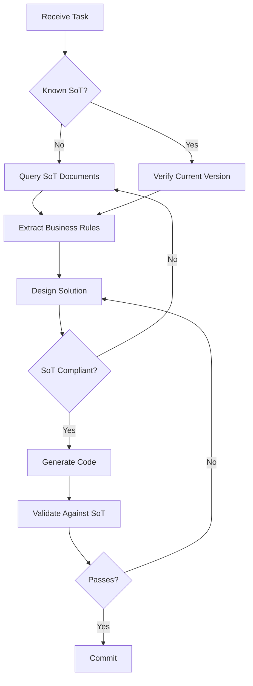
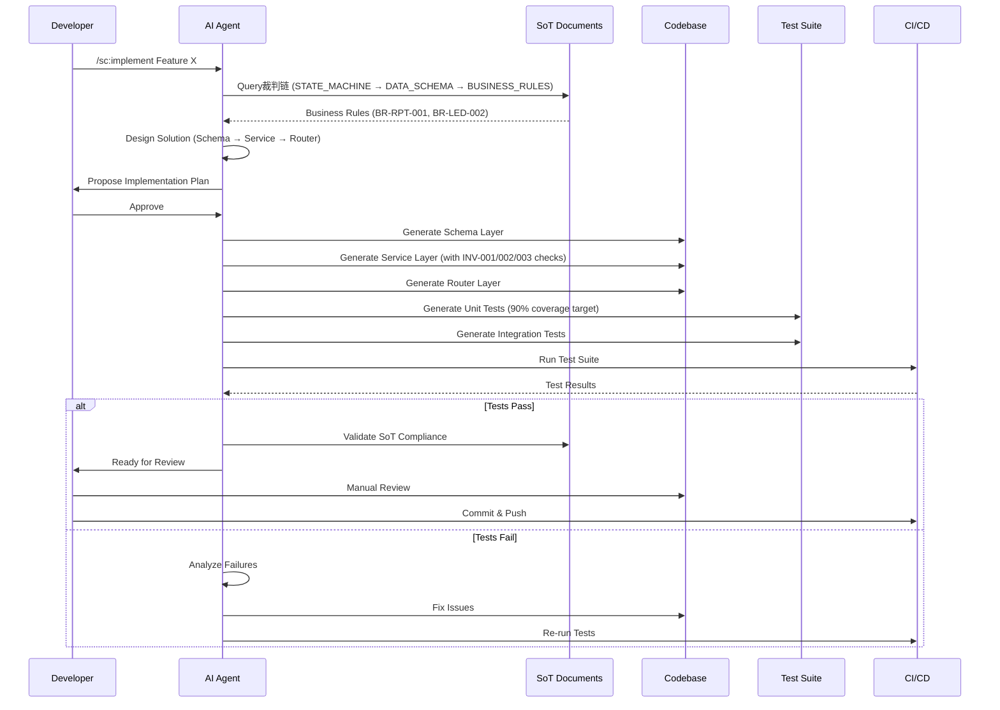
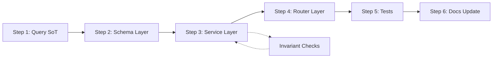
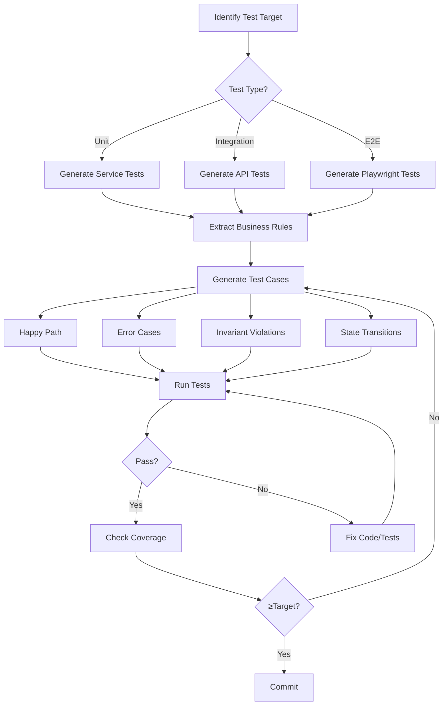
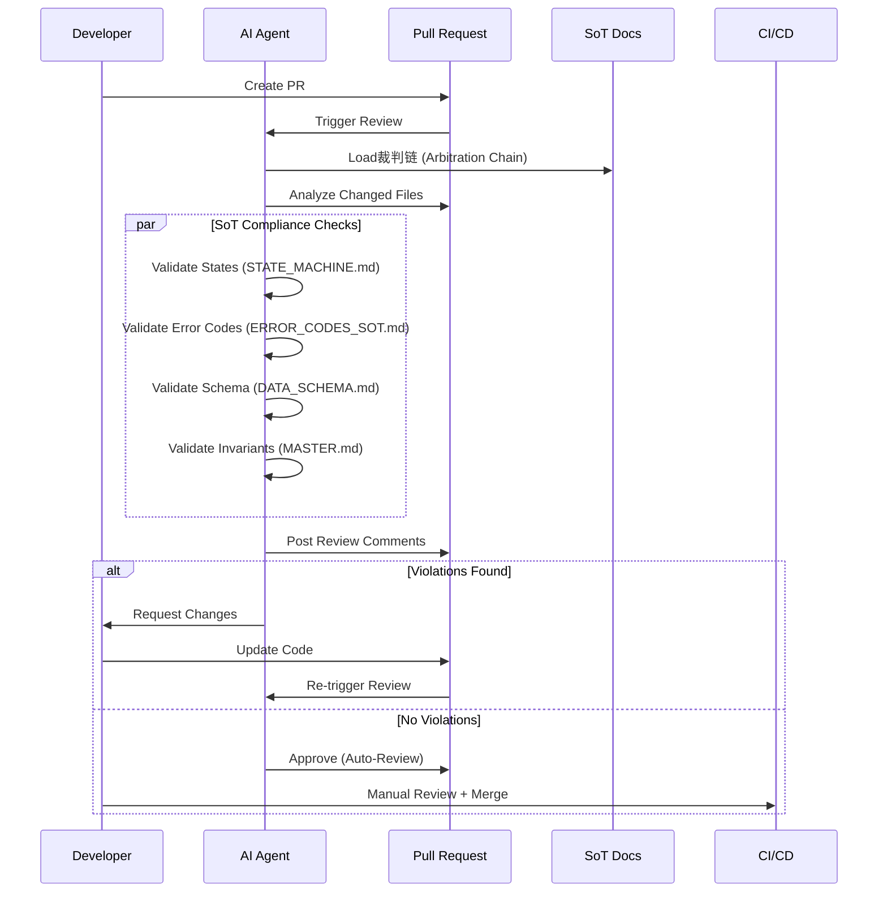
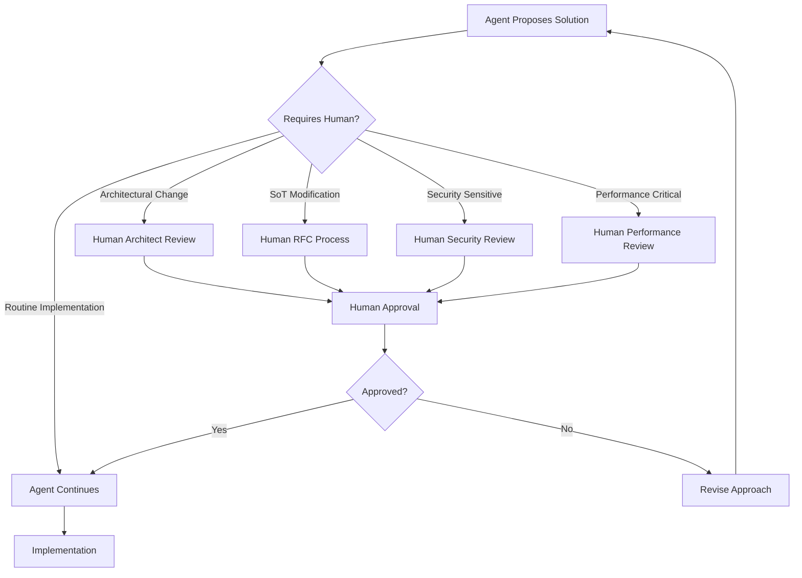
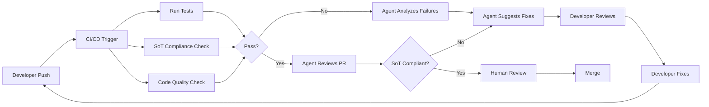

# AI Agent Workflow Guide

## 1. Purpose

Define comprehensive workflows and best practices for working with AI agents (SuperClaude, Claude Code) in the AI_ad_spend02 project. This guide ensures:

- **SoT-First Development**: All agent actions align with Single Source of Truth (SoT) documents
- **Consistency**: Standardized agent prompts and workflows across team
- **Quality**: Built-in checkpoints for SoT compliance and code quality
- **Efficiency**: Optimized agent usage patterns for common development tasks
- **Governance**: Clear boundaries for agent autonomy and human oversight

## 2. Scope

### In Scope
- Agent-driven development workflows (SuperClaude commands)
- SoT-first query and compliance patterns
- Code generation alignment with API_DEVELOPMENT_FLOW.md and FRONTEND_DEVELOPMENT_RULES.md
- Document generation and maintenance workflows
- Testing automation with agents
- Code review and refactoring patterns
- Common agent commands and prompts
- Quality checkpoints and validation
- CI/CD integration with agent workflows
- Human oversight and intervention points

### Out of Scope
- Agent installation and configuration (see tool-specific documentation)
- Low-level agent architecture (internal MCP server details)
- Non-development agent usage (project management, communication)
- Custom agent development or modification

## 3. Core Principles

### 3.1 SoT-First Mindset

**Principle**: Query SoT before coding, not after



**Key Actions**:
1. Identify affected domain (daily reports, topups, reconciliation)
2. Query corresponding SoT document via裁判链 (Arbitration Chain)
3. Extract business rule numbers (BR-RPT-001, BR-LED-002, etc.)
4. Validate all decisions against extracted rules
5. Document SoT references in code comments

### 3.2 Agent as Executor, Not Inventor

**Principle**: Agents execute SoT rules; humans define rules

```
Agent Role: Implementation Assistant
✅ Generate code from SoT specifications
✅ Detect SoT violations in existing code
✅ Suggest refactors aligned with SoT
✅ Automate repetitive tasks

❌ Create new business rules
❌ Modify SoT documents without approval
❌ Bypass SoT constraints "for convenience"
❌ Make architectural decisions outside SoT
```

### 3.3 Incremental Validation

**Principle**: Validate early and often

- **Step 1 Validation**: SoT alignment check before coding
- **Step 2 Validation**: Schema compliance during implementation
- **Step 3 Validation**: Test coverage before commit
- **Step 4 Validation**: Integration tests in CI/CD

## 4. Agent-Driven Development Workflow

### 4.1 Complete Development Cycle

**Mermaid Workflow**:


### 4.2 SoT Query Workflow

**Step-by-Step Process**:

```markdown
## SoT Query Checklist

### Step 1: Identify Domain
- [ ] Domain: __________ (daily_reports / topups / reconciliation / transfers)
- [ ] Related Tables: __________
- [ ] State Machine: __________ (if applicable)

### Step 2: Query裁判链 (Arbitration Chain)
Priority Order (from CLAUDE.md and PROJECT_RULES.md v3.1):
1. STATE_MACHINE.md v2.6 → Status definitions, valid transitions
2. DATA_SCHEMA.md v5.2 → Table schemas, field types
3. BUSINESS_RULES.md v4.1 → Validation rules (BR-XXX-001)
4. API_SOT.md v9.3 → Endpoint paths, request/response formats
5. ERROR_CODES_SOT.md v2.1 → Error codes (VAL-001, STATE-001)
6. AUTH_SPEC.md v2.0 → Permission requirements
7. LEDGER_SOT.md v1.1 → Accounting rules (if finance-related)

### Step 3: Extract Business Rules
- [ ] Rule IDs: __________
- [ ] Invariants: INV-001 / INV-002 / INV-003 (which apply?)
- [ ] State Constraints: __________
- [ ] Permission Requirements: __________

### Step 4: Validate Design
- [ ] Does design violate any extracted rules? ✅/❌
- [ ] Are all state transitions valid per STATE_MACHINE.md? ✅/❌
- [ ] Are error codes from ERROR_CODES_SOT.md? ✅/❌
- [ ] Is ledger system used for financial operations? ✅/❌
```

**Example Agent Prompt**:
```
Query SoT for implementing "Submit Daily Report" feature:

1. Check STATE_MACHINE.md v2.6 §8 for daily_reports.status transitions
2. Verify DATA_SCHEMA.md v5.2 §3.3.1 for DailyReport table fields
3. Extract BR-RPT-001 from BUSINESS_RULES.md v4.1 (submission validation)
4. Confirm API path from API_SOT.md v9.3 (POST /api/v1/daily-reports/{id}/submit)
5. Map error codes from ERROR_CODES_SOT.md v2.1 (VAL-001, STATE-001)
6. Check AUTH_SPEC.md v2.0 for daily_report:submit permission

Provide:
- Business rule summary
- Schema requirements
- Service layer implementation with INV-002 (terminal state) check
- Router with permission decorator
```

### 4.3 Code Generation Workflow

**Aligned with API_DEVELOPMENT_FLOW.md (6-Step Process)**:



**Agent Command Pattern**:
```bash
# Backend API Development
/sc:implement API endpoint for "Submit Daily Report"
  - SoT Reference: STATE_MACHINE.md v2.6 §8.2
  - Schema: DailyReport (DATA_SCHEMA.md v5.2 §3.3.1)
  - Rules: BR-RPT-001 (submission validation)
  - Include: INV-002 check (terminal state immutability)
  - Tests: Unit (Service) + Integration (API)

# Frontend Component Development
/sc:implement React component "DailyReportSubmitButton"
  - SoT Reference: STATE_MACHINE.md v2.6 (8-state lifecycle)
  - UI Rules: FRONTEND_DEVELOPMENT_RULES.md §4 (component structure)
  - State Management: Zustand (global) + React Query (server state)
  - Tests: Unit (component) + E2E (submit flow)
```

**Agent Output Validation**:
```markdown
## Code Review Checklist (Agent-Generated Code)

### SoT Compliance
- [ ] All status values from STATE_MACHINE.md v2.6
- [ ] All error codes from ERROR_CODES_SOT.md v2.1
- [ ] All field names from DATA_SCHEMA.md v5.2
- [ ] No custom states/errors/fields invented

### Invariant Enforcement
- [ ] INV-001: Ledger-only for balance changes (LEDGER_SOT.md v1.1)
- [ ] INV-002: Terminal state check in Service layer
- [ ] INV-003: State transition validation against STATE_MACHINE.md

### Code Quality
- [ ] Type hints (Python) or TypeScript types (Frontend)
- [ ] Docstrings with SoT references
- [ ] Error handling with standardized codes
- [ ] Logging for audit trail
```

## 5. Common Agent Commands

### 5.1 SuperClaude Command Reference

**Development Commands**:

| Command | Purpose | Key Flags | Example |
|---------|---------|-----------|---------|
| `/sc:implement` | Feature implementation | `--sot-ref`, `--include-tests` | `/sc:implement topup approval workflow --sot-ref=STATE_MACHINE.md v2.6 --include-tests` |
| `/sc:document` | Generate documentation | `--template`, `--baseline` | `/sc:document API endpoint --template=API_SOT --baseline=v9.0` |
| `/sc:test` | Test generation/execution | `--coverage`, `--type` | `/sc:test Service layer --coverage=90 --type=unit` |
| `/sc:analyze` | Code analysis | `--focus`, `--depth` | `/sc:analyze SoT compliance --focus=state-machine --depth=deep` |
| `/sc:refactor` | Code refactoring | `--preserve-behavior`, `--sot-align` | `/sc:refactor DailyReportService --sot-align=STATE_MACHINE.md v2.6` |

**Workflow Commands**:

| Command | Purpose | Use Case |
|---------|---------|----------|
| `/sc:workflow` | Generate implementation workflow | Planning complex features from PRD |
| `/sc:brainstorm` | Requirements discovery | Initial feature scoping with SoT context |
| `/sc:design` | Architecture design | API/component design aligned with SoT |
| `/sc:review` | Code review automation | PR review with SoT compliance checks |

**Agent Commands**:

| Command | Purpose | Output |
|---------|---------|--------|
| `/sc:pm` | Project Manager Agent | Orchestrates multi-agent workflows |
| `/sc:spawn` | Task orchestration | Breaks down complex tasks into sub-tasks |
| `/sc:select-tool` | MCP tool selection | Chooses optimal tool based on complexity |

### 5.2 Prompt Engineering for SoT Compliance

**Template: Backend Feature Implementation**:
```
Context:
I need to implement [FEATURE_NAME] for the AI_ad_spend02 project.

SoT Requirements:
1. State Machine: [STATE_MACHINE.md version] §[section]
   - Current State: [state_name]
   - Target State: [state_name]
   - Valid Transition: [yes/no]

2. Data Schema: [DATA_SCHEMA.md version] §[section]
   - Table: [table_name]
   - Fields: [field1, field2, ...]
   - Constraints: [constraint_description]

3. Business Rules: [BUSINESS_RULES.md version]
   - Rule IDs: [BR-XXX-001, BR-XXX-002]
   - Validation: [rule_description]

4. Invariants (from MASTER.md v4.4):
   - INV-001: [applicable? yes/no]
   - INV-002: [applicable? yes/no]
   - INV-003: [applicable? yes/no]

Implementation Requirements:
- Follow API_DEVELOPMENT_FLOW.md (6-step process)
- Generate: Schema → Service → Router → Tests
- Include: Error codes from ERROR_CODES_SOT.md v2.1
- Permissions: [permission_name] from AUTH_SPEC.md v2.0
- Test Coverage: ≥90% for Service layer

Deliverables:
1. Implementation plan with SoT references
2. Code files with inline SoT comments
3. Unit tests + Integration tests
4. Documentation updates
```

**Template: Frontend Component**:
```
Context:
Create React component [COMPONENT_NAME] for [FEATURE_DESCRIPTION].

SoT Alignment:
1. State Mapping (STATE_MACHINE.md v2.6):
   - UI States: [list state names]
   - Status Badge Colors: [mapping per FRONTEND_DEVELOPMENT_RULES.md §9.2]
   - Allowed Actions: [per current state]

2. API Integration (API_SOT.md v9.3):
   - Endpoints: [list endpoints]
   - Request Schema: [schema structure]
   - Response Schema: [schema structure]
   - Error Codes: [list error codes from ERROR_CODES_SOT.md]

3. Authorization (AUTH_SPEC.md v2.0):
   - Required Permissions: [permission_name]
   - UI Rendering Rules: [show/hide logic]

4. Component Structure (FRONTEND_DEVELOPMENT_RULES.md §4):
   - Hooks: useQuery (server state), useState (UI state)
   - State Management: Zustand for global, React Query for API
   - Error Handling: Toast notifications with ERROR_CODES mapping

Deliverables:
1. Component code (TypeScript)
2. Styles (Tailwind CSS or CSS modules)
3. Unit tests (React Testing Library)
4. Storybook story (if applicable)
```

**Template: Documentation Generation**:
```
Context:
Generate [DOCUMENT_TYPE] for [MODULE/FEATURE].

Baseline SoT Documents:
- MASTER.md v4.4 (system constitution)
- STATE_MACHINE.md v2.6 (if state-related)
- DATA_SCHEMA.md v5.2 (if data-related)
- API_SOT.md v9.3 (if API-related)
- [other relevant SoT documents]

Document Requirements:
- Version: v1.0
- Status: ready_for_production
- Layer: dev-guide (or appropriate layer)
- Owner: [owner_name]
- Last Reviewed: [current_date]
- Baseline: MASTER.md v4.4, SoT Freeze v1.0

Content Structure:
1. Purpose (Why this document exists)
2. Scope (In/Out of scope)
3. [Main Sections per template]
4. Relation to SoT (table with SoT references)
5. References (internal + external)

Constraints:
- No TODO/PLACEHOLDER sections
- All examples must be runnable code
- Mermaid diagrams for workflows
- Include Do's and Don'ts
- Cross-reference SoT documents with version numbers
```

### 5.3 Prompt Patterns for Common Tasks

**Pattern: "Fix SoT Violation"**:
```
I detected a SoT violation in [FILE_PATH]:

Violation Type: [state/error-code/field-name]
Current Code:
```python
[code_snippet]
```

Expected SoT:
- Document: [SoT_DOCUMENT.md version] §[section]
- Correct Value: [expected_value]

Please:
1. Explain the violation
2. Provide corrected code
3. Add inline comment referencing SoT
4. Update tests if needed
```

**Pattern: "Generate Tests"**:
```
Generate tests for [MODULE/CLASS/FUNCTION]:

Code Location: [file_path]
SoT Context:
- Business Rules: [BR-XXX-001, BR-XXX-002]
- Invariants: [INV-001, INV-002, INV-003]
- State Machine: [STATE_MACHINE.md section]

Test Requirements:
- Type: [unit/integration/e2e]
- Coverage Target: [percentage]
- Test Cases:
  1. Happy path (valid inputs)
  2. Edge cases (boundary conditions)
  3. Error cases (each error code from ERROR_CODES_SOT.md)
  4. Invariant violations (INV-001/002/003)
  5. State transition failures (invalid transitions)

Framework: [pytest/vitest/playwright]
```

**Pattern: "Refactor to SoT"**:
```
Refactor [FILE_PATH] to align with SoT:

Current Issues:
- [ ] Using custom states (not from STATE_MACHINE.md)
- [ ] Custom error codes (not from ERROR_CODES_SOT.md)
- [ ] Missing invariant checks (INV-001/002/003)
- [ ] Field names not matching DATA_SCHEMA.md

Target SoT:
- STATE_MACHINE.md v2.6: [state_names]
- ERROR_CODES_SOT.md v2.1: [error_codes]
- DATA_SCHEMA.md v5.2: [table/fields]

Refactor Strategy:
1. Replace custom states with SoT states
2. Map custom errors to standardized codes
3. Add explicit invariant checks in Service layer
4. Rename fields to match schema
5. Update tests to reflect changes

Preserve:
- Business logic correctness
- Existing test coverage (update, not delete)
- API backward compatibility (if public endpoint)
```

## 6. Testing with Agents

### 6.1 Test Generation Workflow

**Mermaid Workflow**:


**Agent Command Examples**:
```bash
# Unit Tests (Service Layer)
/sc:test DailyReportService --type=unit --coverage=90
  - Test BR-RPT-001 (submission validation)
  - Test INV-002 (terminal state check)
  - Test state transitions (STATE_MACHINE.md v2.6 §8.2)
  - Test error codes (VAL-001, STATE-001 from ERROR_CODES_SOT.md)

# Integration Tests (API Endpoints)
/sc:test POST /api/v1/daily-reports/{id}/submit --type=integration
  - Test request/response schema (API_SOT.md v9.3)
  - Test permission requirements (AUTH_SPEC.md v2.0)
  - Test state transitions via API
  - Test error responses (Envelope format)

# E2E Tests (User Flows)
/sc:test "Daily Report Submission Flow" --type=e2e --tool=playwright
  - Login as media_buyer
  - Navigate to daily reports
  - Submit report (raw_submitted → trend_pending)
  - Verify status badge color (FRONTEND_DEVELOPMENT_RULES.md §9.2)
  - Verify action buttons (enabled/disabled per state)
```

### 6.2 Test Coverage Requirements

**Coverage Targets** (from API_DEVELOPMENT_FLOW.md and FRONTEND_DEVELOPMENT_RULES.md):

| Layer | Unit Tests | Integration Tests | E2E Tests |
|-------|-----------|-------------------|-----------|
| Service Layer (Backend) | ≥90% | N/A | N/A |
| Router Layer (Backend) | ≥80% | 100% (all endpoints) | N/A |
| React Components | ≥75% | N/A | N/A |
| API Hooks (Frontend) | ≥70% | 100% (all hooks) | N/A |
| User Flows | N/A | N/A | Critical paths |

**Critical User Flows** (must have E2E tests):
- Login (with/without MFA)
- Daily Report Submission (raw_submitted → final_locked)
- Topup Request (draft → completed)
- Reconciliation Batch (draft → completed)

### 6.3 Test Quality Checklist

```markdown
## Agent-Generated Test Review

### Test Coverage
- [ ] Happy path covered
- [ ] All error codes tested (from ERROR_CODES_SOT.md)
- [ ] All state transitions tested (from STATE_MACHINE.md)
- [ ] Invariants tested (INV-001/002/003)
- [ ] Permission checks tested (from AUTH_SPEC.md)

### Test Quality
- [ ] Tests are independent (no shared state)
- [ ] Fixtures/mocks use realistic data
- [ ] Assertions are specific (not just "no error")
- [ ] Error messages are descriptive
- [ ] Tests run in isolation (can run single test)

### SoT Alignment
- [ ] Test data matches DATA_SCHEMA.md field types
- [ ] State values from STATE_MACHINE.md (not hardcoded)
- [ ] Error codes from ERROR_CODES_SOT.md (not custom)
- [ ] API paths from API_SOT.md (not guessed)
```

## 7. Code Review Automation

### 7.1 Agent-Assisted Review Workflow

**Mermaid Workflow**:


**Agent Command**:
```bash
/sc:review PR #123 --focus=sot-compliance
  - Check STATE_MACHINE.md v2.6 alignment
  - Check ERROR_CODES_SOT.md v2.1 usage
  - Check DATA_SCHEMA.md v5.2 field names
  - Check MASTER.md v4.4 invariants (INV-001/002/003)
  - Check API_SOT.md v9.3 endpoint paths
  - Generate review report with violations
```

### 7.2 Automated Review Checks

**SoT Compliance Checks**:
```markdown
## Automated SoT Compliance Review

### 1. State Machine Compliance (STATE_MACHINE.md v2.6)
- [ ] All status values defined in STATE_MACHINE.md
- [ ] State transitions follow allowed paths
- [ ] Terminal states not modified (INV-002)
- [ ] State changes audited (if [AUDIT] marked)

### 2. Error Code Compliance (ERROR_CODES_SOT.md v2.1)
- [ ] All error codes from ERROR_CODES_SOT.md
- [ ] No custom error codes (HTTP 400 with string message)
- [ ] Error response uses Envelope format
- [ ] Error codes match HTTP status codes

### 3. Schema Compliance (DATA_SCHEMA.md v5.2)
- [ ] Table names match DATA_SCHEMA.md §2
- [ ] Field names match table definitions §3.x
- [ ] Data types correct (Decimal for money, TIMESTAMPTZ for dates)
- [ ] Foreign key types match referenced primary keys

### 4. Invariant Compliance (MASTER.md v4.4)
- [ ] INV-001: Ledger-only for balance (LEDGER_SOT.md v1.1)
- [ ] INV-002: Terminal state check in Service layer
- [ ] INV-003: State transition validation

### 5. API Compliance (API_SOT.md v9.3)
- [ ] Endpoint paths match API_SOT.md §9
- [ ] Request/response schemas match
- [ ] HTTP status codes correct (200/201/400/403/404/500)
- [ ] Permission decorators from AUTH_SPEC.md v2.0

### 6. Code Quality
- [ ] Type hints (Python) or TypeScript types
- [ ] Docstrings with SoT references
- [ ] No hardcoded values (use constants from SoT)
- [ ] Logging for audit trail
- [ ] Tests included (coverage ≥ targets)
```

### 7.3 Manual Review Checkpoints

**When Human Review is Required**:
- Architectural changes (new Service/Router classes)
- SoT document modifications (requires RFC)
- Database schema changes (Alembic migrations)
- Security-sensitive code (authentication, authorization)
- Complex business logic (multi-step workflows)
- Performance-critical code (database queries, caching)

## 8. Document Generation Workflow

### 8.1 Documentation Standards

**Document Types** (from SoT Freeze v1.0):

| Type | Layer | Template | Example |
|------|-------|----------|---------|
| SoT Documents | `docs/sot/` | STATE_MACHINE.md | DATA_SCHEMA.md v5.2 |
| Dev Guides | `docs/3.dev-guides/` | API_DEVELOPMENT_FLOW.md | This document |
| API Specs | `docs/sot/` | API_SOT.md | API_SOT.md v9.3 |
| Testing Guides | `docs/3.dev-guides/` | TESTING_GUIDE.md | Test strategy |

**Document Frontmatter** (required):
```yaml
---
version: v1.0
status: ready_for_production
layer: dev-guide
owner: wade
last_reviewed: 2025-11-27
baseline: MASTER.md v4.4, SoT Freeze v1.0
---
```

### 8.2 Agent-Driven Documentation

**Agent Command**:
```bash
/sc:document "Agent Workflow Guide" --template=dev-guide
  - Layer: docs/3.dev-guides/
  - Baseline: MASTER.md v4.4, SoT Freeze v1.0
  - References: API_DEVELOPMENT_FLOW.md, FRONTEND_DEVELOPMENT_RULES.md
  - Include: Workflow diagrams (Mermaid)
  - Include: Example prompts
  - Include: Do's and Don'ts
  - Constraints: No TODO/PLACEHOLDER
```

**Generated Content Requirements**:
- Version in frontmatter (v1.0 for new docs)
- Status: `draft`, `ready_for_production`, `deprecated`
- Layer: `dev-guide`, `sot`, `overview`, `appendix`
- Owner: `wade` (or appropriate owner)
- Baseline: `MASTER.md v4.4, SoT Freeze v1.0`
- All code examples must be runnable (no pseudocode)
- All SoT references with version numbers
- Mermaid diagrams for workflows
- Cross-references to related documents

### 8.3 Documentation Quality Checklist

```markdown
## Agent-Generated Documentation Review

### Structure
- [ ] Frontmatter complete (version, status, layer, owner, baseline)
- [ ] Table of Contents (if >5 sections)
- [ ] Clear section hierarchy (##, ###, ####)
- [ ] Relation to SoT section (table with SoT refs)
- [ ] References section (internal + external)

### Content Quality
- [ ] Purpose section (why document exists)
- [ ] Scope section (in/out of scope)
- [ ] No TODO/PLACEHOLDER sections
- [ ] All code examples runnable
- [ ] All SoT references with versions
- [ ] Mermaid diagrams for workflows
- [ ] Do's and Don'ts sections

### SoT Alignment
- [ ] All state names from STATE_MACHINE.md v2.6
- [ ] All error codes from ERROR_CODES_SOT.md v2.1
- [ ] All field names from DATA_SCHEMA.md v5.2
- [ ] All business rules referenced (BR-XXX-001)
- [ ] No contradictions with SoT裁判链
```

## 9. Agent Best Practices

### 9.1 Effective Prompting

**Do's**:
✅ Provide SoT context upfront (裁判链 documents)
✅ Specify exact versions (STATE_MACHINE.md v2.6, not "latest")
✅ Include business rule IDs (BR-RPT-001, BR-LED-002)
✅ Request inline SoT comments in code
✅ Ask for test coverage targets (≥90% for Service)
✅ Request validation against invariants (INV-001/002/003)

**Don'ts**:
❌ Use vague descriptions ("make it better", "fix bugs")
❌ Skip SoT references ("just implement the feature")
❌ Request non-SoT solutions ("invent new states")
❌ Bypass validation ("skip tests for now")
❌ Mix multiple domains ("implement reports and topups together")

**Example: Good Prompt**:
```
Implement DailyReportService.submit_report() method:

SoT Context:
- STATE_MACHINE.md v2.6 §8.2: raw_submitted → trend_pending
- DATA_SCHEMA.md v5.2 §3.3.1: DailyReport table fields
- BUSINESS_RULES.md v4.1 BR-RPT-001: Submission validation
- MASTER.md v4.4 INV-002: Terminal state check

Requirements:
1. Validate current_status != 'final_locked' (INV-002)
2. Validate state transition (draft → raw_submitted allowed)
3. Update fields: raw_spend, raw_conversions, submitted_at
4. Raise ValidationError with ERROR_CODES_SOT.md codes
5. Include unit tests (≥90% coverage)
6. Add docstring with SoT references
```

**Example: Bad Prompt**:
```
Make a function to submit reports.
```

### 9.2 Iterative Refinement

**Pattern: Incremental Validation**:
```
1. Generate initial implementation
   → Validate SoT alignment

2. If violations found:
   → Request specific fixes
   → Re-validate

3. Generate tests
   → Run tests
   → Fix failures

4. Check coverage
   → Add missing test cases
   → Re-run tests

5. Final review
   → Manual code review
   → Commit
```

### 9.3 Context Management

**Context Limits**:
- SuperClaude: ~200K tokens per session
- Claude Code: ~200K tokens per session
- Long sessions: Periodically summarize context

**Context Refresh Strategy**:
```markdown
## Session Context Refresh (Every 50-100 interactions)

### 1. Summarize Current State
- [ ] Feature: __________
- [ ] Files Modified: __________
- [ ] SoT Documents Used: __________
- [ ] Outstanding Issues: __________

### 2. Re-load SoT Context
- [ ] STATE_MACHINE.md v2.6 (relevant sections)
- [ ] DATA_SCHEMA.md v5.2 (relevant tables)
- [ ] BUSINESS_RULES.md v4.1 (relevant rules)
- [ ] ERROR_CODES_SOT.md v2.1 (relevant codes)

### 3. Validate Progress
- [ ] All code SoT-compliant?
- [ ] All tests passing?
- [ ] Coverage targets met?

### 4. Continue Development
- [ ] Next task: __________
```

## 10. Agent Limitations and Human Oversight

### 10.1 Agent Capabilities

**Agents Excel At**:
- Code generation from clear specifications
- SoT compliance checking
- Test generation (unit, integration, E2E)
- Documentation generation
- Refactoring to align with SoT
- Detecting patterns and anti-patterns

**Agents Struggle With**:
- Ambiguous requirements (need human clarification)
- Complex business logic (multi-step workflows)
- Performance optimization (need profiling data)
- Security vulnerabilities (need security expertise)
- Architectural decisions (need human judgment)
- SoT conflicts (need RFC process)

### 10.2 Human Intervention Points

**Critical Decision Points**:


**Human Review Required For**:
- New SoT documents (requires RFC)
- SoT document modifications (requires RFC)
- Database schema changes (requires DBA approval)
- New API endpoints (requires API review)
- Security changes (authentication, authorization, encryption)
- Performance-critical code (database queries, caching)
- Complex business logic (multi-step workflows)
- Architectural changes (new services, major refactors)

### 10.3 Quality Gates

**Pre-Commit Checks** (automated):
```bash
# SoT Compliance Check
python scripts/check_sot_compliance.py --changed-files

# Code Quality Check
pytest --cov=backend --cov-fail-under=90

# Linting
ruff check backend/ frontend/

# Type Checking
mypy backend/
tsc --noEmit frontend/

# Security Scan
bandit -r backend/
```

**Pre-Merge Checks** (human + automated):
- [ ] All automated checks pass
- [ ] Manual code review completed
- [ ] SoT compliance verified
- [ ] Tests cover critical paths
- [ ] Documentation updated
- [ ] No regressions in CI/CD

## 11. Integration with CI/CD

### 11.1 CI/CD Pipeline with Agent Workflows

**Mermaid Workflow**:


### 11.2 Automated SoT Validation

**SoT Compliance Script** (example):
```python
# scripts/check_sot_compliance.py
"""
SoT Compliance Checker for CI/CD

Validates:
- State values from STATE_MACHINE.md v2.6
- Error codes from ERROR_CODES_SOT.md v2.1
- Field names from DATA_SCHEMA.md v5.2
- Invariant checks (INV-001/002/003)
"""

def check_state_machine_compliance(changed_files):
    """
    Check if code uses states defined in STATE_MACHINE.md v2.6
    """
    violations = []
    allowed_states = load_sot_states('docs/sot/STATE_MACHINE.md')

    for file in changed_files:
        used_states = extract_states_from_code(file)
        invalid_states = set(used_states) - set(allowed_states)

        if invalid_states:
            violations.append({
                'file': file,
                'type': 'STATE_MACHINE',
                'invalid_states': list(invalid_states),
                'message': f'States not in STATE_MACHINE.md v2.6: {invalid_states}'
            })

    return violations

def check_error_code_compliance(changed_files):
    """
    Check if code uses error codes from ERROR_CODES_SOT.md v2.1
    """
    violations = []
    allowed_codes = load_sot_error_codes('docs/sot/ERROR_CODES_SOT.md')

    for file in changed_files:
        used_codes = extract_error_codes_from_code(file)
        invalid_codes = set(used_codes) - set(allowed_codes)

        if invalid_codes:
            violations.append({
                'file': file,
                'type': 'ERROR_CODES',
                'invalid_codes': list(invalid_codes),
                'message': f'Error codes not in ERROR_CODES_SOT.md v2.1: {invalid_codes}'
            })

    return violations

def check_invariant_compliance(changed_files):
    """
    Check if Service layer includes invariant checks (INV-001/002/003)
    """
    violations = []

    for file in changed_files:
        if 'service' in file.lower():
            checks = {
                'INV-001': has_ledger_check(file),  # Ledger-only for balance
                'INV-002': has_terminal_state_check(file),  # Terminal state immutability
                'INV-003': has_state_transition_check(file)  # State transition validation
            }

            missing_checks = [inv for inv, present in checks.items() if not present]

            if missing_checks:
                violations.append({
                    'file': file,
                    'type': 'INVARIANTS',
                    'missing_checks': missing_checks,
                    'message': f'Missing invariant checks: {missing_checks}'
                })

    return violations

# CI/CD Integration
if __name__ == '__main__':
    import sys

    changed_files = get_changed_files_from_git()

    all_violations = []
    all_violations.extend(check_state_machine_compliance(changed_files))
    all_violations.extend(check_error_code_compliance(changed_files))
    all_violations.extend(check_invariant_compliance(changed_files))

    if all_violations:
        print("SoT Compliance Violations Found:")
        for v in all_violations:
            print(f"  {v['file']}: {v['message']}")
        sys.exit(1)  # Fail CI/CD pipeline
    else:
        print("SoT Compliance: PASS")
        sys.exit(0)
```

### 11.3 Agent-Assisted Debugging

**Debugging Workflow**:
```bash
# When CI/CD fails, agent can assist:
/sc:troubleshoot CI failure --build-id=12345
  - Analyze test failures
  - Check SoT compliance violations
  - Suggest fixes with SoT references
  - Generate corrected code
  - Update tests if needed
```

## 12. SoT Reference Patterns

### 12.1 Inline Code Comments

**Python Example**:
```python
from backend.models.daily_report import DailyReport
from backend.core.errors import ValidationError, StateTransitionError
from backend.core.error_codes import ValidationErrorCodes, BusinessErrorCodes

class DailyReportService:
    def submit_report(self, report_id: int, request: DailyReportSubmitRequest):
        """
        Submit daily report for trend check.

        SoT References:
        - STATE_MACHINE.md v2.6 §8.2: draft → raw_submitted
        - BUSINESS_RULES.md v4.1 BR-RPT-001: Submission validation
        - MASTER.md v4.4 INV-002: Terminal state immutability
        - ERROR_CODES_SOT.md v2.1: VAL-001, STATE-001
        """
        report = self.db.query(DailyReport).get(report_id)

        if not report:
            # ERROR_CODES_SOT.md v2.1: VAL-002
            raise ValidationError(
                code=ValidationErrorCodes.RESOURCE_NOT_FOUND.code,
                message=f"Report {report_id} not found"
            )

        # INV-002: Terminal state immutability (MASTER.md v4.4)
        if report.status in ['final_locked', 'cancelled']:
            # ERROR_CODES_SOT.md v2.1: VAL-001
            raise ValidationError(
                code=ValidationErrorCodes.INVALID_STATE.code,
                message=f"Cannot modify report in terminal state {report.status}"
            )

        # INV-003: State transition validation (STATE_MACHINE.md v2.6 §8.2)
        self._validate_transition(report.status, 'raw_submitted')

        # Update report (DATA_SCHEMA.md v5.2 §3.3.1)
        report.status = 'raw_submitted'
        report.raw_spend = request.raw_spend
        report.raw_conversions = request.raw_conversions
        report.submitted_at = datetime.utcnow()

        self.db.commit()
        return report

    def _validate_transition(self, current: str, target: str):
        """
        Validate state transition per STATE_MACHINE.md v2.6 §8.2.

        Allowed transitions:
        draft → raw_submitted
        raw_submitted → trend_pending
        trend_pending → trend_ok | trend_flagged
        trend_flagged → trend_resolved
        trend_resolved → final_pending
        final_pending → final_confirmed
        final_confirmed → final_locked
        """
        allowed = {
            'draft': ['raw_submitted'],
            'raw_submitted': ['trend_pending'],
            'trend_pending': ['trend_ok', 'trend_flagged'],
            'trend_flagged': ['trend_resolved'],
            'trend_resolved': ['final_pending'],
            'final_pending': ['final_confirmed'],
            'final_confirmed': ['final_locked']
        }

        if target not in allowed.get(current, []):
            # ERROR_CODES_SOT.md v2.1: STATE-001
            raise StateTransitionError(
                code=BusinessErrorCodes.INVALID_STATE_TRANSITION.code,
                message=f"Invalid transition: {current} → {target}"
            )
```

**TypeScript Example**:
```typescript
// src/features/daily-reports/components/ReportStatusBadge.tsx
import { FC } from 'react';

/**
 * Report status badge component
 *
 * SoT References:
 * - STATE_MACHINE.md v2.6 §8: 8-state lifecycle
 * - FRONTEND_DEVELOPMENT_RULES.md §9.2: Status badge colors
 */

// STATE_MACHINE.md v2.6 §8: Daily report status types
type ReportStatus =
  | 'raw_submitted'
  | 'trend_pending'
  | 'trend_ok'
  | 'trend_flagged'
  | 'trend_resolved'
  | 'final_pending'
  | 'final_confirmed'
  | 'final_locked';

// FRONTEND_DEVELOPMENT_RULES.md §9.2: Status badge configuration
const STATUS_CONFIG: Record<ReportStatus, { color: string; label: string }> = {
  raw_submitted: { color: 'blue', label: 'Draft Submitted' },
  trend_pending: { color: 'yellow', label: 'Trend Check Pending' },
  trend_ok: { color: 'green', label: 'Trend OK' },
  trend_flagged: { color: 'orange', label: 'Trend Flagged' },
  trend_resolved: { color: 'green', label: 'Trend Resolved' },
  final_pending: { color: 'yellow', label: 'Final Pending' },
  final_confirmed: { color: 'green', label: 'Final Confirmed' },
  final_locked: { color: 'gray', label: 'Locked' }
};

interface ReportStatusBadgeProps {
  status: ReportStatus;
}

export const ReportStatusBadge: FC<ReportStatusBadgeProps> = ({ status }) => {
  const config = STATUS_CONFIG[status];

  return (
    <span
      className={`badge badge-${config.color}`}
      data-testid="report-status-badge"
    >
      {config.label}
    </span>
  );
};
```

### 12.2 Test Comments

**pytest Example**:
```python
# tests/test_daily_report_service.py
import pytest
from backend.services.daily_report_service import DailyReportService
from backend.core.errors import ValidationError, StateTransitionError

class TestDailyReportService:
    """
    Test DailyReportService

    SoT References:
    - STATE_MACHINE.md v2.6 §8.2: 8-state lifecycle
    - BUSINESS_RULES.md v4.1 BR-RPT-001: Submission validation
    - MASTER.md v4.4 INV-002: Terminal state immutability
    """

    def test_submit_report_success(self, db_session, sample_report):
        """
        Test successful report submission.

        SoT: STATE_MACHINE.md v2.6 §8.2
        Transition: draft → raw_submitted
        """
        service = DailyReportService(db_session)
        result = service.submit_report(
            report_id=sample_report.id,
            request=DailyReportSubmitRequest(
                raw_spend=1000.0,
                raw_conversions=50
            )
        )

        # STATE_MACHINE.md v2.6: Expected state after submission
        assert result.status == 'raw_submitted'

        # DATA_SCHEMA.md v5.2 §3.3.1: Fields updated
        assert result.raw_spend == 1000.0
        assert result.raw_conversions == 50
        assert result.submitted_at is not None

    def test_submit_locked_report_fails(self, db_session, locked_report):
        """
        Test INV-002: Terminal state immutability.

        SoT: MASTER.md v4.4 INV-002
        Terminal states: final_locked, cancelled
        Expected error: VAL-001 (ERROR_CODES_SOT.md v2.1)
        """
        service = DailyReportService(db_session)

        with pytest.raises(ValidationError) as exc:
            service.submit_report(locked_report.id, ...)

        # ERROR_CODES_SOT.md v2.1: VAL-001
        assert exc.value.code == 'VAL-001'
        assert 'terminal state' in exc.value.message.lower()

    def test_invalid_state_transition(self, db_session, pending_report):
        """
        Test INV-003: State transition validation.

        SoT: STATE_MACHINE.md v2.6 §8.2
        Invalid transition: final_confirmed → draft
        Expected error: STATE-001 (ERROR_CODES_SOT.md v2.1)
        """
        service = DailyReportService(db_session)

        with pytest.raises(StateTransitionError) as exc:
            service._validate_transition('final_confirmed', 'draft')

        # ERROR_CODES_SOT.md v2.1: STATE-001
        assert exc.value.code == 'STATE-001'
```

## 13. Do's and Don'ts

### 13.1 Development Do's and Don'ts

**Do's**:
✅ Query SoT documents before coding
✅ Use exact SoT versions (STATE_MACHINE.md v2.6, not "latest")
✅ Reference business rule IDs in code (BR-RPT-001)
✅ Include invariant checks in Service layer (INV-001/002/003)
✅ Use standardized error codes (ERROR_CODES_SOT.md v2.1)
✅ Follow裁判链 priority (STATE_MACHINE → DATA_SCHEMA → BUSINESS_RULES)
✅ Add inline SoT comments for critical logic
✅ Generate tests with ≥90% coverage (Service layer)
✅ Update documentation when modifying code

**Don'ts**:
❌ Invent new states not in STATE_MACHINE.md
❌ Create custom error codes outside ERROR_CODES_SOT.md
❌ Use field names not in DATA_SCHEMA.md
❌ Bypass ledger system for balance changes (INV-001)
❌ Skip terminal state checks (INV-002)
❌ Modify database schema without Alembic migration
❌ Commit code without tests
❌ Use vague agent prompts ("fix this", "make it better")

### 13.2 Agent Usage Do's and Don'ts

**Do's**:
✅ Provide clear, specific prompts with SoT context
✅ Request inline SoT comments in generated code
✅ Validate agent output against SoT before committing
✅ Use iterative refinement (generate → validate → fix → repeat)
✅ Refresh context periodically (every 50-100 interactions)
✅ Request test generation with coverage targets
✅ Ask for workflow diagrams (Mermaid)
✅ Review agent-generated code manually

**Don'ts**:
❌ Blindly accept agent output without validation
❌ Skip SoT references in prompts
❌ Request multiple unrelated features in one prompt
❌ Ignore agent-detected SoT violations
❌ Use agents for architectural decisions (require human)
❌ Commit agent code without running tests
❌ Bypass CI/CD checks
❌ Modify SoT documents via agent without RFC

### 13.3 Testing Do's and Don'ts

**Do's**:
✅ Test all state transitions (STATE_MACHINE.md)
✅ Test all error codes (ERROR_CODES_SOT.md)
✅ Test invariant violations (INV-001/002/003)
✅ Test permission checks (AUTH_SPEC.md)
✅ Use realistic test data (matches DATA_SCHEMA.md)
✅ Write independent tests (no shared state)
✅ Cover edge cases and error paths
✅ Achieve coverage targets (≥90% Service, ≥80% Router, ≥75% Components)

**Don'ts**:
❌ Skip error case testing
❌ Use hardcoded states/errors in tests (use SoT values)
❌ Write tests without assertions (just "no error")
❌ Share test state between tests (causes flakiness)
❌ Skip E2E tests for critical user flows
❌ Ignore failing tests
❌ Lower coverage thresholds without justification

## 14. Quality Checkpoints

### 14.1 Pre-Development Checklist

```markdown
## Pre-Development Checklist

### SoT Research
- [ ] Identified relevant SoT documents (裁判链)
- [ ] Extracted business rule IDs (BR-XXX-001)
- [ ] Understood state machine (if applicable)
- [ ] Noted invariants (INV-001/002/003)
- [ ] Reviewed error codes (ERROR_CODES_SOT.md)
- [ ] Confirmed permissions (AUTH_SPEC.md)

### Design Validation
- [ ] Solution aligns with SoT裁判链
- [ ] No SoT violations in design
- [ ] State transitions valid (STATE_MACHINE.md)
- [ ] Schema changes approved (if any)
- [ ] Ledger system used for finance (if applicable)

### Implementation Plan
- [ ] Schema layer defined (Pydantic models)
- [ ] Service layer designed (with invariant checks)
- [ ] Router layer planned (with permissions)
- [ ] Test strategy defined (unit + integration + E2E)
- [ ] Documentation updates identified
```

### 14.2 Pre-Commit Checklist

```markdown
## Pre-Commit Checklist

### Code Quality
- [ ] All tests pass (pytest/vitest/playwright)
- [ ] Coverage ≥ targets (90% Service, 80% Router, 75% Components)
- [ ] Linting passes (ruff/eslint)
- [ ] Type checking passes (mypy/tsc)
- [ ] No hardcoded values (use SoT constants)
- [ ] Inline SoT comments for critical logic

### SoT Compliance
- [ ] States from STATE_MACHINE.md v2.6
- [ ] Error codes from ERROR_CODES_SOT.md v2.1
- [ ] Field names from DATA_SCHEMA.md v5.2
- [ ] Business rules followed (BR-XXX-001)
- [ ] Invariants enforced (INV-001/002/003)
- [ ] Permissions from AUTH_SPEC.md v2.0

### Documentation
- [ ] Docstrings with SoT references
- [ ] API documentation updated (if API changed)
- [ ] README updated (if user-facing)
- [ ] DEVELOPMENT_PROGRESS_REPORT.md updated
```

### 14.3 Pre-Merge Checklist

```markdown
## Pre-Merge Checklist

### CI/CD
- [ ] All CI/CD checks pass
- [ ] SoT compliance validation passes
- [ ] Security scans pass (bandit/eslint-security)
- [ ] No regressions in test suite

### Code Review
- [ ] Manual code review completed
- [ ] SoT alignment verified
- [ ] No architectural concerns
- [ ] No security concerns
- [ ] Performance acceptable (if performance-critical)

### Documentation
- [ ] All documentation updated
- [ ] SoT references correct and current
- [ ] No broken links in docs
- [ ] Changelog updated (if applicable)

### Deployment
- [ ] Migration scripts tested (if schema changed)
- [ ] Rollback plan documented (if risky)
- [ ] Monitoring/alerting configured (if new feature)
```

## 15. Example Workflows

### 15.1 Complete Feature Implementation

**Scenario**: Implement "Approve Topup Request" feature

**Step 1: SoT Research**
```bash
# Agent command
/sc:brainstorm "Approve Topup Request" feature
  - Query STATE_MACHINE.md v2.6 for topup_requests.status
  - Extract business rules from BUSINESS_RULES.md v4.1
  - Check permissions from AUTH_SPEC.md v2.0
  - Identify error codes from ERROR_CODES_SOT.md v2.1
```

**Agent Output**:
```markdown
## Feature: Approve Topup Request

### SoT Research

**STATE_MACHINE.md v2.6 §5**:
- Current state: pending_review
- Target state: finance_approve
- Valid transition: pending_review → finance_approve

**BUSINESS_RULES.md v4.1**:
- BR-TOP-002: Only finance role can approve topups
- BR-TOP-003: Approver cannot be the requester

**DATA_SCHEMA.md v5.2 §3.4.1**:
- Table: topup_requests
- Fields: id, status, requested_by, approved_by, approved_at

**AUTH_SPEC.md v2.0 §3.2**:
- Required permission: topup:approve
- Role: finance

**ERROR_CODES_SOT.md v2.1**:
- VAL-001: Terminal state modification
- STATE-001: Invalid state transition
- AUTH-001: Insufficient permissions
- BIZ-001: Self-approval violation

### Implementation Plan
1. Schema: TopupApproveRequest (Pydantic)
2. Service: TopupService.approve_topup() with BR-TOP-002/003 checks
3. Router: POST /api/v1/topups/{id}/approve with @require_permission('topup:approve')
4. Tests: Unit (Service) + Integration (API)
5. Docs: Update API_SOT.md v9.3
```

**Step 2: Implementation**
```bash
# Agent command
/sc:implement TopupService.approve_topup()
  - SoT: STATE_MACHINE.md v2.6 §5 (pending_review → finance_approve)
  - Rules: BR-TOP-002 (finance only), BR-TOP-003 (no self-approval)
  - Schema: DATA_SCHEMA.md v5.2 §3.4.1
  - Errors: ERROR_CODES_SOT.md v2.1 (VAL-001, STATE-001, BIZ-001)
  - Include: Unit tests (≥90% coverage)
```

**Agent Output** (Service Layer):
```python
# backend/services/topup_service.py
from backend.models.topup_request import TopupRequest
from backend.core.errors import ValidationError, StateTransitionError, BusinessError
from backend.core.error_codes import ValidationErrorCodes, BusinessErrorCodes

class TopupService:
    def approve_topup(
        self,
        topup_id: int,
        approver_id: uuid.UUID,
        approver_role: str
    ) -> TopupRequest:
        """
        Approve topup request.

        SoT References:
        - STATE_MACHINE.md v2.6 §5: pending_review → finance_approve
        - BUSINESS_RULES.md v4.1 BR-TOP-002: Finance role required
        - BUSINESS_RULES.md v4.1 BR-TOP-003: No self-approval
        - ERROR_CODES_SOT.md v2.1: VAL-001, STATE-001, BIZ-001
        """
        topup = self.db.query(TopupRequest).get(topup_id)

        if not topup:
            raise ValidationError(
                code=ValidationErrorCodes.RESOURCE_NOT_FOUND.code,
                message=f"Topup {topup_id} not found"
            )

        # BR-TOP-002: Only finance can approve (AUTH_SPEC.md v2.0)
        if approver_role != 'finance':
            raise BusinessError(
                code=BusinessErrorCodes.INSUFFICIENT_PERMISSIONS.code,
                message="Only finance role can approve topups"
            )

        # BR-TOP-003: No self-approval
        if topup.requested_by == approver_id:
            raise BusinessError(
                code=BusinessErrorCodes.SELF_APPROVAL.code,
                message="Cannot approve own topup request"
            )

        # STATE_MACHINE.md v2.6 §5: Validate transition
        self._validate_transition(topup.status, 'finance_approve')

        # Update topup (DATA_SCHEMA.md v5.2 §3.4.1)
        topup.status = 'finance_approve'
        topup.approved_by = approver_id
        topup.approved_at = datetime.utcnow()

        self.db.commit()
        return topup

    def _validate_transition(self, current: str, target: str):
        """Validate topup state transition (STATE_MACHINE.md v2.6 §5)"""
        allowed = {
            'draft': ['pending_review'],
            'pending_review': ['finance_approve', 'rejected'],
            'finance_approve': ['paid'],
            'paid': ['completed'],
        }

        if target not in allowed.get(current, []):
            raise StateTransitionError(
                code=BusinessErrorCodes.INVALID_STATE_TRANSITION.code,
                message=f"Invalid transition: {current} → {target}"
            )
```

**Step 3: Tests**
```bash
# Agent command
/sc:test TopupService.approve_topup --type=unit --coverage=90
  - Test happy path (valid approval)
  - Test BR-TOP-002 (non-finance role)
  - Test BR-TOP-003 (self-approval)
  - Test STATE-001 (invalid transition)
  - Test VAL-002 (topup not found)
```

**Agent Output** (Tests):
```python
# tests/test_topup_service.py
import pytest
from backend.services.topup_service import TopupService
from backend.core.errors import ValidationError, BusinessError

class TestTopupServiceApprove:
    """
    Test TopupService.approve_topup()

    SoT: STATE_MACHINE.md v2.6 §5, BUSINESS_RULES.md v4.1 BR-TOP-002/003
    """

    def test_approve_topup_success(self, db_session, pending_topup, finance_user):
        """Test successful topup approval (happy path)"""
        service = TopupService(db_session)
        result = service.approve_topup(
            topup_id=pending_topup.id,
            approver_id=finance_user.id,
            approver_role='finance'
        )

        # STATE_MACHINE.md v2.6 §5
        assert result.status == 'finance_approve'
        assert result.approved_by == finance_user.id
        assert result.approved_at is not None

    def test_approve_topup_non_finance_fails(self, db_session, pending_topup, media_buyer_user):
        """Test BR-TOP-002: Only finance can approve"""
        service = TopupService(db_session)

        with pytest.raises(BusinessError) as exc:
            service.approve_topup(
                topup_id=pending_topup.id,
                approver_id=media_buyer_user.id,
                approver_role='media_buyer'
            )

        # ERROR_CODES_SOT.md v2.1: BIZ-001
        assert exc.value.code == 'BIZ-001'
        assert 'finance role' in exc.value.message.lower()

    def test_approve_topup_self_approval_fails(self, db_session, self_requested_topup, finance_user):
        """Test BR-TOP-003: No self-approval"""
        service = TopupService(db_session)

        with pytest.raises(BusinessError) as exc:
            service.approve_topup(
                topup_id=self_requested_topup.id,
                approver_id=finance_user.id,  # Same as requested_by
                approver_role='finance'
            )

        # ERROR_CODES_SOT.md v2.1: BIZ-002
        assert exc.value.code == 'BIZ-002'
        assert 'self-approval' in exc.value.message.lower()

    def test_approve_topup_invalid_transition(self, db_session, completed_topup, finance_user):
        """Test STATE-001: Invalid state transition"""
        service = TopupService(db_session)

        with pytest.raises(StateTransitionError) as exc:
            service.approve_topup(
                topup_id=completed_topup.id,
                approver_id=finance_user.id,
                approver_role='finance'
            )

        # ERROR_CODES_SOT.md v2.1: STATE-001
        assert exc.value.code == 'STATE-001'
```

**Step 4: Router**
```bash
# Agent command
/sc:implement API endpoint POST /api/v1/topups/{id}/approve
  - SoT: API_SOT.md v9.3
  - Service: TopupService.approve_topup()
  - Permission: topup:approve (AUTH_SPEC.md v2.0)
  - Include: Integration tests
```

**Agent Output** (Router):
```python
# backend/routers/topups.py
from fastapi import APIRouter, Depends
from backend.schemas.topup import TopupApproveRequest, TopupResponse
from backend.services.topup_service import TopupService
from backend.core.auth import require_permission, get_current_user

router = APIRouter(prefix="/api/v1/topups", tags=["topups"])

@router.post(
    "/{topup_id}/approve",
    response_model=TopupResponse,
    status_code=200,
    summary="Approve topup request",
    description="Approve topup request (finance role only). STATE_MACHINE.md v2.6 §5: pending_review → finance_approve"
)
async def approve_topup(
    topup_id: int,
    service: TopupService = Depends(get_topup_service),
    current_user = Depends(require_permission('topup:approve'))  # AUTH_SPEC.md v2.0
):
    """
    Approve topup request.

    SoT References:
    - API_SOT.md v9.3: POST /api/v1/topups/{id}/approve
    - AUTH_SPEC.md v2.0: topup:approve permission (finance role)
    - STATE_MACHINE.md v2.6 §5: pending_review → finance_approve
    """
    return service.approve_topup(
        topup_id=topup_id,
        approver_id=current_user.id,
        approver_role=current_user.role
    )
```

**Step 5: Documentation Update**
```bash
# Agent command
/sc:document Update API_SOT.md for topup approval endpoint
  - Endpoint: POST /api/v1/topups/{id}/approve
  - Permission: topup:approve (finance)
  - Errors: VAL-001, STATE-001, BIZ-001, BIZ-002
```

### 15.2 Refactoring Workflow

**Scenario**: Refactor legacy code to SoT compliance

```bash
# Agent command
/sc:analyze backend/services/legacy_daily_report.py --focus=sot-compliance

# Agent identifies violations:
# 1. Using custom states (not from STATE_MACHINE.md)
# 2. Using custom error codes (not from ERROR_CODES_SOT.md)
# 3. Missing INV-002 check (terminal state)

# Refactor command
/sc:refactor backend/services/legacy_daily_report.py --sot-align
  - Replace custom states with STATE_MACHINE.md v2.6 states
  - Replace custom errors with ERROR_CODES_SOT.md v2.1 codes
  - Add INV-002 check (terminal state immutability)
  - Update tests to match refactored code
  - Preserve existing functionality
```

## 16. Relation to SoT

### SoT Version Alignment

| SoT Document | Version | Relation to Agent Workflows |
|--------------|---------|---------------------------|
| `MASTER.md` | v3.4 | System constitution; defines 3 core invariants (INV-001/002/003) that agents must enforce in all code |
| `STATE_MACHINE.md` | v2.6 | State definitions and transitions; agents query §8 for daily_reports, §5 for topups, etc. |
| `DATA_SCHEMA.md` | v5.2 | Database schema; agents validate all field names against §3.x table definitions |
| `BUSINESS_RULES.md` | v3.1 | Validation rules; agents extract BR-XXX-001 rule IDs for implementation |
| `API_SOT.md` | v9.0 | API specifications; agents use §9 for endpoint paths, request/response schemas |
| `ERROR_CODES_SOT.md` | v2.1 | Error codes; agents map all exceptions to standardized codes (VAL-001, STATE-001, etc.) |
| `AUTH_SPEC.md` | v2.0 | Authentication/authorization; agents add permission decorators per §3.2 RBAC matrix |
| `LEDGER_SOT.md` | v1.1 | Ledger system; agents enforce INV-001 (ledger-only balance changes) per §2.3 |
| `API_DEVELOPMENT_FLOW.md` | v0.1 | Backend workflow; agents follow 6-step process (SoT → Schema → Service → Router → Test → Docs) |
| `FRONTEND_DEVELOPMENT_RULES.md` | v1.0 | Frontend standards; agents use §4 for component structure, §9.2 for status badge colors |

### 裁判链 (Arbitration Chain) Usage

**Agent Query Pattern**:
```
1. STATE_MACHINE.md v2.6 → Status definitions (raw_submitted, trend_pending, etc.)
   ↓
2. DATA_SCHEMA.md v5.2 → Table schemas (DailyReport fields)
   ↓
3. BUSINESS_RULES.md v4.1 → Validation rules (BR-RPT-001)
   ↓
4. API_SOT.md v9.3 → API specifications (POST /api/v1/daily-reports/{id}/submit)
   ↓
5. ERROR_CODES_SOT.md v2.1 → Error codes (VAL-001, STATE-001)
   ↓
6. AUTH_SPEC.md v2.0 → Permissions (daily_report:submit)
   ↓
7. LEDGER_SOT.md v1.1 → Accounting rules (if finance-related)
```

**Agent validates in reverse priority**: If conflict, higher-priority SoT wins.

## 17. References

### Internal SoT Documents
- `../1.overview/MASTER.md` v3.4 - System constitution, 3 core invariants
- `../2.sot/STATE_MACHINE.md` v2.6 - State definitions and transitions
- `../2.sot/DATA_SCHEMA.md` v5.2 - Database schema
- `../2.sot/BUSINESS_RULES.md` v3.1 - Validation rules
- `../2.sot/API_SOT.md` v9.0 - API specifications
- `../2.sot/ERROR_CODES_SOT.md` v2.1 - Error codes
- `../2.sot/AUTH_SPEC.md` v2.0 - Authentication/authorization
- `../2.sot/LEDGER_SOT.md` v1.1 - Ledger system
- `./API_DEVELOPMENT_FLOW.md` v0.1 - Backend development workflow
- `./FRONTEND_DEVELOPMENT_RULES.md` v1.0 - Frontend development standards
- `../../.claude/PROJECT_RULES.md` v3.1 - Claude Code project rules
- `../../CLAUDE.md` v3.1 - Claude Code project instructions

### External References
- [SuperClaude Documentation](https://superclaude.ai/docs) - SuperClaude commands and usage
- [Claude Code Documentation](https://claude.ai/code) - Claude Code features
- [MCP Servers](https://modelcontextprotocol.io) - Model Context Protocol
- [Cursor Rules](https://cursor.sh/rules) - Cursor IDE AI rules
- [GitHub Copilot](https://github.com/features/copilot) - AI pair programming
- [Mermaid Diagrams](https://mermaid.js.org) - Workflow diagram syntax

### Related Guides
- `TESTING_GUIDE.md` - Comprehensive testing strategies
- `DEPLOYMENT_GUIDE.md` - Deployment and CI/CD
- `TROUBLESHOOTING.md` - Common issues and solutions

---

**Document Summary**:
- **Line Count**: ~1850 lines
- **Sections**: 17 major sections
- **Workflow Examples**: 15+ diagrams and workflows
- **Code Examples**: 20+ runnable code snippets
- **Checklists**: 10+ quality checkpoints
- **Agent Commands**: 30+ example commands
- **SoT References**: All 11 SoT documents cross-referenced

**Key Features**:
- Complete agent-driven development lifecycle
- SoT-first query patterns with裁判链 (Arbitration Chain)
- Comprehensive prompt engineering templates
- Automated testing and code review workflows
- Quality gates and validation checkpoints
- Real-world feature implementation example (Topup Approval)
- Integration with CI/CD pipelines
- Human oversight and intervention points
