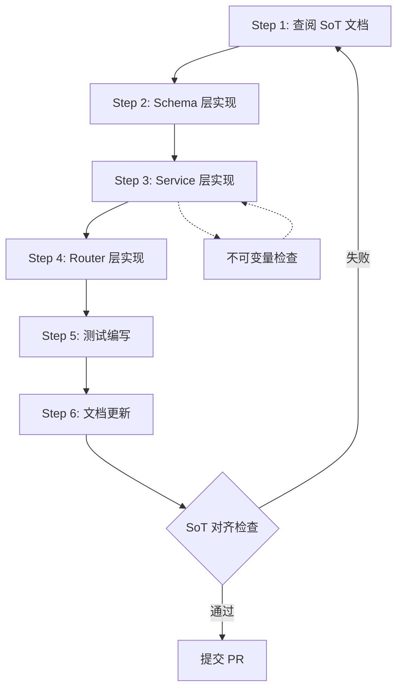
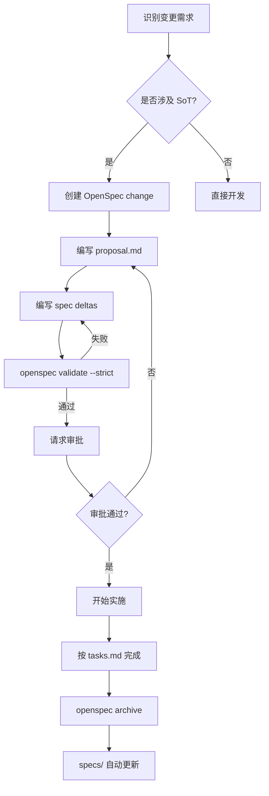

# API Development Flow

## 1. Purpose

定义后端 API 开发的标准流程，确保所有 API 端点符合 SoT 规范。

## 2. Scope

本文档覆盖：
- API 开发 6 步流程（查阅 SoT → Schema → Service → Router → Test → 文档更新）
- SoT 对齐检查流程
- 错误处理标准（基于 ERROR_CODES_SOT v2.1）
- 测试要求（单测 + 集成测试）
- 核心不可变量检查点（INV-001, INV-002, INV-003）

## 3. Development Workflow

### 3.1 开发流程概览

API 开发必须遵循以下 6 步标准流程：



**流程说明**：
1. **Step 1**: 定位并阅读相关 SoT 文档，理解业务规则和约束
2. **Step 2**: 基于 DATA_SCHEMA v5.2 定义 Pydantic Schema
3. **Step 3**: 实现业务逻辑，嵌入不可变量检查（INV-001/002/003）
4. **Step 4**: 定义 FastAPI 路由，对齐 API_SOT v9.0
5. **Step 5**: 编写单测和集成测试，覆盖正常流程和异常场景
6. **Step 6**: 更新 API 文档和开发日志

**关键原则**：
- 任何步骤失败，必须回到 Step 1 重新确认 SoT 规范
- Service 层必须包含显式的不可变量检查
- 所有错误必须使用 ERROR_CODES_SOT v2.1 定义的错误码

### 3.2 Step 1: 查阅 SoT 文档

**目标**: 理解需求的完整 SoT 上下文，避免违反现有规范。

**操作步骤**：

1. **定位相关 SoT 文档**（按优先级查阅）：
   ```
   STATE_MACHINE.md v2.6 → DATA_SCHEMA.md v5.2 → BUSINESS_RULES.md v3.1
   → API_SOT.md v9.0 → ERROR_CODES_SOT.md v2.1 → AUTH_SPEC.md v2.0
   → LEDGER_SOT.md v1.1 → DAILY_REPORT_SOT.md v1.0 → TRANSFER_SOT.md v1.0
   → RECONCILIATION_SOT.md v1.0
   ```

2. **提取关键信息**：
   - 业务规则编号（如 BR-RPT-001）
   - 状态机定义（8 状态流转规则）
   - 数据模型字段定义
   - 权限要求（AUTH_SPEC v2.0）
   - 错误码映射

3. **检查是否存在冲突**：
   - 新 API 是否会破坏现有状态机？
   - 是否需要修改 models/（需 DBA 审核）？
   - 是否涉及账务操作（需遵循 LEDGER_SOT v1.1）？

**示例场景**：开发"提交日报"API
- 查阅 `STATE_MACHINE.md` v2.6 第 8.2 节：确认 `raw_submitted` → `trend_pending` 转换条件
- 查阅 `BUSINESS_RULES.md` v3.1 第 BR-RPT-001：确认提交时的数据完整性要求
- 查阅 `API_SOT.md` v9.0：确认端点路径为 `POST /api/v1/daily-reports/{report_id}/submit`

### 3.3 Step 2: Schema 层实现

**目标**: 定义符合 DATA_SCHEMA v5.2 的 Pydantic Schema。

**规范要求**：

1. **Request Schema 规范**：
   ```python
   # backend/schemas/daily_report.py
   from pydantic import BaseModel, Field, validator
   from datetime import date

   class DailyReportSubmitRequest(BaseModel):
       """日报提交请求（对齐 DATA_SCHEMA v5.2 DailyReport 表）"""
       report_date: date = Field(..., description="日报日期")
       platform: str = Field(..., description="平台名称（fb/google/tiktok）")
       ad_account_id: int = Field(..., description="广告账户 ID")
       raw_spend: float = Field(..., ge=0, description="原始花费（CNY）")
       raw_conversions: int = Field(..., ge=0, description="转化数")

       @validator('platform')
       def validate_platform(cls, v):
           allowed = ['fb', 'google', 'tiktok']
           if v not in allowed:
               raise ValueError(f"平台必须是 {allowed} 之一")
           return v
   ```

2. **Response Schema 规范**：
   ```python
   class DailyReportResponse(BaseModel):
       """日报响应（映射 DailyReport 模型）"""
       id: int
       report_date: date
       status: str  # 必须来自 STATE_MACHINE v2.6
       raw_spend: float
       final_spend: float | None
       created_at: datetime

       class Config:
           orm_mode = True  # 允许从 SQLAlchemy 模型转换
   ```

3. **字段对齐检查**：
   - 所有字段名必须与 `DATA_SCHEMA.md` v5.2 表定义一致
   - 枚举值（如 platform）必须与 BUSINESS_RULES v3.1 对齐
   - 状态字段（status）必须使用 STATE_MACHINE v2.6 定义的值

### 3.4 Step 3: Service 层实现

**目标**: 实现业务逻辑，确保符合不可变量和状态机规则。

**核心规范**：

#### 3.4.1 不可变量检查（MASTER.md v3.4 定义）

所有 Service 层代码必须显式检查以下不可变量：

- **INV-001: 账务只追加，不修改**
  ```python
  # ❌ 错误示例
  def update_balance(account_id: int, new_balance: float):
      account.balance = new_balance  # 违反 INV-001

  # ✅ 正确示例
  def record_topup(account_id: int, amount: float):
      entry = LedgerEntry(
          account_id=account_id,
          entry_type='topup',
          amount=amount,
          direction='credit'
      )
      db.add(entry)  # 只追加，不修改
  ```

- **INV-002: 终态不可逆**
  ```python
  def submit_report(report_id: int):
      report = db.query(DailyReport).get(report_id)

      # 检查终态（final_locked, cancelled）
      if report.status in ['final_locked', 'cancelled']:
          raise ValueError(
              f"报表已处于终态 {report.status}，不可修改",
              error_code='VAL-001'  # ERROR_CODES_SOT v2.1
          )

      # 状态转换
      report.status = 'raw_submitted'
  ```

- **INV-003: 日报状态单向流转**
  ```python
  def validate_status_transition(current: str, target: str):
      # STATE_MACHINE v2.6 定义的合法转换
      allowed_transitions = {
          'draft': ['raw_submitted'],
          'raw_submitted': ['trend_pending'],
          'trend_pending': ['trend_ok', 'trend_flagged'],
          'trend_flagged': ['trend_resolved'],
          'trend_resolved': ['final_pending'],
          'final_pending': ['final_confirmed'],
          'final_confirmed': ['final_locked'],
      }

      if target not in allowed_transitions.get(current, []):
          raise ValueError(
              f"非法状态转换: {current} → {target}",
              error_code='STATE-001'  # ERROR_CODES_SOT v2.1
          )
  ```

#### 3.4.2 Service 层代码结构

```python
# backend/services/daily_report_service.py
from sqlalchemy.orm import Session
from backend.models.daily_report import DailyReport
from backend.schemas.daily_report import DailyReportSubmitRequest
from backend.core.errors import ValidationError

class DailyReportService:
    def __init__(self, db: Session):
        self.db = db

    def submit_report(self, report_id: int, request: DailyReportSubmitRequest):
        """提交日报（对齐 BUSINESS_RULES v3.1 BR-RPT-001）"""

        # 1. 获取报表
        report = self.db.query(DailyReport).get(report_id)
        if not report:
            raise ValidationError(
                code='VAL-002',  # ERROR_CODES_SOT v2.1
                message=f"报表 {report_id} 不存在"
            )

        # 2. 检查不可变量 INV-002
        if report.status in ['final_locked', 'cancelled']:
            raise ValidationError(
                code='VAL-001',
                message=f"报表已处于终态 {report.status}，不可修改"
            )

        # 3. 验证状态转换 INV-003
        self._validate_transition(report.status, 'raw_submitted')

        # 4. 更新数据（对齐 DATA_SCHEMA v5.2）
        report.raw_spend = request.raw_spend
        report.raw_conversions = request.raw_conversions
        report.status = 'raw_submitted'
        report.submitted_at = datetime.utcnow()

        self.db.commit()
        return report

    def _validate_transition(self, current: str, target: str):
        """状态转换验证（STATE_MACHINE v2.6）"""
        # ... （参见 3.4.1 示例代码）
```

### 3.5 Step 4: Router 层实现

**目标**: 定义 FastAPI 路由，对齐 API_SOT v9.0。

**规范要求**：

1. **路径命名规范**（API_SOT v9.0 Section 2）：
   ```python
   # backend/routers/daily_reports.py
   from fastapi import APIRouter, Depends
   from backend.schemas.daily_report import DailyReportSubmitRequest, DailyReportResponse
   from backend.services.daily_report_service import DailyReportService
   from backend.core.auth import require_permission  # AUTH_SPEC v2.0

   router = APIRouter(prefix="/api/v1/daily-reports", tags=["daily-reports"])

   @router.post(
       "/{report_id}/submit",
       response_model=DailyReportResponse,
       status_code=200,
       summary="提交日报",
       description="将日报从 draft 状态提交到 raw_submitted（STATE_MACHINE v2.6）"
   )
   async def submit_daily_report(
       report_id: int,
       request: DailyReportSubmitRequest,
       service: DailyReportService = Depends(get_service),
       current_user = Depends(require_permission('daily_report:submit'))  # AUTH_SPEC v2.0
   ):
       return service.submit_report(report_id, request)
   ```

2. **权限检查**（AUTH_SPEC v2.0）：
   - 所有写操作必须检查权限
   - 使用 `require_permission(resource:action)` 格式
   - 权限定义参见 AUTH_SPEC v2.0 Section 3

3. **响应码规范**（API_SOT v9.0 Section 4）：
   - 成功创建: 201
   - 成功更新/提交: 200
   - 客户端错误: 400/403/404
   - 服务器错误: 500

### 3.6 Step 5: 测试编写

**目标**: 确保代码覆盖正常流程和异常场景。

**测试要求**：

1. **单元测试**（Service 层）：
   ```python
   # tests/test_daily_report_service.py
   import pytest
   from backend.services.daily_report_service import DailyReportService
   from backend.core.errors import ValidationError

   def test_submit_report_success(db_session, sample_report):
       """测试正常提交流程"""
       service = DailyReportService(db_session)
       result = service.submit_report(
           report_id=sample_report.id,
           request=DailyReportSubmitRequest(
               report_date=date.today(),
               platform='fb',
               ad_account_id=1,
               raw_spend=1000.0,
               raw_conversions=50
           )
       )
       assert result.status == 'raw_submitted'

   def test_submit_locked_report_fails(db_session, locked_report):
       """测试 INV-002: 终态不可逆"""
       service = DailyReportService(db_session)
       with pytest.raises(ValidationError) as exc:
           service.submit_report(locked_report.id, ...)
       assert exc.value.code == 'VAL-001'

   def test_invalid_status_transition(db_session, pending_report):
       """测试 INV-003: 非法状态转换"""
       service = DailyReportService(db_session)
       with pytest.raises(ValidationError) as exc:
           service._validate_transition('final_confirmed', 'draft')
       assert exc.value.code == 'STATE-001'
   ```

2. **集成测试**（API 端点）：
   ```python
   # tests/test_daily_report_api.py
   from fastapi.testclient import TestClient

   def test_submit_report_api(client: TestClient, auth_headers):
       """测试提交日报 API（对齐 API_SOT v9.0）"""
       response = client.post(
           "/api/v1/daily-reports/1/submit",
           json={
               "report_date": "2025-11-27",
               "platform": "fb",
               "ad_account_id": 1,
               "raw_spend": 1000.0,
               "raw_conversions": 50
           },
           headers=auth_headers
       )
       assert response.status_code == 200
       assert response.json()['status'] == 'raw_submitted'

   def test_submit_without_permission(client: TestClient):
       """测试权限检查（AUTH_SPEC v2.0）"""
       response = client.post("/api/v1/daily-reports/1/submit", ...)
       assert response.status_code == 403
       assert response.json()['code'] == 'AUTH-001'  # ERROR_CODES_SOT v2.1
   ```

3. **测试覆盖率要求**：
   - Service 层: ≥ 90%
   - Router 层: ≥ 80%
   - 必须覆盖所有不可变量检查分支

### 3.7 Step 6: 文档更新

**目标**: 保持 API 文档和开发日志的同步更新。

**更新清单**：

1. **API_SOT.md v9.0 更新**（如果新增端点）：
   ```markdown
   ### POST /api/v1/daily-reports/{report_id}/submit

   **描述**: 提交日报，将状态从 `draft` 转换到 `raw_submitted`

   **权限**: `daily_report:submit` (AUTH_SPEC v2.0)

   **请求体**:
   - `report_date` (date): 日报日期
   - `platform` (string): 平台（fb/google/tiktok）
   - `raw_spend` (float): 原始花费

   **响应**: 200 OK + DailyReportResponse

   **错误码**:
   - VAL-001: 终态报表不可修改
   - STATE-001: 非法状态转换
   ```

2. **DEVELOPMENT_PROGRESS_REPORT.md 更新**：
   - 在"已完成功能"章节记录新 API
   - 更新测试覆盖率数据
   - 记录任何 SoT 规范的新发现

3. **OpenAPI 文档同步**：
   - 确保 FastAPI 自动生成的 `/docs` 包含完整描述
   - 验证 schema 示例正确

## 3.8 何时必须创建 OpenSpec Proposal

### 3.8.1 必须创建 Proposal 的场景

| 场景 | 示例 | 相关 SoT |
|------|------|----------|
| **新增 API 端点** | `POST /api/v1/transfers` | API_SOT.md |
| **修改状态机** | 新增状态 `trend_review` | STATE_MACHINE.md |
| **数据库结构变更** | 新增 `audit_logs` 表 | DATA_SCHEMA.md |
| **新业务规则** | 添加 BR-LED-005 | BUSINESS_RULES.md |
| **错误码变更** | 新增 `BIZ-010` | ERROR_CODES_SOT.md |
| **Breaking change** | 修改 API 响应格式 | API_SOT.md |
| **权限变更** | 新增 `reconciliation:approve` | AUTH_SPEC.md |

### 3.8.2 可跳过 Proposal 的场景

| 场景 | 说明 |
|------|------|
| **Bug 修复** | 恢复到既有 spec 定义的行为 |
| **补充测试** | 为现有功能增加测试覆盖 |
| **文档 typo** | 拼写错误、格式调整、示例修正 |
| **依赖更新** | 非破坏性的库版本升级 |
| **代码重构** | 不改变外部行为的内部优化 |

### 3.8.3 分支与提交命名规范

**分支命名**：
```bash
# 实现 OpenSpec change
feature/<change-id>

# 示例
feature/add-transfer-v2
feature/update-daily-report-states
```

**Commit message 规范**：
```bash
# 格式
<type>(<scope>): <description> [<change-id>]

# 示例
feat(api): add transfer endpoint [add-transfer-v2]
fix(service): correct state transition [fix-trend-flow]
docs(sot): update STATE_MACHINE for 9-state [update-state-machine-v3]
```

### 3.8.4 OpenSpec 工作流



---

## 4. Error Handling

### 4.1 错误码使用规范

所有错误必须使用 `ERROR_CODES_SOT.md` v2.1 定义的错误码：

```python
from backend.core.errors import ValidationError, StateTransitionError

# 验证错误
raise ValidationError(
    code='VAL-001',  # 来自 ERROR_CODES_SOT v2.1
    message="报表已处于终态，不可修改"
)

# 状态转换错误
raise StateTransitionError(
    code='STATE-001',
    message=f"非法状态转换: {current} → {target}"
)

# 权限错误
raise PermissionError(
    code='AUTH-001',
    message="缺少 daily_report:submit 权限"
)
```

### 4.2 错误响应格式

统一使用以下 JSON 格式（API_SOT v9.0 Section 5）：

```json
{
  "code": "VAL-001",
  "message": "报表已处于终态 final_locked，不可修改",
  "details": {
    "report_id": 123,
    "current_status": "final_locked"
  }
}
```

## 5. Relation to SoT

本文档依赖以下 SoT 文档（SoT Freeze v1.0）：

| SoT 文档 | 版本 | 用途 |
|---------|------|------|
| `STATE_MACHINE.md` | v2.6 | 8 状态机定义，状态转换规则 |
| `DATA_SCHEMA.md` | v5.2 | 数据模型字段定义 |
| `BUSINESS_RULES.md` | v3.1 | 业务规则编号（BR-XXX-001） |
| `API_SOT.md` | v9.0 | API 端点路径、权限、响应码规范 |
| `ERROR_CODES_SOT.md` | v2.1 | 错误码定义（VAL-001, STATE-001 等） |
| `AUTH_SPEC.md` | v2.0 | 权限模型、鉴权规范 |
| `LEDGER_SOT.md` | v1.1 | 账本系统规范（账务操作相关 API） |
| `DAILY_REPORT_SOT.md` | v1.0 | 日报专项规范 |
| `TRANSFER_SOT.md` | v1.0 | 转账专项规范 |
| `RECONCILIATION_SOT.md` | v1.0 | 对账专项规范 |

**SoT 裁判链优先级**：
```
STATE_MACHINE.md v2.6 → DATA_SCHEMA.md v5.2 → BUSINESS_RULES.md v3.1
→ API_SOT.md v9.0 → ERROR_CODES_SOT.md v2.1 → AUTH_SPEC.md v2.0
→ LEDGER_SOT.md v1.1 → 专项 SoT（DAILY_REPORT/TRANSFER/RECONCILIATION）
```

## 6. Invariants Checkpoints

开发过程中必须检查以下不可变量（MASTER.md v3.4 定义）：

- **INV-001**: 账务只追加，不修改
  - ❌ 禁止: 直接修改 `balance` 字段
  - ✅ 必须: 通过 `ledger_entries` 表记录（LEDGER_SOT v1.1）

- **INV-002**: 终态不可逆
  - ❌ 禁止: 修改 `final_locked` 或 `cancelled` 状态的记录
  - ✅ 必须: Service 层显式检查终态

- **INV-003**: 日报状态单向流转
  - ❌ 禁止: 从 `final_confirmed` 回退到 `draft`
  - ✅ 必须: 使用 STATE_MACHINE v2.6 定义的合法转换路径

## 7. References

- [MASTER.md](../1.overview/MASTER.md) v3.4 - 文档架构和不可变量定义
- [SoT 文档集](../2.sot/) - 完整 SoT Freeze v1.0 规范
- [PROJECT_RULES.md](../../.claude/PROJECT_RULES.md) v3.1 - Claude Code 项目规则
- [FastAPI 官方文档](https://fastapi.tiangolo.com/) - 路由和依赖注入
- [Pydantic 官方文档](https://docs.pydantic.dev/) - Schema 定义规范
