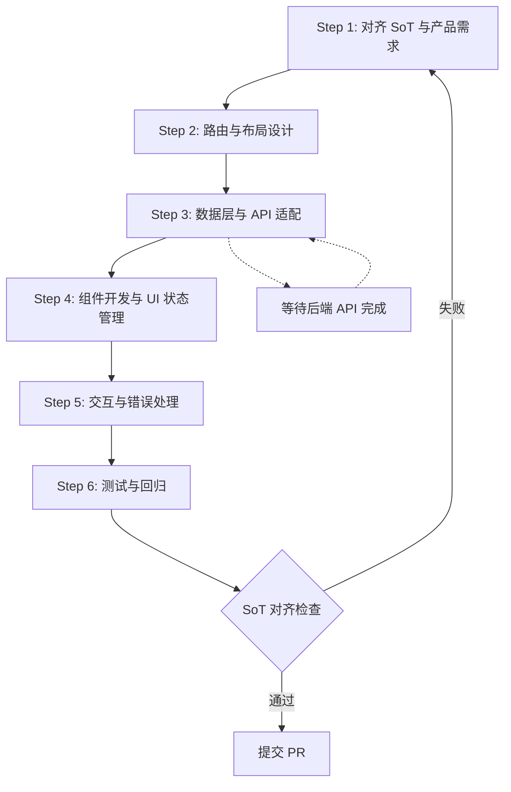

# Frontend Development Flow

## 0. 前言与文档角色

### 0.1 本文档的定位

本文档属于 **Dev Guide / Flow 文档层级**，不是业务 SoT（Single Source of Truth）。

**文档类型**：
- ✅ **流程规范**：定义前端开发的 6 步标准流程
- ✅ **约束说明**：说明前端如何对齐 SoT（状态机、API 契约、错误码）
- ❌ **不是业务规则定义**：不定义状态机、数据模型、API 契约、错误码等业务规则

### 0.2 与相关文档的关系

- **对标关系**：本文档与 `API_DEVELOPMENT_FLOW.md v2.3` 对等，但聚焦前端视角
- **协同关系**：前端开发必须等待或对齐后端 API 开发完成（见 §4）
- **依赖关系**：前端必须遵守 API_SOT.md v9.0 定义的 Envelope 响应格式
- **样式规范**：所有 UI/布局/组件规范以 `FRONTEND_STYLE_GUIDE_v2.0.md` 为唯一权威，本文档不重复样式细节，仅引用
- **开发规则**：技术栈、组件架构、状态管理模式以 `FRONTEND_DEVELOPMENT_RULES.md v1.0` 为参考，但实际实现以 `FRONTEND_STYLE_GUIDE_v2.0.md` 为准（Next.js App Router + `src/modules/` 结构）

---

## 1. 前端在整体架构中的位置

### 1.1 前端角色

前端（Next.js 14 + TypeScript + Tailwind）负责：

- **UI 呈现**：将业务状态（来自 STATE_MACHINE.md v2.6）映射为可视化界面
- **用户交互**：处理表单提交、状态转换触发、筛选/排序等操作
- **数据绑定**：通过 API 层（`frontend/src/lib/api/`）与后端通信，遵守 API_SOT.md v9.0
- **状态同步**：确保 UI 状态与后端状态机一致（例如：日报状态 `raw_submitted` → `trend_pending`）

### 1.2 与后端 API 的关系

```
前端 (Next.js) ←→ API 层 (apiFetch.ts) ←→ 后端 API (FastAPI)
     ↓                                              ↓
  UI 状态管理                              状态机 + 业务规则
  (React Hooks)                          (STATE_MACHINE.md)
```

**关键约束**：
- 前端**不能**直接修改数据库或状态机
- 所有状态变更必须通过后端 API 触发
- 前端必须处理 API 返回的错误码（ERROR_CODES_SOT.md v2.1）

---

## 2. SoT 依赖与优先级链

### 2.1 前端必须遵守的 SoT 文档（按优先级）

```
1. MASTER.md v3.6（项目宪法）
   ↓
2. 业务 SoT（规则层）
   - STATE_MACHINE.md v2.6（状态机定义，前端必须映射）
   - DATA_SCHEMA.md v5.2（数据模型，前端类型定义必须对齐）
   - BUSINESS_RULES.md v3.1（业务规则，前端交互必须遵守）
   - API_SOT.md v9.0（API 契约，前端请求/响应格式必须对齐）
   - ERROR_CODES_SOT.md v2.1（错误码，前端错误处理必须对齐）
   - AUTH_SPEC.md v2.0（权限模型，前端路由/按钮权限必须对齐）
   ↓
3. 流程规范（Flow 层）
   - API_DEVELOPMENT_FLOW.md v2.3（后端开发流程，前端需等待/对齐）
   ↓
4. 样式与组件规范（最高优先级，前端开发必须遵守）
   - FRONTEND_STYLE_GUIDE_v2.0.md（UI Token、布局、组件规范、Dashboard 12 栅格、App Shell 结构）
   - FRONTEND_DEVELOPMENT_RULES.md v1.0（技术栈、组件架构参考，但实际实现以 STYLE_GUIDE 为准）
```

### 2.2 前端禁止事项

- ❌ **禁止修改业务规则**：前端不能绕过 STATE_MACHINE.md 定义的状态转换
- ❌ **禁止发明新的错误码**：所有错误处理必须使用 ERROR_CODES_SOT.md v2.1 定义的错误码
- ❌ **禁止修改 API 契约**：前端必须遵守 API_SOT.md v9.0 定义的请求/响应格式
- ❌ **禁止直接操作数据库**：所有数据变更必须通过后端 API

---

## 3. 前端开发 6 步流程

### 3.1 流程概览

前端开发必须遵循以下 6 步标准流程：



**流程说明**：
1. **Step 1**: 查阅相关 SoT 文档，理解业务规则、状态机、API 契约
2. **Step 2**: 设计路由结构（App Router）和页面布局（Shell 模式）
3. **Step 3**: 实现数据层（API 调用、Envelope 解包），等待/对齐后端 API
4. **Step 4**: 开发组件（Page Shell、业务组件），管理 UI 状态（React Hooks）
5. **Step 5**: 实现交互逻辑（表单提交、状态转换触发），处理错误（Envelope 错误响应）
6. **Step 6**: 编写测试（单测、集成测），更新文档，纳入回归基线

**关键原则**：
- 任何步骤失败，必须回到 Step 1 重新确认 SoT 规范
- Step 3 必须等待后端 API 开发完成（参考 API_DEVELOPMENT_FLOW.md v2.3）
- 所有错误处理必须使用 ERROR_CODES_SOT.md v2.1 定义的错误码

### 3.2 Step 1: 对齐 SoT 与产品需求

**目标**: 理解需求的完整 SoT 上下文，避免违反现有规范。

**操作步骤**：

1. **定位相关 SoT 文档**（按优先级查阅）：
   ```
   STATE_MACHINE.md v2.6 → DATA_SCHEMA.md v5.2 → BUSINESS_RULES.md v3.1
   → API_SOT.md v9.0 → ERROR_CODES_SOT.md v2.1 → AUTH_SPEC.md v2.0
   → 模块 SOT（如 DAILY_REPORT_SOT.md v1.0）
   ```

2. **提取关键信息**：
   - 状态机定义（8 状态流转规则，前端 UI 必须映射）
   - 数据模型字段定义（前端 TypeScript 类型必须对齐）
   - API 端点路径和请求/响应格式（API_SOT.md v9.0）
   - 权限要求（AUTH_SPEC.md v2.0，前端路由/按钮权限必须对齐）
   - 错误码映射（ERROR_CODES_SOT.md v2.1，前端错误处理必须对齐）

3. **检查是否存在冲突**：
   - 新页面是否会破坏现有状态机映射？
   - 是否需要等待后端 API 开发完成？
   - 是否涉及权限控制（需遵循 AUTH_SPEC.md v2.0）？

**示例场景**：开发"日报管理"页面
- 查阅 `STATE_MACHINE.md` v2.6 第 8.2 节：确认 8 个状态及其 UI 展示规则
- 查阅 `API_SOT.md` v9.0：确认端点路径为 `GET /api/v1/daily-reports`，响应格式为 Envelope
- 查阅 `ERROR_CODES_SOT.md` v2.1：确认错误码格式（如 `VALIDATION_001`、`STATE_400`）

### 3.3 Step 2: 路由与布局设计

**目标**: 设计符合 Next.js App Router 和 Shell 模式的路由与布局结构。

**规范要求**：

1. **路由结构**（App Router）：
   ```typescript
   // frontend/app/dashboard/daily-reports/page.tsx
   'use client';
   import PageContainer from '@/components/layout/page-container';
   import { DailyReportsPageShell } from '@/modules/daily-reports';
   
   export default function DailyReportsPage() {
     return (
       <PageContainer>
         <DailyReportsPageShell />
       </PageContainer>
     );
   }
   ```

2. **Shell 模式**（模块级布局）：
   ```typescript
   // frontend/src/modules/daily-reports/DailyReportsPageShell.tsx
   'use client';
   import { PageShell } from '@/modules/shared/components/layout/PageShell';
   import { useDailyReports } from './hooks/useDailyReports';
   
   export function DailyReportsPageShell() {
     const { data, loading, error } = useDailyReports();
     // ... 布局与数据组合
   }
   ```

3. **目录结构规范**（必须遵守 FRONTEND_STYLE_GUIDE_v2.0.md §4.1）：
   ```
   frontend/
   ├── app/                          # Next.js App Router
   │   ├── (dashboard)/              # 主业务路由组
   │   │   └── {module}/
   │   │       └── page.tsx          # 路由入口（仅负责路由与编排）
   │   ├── layout.tsx                # 根布局
   │   ├── providers.tsx             # 应用级 Provider（QueryClient 等）
   │   └── globals.css               # 全局样式（颜色 Token 定义）
   └── src/
       ├── lib/                      # 核心工具库
       │   ├── api/                  # API 客户端（apiFetch.ts）
       │   ├── auth/                 # 认证工具
       │   └── validation/           # Zod schemas
       └── modules/                  # 业务模块（按领域划分）
           ├── shared/               # 跨模块共享
           │   └── components/
           │       ├── ui/           # 基础 UI（shadcn 封装）
           │       ├── layout/       # 布局组件（PageShell）
           │       └── feedback/     # 反馈组件
           └── {module}/
               ├── {Module}PageShell.tsx  # Shell 组件（布局与数据组合）
               ├── components/            # 业务组件
               ├── hooks/                 # 数据 hooks
               ├── services/              # API 服务（可选）
               └── types/                 # TypeScript 类型定义
   ```
   
   **重要**：完整目录结构规范见 `FRONTEND_STYLE_GUIDE_v2.0.md` §4.1，本文档仅列出关键路径。

**参考实现**：
- 仪表盘模块：`frontend/app/dashboard/page.tsx` + `frontend/src/modules/dashboard/DashboardShell.tsx`
- 共享 PageShell：`frontend/src/modules/shared/components/layout/PageShell.tsx`

### 3.4 Step 3: 数据层与 API 适配

**目标**: 实现数据层（API 调用、Envelope 解包），等待/对齐后端 API。

**规范要求**：

1. **API 调用层**（统一使用 `apiFetch.ts`）：
   ```typescript
   // frontend/src/lib/api/apiFetch.ts
   // 已实现 Envelope 解包、错误处理、错误码映射
   ```

2. **模块级 API 服务**（可选，用于封装业务逻辑）：
   ```typescript
   // frontend/src/modules/daily-reports/services/dailyReportsApi.ts
   import { apiFetch } from '@/lib/api/apiFetch';
   import type { DailyReport, PaginatedResponse } from '../types';
   
   export const dailyReportsApi = {
     getList: (params: { page?: number; status?: string }) =>
       apiFetch<PaginatedResponse<DailyReport>>('/daily-reports', { params }),
     
     getById: (id: number) =>
       apiFetch<DailyReport>(`/daily-reports/${id}`),
     
     submit: (id: number) =>
       apiFetch<DailyReport>(`/daily-reports/${id}/submit`, { method: 'POST' }),
   };
   ```

3. **数据 Hooks**（React Query / SWR 模式）：
   ```typescript
   // frontend/src/modules/daily-reports/hooks/useDailyReports.ts
   import { useQuery, useMutation } from '@tanstack/react-query';
   import { dailyReportsApi } from '../services/dailyReportsApi';
   
   export function useDailyReports(filters: Filters) {
     return useQuery({
       queryKey: ['daily-reports', filters],
       queryFn: () => dailyReportsApi.getList(filters),
     });
   }
   ```

**关键约束**：
- 必须使用 `apiFetch.ts` 进行所有 API 调用（自动处理 Envelope 解包）
- 必须处理 Envelope 错误响应（`success: false, error: { code, message, details }`）
- 必须等待后端 API 开发完成（参考 API_DEVELOPMENT_FLOW.md v2.3 Step 4）

**参考实现**：
- API 层：`frontend/src/lib/api/apiFetch.ts`（已实现 Envelope 解包、错误处理）
- Dashboard Hook：`frontend/src/modules/dashboard/hooks/useDashboardData.ts`

### 3.4.1 前后端联调流程（Dev 环境）

**目标**：在本地开发环境中，确保前端页面能正确调用后端 API，完成数据流验证。

**前提条件**：
- 后端服务已启动（`uvicorn backend.main:app --reload`，默认地址：`http://127.0.0.1:8000`）
- 前端开发服务器已启动（`pnpm dev`，默认地址：`http://localhost:3000`）
- 后端健康检查端点正常（`curl http://127.0.0.1:8000/api/v1/health` 返回 200）

**环境配置**：

1. **前端环境变量**（`frontend/.env.local`）：
   ```env
   # API Base URL（本地开发环境）
   NEXT_PUBLIC_API_BASE_URL=http://127.0.0.1:8000
   ```
   注意：Next.js 要求客户端环境变量必须以 `NEXT_PUBLIC_` 开头。

2. **后端 CORS 配置**（`backend/core/config.py`）：
   确保 `allowed_origins` 包含前端开发地址：
   ```python
   allowed_origins = [
       "http://localhost:3000",
       "http://127.0.0.1:3000",
   ]
   ```

**联调检查清单**：

| 检查项 | 通过标准 | 排查方向 | 优先级 |
|--------|----------|----------|--------|
| **1. 环境变量配置** | `NEXT_PUBLIC_API_BASE_URL` 在 `.env.local` 中正确设置 | 检查 `frontend/.env.local` 文件是否存在且包含正确的 URL | P0 |
| **2. 后端服务启动** | `curl http://127.0.0.1:8000/healthz` 返回 200 | 检查后端日志，确认无数据库连接错误 | P0 |
| **3. CORS 配置** | 前端请求不被浏览器 CORS 策略拦截 | 检查后端 `allowed_origins` 包含 `http://localhost:3000` | P0 |
| **4. API 路由对齐** | 前端调用的路径与后端注册的路由一致 | 对比 `apiFetch('/xxx')` 与 `backend/main.py` 中的路由注册 | P0 |
| **5. Envelope 格式** | API 响应符合 `{success, data, message, code, request_id, timestamp}` | 检查后端 `success_response()` 函数输出格式 | P0 |
| **6. 数据解包** | `apiFetch` 正确提取 `data` 字段，前端收到的是业务数据而非 Envelope | 在浏览器 DevTools Network 面板检查响应，在代码中打印解包后的数据 | P1 |
| **7. 类型对齐** | 前端 TypeScript 类型与后端响应数据结构一致 | 对比 `frontend/src/modules/xxx/types/` 与后端 Schema 定义 | P1 |
| **8. 错误处理** | 网络错误、API 错误码（如 401/403/404）被正确捕获并显示 | 测试断网、错误参数、无权限等场景 | P1 |
| **9. 鉴权 Token** | 需要认证的 API 请求正确携带 Authorization header | 检查 `apiFetch.ts` 中的 token 注入逻辑，确认 `authStore` 正常工作 | P1 |
| **10. Loading 状态** | 数据加载时显示 Loading 状态，不出现空白页面 | 检查 Hook 中的 `status === 'loading'` 逻辑 | P2 |
| **11. 空状态处理** | API 返回空数据时，UI 显示友好的空状态提示 | 检查组件中的 `data.length === 0` 处理 | P2 |
| **12. 数据刷新** | 页面刷新或手动触发刷新时，数据能正确更新 | 测试 `refresh()` 函数和 `useEffect` 依赖 | P2 |
| **13. 多环境配置** | 不同环境（dev/staging/prod）使用正确的 API base URL | 检查 `.env.local`、`.env.staging`、`.env.production` 配置，确认无硬编码 URL | P2 |
| **14. 控制台无错误** | 浏览器 Console 无 JavaScript 错误、TypeScript 类型错误 | 检查 Console 面板，修复所有红色错误 | P1 |

**联调流程位置**：
- 本小节位于 Step 3（数据层与 API 适配）之后，在 Step 4（组件开发）之前。
- 建议在完成 API 服务封装后、开始组件开发前，先完成一次完整的联调验证。
- 后续新增模块时，可复用此检查清单进行联调验证。

**示例：Finance Profit Summary 联调**

1. 创建 API 服务：`frontend/src/modules/finance/services/financeApi.ts`
2. 更新 Hook：在 `useFinanceData.ts` 中替换 mock 数据为真实 API 调用
3. 按检查清单逐项验证：从环境变量到数据渲染
4. 记录问题并修复：确保所有 P0/P1 项通过

### 3.5 Step 4: 组件开发与 UI 状态管理

**目标**: 开发组件（Page Shell、业务组件），管理 UI 状态（React Hooks）。

**规范要求**：

1. **Page Shell 组件**（模块级布局）：
   ```typescript
   // frontend/src/modules/daily-reports/DailyReportsPageShell.tsx
   'use client';
   import { PageShell } from '@/modules/shared/components/layout/PageShell';
   import { useDailyReports } from './hooks/useDailyReports';
   import { DailyReportsDataTable } from './components/DailyReportsDataTable';
   
   export function DailyReportsPageShell() {
     const { data, loading, error } = useDailyReports(filters);
     
     return (
       <PageShell
         title="日报管理"
         description="查看和管理每日报表"
         filters={<DailyReportsFilters />}
         actions={<Button>新建日报</Button>}
         kpiSection={<DailyReportsKpiRow data={data?.kpi} />}
         loading={loading}
       >
         <DailyReportsDataTable data={data?.items} />
       </PageShell>
     );
   }
   ```

2. **业务组件**（数据展示、交互）：
   ```typescript
   // frontend/src/modules/daily-reports/components/DailyReportsDataTable.tsx
   'use client';
   import { StatusBadge } from '@/modules/shared/components/ui/StatusBadge';
   // ... 状态映射（STATE_MACHINE.md v2.6）
   ```

3. **UI 状态管理**（React Hooks）：
   - 筛选状态：`useState` 或自定义 Hook（如 `useDashboardFilters`）
   - 数据获取：`useQuery`（React Query）或 `useSWR`
   - 数据变更：`useMutation`（React Query）

**关键约束**（必须遵守 FRONTEND_STYLE_GUIDE_v2.0.md）：
- 必须使用 `PageShell` 组件作为页面容器（统一布局，见 STYLE_GUIDE §3.2）
- 必须处理 Loading/Error/Empty 三种状态（推荐使用统一的数据状态管理组件，如 `DataStateManager`，或在 PageShell 中统一封装，见 STYLE_GUIDE §3.2）
- 必须使用 FRONTEND_STYLE_GUIDE_v2.0.md 定义的 UI Token（颜色、间距、排版，见 STYLE_GUIDE §5）
- Dashboard 类型页面必须使用 12 栅格布局（见 STYLE_GUIDE §3.3）
- 所有颜色必须使用语义化 Token，禁止硬编码（见 STYLE_GUIDE §5.1）

**参考实现**：
- Dashboard Shell：`frontend/src/modules/dashboard/DashboardShell.tsx`
- 共享 PageShell：`frontend/src/modules/shared/components/layout/PageShell.tsx`

### 3.6 Step 5: 交互与错误处理

**目标**: 实现交互逻辑（表单提交、状态转换触发），处理错误（Envelope 错误响应）。

**规范要求**：

1. **表单提交**（状态转换触发）：
   ```typescript
   // frontend/src/modules/daily-reports/components/DailyReportsDataTable.tsx
   const handleSubmit = async (reportId: number) => {
     try {
       await dailyReportsApi.submit(reportId);
       // 刷新列表
       queryClient.invalidateQueries(['daily-reports']);
     } catch (error) {
       if (error instanceof ApiError) {
         // 错误码来自 ERROR_CODES_SOT.md v2.1
         if (error.code === 'STATE_400') {
           toast.error('状态转换非法，请查看状态机规则');
         } else if (error.code === 'VALIDATION_001') {
           toast.error(error.message);
         }
       }
     }
   };
   ```

2. **错误处理**（Envelope 错误响应）：
   ```typescript
   // frontend/src/lib/api/apiFetch.ts 已自动处理
   // 前端只需捕获 ApiError / ValidationError
   try {
     const data = await apiFetch<DailyReport>('/daily-reports/1');
   } catch (error) {
     if (error instanceof ValidationError) {
       // 表单字段级错误
       setFieldErrors(error.details);
     } else if (error instanceof ApiError) {
       // 通用 API 错误
       toast.error(error.message);
     }
   }
   ```

3. **状态机映射**（UI 状态展示）：
   ```typescript
   // frontend/src/modules/daily-reports/components/StatusBadge.tsx
   const STATUS_MAP: Record<string, { label: string; color: string }> = {
     raw_submitted: { label: '已提交', color: 'blue' },
     trend_pending: { label: '趋势待审', color: 'yellow' },
     // ... 对齐 STATE_MACHINE.md v2.6
   };
   ```

**关键约束**：
- 所有错误处理必须使用 ERROR_CODES_SOT.md v2.1 定义的错误码
- 状态转换必须通过后端 API 触发，前端不能直接修改状态
- 必须处理 Envelope 错误响应（`success: false, error: { code, message, details }`）

### 3.7 Step 6: 测试与回归

**目标**: 编写测试（单测、集成测），更新文档，纳入回归基线。

**规范要求**：

1. **单元测试**（组件测试）：
   ```typescript
   // frontend/src/modules/daily-reports/__tests__/DailyReportsPageShell.test.tsx
   import { render, screen } from '@testing-library/react';
   import { DailyReportsPageShell } from '../DailyReportsPageShell';
   
   describe('DailyReportsPageShell', () => {
     it('should render loading state', () => {
       // ...
     });
     
     it('should render error state', () => {
       // ...
     });
   });
   ```

2. **集成测试**（API 集成）：
   - 测试 API 调用（Mock 或真实 API）
   - 测试 Envelope 解包
   - 测试错误处理

3. **回归测试**：
   - 纳入前端回归测试套件
   - 与后端回归基线对齐（BACKEND_REGRESSION_FREEZE_REPORT_v1.1）

**关键约束**：
- 必须覆盖 Loading/Error/Empty 三种状态
- 必须测试错误处理（使用 ERROR_CODES_SOT.md v2.1 定义的错误码）
- 必须测试状态机映射（UI 状态展示）

---

## 4. 与 API 开发 Flow 的协同

### 4.1 前端必须等待后端 API 完成

**流程对齐**：

```
后端 API 开发流程（API_DEVELOPMENT_FLOW.md v2.3）：
  Step 1: 查阅 SoT → Step 2: Schema → Step 3: Service → Step 4: Router → Step 5: Test → Step 6: Doc

前端开发流程（本文档）：
  Step 1: 对齐 SoT → Step 2: 路由设计 → Step 3: 数据层（等待后端 Step 4 完成）→ Step 4-6
```

**关键约束**：
- 前端 Step 3（数据层与 API 适配）必须等待后端 Step 4（Router 层实现）完成
- 前端不能提前实现 API 调用，必须基于真实的 API_SOT.md v9.0 端点定义

### 4.2 前端如何从 API_DEVELOPMENT_FLOW 中读取约束

1. **API 端点定义**：查阅 API_SOT.md v9.0，确认端点路径、请求/响应格式
2. **错误码定义**：查阅 ERROR_CODES_SOT.md v2.1，确认错误处理规则
3. **状态机定义**：查阅 STATE_MACHINE.md v2.6，确认状态转换规则

---

## 5. 前端测试要求

### 5.1 测试类型

1. **单元测试**（组件测试）：
   - 测试组件渲染（Loading/Error/Empty 状态）
   - 测试交互逻辑（表单提交、状态转换触发）
   - 测试状态映射（STATE_MACHINE.md v2.6 → UI 展示）

2. **集成测试**（API 集成）：
   - 测试 API 调用（Mock 或真实 API）
   - 测试 Envelope 解包（API_SOT.md v9.0）
   - 测试错误处理（ERROR_CODES_SOT.md v2.1）

3. **端到端测试**（E2E，可选）：
   - 测试完整用户流程
   - 测试状态机映射
   - 测试权限控制（AUTH_SPEC.md v2.0）

4. **回归测试**：
   - 纳入前端回归测试套件
   - 与后端回归基线对齐（BACKEND_REGRESSION_FREEZE_REPORT_v1.1）

### 5.2 测试覆盖要求

- ✅ Loading/Error/Empty 三种状态必须覆盖
- ✅ 错误处理必须覆盖（使用 ERROR_CODES_SOT.md v2.1 定义的错误码）
- ✅ 状态机映射必须覆盖（UI 状态展示）
- ✅ 权限控制必须覆盖（AUTH_SPEC.md v2.0 定义的权限字符串）

### 5.3 测试工具与命令（示例，以 package.json 为准）

**测试框架**（参考 FRONTEND_DEVELOPMENT_RULES.md v1.0 §8）：
- 单元测试：Vitest + React Testing Library
- E2E 测试：Playwright（可选）

**测试命令**（示例，实际命令以项目 `package.json` 为准）：
```bash
# 单元测试
npm run test:unit

# 集成测试
npm run test:integration

# E2E 测试
npm run test:e2e

# 测试覆盖率
npm run test:coverage
```

---

## 6. 仪表盘模块作为第一条「前端金样本流水线」

### 6.1 Sample #1: Dashboard Module

**当前状态**：Dashboard 模块目前是 UI/架构金样本，已实现完整的 Shell 模式、12 栅格布局、数据状态管理，可作为前端开发的参考实现。尚未纳入正式前端回归基线，待前端测试流水线完善后纳入。

**登记信息**：

| 字段 | 值 |
|------|-----|
| **模块名** | `dashboard` |
| **路由路径** | `/dashboard` |
| **主 Shell 组件** | `frontend/src/modules/dashboard/DashboardShell.tsx` |
| **路由入口** | `frontend/app/dashboard/page.tsx` |
| **核心业务组件** | `DashboardKpiRow`, `DashboardTrendSection`, `DashboardRiskPanel`, `DashboardTodayTasks`, `DashboardFundsOverview` |
| **数据 Hooks** | `useDashboardData`, `useDashboardFilters` |
| **布局规范** | Dashboard 12 栅格布局（FRONTEND_STYLE_GUIDE_v2.0.md §3.3） |
| **绑定的主要 API 端点** | 待后端 API 开发完成（当前使用 Mock 数据，参考 API_DEVELOPMENT_FLOW.md v2.3） |

**完整流水线步骤**（从需求到上线）：

| 步骤 | 输入 | 操作 | 输出 | 验收标准 |
|------|------|------|------|----------|
| **Step 1: SoT 对齐** | 产品需求文档 | 查阅 STATE_MACHINE.md v2.6、API_SOT.md v9.0、FRONTEND_STYLE_GUIDE_v2.0.md | SoT 对齐清单 | 所有相关 SoT 文档已查阅，无冲突 |
| **Step 2: 路由与布局设计** | SoT 对齐清单 | 设计路由结构（`app/dashboard/page.tsx`）、Shell 组件结构（`DashboardShell.tsx`） | 路由文件 + Shell 组件框架 | 路由符合 Next.js App Router 规范，Shell 组件符合 STYLE_GUIDE §3.3（12 栅格） |
| **Step 3: 数据层与 API 适配** | 后端 API 端点（或 Mock 数据） | 实现 `useDashboardData` Hook、API 服务封装（如需要） | 数据 Hook + API 服务 | Hook 使用 TanStack Query，错误处理符合 ERROR_CODES_SOT.md v2.1 |
| **Step 4: 组件开发与 UI 状态管理** | 数据 Hook + STYLE_GUIDE | 开发业务组件（KPI、图表、预警等），管理 UI 状态 | 完整组件树 | 组件符合 STYLE_GUIDE §5（颜色 Token、间距、排版），处理 Loading/Error/Empty 状态 |
| **Step 5: 交互与错误处理** | 组件树 + API 层 | 实现筛选器联动、错误处理、状态转换触发 | 完整交互逻辑 | 所有错误使用 ERROR_CODES_SOT.md v2.1 错误码，状态转换通过后端 API |
| **Step 6: 测试与回归** | 完整功能 | 编写单元测试、集成测试，纳入回归基线 | 测试套件 + 回归记录 | 测试覆盖率达到要求（见 §5.2），回归测试通过 |

**参考实现**：
- 路由入口：`frontend/app/dashboard/page.tsx`
- Shell 组件：`frontend/src/modules/dashboard/DashboardShell.tsx`
- 数据 Hook：`frontend/src/modules/dashboard/hooks/useDashboardData.ts`
- 布局规范：`FRONTEND_STYLE_GUIDE_v2.0.md` §3.3（Dashboard 12 栅格布局）

---

## 7. 命令速查表

### 7.1 开发命令

| 场景 | 命令示例（占位符） | 说明 |
|------|------------------|------|
| **启动开发服务器** | `npm run dev` 或 `pnpm dev` | 启动 Next.js 开发服务器 |
| **类型检查** | `npm run type-check` | 运行 TypeScript 类型检查 |
| **代码格式化** | `npm run format` | 使用 Prettier/ESLint 格式化代码 |
| **构建生产版本** | `npm run build` | 构建 Next.js 生产版本 |
| **运行单元测试** | `npm run test:unit` | 运行 Vitest 单元测试 |
| **运行 E2E 测试** | `npm run test:e2e` | 运行 Playwright E2E 测试（如配置） |

### 7.2 代码生成命令（规划中）

| 场景 | 命令示例（占位符） | 说明 |
|------|------------------|------|
| **前端模块生成（规划中）** | 通过 Claude 调用 `ai-ad-fe-dev-orchestrator`（规划中） | 生成完整前端模块（Page + Shell + Components + Hooks） |
| **组件生成（规划中）** | 通过 Claude 调用 `ai-ad-fe-dev-impl`（规划中） | 生成单个业务组件 |

**说明**：前端自动化 Skill 套件处于规划中，当前仅手动开发。详见 `AI_DEV_FACTORY_OVERVIEW_v1.1.1` §3.2。

---

## 8. 验收标准

### 8.1 各阶段通过标准

| 阶段 | Pass 条件 | 不通过条件 |
|------|----------|-----------|
| **Step 1: SoT 对齐** | 成功识别所有相关 SoT 文档，无冲突 | 无法识别模块/页面，或 SoT 冲突无法解决 |
| **Step 2: 路由与布局设计** | 路由文件创建完成，Shell 组件框架符合 STYLE_GUIDE | 路由结构不符合 Next.js App Router，或 Shell 组件不符合 STYLE_GUIDE §3.3 |
| **Step 3: 数据层与 API 适配** | 数据 Hook 实现完成，API 调用使用 `apiFetch` | Hook 未使用 TanStack Query，或错误处理不符合 ERROR_CODES_SOT.md v2.1 |
| **Step 4: 组件开发** | 所有业务组件开发完成，UI 状态管理正常 | 组件不符合 STYLE_GUIDE §5（颜色 Token、间距），或未处理 Loading/Error/Empty 状态 |
| **Step 5: 交互与错误处理** | 交互逻辑实现完成，错误处理符合规范 | 错误处理未使用 ERROR_CODES_SOT.md v2.1 错误码，或状态转换未通过后端 API |
| **Step 6: 测试与回归** | 测试套件编写完成，回归测试通过 | 测试覆盖率未达到要求（见 §5.2），或回归测试失败 |

### 8.2 整体流水线通过标准

- ✅ 所有 6 个步骤均通过验收标准
- ✅ 代码符合 FRONTEND_STYLE_GUIDE_v2.0.md 所有规则
- ✅ 测试覆盖率达到要求（见 §5.2）
- ✅ SoT 对齐检查通过（状态枚举、错误码、API 契约、权限字符串）

**不通过情况**：
- ❌ 违反 STYLE_GUIDE 规则（如硬编码颜色、不符合 12 栅格布局）→ **不能**视为通过
- ❌ 测试覆盖率未达到要求 → **不能**视为通过
- ❌ SoT 对齐检查失败（状态枚举不一致、错误码不匹配）→ **不能**视为通过

---

## 9. OpenSpec / 变更管理

### 9.1 前端 UI/UX 大变动什么时候需要 OpenSpec

以下情况需要 OpenSpec Proposal：

- ✅ **新增前端模块**（如新增"财务分析"模块）
- ✅ **重大 UI/UX 变更**（如改变 Shell 模式、布局结构）
- ✅ **新增前端路由**（如新增 `/dashboard/finance`）
- ✅ **修改 STYLE_GUIDE 规则**（如改变 12 栅格布局、修改颜色 Token 系统）
- ❌ **不影响 SoT 的小改动**（如样式微调、组件内部优化）

### 9.2 OpenSpec 流程

1. 创建 OpenSpec Proposal（参考 OpenSpec v1.0）
2. 说明变更影响范围（前端模块、路由、组件、STYLE_GUIDE）
3. 确认是否需要后端 API 支持
4. 等待审核通过后实施

---

## 10. 常见反模式 / 禁止事项

### 10.1 禁止事项

- ❌ **禁止绕过状态机**：前端不能直接修改状态，必须通过后端 API 触发状态转换
- ❌ **禁止发明新的错误码**：所有错误处理必须使用 ERROR_CODES_SOT.md v2.1 定义的错误码
- ❌ **禁止修改 API 契约**：前端必须遵守 API_SOT.md v9.0 定义的请求/响应格式
- ❌ **禁止直接操作数据库**：所有数据变更必须通过后端 API
- ❌ **禁止忽略 Envelope 格式**：所有 API 响应必须使用 Envelope 解包（`apiFetch.ts` 已自动处理）
- ❌ **禁止硬编码颜色**：所有颜色必须使用 FRONTEND_STYLE_GUIDE_v2.0.md §5.1 定义的语义化 Token
- ❌ **禁止违反 STYLE_GUIDE 布局规则**：Dashboard 页面必须使用 12 栅格布局（STYLE_GUIDE §3.3）

### 10.2 常见反模式

1. **在 page.tsx 中直接写业务逻辑**
   - ❌ 错误：`frontend/app/dashboard/page.tsx` 中直接写数据获取逻辑
   - ✅ 正确：`page.tsx` 只负责路由与编排，业务逻辑放在 Shell 组件中

2. **忽略 Loading/Error/Empty 状态**
   - ❌ 错误：不处理加载状态、错误状态、空数据状态
   - ✅ 正确：使用统一的数据状态管理组件（如 `DataStateManager`），或在 PageShell 中统一封装（STYLE_GUIDE §3.2）

3. **硬编码状态映射**
   - ❌ 错误：在组件中硬编码状态标签（如 `'已提交'`）
   - ✅ 正确：使用状态映射常量，对齐 STATE_MACHINE.md v2.6

4. **硬编码颜色值**
   - ❌ 错误：`<div className="bg-[#0a0f1a]">` 或 `style={{ color: '#3B82F6' }}`
   - ✅ 正确：使用语义化 Token，如 `bg-shell`、`text-accent`（STYLE_GUIDE §5.1）

5. **违反 Dashboard 布局规范**
   - ❌ 错误：Dashboard 页面不使用 12 栅格系统，或栅格占比不符合 STYLE_GUIDE §3.3
   - ✅ 正确：使用 `grid-cols-12`，主区域 8 栅格 + 侧栏 4 栅格（STYLE_GUIDE §3.3）

---

## 11. Change Log

| Version | Date | Changes |
|---------|------|---------|
| v1.1.2 | 2025-12-06 | 新增 §3.4.1 前后端联调流程（Dev 环境）：包含环境配置说明、14 项联调检查清单（含鉴权 Token 和多环境配置检查项）、示例联调流程；明确联调在整个开发流程中的位置 |
| v1.1.1 | 2025-12-06 | 版本引用修正：将所有 FRONTEND_STYLE_GUIDE_v2.3.md 引用修正为 v2.0.md（与实际文件一致）；优化 DataStateManager 表述为"推荐模式"；测试命令标题标注"示例"；Dashboard 金样本补充"当前状态"说明；status 从 candidate_freeze 升级为 Ready |
| v1.1 | 2025-12-06 | 审查升级：明确与 FRONTEND_STYLE_GUIDE_v2.0.md 和 FRONTEND_DEVELOPMENT_RULES.md 的对齐关系；补充命令速查表（§7）；补充验收标准表（§8）；完善 Dashboard 金样本流程描述（§6.1）；明确禁止硬编码颜色和违反布局规范；status 从 Draft 升级为 candidate_freeze |
| v1.0 | 2025-12-06 | 初始版本：定义前端开发 6 步流程，对齐 API_DEVELOPMENT_FLOW.md v2.3，登记 Dashboard 模块为第一条前端金样本流水线 |

---

**文档状态**：Ready

