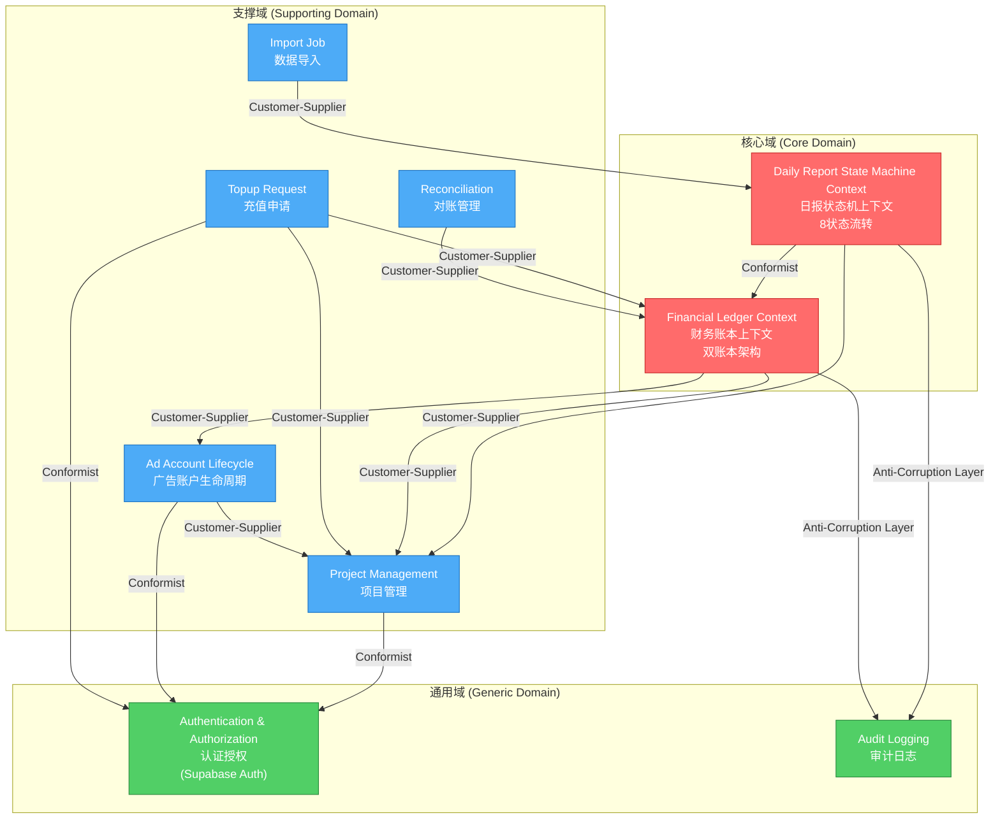

# Bounded Context Map (DDD限界上下文映射)

## 1. Overview

### 1.1 Purpose of Bounded Context Map

限界上下文映射 (Bounded Context Map) 是DDD战略设计的核心工具，用于：

- **定义业务域边界**: 明确各业务子域的职责范围和语言边界
- **识别上下文关系**: 定义子域间的集成模式和依赖关系
- **指导团队协作**: 划分团队职责边界和沟通模式
- **支持系统演进**: 为未来微服务拆分提供战略基础

### 1.2 Relationship to System Context View

**继承关系**:
- **SYSTEM_CONTEXT_VIEW.md** 定义系统与外部环境的边界 (C4 Level 1)
- **BOUNDED_CONTEXT_MAP.md** (本文档) 定义系统内部业务域的边界 (DDD Strategic Design)

**职责划分**:
- System Context View: 回答"系统对外提供什么能力"
- Bounded Context Map: 回答"系统内部如何组织业务逻辑"

### 1.3 Baseline References

**引用**:
- **MASTER.md v4.4 §1.3**: 双账本架构、三数据流分离、8状态机流转
- **DDD_API_ARCHITECTURE.md**: DDD模式指南
- **BUSINESS_RULES.md v4.1**: 业务规则编号映射

## 2. Domain Classification (域分类)

### 2.1 Core Domain (核心域)

核心域是系统的业务核心，提供竞争优势，必须自研。

#### 2.1.1 Financial Ledger Context (财务账本上下文)

**业务价值**: 双账本独立核算，防止账务混乱

**核心能力**:
- 双账本架构 (PROJECT账本 vs SUPPLIER账本)
- 账本只追加不修改 (Append-Only)
- 红冲机制 (REVERSAL)
- 审计追溯 (Immutable Audit Trail)

**关键实体**:
- `LedgerEntry`: 账本记录 (ledger_type: PROJECT/SUPPLIER)
- `Project`: 项目 (balance字段为PROJECT账本余额聚合视图)
- `Supplier`: 供应商 (balance字段为SUPPLIER账本余额聚合视图)

**业务规则引用**:
- **BR-FIN-003**: 金额字段合规性约束 (DECIMAL(15,2), 禁止Float)
- **BR-FIN-005**: Ledger双写一致性 (balance字段 + ledger_entries记录)
- **LEDGER_SOT.md v1.1**: 双账本逻辑、金额方向规则

**Ubiquitous Language (通用语言)**:
| 术语 | 英文 | 定义 |
|------|------|------|
| 双账本 | Dual-Ledger | PROJECT账本(收入侧) + SUPPLIER账本(成本侧) |
| 账本记录 | Ledger Entry | 资金变动的不可变记录 |
| 红冲 | Reversal | final_locked后通过负向记录修正错误 |
| 计费基准 | Revenue Basis | conversions_final × unit_price |
| 成本核算 | Cost Accounting | real_spend × (1 + fee_rate) |

#### 2.1.2 Daily Report State Machine Context (日报状态机上下文)

**业务价值**: 三数据流分离 + 8状态机流转，防止数据篡改

**核心能力**:
- 8状态流转 (raw_submitted → ... → final_locked)
- 三数据流分离 (raw/real/final)
- 趋势风控 (TF-001/002/003规则)
- 终态保护 (final_locked后仅可红冲)

**关键实体**:
- `DailyReport`: 日报 (status字段为8状态机核心)
- `DailyReportAuditLog`: 日报审计日志

**状态机流转** (引用 STATE_MACHINE.md v2.6 §8):
```
raw_submitted → trend_pending → trend_ok → final_pending
                             ↘ trend_flagged → trend_resolved ↗
→ final_confirmed → final_locked (终态)
```

**业务规则引用**:
- **BR-RPT-001**: 日报提交约束 (T+0日23:59前提交raw)
- **BR-RPT-004**: 日报终态保护规则 (final_locked后禁止直接修改)
- **BR-RPT-005**: 粉数确认流程规则 (三数据流分离)

**Ubiquitous Language**:
| 术语 | 英文 | 定义 |
|------|------|------|
| Raw粉数 | Raw Conversions | 投手提交的原始粉数 (conversions_raw)，用于趋势风控 |
| Final粉数 | Final Conversions | 运营确认的最终粉数 (conversions_final)，用于计费 |
| Real消耗 | Real Spend | 真实消耗 (real_spend)，用于成本核算 |
| 趋势风控 | Trend Risk Control | TF-001/002/003规则，检测粉数骤增骤降 |
| 终态锁定 | Final Locked | final_locked状态，数据冻结不可逆 |

### 2.2 Supporting Domain (支撑域)

支撑域支持核心业务，部分功能可采购或外包。

#### 2.2.1 Project Management Context (项目管理上下文)

**业务能力**:
- 项目生命周期管理 (draft → active → suspended → archived)
- 项目成员管理 (project_members)
- 项目单价配置 (unit_price)

**关键实体**:
- `Project`: 项目主表
- `ProjectMember`: 项目成员
- `ProjectExpense`: 项目费用

**业务规则引用**:
- **BR-PROJ-001**: 项目创建权限约束
- **BR-PROJ-003**: 项目状态机流转规则
- **BR-PROJ-004**: 项目删除级联检查

#### 2.2.2 Ad Account Lifecycle Context (广告账户生命周期上下文)

**业务能力**:
- 账户生命周期管理 (new → testing → active → dead)
- 账户状态历史追踪 (account_status_history)
- 账户预警 (account_alerts)

**关键实体**:
- `AdAccount`: 广告账户
- `AccountStatusHistory`: 状态流水
- `AccountAlert`: 账户预警

**业务规则引用**:
- **BR-ACCT-001**: 账户创建与唯一性约束
- **BR-ACCT-002**: 账户状态机流转规则

#### 2.2.3 Topup Request Context (充值申请上下文)

**业务能力**:
- 充值申请流转 (draft → pending_review → finance_approve → paid → completed)
- 充值审批职责分离 (SOD)
- 充值与账本双写

**关键实体**:
- `TopupRequest`: 充值申请
- `TopupTransaction`: 充值流水
- `TopupApprovalLog`: 审批记录

**业务规则引用**:
- **BR-FIN-001**: Topup请求创建权限
- **BR-FIN-002**: 审批职责分离原则

#### 2.2.4 Reconciliation Context (对账上下文)

**业务能力**:
- 对账批次管理 (draft → pending_review → approved → completed)
- 差异调整 (reconciliation_adjustments)
- 对账报告生成

**关键实体**:
- `ReconciliationBatch`: 对账批次
- `ReconciliationDetail`: 对账明细
- `ReconciliationAdjustment`: 调整记录

**业务规则引用**:
- **BR-RECON-001**: 对账批次创建约束
- **BR-RECON-003**: 差异处理与调账

#### 2.2.5 Import Job Context (数据导入上下文)

**业务能力**:
- CSV文件上传与解析
- 数据验证与清洗
- 批量导入 ad_spend_daily

**关键实体**:
- `ImportJob`: 导入任务 (规划中)
- `AdSpendDaily`: 外部消耗数据

### 2.3 Generic Domain (通用域)

通用域是通用功能，可直接采购商业产品或使用开源方案。

#### 2.3.1 Authentication & Authorization Context (认证授权上下文)

**采购方案**: Supabase Auth (托管服务)

**业务能力**:
- JWT Token认证
- 5角色授权 (admin/finance/data_operator/account_manager/media_buyer)
- Session管理

**关键实体**:
- `User`: 业务用户 (auth.users外键同步)
- `UserSession`: 登录会话

**引用**: **AUTH_SPEC.md v2.0**

#### 2.3.2 Audit Logging Context (审计日志上下文)

**业务能力**:
- 系统级审计日志 (audit_logs)
- 业务级审计日志 (daily_report_audit_logs, topup_approval_logs)

**关键实体**:
- `AuditLog`: 系统审计日志

**引用**: **BR-DATA-001**: 审计记录保留策略

## 3. Context Mapping Patterns (上下文映射模式)

### 3.1 Context Map Diagram



### 3.2 Pattern Definitions (模式定义)

#### 3.2.1 Conformist (遵循者模式)

**定义**: 下游上下文完全遵循上游模型，不做转换。

**应用场景**:
- Daily Report State Machine → Financial Ledger
  - **理由**: 日报final_locked后必须按Ledger规则生成REVENUE/COST记录
  - **依赖方向**: StateMachine遵循Ledger的entry_type定义

- All Contexts → Authentication
  - **理由**: 所有业务上下文必须遵循AUTH_SPEC v2.0的5角色定义
  - **依赖方向**: 业务上下文直接使用 `users.role` 字段

#### 3.2.2 Customer-Supplier (客户-供应商模式)

**定义**: 上游供应商提供服务，下游客户消费服务，双方协商接口。

**应用场景**:
- Topup Request → Financial Ledger
  - **协商接口**: TopupRequest.completed状态触发 → Ledger.create_entry(type=TOPUP)
  - **数据流向**: TopupRequest提供 `amount`, `project_id` → Ledger生成记录

- Daily Report → Financial Ledger
  - **协商接口**: DailyReport.final_locked触发 → Ledger.create_entry(type=REVENUE/COST)
  - **数据流向**: DailyReport提供 `conversions_final`, `real_spend` → Ledger计算金额

- Import Job → Daily Report State Machine
  - **协商接口**: ImportJob提供CSV数据 → DailyReport创建raw_submitted记录
  - **数据流向**: AdSpendDaily.spend_amount → DailyReport.raw_spend

#### 3.2.3 Anti-Corruption Layer (防腐层模式)

**定义**: 下游通过防腐层隔离上游模型，防止上游变更污染下游。

**应用场景**:
- Financial Ledger → Audit Logging
  - **防腐层**: LedgerAuditAdapter
  - **隔离内容**: 将Ledger的业务术语 (REVENUE/COST/REVERSAL) 转换为审计日志的通用术语 (create/update/reversal)
  - **示例代码**:
    ```python
    class LedgerAuditAdapter:
        def log_ledger_entry(self, entry: LedgerEntry):
            audit_log = AuditLog(
                module="ledger",
                action=self._map_entry_type_to_action(entry.entry_type),
                entity_id=str(entry.id),
                performed_by=entry.created_by,
                payload_after=entry.to_dict()
            )
    ```

- Daily Report → Audit Logging
  - **防腐层**: DailyReportAuditAdapter
  - **隔离内容**: 8状态机状态转换 → 审计日志的action字段

### 3.3 Integration Patterns (集成模式)

#### 3.3.1 Shared Kernel (共享内核) - 未使用

**不采用理由**:
- 各业务上下文边界清晰，不存在需要共享的核心领域模型
- 共享内核增加耦合，违反MASTER.md v4.4的独立核算原则

#### 3.3.2 Published Language (发布语言)

**应用场景**: ERROR_CODES_SOT.md v2.1

**定义**: 系统范围内的标准错误码语言，所有上下文必须遵循。

**示例**:
- `BIZ_101`: 余额不足 (Financial Ledger使用)
- `STATE_400`: 非法状态流转 (Daily Report State Machine使用)
- `TREND_001`: 趋势风控触发 (Daily Report State Machine使用)

## 4. Bounded Context Details (限界上下文详情)

### 4.1 Financial Ledger Context (详细)

#### 4.1.1 Context Boundary

**入口点**:
- `POST /api/v1/ledger/entries` (手工调账，admin专用)
- `GET /api/v1/ledger/entries` (账本查询，finance/admin)

**出口点**:
- Event: `LedgerEntryCreated` (触发余额更新、审计日志)

**边界保护**:
- 禁止其他上下文直接写入 ledger_entries 表
- 禁止绕过Service层直接UPDATE balance字段

#### 4.1.2 Domain Model (领域模型)

**Aggregate Root (聚合根)**: `LedgerEntry`

**Value Objects (值对象)**:
- `Money`: 金额 + 币种 (amount + currency)
- `LedgerType`: 账本类型枚举 (PROJECT/SUPPLIER)
- `EntryType`: 记录类型枚举 (REVENUE/COST/TOPUP/TRANSFER_OUT/TRANSFER_IN/REVERSAL)

**Invariants (不变量)**:
- **INV-LED-01**: ledger_type=PROJECT 时 project_id 必填，supplier_id 必须为 NULL
- **INV-LED-02**: ledger_type=SUPPLIER 时 supplier_id 必填，project_id 必须为 NULL
- **INV-LED-03**: PROJECT账本仅允许 REVENUE/TOPUP/REVERSAL
- **INV-LED-04**: SUPPLIER账本仅允许 COST/TOPUP/TRANSFER_OUT/TRANSFER_IN/REVERSAL
- **INV-LED-05**: 金额字段必须使用 DECIMAL(15,2)，禁止Float (引用 BR-FIN-003)

#### 4.1.3 Repository Interface

```python
class LedgerEntryRepository(Protocol):
    def create_entry(
        self,
        ledger_type: LedgerType,
        entry_type: EntryType,
        amount: Decimal,
        entity_id: Union[int, UUID],
        reference_type: str,
        reference_id: int,
        performed_by: UUID,
        notes: Optional[str] = None
    ) -> LedgerEntry:
        """创建账本记录 + 更新余额 (原子操作)"""
        ...

    def get_balance(
        self,
        ledger_type: LedgerType,
        entity_id: Union[int, UUID]
    ) -> Decimal:
        """查询实时余额 (直接读取 projects.balance / suppliers.balance)"""
        ...

    def get_entries(
        self,
        ledger_type: LedgerType,
        entity_id: Union[int, UUID],
        entry_type: Optional[EntryType] = None,
        start_date: Optional[date] = None,
        end_date: Optional[date] = None
    ) -> List[LedgerEntry]:
        """查询账本记录 (审计/对账用)"""
        ...
```

### 4.2 Daily Report State Machine Context (详细)

#### 4.2.1 Context Boundary

**入口点**:
- `POST /api/v1/daily-reports` (投手提交raw)
- `PUT /api/v1/daily-reports/{id}/final-confirm` (运营确认final)

**出口点**:
- Event: `DailyReportFinalLocked` (触发Ledger生成REVENUE/COST)
- Event: `TrendFlagged` (触发Email通知data_operator)

**边界保护**:
- 禁止直接UPDATE daily_reports.status (必须通过状态机)
- 禁止在final_locked后直接UPDATE conversions_final

#### 4.2.2 Domain Model

**Aggregate Root**: `DailyReport`

**Value Objects**:
- `RawData`: conversions_raw + raw_spend (投手提交，用于风控)
- `RealData`: real_spend (运营录入，用于成本核算)
- `FinalData`: conversions_final (运营确认，用于计费)
- `ReportStatus`: 8状态枚举

**Invariants**:
- **INV-RPT-01**: conversions_raw 不得用于计费 (引用 BR-RPT-005)
- **INV-RPT-02**: conversions_final 仅在 final_confirmed 后允许触发计费
- **INV-RPT-03**: final_locked 后仅可通过红冲修正
- **INV-RPT-04**: 状态流转必须遵循白名单 (引用 STATE_MACHINE.md v2.6 §8.2)

#### 4.2.3 State Machine Definition

**引用**: STATE_MACHINE.md v2.6 §8

**状态转换规则**:
```python
ALLOWED_TRANSITIONS = {
    "raw_submitted": ["trend_pending"],
    "trend_pending": ["trend_ok", "trend_flagged"],
    "trend_ok": ["final_pending"],
    "trend_flagged": ["trend_resolved", "raw_submitted"],
    "trend_resolved": ["final_pending"],
    "final_pending": ["final_confirmed"],
    "final_confirmed": ["final_locked"],
    "final_locked": []  # 终态
}
```

## 5. Team Topology (团队拓扑)

### 5.1 Team Assignment

| Bounded Context | 负责团队 | 技能要求 |
|----------------|---------|---------|
| Financial Ledger | 后端团队 (核心) | 财务知识、事务处理、审计合规 |
| Daily Report State Machine | 后端团队 (核心) | 状态机设计、业务规则引擎 |
| Project Management | 后端团队 | CRUD + 状态机 |
| Ad Account Lifecycle | 后端团队 | CRUD + 状态机 |
| Topup Request | 后端团队 | 审批流、SOD |
| Reconciliation | 后端团队 + 财务团队协作 | 对账逻辑、差异分析 |
| Import Job | 后端团队 | CSV解析、批量处理 |
| Authentication | 平台团队 (Supabase) | Supabase配置维护 |
| Audit Logging | 后端团队 | 日志存储、查询优化 |

### 5.2 Communication Patterns

**同步通信** (REST API):
- Topup → Ledger
- Daily Report → Ledger
- All Contexts → Auth

**异步通信** (Event):
- Daily Report → Audit (DailyReportFinalLocked事件)
- Ledger → Audit (LedgerEntryCreated事件)

**批处理通信**:
- Import Job → Daily Report (CSV批量导入)

## 6. Evolution Strategy (演进策略)

### 6.1 Microservices Split Plan (微服务拆分规划)

**Phase 1 (当前)**: Monolithic Application (单体应用)
- 所有Bounded Context在同一个FastAPI应用中
- 通过Service层隔离业务逻辑

**Phase 2 (规划)**: Extract Core Domains
- 提取Financial Ledger为独立微服务
- 提取Daily Report State Machine为独立微服务
- 保留Supporting/Generic Domain在主应用

**Phase 3 (未来)**: Full Microservices
- 按Bounded Context拆分所有微服务
- 引入API Gateway / Service Mesh

### 6.2 Refactoring Triggers

**触发条件**:
- 团队规模超过15人
- 单体应用代码量超过10万行
- Financial Ledger/Daily Report并发请求超过1000 QPS
- 需要独立扩容核心域

## 7. Traceability (可追溯性)

### 7.1 References to MASTER.md v4.4

- **§1.3 解决方案**: 双账本架构 → Financial Ledger Context
- **§1.3 解决方案**: 三数据流分离 → Daily Report State Machine Context
- **§1.3 解决方案**: 8状态机强制流转 → Daily Report State Machine Context
- **§1.3 解决方案**: 审计不可逆 → Audit Logging Context + Financial Ledger Context

### 7.2 References to BUSINESS_RULES.md v4.1

- **BR-FIN-003**: 金额字段合规性约束 → Financial Ledger Context
- **BR-RPT-005**: 粉数确认流程规则 → Daily Report State Machine Context
- **BR-RECON-001**: 对账批次创建约束 → Reconciliation Context

### 7.3 References to STATE_MACHINE.md v2.6

- **§8**: 粉数确认状态机 → Daily Report State Machine Context
- **§9**: 充值申请状态机 → Topup Request Context
- **§11**: 对账批次状态机 → Reconciliation Context

### 7.4 References to DDD_API_ARCHITECTURE.md

- **§3 领域驱动设计模式**: Aggregate Root / Value Object / Repository
- **§4 上下文映射模式**: Conformist / Customer-Supplier / Anti-Corruption Layer

---

**文档状态**: ✅ Draft完成，等待审计
**维护责任**: Architecture Team
**下次审查**: 每季度或核心域重大变更时
