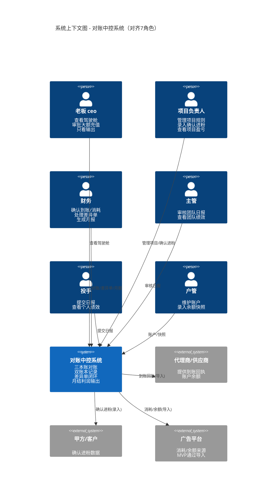
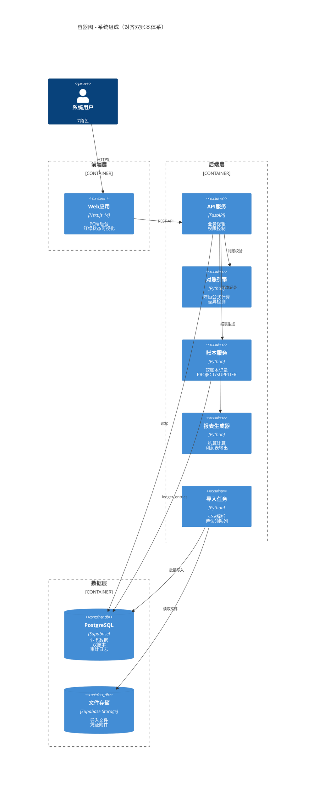
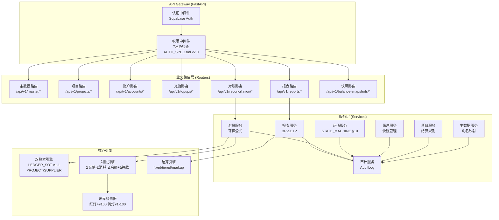
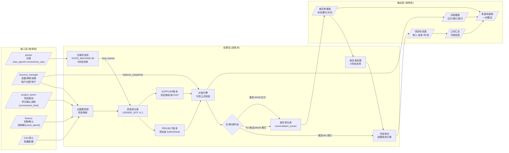
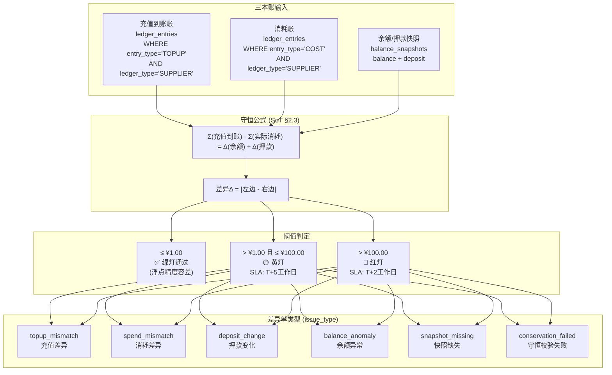
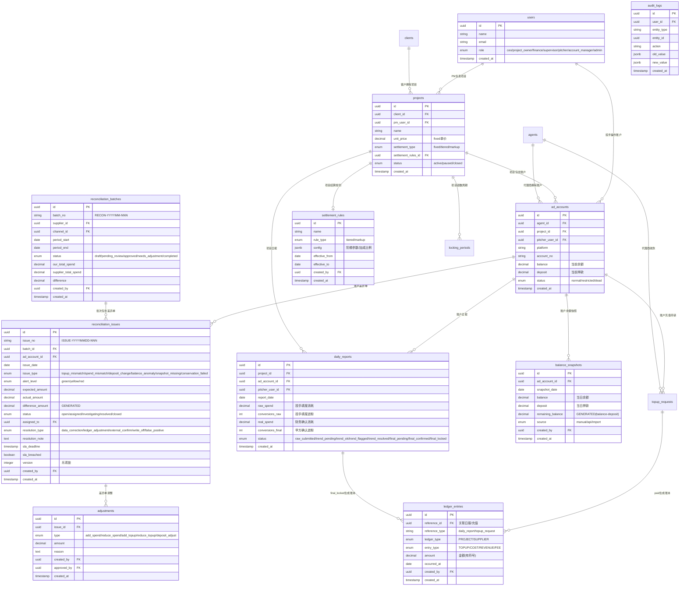
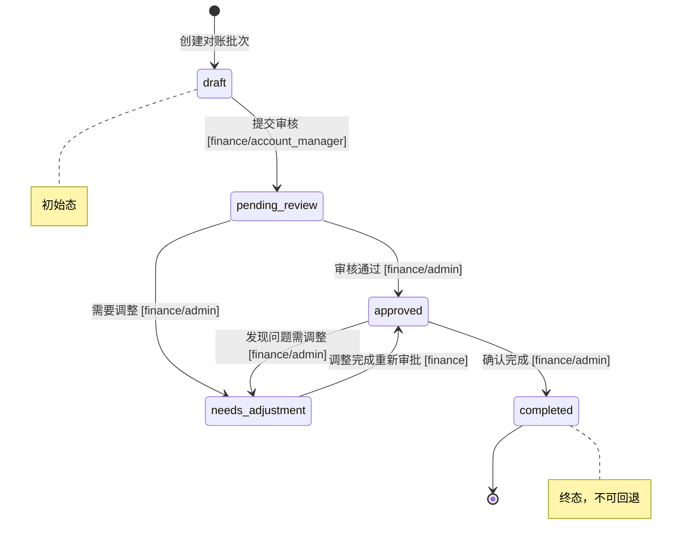
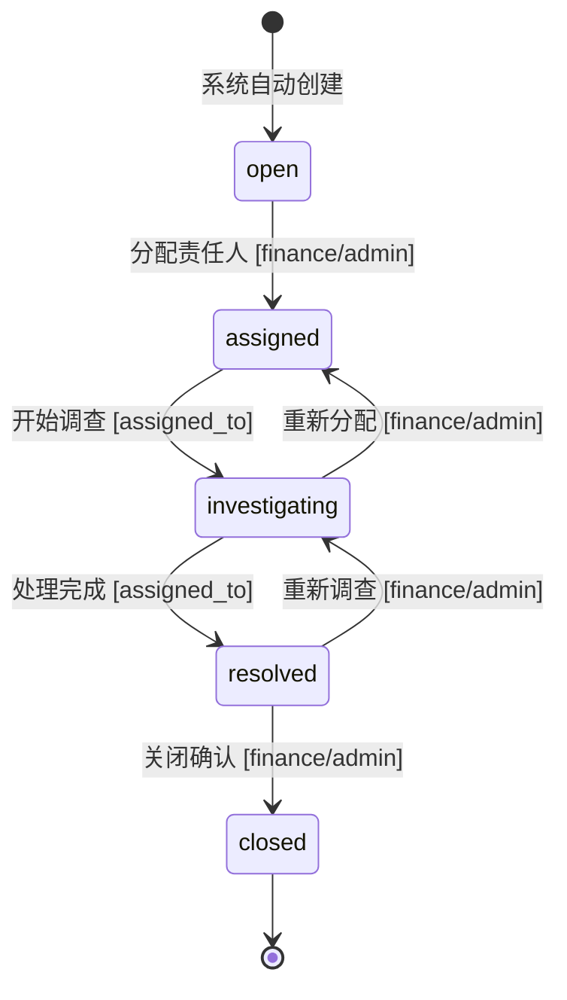

# 公司运营与对账中控系统（MVP）- 系统架构方案

> **版本**: v2.1
> **基于**: PRD v1.0 + RECONCILIATION_CONTROL_CENTER_SOT v2.0 + RECONCILIATION_SOT v1.0
> **编制**: 架构设计文档
> **状态**: Review
> **对齐**: MASTER.md v4.4 | STATE_MACHINE.md v2.6 | LEDGER_SOT.md v1.1 | DATA_SCHEMA.md v5.2

---

## 1. 架构概览

本系统是面向广告代运营公司的内部运营与财务对账中控平台，核心闭环为「**三本账 → 双账本 → 日清对账 → 差异单闭环 → 月结利润输出**」。

**核心设计原则**：
- **口径宪法**：同一数字只有一个来源，不允许多头计算
- **双账本体系**：PROJECT 账本（项目收入）+ SUPPLIER 账本（供应商成本）
- **Phase 1 软性原则**：记录事实、展示状态、提示异常，**不强制阻断**
- **7 角色权限隔离**：ceo/project_owner/finance/supervisor/pitcher/account_manager/admin

**核心管理目标**（三权清晰）：
```
谁对钱负责：project_owner 申请 → finance 审核 → ceo 批准
谁对结果负责：project_owner 对盈亏负责
谁能纠偏：日级 supervisor、周级 project_owner、月级 ceo
```

---

## 2. 模块职责与边界

| 模块 | 职责 | 主要读写数据 | SoT 引用 |
|------|------|-------------|----------|
| **A. 主数据** | 代理商/客户/项目/账户/人员/地区 + 别名映射 | `agents`, `clients`, `projects`, `ad_accounts`, `users`, `regions` | DATA_SCHEMA.md v5.2 |
| **B. 项目中心** | 项目规则、结算配置、甲方确认进粉、结账锁数 | `projects`, `settlement_rules`, `daily_reports.conversions_final`, `locking_periods` | §6 结算规则 |
| **C. 账户中心** | 账户台账、分配、状态、余额/押款快照 | `ad_accounts`, `balance_snapshots` | §3.1, §3.5 |
| **D. 充值流程** | 申请→审批→打款→到账 全链路 | `topup_requests` | STATE_MACHINE.md §10 |
| **E. 对账中心** | 三本账守恒校验、差异单闭环 | `ledger_entries`, `balance_snapshots`, `reconciliation_batches`, `reconciliation_issues` | §2.3 守恒公式, §4 状态机 |
| **F. 月度报表** | 项目利润表、公司汇总、应收未收 | 聚合 `ledger_entries` | §6 结算规则 |
| **G. 老板驾驶舱** | 一页经营概览 | 聚合各模块数据 | PRD §5.7 |
| **H. 导入/校验** | CSV 批量导入、待认领队列 | `import_logs`, `pending_queue` | PRD §8 |
| **I. 权限与审计** | 7角色权限、审计留痕 | `users`, `audit_logs` | AUTH_SPEC.md v2.0 |

---

## 3. 架构图（Mermaid）

### 3.1 A. System Context Diagram（系统上下文图）



---

### 3.2 B. Container / Component Diagram（容器/组件图）



---

#### 3.2.1 后端组件详图（对齐 SoT 引用）



---

### 3.3 C. Data Flow Diagram（数据流图）



---

#### 3.3.1 守恒公式详图（对齐 SoT §2.3）



---

### 3.4 D. ER Diagram（实体关系图 - 对齐 DATA_SCHEMA.md v5.2）



---

## 4. 状态机（对齐 STATE_MACHINE.md v2.6）

### 4.1 对账批次状态机（对齐 RECONCILIATION_SOT.md v1.0 §5.1）



**5 状态定义**：
| 状态 | 英文 | 含义 | 可执行操作 |
|-----|------|------|-----------|
| 草稿 | `draft` | 批次创建但未提交 | 编辑、删除、提交审核 |
| 待审核 | `pending_review` | 已提交等待审核 | 通过、打回 |
| 已通过 | `approved` | 审核通过可完成 | 确认完成、发现问题打回 |
| 需调整 | `needs_adjustment` | 需要修正后重审 | 调整后重新审批 |
| 已完成 | `completed` | 终态，对账已闭环 | 仅查看 |

**状态流转白名单**：
```python
RECONCILIATION_BATCH_TRANSITIONS = {
    "draft": ["pending_review"],
    "pending_review": ["approved", "needs_adjustment"],
    "approved": ["completed", "needs_adjustment"],
    "needs_adjustment": ["approved"],
    "completed": []  # 终态
}
```

### 4.2 差异单状态机



**状态流转白名单**：
```python
RECONCILIATION_ISSUE_TRANSITIONS = {
    "open": ["assigned"],
    "assigned": ["investigating"],
    "investigating": ["resolved", "assigned"],
    "resolved": ["closed", "investigating"],
    "closed": []  # 终态
}
```

---

## 5. 7 角色权限矩阵（对齐 AUTH_SPEC.md v2.0）

### 5.1 角色定义

| 角色ID | 中文名 | 职责范围 |
|--------|-------|---------|
| **ceo** | 老板 | 资金安全、公司盈亏、最终决策 |
| **project_owner** | 项目负责人 | 项目盈亏、资金使用效率 |
| **finance** | 财务 | 资金出入准确、数据真实、对账 |
| **supervisor** | 主管 | 团队产出、投手管理、日常监督 |
| **pitcher** | 投手 | CPL 达标、日报准确、执行投放 |
| **account_manager** | 户管 | 账户分配、账户状态监控、余额快照 |
| **admin** | 管理员 | 系统配置（不参与业务） |

### 5.2 对账模块权限矩阵

| 操作 | ceo | project_owner | finance | supervisor | pitcher | account_manager | admin |
|-----|-----|--------------|---------|------------|---------|-----------------|-------|
| 查看对账批次 | ✅全局 | ✅自己项目 | ✅全局 | ✅团队 | ❌ | ✅全局 | ✅全局 |
| 创建对账批次 | ❌ | ❌ | ✅ | ❌ | ❌ | ✅ | ✅ |
| 关闭对账批次 | ❌ | ❌ | ✅ | ❌ | ❌ | ❌ | ✅ |
| 查看差异单 | ✅全局 | ✅自己项目 | ✅全局 | ✅团队 | ❌ | ✅全局 | ✅全局 |
| 分配差异单 | ❌ | ❌ | ✅ | ❌ | ❌ | ❌ | ✅ |
| 处理差异单 | ❌ | ❌ | ✅ | ❌ | ❌ | ✅快照类 | ✅ |
| 关闭差异单 | ❌ | ❌ | ✅ | ❌ | ❌ | ❌ | ✅ |
| 录入余额快照 | ❌ | ❌ | ✅ | ❌ | ❌ | ✅ | ✅ |
| 配置结算规则 | ❌ | ✅自己项目 | ✅ | ❌ | ❌ | ❌ | ✅ |
| 查看利润表 | ✅全局 | ✅自己项目 | ✅全局 | ❌ | ❌ | ❌ | ✅ |

---

## 6. 业务规则引用（BUSINESS_RULES.md v3.2）

### 6.1 对账规则（BR-REC-*）

| 规则ID | 规则名称 | 级别 | 说明 |
|--------|---------|------|------|
| BR-REC-001 | 对账守恒公式 | 🔴强制 | Σ充值-Σ消耗=Δ余额+Δ押款 |
| BR-REC-002 | 差异单SLA规则 | 🟡Phase2 | 红灯T+2，黄灯T+5 |
| BR-REC-003 | 快照缺失处理 | 🟡警告 | 自动生成snapshot_missing差异单 |
| BR-REC-004 | 押款变化记录 | 🔴强制 | 押款变化必须记录原因 |
| BR-REC-005 | 对账批次唯一性 | 🔴强制 | (supplier_id,channel_id,period)唯一 |

### 6.2 结算规则（BR-SET-*）

| 规则ID | 规则名称 | 公式 |
|--------|---------|------|
| BR-SET-001 | Fixed结算 | revenue = conversions_final × unit_price |
| BR-SET-002 | Tiered结算 | 按阶梯累计/增量计算 |
| BR-SET-003 | Markup结算 | revenue = real_spend × (1 + markup_rate) |

---

## 7. 错误码（ERROR_CODES_SOT.md v2.1）

### 7.1 对账模块错误码（E-RECON-*）

| 错误码 | 消息 | HTTP | 触发场景 |
|--------|------|------|----------|
| E-RECON-001 | 对账批次已存在 | 409 | 违反唯一约束 |
| E-RECON-002 | 对账周期无效 | 400 | period_end < period_start |
| E-RECON-003 | 非法状态流转 | 400 | 不在白名单的状态流转 |
| E-RECON-004 | 审批人与创建人相同 | 403 | 违反职责分离(SOD) |
| E-RECON-005 | 终态批次禁止修改 | 403 | 尝试修改closed批次 |
| E-RECON-006 | 差异单未全部关闭 | 400 | 批次下存在未关闭差异单 |
| E-RECON-007 | 余额快照缺失 | 400 | 对账期间账户缺少快照 |
| E-RECON-008 | 守恒校验失败 | 400 | 守恒公式校验不通过 |

### 7.2 结算模块错误码（E-SET-*）

| 错误码 | 消息 | HTTP | 触发场景 |
|--------|------|------|----------|
| E-SET-001 | 结算规则配置无效 | 400 | 规则配置格式错误 |
| E-SET-002 | 结算类型不支持 | 400 | settlement_type不在枚举范围 |
| E-SET-003 | 阶梯配置重叠 | 400 | tiered规则区间重叠 |
| E-SET-004 | 加成比例无效 | 400 | markup_rate < 0 或 > 1 |
| E-SET-005 | 结算规则未生效 | 400 | 当前日期不在规则有效期内 |

---

## 8. API 规范（API_SOT.md v9.0）

### 8.1 对账批次 API

| 端点 | 方法 | 说明 | 权限 |
|------|------|------|------|
| GET /api/v1/reconciliation/batches | GET | 获取批次列表 | finance,admin,account_manager |
| POST /api/v1/reconciliation/batches | POST | 创建批次 | finance,admin,account_manager |
| POST /api/v1/reconciliation/batches/{id}/submit | POST | 提交审核 | finance,admin,account_manager |
| POST /api/v1/reconciliation/batches/{id}/review | POST | 开始审核 | finance,admin |
| POST /api/v1/reconciliation/batches/{id}/close | POST | 关闭批次 | finance,admin |

### 8.2 差异单 API

| 端点 | 方法 | 说明 | 权限 |
|------|------|------|------|
| GET /api/v1/reconciliation/issues | GET | 获取差异单列表 | finance,admin,account_manager |
| POST /api/v1/reconciliation/issues/{id}/assign | POST | 分配责任人 | finance,admin |
| POST /api/v1/reconciliation/issues/{id}/start | POST | 开始调查 | assigned_to |
| POST /api/v1/reconciliation/issues/{id}/resolve | POST | 处理完成 | assigned_to |
| POST /api/v1/reconciliation/issues/{id}/close | POST | 关闭差异单 | finance,admin |

### 8.3 余额快照 API

| 端点 | 方法 | 说明 | 权限 |
|------|------|------|------|
| GET /api/v1/balance-snapshots | GET | 获取快照列表 | finance,admin,account_manager |
| POST /api/v1/balance-snapshots | POST | 创建快照 | finance,admin,account_manager |
| POST /api/v1/balance-snapshots/bulk | POST | 批量导入 | finance,admin,account_manager |

---

## 9. P0 架构决策清单

| # | 决策 | 说明 | SoT引用 |
|---|------|------|---------|
| **D-01** | **口径宪法** | 收入=conversions_final, 成本=real_spend, 充值=ledger TOPUP, 快照=balance_snapshots | SoT §2.1 |
| **D-02** | **双账本体系** | PROJECT账本(项目收入) + SUPPLIER账本(供应商成本) | LEDGER_SOT v1.1 |
| **D-03** | **三本账齐备** | 缺任意一本账→对账结果「不可判定」→生成补录待办 | SoT §2.2 |
| **D-04** | **守恒公式** | Σ充值-Σ消耗=Δ余额+Δ押款, 阈值: ≤¥1绿灯, ¥1-100黄灯, >¥100红灯 | SoT §2.3 |
| **D-05** | **差异单必须闭环** | 红灯→差异单→指派→处理→关闭(留痕), 未闭环不进月报 | SoT §4.2 |
| **D-06** | **7角色权限** | ceo/project_owner/finance/supervisor/pitcher/account_manager/admin | AUTH_SPEC v2.0 |
| **D-07** | **Phase 1 软性原则** | 记录事实、展示状态、提示异常，不强制阻断 | MASTER.md v4.4 |
| **D-08** | **主数据唯一+别名** | 唯一ID + alias_list 映射历史写法 | SoT §3 |
| **D-09** | **系统开始日策略** | 开始日后强制闭环, 开始日前仅查询参考 | SoT §2.5 |
| **D-10** | **审计留痕** | 关键操作写入 audit_logs (谁/何时/什么/原因) | SoT §8 |

---

## 10. 里程碑拆分（Phase 0/1/2）

### Phase 0：试点准备

| 交付物 | 验收点 | SoT引用 |
|--------|--------|---------|
| 主数据表结构 + CRUD | 代理商/客户/项目/账户/人员可创建 | DATA_SCHEMA.md |
| 别名映射功能 | 历史写法可映射唯一实体 | SoT §3 |
| balance_snapshots 表 | 余额/押款/剩余可用 | SoT §3.1 |
| settlement_rules 表 | tiered/markup 规则可配置 | SoT §3.3 |
| 7角色权限框架 | 登录+权限隔离 | AUTH_SPEC v2.0 |
| CSV 导入通路 | 错误行报告 + 待认领队列 | PRD §8 |

**验收标准**：试点主数据可统一建模；历史数据可导入无重复。

---

### Phase 1：试点闭环（日清日结）

| 交付物 | 验收点 | SoT引用 |
|--------|--------|---------|
| 余额快照批量导入 | 户管可批量导入每日快照 | SoT §3.1 |
| 双账本引擎 | PROJECT/SUPPLIER 账本记录 | LEDGER_SOT v1.1 |
| **对账引擎** | 守恒公式计算，红/黄/绿输出 | SoT §2.3 |
| reconciliation_batches | 对账批次 5 状态流转 | RECONCILIATION_SOT v1.0 §5.1 |
| reconciliation_issues | 差异单 5 状态流转 | SoT §4.2 |
| 差异单分类 | 6 种 issue_type 自动识别 | SoT §3.2 |
| 对账看板 | 红灯/黄灯清单，按账户×日期定位 | PRD §5.5 |
| 审计日志 | 关键操作可追溯 | SoT §8 |

**验收标准**：
- 任一红灯可定位到「账户×日期×差异项」
- 差异单可闭环关闭且留痕
- 对账耗时较基线降低 ≥50%

---

### Phase 2：试点月结

| 交付物 | 验收点 | SoT引用 |
|--------|--------|---------|
| 结算规则管理 | fixed/tiered/markup 可配置 | SoT §6 |
| 结算计算引擎 | 按规则计算收入 | BR-SET-001~003 |
| 甲方确认进粉录入 | PM 可录入 conversions_final | DATA_SCHEMA.md |
| 月结锁数 | locking_periods 锁定周期数据 | PRD §5.2 |
| 调整单 | adjustments 表，审批+留痕 | SoT §3.2 |
| 项目利润表 | 收入-成本=利润 一键生成 | PRD §5.6 |
| 公司汇总表 | 月度经营汇总 | PRD §5.6 |
| 老板驾驶舱 v2 | 利润、红灯、风险项目 | PRD §5.7 |

**验收标准**：
- 试点项目月底可一键生成利润表
- 利润表与人工结果一致（或差异可解释可追溯）
- 月报只使用「通过对账」的数据

---

## 11. 参考文档索引

| SoT 文档 | 版本 | 引用章节 |
|---------|------|---------|
| MASTER.md | v4.4 | §2.4 7角色, §3 Phase边界 |
| STATE_MACHINE.md | v2.6 | §5 对账批次状态机 |
| DATA_SCHEMA.md | v5.2 | 表结构定义 |
| LEDGER_SOT.md | v1.1 | §2 双账本模型 |
| BUSINESS_RULES.md | v3.2 | BR-REC-*, BR-SET-* |
| ERROR_CODES_SOT.md | v2.1 | E-RECON-*, E-SET-* |
| AUTH_SPEC.md | v2.0 | §3 角色权限 |
| API_SOT.md | v9.0 | §12 对账管理API |
| RECONCILIATION_CONTROL_CENTER_SOT.md | v2.0 | 对账管控完整规范 |

---

## 变更记录

| 版本 | 日期 | 变更内容 |
|------|------|----------|
| v2.1 | 2025-12-26 | **状态机修正**：对齐 RECONCILIATION_SOT.md v1.0 §5.1<br/>- 对账批次状态从 4 状态改为 5 状态<br/>- 状态名：`draft/pending_review/approved/needs_adjustment/completed`<br/>- 终态从 `closed` 改为 `completed`<br/>- 新增状态定义表<br/>- 更新 ER 图枚举值 |
| v2.0 | 2025-12-26 | **重大更新**：对齐 RECONCILIATION_CONTROL_CENTER_SOT v2.0<br/>- 对齐 7 角色体系<br/>- 对齐双账本结构<br/>- 对齐状态机定义<br/>- 统一错误码格式<br/>- 完善守恒公式与阈值<br/>- 添加 SoT 引用索引 |
| v1.0 | 2025-12-26 | 初始版本，基于 PRD v1.0 |

---

**文档性质**: 对账中控系统架构方案
**对齐基准**: RECONCILIATION_CONTROL_CENTER_SOT v2.0
**最后更新**: 2025-12-26
