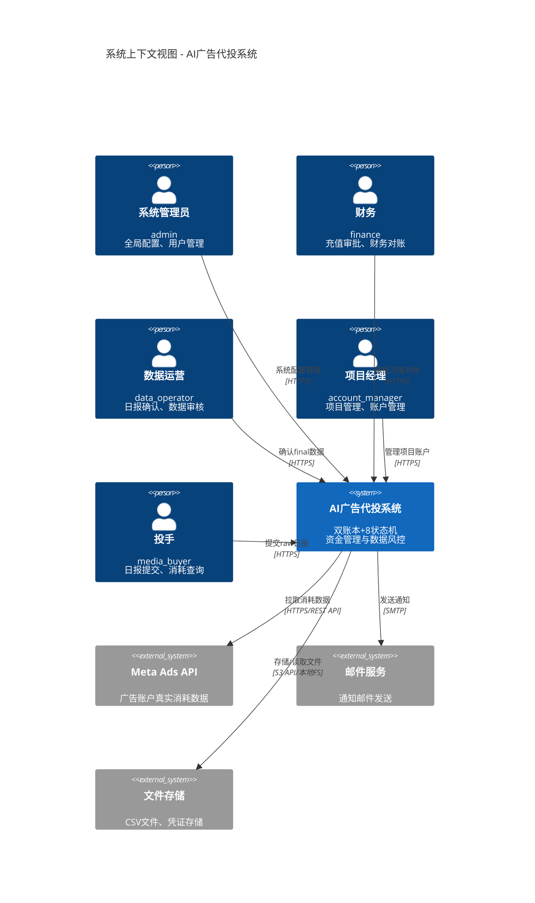
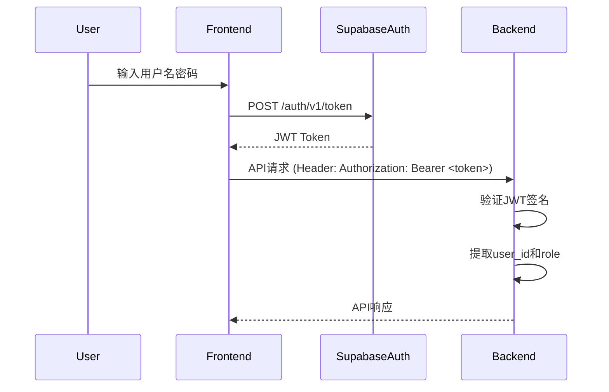

# System Context View (C4 Level 1)

## 1. Overview

### 1.1 Purpose of System Context View

系统上下文视图 (System Context View) 是C4模型的第一层视图，从最高抽象层次展示系统与外部环境的交互关系。本文档回答以下问题：

- **Who**: 谁使用这个系统？(用户角色)
- **What**: 系统边界是什么？(核心功能范围)
- **Where**: 系统依赖哪些外部系统？(外部集成)
- **Why**: 系统为什么存在？(业务价值)

### 1.2 C4 Model Level 1 Definition

**C4模型层级**:
```
Level 1: System Context (本文档) - 系统与外部环境
Level 2: Container (SERVICE_COMPONENT_VIEW.md) - 容器(应用/数据库/队列)
Level 3: Component (SERVICE_COMPONENT_VIEW.md) - 组件(类/模块)
Level 4: Code (代码实现) - 不在架构文档范围
```

### 1.3 Baseline References (MASTER.md v4.4, PROJECT.md)

**基准文档**:
- **MASTER.md v4.4**: 系统架构宪法，定义三大不可变量
- **PROJECT.md v1.2**: 项目能力边界，定义系统功能范围
- **AUTH_SPEC.md v2.0**: 用户角色定义

## 2. System Boundary

### 2.1 AI Ad Spend Management System Scope

**系统核心职责** (引用自 MASTER.md v4.4 §1):
- 管理三方资金流转 (客户 → 平台 → 供应商)
- 双账本记账 (PROJECT账本收入侧 + SUPPLIER账本成本侧)
- 8状态机流转 (raw_submitted → ... → final_locked)
- 审计追溯 (账本只追加不修改)

**系统名称**: AI广告代投系统 (AI Ad Spend Management System)

**一句话描述**: 基于双账本和8状态机的AI广告代投资金管理与数据风控系统

### 2.2 In-Scope Capabilities (from PROJECT.md)

**已实现功能** (In-Scope):
1. **项目管理**: 创建项目、配置单价、管理成员
2. **账户管理**: 广告账户生命周期管理 (new → testing → active → dead)
3. **日报流转**: 8状态机流转 (投手提交raw → 运营确认final → 自动锁定)
4. **充值管理**: 项目充值申请与审批 (draft → pending → approved → completed)
5. **账本记账**: 双账本自动记账 (计费/计成本)
6. **对账管理**: 项目对账批次管理 (draft → completed)

**用户端功能**:
- 项目列表查看
- 日报提交与查询
- 充值申请
- 余额查询

**管理端功能**:
- 项目管理
- 账户管理
- 日报审核
- 充值审批
- 对账管理
- 财务报表

### 2.3 Out-of-Scope (from MASTER.md §6 Capability Boundaries)

**明确不包含** (Out-of-Scope):
1. **广告投放功能**: 不直接操作Meta Ads/Google Ads投放，只管理账户和消耗数据
2. **在线支付集成**: 充值暂不支持在线支付，仅记录线下汇款
3. **实时监控**: 不提供实时广告数据监控，数据为T+1延迟
4. **自动化投放**: 不提供AI自动投放功能，投放由人工操作
5. **多币种支持**: 当前仅支持CNY (人民币)

## 3. External Actors

### 3.1 User Roles (from AUTH_SPEC.md v2.0)

**5大用户角色** (引用 AUTH_SPEC v2.0 §3):

| 角色 | 英文名 | 职责 | 典型操作 |
|------|--------|------|----------|
| **系统管理员** | admin | 全局配置、用户管理、异常处理 | 创建用户、修改配置、处理终态回退 |
| **财务** | finance | 充值审批、财务对账 | 审批充值、执行对账、查看财务报表 |
| **数据运营** | data_operator | 日报确认、数据审核 | 确认final数据、审核日报、处理异常 |
| **项目经理** | account_manager | 项目管理、账户管理 | 创建项目、管理账户、配置单价 |
| **投手** | media_buyer | 日报提交、消耗查询 | 提交raw数据、查看日报状态 |

**权限层级**:
```
admin (最高权限)
  ↓
finance (财务审批)
  ↓
data_operator (数据审核)
  ↓
account_manager (项目管理)
  ↓
media_buyer (基础操作)
```

### 3.2 External Systems

**外部系统集成**:

#### 3.2.1 Meta Ads API
- **用途**: 获取广告账户真实消耗数据
- **集成方式**: REST API (HTTPS)
- **数据流向**: Meta Ads → AI Ad Spend System
- **更新频率**: T+1 (每日凌晨拉取前一天数据)
- **引用**: API_SOT.md v9.3 §External APIs

#### 3.2.2 Email Service
- **用途**: 发送通知邮件 (充值审批、日报异常、账户预警)
- **集成方式**: SMTP
- **数据流向**: AI Ad Spend System → Email Service → 用户邮箱
- **触发条件**:
  - 充值申请提交/审批
  - 日报trend_flagged (AI风控标记)
  - 账户余额不足预警

#### 3.2.3 File Storage
- **用途**: 存储导入文件 (CSV)、账户凭证 (PDF/图片)
- **集成方式**: S3兼容API (当前使用本地文件系统)
- **数据流向**: 双向 (上传/下载)
- **文件类型**:
  - Import Job CSV文件
  - 账户开户凭证
  - 对账报告

## 4. System Context Diagram (C4 Level 1)



## 5. Integration Patterns

### 5.1 Meta Ads API Integration (API_SOT.md v9.3 §External APIs)

**集成模式**: 定时拉取 (Scheduled Pull)

**数据流**:
```
Meta Ads API (T日消耗数据)
  ↓ (每日T+1凌晨2:00拉取)
AI Ad Spend System (ad_spend_daily表)
  ↓ (运营手动导入或API自动导入)
daily_reports.real_spend (成本核算)
```

**错误处理** (引用 ERROR_HANDLING_STRATEGY.md):
- **EXT-001**: API rate limit exceeded → 指数退避重试
- **EXT-002**: Invalid access token → 通知管理员更新token
- **EXT-003**: Ad account not found → 标记账户为dead状态

### 5.2 Email Notification Triggers (STATE_MACHINE.md v2.6 transitions)

**触发条件与模板**:

| 触发事件 | 状态转换 | 收件人 | 邮件模板 |
|---------|---------|--------|----------|
| 充值申请提交 | draft → pending_review | finance | "充值申请#{id}待审批" |
| 充值审批通过 | pending_review → approved | 申请人 | "充值#{id}已批准" |
| 日报AI标记 | trend_pending → trend_flagged | data_operator | "日报#{id}疑似异常" |
| 账户余额不足 | balance < threshold | account_manager | "账户#{id}余额预警" |

**邮件发送策略**:
- 同步发送 (阻塞当前请求) - 用于充值审批通知
- 异步发送 (后台任务) - 用于批量预警通知

### 5.3 File Storage Strategy (Import Jobs workflow)

**存储路径规范**:
```
/storage
  /import_jobs
    /{import_job_id}/
      raw_file.csv (原始上传文件)
      processed.log (处理日志)
  /account_documents
    /{ad_account_id}/
      /{document_id}.pdf (开户凭证)
  /reconciliation_reports
    /{batch_id}/
      report.xlsx (对账报告)
```

**生命周期管理**:
- Import Job文件: 保留90天后归档
- 账户凭证: 永久保留
- 对账报告: 保留365天后归档

## 6. Security Boundaries

### 6.1 Authentication (AUTH_SPEC.md v2.0)

**认证方式**: JWT (Supabase Auth)

**认证流程**:


**Token生命周期**:
- Access Token: 1小时有效期
- Refresh Token: 7天有效期
- 前端自动刷新: TanStack Query自动处理

### 6.2 Authorization (RLS_POLICIES_SOT.md - planned)

**当前实现**: Service层RBAC (基于 `@require_role` 装饰器)

**权限检查示例**:
```python
@require_role('daily_report:submit')
async def submit_daily_report(report_id: int, current_user: User):
    # 业务逻辑
```

**RLS规划** (未启用):
- 项目数据隔离: 用户只能访问其项目成员身份关联的项目
- 财务数据隔离: 仅finance角色可见财务报表
- 启用条件: 用户量超过1000时重新评估

### 6.3 API Rate Limiting (API_SOT.md v9.3)

**限流策略** (未实施，规划中):
- 匿名请求: 10 req/min
- 已认证用户: 100 req/min
- admin角色: 1000 req/min

**限流实现**: 计划使用Redis + Sliding Window算法

## 7. Traceability

### 7.1 References to MASTER.md v4.4 §3-6

- **§1 系统哲学**: 双账本架构、三数据流分离、8状态机流转
- **§2 系统不可变量**: INV-001/002/003
- **§3 PROJECT账本**: 收入侧记账规则
- **§4 SUPPLIER账本**: 成本侧记账规则
- **§6 能力边界**: In-Scope / Out-of-Scope 功能清单

### 7.2 References to AUTH_SPEC.md v2.0

- **§3 角色定义**: 5大用户角色 (admin/finance/data_operator/account_manager/media_buyer)
- **§4 权限模型**: 资源权限格式 `resource:action`
- **§5 认证流程**: JWT认证机制

### 7.3 References to API_SOT.md v9.3

- **§2 路由规范**: `/api/v1` 路由前缀
- **§External APIs**: Meta Ads API集成规范
- **§4 响应码规范**: 200/201/400/403/404/500

---

**文档状态**: ✅ Draft完成，等待审计
**维护责任**: Architecture Team
**下次审查**: 每季度或外部系统集成变更时
