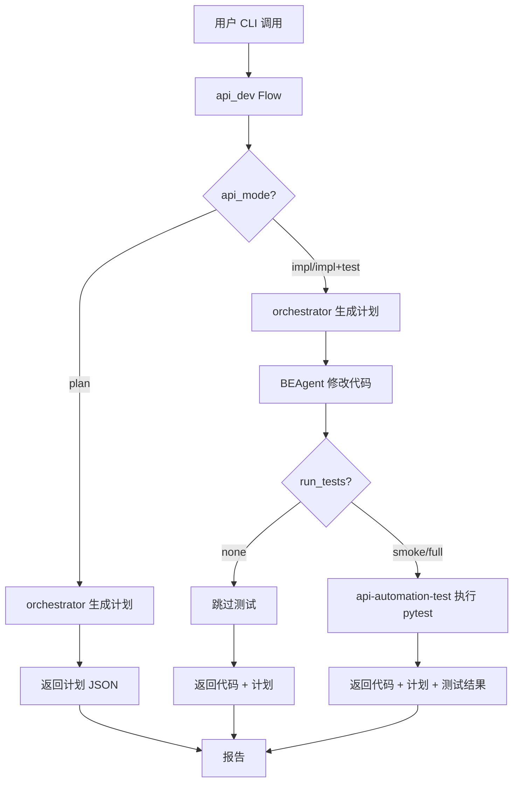

# API 开发生产线使用指南

## 1. 定位与目标

### 1.1 文档定位

本文档是 **后端 API 开发生产线（api_dev flow）的统一使用指南**，面向：

- **后端开发者**：通过 CLI 快速开发/修改 API 端点
- **测试工程师**：理解测试自动化如何与开发流水线集成
- **上层 Orchestrator/Skill**：通过结构化输入调用 api_dev flow

### 1.2 api_dev Flow 简介

`api_dev` 是 `agent_platform` 提供的统一 API 开发入口，内部协调以下组件：

- **ai-ad-api-dev-orchestrator** (v1.2.0)：生成开发计划 + 测试建议
- **BEAgent**：按计划修改代码（Schema / Router / Service）
- **ai-ad-api-automation-test** (v1.5)：执行 API Test Line（pytest / Newman）

**核心价值**：
- 遵循 `API_DEVELOPMENT_FLOW.md v2.3` 的 6 步标准流程
- 自动生成符合 SoT 规范的代码和测试
- 输出结构化测试建议供下游消费（对齐 `TEST_AUTOMATION_SOT v1.0.1`）

---

## 2. 核心概念

### 2.1 ai-ad-api-dev-orchestrator 的角色

**职责**：
- 生成开发计划（plan）：识别需要修改的文件、SoT 依赖、开发步骤
- 输出 `suggested_tests`：结构化测试建议数组，供下游 CLI/自动化消费

**输入**：`module` + `change_type` + `api_mode` + `task` + `endpoint`（可选）

**输出**：
```json
{
  "plan": {
    "module": "finance_profit",
    "change_type": "full_feature",
    "files_to_touch": ["schemas/...", "routers/...", "services/..."],
    "dev_steps": [...]
  },
  "suggested_tests": [
    {
      "skill": "ai-ad-api-automation-test",
      "mode": "RUN",
      "scope": "module",
      "target": "finance_profit"
    }
  ]
}
```

### 2.2 BEAgent 的角色

**职责**：
- 按 `plan` 修改代码文件（Schema / Router / Service 层）
- 支持 `auto_write` 模式：自动写入文件到磁盘（默认 `dry-run` 模式仅返回代码片段）

**输入**：`task` + `target_files` + `module`

**输出**：`changes` 字典（`file_path -> content`）

### 2.3 ai-ad-api-automation-test 的角色

**职责**：
- 执行 API Test Line（pytest 测试）
- 支持 `run_tests` 参数：`none`（跳过） / `smoke`（冒烟测试） / `full`（完整测试套件）

**输入**：`mode=backend` + `scope` + `target_module`

**输出**：测试执行结果（`executed`, `passed`, `failed`, `errors`）

### 2.4 TEST_AUTOMATION_SOT v1.0.1 中的 API Test Line 约束

**覆盖范围**（§3.2）：
- `backend/` 目录下的 API 端点测试
- 状态机流转测试（8-state DailyReport, 7-state Topup, 5-state Reconciliation）
- Ledger 分录测试（双账本隔离、余额计算）
- Newman/Postman Collection 契约测试

**不覆盖**：
- `agents/` 目录下的代码测试
- `.claude/skills/` 静态一致性检查

**支持模式**（§3.3）：
- `GENERATE`：生成 pytest 测试代码
- `RUN`：执行 pytest 测试
- `NEWMAN`：执行 Newman 契约测试
- `REPORT`：生成测试报告
- `REGRESSION`：回归测试编排

---

## 3. CLI 用法总览

### 3.1 基本命令格式

```bash
python -m agent_platform.cli orch \
  --flow api_dev \
  --module <module_name> \
  --change-type <change_type> \
  --api-mode <api_mode> \
  --run-tests <run_tests> \
  --task "<task_description>" \
  [--endpoint "<endpoint>"] \
  [--mode execute|dry-run]
```

### 3.2 参数详解

| 参数 | 类型 | 必填 | 默认值 | 说明 |
|------|------|------|--------|------|
| `--flow` | enum | ✅ | - | 必须为 `api_dev` |
| `--module` | enum | ✅ | - | 目标模块名（见 §3.3） |
| `--change-type` / `-C` | enum | ✅ | - | 变更类型（见 §3.4） |
| `--api-mode` | enum | ❌ | `impl+test` | API 开发模式（见 §3.5） |
| `--run-tests` | enum | ❌ | `smoke` | 测试执行级别（见 §3.6） |
| `--task` / `-t` | string | ✅ | - | 自然语言任务描述 |
| `--endpoint` | string | ❌ | - | 目标端点（如 `GET /api/v1/xxx`） |
| `--mode` | enum | ❌ | `dry-run` | 执行模式：`execute`（写入文件）或 `dry-run`（仅预览） |

### 3.3 module 枚举（13 个模块）

| module | Router 文件 | SoT 章节 | 状态机 | 说明 |
|--------|------------|---------|--------|------|
| `daily_reports` | `routers/daily_reports.py` | API_SOT §9 | 8-state | 日报管理 |
| `topup_requests` | `routers/topup.py` | API_SOT §10 | 7-state | 充值申请 |
| `ledger` | `routers/ledger.py` | API_SOT §11 | - | 资金账本 |
| `reconciliation` | `routers/reconciliation.py` | API_SOT §12 | 5-state | 对账管理 |
| `ad_accounts` | `routers/ad_accounts.py` | API_SOT §8 | ad_accounts.status | 广告账户 |
| `projects` | `routers/projects.py` | API_SOT §6 | projects.status | 项目管理 |
| `channels` | `routers/channels.py` | API_SOT §7 | - | 渠道管理 |
| `transfers` | `routers/transfers.py` | - | - | 转账管理 |
| `finance_profit` | `routers/finance_profit.py` | - | - | 利润分析 |
| `suppliers` | `routers/suppliers.py` | - | - | 供应商管理 |
| `settlements` | `routers/settlements.py` | - | - | 结算管理 |
| `trend_risk` | (daily_reports 子域) | - | - | 趋势风控 |
| `auth` | `routers/authentication.py` | API_SOT §5 | - | 认证授权 |

### 3.4 change-type 枚举（变更类型）

| change_type | 说明 | 典型场景 | 涉及文件 |
|-------------|------|---------|---------|
| `schema` | 仅改 Pydantic schema / DTO | 新增/修改请求响应模型 | `schemas/{module}.py` |
| `router` | 仅改 FastAPI router 层 | 修改端点路径、参数 | `routers/{module}.py` |
| `schema+router` | 同时改 schema + router | 大多数 API 修改场景 | `schemas/` + `routers/` |
| `tests` | 仅改/补测试 | 补充测试覆盖 | `tests/api/test_{module}_flow_generated.py` |
| `full_feature` | 新增/大改功能（schema + router + service + tests） | 全新功能开发 | `schemas/` + `services/` + `routers/` + `tests/` |
| `bugfix` | 修复缺陷（尽量不扩 schema） | Bug 修复 | `routers/` + `services/` |

### 3.5 api-mode 枚举（API 开发模式）

| api_mode | 说明 | 输出内容 | 推荐场景 |
|----------|------|---------|---------|
| `plan` | 只生成计划（不动代码） | 计划 JSON + 文件列表 | 方案确认、评估影响范围 |
| `impl` | 代码实现（可选 auto_write） | 代码片段 + 实现报告 | 快速实现、不跑测试 |
| `impl+test` | 代码 + 测试（**推荐默认**） | 代码 + 测试 + pytest 结果 | 标准开发流程 |
| `refactor` | 纯重构（不改业务行为） | 重构报告 + 回归测试建议 | 代码优化 |

### 3.6 run-tests 枚举（测试执行级别）

| run_tests | 说明 | 执行范围 | 典型用途 |
|-----------|------|---------|---------|
| `none` | 跳过测试 | 不调用 TestAgent | 仅生成代码，不验证 |
| `smoke` | 冒烟测试 | 模块级快速测试 | 开发中快速验证 |
| `full` | 完整测试套件 | 所有相关测试 | 上线前完整回归 |

---

## 4. 典型使用场景

### 4.1 示例 1：新增小功能

**场景**：为 `finance_profit` 模块新增利润查询 API

**CLI 命令**：
```bash
python -m agent_platform.cli orch \
  --flow api_dev \
  --module finance_profit \
  --change-type full_feature \
  --api-mode impl+test \
  --run-tests smoke \
  --task "为 finance_profit 模块新增利润查询 API，支持按项目和时间范围查询" \
  --endpoint "GET /api/v1/finance/profit/summary" \
  --mode execute
```

**预期 Pipeline 步骤**：
1. **Plan 阶段**：orchestrator 生成开发计划
   - 识别文件：`schemas/finance_profit.py`, `services/finance_profit_service.py`, `routers/finance_profit.py`, `tests/api/test_finance_profit_flow_generated.py`
   - 查阅 SoT：API_SOT.md v9.0, STATE_MACHINE.md v2.6, DATA_SCHEMA.md v5.2
2. **Impl 阶段**：BEAgent 生成代码
   - 生成 Schema（请求/响应模型）
   - 生成 Service 层（业务逻辑）
   - 生成 Router 层（FastAPI 端点）
   - 生成测试文件（pytest 用例）
3. **Test 阶段**：api-automation-test 执行测试
   - 运行 `pytest tests/api/test_finance_profit_flow_generated.py -v`
   - 返回测试结果（passed/failed）

**典型输出关键信息**：
- `plan.files_to_touch`: 4 个文件路径
- `impl_result.changes`: 4 个文件的完整代码
- `test_result.executed`: `true`
- `test_result.passed`: `15`（假设）
- `suggested_tests`: 包含模块级测试建议

### 4.2 示例 2：修复 bug

**场景**：修复 `daily_reports` 模块的状态转换 bug

**CLI 命令**：
```bash
python -m agent_platform.cli orch \
  --flow api_dev \
  --module daily_reports \
  --change-type bugfix \
  --api-mode impl+test \
  --run-tests smoke \
  --task "修复 daily_reports 模块中 raw_submitted 状态无法转换到 trend_pending 的问题" \
  --endpoint "POST /api/v1/daily-reports/{id}/submit" \
  --mode execute
```

**预期 Pipeline 步骤**：
1. **Plan 阶段**：识别需要修改的文件（通常为 `routers/` + `services/`）
2. **Impl 阶段**：BEAgent 修复状态转换逻辑
3. **Test 阶段**：运行相关测试验证修复

**典型输出关键信息**：
- `plan.files_to_touch`: 2 个文件（router + service）
- `impl_result.changes`: 修复后的代码
- `test_result.passed`: 测试通过数量

### 4.3 示例 3：只补测试

**场景**：为 `transfers` 模块补充测试覆盖

**CLI 命令**：
```bash
python -m agent_platform.cli orch \
  --flow api_dev \
  --module transfers \
  --change-type tests \
  --api-mode impl \
  --run-tests smoke \
  --task "为 transfers 模块补充测试用例，覆盖余额迁移的边界场景" \
  --mode execute
```

**预期 Pipeline 步骤**：
1. **Plan 阶段**：识别测试文件路径
2. **Impl 阶段**：BEAgent 生成/补充测试代码
3. **Test 阶段**：执行新生成的测试

**典型输出关键信息**：
- `plan.files_to_touch`: 仅测试文件
- `impl_result.changes`: 测试代码
- `test_result.passed`: 新增测试通过数量

### 4.4 示例 4：只看计划（评估影响范围）

**场景**：评估修改 `ledger` 模块的影响范围，不实际修改代码

**CLI 命令**：
```bash
python -m agent_platform.cli orch \
  --flow api_dev \
  --module ledger \
  --change-type schema+router \
  --api-mode plan \
  --run-tests none \
  --task "评估修改 ledger 模块的 schema 和 router 层的影响范围" \
  --mode dry-run
```

**预期 Pipeline 步骤**：
1. **Plan 阶段**：orchestrator 生成开发计划
2. **Impl 阶段**：跳过（`api_mode=plan`）
3. **Test 阶段**：跳过（`run_tests=none`）

**典型输出关键信息**：
- `plan.files_to_touch`: 需要修改的文件列表
- `plan.dev_steps`: 开发步骤清单
- `plan.sot_references`: 相关 SoT 文档引用
- `impl_result`: `null`（未执行）
- `test_result`: `null`（未执行）

---

## 5. 执行流程说明

### 5.1 流程图



### 5.2 何时仅产生 plan（不写文件）

**条件**：`--api-mode plan`

**行为**：
- orchestrator 生成开发计划
- **不调用** BEAgent
- **不调用** TestAgent
- 返回 `plan` JSON，包含 `files_to_touch`、`dev_steps`、`sot_references`

**用途**：方案确认、影响范围评估、SoT 依赖分析

### 5.3 何时会写入代码

**条件**：`--mode execute` 且 `api_mode != plan`

**行为**：
- BEAgent 生成代码后，如果 `auto_write=true`（通过 `--mode execute` 设置），会将 `changes` 写入磁盘
- 文件写入路径：`backend/{file_path}`（相对于项目根目录）

**注意**：
- 默认 `--mode dry-run` 仅返回代码片段，不写入文件
- 写入前会检查 `impl_success` 和 `test_success`（如果 `run_tests != none`）

### 5.4 何时会调用 pytest（通过 api-automation-test）

**条件**：`run_tests != "none"` 且 `impl_success == true`

**行为**：
- 调用 `ai-ad-api-automation-test` Skill，`mode=RUN`
- 执行 `pytest tests/api/test_{module}_flow_generated.py`（smoke）或完整测试套件（full）
- 返回测试结果：`executed`, `passed`, `failed`, `errors`

**失败处理**：
- 如果 `run_tests=smoke/full` 但测试失败，`overall_success` 为 `false`
- 如果 `auto_write=true`，测试失败时不会写入文件

---

## 6. 失败与降级策略

### 6.1 dev-orchestrator 调用失败

**症状**：
- CLI 返回 `success: false`
- `error` 字段包含错误信息（如 "Invalid module" / "Missing required field"）

**处理方式**：
1. **检查参数**：确认 `module`、`change_type`、`task` 等必填字段已提供
2. **验证枚举值**：确认 `module` 在 13 个模块列表中，`change_type` 在 6 个类型中
3. **查看日志**：使用 `--verbose` 查看详细错误信息

**常见错误**：
- `Missing required field: 'module'` → 添加 `--module` 参数
- `Invalid module: 'xxx'` → 检查模块名拼写，参考 §3.3 模块列表
- `Invalid change_type: 'xxx'` → 检查变更类型，参考 §3.4 枚举列表

### 6.2 BEAgent 修改失败或出错文件

**症状**：
- `impl_result.success: false`
- `impl_result.error` 包含错误信息

**定位方式**：
1. **查看 `steps.impl`**：检查 BEAgent 返回的错误详情
2. **检查 `plan.files_to_touch`**：确认目标文件路径是否正确
3. **查看日志**：使用 `--verbose` 查看 BEAgent 内部错误

**手动介入**：
- 如果 BEAgent 生成的代码有语法错误：
  1. 检查 `impl_result.changes` 中的代码片段
  2. 手动修复语法错误
  3. 重新运行 `api_dev`（或直接手动修改文件）
- 如果文件路径不存在：
  1. 确认 `backend/` 目录结构
  2. 手动创建缺失的目录
  3. 重新运行 `api_dev`

### 6.3 run-tests=smoke/full 触发失败

**区分「测试失败」vs「测试框架错误」**：

| 情况 | 症状 | 处理方式 |
|------|------|---------|
| **测试失败**（业务逻辑错误） | `test_result.executed: true`, `test_result.failed > 0` | 1. 查看失败用例详情<br>2. 修复业务逻辑<br>3. 重新运行测试 |
| **测试框架错误**（环境/配置问题） | `test_result.executed: false`, `test_result.error` 包含 pytest/import 错误 | 1. 检查 pytest 环境<br>2. 确认依赖安装<br>3. 检查测试文件路径 |

**建议的后续动作**：

1. **测试失败**：
   - 查看 `test_result` 中的失败用例列表
   - 修复业务逻辑或测试用例
   - 重新运行：`pytest tests/api/test_{module}_flow_generated.py -v`

2. **测试框架错误**：
   - 检查虚拟环境：`python --version`, `pip list | grep pytest`
   - 重新安装依赖：`pip install -r requirements.txt`
   - 检查测试文件是否存在：`ls backend/tests/api/test_{module}_flow_generated.py`

### 6.4 常见失败场景处理表

| 失败场景 | 错误信息示例 | 建议处理方式 |
|---------|------------|------------|
| **模块不存在** | `Invalid module: 'xxx'` | 检查 §3.3 模块列表，确认拼写正确 |
| **变更类型无效** | `Invalid change_type: 'xxx'` | 检查 §3.4 枚举列表，使用正确的 change_type |
| **任务描述为空** | `Missing required field: 'task'` | 添加 `--task` 参数，提供清晰的任务描述 |
| **BEAgent 生成失败** | `BEAgent error: ...` | 查看 `--verbose` 日志，检查目标文件路径和代码生成逻辑 |
| **测试执行失败** | `TestAgent error: pytest failed` | 区分测试失败 vs 框架错误，按 §6.3 处理 |
| **文件写入失败** | `Failed to write {file_path}` | 检查文件权限、磁盘空间、目录是否存在 |

---

## 7. 与 SoT 的关系

### 7.1 TEST_AUTOMATION_SOT v1.0.1 中的 API Test Line 约束

**API Test Line 覆盖范围**（TEST_AUTOMATION_SOT §3.2）：
- `backend/` 目录下的 API 端点测试
- 状态机流转测试（8-state DailyReport, 7-state Topup, 5-state Reconciliation）
- Ledger 分录测试（双账本隔离、余额计算）
- Newman/Postman Collection 契约测试

**API Test Line 不覆盖**：
- `agents/` 目录下的代码测试
- `.claude/skills/` 静态一致性检查

**api_dev 与 API Test Line 的集成**：
- `api_dev` 通过 `run_tests` 参数调用 `ai-ad-api-automation-test`（API Test Line 入口）
- `api_dev` 输出的 `suggested_tests` 数组符合 TEST_AUTOMATION_SOT v1.0.1 的测试建议格式

### 7.2 重大 API 变更建议 MUST 通过 api_dev

**以下场景建议 MUST 通过 `api_dev`**：

| 场景 | change_type | 理由 |
|------|-------------|------|
| **新增 API 端点** | `full_feature` | 需要生成 Schema + Router + Service + Tests，确保 SoT 对齐 |
| **修改 API 契约** | `schema+router` | 需要同步更新 Schema 和 Router，确保 API_SOT.md v9.0 对齐 |
| **修复状态机 Bug** | `bugfix` | 需要验证状态转换逻辑，确保 STATE_MACHINE.md v2.6 对齐 |
| **修改 Ledger 规则** | `schema+router` | 需要验证账本分录，确保 LEDGER_SOT.md v1.1 对齐 |

**可跳过 api_dev 的场景**：
- 文档 typo 修复
- 代码格式调整（不改变业务逻辑）
- 依赖版本升级（非破坏性）

### 7.3 api_dev 生成的 suggested_tests 作为默认参考

**suggested_tests 格式**（对齐 TEST_AUTOMATION_SOT v1.0.1）：

```json
{
  "suggested_tests": [
    {
      "skill": "ai-ad-api-automation-test",
      "mode": "RUN",
      "scope": "module",
      "target": "finance_profit",
      "reason": "full_feature 变更需验证模块实现"
    },
    {
      "skill": "ai-ad-api-automation-test",
      "mode": "REGRESSION",
      "scope": "smoke",
      "target": null,
      "reason": "大规模变更需回归测试基线"
    }
  ]
}
```

**使用建议**：
- 下游 CLI/自动化工具应优先执行 `suggested_tests` 中的测试建议
- 如果 `suggested_tests` 为空，表示当前变更不需要额外测试（如 `change_type=tests` 且 `api_mode=plan`）

---

## 8. 版本与维护

### 8.1 Change Log

| Version | Date | Changes |
|---------|------|---------|
| v1.0 | 2025-12-06 | 初版：基于 ai-ad-api-dev-orchestrator v1.2.0 和 TEST_AUTOMATION_SOT v1.0.1，系统性说明 api_dev flow 的 CLI 用法、执行流程、失败处理策略 |

### 8.2 相关文档

- **API 开发流程**：`docs/3.dev-guides/API_DEVELOPMENT_FLOW.md v2.3`
- **API 端点规范**：`docs/2.sot/API_SOT.md v9.0`
- **测试自动化 SoT**：`docs/2.sot/TEST_AUTOMATION_SOT_v1.0.1.md`
- **编排规范**：`docs/2.sot/AI_CODE_DEV_ORCHESTRATION_SOT_v1.0.md`

### 8.3 反馈与更新

如发现文档与实际实现不一致，请：
1. 检查 `agent_platform/cli.py` 和 `agents/agent_core/orchestrator_agent.py` 中的最新实现
2. 检查相关 Skill 文档（`.claude/skills/ai-ad-api-dev-orchestrator/SKILL.md`）
3. 提交 Issue 或 PR 更新本文档

---

**文档状态**：ready_for_production

