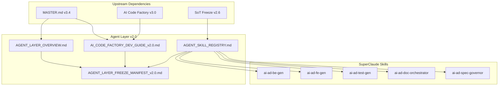

# Agent Layer 冻结清单 v2.0

> **冻结版本**: v2.0
> **冻结日期**: 2025-12-07
> **冻结状态**: ✅ **Ready for Production**
> **架构**: **SuperClaude Skill** (纯 Skill 架构)

---

## 1. 架构变更说明

### 1.1 重大变更 (v1.0 → v2.0)

| 变更项 | v1.0 | v2.0 |
|--------|------|------|
| **架构模式** | Python Agent + Skill 混合 | 纯 SuperClaude Skill |
| **代码位置** | `agents/`, `agent_platform/` | `.claude/skills/` |
| **调用方式** | Python API 调用 | 对话式调用 |
| **编排方式** | OrchestratorAgent | ai-ad-doc-orchestrator |

### 1.2 废弃组件

| 废弃组件 | 原位置 | 替代方案 |
|----------|--------|----------|
| OrchestratorAgent | `agents/agent_core/` | ai-ad-doc-orchestrator |
| BEAgent | `agents/agent_core/` | ai-ad-be-gen |
| FEAgent | `agents/agent_core/` | ai-ad-fe-gen |
| TestAgent | `agents/agent_core/` | ai-ad-test-gen |
| be_dev_skill | `agents/skills/` | ai-ad-be-gen |
| agents_config.py | `agents/` | `.claude/skills/README.md` |

---

## 2. 冻结范围

本次冻结涵盖 **ASDD Agent Layer (Layer 6)** 核心规范文档:

### 2.1 核心文档

| # | 文档名称 | 版本 | 状态 |
|---|---------|------|------|
| 1 | [AGENT_LAYER_OVERVIEW.md](./AGENT_LAYER_OVERVIEW.md) | v2.0 | ✅ Ready |
| 2 | [AI_CODE_FACTORY_DEV_GUIDE_v2.0.md](./AI_CODE_FACTORY_DEV_GUIDE_v2.0.md) | v3.0 | ✅ Ready |
| 3 | [AGENT_SKILL_REGISTRY.md](./AGENT_SKILL_REGISTRY.md) | v2.0 | ✅ Ready |
| 4 | [AGENT_SECURITY_SPEC.md](./AGENT_SECURITY_SPEC.md) | v1.0 | ⚠️ 需更新 |
| 5 | [AGENT_ORCHESTRATION_PIPELINE.md](./AGENT_ORCHESTRATION_PIPELINE.md) | v1.0 | ⚠️ 需更新 |
| 6 | [CODEX_LOOP_SPEC.md](./CODEX_LOOP_SPEC.md) | v1.0 | ✅ 保留 |
| 7 | [AGENT_VERSIONING_RULES.md](./AGENT_VERSIONING_RULES.md) | v1.0 | ✅ 保留 |

### 2.2 SuperClaude Skills 清单

| Skill | 版本 | 状态 |
|-------|------|------|
| ai-ad-be-gen | v2.0 | ✅ Production |
| ai-ad-fe-gen | v2.0 | ✅ Production |
| ai-ad-test-gen | v1.0 | ✅ Production |
| ai-ad-doc-orchestrator | v5.3 | ✅ Production |
| ai-ad-doc-fixer | v2.0 | ✅ Production |
| ai-project-doc-writer | v2.0 | ✅ Production |
| ai-master-architect | v1.0 | ✅ Production |
| ai-ad-spec-governor | v2.0 | ✅ Production |
| ai-doc-system-auditor | v1.0 | ✅ Production |
| ai-ad-api-automation-test | v1.0 | ✅ Production |
| prompt-engineer-skill | v1.0 | ✅ Production |

---

## 3. 版本对齐矩阵

### 3.1 与上游层的对齐

| Agent Layer 文档 | 依赖的上游层版本 |
|-----------------|----------------|
| **所有文档** | MASTER.md v3.4 |
| **所有文档** | SoT Freeze v2.6 |
| **所有文档** | AI Code Factory v3.0 |

### 3.2 Skills 与 SoT 对齐

| Skill | SoT 依赖 |
|-------|---------|
| ai-ad-be-gen | DATA_SCHEMA v5.2, STATE_MACHINE v2.6, API_SOT v9.0 |
| ai-ad-fe-gen | FRONTEND_RULES, UI_DESIGN_SYSTEM |
| ai-ad-test-gen | TESTING_STRATEGY v1.0 |
| ai-ad-spec-governor | 全部 SoT |

---

## 4. 变更记录

### v2.0 (2025-12-07) - 架构迁移

**重大变更**:
- 🔄 从 Python Agent 架构迁移到纯 SuperClaude Skill 架构
- 🔄 废弃 `agents/` 和 `agent_platform/` 目录
- 🔄 统一使用 `.claude/skills/` 作为 Skill 定义位置

**更新文档**:
- ✅ AGENT_LAYER_OVERVIEW.md → v2.0
- ✅ AI_CODE_FACTORY_DEV_GUIDE_v2.0.md → v3.0
- ✅ AGENT_SKILL_REGISTRY.md → v2.0

**保留文档**:
- AGENT_SECURITY_SPEC.md (概念仍适用)
- CODEX_LOOP_SPEC.md (概念仍适用)
- AGENT_VERSIONING_RULES.md (概念仍适用)

### v1.0 (2025-11-27) - 初始冻结

**新增**:
- 7 份 Agent Layer 规范文档

---

## 5. 使用指南

### 5.1 何时查阅 Agent Layer 文档

| 场景 | 推荐文档 |
|------|---------|
| **了解 AI 代码工厂** | AI_CODE_FACTORY_DEV_GUIDE_v2.0.md |
| **查看可用 Skills** | AGENT_SKILL_REGISTRY.md |
| **理解 Layer 6 定位** | AGENT_LAYER_OVERVIEW.md |
| **评估 Skill 安全** | AGENT_SECURITY_SPEC.md |
| **设计 Skill 编排** | AGENT_ORCHESTRATION_PIPELINE.md |
| **版本管理** | AGENT_VERSIONING_RULES.md |

### 5.2 快速开始

**后端代码生成**:
```
使用 ai-ad-be-gen 实现充值审批 API，
目标文件: schemas/topup.py, services/topup_service.py, routers/topups.py
```

**前端代码生成**:
```
使用 ai-ad-fe-gen 实现充值列表页面，模块: topups
```

**SoT 合规检查**:
```
/sot-check backend/services/topup_service.py
```

---

## 6. 依赖关系图



---

## 7. 后续计划

### 7.1 短期计划

- [ ] 更新 AGENT_SECURITY_SPEC.md 适配 Skill 架构
- [ ] 更新 AGENT_ORCHESTRATION_PIPELINE.md 描述 Skill 编排
- [ ] 完善 Skill 执行日志标准

### 7.2 中期计划

- [ ] CI/CD 集成 (GitHub Actions)
- [ ] 自动修复 Loop 机制
- [ ] MCP 协议集成

---

## 8. 签署

**冻结批准**:
- [x] ✅ 架构师审批: Wade (2025-12-07)

**生效日期**: 2025-12-07
**基准**: AI Code Factory v3.0 + SoT Freeze v2.6

---

**文档状态**: ✅ **Ready for Production**
**Agent Layer v2.0 正式冻结** 🎉
