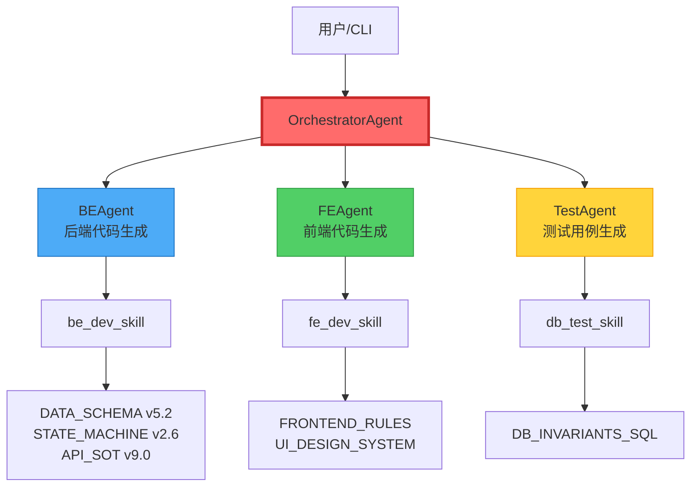
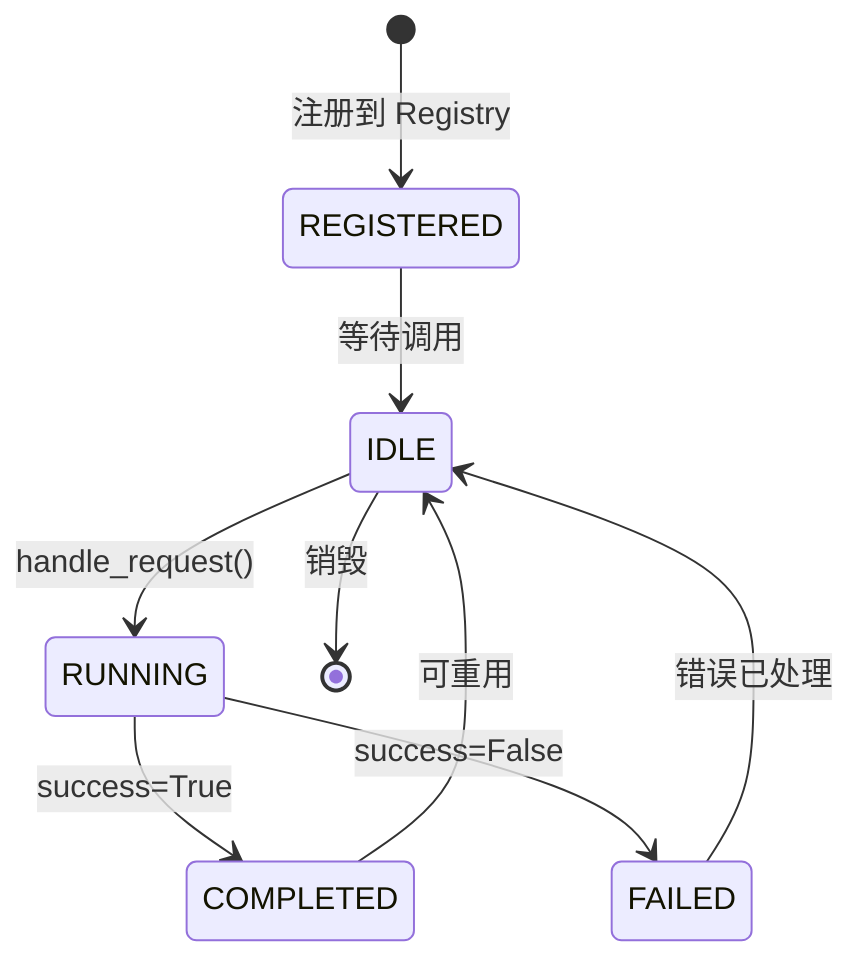
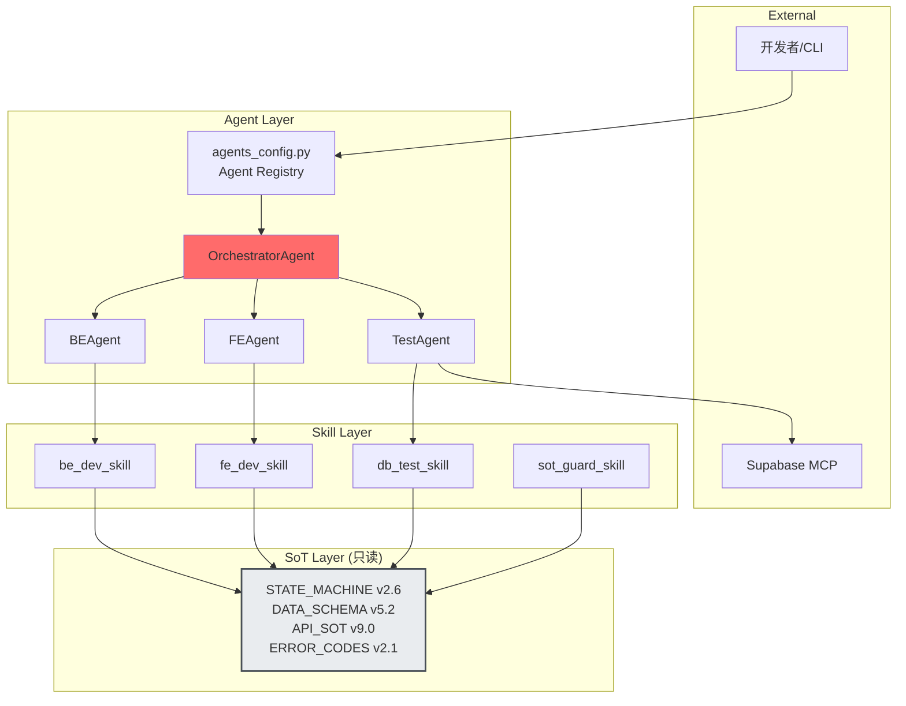
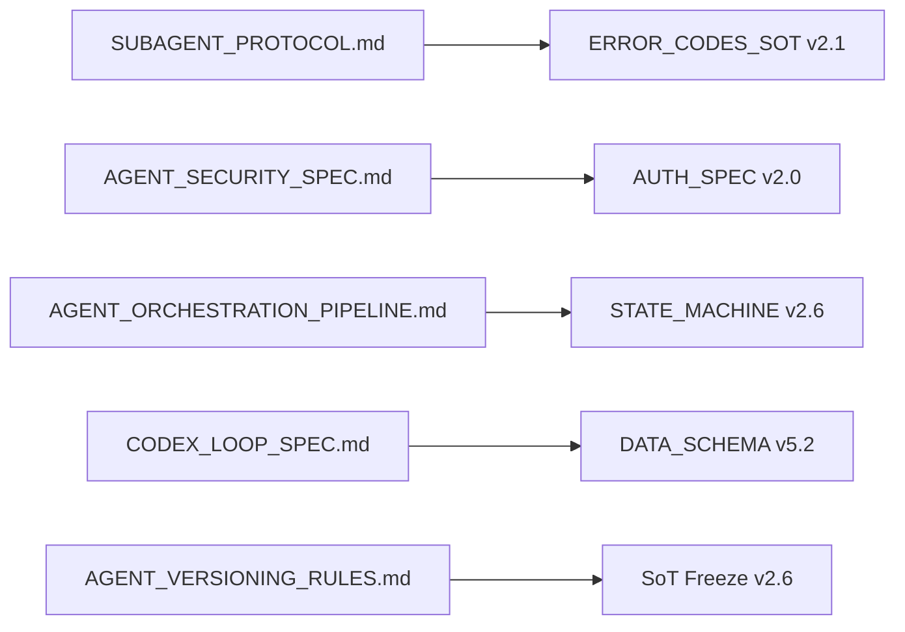
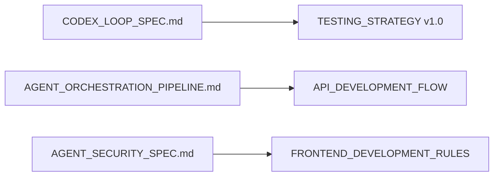
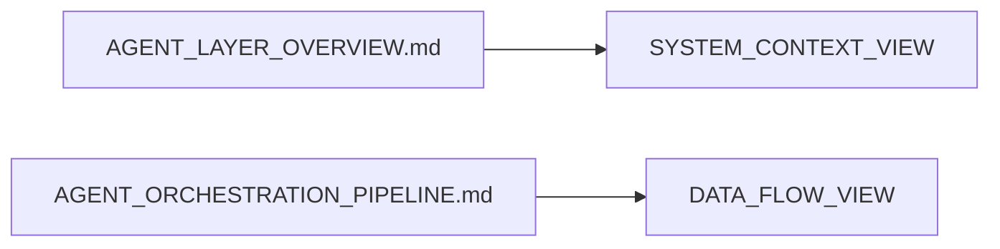
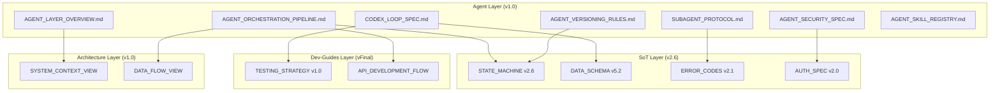

# Agent Layer 总览

> **文档版本**: v1.0
> **状态**: Draft
> **最后审查**: 2025-11-27
> **基准**: MASTER.md v4.4, SoT Freeze v2.6, Dev-Guides Freeze vFinal, Architecture Freeze v1.0, Infrastructure Freeze v1.0

---

## 1. Layer 6 定位与职责

### 1.1 ASDD 6 层架构中的 Agent Layer

**Agent Layer** 是 ASDD（AI-Spec-Driven Development）框架的第六层，专注于规范 AI Agent 系统的设计、开发、部署和治理。

**ASDD 6 层架构**:

```
┌─────────────────────────────────────────────────────────────┐
│ Layer 1: Overview (Freeze v1.0)                             │
│ MASTER.md v4.4 + PROJECT.md - 系统宪法与业务边界             │
└─────────────────────────────────────────────────────────────┘
                             ↓
┌─────────────────────────────────────────────────────────────┐
│ Layer 2: SoT (Freeze v2.6)                                  │
│ 10 SoT Documents - 状态机、数据模型、业务规则、API 规范      │
└─────────────────────────────────────────────────────────────┘
                             ↓
┌─────────────────────────────────────────────────────────────┐
│ Layer 3: Dev-Guides (Freeze vFinal)                         │
│ 10 Dev-Guide Documents - 开发流程、前后端规范、测试策略      │
└─────────────────────────────────────────────────────────────┘
                             ↓
┌─────────────────────────────────────────────────────────────┐
│ Layer 4: Architecture (Freeze v1.0)                         │
│ 7 Architecture Views - 系统上下文、数据流、服务组件          │
└─────────────────────────────────────────────────────────────┘
                             ↓
┌─────────────────────────────────────────────────────────────┐
│ Layer 5: Infrastructure (Freeze v1.0)                       │
│ 5 Infrastructure Specs - CI/CD、部署、可观测性               │
└─────────────────────────────────────────────────────────────┘
                             ↓
┌─────────────────────────────────────────────────────────────┐
│ Layer 6: Agent (v1.0 - 本层)                                │
│ 7 Agent Specs - Sub-Agent 协议、安全、编排、版本管理         │
└─────────────────────────────────────────────────────────────┘
```

**Agent Layer 核心使命**:
- 规范 AI Agent 系统的架构设计（Orchestrator + Sub-Agents）
- 定义 Agent 通信协议（Request/Response 格式）
- 保障 Agent 系统安全（权限模型、沙箱隔离、审计日志）
- 管理 Agent 版本演进（SemVer、兼容性矩阵、Breaking Changes）
- 指导 Skill 注册与调度（Skill Registry、依赖解析）

### 1.2 与 Infrastructure Layer 的边界

**职责对比**:

| 维度 | Infrastructure Layer | Agent Layer |
|------|---------------------|-------------|
| **关注点** | 基础设施即代码（IaC） | Agent 系统即代码（AgaC） |
| **核心主题** | CI/CD、部署、监控 | Agent 架构、安全、版本管理 |
| **执行时机** | 代码提交后（Git Push） | 开发时（API 调用） |
| **执行环境** | GitHub Actions、Railway | Agent Runtime（Python 进程） |
| **文档示例** | CI_PIPELINE_SPEC.md | AGENT_ORCHESTRATION_PIPELINE.md |

**边界原则**:
- Infrastructure Layer 负责 **部署** Agent 系统（如何部署到生产环境）
- Agent Layer 负责 **定义** Agent 系统（Agent 如何协调、通信、版本管理）
- 两者通过 **MCP（Model Context Protocol）** 集成

### 1.3 与 Architecture Layer 的关系

**职责对比**:

| 维度 | Architecture Layer | Agent Layer |
|------|-------------------|-------------|
| **抽象层次** | 高层架构视图 | 具体实现规范 |
| **关注点** | 系统上下文、数据流、组件关系 | Agent 接口、错误处理、安全机制 |
| **文档类型** | 架构图、视图文档 | 技术规范、协议定义 |
| **示例** | SYSTEM_CONTEXT_VIEW.md | SUBAGENT_PROTOCOL.md |

**关系说明**:
- Architecture Layer 提供 **宏观架构视图**（如 Agent 在系统中的位置）
- Agent Layer 提供 **微观实现规范**（如 Agent 的 Request/Response 格式）

### 1.4 Layer 6 的核心关注点

**7 大关注点**:

1. **Agent 协议规范** → SUBAGENT_PROTOCOL.md
2. **Agent 安全规范** → AGENT_SECURITY_SPEC.md
3. **Agent 编排流水线** → AGENT_ORCHESTRATION_PIPELINE.md
4. **Codex Loop（代码级 Agent）** → CODEX_LOOP_SPEC.md
5. **Agent 版本管理** → AGENT_VERSIONING_RULES.md
6. **Skill 注册与调度** → AGENT_SKILL_REGISTRY.md
7. **Agent Layer 治理** → AGENT_LAYER_FREEZE_MANIFEST_v1.0.md

---

## 2. Agent 系统架构概览

### 2.1 Orchestrator + Sub-Agents 模式

**架构图**（Mermaid C4 Level 2）:



**核心组件**:

1. **OrchestratorAgent** (总控协调器)
   - 职责: 协调多个 Sub-Agent，管理流水线执行
   - 不生成代码: 仅调度，不替代 Sub-Agent
   - 3 种内置流程: backend_only, frontend_only, full_pipeline

2. **BEAgent** (后端开发 Agent)
   - 职责: 生成 FastAPI Router、Service、Pydantic Schema
   - SoT 依赖: DATA_SCHEMA v5.2, STATE_MACHINE v2.6, BUSINESS_RULES v3.1
   - 委托 Skill: be_dev_skill

3. **FEAgent** (前端开发 Agent)
   - 职责: 生成 Next.js 组件、TanStack Query Hooks
   - SoT 依赖: FRONTEND_RULES, UI_DESIGN_SYSTEM
   - 委托 Skill: fe_dev_skill

4. **TestAgent** (测试 Agent)
   - 职责: 生成数据库不变量测试 Prompt
   - SoT 依赖: DB_INVARIANTS_SQL, TESTING_STRATEGY v1.0
   - 委托 Skill: db_test_skill

### 2.2 Agent 生命周期

**生命周期状态机**:



**状态说明**:

| 状态 | 描述 | 触发条件 |
|------|------|---------|
| **REGISTERED** | Agent 已注册到 `agents_config.py` | `create_agent("be")` |
| **IDLE** | Agent 空闲，等待请求 | 初始化完成 |
| **RUNNING** | Agent 正在执行任务 | `handle_request(request)` |
| **COMPLETED** | Agent 任务完成（成功） | `return {"success": True}` |
| **FAILED** | Agent 任务失败 | `return {"success": False}` |

### 2.3 Agent vs Skill 的职责分工

**职责对比**:

| 维度 | Agent | Skill |
|------|-------|-------|
| **定义** | 类（Class） | 函数（Function） |
| **接口** | `handle_request(request)` | `skill_func(task, files)` |
| **职责** | 参数验证、日志记录、错误处理 | 核心业务逻辑（代码生成） |
| **SoT 加载** | Agent 负责加载 SoT 文档 | Skill 接收预加载的 SoT 内容 |
| **可重用性** | Agent 可复用（Stateless） | Skill 纯函数（无状态） |
| **示例** | `BEAgent` | `be_dev_skill()` |

**协作模式**:

```python
# Agent 负责：参数验证、日志、错误处理
class BEAgent:
    def handle_request(self, request):
        # 1. 参数验证
        validation_error = validate_task_and_files(task, files)
        if validation_error:
            return validation_error

        # 2. 日志记录
        logger.info(f"BE Agent processing task: {task}")

        # 3. 调用 Skill
        result = be_dev_skill(task, files)  # ← Skill 做核心逻辑

        # 4. 错误处理
        if not result["success"]:
            logger.error(f"BE Agent failed: {result['error']}")

        return result
```

### 2.4 Agent 系统架构图

**完整架构图**（C4 Level 2）:



---

## 3. Agent Layer 文档导航

### 3.1 何时查阅 SUBAGENT_PROTOCOL.md

**适用场景**:
- ✅ 开发新的 Sub-Agent（如 DocsAgent）
- ✅ 修改现有 Agent 的 `handle_request` 接口
- ✅ 定义 Request/Response 格式
- ✅ 处理 Agent 错误（对齐 ERROR_CODES_SOT v2.1）

**关键内容**:
- `AgentProtocol` 接口定义
- `AgentResponse` TypedDict 规范
- 错误处理协议
- 超时与重试机制

### 3.2 何时查阅 AGENT_SECURITY_SPEC.md

**适用场景**:
- ✅ 评估 Agent 安全风险（威胁模型）
- ✅ 配置 Agent 权限（文件系统、数据库、API）
- ✅ 实施沙箱隔离（Docker 容器）
- ✅ 审查代码生成（黑名单关键词）

**关键内容**:
- 威胁模型（T-AGENT-001 ~ T-AGENT-004）
- Agent 权限模型（READ_ONLY / READ_WRITE / ADMIN）
- 沙箱隔离机制
- 审计日志规范

### 3.3 何时查阅 AGENT_ORCHESTRATION_PIPELINE.md

**适用场景**:
- ✅ 设计新的编排流程（如 docs_only）
- ✅ 处理 Sub-Agent 依赖关系（DAG）
- ✅ 实施错误传播与回滚策略
- ✅ 对比 Agent Pipeline vs CI Pipeline

**关键内容**:
- 3 种内置流程（backend_only, frontend_only, full_pipeline）
- 编排模式（串行、并行、条件分支、循环）
- Sub-Agent 依赖管理
- 错误传播与回滚策略

### 3.4 何时查阅 CODEX_LOOP_SPEC.md

**适用场景**:
- ✅ 开发代码审查 Agent（Code Review Mode）
- ✅ 开发代码重构 Agent（Code Refactor Mode）
- ✅ 开发代码生成 Agent（Code Generation Mode）
- ✅ 对齐 TESTING_STRATEGY v1.0（测试驱动重构）

**关键内容**:
- Codex Loop 定义与使用场景
- 3 种模式（Review / Refactor / Generation）
- 安全限制（只读模式、沙箱模式）
- 与 TESTING_STRATEGY.md 的对齐

### 3.5 何时查阅 AGENT_VERSIONING_RULES.md

**适用场景**:
- ✅ 发布新版本 Agent（v1.0 → v2.0）
- ✅ 处理 Breaking Changes（接口签名变更）
- ✅ 评估 Agent 兼容性（Agent A v1.0 ↔ Agent B v2.0）
- ✅ 对齐 SoT 版本（SoT v2.6 → Agent 需要 v1.1+）

**关键内容**:
- 语义化版本（SemVer）规则
- Agent 兼容性矩阵
- Breaking Changes 处理流程
- Agent Deprecation 策略

### 3.6 何时查阅 AGENT_SKILL_REGISTRY.md

**适用场景**:
- ✅ 注册新的 Skill（如 refactor_skill）
- ✅ 解析 Skill 依赖关系（Skill A 依赖 Skill B）
- ✅ 处理 Skill 冲突（多个 Skill 处理同一任务）
- ✅ 集成 Claude Skills（.claude/skills/）

**关键内容**:
- Skill 定义与分类（Doc / Code / Test）
- Skill 注册机制（_SKILL_REGISTRY）
- Skill 依赖解析（DAG）
- 与 .claude/skills/ 的对齐

---

## 4. 版本对齐矩阵

### 4.1 Agent Layer 依赖的上游层版本

**Baseline 依赖**:

| 上游层 | 版本 | Agent Layer 引用位置 |
|--------|------|---------------------|
| **MASTER.md** | v3.4 | 所有文档的 baseline 字段 |
| **SoT Layer** | Freeze v2.6 | SUBAGENT_PROTOCOL.md（错误码）、AGENT_SECURITY_SPEC.md（权限模型） |
| **Dev-Guides Layer** | Freeze vFinal | CODEX_LOOP_SPEC.md（测试策略）、AGENT_ORCHESTRATION_PIPELINE.md（开发流程） |
| **Architecture Layer** | Freeze v1.0 | AGENT_LAYER_OVERVIEW.md（架构视图）、AGENT_ORCHESTRATION_PIPELINE.md（组件关系） |
| **Infrastructure Layer** | Freeze v1.0 | AGENT_SECURITY_SPEC.md（部署安全）、AGENT_ORCHESTRATION_PIPELINE.md（CI/CD 对比） |

### 4.2 Agent Layer 与 SoT 版本的对齐规则

**对齐原则**:
1. **只读约束**: Agent Layer 文档只能 **引用** SoT，不能 **修改** SoT
2. **版本锁定**: 引用 SoT 时必须明确版本号（如 STATE_MACHINE v2.6）
3. **追溯性**: 每个引用必须可追溯到具体章节（如 §3.2）

**对齐示例**:

```markdown
# SUBAGENT_PROTOCOL.md

## 4. 错误处理协议

本协议错误码必须对齐 **ERROR_CODES_SOT v2.1 §2**。

示例错误码映射：
- VAL-001: 参数验证失败 → AgentResponse.error = "VAL-001: Missing required field 'task'"
- BE-001: 后端生成失败 → AgentResponse.error = "BE-001: LLM API call timeout"
```

### 4.3 版本变更影响分析

**影响矩阵**:

| SoT 版本变更 | 影响的 Agent Layer 文档 | 需要更新的内容 |
|-------------|----------------------|--------------|
| **STATE_MACHINE v2.6 → v2.7** | AGENT_ORCHESTRATION_PIPELINE.md | 状态机流程图需要同步更新 |
| **ERROR_CODES_SOT v2.1 → v2.2** | SUBAGENT_PROTOCOL.md | 错误码映射表需要同步更新 |
| **AUTH_SPEC v2.0 → v2.1** | AGENT_SECURITY_SPEC.md | 权限模型需要重新对齐 |
| **TESTING_STRATEGY v1.0 → v1.1** | CODEX_LOOP_SPEC.md | 测试驱动重构流程需要同步更新 |

---

## 5. Agent 生命周期状态机

### 5.1 状态定义

| 状态 | 描述 | 可执行操作 |
|------|------|-----------|
| **REGISTERED** | Agent 已注册到 Registry | 查询 Agent 元信息 |
| **IDLE** | Agent 空闲，可接收请求 | 调用 `handle_request()` |
| **RUNNING** | Agent 正在执行任务 | 查询执行状态、取消任务 |
| **COMPLETED** | Agent 任务完成（成功） | 获取结果、重用 Agent |
| **FAILED** | Agent 任务失败 | 获取错误信息、重试任务 |

### 5.2 状态转换规则

**转换表**:

| 当前状态 | 事件 | 下一状态 | 条件 |
|---------|------|---------|------|
| REGISTERED | `create_agent("be")` | IDLE | Agent 初始化成功 |
| IDLE | `handle_request(request)` | RUNNING | 参数验证通过 |
| RUNNING | LLM API 返回成功 | COMPLETED | `success=True` |
| RUNNING | LLM API 返回失败 | FAILED | `success=False` |
| COMPLETED | 无操作 | IDLE | Agent 可重用（Stateless） |
| FAILED | 错误已记录 | IDLE | Agent 可重用（Stateless） |

### 5.3 状态管理最佳实践

**实践原则**:

1. **无状态 Agent** (推荐)
   - Agent 实例不保存任务状态
   - 每次调用 `handle_request()` 都是独立的
   - 示例: BEAgent, FEAgent, TestAgent

2. **有状态 Agent** (特殊场景)
   - Agent 实例保存任务状态（如进度、缓存）
   - 需要实现状态持久化（数据库 / Redis）
   - 示例: LongRunningAgent（批量任务）

3. **状态查询 API**
   - 提供 `get_status(agent_id)` 查询接口
   - 返回当前状态、执行进度、错误信息

---

## 6. 引用关系图

### 6.1 Agent Layer → SoT Layer 引用关系



### 6.2 Agent Layer → Dev-Guides Layer 引用关系



### 6.3 Agent Layer → Architecture Layer 引用关系



### 6.4 完整引用关系图



---

## 7. 术语表

| 术语 | 定义 | 示例 |
|------|------|------|
| **AgentProtocol** | Agent 接口协议，定义 `handle_request` 方法签名 | `class BEAgent implements AgentProtocol` |
| **Sub-Agent** | 被 Orchestrator 调度的子 Agent | BEAgent, FEAgent, TestAgent |
| **Orchestrator** | 总控协调器，管理多个 Sub-Agent 的流水线执行 | OrchestratorAgent |
| **Skill** | 纯函数，实现核心业务逻辑（代码生成、测试生成） | `be_dev_skill(task, files)` |
| **Codex Loop** | 代码级 Agent，专注于代码审查、重构、生成 | Code Review Agent, Refactor Agent |
| **MCP** | Model Context Protocol，Agent 与外部服务的集成协议 | Supabase MCP |
| **AgentResponse** | Agent 返回格式，包含 success、data、error 字段 | `{"success": True, "data": {...}, "error": None}` |
| **Agent Registry** | Agent 注册中心，管理所有 Agent 的元信息与工厂函数 | `agents_config.py` |
| **SoT** | Single Source of Truth，真相源文档，Agent 只读不写 | STATE_MACHINE v2.6, DATA_SCHEMA v5.2 |
| **Baseline** | 文档依赖的上游层版本，用于追溯性管理 | `baseline: MASTER.md v4.4, SoT Freeze v2.6` |

---

## 8. 引用文献

**本文档引用的规范**:
- MASTER.md v4.4 §5 - ASDD 框架定义
- RFC-2025-001 - Agent Layer 提案
- agents/agents_config.py - Agent Registry 实现
- agents/agent_core/orchestrator_agent.py - Orchestrator 实现
- agents/tools/types.py - AgentResponse 定义
- ERROR_CODES_SOT v2.1 - 错误码规范
- STATE_MACHINE v2.6 - 状态机规范
- AUTH_SPEC v2.0 - 权限模型
- ARCHITECTURE_FREEZE_MANIFEST v1.0 - 架构层冻结清单

**下一步阅读**:
- [SUBAGENT_PROTOCOL.md](./SUBAGENT_PROTOCOL.md) - Sub-Agent 通信协议
- [AGENT_SECURITY_SPEC.md](./AGENT_SECURITY_SPEC.md) - Agent 安全规范
- [AGENT_ORCHESTRATION_PIPELINE.md](./AGENT_ORCHESTRATION_PIPELINE.md) - Agent 编排流水线

---

**文档状态**: ✅ Draft - 待审计
**健康度**: 待评估（P0/P1/P2）
**下一步**: 提交 ai-ad-doc-system-auditor 审计
