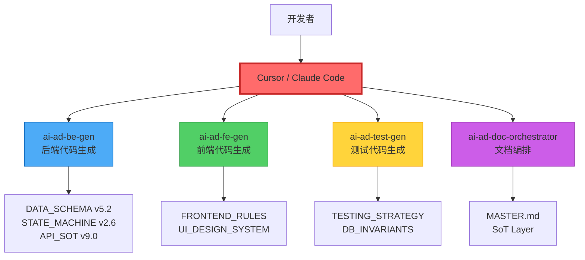
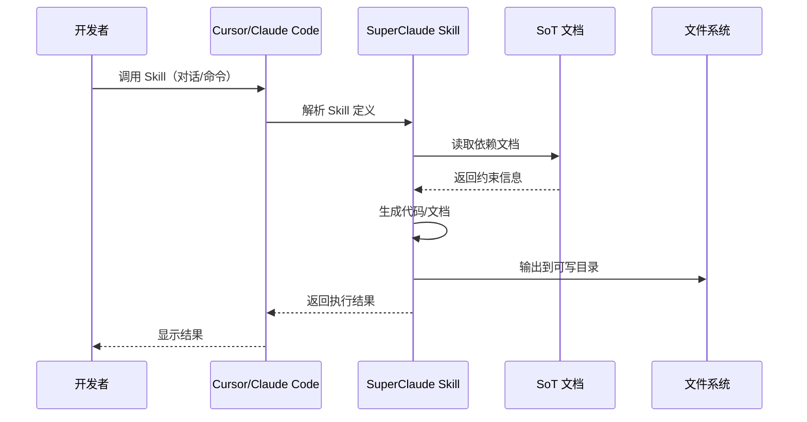
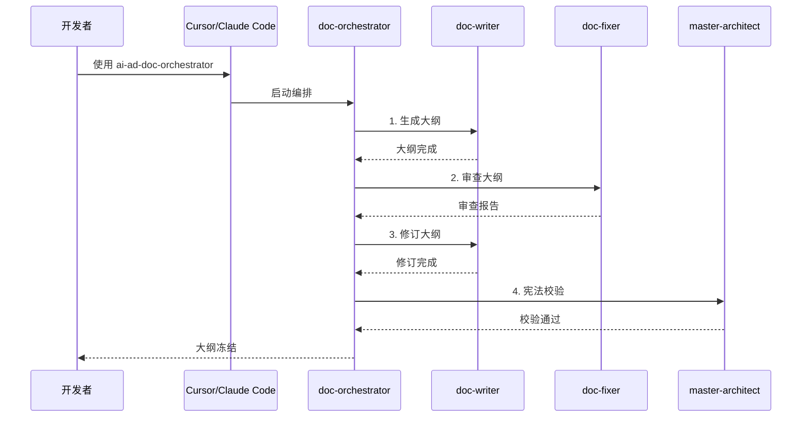
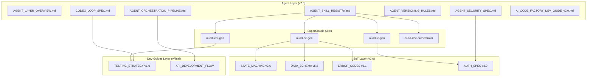

# Agent Layer 总览

> **文档版本**: v2.0
> **状态**: Production
> **最后审查**: 2025-12-07
> **基准**: MASTER.md v3.4, SoT Freeze v2.6, AI Code Factory v3.0

---

## 1. Layer 6 定位与职责

### 1.1 ASDD 6 层架构中的 Agent Layer

**Agent Layer** 是 ASDD（AI-Spec-Driven Development）框架的第六层，专注于规范 **SuperClaude Skill 系统**的设计、调用、治理和版本管理。

> ⚠️ **架构变更 (v2.0)**: 本层已从 Python Agent 架构迁移到纯 SuperClaude Skill 架构。

**ASDD 6 层架构**:

```
┌─────────────────────────────────────────────────────────────┐
│ Layer 1: Overview (Freeze v1.0)                             │
│ MASTER.md v3.4 + PROJECT.md - 系统宪法与业务边界             │
└─────────────────────────────────────────────────────────────┘
                             ↓
┌─────────────────────────────────────────────────────────────┐
│ Layer 2: SoT (Freeze v2.6)                                  │
│ 10 SoT Documents - 状态机、数据模型、业务规则、API 规范      │
└─────────────────────────────────────────────────────────────┘
                             ↓
┌─────────────────────────────────────────────────────────────┐
│ Layer 3: Dev-Guides (Freeze vFinal)                         │
│ 10 Dev-Guide Documents - 开发流程、前后端规范、测试策略      │
└─────────────────────────────────────────────────────────────┘
                             ↓
┌─────────────────────────────────────────────────────────────┐
│ Layer 4: Architecture (Freeze v1.0)                         │
│ 7 Architecture Views - 系统上下文、数据流、服务组件          │
└─────────────────────────────────────────────────────────────┘
                             ↓
┌─────────────────────────────────────────────────────────────┐
│ Layer 5: Infrastructure (Freeze v1.0)                       │
│ 5 Infrastructure Specs - CI/CD、部署、可观测性               │
└─────────────────────────────────────────────────────────────┘
                             ↓
┌─────────────────────────────────────────────────────────────┐
│ Layer 6: Agent (v2.0 - 本层)                                │
│ SuperClaude Skills - 代码生成、文档编排、SoT 治理            │
└─────────────────────────────────────────────────────────────┘
```

**Agent Layer 核心使命**:
- 规范 SuperClaude Skill 系统的设计与调用
- 定义 Skill 的输入输出格式
- 保障 Skill 执行安全（输出边界、SoT 约束）
- 管理 Skill 版本演进（SemVer、Breaking Changes）
- 指导 Skill 注册与分类（Skills 目录结构）

### 1.2 与 Infrastructure Layer 的边界

**职责对比**:

| 维度 | Infrastructure Layer | Agent Layer |
|------|---------------------|-------------|
| **关注点** | 基础设施即代码（IaC） | Skill 系统即代码（SaC） |
| **核心主题** | CI/CD、部署、监控 | Skill 定义、安全、版本管理 |
| **执行时机** | 代码提交后（Git Push） | 开发时（对话式调用） |
| **执行环境** | GitHub Actions、Railway | Cursor / Claude Code |
| **文档示例** | CI_PIPELINE_SPEC.md | AGENT_SKILL_REGISTRY.md |

### 1.3 与 Architecture Layer 的关系

**职责对比**:

| 维度 | Architecture Layer | Agent Layer |
|------|-------------------|-------------|
| **抽象层次** | 高层架构视图 | 具体实现规范 |
| **关注点** | 系统上下文、数据流、组件关系 | Skill 接口、SoT 依赖、安全机制 |
| **文档类型** | 架构图、视图文档 | 技术规范、Skill 定义 |
| **示例** | SYSTEM_CONTEXT_VIEW.md | AGENT_SKILL_REGISTRY.md |

### 1.4 Layer 6 的核心关注点

**6 大关注点**:

1. **Skill 注册与分类** → AGENT_SKILL_REGISTRY.md
2. **Skill 安全规范** → AGENT_SECURITY_SPEC.md
3. **Skill 编排模式** → AGENT_ORCHESTRATION_PIPELINE.md
4. **Codex Loop（代码级操作）** → CODEX_LOOP_SPEC.md
5. **Skill 版本管理** → AGENT_VERSIONING_RULES.md
6. **AI 代码工厂指南** → AI_CODE_FACTORY_DEV_GUIDE_v2.0.md

---

## 2. SuperClaude Skill 架构概览

### 2.1 纯 Skill 架构模式

**架构图**（Mermaid C4 Level 2）:



**核心 Skills**:

1. **ai-ad-be-gen** (后端代码生成)
   - 职责: 生成 FastAPI Router、Service、Pydantic Schema
   - SoT 依赖: DATA_SCHEMA v5.2, STATE_MACHINE v2.6, BUSINESS_RULES v3.1
   - 输出边界: `backend/schemas/`, `backend/services/`, `backend/routers/`

2. **ai-ad-fe-gen** (前端代码生成)
   - 职责: 生成 Next.js 页面、组件、TanStack Query Hooks
   - SoT 依赖: FRONTEND_RULES, UI_DESIGN_SYSTEM
   - 输出边界: `frontend/src/modules/`, `frontend/src/lib/api/`

3. **ai-ad-test-gen** (测试代码生成)
   - 职责: 生成 pytest 单元测试、vitest 前端测试
   - SoT 依赖: TESTING_STRATEGY v1.0
   - 输出边界: `backend/tests/`, `frontend/src/__tests__/`

4. **ai-ad-doc-orchestrator** (文档编排)
   - 职责: 编排文档生成流程（大纲→正文→审查→冻结）
   - 子 Skills: ai-project-doc-writer, ai-ad-doc-fixer, ai-master-architect
   - 输出边界: `docs/`

### 2.2 Skill 目录结构

```
.claude/
├── skills/                          # SuperClaude Skills 目录
│   ├── README.md                    # Skills 索引
│   │
│   ├── ai-ad-be-gen/               # 后端代码生成
│   │   └── SKILL.md
│   │
│   ├── ai-ad-fe-gen/               # 前端代码生成
│   │   └── SKILL.md
│   │
│   ├── ai-ad-test-gen/             # 测试代码生成
│   │   └── SKILL.md
│   │
│   ├── ai-ad-doc-orchestrator/     # 文档编排总控
│   │   └── SKILL.md
│   │
│   ├── ai-ad-doc-fixer/            # 文档审查修复
│   │   └── skill.md
│   │
│   ├── ai-project-doc-writer/      # 文档内容生成
│   │   └── skill.md
│   │
│   ├── ai-master-architect/        # 宪法级校验
│   │   └── skill.md
│   │
│   ├── ai-ad-spec-governor/        # SoT 合规治理
│   │   └── SKILL.md
│   │
│   └── prompt-engineer-skill/      # Prompt 工程辅助
│       └── SKILL.md
│
├── commands/                        # Slash Commands
│   ├── sot-check.md                # /sot-check
│   └── doc-agent.md                # /doc-agent
│
└── README.md                        # AI 代码工厂主入口
```

### 2.3 Skill 调用方式

**方法 1: 对话式调用（推荐）**

```
使用 ai-ad-be-gen 实现充值审批 API，
目标文件: schemas/topup.py, services/topup_service.py, routers/topups.py
```

**方法 2: Slash Command**

```
/sot-check backend/services/topup_service.py
```

**方法 3: 工作流编排**

```
请按以下步骤执行：
1. 使用 ai-project-doc-writer 生成 PROJECT.md 大纲
2. 使用 ai-ad-doc-fixer 审查大纲
3. 使用 ai-master-architect 进行宪法级校验
```

### 2.4 Skill 分类体系

| 类别 | Skills | 职责 |
|------|--------|------|
| **代码生成** | ai-ad-be-gen, ai-ad-fe-gen, ai-ad-test-gen | 生成后端/前端/测试代码 |
| **文档处理** | ai-ad-doc-orchestrator, ai-project-doc-writer, ai-ad-doc-fixer, ai-master-architect | 文档编排、生成、审查 |
| **治理** | ai-ad-spec-governor, ai-doc-system-auditor | SoT 合规检查、文档审计 |
| **工具** | prompt-engineer-skill | Prompt 工程辅助 |

---

## 3. Agent Layer 文档导航

### 3.1 何时查阅 AGENT_SKILL_REGISTRY.md

**适用场景**:
- ✅ 了解所有可用 Skills 及其版本
- ✅ 查看 Skill 分类与 SoT 依赖
- ✅ 新增 Skill 时参考注册规范
- ✅ 检查 Skill 输出边界

### 3.2 何时查阅 AGENT_SECURITY_SPEC.md

**适用场景**:
- ✅ 评估 Skill 安全风险
- ✅ 配置 Skill 输出边界（可写/禁止目录）
- ✅ 审查代码生成安全性
- ✅ 设计 SoT 只读约束

### 3.3 何时查阅 AGENT_ORCHESTRATION_PIPELINE.md

**适用场景**:
- ✅ 设计多 Skill 协作流程
- ✅ 处理 Skill 依赖关系
- ✅ 实施错误处理策略
- ✅ 对比 Skill 编排 vs CI Pipeline

### 3.4 何时查阅 CODEX_LOOP_SPEC.md

**适用场景**:
- ✅ 实现代码审查功能
- ✅ 实现代码重构功能
- ✅ 对齐 TESTING_STRATEGY v1.0
- ✅ 设计测试驱动开发流程

### 3.5 何时查阅 AI_CODE_FACTORY_DEV_GUIDE_v2.0.md

**适用场景**:
- ✅ 新开发者入门指南
- ✅ 了解 AI 代码工厂整体架构
- ✅ 学习 Skill 使用最佳实践
- ✅ 查看常见问题解答

---

## 4. 版本对齐矩阵

### 4.1 Agent Layer 依赖的上游层版本

**Baseline 依赖**:

| 上游层 | 版本 | Agent Layer 引用位置 |
|--------|------|---------------------|
| **MASTER.md** | v3.4 | 所有文档的 baseline 字段 |
| **SoT Layer** | Freeze v2.6 | Skills 的 sot_dependencies |
| **Dev-Guides Layer** | Freeze vFinal | CODEX_LOOP_SPEC.md |
| **Architecture Layer** | Freeze v1.0 | AGENT_LAYER_OVERVIEW.md |
| **Infrastructure Layer** | Freeze v1.0 | AGENT_SECURITY_SPEC.md |

### 4.2 Skill 与 SoT 版本的对齐规则

**对齐原则**:
1. **只读约束**: Skill 只能 **读取** SoT，不能 **修改** SoT
2. **版本锁定**: Skill 必须声明依赖的 SoT 版本（如 STATE_MACHINE v2.6）
3. **输出边界**: Skill 必须声明可写目录和禁止目录

**示例 SKILL.md 结构**:

```yaml
---
name: ai-ad-be-gen
version: "2.0"
status: production
sot_dependencies:
  required:
    - docs/2.sot/DATA_SCHEMA.md
    - docs/2.sot/STATE_MACHINE.md
    - docs/2.sot/BUSINESS_RULES.md
output_boundaries:
  writable:
    - backend/schemas/**
    - backend/services/**
    - backend/routers/**
  forbidden:
    - backend/models/**
    - migrations/**
---
```

### 4.3 版本变更影响分析

**影响矩阵**:

| SoT 版本变更 | 影响的 Skills | 需要更新的内容 |
|-------------|--------------|--------------|
| **STATE_MACHINE v2.6 → v2.7** | ai-ad-be-gen | 状态枚举引用 |
| **ERROR_CODES_SOT v2.1 → v2.2** | ai-ad-be-gen, ai-ad-fe-gen | 错误码映射 |
| **DATA_SCHEMA v5.2 → v5.3** | ai-ad-be-gen, ai-ad-test-gen | 字段定义 |
| **API_SOT v9.0 → v9.1** | ai-ad-be-gen, ai-ad-fe-gen | API 契约 |

---

## 5. Skill 执行流程

### 5.1 单 Skill 执行流程



### 5.2 多 Skill 编排流程



---

## 6. 引用关系图

### 6.1 完整引用关系图



---

## 7. 术语表

| 术语 | 定义 | 示例 |
|------|------|------|
| **SuperClaude Skill** | Markdown 定义的 AI 能力单元，通过对话式调用 | ai-ad-be-gen |
| **SKILL.md** | Skill 定义文件，包含 YAML frontmatter 和执行指令 | `.claude/skills/ai-ad-be-gen/SKILL.md` |
| **SoT 依赖** | Skill 必须读取的真相源文档 | DATA_SCHEMA v5.2 |
| **输出边界** | Skill 可写/禁止的目录范围 | `backend/schemas/**` |
| **Slash Command** | 快捷命令入口 | `/sot-check` |
| **Skill 编排** | 多 Skill 协作的工作流 | doc-orchestrator 编排 writer + fixer |
| **SoT** | Single Source of Truth，真相源文档 | STATE_MACHINE v2.6 |

---

## 8. 废弃说明

> ⚠️ **重要**: 以下组件已废弃，不再维护。

| 废弃组件 | 原位置 | 替代方案 |
|----------|--------|----------|
| **Python Agent 系统** | `agents/` | SuperClaude Skills |
| **Agent Platform** | `agent_platform/` | SuperClaude Skills |
| **OrchestratorAgent** | `agents/agent_core/` | ai-ad-doc-orchestrator |
| **BEAgent** | `agents/agent_core/` | ai-ad-be-gen |
| **FEAgent** | `agents/agent_core/` | ai-ad-fe-gen |
| **TestAgent** | `agents/agent_core/` | ai-ad-test-gen |
| **/agent 命令** | `.claude/commands/` | 直接使用 Skill |
| **/orch 命令** | `.claude/commands/` | ai-ad-doc-orchestrator |
| **agents_config.py** | `agents/` | `.claude/skills/README.md` |

---

## 9. 引用文献

**本文档引用的规范**:
- MASTER.md v3.4 §5 - ASDD 框架定义
- .claude/README.md - AI 代码工厂主入口
- .claude/skills/README.md - Skills 索引
- ERROR_CODES_SOT v2.1 - 错误码规范
- STATE_MACHINE v2.6 - 状态机规范
- AUTH_SPEC v2.0 - 权限模型

**下一步阅读**:
- [AGENT_SKILL_REGISTRY.md](./AGENT_SKILL_REGISTRY.md) - Skill 注册与分类
- [AGENT_SECURITY_SPEC.md](./AGENT_SECURITY_SPEC.md) - Skill 安全规范
- [AI_CODE_FACTORY_DEV_GUIDE_v2.0.md](./AI_CODE_FACTORY_DEV_GUIDE_v2.0.md) - 开发指南

---

**文档状态**: ✅ Production
**健康度**: P0 - 核心文档
**基准**: AI Code Factory v3.0 + SoT Freeze v2.6
