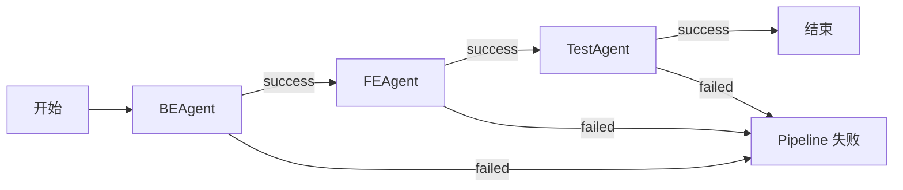
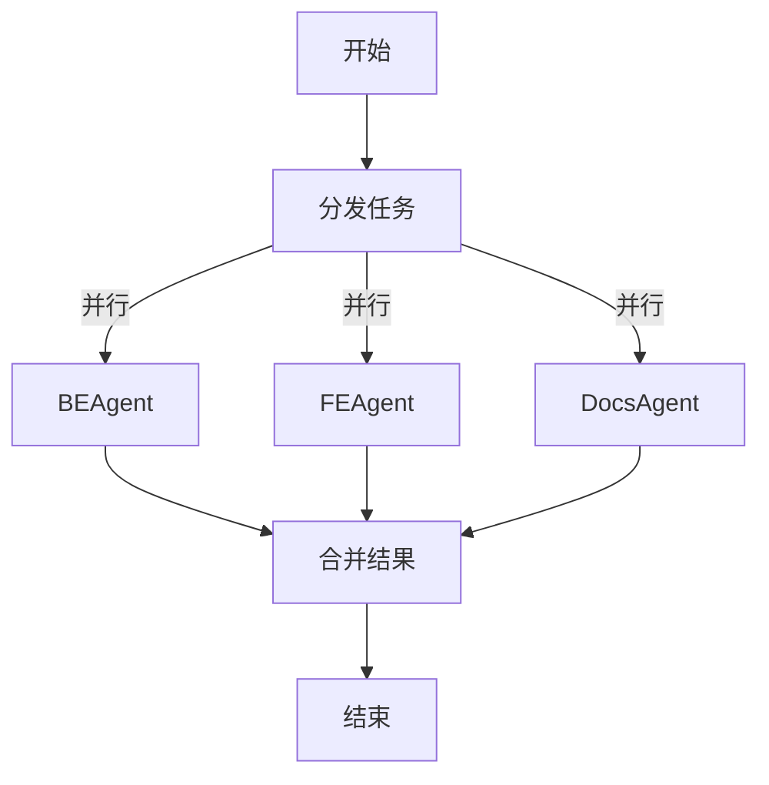
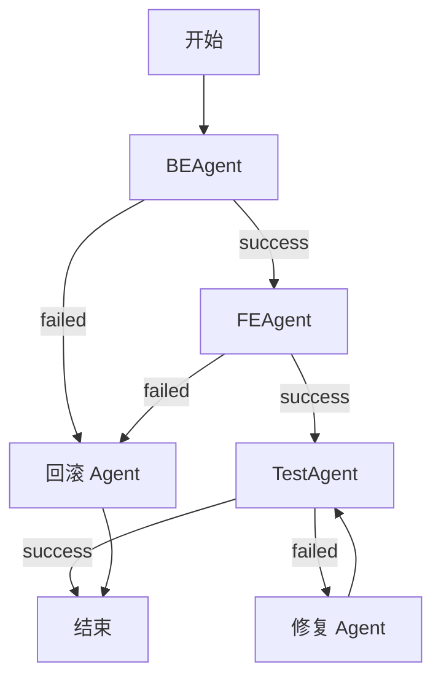
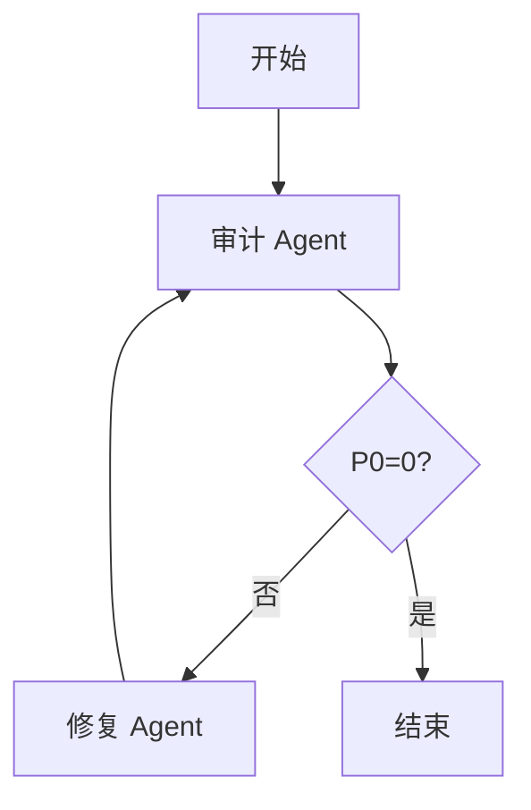
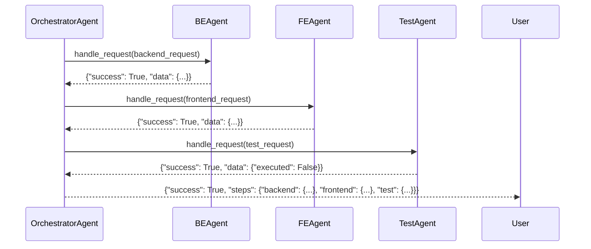
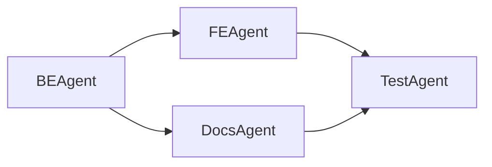
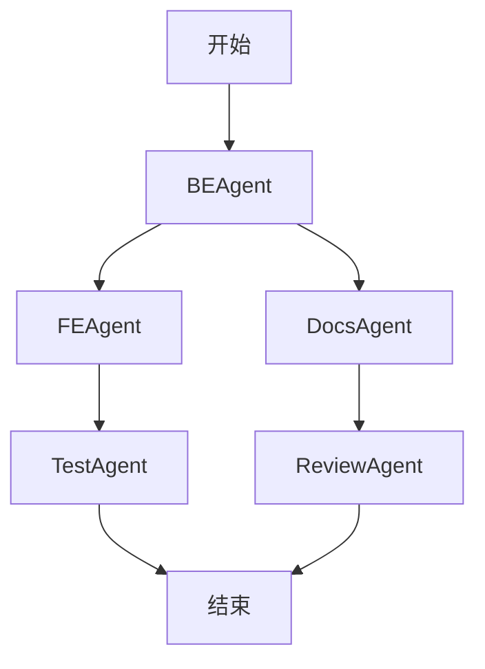
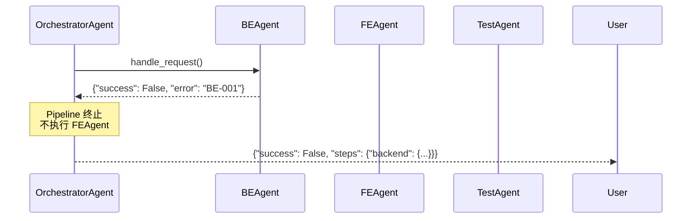
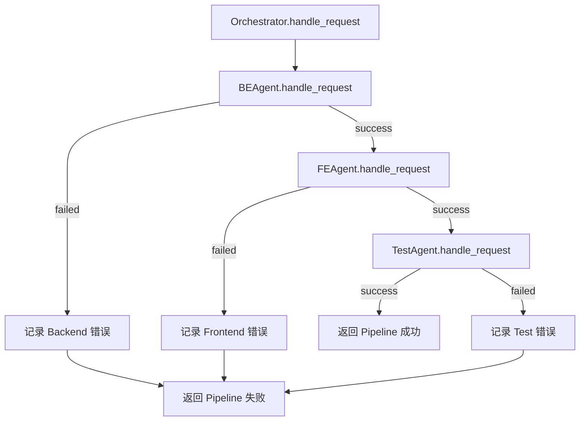

# Agent 编排流水线

> **文档版本**: v1.0
> **状态**: Draft
> **最后审查**: 2025-11-27
> **基准**: MASTER.md v3.4, SoT Freeze v2.6, Dev-Guides Freeze vFinal, Architecture Freeze v1.0, Infrastructure Freeze v1.0

---

## 1. Orchestrator 职责与边界

### 1.1 Orchestrator 定位

**OrchestratorAgent** 是 Agent 系统的总控协调器，负责管理多个 Sub-Agent 的执行流程。

**核心职责**:
- ✅ **协调 Sub-Agent**: 决定执行顺序（串行、并行）
- ✅ **管理流水线状态**: 追踪 Pipeline 执行进度
- ✅ **错误传播**: 处理 Sub-Agent 失败，决定是否终止 Pipeline
- ✅ **聚合结果**: 收集所有 Sub-Agent 的返回结果

**不做的事**（职责边界）:
- ❌ **不生成代码**: 代码生成委托给 BEAgent / FEAgent
- ❌ **不直接调用 LLM**: LLM 调用委托给 Skill
- ❌ **不修改 SoT 文档**: 遵守只读约束
- ❌ **不替代 CI/CD**: CI/CD 由 Infrastructure Layer 定义

### 1.2 Orchestrator vs Sub-Agent

**职责分工**:

| 维度 | OrchestratorAgent | Sub-Agent (BE/FE/Test) |
|------|------------------|----------------------|
| **核心逻辑** | 流程控制 | 业务逻辑（代码生成） |
| **调用关系** | 调用多个 Sub-Agent | 调用单个 Skill |
| **返回结果** | 聚合多个 Sub-Agent 结果 | 返回单个任务结果 |
| **错误处理** | 决定是否终止 Pipeline | 返回错误给 Orchestrator |
| **状态管理** | 管理 Pipeline 状态 | 无状态（Stateless） |

### 1.3 Orchestrator 不做的事

**与 CI/CD 的边界**:

| 功能 | Orchestrator | CI/CD (GitHub Actions) |
|------|-------------|----------------------|
| **触发时机** | API 调用（开发时） | Git Push（提交后） |
| **执行环境** | Agent Runtime（Python 进程） | GitHub Actions Runner |
| **执行内容** | 代码生成 | 测试、构建、部署 |
| **失败处理** | 返回错误给调用者 | 发送通知、回滚 |

**示例对比**:
```python
# ✅ Orchestrator 做的事
orchestrator.handle_request({
    "flow": "full_pipeline",
    "backend_request": {"task": "实现充值 API"},
    "frontend_request": {"task": "实现充值页面"}
})

# ❌ Orchestrator 不做的事（CI/CD 负责）
# - 运行 pytest
# - 构建 Docker 镜像
# - 部署到 Railway
```

---

## 2. 编排模式

### 2.1 串行模式（Sequential）

**定义**: Sub-Agent 按顺序依次执行，前一个成功后才执行下一个。

**流程图**:



**适用场景**:
- ✅ 前端依赖后端（需要后端 API 定义）
- ✅ 测试依赖前后端（需要完整代码）
- ✅ 任务间有依赖关系

**示例代码** (orchestrator_agent.py):

```python
def _run_full_pipeline(self, request):
    steps = {}

    # 1. Backend (必须先执行)
    be_result = self._backend_agent.handle_request(request["backend_request"])
    steps["backend"] = be_result
    if not be_result["success"]:
        return OrchestratorResult(success=False, steps=steps)

    # 2. Frontend (backend 成功后执行)
    fe_result = self._frontend_agent.handle_request(request["frontend_request"])
    steps["frontend"] = fe_result
    if not fe_result["success"]:
        return OrchestratorResult(success=False, steps=steps)

    # 3. Test (frontend 成功后执行)
    test_result = self._test_agent.handle_request(request["test_request"])
    steps["test"] = test_result

    return OrchestratorResult(success=True, steps=steps)
```

### 2.2 并行模式（Parallel）

**定义**: 多个 Sub-Agent 同时执行，互不依赖。

**流程图**:



**适用场景**:
- ✅ 前后端独立开发（无依赖）
- ✅ 加速 Pipeline 执行（缩短总时间）
- ✅ 任务间无依赖关系

**示例代码**（未来扩展）:

```python
import concurrent.futures

def _run_parallel_pipeline(self, request):
    with concurrent.futures.ThreadPoolExecutor(max_workers=3) as executor:
        # 并行提交任务
        be_future = executor.submit(self._backend_agent.handle_request, request["backend_request"])
        fe_future = executor.submit(self._frontend_agent.handle_request, request["frontend_request"])
        docs_future = executor.submit(self._docs_agent.handle_request, request["docs_request"])

        # 等待所有任务完成
        be_result = be_future.result()
        fe_result = fe_future.result()
        docs_result = docs_future.result()

        return {"backend": be_result, "frontend": fe_result, "docs": docs_result}
```

### 2.3 条件分支（Conditional）

**定义**: 根据 Sub-Agent 执行结果，决定下一步执行哪个 Agent。

**流程图**:



**适用场景**:
- ✅ 错误恢复流程（失败后自动回滚）
- ✅ 测试失败后自动修复
- ✅ 根据结果选择不同路径

**示例代码**（未来扩展）:

```python
def _run_conditional_pipeline(self, request):
    # 1. Backend
    be_result = self._backend_agent.handle_request(request["backend_request"])
    if not be_result["success"]:
        # Backend 失败 → 执行回滚
        rollback_result = self._rollback_agent.handle_request({"target": "backend"})
        return OrchestratorResult(success=False, steps={"backend": be_result, "rollback": rollback_result})

    # 2. Frontend
    fe_result = self._frontend_agent.handle_request(request["frontend_request"])
    if not fe_result["success"]:
        # Frontend 失败 → 回滚 Backend + Frontend
        rollback_result = self._rollback_agent.handle_request({"target": "all"})
        return OrchestratorResult(success=False, steps={"backend": be_result, "frontend": fe_result, "rollback": rollback_result})

    return OrchestratorResult(success=True, steps={"backend": be_result, "frontend": fe_result})
```

### 2.4 循环模式（Loop）

**定义**: 重复执行某个 Agent，直到满足条件（如 P0=0）。

**流程图**:



**适用场景**:
- ✅ 文档审计 → 修复 → 验证（循环直到 P0=0）
- ✅ 代码生成 → 测试 → 修复（循环直到测试通过）
- ✅ 自动化 ASDD 流程（AUDIT → FIX → VERIFY）

**示例代码**（ai-ad-spec-governor 使用此模式）:

```python
def _run_audit_fix_loop(self, docs):
    max_iterations = 5
    for i in range(max_iterations):
        # 1. 审计
        audit_result = self._auditor.handle_request({"docs": docs})
        p0_count = audit_result["data"]["p0_count"]

        if p0_count == 0:
            return {"success": True, "iterations": i + 1}

        # 2. 修复
        fix_result = self._fixer.handle_request({"issues": audit_result["data"]["issues"]})
        if not fix_result["success"]:
            return {"success": False, "reason": "Fix failed"}

    return {"success": False, "reason": "Max iterations exceeded"}
```

### 2.5 编排模式对比

| 模式 | 执行方式 | 依赖关系 | 失败处理 | 适用场景 |
|------|---------|---------|---------|---------|
| **串行** | 顺序执行 | 强依赖 | 立即终止 | Backend → Frontend → Test |
| **并行** | 同时执行 | 无依赖 | 等待所有完成 | Backend ∥ Frontend ∥ Docs |
| **条件分支** | 根据结果选择路径 | 弱依赖 | 自动回滚 | 失败后执行补偿操作 |
| **循环** | 重复执行直到满足条件 | 自依赖 | 超过最大次数则失败 | AUDIT → FIX → VERIFY |

---

## 3. 3 种内置流程

### 3.1 backend_only: 仅后端代码生成

**用途**: 只生成后端代码（FastAPI Router、Service、Pydantic Schema）

**流程图**:


**Request 格式**:

```json
{
  "flow": "backend_only",
  "backend_request": {
    "task": "实现充值列表 API，支持按项目 ID 过滤",
    "target_files": [
      "api/topups.py",
      "services/topup_service.py"
    ]
  }
}
```

**实现代码** (orchestrator_agent.py):

```python
def _run_backend_only(self, request: Dict[str, Any]) -> OrchestratorResult:
    be_req = request.get("backend_request") or {}
    logger.info("Orchestrator: backend step started")
    be_result = self._backend_agent.handle_request(be_req)

    success = bool(be_result.get("success", False))
    msg = "Backend flow completed" if success else f"Backend flow failed: {be_result.get('error')}"

    return OrchestratorResult(
        success=success,
        flow="backend_only",
        message=msg,
        steps={"backend": be_result}
    )
```

### 3.2 frontend_only: 仅前端代码生成

**用途**: 只生成前端代码（Next.js 组件、TanStack Query Hooks）

**流程图**:


**Request 格式**:

```json
{
  "flow": "frontend_only",
  "frontend_request": {
    "task": "重构项目列表页面，使用 TanStack Query",
    "target_files": [
      "app/projects/page.tsx",
      "app/projects/hooks/useProjects.ts"
    ]
  }
}
```

**实现代码** (orchestrator_agent.py):

```python
def _run_frontend_only(self, request: Dict[str, Any]) -> OrchestratorResult:
    fe_req = request.get("frontend_request") or {}
    logger.info("Orchestrator: frontend step started")
    fe_result = self._frontend_agent.handle_request(fe_req)

    success = bool(fe_result.get("success", False))
    msg = "Frontend flow completed" if success else f"Frontend flow failed: {fe_result.get('error')}"

    return OrchestratorResult(
        success=success,
        flow="frontend_only",
        message=msg,
        steps={"frontend": fe_result}
    )
```

### 3.3 full_pipeline: 完整流水线

**用途**: 依次执行 Backend → Frontend → Test

**流程图**:



**Request 格式**:

```json
{
  "flow": "full_pipeline",
  "backend_request": {
    "task": "实现充值 API",
    "target_files": ["api/topups.py"]
  },
  "frontend_request": {
    "task": "实现充值页面",
    "target_files": ["app/topups/page.tsx"]
  },
  "test_request": {},
  "test_enabled": true
}
```

**实现代码** (orchestrator_agent.py):

```python
def _run_full_pipeline(self, request: Dict[str, Any]) -> OrchestratorResult:
    steps: Dict[str, Dict[str, Any]] = {}

    # 1. Backend
    be_req = request.get("backend_request") or {}
    logger.info("Orchestrator: backend step started")
    be_result = self._backend_agent.handle_request(be_req)
    steps["backend"] = be_result

    if not be_result.get("success", False):
        return OrchestratorResult(
            success=False,
            flow="full_pipeline",
            message=f"Backend step failed: {be_result.get('error')}",
            steps=steps
        )

    # 2. Frontend
    fe_req = request.get("frontend_request") or {}
    logger.info("Orchestrator: frontend step started")
    fe_result = self._frontend_agent.handle_request(fe_req)
    steps["frontend"] = fe_result

    if not fe_result.get("success", False):
        return OrchestratorResult(
            success=False,
            flow="full_pipeline",
            message=f"Frontend step failed: {fe_result.get('error')}",
            steps=steps
        )

    # 3. Test (optional)
    test_enabled = bool(request.get("test_enabled", True))
    if test_enabled:
        test_req = request.get("test_request") or {}
        logger.info("Orchestrator: test step started")
        test_result = self._test_agent.handle_request(test_req)
        steps["test"] = test_result

        if not test_result.get("success", False):
            return OrchestratorResult(
                success=False,
                flow="full_pipeline",
                message=f"Test step failed: {test_result.get('error')}",
                steps=steps
            )

    return OrchestratorResult(
        success=True,
        flow="full_pipeline",
        message="Full pipeline completed successfully",
        steps=steps
    )
```

---

## 4. Sub-Agent 依赖管理

### 4.1 依赖图（DAG）构建

**示例依赖关系**:



**依赖规则**:
- FEAgent 依赖 BEAgent（需要后端 API 定义）
- TestAgent 依赖 FEAgent 和 BEAgent（需要完整代码）
- DocsAgent 依赖 BEAgent（需要后端代码生成文档）

### 4.2 拓扑排序

**拓扑排序算法**:

```python
from collections import deque

def topological_sort(dependencies: Dict[str, List[str]]) -> List[str]:
    """
    拓扑排序，计算 Agent 执行顺序。

    Args:
        dependencies: {"fe": ["be"], "test": ["be", "fe"]}

    Returns:
        执行顺序: ["be", "fe", "test"]
    """
    # 计算入度
    in_degree = {node: 0 for node in dependencies}
    for deps in dependencies.values():
        for dep in deps:
            in_degree[dep] = in_degree.get(dep, 0) + 1

    # BFS 拓扑排序
    queue = deque([node for node, degree in in_degree.items() if degree == 0])
    result = []

    while queue:
        node = queue.popleft()
        result.append(node)

        for neighbor in dependencies.get(node, []):
            in_degree[neighbor] -= 1
            if in_degree[neighbor] == 0:
                queue.append(neighbor)

    # 检测循环依赖
    if len(result) != len(dependencies):
        raise ValueError("Cyclic dependency detected")

    return result
```

**示例**:

```python
dependencies = {
    "be": [],
    "fe": ["be"],
    "docs": ["be"],
    "test": ["fe", "docs"]
}

execution_order = topological_sort(dependencies)
# 输出: ["be", "fe", "docs", "test"] 或 ["be", "docs", "fe", "test"]
```

### 4.3 循环依赖检测

**示例循环依赖**:

```mermaid
graph LR
    BE[BEAgent] --> FE[FEAgent]
    FE --> Test[TestAgent]
    Test --> BE  %% ❌ 循环依赖
```

**检测代码**:

```python
def has_cycle(dependencies: Dict[str, List[str]]) -> bool:
    """
    检测依赖图中是否存在循环依赖。
    """
    visited = set()
    rec_stack = set()

    def dfs(node):
        visited.add(node)
        rec_stack.add(node)

        for neighbor in dependencies.get(node, []):
            if neighbor not in visited:
                if dfs(neighbor):
                    return True
            elif neighbor in rec_stack:
                return True  # 循环依赖

        rec_stack.remove(node)
        return False

    for node in dependencies:
        if node not in visited:
            if dfs(node):
                return True

    return False
```

### 4.4 依赖图示例

**复杂依赖图**:



---

## 5. 错误传播与回滚策略

### 5.1 错误传播规则

**规则**: Sub-Agent 失败 → Pipeline 立即终止

**示例**:



**传播代码**:

```python
if not be_result["success"]:
    return OrchestratorResult(
        success=False,
        flow="full_pipeline",
        message=f"Backend step failed: {be_result['error']}",
        steps={"backend": be_result}  # 只包含已完成的步骤
    )
```

### 5.2 回滚策略

**回滚方式**:

| 回滚方式 | 适用场景 | 实现方式 |
|---------|---------|---------|
| **Git Revert** | 代码已提交 | `git revert <commit>` |
| **文件快照** | 代码未提交 | 保存原始文件，失败后恢复 |
| **无回滚** | 代码未写入 | Agent 返回生成的代码，由调用者决定是否写入 |

**当前实现**: **无回滚**（Agent 不自动写文件）

```python
# Agent 只返回生成的代码，不写文件
be_result = {
    "success": True,
    "data": {
        "changes": {
            "backend/api/topups.py": "生成的代码内容...",
            "backend/services/topup_service.py": "生成的代码内容..."
        }
    }
}

# 调用者决定是否写入
if be_result["success"]:
    for file_path, content in be_result["data"]["changes"].items():
        with open(file_path, "w") as f:
            f.write(content)
```

### 5.3 部分成功处理

**场景**: Backend 成功，Frontend 失败

**处理策略**:

```python
steps = {
    "backend": {"success": True, "data": {...}},
    "frontend": {"success": False, "error": "FE-001: LLM timeout"}
}

# 返回部分成功结果
return {
    "success": False,  # Pipeline 整体失败
    "data": {
        "steps": steps,
        "message": "Frontend step failed, but backend succeeded"
    },
    "error": "FE-001: LLM timeout"
}
```

**用户处理**:
- 用户可以选择只使用 Backend 生成的代码
- 或者重新执行 Frontend 步骤（frontend_only flow）

### 5.4 错误传播流程图



---

## 6. Pipeline 状态管理

### 6.1 Pipeline 状态

| 状态 | 描述 | 触发条件 |
|------|------|---------|
| **PENDING** | Pipeline 等待执行 | 收到 Request |
| **RUNNING** | Pipeline 正在执行 | 开始执行第一个 Sub-Agent |
| **SUCCEEDED** | Pipeline 成功完成 | 所有 Sub-Agent 成功 |
| **FAILED** | Pipeline 失败 | 任意 Sub-Agent 失败 |
| **PARTIAL_SUCCESS** | 部分成功 | 部分 Sub-Agent 成功，部分失败 |

### 6.2 状态持久化

**当前实现**: **无状态**（Pipeline 状态不持久化）

**未来扩展**: 状态持久化到数据库

```python
class PipelineState:
    def __init__(self, pipeline_id: str):
        self.pipeline_id = pipeline_id
        self.status = "PENDING"
        self.steps = {}

    def save(self):
        # 保存到数据库（PostgreSQL 或 Redis）
        db.execute(
            "INSERT INTO pipeline_states (id, status, steps) VALUES (%s, %s, %s)",
            (self.pipeline_id, self.status, json.dumps(self.steps))
        )

    def load(cls, pipeline_id: str):
        # 从数据库加载
        row = db.execute("SELECT status, steps FROM pipeline_states WHERE id = %s", (pipeline_id,))
        return cls(pipeline_id, row["status"], json.loads(row["steps"]))
```

### 6.3 状态查询 API

**API 设计**（未来扩展）:

```python
# GET /api/pipelines/{pipeline_id}/status
{
  "pipeline_id": "550e8400-e29b-41d4-a716-446655440000",
  "status": "RUNNING",
  "steps": {
    "backend": {"status": "SUCCEEDED", "completed_at": "2025-11-27T10:30:00Z"},
    "frontend": {"status": "RUNNING", "started_at": "2025-11-27T10:32:00Z"},
    "test": {"status": "PENDING"}
  },
  "progress": "2/3 steps completed"
}
```

---

## 7. 与 CI_PIPELINE_SPEC.md 的对齐

### 7.1 CI Pipeline vs Agent Pipeline

**对比表**:

| 维度 | CI Pipeline | Agent Pipeline |
|------|------------|---------------|
| **定义位置** | CI_PIPELINE_SPEC.md | 本文档 |
| **触发时机** | Git Push | API 调用 |
| **执行环境** | GitHub Actions | Agent Runtime (Python) |
| **执行内容** | 测试、构建、部署 | 代码生成 |
| **失败处理** | 发送通知、回滚 | 返回错误 |
| **持续时间** | 5-10 分钟 | 1-5 分钟 |

### 7.2 触发时机

**CI Pipeline** (CI_PIPELINE_SPEC.md):
```yaml
# .github/workflows/ci.yml
on:
  push:
    branches: [main, develop]
```

**Agent Pipeline** (本文档):
```python
# API 调用触发
orchestrator.handle_request({
    "flow": "full_pipeline",
    "backend_request": {...}
})
```

### 7.3 执行环境

**CI Pipeline**:
- GitHub Actions Runner (Ubuntu 22.04)
- Docker 容器（测试环境）
- Railway / Vercel（生产环境）

**Agent Pipeline**:
- Python 3.11+ 进程
- Docker 容器（可选，用于隔离）
- 本地或云端服务器

---

## 8. 编排最佳实践

### 8.1 幂等性

**原则**: Pipeline 可重复执行，不产生副作用

**实现**:
```python
# ✅ 幂等：Agent 不直接写文件
be_result = {"success": True, "data": {"changes": {...}}}

# ❌ 非幂等：Agent 直接写文件
with open("backend/api/topups.py", "w") as f:
    f.write("...")
```

### 8.2 超时配置

**每个 Sub-Agent 独立超时**:

```python
AGENT_TIMEOUT_CONFIG = {
    "be": 120000,      # 2 分钟
    "fe": 120000,      # 2 分钟
    "test": 60000,     # 1 分钟
    "orchestrator": 600000,  # 10 分钟（总超时）
}
```

### 8.3 日志追踪

**trace_id 跨 Agent 传递**:

```python
# Orchestrator 生成 trace_id
trace_id = str(uuid.uuid4())

# 传递给 Sub-Agent
be_request = {
    "task": "...",
    "metadata": {"trace_id": trace_id}
}

# Sub-Agent 记录日志时包含 trace_id
logger.info(f"[{trace_id}] BE Agent processing task")
```

**日志查询**:

```sql
SELECT * FROM logs WHERE trace_id = '550e8400-e29b-41d4-a716-446655440000';
```

---

## 9. 引用文献

**本文档引用的规范**:
- MASTER.md v3.4 §8 - Agent 编排规范
- STATE_MACHINE v2.6 §3 - 状态机流程
- CI_PIPELINE_SPEC v1.0 §4 - CI/CD 流程
- agents/agent_core/orchestrator_agent.py - Orchestrator 实现
- SUBAGENT_PROTOCOL.md §5 - 错误处理协议

**下一步阅读**:
- [CODEX_LOOP_SPEC.md](./CODEX_LOOP_SPEC.md) - Codex Loop 规范
- [AGENT_VERSIONING_RULES.md](./AGENT_VERSIONING_RULES.md) - Agent 版本管理
- [AGENT_SKILL_REGISTRY.md](./AGENT_SKILL_REGISTRY.md) - Skill 注册与调度

---

**文档状态**: ✅ Draft - 待审计
**健康度**: 待评估（P0/P1/P2）
**下一步**: 提交 ai-ad-doc-system-auditor 审计
