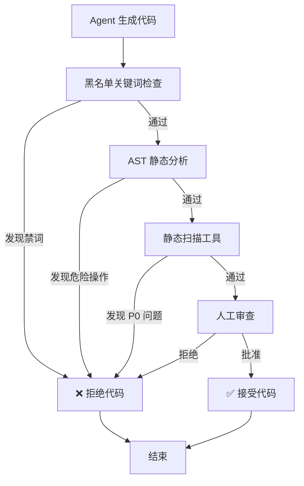
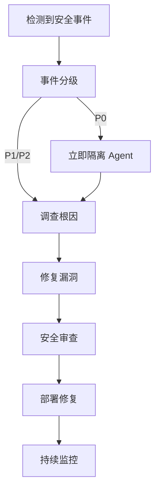

# Agent 安全规范

> **文档版本**: v1.0
> **状态**: Draft
> **最后审查**: 2025-11-27
> **基准**: MASTER.md v3.4, SoT Freeze v2.6, Dev-Guides Freeze vFinal, Architecture Freeze v1.0, Infrastructure Freeze v1.0

---

## 1. 威胁模型

### 1.1 威胁分类

**Agent 系统面临的主要威胁**:

| 威胁编号 | 威胁名称 | 严重性 | 可能性 | 风险等级 |
|---------|---------|--------|--------|---------|
| **T-AGENT-001** | 恶意代码生成 | 高 | 中 | 🔴 高风险 |
| **T-AGENT-002** | 敏感信息泄露 | 高 | 中 | 🔴 高风险 |
| **T-AGENT-003** | 权限提升攻击 | 高 | 低 | 🟡 中风险 |
| **T-AGENT-004** | 资源耗尽攻击 | 中 | 中 | 🟡 中风险 |
| **T-AGENT-005** | SoT 文档篡改 | 高 | 低 | 🟡 中风险 |

### 1.2 T-AGENT-001: 恶意代码生成

**威胁描述**:
Agent 生成包含恶意代码的文件（SQL Injection、XSS、命令注入）

**攻击场景**:
```python
# 恶意 Prompt
task = "实现用户查询 API，使用以下 SQL: SELECT * FROM users WHERE id = ' + user_input + '"

# Agent 生成的代码（存在 SQL Injection）
def get_user(user_id: str):
    query = f"SELECT * FROM users WHERE id = '{user_id}'"  # ❌ 不安全
    return db.execute(query)
```

**缓解措施**:
1. **黑名单关键词过滤**: 禁止 `eval()`, `exec()`, `__import__()`, `os.system()`
2. **AST 静态分析**: 检测危险操作（字符串拼接 SQL、未转义 HTML）
3. **代码审查**: 人工审查 Agent 生成的代码（Code Review）
4. **沙箱测试**: 在隔离环境中测试生成的代码

### 1.3 T-AGENT-002: 敏感信息泄露

**威胁描述**:
Agent 泄露 `.env` 文件、API Key、数据库凭证

**攻击场景**:
```python
# Agent 错误地将 API Key 写入日志
logger.info(f"Using API Key: {os.getenv('SUPABASE_KEY')}")  # ❌ 泄露

# Agent 错误地将 API Key 包含在生成的代码中
API_KEY = "sb_xxxxxxxxxxxxx"  # ❌ 硬编码
```

**缓解措施**:
1. **日志脱敏**: 自动过滤日志中的 API Key、密码
2. **Secrets Manager**: 使用 Vault/AWS Secrets Manager 管理敏感信息
3. **代码扫描**: 检测硬编码的 API Key（正则表达式）
4. **Environment Variables 隔离**: Agent 无法读取所有环境变量

### 1.4 T-AGENT-003: 权限提升攻击

**威胁描述**:
Agent 绕过权限检查，直接修改 SoT 文档或数据库 Schema

**攻击场景**:
```python
# Agent 尝试修改 SoT 文档（应被禁止）
sot_path = "docs/2.sot/STATE_MACHINE.md"
with open(sot_path, "w") as f:  # ❌ 不应有写权限
    f.write("恶意修改的状态机...")
```

**缓解措施**:
1. **文件系统权限**: SoT 目录挂载为只读
2. **权限分级**: Agent 分为 READ_ONLY / READ_WRITE / ADMIN
3. **审计日志**: 记录所有文件系统操作
4. **RLS Policy 对齐**: Agent 权限与 AUTH_SPEC v2.0 对齐

### 1.5 T-AGENT-004: 资源耗尽攻击

**威胁描述**:
Agent 滥用 LLM Token、CPU、内存，导致系统崩溃

**攻击场景**:
```python
# 恶意 Prompt 导致 Token 耗尽
task = "生成 1000 个 API 端点，每个端点包含 100 个字段..."

# Agent 陷入无限循环
while True:
    agent.handle_request(request)  # ❌ 无限循环
```

**缓解措施**:
1. **Token 限额**: 每个 Agent 调用最多消耗 20K tokens
2. **超时机制**: 每个 Agent 调用最多执行 10 分钟
3. **资源限制**: CPU 限制（Docker `--cpus=1`）、内存限制（`--memory=2g`）
4. **速率限制**: 每个用户每分钟最多调用 10 次 Agent

### 1.6 T-AGENT-005: SoT 文档篡改

**威胁描述**:
Agent 修改 SoT 文档，导致下游 Agent 使用错误的规范

**攻击场景**:
```python
# Agent 错误地修改 STATE_MACHINE.md
state_machine_path = "docs/2.sot/STATE_MACHINE.md"
with open(state_machine_path, "a") as f:
    f.write("\n## 新增非法状态: HACKED\n")  # ❌ 不应允许
```

**缓解措施**:
1. **只读挂载**: SoT 目录挂载为只读（Docker `-v docs/2.sot:/sot:ro`）
2. **Git 追踪**: 所有 SoT 修改必须通过 Git Commit
3. **审批流程**: SoT 修改需要 RFC + 架构委员会审批
4. **版本锁定**: Agent 引用特定版本 SoT（如 v2.6），不使用 latest

---

## 2. Agent 权限模型

### 2.1 权限分级

| 权限级别 | 文件系统 | 数据库 | 外部 API | 适用 Agent |
|---------|---------|--------|---------|-----------|
| **READ_ONLY** | 只读 SoT | 只读查询 | 禁止调用 | Code Review Agent |
| **READ_WRITE** | 读写 backend/frontend | 读写 | MCP 白名单 | BEAgent, FEAgent |
| **ADMIN** | 读写所有目录 | 读写 + DDL | 无限制 | OrchestratorAgent（受限） |

### 2.2 文件系统权限

**权限矩阵**:

| 目录 | BEAgent | FEAgent | TestAgent | OrchestratorAgent |
|------|---------|---------|----------|------------------|
| `docs/2.sot/` | 只读 | 只读 | 只读 | 只读 |
| `docs/3.dev-guides/` | 只读 | 只读 | 只读 | 只读 |
| `backend/` | 读写 | 只读 | 只读 | 只读 |
| `frontend/` | 只读 | 读写 | 只读 | 只读 |
| `tests/` | 只读 | 只读 | 读写 | 只读 |
| `.env` | 禁止 | 禁止 | 禁止 | 禁止 |

**实施方式** (Docker 挂载):

```yaml
# docker-compose.yml (示例)
services:
  be-agent:
    volumes:
      - ./docs/2.sot:/app/docs/2.sot:ro  # 只读
      - ./backend:/app/backend:rw        # 读写
      - ./frontend:/app/frontend:ro      # 只读
```

### 2.3 数据库权限

**权限矩阵** (对齐 AUTH_SPEC v2.0):

| 操作类型 | BEAgent | FEAgent | TestAgent |
|---------|---------|---------|----------|
| **SELECT** | ✅ | ✅ | ✅ |
| **INSERT** | ✅ (通过 Service) | ❌ | ✅ (测试数据) |
| **UPDATE** | ✅ (通过 Service) | ❌ | ✅ (测试数据) |
| **DELETE** | ❌ | ❌ | ✅ (清理测试数据) |
| **DDL (CREATE TABLE)** | ❌ | ❌ | ❌ |

**RLS Policy 对齐**:
- Agent 使用 **Service Account**（特殊用户角色）
- Agent 受 RLS Policy 约束（不能绕过 RLS）
- Agent 不能执行 DDL（Schema 修改需要 Alembic 迁移）

### 2.4 外部 API 权限

**MCP 白名单**:

| MCP 服务 | BEAgent | FEAgent | TestAgent | 用途 |
|---------|---------|---------|----------|------|
| **Supabase MCP** | ✅ | ✅ | ✅ | 数据库查询 |
| **Anthropic API** | ✅ | ✅ | ✅ | LLM 调用 |
| **GitHub API** | ❌ | ❌ | ❌ | 禁止（避免泄露代码） |
| **AWS S3** | ❌ | ❌ | ❌ | 禁止（避免上传恶意文件） |

**API Key 管理**:
```python
# ✅ 正确：使用 Secrets Manager
api_key = secrets_manager.get_secret("ANTHROPIC_API_KEY")

# ❌ 错误：硬编码 API Key
api_key = "sk-ant-xxxxxxxxxxxxx"
```

---

## 3. 沙箱隔离机制

### 3.1 Agent 运行时隔离

**Docker 容器隔离**:

```dockerfile
# Dockerfile (示例)
FROM python:3.11-slim

# 创建非 root 用户
RUN useradd -m -u 1000 agent
USER agent

# 限制文件系统访问
VOLUME /app/docs/2.sot:ro
VOLUME /app/backend:rw

# 限制网络访问（仅允许 HTTPS）
# 通过 Docker network policy 实现

ENTRYPOINT ["python", "agents/cli.py"]
```

**资源限制**:

```bash
# 启动 Agent 容器时限制资源
docker run \
  --cpus=1 \              # CPU 限制
  --memory=2g \           # 内存限制
  --pids-limit=100 \      # 进程数限制
  --network=agent-net \   # 网络隔离
  agent-image
```

### 3.2 文件系统隔离

**挂载策略**:

```yaml
# docker-compose.yml
volumes:
  # SoT 只读挂载
  - ./docs/2.sot:/app/docs/2.sot:ro
  - ./docs/3.dev-guides:/app/docs/3.dev-guides:ro

  # 代码读写挂载
  - ./backend:/app/backend:rw
  - ./frontend:/app/frontend:rw

  # 敏感文件禁止挂载
  # .env, .git 等不挂载
```

### 3.3 网络隔离

**出站连接白名单**:

| 目标 | 端口 | 允许 | 说明 |
|------|------|------|------|
| `api.anthropic.com` | 443 | ✅ | LLM API |
| `*.supabase.co` | 443 | ✅ | Supabase API |
| `github.com` | 443 | ❌ | 禁止（防止代码泄露） |
| `0.0.0.0` | * | ❌ | 禁止所有其他出站 |

**实施方式** (Docker network policy):

```bash
# 创建隔离网络
docker network create --internal agent-net

# 配置出站白名单（通过 iptables 或 AWS Security Group）
```

### 3.4 资源限制

**限制配置**:

```python
# agents/agents_config.py

AGENT_RESOURCE_LIMITS = {
    "be": {
        "cpu_limit": 1.0,          # 1 CPU 核心
        "memory_limit": "2g",      # 2 GB 内存
        "timeout_ms": 600000,      # 10 分钟超时
        "max_tokens": 20000,       # 最多消耗 20K tokens
    },
    "fe": {
        "cpu_limit": 1.0,
        "memory_limit": "2g",
        "timeout_ms": 600000,
        "max_tokens": 20000,
    },
    "test": {
        "cpu_limit": 0.5,
        "memory_limit": "1g",
        "timeout_ms": 300000,
        "max_tokens": 10000,
    }
}
```

---

## 4. 代码生成审查

### 4.1 黑名单关键词

**禁止的 Python 关键词**:

```python
PYTHON_BLACKLIST = [
    "eval",          # 动态执行代码
    "exec",          # 动态执行代码
    "__import__",    # 动态导入模块
    "compile",       # 编译代码字符串
    "os.system",     # 执行 Shell 命令
    "subprocess",    # 执行子进程
    "open(..., 'w')",# 写文件（需人工审查）
]
```

**禁止的 SQL 模式**:

```python
SQL_BLACKLIST = [
    "DROP TABLE",    # 删除表
    "DROP DATABASE", # 删除数据库
    "TRUNCATE",      # 清空表
    "ALTER TABLE",   # 修改表结构（需 Alembic 迁移）
    "' + ",          # SQL 拼接（SQL Injection 风险）
    "f\"SELECT",     # f-string 拼接 SQL（风险）
]
```

### 4.2 AST 静态分析

**AST 分析示例**:

```python
import ast

def check_dangerous_operations(code: str) -> List[str]:
    """
    检测危险操作（eval、exec、os.system）。

    Returns:
        危险操作列表（空列表表示安全）
    """
    tree = ast.parse(code)
    issues = []

    for node in ast.walk(tree):
        # 检测 eval()
        if isinstance(node, ast.Call):
            if isinstance(node.func, ast.Name) and node.func.id == "eval":
                issues.append(f"Line {node.lineno}: Dangerous 'eval()' detected")

        # 检测字符串拼接 SQL
        if isinstance(node, ast.BinOp) and isinstance(node.op, ast.Add):
            if "SELECT" in ast.unparse(node):
                issues.append(f"Line {node.lineno}: Possible SQL injection (string concatenation)")

    return issues
```

### 4.3 静态代码扫描工具

**集成工具**:

| 工具 | 用途 | 集成方式 |
|------|------|---------|
| **Bandit** | Python 安全扫描 | `bandit -r backend/` |
| **Semgrep** | 多语言规则匹配 | `semgrep --config=auto backend/` |
| **ESLint** | JavaScript 安全规则 | `eslint frontend/ --ext .ts,.tsx` |
| **SQLFluff** | SQL 语法检查 | `sqlfluff lint tests/*.sql` |

**CI/CD 集成**:

```yaml
# .github/workflows/security-scan.yml
- name: Run Bandit
  run: bandit -r backend/ -f json -o bandit-report.json

- name: Run Semgrep
  run: semgrep --config=auto backend/ --json > semgrep-report.json

- name: Fail on P0 issues
  run: |
    if grep -q "CRITICAL" bandit-report.json; then
      echo "P0 security issue found!"
      exit 1
    fi
```

### 4.4 代码审查流程图



---

## 5. 敏感信息保护

### 5.1 Environment Variables 管理

**推荐方案**: 使用 **AWS Secrets Manager** 或 **HashiCorp Vault**

```python
# ✅ 正确：从 Secrets Manager 读取
import boto3

def get_api_key():
    client = boto3.client('secretsmanager')
    response = client.get_secret_value(SecretId='prod/anthropic-api-key')
    return response['SecretString']

# ❌ 错误：从 .env 文件读取（Agent 可能访问）
import os
api_key = os.getenv("ANTHROPIC_API_KEY")
```

### 5.2 API Key 加密存储

**加密方案**:

```python
from cryptography.fernet import Fernet

# 1. 生成密钥（一次性）
key = Fernet.generate_key()

# 2. 加密 API Key
cipher = Fernet(key)
encrypted_key = cipher.encrypt(b"sk-ant-xxxxxxxxxxxxx")

# 3. 存储加密后的 Key（数据库或 Vault）
# 4. Agent 运行时解密（使用密钥）
decrypted_key = cipher.decrypt(encrypted_key)
```

### 5.3 日志脱敏

**脱敏规则**:

```python
import re

def sanitize_log(log: str) -> str:
    """
    脱敏日志中的敏感信息。
    """
    # 1. 脱敏 API Key
    log = re.sub(r"sk-ant-[a-zA-Z0-9]{48}", "sk-ant-***REDACTED***", log)

    # 2. 脱敏 Supabase Key
    log = re.sub(r"sb_[a-zA-Z0-9]{40}", "sb_***REDACTED***", log)

    # 3. 脱敏邮箱
    log = re.sub(r"\b[A-Za-z0-9._%+-]+@[A-Za-z0-9.-]+\.[A-Z|a-z]{2,}\b", "***@***.***", log)

    # 4. 脱敏手机号
    log = re.sub(r"\b\d{11}\b", "***********", log)

    return log
```

**集成到 Logger**:

```python
import logging

class SanitizingHandler(logging.Handler):
    def emit(self, record):
        record.msg = sanitize_log(record.msg)
        # 发送到日志系统（Supabase Logs / CloudWatch）
```

### 5.4 敏感信息检测规则

**正则表达式规则**:

```python
SENSITIVE_PATTERNS = {
    "api_key": r"(sk-ant-|sk-|api_key=)[a-zA-Z0-9]{20,}",
    "password": r"(password|pwd|pass)[\"']?\s*[:=]\s*[\"'][^\"']{8,}[\"']",
    "jwt": r"eyJ[a-zA-Z0-9_-]{10,}\.[a-zA-Z0-9_-]{10,}\.[a-zA-Z0-9_-]{10,}",
    "credit_card": r"\b\d{4}[- ]?\d{4}[- ]?\d{4}[- ]?\d{4}\b",
}
```

---

## 6. 审计日志规范

### 6.1 日志级别

| 级别 | 用途 | 示例 |
|------|------|------|
| **DEBUG** | 开发调试 | `"Loading SoT: DATA_SCHEMA v5.2"` |
| **INFO** | 正常操作 | `"BE Agent processing task: 'Implement topup API'"` |
| **WARN** | 警告事件 | `"Agent timeout approaching (90% elapsed)"` |
| **ERROR** | 错误事件 | `"BE Agent failed: LLM API timeout"` |

### 6.2 日志字段

**标准日志格式** (JSON):

```json
{
  "timestamp": "2025-11-27T10:30:45.123Z",
  "level": "INFO",
  "trace_id": "550e8400-e29b-41d4-a716-446655440000",
  "agent_id": "be_agent_v1.0",
  "operation": "handle_request",
  "status": "success",
  "duration_ms": 45230,
  "tokens_used": 12500,
  "user_id": "wade",
  "message": "BE Agent completed: 2 files generated"
}
```

### 6.3 日志存储

**存储选项**:

| 方案 | 适用场景 | 保留期 |
|------|---------|--------|
| **Supabase Logs** | 开发环境 | 7 天 |
| **AWS CloudWatch** | 生产环境 | 30 天 |
| **ELK Stack** | 高级分析 | 90 天 |

### 6.4 日志查询

**追踪 Agent 调用链**:

```sql
-- 查询特定 trace_id 的所有日志
SELECT * FROM logs
WHERE trace_id = '550e8400-e29b-41d4-a716-446655440000'
ORDER BY timestamp ASC;

-- 查询失败的 Agent 调用
SELECT agent_id, COUNT(*) as failure_count
FROM logs
WHERE status = 'error'
  AND timestamp > NOW() - INTERVAL '1 day'
GROUP BY agent_id
ORDER BY failure_count DESC;
```

---

## 7. 与 AUTH_SPEC.md 的对齐

### 7.1 用户权限 vs Agent 权限

**权限对比**:

| 维度 | 用户权限 (AUTH_SPEC v2.0) | Agent 权限 (本文档) |
|------|-------------------------|-------------------|
| **身份认证** | JWT Token | Service Account |
| **权限模型** | RBAC (角色) | 权限分级 (READ_ONLY / READ_WRITE) |
| **RLS Policy** | 按用户 ID 过滤 | 按 Service Account 过滤 |
| **审计日志** | `user_id` 字段 | `agent_id` 字段 |

### 7.2 RLS Policy 对 Agent 的限制

**示例 RLS Policy**:

```sql
-- projects 表 RLS Policy
CREATE POLICY "Agent can read all projects"
ON projects FOR SELECT
TO service_role  -- Agent 使用 service_role
USING (true);

-- projects 表 RLS Policy (Agent 不能修改)
CREATE POLICY "Agent cannot modify projects"
ON projects FOR UPDATE
TO service_role
USING (false);  -- 拒绝所有 UPDATE
```

### 7.3 Agent 身份认证

**Service Account 定义**:

```python
# Agent 使用特殊的 Service Account
SERVICE_ACCOUNT_CONFIG = {
    "user_id": "agent-service-account",
    "role": "service_role",
    "permissions": ["read:sot", "write:backend", "write:frontend"]
}
```

---

## 8. 安全事件响应

### 8.1 事件分级

| 级别 | 定义 | 响应时间 | 示例 |
|------|------|---------|------|
| **P0** | 生产环境数据泄露 | 1 小时 | Agent 泄露所有用户 API Key |
| **P1** | 严重安全漏洞 | 4 小时 | Agent 生成 SQL Injection 代码 |
| **P2** | 中等安全问题 | 1 天 | Agent 日志包含未脱敏邮箱 |
| **P3** | 低级安全问题 | 1 周 | Agent 超时设置过长 |

### 8.2 响应流程



### 8.3 事件上报机制

**上报渠道**:

| 渠道 | 用途 | 配置 |
|------|------|------|
| **Slack** | 实时告警 | `#security-alerts` 频道 |
| **PagerDuty** | P0/P1 事件 | 自动电话/短信通知 |
| **Jira** | 事件追踪 | 创建 Security Issue |

---

## 9. 引用文献

**本文档引用的规范**:
- MASTER.md v3.4 §7 - Agent 安全规范
- AUTH_SPEC v2.0 §4 - RLS Policy 定义
- Infrastructure Freeze v1.0 - 部署安全规范
- OWASP Top 10 2021 - 安全威胁分类
- CWE Top 25 - 常见安全漏洞

**下一步阅读**:
- [AGENT_ORCHESTRATION_PIPELINE.md](./AGENT_ORCHESTRATION_PIPELINE.md) - Agent 编排流水线
- [AGENT_VERSIONING_RULES.md](./AGENT_VERSIONING_RULES.md) - Agent 版本管理

---

**文档状态**: ✅ Draft - 待审计
**健康度**: 待评估（P0/P1/P2）
**下一步**: 提交 ai-ad-doc-system-auditor 审计
