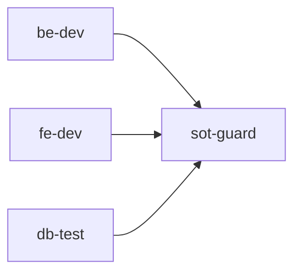
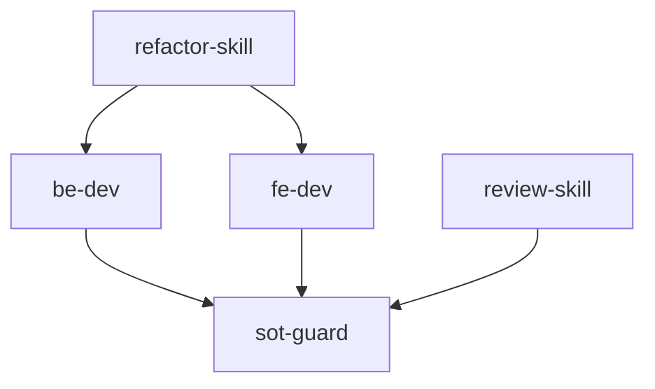

# Skill 注册与调度

> **文档版本**: v1.0
> **状态**: Draft
> **最后审查**: 2025-11-27
> **基准**: MASTER.md v3.4, SoT Freeze v2.6, Dev-Guides Freeze vFinal, Architecture Freeze v1.0, Infrastructure Freeze v1.0

---

## 1. Skill 定义与分类

### 1.1 Skill vs Agent

**核心区别**:

| 维度 | Agent | Skill |
|------|-------|-------|
| **定义** | 类（Class） | 函数（Function） |
| **接口** | `handle_request(request)` | `skill_func(task, files, ...)` |
| **职责** | 参数验证、日志、错误处理 | 核心业务逻辑 |
| **状态** | 可有状态（Stateful） | 无状态（Pure Function） |
| **示例** | `BEAgent`, `FEAgent` | `be_dev_skill`, `fe_dev_skill` |

**协作关系**:
```
Agent (协调层) → Skill (执行层)
```

### 1.2 Skill 分类

**按功能分类**:

| 分类 | 用途 | 示例 Skill |
|------|------|-----------|
| **Doc Skill** | 文档生成/审查 | `doc_skill`, `review_skill` |
| **Code Skill** | 代码生成/重构 | `be_dev_skill`, `fe_dev_skill`, `refactor_skill` |
| **Test Skill** | 测试生成/执行 | `db_test_skill` |
| **Guard Skill** | SoT 守护/验证 | `sot_guard_skill` |

**按层级分类**:

| 层级 | 描述 | 示例 |
|------|------|------|
| **Python Skill** | Python 函数（agents/skills/） | `be_dev_skill.py` |
| **Claude Skill** | Claude Code Skill（.claude/skills/） | `ai-ad-spec-governor` |

### 1.3 Skill 命名约定

**命名规则**: `{domain}_{action}_skill`

| 命名示例 | 域 | 动作 | 说明 |
|---------|---|------|------|
| `be_dev_skill` | `be` (Backend) | `dev` (Development) | 后端开发 |
| `fe_dev_skill` | `fe` (Frontend) | `dev` (Development) | 前端开发 |
| `db_test_skill` | `db` (Database) | `test` (Testing) | 数据库测试 |
| `sot_guard_skill` | `sot` (SoT) | `guard` (Guard) | SoT 守护 |

**命名约束**:
- ✅ 使用 `snake_case`
- ✅ 后缀必须是 `_skill`
- ❌ 禁止使用 `camelCase` 或 `PascalCase`

---

## 2. Skill 注册机制

### 2.1 _SKILL_REGISTRY 结构

**SkillMeta 定义**:

```python
from dataclasses import dataclass
from typing import Callable, List, Optional

@dataclass(frozen=True)
class SkillMeta:
    key: str               # Skill 唯一标识（如 "be-dev"）
    name: str              # Skill 显示名称（如 "BackendDevelopment"）
    version: str           # Skill 版本（如 "v1.0.0"）
    description: str       # Skill 描述
    dependencies: List[str] # Skill 依赖列表（如 ["sot-guard"]）
    factory: Callable      # Skill 工厂函数
```

### 2.2 Skill 注册示例

**在 agents/skills/ 注册 Python Skill**:

```python
# agents/skills_config.py (新建文件)

from typing import Dict, Callable
from .be_dev_skill import be_dev_skill
from .fe_dev_skill import fe_dev_skill
from .db_test_skill import db_test_skill
from .sot_guard_skill import sot_guard_skill

_SKILL_REGISTRY: Dict[str, SkillMeta] = {
    "be-dev": SkillMeta(
        key="be-dev",
        name="BackendDevelopment",
        version="v1.0.0",
        description="后端代码生成 Skill，生成 FastAPI Router/Service",
        dependencies=[],  # 无依赖
        factory=lambda: be_dev_skill,
    ),
    "fe-dev": SkillMeta(
        key="fe-dev",
        name="FrontendDevelopment",
        version="v1.0.0",
        description="前端代码生成 Skill，生成 Next.js 组件",
        dependencies=[],
        factory=lambda: fe_dev_skill,
    ),
    "db-test": SkillMeta(
        key="db-test",
        name="DatabaseTest",
        version="v1.0.0",
        description="数据库测试 Skill，生成测试 Prompt",
        dependencies=[],
        factory=lambda: db_test_skill,
    ),
    "sot-guard": SkillMeta(
        key="sot-guard",
        name="SoTGuard",
        version="v1.0.0",
        description="SoT 守护 Skill，验证 SoT 文档完整性",
        dependencies=[],
        factory=lambda: sot_guard_skill,
    ),
}
```

### 2.3 Skill 工厂函数

**Factory Pattern**:

```python
def _be_dev_skill_factory() -> Callable:
    """
    后端开发 Skill 工厂函数。

    Returns:
        be_dev_skill 函数引用
    """
    return be_dev_skill
```

### 2.4 Skill 注册代码示例

**完整示例** (agents/skills_config.py):

```python
from typing import Dict
from dataclasses import dataclass

@dataclass(frozen=True)
class SkillMeta:
    key: str
    name: str
    version: str
    description: str
    dependencies: list
    factory: callable

_SKILL_REGISTRY: Dict[str, SkillMeta] = {
    "be-dev": SkillMeta(
        key="be-dev",
        name="BackendDevelopment",
        version="v1.0.0",
        description="生成 FastAPI Router/Service",
        dependencies=[],
        factory=lambda: be_dev_skill,
    ),
}

def get_skill(key: str) -> callable:
    """
    获取 Skill 函数。

    Args:
        key: Skill 标识（如 "be-dev"）

    Returns:
        Skill 函数

    Raises:
        KeyError: Skill 不存在
    """
    if key not in _SKILL_REGISTRY:
        available = ", ".join(_SKILL_REGISTRY.keys())
        raise KeyError(f"Unknown skill '{key}'. Available: {available}")

    meta = _SKILL_REGISTRY[key]
    return meta.factory()
```

---

## 3. Skill 依赖解析

### 3.1 Skill 依赖声明

**示例依赖关系**:

```python
_SKILL_REGISTRY = {
    "be-dev": SkillMeta(
        key="be-dev",
        dependencies=["sot-guard"],  # ← 依赖 sot-guard
        factory=lambda: be_dev_skill,
    ),
    "fe-dev": SkillMeta(
        key="fe-dev",
        dependencies=["sot-guard"],  # ← 依赖 sot-guard
        factory=lambda: fe_dev_skill,
    ),
    "sot-guard": SkillMeta(
        key="sot-guard",
        dependencies=[],  # 无依赖
        factory=lambda: sot_guard_skill,
    ),
}
```

### 3.2 依赖图（DAG）

**依赖图示例**:



**依赖解析顺序**:
1. `sot-guard` (无依赖，先执行)
2. `be-dev` (依赖 sot-guard)
3. `fe-dev` (依赖 sot-guard)

### 3.3 循环依赖检测

**示例循环依赖**（非法）:

```mermaid
graph LR
    SkillA[skill-a] --> SkillB[skill-b]
    SkillB --> SkillC[skill-c]
    SkillC --> SkillA  %% ❌ 循环依赖
```

**检测代码**:

```python
def has_cycle(dependencies: Dict[str, List[str]]) -> bool:
    """
    检测 Skill 依赖图中是否存在循环依赖。
    """
    visited = set()
    rec_stack = set()

    def dfs(skill_key):
        visited.add(skill_key)
        rec_stack.add(skill_key)

        for dep in dependencies.get(skill_key, []):
            if dep not in visited:
                if dfs(dep):
                    return True
            elif dep in rec_stack:
                return True  # 循环依赖

        rec_stack.remove(skill_key)
        return False

    for skill in dependencies:
        if skill not in visited:
            if dfs(skill):
                return True

    return False
```

### 3.4 依赖图示例

**复杂依赖图**:



**执行顺序** (拓扑排序):
1. `sot-guard`
2. `be-dev`, `fe-dev`, `review-skill` (并行)
3. `refactor-skill`

---

## 4. Skill 冲突处理

### 4.1 冲突定义

**冲突场景**: 多个 Skill 处理同一任务

**示例**:
```python
# be_dev_skill v1.0.0
def be_dev_skill(task, files):
    return {"success": True, "data": {"changes": {...}}}

# be_dev_skill v2.0.0
def be_dev_skill(task, files):
    return {"success": True, "data": {"changes": {...}}}
```

**问题**: 同时注册 v1.0.0 和 v2.0.0 会导致冲突。

### 4.2 冲突解决策略

| 策略 | 描述 | 适用场景 |
|------|------|---------|
| **优先级** | 高优先级 Skill 覆盖低优先级 Skill | 版本升级 |
| **版本选择** | 用户指定使用哪个版本 | 兼容性测试 |
| **手动选择** | 运行时提示用户选择 | 交互式场景 |

**优先级策略**:

```python
_SKILL_REGISTRY = {
    "be-dev": SkillMeta(
        key="be-dev",
        version="v1.0.0",
        priority=1,  # ← 低优先级
        factory=lambda: be_dev_skill_v1,
    ),
    "be-dev-v2": SkillMeta(
        key="be-dev-v2",
        version="v2.0.0",
        priority=10,  # ← 高优先级（覆盖 v1.0.0）
        factory=lambda: be_dev_skill_v2,
    ),
}

def get_skill(key: str) -> callable:
    # 返回优先级最高的 Skill
    candidates = [s for s in _SKILL_REGISTRY.values() if s.key.startswith(key)]
    return max(candidates, key=lambda s: s.priority).factory()
```

### 4.3 冲突示例

**场景**: be_dev_skill v1.0.0 vs be_dev_skill v2.0.0

**解决方案**:
- **方案 1**: 只注册 v2.0.0，移除 v1.0.0
- **方案 2**: 重命名 key（`be-dev-v1`, `be-dev-v2`）
- **方案 3**: 使用优先级（v2.0.0 优先级更高）

---

## 5. Skill 版本控制

### 5.1 Skill 版本号

**版本号格式**: `v{MAJOR}.{MINOR}.{PATCH}`

| Skill | 版本 | 说明 |
|-------|------|------|
| `be-dev` | v1.0.0 | 初始版本 |
| `be-dev` | v1.1.0 | 新增功能（支持 TypeScript 后端） |
| `be-dev` | v2.0.0 | Breaking Changes（修改返回格式） |

### 5.2 Skill 版本兼容性

**兼容性规则** (与 Agent 版本管理对齐):
- ✅ **MINOR 和 PATCH 兼容**: BEAgent v1.0.0 可使用 be_dev_skill v1.0.0 ~ v1.9.9
- ❌ **MAJOR 不兼容**: BEAgent v1.0.0 不能使用 be_dev_skill v2.0.0

**兼容性矩阵**:

| BEAgent | be_dev_skill v1.x | be_dev_skill v2.x |
|---------|------------------|------------------|
| **v1.0.0** | ✅ | ❌ |
| **v2.0.0** | ❌ | ✅ |

### 5.3 Skill 版本升级策略

**升级流程**:
1. 发布新版本 Skill（如 v1.1.0）
2. 更新 `_SKILL_REGISTRY` 版本号
3. 运行测试（确保兼容）
4. 发布到生产环境
5. 通知用户（Changelog）

---

## 6. 与 .claude/skills/ 的对齐

### 6.1 Claude Skills vs Python Skills

**对比**:

| 维度 | Python Skill | Claude Skill |
|------|-------------|-------------|
| **位置** | `agents/skills/` | `.claude/skills/` |
| **定义方式** | Python 函数 | Markdown (SKILL.md) |
| **调用方式** | 直接调用函数 | 通过 SlashCommand |
| **适用场景** | Agent 内部调用 | Claude Code 调用 |
| **示例** | `be_dev_skill` | `ai-ad-spec-governor` |

### 6.2 Claude Skills 调度

**调用方式** (通过 SlashCommand):

```python
# 在 Agent 中调用 Claude Skill
from claude_code import SlashCommand

def handle_request(self, request):
    # 1. 调用 ai-ad-spec-governor Skill
    result = SlashCommand.execute("/ai-ad-spec-governor", {
        "mode": "single-doc",
        "target_docs": ["docs/2.sot/STATE_MACHINE.md"]
    })

    # 2. 处理结果
    if result["success"]:
        return {"success": True, "data": result["data"]}
    else:
        return {"success": False, "error": result["error"]}
```

### 6.3 集成示例

**场景**: BEAgent 调用 ai-ad-spec-governor 验证生成的代码

```python
class BEAgent:
    def handle_request(self, request):
        # 1. 生成代码
        code = be_dev_skill(request["task"], request["target_files"])

        # 2. 调用 ai-ad-spec-governor 验证
        validation_result = SlashCommand.execute("/ai-ad-spec-governor", {
            "mode": "single-doc",
            "target_docs": [code["file_path"]]
        })

        # 3. 检查验证结果
        if validation_result["data"]["p0_count"] > 0:
            return {"success": False, "error": "Generated code has P0 issues"}

        return {"success": True, "data": code}
```

---

## 7. Skill 调度最佳实践

### 7.1 Skill 命名规范

**规范**:
- ✅ 使用 `snake_case`（Python Skill）
- ✅ 使用 `kebab-case`（Claude Skill，如 `ai-ad-spec-governor`）
- ✅ 后缀必须是 `_skill` 或 `-skill`
- ❌ 禁止使用 `camelCase` 或 `PascalCase`

### 7.2 Skill 文档化

**Docstring 规范**:

```python
def be_dev_skill(task: str, target_files: List[str]) -> SkillResult:
    """
    后端代码生成 Skill。

    Args:
        task: 任务描述（自然语言）
        target_files: 目标文件列表（相对于 backend/）

    Returns:
        SkillResult: {
            "success": bool,
            "data": {
                "changes": Dict[str, str],  # 文件路径 → 内容
                "notes": List[str]           # 自审笔记
            },
            "error": Optional[str]
        }

    Raises:
        ValueError: task 或 target_files 为空

    Examples:
        >>> be_dev_skill("实现充值 API", ["api/topups.py"])
        {"success": True, "data": {"changes": {...}, "notes": [...]}}
    """
    ...
```

### 7.3 Skill 测试

**单元测试示例**:

```python
# tests/skills/test_be_dev_skill.py

import pytest
from agents.skills.be_dev_skill import be_dev_skill

def test_be_dev_skill_success():
    result = be_dev_skill(
        task="实现 GET /api/topups 端点",
        target_files=["api/topups.py"]
    )
    assert result["success"] is True
    assert "api/topups.py" in result["data"]["changes"]

def test_be_dev_skill_empty_task():
    with pytest.raises(ValueError):
        be_dev_skill(task="", target_files=["api/topups.py"])
```

---

## 8. 引用文献

**本文档引用的规范**:
- MASTER.md v3.4 §11 - Skill 注册与调度
- agents/agents_config.py - Agent Registry 实现
- agents/skills/*.py - Python Skills 实现
- .claude/skills/*/SKILL.md - Claude Skills 定义

**下一步阅读**:
- [AGENT_LAYER_FREEZE_MANIFEST_v1.0.md](./AGENT_LAYER_FREEZE_MANIFEST_v1.0.md) - Agent Layer 冻结清单
- [AGENT_LAYER_OVERVIEW.md](./AGENT_LAYER_OVERVIEW.md) - Agent Layer 总览

---

**文档状态**: ✅ Draft - 待审计
**健康度**: 待评估（P0/P1/P2）
**下一步**: 提交 ai-ad-doc-system-auditor 审计
