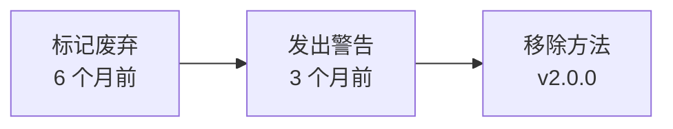

# Agent 版本管理

> **文档版本**: v1.0
> **状态**: Draft
> **最后审查**: 2025-12-07
> **基准**: AI_CODE_FACTORY_DEV_GUIDE_v2.3, MASTER.md v3.5, SoT Freeze v2.6

---

## 1. 语义化版本（SemVer）

### 1.1 MAJOR.MINOR.PATCH 定义

**版本号格式**: `vMAJOR.MINOR.PATCH`

| 版本位 | 含义 | 何时递增 | 示例 |
|--------|------|---------|------|
| **MAJOR** | 主版本号 | Breaking Changes（不兼容修改） | v1.0.0 → v2.0.0 |
| **MINOR** | 次版本号 | 新增功能（向后兼容） | v1.0.0 → v1.1.0 |
| **PATCH** | 修订号 | Bug 修复（向后兼容） | v1.0.0 → v1.0.1 |

### 1.2 MAJOR: Breaking Changes

**触发条件**:
- 修改 `handle_request` 方法签名
- 修改 `AgentResponse` 结构
- 移除已有字段或方法
- 修改默认行为（导致现有代码失败）

**示例**:

```python
# v1.0.0
def handle_request(self, request: Dict[str, Any]) -> AgentResponse:
    ...

# v2.0.0 (Breaking Change: 新增必填参数)
def handle_request(self, request: Dict[str, Any], context: Context) -> AgentResponse:
    ...  # ❌ 现有代码需要修改
```

**升级要求**:
- ✅ 必须提供迁移指南（v1 → v2）
- ✅ 必须发布 RFC（说明 Breaking Changes）
- ✅ 必须更新所有依赖此 Agent 的代码

### 1.3 MINOR: 新增功能

**触发条件**:
- 新增可选字段（不影响现有代码）
- 新增方法（不修改现有方法）
- 新增配置选项（有默认值）

**示例**:

```python
# v1.0.0
class BEAgent:
    def handle_request(self, request): ...

# v1.1.0 (新增方法，不影响 handle_request)
class BEAgent:
    def handle_request(self, request): ...
    def handle_batch_request(self, requests): ...  # ✅ 新增方法
```

**升级要求**:
- ✅ 更新 Changelog（说明新功能）
- ✅ 向后兼容（现有代码无需修改）

### 1.4 PATCH: Bug 修复

**触发条件**:
- 修复错误处理逻辑
- 修复日志记录问题
- 修复性能问题（不改变接口）

**示例**:

```python
# v1.0.0 (Bug: 未处理 timeout 异常)
def handle_request(self, request):
    result = self._call_llm_api(request)  # ❌ 可能抛出 TimeoutError

# v1.0.1 (修复: 捕获 timeout 异常)
def handle_request(self, request):
    try:
        result = self._call_llm_api(request)
    except TimeoutError:
        return {"success": False, "error": "BE-001: LLM API timeout"}  # ✅ 修复
```

**升级要求**:
- ✅ 更新 Changelog（说明修复内容）
- ✅ 向后兼容（现有代码无需修改）

---

## 2. Agent 版本控制

### 2.1 版本号管理

**在 agents_config.py 中声明版本号**:

```python
# agents/agents_config.py

_AGENT_REGISTRY: Dict[str, AgentMeta] = {
    "be": AgentMeta(
        key="be",
        name="BackendAgent",
        version="v1.0.0",  # ← 版本号
        description="后端开发 Agent",
        factory=_be_agent_factory,
    ),
    "fe": AgentMeta(
        key="fe",
        name="FrontendAgent",
        version="v1.0.0",  # ← 版本号
        description="前端开发 Agent",
        factory=_fe_agent_factory,
    ),
}
```

### 2.2 版本号格式

**规范格式**: `v{MAJOR}.{MINOR}.{PATCH}`

| 格式 | 有效 | 示例 |
|------|------|------|
| `v1.0.0` | ✅ | 正确格式 |
| `1.0.0` | ❌ | 缺少 `v` 前缀 |
| `v1.0` | ❌ | 缺少 PATCH 位 |
| `v1` | ❌ | 缺少 MINOR 和 PATCH 位 |

### 2.3 版本号递增规则

| 当前版本 | 变更类型 | 新版本 |
|---------|---------|--------|
| v1.0.0 | Bug 修复 | v1.0.1 |
| v1.0.1 | 新增功能 | v1.1.0 |
| v1.1.0 | Breaking Changes | v2.0.0 |
| v2.0.0 | Bug 修复 | v2.0.1 |

**注意**: MINOR 或 MAJOR 递增时，PATCH 归零。

---

## 3. Agent 兼容性矩阵

### 3.1 Agent 间兼容性

**场景**: OrchestratorAgent 调用 BEAgent / FEAgent / TestAgent

**兼容性规则**:
- ✅ **MINOR 和 PATCH 兼容**: Orchestrator v1.0.0 可调用 BEAgent v1.0.0 ~ v1.9.9
- ❌ **MAJOR 不兼容**: Orchestrator v1.0.0 不能调用 BEAgent v2.0.0

**兼容性矩阵**:

| OrchestratorAgent | BEAgent v1.x | BEAgent v2.x | FEAgent v1.x |
|-------------------|-------------|-------------|-------------|
| **v1.0.0** | ✅ | ❌ | ✅ |
| **v2.0.0** | ❌ | ✅ | ✅ (如果 FE 无 Breaking Changes) |

### 3.2 Agent 与 SoT 兼容性

**场景**: BEAgent 依赖 DATA_SCHEMA v5.2

**兼容性规则**:
- ✅ **PATCH 兼容**: BEAgent v1.0.0 可使用 DATA_SCHEMA v5.2.0 ~ v5.2.9
- ⚠️ **MINOR 需验证**: BEAgent v1.0.0 + DATA_SCHEMA v5.3.0（需测试）
- ❌ **MAJOR 不兼容**: BEAgent v1.0.0 + DATA_SCHEMA v6.0.0（需升级 Agent）

**兼容性矩阵**:

| BEAgent | DATA_SCHEMA v5.2 | DATA_SCHEMA v5.3 | DATA_SCHEMA v6.0 |
|---------|-----------------|-----------------|-----------------|
| **v1.0.0** | ✅ | ⚠️ 需测试 | ❌ |
| **v1.1.0** | ✅ | ✅ | ❌ |
| **v2.0.0** | ✅ | ✅ | ✅ (如果升级支持) |

### 3.3 兼容性检查

**运行时检查** (agents_config.py):

```python
def create_agent(name: str, sot_version: Optional[str] = None) -> AgentProtocol:
    """
    创建 Agent，并检查 SoT 版本兼容性。
    """
    agent_meta = _AGENT_REGISTRY[name]

    # 检查 SoT 版本兼容性
    if sot_version:
        if not is_compatible(agent_meta.version, sot_version):
            raise ValueError(
                f"{agent_meta.name} {agent_meta.version} is not compatible with SoT {sot_version}"
            )

    return agent_meta.factory()

def is_compatible(agent_version: str, sot_version: str) -> bool:
    """
    检查 Agent 版本与 SoT 版本是否兼容。
    """
    agent_major = int(agent_version.split(".")[0].lstrip("v"))
    sot_major = int(sot_version.split(".")[0].lstrip("v"))

    # MAJOR 版本必须匹配
    return agent_major == sot_major
```

---

## 4. Breaking Changes 处理

### 4.1 Breaking Changes 定义

**Breaking Changes 包括**:

1. **修改接口签名**
   ```python
   # v1.0.0
   def handle_request(self, request: Dict) -> AgentResponse:
       ...

   # v2.0.0 (Breaking Change)
   def handle_request(self, request: Dict, options: Options = None) -> AgentResponse:
       ...  # 新增必填参数（即使有默认值，也是 Breaking Change，因为修改了签名）
   ```

2. **修改响应结构**
   ```python
   # v1.0.0
   {"success": True, "data": {...}}

   # v2.0.0 (Breaking Change)
   {"status": "success", "result": {...}}  # 字段重命名
   ```

3. **移除字段或方法**
   ```python
   # v1.0.0
   class BEAgent:
       def handle_request(self, request): ...
       def deprecated_method(self): ...

   # v2.0.0 (Breaking Change)
   class BEAgent:
       def handle_request(self, request): ...
       # deprecated_method 已移除
   ```

### 4.2 Breaking Changes 通知

**RFC 模板** (RFC-2026-001):

```markdown
# RFC-2026-001: BEAgent v2.0.0 Breaking Changes

## 摘要
BEAgent v2.0.0 引入 Breaking Changes，移除 deprecated_method()。

## 动机
deprecated_method() 已废弃 6 个月，使用率 < 5%。

## Breaking Changes
1. 移除 `deprecated_method()` 方法
   - 影响: 调用此方法的代码将报错
   - 迁移: 使用 `handle_request()` 替代

## 迁移指南
### v1.x → v2.0.0
```python
# v1.x (旧代码)
agent.deprecated_method()

# v2.0.0 (新代码)
agent.handle_request({"task": "..."})
```

## 发布时间
2026-01-01
```

### 4.3 Breaking Changes 迁移指南

**Checklist**:

- [ ] 更新 Changelog（标记 Breaking Changes）
- [ ] 发布 RFC（说明变更原因和迁移路径）
- [ ] 提供迁移脚本（自动化迁移）
- [ ] 更新文档（API 文档、使用指南）
- [ ] 通知用户（Slack / Email）
- [ ] 提供过渡期（至少 3 个月）

### 4.4 Breaking Changes Checklist

```markdown
## BEAgent v1.0.0 → v2.0.0 迁移检查清单

### 代码修改
- [ ] 将 `deprecated_method()` 替换为 `handle_request()`
- [ ] 更新单元测试（测试新接口）
- [ ] 更新集成测试

### 文档更新
- [ ] 更新 API 文档
- [ ] 更新示例代码
- [ ] 更新 README.md

### 验证
- [ ] 运行全部测试（确保无失败）
- [ ] 代码审查（PR）
- [ ] 部署到测试环境（验证功能）
```

---

## 5. Agent Deprecation 策略

### 5.1 Deprecation 流程

**三阶段废弃流程**:



**阶段 1: 标记废弃** (6 个月前):

```python
@deprecated("Use handle_request() instead. Will be removed in v2.0.0.")
def deprecated_method(self):
    """
    已废弃方法。

    警告: 此方法将在 v2.0.0 中移除，请使用 handle_request() 替代。
    """
    warnings.warn(
        "deprecated_method() is deprecated, use handle_request()",
        DeprecationWarning,
        stacklevel=2
    )
    return self.handle_request({"task": "deprecated"})
```

**阶段 2: 发出警告** (3 个月前):

```python
def deprecated_method(self):
    warnings.warn(
        "deprecated_method() will be removed in v2.0.0 (3 months)",
        FutureWarning,  # ← 提升警告级别
        stacklevel=2
    )
    return self.handle_request({"task": "deprecated"})
```

**阶段 3: 移除方法** (v2.0.0):

```python
# deprecated_method() 已完全移除
```

### 5.2 Deprecation 周期

| 使用率 | 废弃周期 | 说明 |
|--------|---------|------|
| **< 5%** | 6 个月 | 低使用率，可快速移除 |
| **5% ~ 20%** | 12 个月 | 中等使用率，需足够过渡期 |
| **> 20%** | 24 个月 | 高使用率，需长期过渡期 |

### 5.3 Deprecation 通知

**Changelog 示例**:

```markdown
# BEAgent v1.5.0 (2025-07-01)

## Deprecated
- `deprecated_method()` - 将在 v2.0.0 中移除（2026-01-01）
  - 使用 `handle_request({"task": "..."})` 替代
  - 理由: 功能重复，使用率 < 5%

## Added
- 新增 `handle_batch_request()` 方法（批量处理）
```

### 5.4 Deprecation 示例

**时间线**:

```
2025-01-01: BEAgent v1.0.0 发布
2025-07-01: BEAgent v1.5.0 标记 deprecated_method() 为废弃
2025-10-01: BEAgent v1.8.0 提升警告级别（FutureWarning）
2026-01-01: BEAgent v2.0.0 移除 deprecated_method()
```

---

## 6. 版本迁移策略

### 6.1 向后兼容性（Backward Compatibility）

**定义**: 新版本 Agent 可处理旧版本 Request

**示例**:

```python
# BEAgent v1.0.0
def handle_request(self, request):
    task = request["task"]
    return {"success": True, "data": {...}}

# BEAgent v1.1.0 (向后兼容: 支持新字段，但不强制)
def handle_request(self, request):
    task = request["task"]
    options = request.get("options", {})  # ← 可选字段，有默认值
    return {"success": True, "data": {...}}
```

### 6.2 向前兼容性（Forward Compatibility）

**定义**: 旧版本 Agent 可处理新版本 Request（忽略未知字段）

**示例**:

```python
# BEAgent v1.0.0 (忽略未知字段 "new_field")
def handle_request(self, request):
    task = request["task"]
    # request 中的 "new_field" 被忽略
    return {"success": True, "data": {...}}
```

### 6.3 迁移工具

**自动迁移脚本**:

```python
def migrate_v1_to_v2(code: str) -> str:
    """
    自动迁移 BEAgent v1.x → v2.0.0。
    """
    # 1. 替换 deprecated_method() → handle_request()
    code = code.replace(
        "agent.deprecated_method()",
        "agent.handle_request({'task': 'deprecated'})"
    )

    # 2. 更新响应字段（"data" → "result"）
    code = code.replace(
        'result["data"]',
        'result["result"]'
    )

    return code
```

### 6.4 迁移验证

**验证步骤**:

```bash
# 1. 运行迁移脚本
python scripts/migrate_v1_to_v2.py

# 2. 运行单元测试
pytest tests/ -v

# 3. 运行集成测试
pytest tests/integration/ -v

# 4. 代码审查
git diff
```

---

## 7. 与 SoT 版本的对齐

### 7.1 SoT 版本升级触发 Agent 更新

**场景**: STATE_MACHINE v2.5 → v2.6（状态重命名）

**影响的 Agent**:
- BEAgent v1.0.0 → v1.1.0（支持新状态）
- FEAgent v1.0.0 → v1.1.0（支持新状态）
- TestAgent v1.0.0 → v1.0.1（更新测试用例）

### 7.2 Agent 版本依赖声明

**在 agents_config.py 中声明 SoT 依赖**:

```python
_AGENT_REGISTRY: Dict[str, AgentMeta] = {
    "be": AgentMeta(
        key="be",
        version="v1.1.0",
        sot_dependencies={
            "STATE_MACHINE": "v2.6",  # ← 依赖版本
            "DATA_SCHEMA": "v5.2",
            "API_SOT": "v9.0"
        },
        factory=_be_agent_factory,
    ),
}
```

### 7.3 版本对齐矩阵

| BEAgent | STATE_MACHINE | DATA_SCHEMA | API_SOT |
|---------|--------------|-------------|---------|
| **v1.0.0** | v2.5 | v5.2 | v9.0 |
| **v1.1.0** | v2.6 | v5.2 | v9.0 |
| **v2.0.0** | v2.6 | v5.3 | v10.0 |

---

## 8. 版本管理最佳实践

### 8.1 Changelog 维护

**每次版本更新必须更新 Changelog**:

```markdown
# BEAgent Changelog

## [v1.1.0] - 2025-11-27
### Added
- 支持 STATE_MACHINE v2.6 新状态
- 新增 `handle_batch_request()` 方法

### Fixed
- 修复 LLM API timeout 未捕获的问题

### Deprecated
- `deprecated_method()` 将在 v2.0.0 移除

## [v1.0.0] - 2025-01-01
### Added
- 初始版本发布
```

### 8.2 版本标签（Git Tag）

**每次发布必须打 Git Tag**:

```bash
# 发布 BEAgent v1.1.0
git tag -a be-agent-v1.1.0 -m "BEAgent v1.1.0: Support STATE_MACHINE v2.6"
git push origin be-agent-v1.1.0
```

### 8.3 版本发布流程

**发布 Checklist**:

- [ ] 更新版本号（agents_config.py）
- [ ] 更新 Changelog
- [ ] 运行全部测试（确保通过）
- [ ] 代码审查（PR）
- [ ] 打 Git Tag
- [ ] 发布到生产环境
- [ ] 通知用户（Slack / Email）

---

## 9. 引用文献

**本文档引用的规范**:
- MASTER.md v3.4 §10 - Agent 版本管理
- SoT Freeze v2.6 - SoT 版本对齐
- Semantic Versioning 2.0.0: https://semver.org/
- Python PEP 387 - Backwards Compatibility Policy

**下一步阅读**:
- [AGENT_SKILL_REGISTRY.md](./AGENT_SKILL_REGISTRY.md) - Skill 注册与调度
- [AGENT_LAYER_FREEZE_MANIFEST_v1.0.md](./AGENT_LAYER_FREEZE_MANIFEST_v1.0.md) - Agent Layer 冻结清单

---

**文档状态**: ✅ Draft - 待审计
**健康度**: 待评估（P0/P1/P2）
**下一步**: 提交 ai-ad-doc-system-auditor 审计
