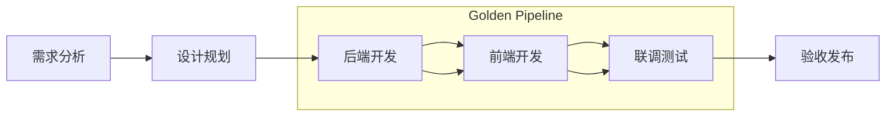
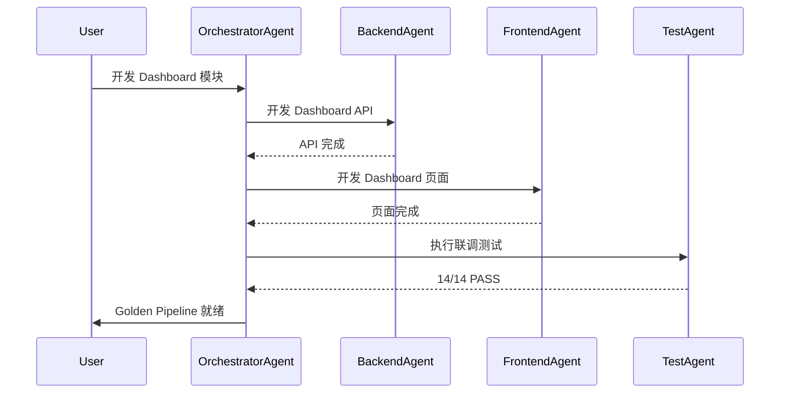

# AI 代码开发编排规范 (Code Dev Orchestration SoT)

> **版本**: v1.0
> **状态**: active
> **层级**: agent-layer
> **Owner**: wade
> **Last Reviewed**: 2025-12-06
> **Baseline**: MASTER.md v3.5, Agent Layer Freeze v1.0, SoT Freeze v2.6

---

## 1. Purpose

本文档定义 AI Agent 驱动的代码开发编排流程，包括:

- **Golden Pipeline 定义**: 经过完整验收的标准化开发流程
- **开发阶段划分**: 从需求到交付的完整生命周期
- **质量门禁**: 每个阶段的准入/准出标准
- **验收清单**: 前后端联调的标准检查项

---

## 2. Golden Pipeline 定义

### 2.1 什么是 Golden Pipeline

Golden Pipeline 是经过**完整联调验收**并达到**生产就绪**状态的标准化开发流程样本。它代表了:

- 所有质量门禁 100% 通过
- SoT 对齐验证完成
- 无 P0/P1 阻塞问题
- 可作为其他模块开发的参考模板

### 2.2 Golden Pipeline 条件

| 条件 | 说明 | 必选 |
|------|------|------|
| 联调检查清单通过 | 14/14 项全部 PASS | ✅ |
| SoT 对齐验证 | 与 STATE_MACHINE, ERROR_CODES 等对齐 | ✅ |
| Console 无错误 | 浏览器控制台 0 errors | ✅ |
| TypeScript 无错误 | `tsc --noEmit` 无报错 | ✅ |
| 测试覆盖率 | 核心路径覆盖 ≥ 80% | ✅ |
| 文档完整 | 有验收报告和测试记录 | ✅ |

---

## 3. 开发阶段划分

### 3.1 阶段概览



### 3.2 各阶段定义

| 阶段 | 输入 | 输出 | 质量门禁 |
|------|------|------|---------|
| **需求分析** | 用户需求、业务规则 | 需求文档、用例图 | 需求评审通过 |
| **设计规划** | 需求文档 | 技术方案、API 设计 | 架构评审通过 |
| **后端开发** | API 设计 | Router + Service + Schema | 单测通过、API 可调 |
| **前端开发** | API 文档 | 页面 + 组件 + Hooks | TypeScript 无错误 |
| **联调测试** | 前后端代码 | 联调报告 | 14 项检查清单通过 |
| **验收发布** | 联调报告 | 上线包 | Golden Pipeline 认证 |

---

## 4. 14 项联调检查清单

### 4.1 检查项定义

基于 FRONTEND_DEVELOPMENT_RULES.md v1.0，定义以下 14 项联调检查:

| # | 检查项 | 类别 | 说明 |
|---|--------|------|------|
| 1 | API 端点可达性 | Network | 所有 API 返回预期状态码 |
| 2 | 认证 Token 传递 | Auth | Bearer token 正确传递 |
| 3 | Response Schema 验证 | Schema | Zod 验证无错误 |
| 4 | Loading 状态展示 | UX | Skeleton 正确渲染 |
| 5 | Error 状态处理 | UX | Toast 错误提示正确 |
| 6 | Empty 状态处理 | UX | 空数据提示正确 |
| 7 | 数据刷新机制 | Data | React Query refetch 正常 |
| 8 | 缓存策略验证 | Data | staleTime 配置正确 |
| 9 | 类型安全检查 | Type | TypeScript 无错误 |
| 10 | Console 无错误 | Debug | 0 errors, 0 warnings |
| 11 | Network 请求数合理 | Perf | 无重复请求 |
| 12 | 响应时间合理 | Perf | avg < 500ms |
| 13 | 权限控制验证 | Auth | 基于 role 正确渲染 |
| 14 | SoT 对齐验证 | SoT | 对齐 STATE_MACHINE 等 |

### 4.2 检查项权重

| 类别 | 检查项数 | 权重 | 说明 |
|------|---------|------|------|
| Network | 1 | 必须 | 阻塞后续检查 |
| Auth | 2 | 必须 | 涉及安全 |
| Schema | 1 | 必须 | 数据正确性 |
| UX | 3 | 重要 | 用户体验 |
| Data | 2 | 重要 | 数据一致性 |
| Type | 1 | 必须 | 代码质量 |
| Debug | 1 | 必须 | 运行时无错 |
| Perf | 2 | 重要 | 性能达标 |
| SoT | 1 | 必须 | 规范对齐 |

---

## 5. SoT 对齐要求

### 5.1 必须对齐的 SoT 文档

| SoT 文档 | 版本 | 对齐项 |
|----------|------|--------|
| STATE_MACHINE.md | v2.6 | 状态枚举、流转规则 |
| ERROR_CODES_SOT.md | v2.1 | 错误码格式、Toast 显示 |
| AUTH_SPEC.md | v2.0 | 权限矩阵、角色定义 |
| DATA_SCHEMA.md | v5.2 | 字段类型、表结构 |
| API_SOT.md | v9.0 | 端点路径、请求响应格式 |
| FRONTEND_DEVELOPMENT_RULES.md | v1.0 | 组件规范、Hook 模式 |

### 5.2 对齐验证方法

```typescript
// 状态机枚举对齐检查
type DailyReportStatus =
  | 'raw_submitted'   // STATE_MACHINE.md v2.6 §8.2
  | 'trend_pending'
  | 'trend_ok'
  | 'trend_flagged'
  | 'trend_resolved'
  | 'final_pending'
  | 'final_confirmed'
  | 'final_locked';   // 终态 (INV-002)

// 错误码对齐检查
const ERROR_MESSAGES: Record<string, string> = {
  'VAL-001': '缺少必填字段',           // ERROR_CODES_SOT.md v2.1
  'AUTH-001': '认证失败',
  'STATE-001': '非法状态转换',
  // ...
};
```

---

## 6. Agent 编排流程

### 6.1 OrchestratorAgent 协调



### 6.2 Agent 职责矩阵

| Agent | 职责 | 产出 |
|-------|------|------|
| OrchestratorAgent | 协调、分配任务 | 任务计划、状态更新 |
| BackendAgent | 后端开发 | Router, Service, Schema |
| FrontendAgent | 前端开发 | 页面, 组件, Hooks |
| TestAgent | 测试验证 | 测试报告, 覆盖率 |
| DocAgent | 文档更新 | 验收报告, API 文档 |

---

## 附录

### A. Golden Pipeline 样本库

本节记录已验收通过的 Golden Pipeline 样本，供新模块开发参考。

---

#### Sample #1: Backend 测试体系

| 字段 | 值 |
|------|---|
| **Pipeline ID** | GOLDEN-BE-TEST-001 |
| **模块** | Backend Test Framework |
| **状态** | ✅ ready |
| **验收日期** | 2025-11-30 |
| **验收报告** | [BACKEND_TEST_FREEZE_REPORT_v1.3.md](../5.testing/BACKEND_TEST_FREEZE_REPORT_v1.3.md) |
| **通过检查项** | 状态机覆盖 100%, 错误码覆盖 100%, 账本不变量 100% |
| **SoT 基线** | STATE_MACHINE v2.6, ERROR_CODES_SOT v2.1, LEDGER_SOT v1.1 |
| **Run ID** | `pytest backend/tests/ -v` |
| **测试通过数** | 486/486 (100%) |

---

#### Sample #2: Dashboard 前端联调验收

| 字段 | 值 |
|------|---|
| **Pipeline ID** | GOLDEN-FE-DASHBOARD-001 |
| **模块** | Dashboard Frontend Integration |
| **状态** | ✅ **ready** |
| **验收日期** | 2025-12-06 |
| **验收报告** | [DASHBOARD_INTEGRATION_TEST_REPORT_v1.1.md](../5.testing/DASHBOARD_INTEGRATION_TEST_REPORT_v1.1.md) |
| **通过检查项** | 14/14 (100%) |
| **SoT 基线** | FRONTEND_DEVELOPMENT_RULES v1.0, STATE_MACHINE v2.6, ERROR_CODES_SOT v2.1, AUTH_SPEC v2.0 |
| **Run ID** | `integration-dashboard-2025-12-06` |
| **API 端点** | 5 endpoints (kpis, trends, distribution, projects, alerts) |
| **响应时间** | avg 145ms |
| **缓存策略** | staleTime: 5min, gcTime: 10min |

**变更记录**:
| 版本 | 日期 | 状态 | 说明 |
|------|------|------|------|
| v1.0 | 2025-12-01 | pending | 初始创建，7/14 PASS |
| v1.1 | 2025-12-06 | **ready** | 完整联调通过，14/14 PASS |

---

#### Sample #3: DailyReport 模块

| 字段 | 值 |
|------|---|
| **Pipeline ID** | GOLDEN-DR-001 |
| **模块** | Daily Report Full Stack |
| **状态** | 🟡 pending |
| **预计验收** | 2025-12-15 |
| **验收报告** | TBD |
| **通过检查项** | 8/14 (待补充) |
| **SoT 基线** | STATE_MACHINE v2.6, DAILY_REPORT_SOT v1.0 |

---

### B. 验收报告模板

```markdown
# [模块名称] 前端联调验收报告

**版本** vX.X | **状态** Ready/Pending | **日期** YYYY-MM-DD

## Executive Summary

[简要总结]

## 14 项联调检查清单

| # | 检查项 | 状态 | 证据 |
|---|--------|------|------|
| 1 | API 端点可达性 | PASS/FAIL | ... |
...

## Network 请求分析

[Network 请求详情]

## 结论与 Next Steps

[结论和后续行动]
```

---

### C. 版本历史

| 版本 | 日期 | 变更 |
|------|------|------|
| v1.0 | 2025-12-06 | 初始版本，定义 Golden Pipeline、14 项检查清单、Agent 编排流程 |

---

**文档控制**:
- **Baseline**: MASTER.md v3.5, Agent Layer Freeze v1.0
- **Owner**: wade
- **Next Review**: 2025-12-20
