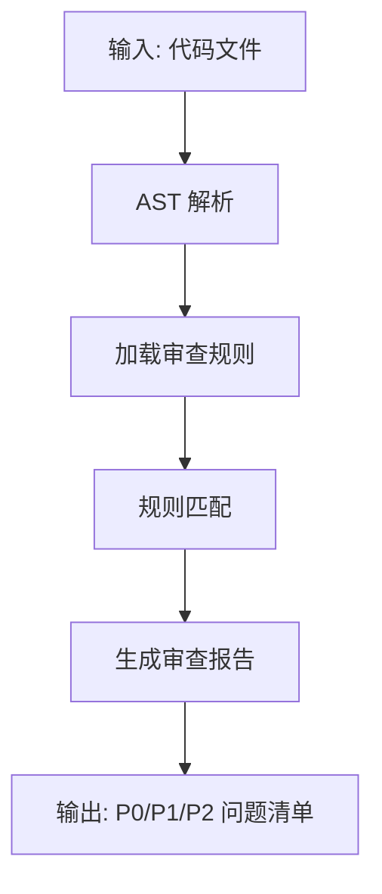
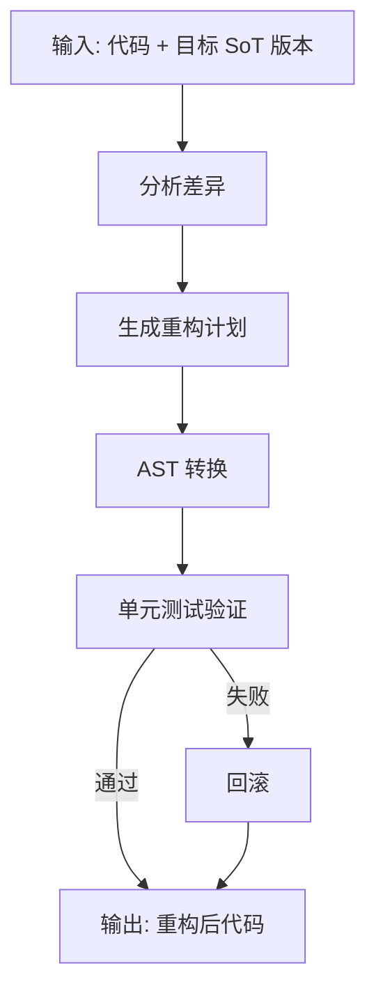
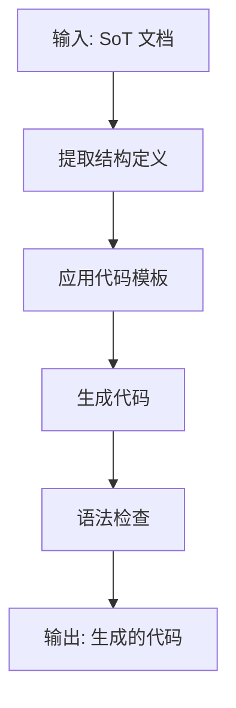
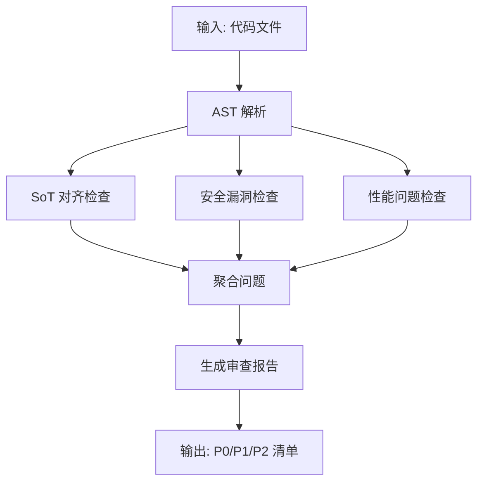
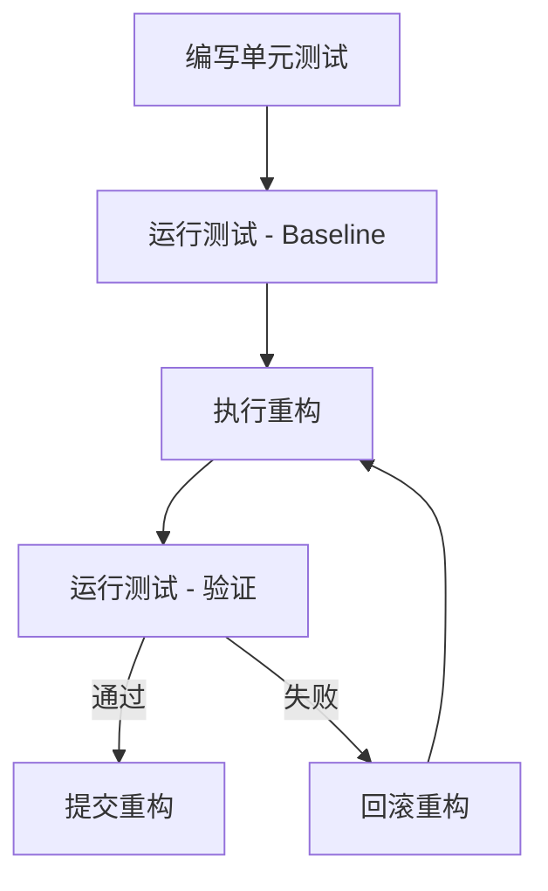

# Codex Loop 专项规范

> **文档版本**: v1.0
> **状态**: Draft
> **最后审查**: 2025-12-07
> **基准**: AI_CODE_FACTORY_DEV_GUIDE_v2.3, MASTER.md v3.5, SoT Freeze v2.6

---

## 1. Codex Loop 定义

### 1.1 什么是 Codex Loop

**Codex Loop** 是一种特殊的 Agent 模式，专注于**代码级操作**（审查、重构、生成），而非文档或流程管理。

**核心特征**:
- **操作对象**: 代码（Python、TypeScript、SQL）
- **操作方式**: AST 分析、代码转换、规则匹配
- **执行模式**: 循环执行（审查 → 修复 → 验证）

**命名由来**: "Codex" 代表代码知识库，"Loop" 代表循环改进流程。

### 1.2 与普通 Agent 的区别

| 维度 | 普通 Agent (BE/FE/Test) | Codex Loop Agent |
|------|----------------------|-----------------|
| **操作对象** | SoT 文档 + 需求描述 | 已有代码 |
| **输入** | Task 描述 | 代码文件路径 |
| **输出** | 新代码 | 修改建议 / 重构后代码 |
| **执行方式** | 一次性生成 | 循环改进 |
| **适用场景** | 从零开发 | 代码维护 |

### 1.3 使用场景

| 场景 | 描述 | 示例 |
|------|------|------|
| **Code Review** | 检测代码是否符合 SoT 规范 | 检查 API 是否遵守 API_SOT v9.0 |
| **Code Refactor** | 重构代码以符合新 SoT 版本 | STATE_MACHINE v2.5 → v2.6 升级 |
| **Code Generation** | 根据 SoT 生成代码骨架 | 从 DATA_SCHEMA v5.2 生成 Pydantic models |
| **Bug Fix** | 自动修复简单 Bug | 修复未捕获的异常 |

---

## 2. Codex Loop 模式

### 2.1 Code Review Mode（只读）

**定义**: 检测代码中不符合 SoT 规范的部分，生成审查报告。

**流程图**:



**示例**:

```python
# 输入: backend/api/topups.py
# 规则: 必须使用 RLS Policy（AUTH_SPEC v2.0 §4.2）

# 检测结果:
# P1-001: Missing RLS check in get_topup_list() (line 45)
# 建议: Add check_user_has_project_access(user_id, project_id)
```

**实现思路**:

```python
class CodeReviewAgent:
    def review(self, file_path: str) -> ReviewReport:
        # 1. 解析 AST
        tree = ast.parse(Path(file_path).read_text())

        # 2. 加载规则（从 SoT）
        rules = self.load_rules("API_SOT v9.0", "AUTH_SPEC v2.0")

        # 3. 规则匹配
        issues = []
        for rule in rules:
            violations = rule.check(tree)
            issues.extend(violations)

        # 4. 生成报告
        return ReviewReport(issues=issues, file=file_path)
```

### 2.2 Code Refactor Mode（读写）

**定义**: 自动重构代码以符合新的 SoT 版本。

**流程图**:



**示例**:

```python
# 场景: STATE_MACHINE v2.5 → v2.6
# 变更: 状态 "SUBMITTED" → "RAW_SUBMITTED"

# 原代码:
if daily_report.status == "SUBMITTED":
    process_report(daily_report)

# 重构后:
if daily_report.status == "RAW_SUBMITTED":  # ← 自动替换
    process_report(daily_report)
```

**实现思路**:

```python
class CodeRefactorAgent:
    def refactor(self, file_path: str, target_sot: str) -> RefactorResult:
        # 1. 分析差异
        diff = self.analyze_diff("STATE_MACHINE v2.5", "STATE_MACHINE v2.6")

        # 2. 生成重构计划
        plan = self.generate_refactor_plan(diff)  # 例如: 替换所有 "SUBMITTED" → "RAW_SUBMITTED"

        # 3. AST 转换
        tree = ast.parse(Path(file_path).read_text())
        transformer = StateNameTransformer(old="SUBMITTED", new="RAW_SUBMITTED")
        new_tree = transformer.visit(tree)

        # 4. 验证（运行单元测试）
        test_result = self.run_tests()
        if not test_result.passed:
            return RefactorResult(success=False, error="Tests failed")

        return RefactorResult(success=True, code=ast.unparse(new_tree))
```

### 2.3 Code Generation Mode（只写）

**定义**: 根据 SoT 生成代码骨架（Pydantic Schema、FastAPI Router）。

**流程图**:



**示例**:

```python
# 输入: DATA_SCHEMA v5.2 §3.2 (projects 表)
# 输出: backend/models/project.py

# 生成的代码:
from pydantic import BaseModel, Field
from typing import Optional
from datetime import datetime

class Project(BaseModel):
    id: int = Field(..., description="项目 ID")
    name: str = Field(..., max_length=255, description="项目名称")
    user_id: int = Field(..., description="用户 ID")
    created_at: datetime = Field(default_factory=datetime.utcnow)
    updated_at: Optional[datetime] = None

    class Config:
        from_attributes = True
```

**实现思路**:

```python
class CodeGenerationAgent:
    def generate(self, sot_doc: str, section: str) -> str:
        # 1. 解析 SoT（提取表结构）
        schema = self.parse_sot(sot_doc, section)  # DATA_SCHEMA v5.2 §3.2

        # 2. 应用 Jinja2 模板
        template = self.load_template("pydantic_model.j2")
        code = template.render(
            class_name=schema.table_name.capitalize(),
            fields=schema.fields
        )

        # 3. 格式化代码（Black）
        formatted_code = black.format_str(code, mode=black.Mode())

        return formatted_code
```

### 2.4 模式对比

| 模式 | 权限 | 输入 | 输出 | 验证方式 |
|------|------|------|------|---------|
| **Code Review** | 只读 | 代码文件 | 审查报告（P0/P1/P2） | 无（不修改代码） |
| **Code Refactor** | 读写 | 代码 + 目标 SoT 版本 | 重构后代码 | 单元测试 |
| **Code Generation** | 只写 | SoT 文档 | 生成的代码 | Mypy 类型检查 |

---

## 3. Code Review Agent

### 3.1 审查目标

**3 大审查目标**:

1. **SoT 对齐**: 代码是否符合 SoT 规范
   - 状态机状态是否正确（STATE_MACHINE v2.6）
   - 数据模型是否对齐（DATA_SCHEMA v5.2）
   - API 端点是否符合规范（API_SOT v9.0）

2. **安全漏洞**: 是否存在安全问题
   - SQL Injection（字符串拼接 SQL）
   - XSS（未转义 HTML）
   - 硬编码 API Key

3. **性能问题**: 是否存在性能瓶颈
   - N+1 查询
   - 未使用索引
   - 同步阻塞操作

### 3.2 审查流程



### 3.3 审查规则库

**示例规则** (对齐 ERROR_CODES_SOT v2.1):

```python
REVIEW_RULES = {
    "SOT_ALIGNMENT": [
        {
            "rule_id": "SOT-001",
            "description": "状态机状态必须来自 STATE_MACHINE v2.6",
            "check": lambda node: check_state_names(node, "STATE_MACHINE v2.6")
        },
        {
            "rule_id": "SOT-002",
            "description": "错误码必须来自 ERROR_CODES_SOT v2.1",
            "check": lambda node: check_error_codes(node, "ERROR_CODES_SOT v2.1")
        }
    ],
    "SECURITY": [
        {
            "rule_id": "SEC-001",
            "description": "禁止字符串拼接 SQL",
            "check": lambda node: check_sql_injection(node)
        },
        {
            "rule_id": "SEC-002",
            "description": "禁止硬编码 API Key",
            "check": lambda node: check_hardcoded_secrets(node)
        }
    ],
    "PERFORMANCE": [
        {
            "rule_id": "PERF-001",
            "description": "禁止循环中执行数据库查询（N+1）",
            "check": lambda node: check_n_plus_one(node)
        }
    ]
}
```

### 3.4 审查报告格式

```json
{
  "file": "backend/api/topups.py",
  "issues": [
    {
      "rule_id": "SOT-001",
      "severity": "P1",
      "line": 45,
      "message": "状态 'SUBMITTED' 不存在于 STATE_MACHINE v2.6（应使用 'RAW_SUBMITTED'）",
      "suggestion": "将 'SUBMITTED' 替换为 'RAW_SUBMITTED'"
    },
    {
      "rule_id": "SEC-001",
      "severity": "P0",
      "line": 67,
      "message": "检测到 SQL 注入风险（字符串拼接）",
      "suggestion": "使用参数化查询"
    }
  ],
  "summary": {
    "p0_count": 1,
    "p1_count": 1,
    "p2_count": 0
  }
}
```

---

## 4. Code Refactor Agent

### 4.1 重构触发条件

| 触发条件 | 示例 | 重构范围 |
|---------|------|---------|
| **SoT 版本升级** | STATE_MACHINE v2.5 → v2.6 | 全部使用该 SoT 的代码 |
| **Breaking Changes** | API_SOT v8.0 → v9.0（端点重命名） | 所有 API 调用 |
| **安全漏洞修复** | 修复 SQL Injection | 特定文件 |
| **性能优化** | N+1 查询优化 | 特定文件 |

### 4.2 重构策略

**保留行为，修改实现**:

```python
# 原代码（行为: 查询所有项目）
projects = db.execute("SELECT * FROM projects").fetchall()

# 重构后（行为不变，使用 ORM）
projects = session.query(Project).all()
```

**重构步骤**:
1. **分析**: 识别需要重构的代码模式
2. **转换**: 应用 AST 转换（替换节点）
3. **验证**: 运行单元测试（确保行为不变）
4. **提交**: Git Commit（标记重构）

### 4.3 重构安全性

**单元测试验证**:

```python
def refactor_with_test(file_path: str) -> RefactorResult:
    # 1. 保存原始代码
    original_code = Path(file_path).read_text()

    # 2. 运行测试（baseline）
    baseline_result = pytest.main(["-x", f"tests/test_{Path(file_path).stem}.py"])
    if baseline_result != 0:
        return RefactorResult(success=False, error="Baseline tests failed")

    # 3. 执行重构
    refactored_code = apply_refactor(file_path)
    Path(file_path).write_text(refactored_code)

    # 4. 运行测试（验证）
    test_result = pytest.main(["-x", f"tests/test_{Path(file_path).stem}.py"])
    if test_result != 0:
        # 回滚
        Path(file_path).write_text(original_code)
        return RefactorResult(success=False, error="Tests failed after refactor")

    return RefactorResult(success=True, code=refactored_code)
```

### 4.4 重构示例

**场景**: STATE_MACHINE v2.6 状态重命名

```python
# AST 转换器
class StateNameTransformer(ast.NodeTransformer):
    def __init__(self, old_state: str, new_state: str):
        self.old_state = old_state
        self.new_state = new_state

    def visit_Constant(self, node):
        if isinstance(node.value, str) and node.value == self.old_state:
            node.value = self.new_state
        return node

# 使用
tree = ast.parse(Path("backend/api/daily_reports.py").read_text())
transformer = StateNameTransformer(old="SUBMITTED", new="RAW_SUBMITTED")
new_tree = transformer.visit(tree)
refactored_code = ast.unparse(new_tree)
```

---

## 5. Code Generation Agent

### 5.1 生成目标

| 生成目标 | 输入 SoT | 输出代码 |
|---------|---------|---------|
| **Pydantic Schema** | DATA_SCHEMA v5.2 | backend/models/*.py |
| **FastAPI Router** | API_SOT v9.0 | backend/api/*.py |
| **TanStack Query Hooks** | API_SOT v9.0 | frontend/hooks/*.ts |
| **SQL Migration** | DATA_SCHEMA v5.2 | alembic/versions/*.py |

### 5.2 生成模板

**Pydantic Schema 模板** (Jinja2):

```jinja2
from pydantic import BaseModel, Field
from typing import Optional
from datetime import datetime

class {{ class_name }}(BaseModel):
    
    {{ field.name }}: {{ field.type }} = Field(
        ...None,
        description="{{ field.description }}"
    )
    

    class Config:
        from_attributes = True
```

### 5.3 生成验证

**Mypy 类型检查**:

```bash
# 生成代码后自动运行 Mypy
mypy backend/models/project.py --strict

# 如果类型检查失败，拒绝生成的代码
```

### 5.4 生成示例

```python
# 输入: DATA_SCHEMA v5.2 §3.2
schema = {
    "table": "projects",
    "fields": [
        {"name": "id", "type": "int", "required": True, "description": "项目 ID"},
        {"name": "name", "type": "str", "required": True, "description": "项目名称"},
        {"name": "user_id", "type": "int", "required": True, "description": "用户 ID"}
    ]
}

# 输出: backend/models/project.py
generated_code = generate_pydantic_model(schema)
```

---

## 6. 安全限制

### 6.1 只读模式（Code Review）

**限制**:
- ✅ 可以读取所有代码文件
- ❌ 禁止修改任何文件
- ✅ 可以生成审查报告

**实施方式**:

```python
class CodeReviewAgent:
    def __init__(self, read_only=True):
        self.read_only = read_only

    def review(self, file_path: str):
        # 只读操作
        code = Path(file_path).read_text()  # ✅ 允许
        report = self.analyze(code)
        return report

    def fix(self, file_path: str):
        if self.read_only:
            raise PermissionError("Code Review Agent is read-only")  # ❌ 拒绝
```

### 6.2 沙箱模式（Code Refactor）

**限制**:
- ✅ 可以修改 backend/ 和 frontend/ 目录
- ❌ 禁止修改 docs/2.sot/ (SoT 只读)
- ❌ 禁止修改 .env (敏感文件)

**实施方式** (Docker 挂载):

```yaml
volumes:
  - ./backend:/app/backend:rw    # 读写
  - ./frontend:/app/frontend:rw  # 读写
  - ./docs/2.sot:/app/docs/2.sot:ro  # 只读
```

### 6.3 审查模式（Code Generation）

**限制**:
- ✅ 生成代码前必须通过黑名单检查
- ✅ 生成代码前必须通过 AST 分析
- ❌ 禁止生成包含 eval() / exec() 的代码

**黑名单检查**:

```python
def validate_generated_code(code: str) -> bool:
    if "eval(" in code or "exec(" in code:
        return False
    if "os.system(" in code:
        return False
    return True
```

---

## 7. 与 TESTING_STRATEGY.md 的对齐

### 7.1 测试驱动重构（TDD）

**流程** (对齐 TESTING_STRATEGY v1.0 §4):



### 7.2 重构前后测试覆盖率对比

```python
# 重构前
pytest --cov=backend/api tests/ --cov-report=json
# 覆盖率: 85%

# 重构后
pytest --cov=backend/api tests/ --cov-report=json
# 覆盖率: 85%（应保持不变或提升）
```

### 7.3 回归测试

**确保重构未引入 Bug**:

```bash
# 运行全部回归测试
pytest tests/ -v --tb=short

# 如果任何测试失败 → 回滚重构
```

---

## 8. Codex Loop 最佳实践

### 8.1 增量重构（小步快跑）

**原则**: 每次只重构一个小范围（单个文件、单个函数）

**示例**:
```python
# ✅ 增量重构（单个文件）
refactor_file("backend/api/topups.py")
run_tests("tests/test_topups.py")
git_commit("refactor: Update topups.py for STATE_MACHINE v2.6")

# ❌ 批量重构（风险高）
refactor_all_files("backend/api/*.py")  # 可能影响多个功能
```

### 8.2 版本控制（每次重构提交 Git）

**Git 提交规范**:

```bash
git add backend/api/topups.py
git commit -m "refactor(topups): Rename state SUBMITTED → RAW_SUBMITTED

- Align with STATE_MACHINE v2.6
- All tests passing
- No behavior change"
```

### 8.3 人工审查（Code Review by Human）

**重构后必须人工审查**:

```markdown
# Pull Request 描述
## 重构摘要
- 目标: 对齐 STATE_MACHINE v2.6
- 范围: backend/api/topups.py (1 文件)
- 变更: 状态 SUBMITTED → RAW_SUBMITTED (3 处)

## 测试验证
- ✅ 单元测试通过 (tests/test_topups.py)
- ✅ 集成测试通过 (tests/test_api_endpoints.py)
- ✅ 覆盖率保持 85%

## 审查要点
- 确认状态重命名正确
- 确认无遗漏的状态引用
```

---

## 9. 引用文献

**本文档引用的规范**:
- MASTER.md v3.4 §9 - Codex Loop 定义
- TESTING_STRATEGY v1.0 §4 - 测试驱动开发
- STATE_MACHINE v2.6 - 状态机规范
- DATA_SCHEMA v5.2 - 数据模型规范
- API_SOT v9.0 - API 规范
- Python AST 文档: https://docs.python.org/3/library/ast.html

**下一步阅读**:
- [AGENT_VERSIONING_RULES.md](./AGENT_VERSIONING_RULES.md) - Agent 版本管理
- [AGENT_SKILL_REGISTRY.md](./AGENT_SKILL_REGISTRY.md) - Skill 注册与调度

---

**文档状态**: ✅ Draft - 待审计
**健康度**: 待评估（P0/P1/P2）
**下一步**: 提交 ai-ad-doc-system-auditor 审计
