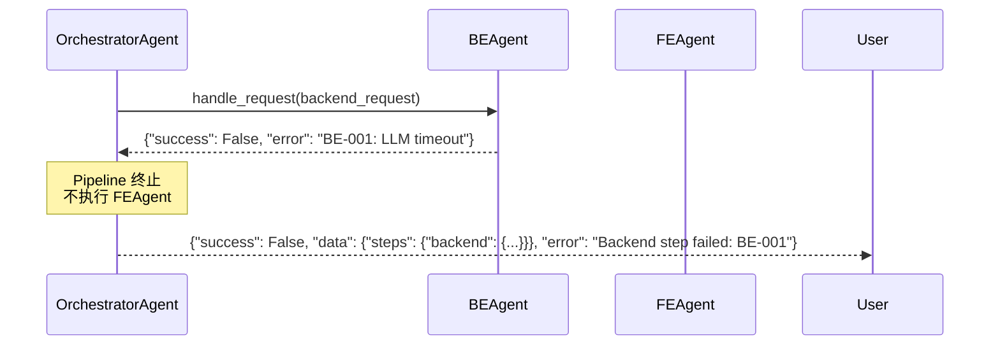
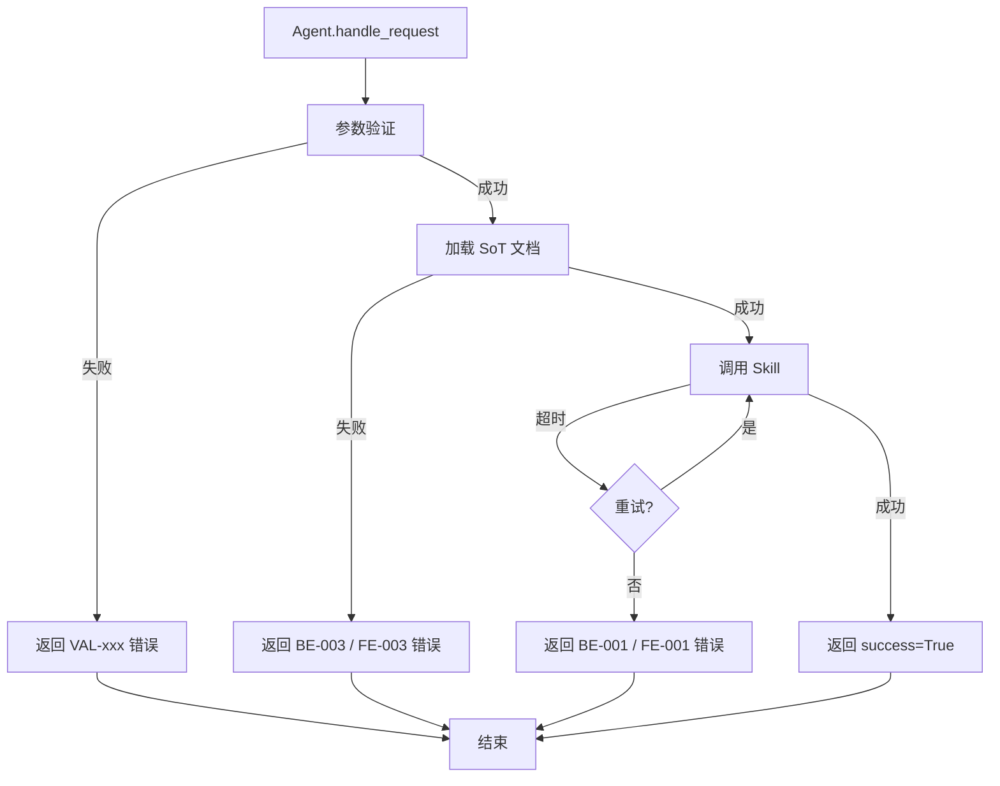

# Sub-Agent 通信协议

> **文档版本**: v1.0
> **状态**: Draft
> **最后审查**: 2025-12-07
> **上游规范**: AI_CODE_FACTORY_DEV_GUIDE_v2.3 §9.3
> **基准**: MASTER.md v3.5, SoT Freeze v2.6

---

## 1. AgentProtocol 接口定义

### 1.1 `handle_request` 方法签名

所有 Sub-Agent 必须实现 `AgentProtocol` 接口：

```python
from typing import Protocol, Dict, Any

class AgentProtocol(Protocol):
    """
    所有 Agent 必须实现的接口协议。

    用途：确保 OrchestratorAgent 可以统一调度任何 Sub-Agent。
    """

    def handle_request(self, request: Dict[str, Any]) -> AgentResponse:
        """
        处理 Agent 请求的统一入口。

        Args:
            request: 请求字典，必须包含 "task" 字段，可选包含其他字段

        Returns:
            AgentResponse: 标准响应格式
        """
        ...
```

**接口契约**:
- ✅ **必须**: 所有 Sub-Agent 实现 `handle_request` 方法
- ✅ **必须**: 返回 `AgentResponse` 格式（TypedDict）
- ✅ **必须**: 参数验证失败时返回 `success=False`
- ✅ **必须**: 记录日志（logger.info / logger.error）
- ❌ **禁止**: 抛出未捕获异常（必须捕获并返回 error）

### 1.2 Request 格式（JSON Schema）

**Request 结构**:

```json
{
  "task": "string (required)",
  "context": {
    "target_files": ["string"],
    "sot_versions": {
      "STATE_MACHINE": "v2.6",
      "DATA_SCHEMA": "v5.2"
    }
  },
  "timeout_ms": 120000,
  "metadata": {
    "trace_id": "uuid",
    "user_id": "string"
  }
}
```

**字段说明**:

| 字段 | 类型 | 必填 | 说明 |
|------|------|------|------|
| `task` | string | ✅ | 任务描述（自然语言） |
| `context` | object | ❌ | 上下文信息（target_files、sot_versions） |
| `timeout_ms` | number | ❌ | 超时时间（默认 120000ms = 2分钟） |
| `metadata` | object | ❌ | 元信息（trace_id、user_id） |

### 1.3 Response 格式（AgentResponse TypedDict）

**Response 结构** (来自 `agents/tools/types.py`):

```python
from typing import TypedDict, Any, Optional

class AgentResponse(TypedDict):
    """
    标准 Agent 响应格式。

    用途：确保所有 Agent 返回一致的结构，便于 Orchestrator 解析。
    """
    success: bool          # 任务是否成功完成
    data: Any              # 任务结果（结构因 Agent 而异）
    error: Optional[str]   # 错误信息（success=False 时必填）
```

**字段语义**:

| 字段 | 类型 | 说明 | 示例 |
|------|------|------|------|
| `success` | bool | 任务完成状态（注意：不等于测试通过） | `True` / `False` |
| `data` | Any | 任务结果，结构因 Agent 类型而异 | 见下表 |
| `error` | str \| None | 错误信息，必须对齐 ERROR_CODES_SOT v2.1 | `"VAL-001: Missing 'task'"` |

### 1.4 按 Agent 类型的 data 结构

| Agent 类型 | `data` 结构 | 示例 |
|-----------|------------|------|
| **BEAgent** | `{"changes": Dict[str, str], "notes": List[str]}` | `{"changes": {"backend/api/topups.py": "...", "backend/services/topup_service.py": "..."}, "notes": ["Added RLS check"]}` |
| **FEAgent** | `{"changes": Dict[str, str], "notes": List[str]}` | `{"changes": {"frontend/app/topups/page.tsx": "..."}, "notes": ["Used TanStack Query"]}` |
| **TestAgent** | `{"prompt": str, "executed": bool, "reason": str}` | `{"prompt": "Run db_invariants_test_v2.sql...", "executed": False, "reason": "Requires Supabase MCP"}` |
| **OrchestratorAgent** | `{"flow": str, "message": str, "steps": Dict}` | `{"flow": "full_pipeline", "message": "All steps completed", "steps": {"backend": {...}, "frontend": {...}}}` |

---

## 2. Request 规范

### 2.1 必填字段

**`task` 字段（必填）**:
- **格式**: 自然语言描述（中文/英文）
- **长度**: 建议 10-200 字
- **示例**:
  - ✅ "实现充值列表 API，支持按项目 ID 和状态过滤"
  - ✅ "Refactor project list page to use TanStack Query"
  - ❌ "写代码"（太模糊）

### 2.2 可选字段

**`context.target_files` 字段（推荐）**:
- **格式**: 相对路径列表（相对于 backend/ 或 frontend/）
- **用途**: 指定需要修改的文件
- **示例**:
  ```json
  "context": {
    "target_files": [
      "api/topups.py",
      "services/topup_service.py",
      "models/topup.py"
    ]
  }
  ```

**`timeout_ms` 字段（可选）**:
- **默认值**: 120000ms (2 分钟)
- **范围**: 30000ms ~ 600000ms (30秒 ~ 10分钟)
- **用途**: LLM API 调用超时时间

**`metadata.trace_id` 字段（推荐）**:
- **格式**: UUID v4
- **用途**: 跨 Agent 追踪日志
- **示例**: `"trace_id": "550e8400-e29b-41d4-a716-446655440000"`

### 2.3 Request 验证规则

**验证函数** (来自 `agents/tools/validation.py`):

```python
def validate_task_and_files(task: str, target_files: List[str]) -> Optional[AgentResponse]:
    """
    验证 task 和 target_files 字段。

    Returns:
        None: 验证通过
        AgentResponse: 验证失败，返回错误响应
    """
    # 1. 验证 task 非空
    if not task or not task.strip():
        return {
            "success": False,
            "data": None,
            "error": "VAL-001: Missing required field 'task'"
        }

    # 2. 验证 target_files 非空
    if not target_files:
        return {
            "success": False,
            "data": None,
            "error": "VAL-002: Missing required field 'target_files'"
        }

    # 3. 验证 target_files 元素非空
    if any(not f.strip() for f in target_files):
        return {
            "success": False,
            "data": None,
            "error": "VAL-003: Empty file path in 'target_files'"
        }

    return None  # 验证通过
```

### 2.4 Request 示例

**BEAgent Request**:
```json
{
  "task": "实现充值列表 API，支持按项目 ID、状态、创建时间过滤，并按创建时间倒序排列",
  "context": {
    "target_files": [
      "api/topups.py",
      "services/topup_service.py"
    ],
    "sot_versions": {
      "STATE_MACHINE": "v2.6",
      "DATA_SCHEMA": "v5.2",
      "API_SOT": "v9.0"
    }
  },
  "timeout_ms": 180000,
  "metadata": {
    "trace_id": "550e8400-e29b-41d4-a716-446655440000",
    "user_id": "wade"
  }
}
```

**FEAgent Request**:
```json
{
  "task": "重构项目列表页面，使用 TanStack Query 替代 useEffect + fetch，添加加载状态和错误处理",
  "context": {
    "target_files": [
      "app/projects/page.tsx",
      "app/projects/hooks/useProjects.ts"
    ]
  }
}
```

**TestAgent Request**:
```json
{
  "task": "生成数据库不变量测试 Prompt，用于 Supabase MCP 执行"
}
```

---

## 3. Response 规范

### 3.1 success 字段语义

**重要说明**: `success=True` 表示 **任务完成**，而非 **测试通过**。

**示例场景**:

| Agent | Task | success | 说明 |
|-------|------|---------|------|
| BEAgent | 生成代码 | True | 代码生成成功（未运行测试） |
| FEAgent | 重构组件 | True | 组件重构完成（未运行测试） |
| TestAgent | 生成测试 Prompt | True | Prompt 生成成功（测试未执行） |
| TestAgent | 生成测试 Prompt | True | Prompt 生成成功，但 `data.executed=False`（测试需手动执行） |

**反例**（常见误解）:
- ❌ TestAgent 返回 `success=True` ≠ 测试通过
- ✅ TestAgent 返回 `success=True` + `data.executed=False` = Prompt 生成成功，但测试未执行

### 3.2 data 字段结构

**BEAgent / FEAgent data 结构**:

```python
{
    "changes": {
        "file_path_1": "完整文件内容",
        "file_path_2": "完整文件内容"
    },
    "notes": [
        "添加了 RLS Policy 检查",
        "使用 TanStack Query 替代 useEffect"
    ]
}
```

**TestAgent data 结构**:

```python
{
    "prompt": "请使用 Supabase MCP 执行 db_invariants_test_v2.sql...",
    "executed": False,  # 始终为 False（当前版本不执行测试）
    "reason": "Test prompt generated but not executed (requires Supabase MCP configuration and manual execution)"
}
```

**OrchestratorAgent data 结构**:

```python
{
    "flow": "full_pipeline",  # backend_only | frontend_only | full_pipeline
    "message": "Full pipeline completed successfully",
    "steps": {
        "backend": {
            "success": True,
            "data": {"changes": {...}, "notes": [...]},
            "error": None
        },
        "frontend": {
            "success": True,
            "data": {"changes": {...}, "notes": [...]},
            "error": None
        },
        "test": {
            "success": True,
            "data": {"prompt": "...", "executed": False, "reason": "..."},
            "error": None
        }
    }
}
```

### 3.3 error 字段格式

**错误码对齐** (ERROR_CODES_SOT v2.1):

| 错误码 | 说明 | 示例 |
|--------|------|------|
| **VAL-001** | Missing required field | `"VAL-001: Missing required field 'task'"` |
| **VAL-002** | Missing required field | `"VAL-002: Missing required field 'target_files'"` |
| **VAL-003** | Invalid field value | `"VAL-003: Empty file path in 'target_files'"` |
| **BE-001** | Backend generation failed | `"BE-001: LLM API call timeout after 180s"` |
| **FE-001** | Frontend generation failed | `"FE-001: Failed to parse existing component"` |
| **TEST-001** | Test generation failed | `"TEST-001: DB test SQL file not found"` |

**错误信息格式**:
```
{错误码}: {简短描述}
```

**示例**:
```python
{
    "success": False,
    "data": None,
    "error": "BE-001: LLM API call timeout after 180s"
}
```

### 3.4 metadata 字段（可选）

**推荐字段**:

```python
{
    "success": True,
    "data": {...},
    "error": None,
    "metadata": {
        "agent_id": "be_agent_v1.0",
        "execution_time_ms": 45230,
        "tokens_used": 12500,
        "trace_id": "550e8400-e29b-41d4-a716-446655440000"
    }
}
```

---

## 4. 错误处理协议

### 4.1 错误码映射

**完整错误码列表** (对齐 ERROR_CODES_SOT v2.1 §2):

```python
ERROR_CODES = {
    # 参数验证错误 (VAL-xxx)
    "VAL-001": "Missing required field",
    "VAL-002": "Missing required field",
    "VAL-003": "Invalid field value",

    # 后端 Agent 错误 (BE-xxx)
    "BE-001": "Backend generation failed",
    "BE-002": "Failed to parse existing code",
    "BE-003": "SoT document not found",

    # 前端 Agent 错误 (FE-xxx)
    "FE-001": "Frontend generation failed",
    "FE-002": "Failed to parse existing component",
    "FE-003": "UI design system violation",

    # 测试 Agent 错误 (TEST-xxx)
    "TEST-001": "Test generation failed",
    "TEST-002": "DB test SQL file not found",
    "TEST-003": "MCP configuration missing",

    # Orchestrator 错误 (ORCH-xxx)
    "ORCH-001": "Unknown flow type",
    "ORCH-002": "Sub-agent execution failed",
    "ORCH-003": "Pipeline timeout"  # Agent Layer 定义,待同步至 ERROR_CODES_SOT v2.2
}
```

### 4.2 错误传播规则

**Sub-Agent → Orchestrator**:



**传播原则**:
1. Sub-Agent 返回 `success=False` → Orchestrator 终止 Pipeline
2. Orchestrator 将 Sub-Agent 错误包装到 `data.steps` 中
3. Orchestrator 返回 `success=False` + 聚合错误信息

### 4.3 错误恢复策略

**重试策略**:

| 错误类型 | 重试次数 | 退避策略 | 示例 |
|---------|---------|---------|------|
| **网络错误** | 3 次 | 指数退避 (1s, 2s, 4s) | LLM API 超时 |
| **参数验证错误** | 0 次 | 立即失败 | Missing 'task' field |
| **SoT 文档缺失** | 0 次 | 立即失败 | DATA_SCHEMA.md not found |

**重试代码示例**:

```python
import time

def handle_request_with_retry(self, request, max_retries=3):
    for attempt in range(max_retries):
        try:
            result = self._call_llm_api(request)
            return result
        except TimeoutError as e:
            if attempt < max_retries - 1:
                wait_time = 2 ** attempt  # 指数退避
                logger.warning(f"Retry {attempt + 1}/{max_retries} after {wait_time}s")
                time.sleep(wait_time)
            else:
                return {
                    "success": False,
                    "data": None,
                    "error": f"BE-001: LLM API call timeout after {max_retries} retries"
                }
```

### 4.4 错误处理流程图



---

## 5. 超时与重试机制

### 5.1 默认超时时间

| Agent 类型 | 默认超时 | 最大超时 | 说明 |
|-----------|---------|---------|------|
| **BEAgent** | 120s | 600s (10分钟) | LLM API 调用 + 代码生成 |
| **FEAgent** | 120s | 600s | LLM API 调用 + 组件生成 |
| **TestAgent** | 60s | 300s (5分钟) | 测试 Prompt 生成 |
| **OrchestratorAgent** | 600s | 1800s (30分钟) | 多个 Sub-Agent 串行执行 |

### 5.2 重试策略

**指数退避（Exponential Backoff）**:

```python
wait_time = min(2 ** attempt, 16)  # 最大等待 16 秒
```

**重试示例**:
- 第 1 次失败: 等待 1 秒
- 第 2 次失败: 等待 2 秒
- 第 3 次失败: 等待 4 秒
- 第 4 次失败: 等待 8 秒
- 第 5 次失败: 等待 16 秒（封顶）

### 5.3 超时处理

**优雅终止 vs 强制终止**:

| 场景 | 策略 | 说明 |
|------|------|------|
| **LLM API 调用超时** | 优雅终止 | 等待 API 返回，记录日志 |
| **Agent 执行超时** | 强制终止 | 杀死进程，返回错误 |
| **Pipeline 超时** | 优雅终止 | 终止当前 Sub-Agent，保存已完成步骤 |

### 5.4 超时配置矩阵

```python
# agents/agents_config.py

AGENT_TIMEOUT_CONFIG = {
    "be": {
        "default_timeout_ms": 120000,
        "max_timeout_ms": 600000,
        "retry_enabled": True,
        "max_retries": 3
    },
    "fe": {
        "default_timeout_ms": 120000,
        "max_timeout_ms": 600000,
        "retry_enabled": True,
        "max_retries": 3
    },
    "test": {
        "default_timeout_ms": 60000,
        "max_timeout_ms": 300000,
        "retry_enabled": False,  # 测试生成不需要重试
        "max_retries": 0
    },
    "orch": {
        "default_timeout_ms": 600000,
        "max_timeout_ms": 1800000,
        "retry_enabled": False,  # Orchestrator 不重试（由 Sub-Agent 重试）
        "max_retries": 0
    }
}
```

---

## 6. Agent 状态管理

### 6.1 Stateful vs Stateless Agent

**对比**:

| 维度 | Stateless Agent | Stateful Agent |
|------|----------------|---------------|
| **状态保存** | 不保存任务状态 | 保存任务状态（进度、缓存） |
| **可重用性** | 高（每次调用独立） | 低（需要状态清理） |
| **并发安全** | 安全（无共享状态） | 需要锁机制 |
| **适用场景** | 短任务（代码生成） | 长任务（批量处理） |
| **示例** | BEAgent, FEAgent, TestAgent | LongRunningAgent（未实现） |

**推荐**: 优先使用 **Stateless Agent**

### 6.2 状态持久化策略

**Stateful Agent 状态持久化**（未来扩展）:

```python
class StatefulAgent:
    def __init__(self, state_store: StateStore):
        self.state_store = state_store

    def handle_request(self, request):
        # 1. 加载状态
        state = self.state_store.load(request["task_id"])

        # 2. 执行任务
        result = self._execute_task(request, state)

        # 3. 保存状态
        self.state_store.save(request["task_id"], state)

        return result
```

**状态存储选项**:
- **内存** (Redis): 适用于短期状态（< 1 小时）
- **数据库** (PostgreSQL): 适用于长期状态（> 1 小时）

### 6.3 并发安全性

**Stateless Agent** (无需锁):
```python
# 多个请求可并发执行
agent = create_agent("be")
result1 = agent.handle_request(request1)  # 线程 1
result2 = agent.handle_request(request2)  # 线程 2（安全）
```

**Stateful Agent** (需要锁):
```python
from threading import Lock

class StatefulAgent:
    def __init__(self):
        self._lock = Lock()

    def handle_request(self, request):
        with self._lock:  # 确保并发安全
            # 执行任务...
            pass
```

---

## 7. 实现示例

### 7.1 BEAgent 实现解析

**完整代码** (agents/agent_core/be_agent.py):

```python
from pathlib import Path
from typing import Dict, Any, Optional
import logging
from ..tools.types import AgentResponse

logger = logging.getLogger(__name__)

class BEAgent:
    def __init__(self, base_path: Optional[Path] = None) -> None:
        self.base_path = base_path or Path(__file__).resolve().parent.parent.parent

    def handle_request(self, request: Dict[str, Any]) -> AgentResponse:
        from ..tools.validation import validate_task_and_files
        from ..skills.be_dev_skill import be_dev_skill

        task = request.get("task", "")
        target_files = request.get("target_files", [])

        # 1. 参数验证
        validation_error = validate_task_and_files(task, target_files)
        if validation_error:
            logger.warning(f"BE Agent validation failed: {validation_error['error']}")
            return validation_error

        # 2. 日志记录
        logger.info(f"BE Agent processing task: '{task[:50]}...' (files: {len(target_files)})")

        # 3. 调用 Skill
        result = be_dev_skill(task, target_files)

        # 4. 结果记录
        if result["success"]:
            changes_count = len(result.get("data", {}).get("changes", {}))
            logger.info(f"BE Agent completed: {changes_count} files generated")
        else:
            logger.error(f"BE Agent failed: {result.get('error')}")

        return result
```

**关键设计**:
- ✅ 参数验证与日志分离（职责单一）
- ✅ 委托 Skill 执行核心逻辑（代码生成）
- ✅ 统一错误处理（返回 AgentResponse）

### 7.2 TestAgent 实现解析

**关键代码**（agents/agent_core/test_agent.py）:

```python
def handle_request(self, request: Dict[str, Any]) -> AgentResponse:
    from ..skills.db_test_skill import db_test_skill

    logger.info("Test Agent generating DB test prompt")
    result = db_test_skill()

    if result["success"]:
        prompt_len = len(result["data"]["prompt"])
        logger.info(f"Test Agent completed: prompt generated ({prompt_len} chars)")
        return {
            "success": True,
            "data": {
                "prompt": result["data"]["prompt"],
                "executed": False,  # ⚠️ 关键：始终为 False
                "reason": "Test prompt generated but not executed (requires Supabase MCP)"
            },
            "error": None
        }
    else:
        logger.error(f"Test Agent failed: {result.get('error')}")
    return result
```

**关键设计**:
- ⚠️ `executed` 始终为 `False`（防止 Orchestrator 误判）
- ✅ 明确说明未执行原因（`reason` 字段）

### 7.3 OrchestratorAgent 实现解析

**关键代码**（agents/agent_core/orchestrator_agent.py）:

```python
def _run_full_pipeline(self, request: Dict[str, Any]) -> OrchestratorResult:
    steps: Dict[str, Dict[str, Any]] = {}

    # 1. Backend
    be_req = request.get("backend_request") or {}
    logger.info("Orchestrator: backend step started")
    be_result = self._backend_agent.handle_request(be_req)
    steps["backend"] = be_result

    if not be_result.get("success", False):
        return OrchestratorResult(
            success=False,
            flow="full_pipeline",
            message=f"Backend step failed: {be_result.get('error')}",
            steps=steps
        )

    # 2. Frontend (仅在 backend 成功后执行)
    fe_req = request.get("frontend_request") or {}
    logger.info("Orchestrator: frontend step started")
    fe_result = self._frontend_agent.handle_request(fe_req)
    steps["frontend"] = fe_result

    # ... 省略 test step

    return OrchestratorResult(
        success=True,
        flow="full_pipeline",
        message="Full pipeline completed successfully",
        steps=steps
    )
```

**关键设计**:
- ✅ 串行执行（backend → frontend → test）
- ✅ 错误传播（backend 失败 → pipeline 终止）
- ✅ 保存已完成步骤（`steps` 字典）

---

## 8. 协议演进规则

### 8.1 Breaking Changes 定义

**Breaking Changes** 包括：

1. **修改 `handle_request` 签名**
   ```python
   # v1.0 (原始)
   def handle_request(self, request: Dict[str, Any]) -> AgentResponse:
       ...

   # v2.0 (Breaking Change)
   def handle_request(self, request: Dict[str, Any], context: Context) -> AgentResponse:
       ...  # ❌ 新增必填参数 context
   ```

2. **修改 `AgentResponse` 结构**
   ```python
   # v1.0 (原始)
   class AgentResponse(TypedDict):
       success: bool
       data: Any
       error: Optional[str]

   # v2.0 (Breaking Change)
   class AgentResponse(TypedDict):
       status: str  # ❌ 将 success 改为 status
       result: Any  # ❌ 将 data 改为 result
       error_code: Optional[str]
   ```

3. **移除已有字段**
   ```python
   # v1.0
   {"success": True, "data": {...}, "error": None}

   # v2.0 (Breaking Change)
   {"success": True, "result": {...}}  # ❌ 移除 data 字段
   ```

### 8.2 兼容性约束

**MAJOR 版本升级**（Breaking Changes）:
- ✅ 允许修改接口签名
- ✅ 允许修改响应结构
- ✅ 允许移除已有字段
- ❌ 必须提供迁移指南（v1 → v2）

**MINOR 版本升级**（新增功能）:
- ✅ 允许新增可选字段
- ✅ 允许新增方法（如 `handle_batch_request`）
- ❌ 禁止修改现有接口

**PATCH 版本升级**（Bug 修复）:
- ✅ 允许修复错误处理逻辑
- ❌ 禁止修改接口或响应结构

### 8.3 废弃流程

**Deprecation Policy** (详见 AGENT_VERSIONING_RULES.md):

1. **标记废弃** (6 个月前)
   ```python
   @deprecated("Use handle_request_v2 instead. Will be removed in v3.0.")
   def handle_request(self, request):
       ...
   ```

2. **发出警告** (3 个月前)
   ```python
   import warnings
   warnings.warn("handle_request is deprecated, use handle_request_v2", DeprecationWarning)
   ```

3. **移除方法** (v3.0 发布)

---

## 9. 引用文献

**本文档引用的规范**:
- MASTER.md v3.4 §6 - Agent 协议规范
- ERROR_CODES_SOT v2.1 §2 - 错误码定义
- API_SOT v9.0 §3 - API 接口规范
- agents/tools/types.py - AgentResponse / SkillResult 定义
- agents/tools/validation.py - validate_task_and_files 实现
- agents/agent_core/be_agent.py - BEAgent 实现
- agents/agent_core/fe_agent.py - FEAgent 实现
- agents/agent_core/test_agent.py - TestAgent 实现
- agents/agent_core/orchestrator_agent.py - OrchestratorAgent 实现

**下一步阅读**:
- [AGENT_SECURITY_SPEC.md](./AGENT_SECURITY_SPEC.md) - Agent 安全规范
- [AGENT_ORCHESTRATION_PIPELINE.md](./AGENT_ORCHESTRATION_PIPELINE.md) - Agent 编排流水线
- [AGENT_VERSIONING_RULES.md](./AGENT_VERSIONING_RULES.md) - Agent 版本管理

---

**文档状态**: ✅ Draft - 待审计
**健康度**: 待评估（P0/P1/P2）
**下一步**: 提交 ai-ad-doc-system-auditor 审计
