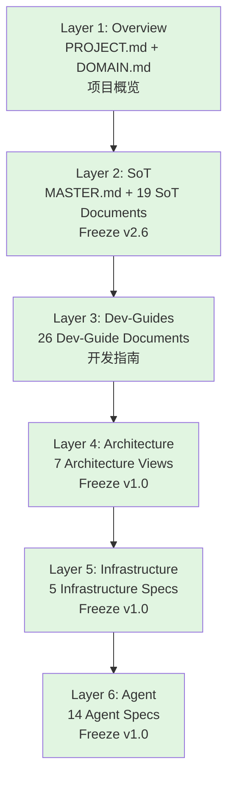

# AI广告代投系统 - Documentation Center

> **Documentation Framework**: ASDD (AI-Spec-Driven Development) 6-Layer Architecture
> **Last Updated**: 2025-12-27
> **Baseline**: MASTER v4.4, SoT v2.6, Dev-Guides vFinal, Architecture v1.0, Infrastructure v1.0, Agent v1.0

---

## 📐 ASDD 6-Layer Architecture



**Legend**:
- 🟢 **Frozen**: Production-ready, versioned, locked
- 🟡 **Active**: In use, can be updated
- 🔴 **Draft**: Under development

---

## 🎯 Quick Navigation by Layer

### Layer 1: Overview (概览层) - Freeze v1.0 🟢

**Purpose**: System constitution, invariants, project scope

| Document | Version | Status | Purpose |
|----------|---------|--------|---------|
| [MASTER.md](./sot/MASTER.md) | v4.4 | 🟢 Frozen | System architecture constitution, 三大不可变量 |
| [PROJECT.md](./1.overview/PROJECT.md) | v1.2 | 🟢 Frozen | Project scope, capability boundaries |
| [DOMAIN.md](./1.overview/DOMAIN.md) | v1.0 | 🟢 Frozen | Domain model and business context |
| [ARCHITECTURE.md](./1.overview/ARCHITECTURE.md) | v1.0 | 🟢 Frozen | High-level architecture overview |

**Freeze Date**: 2025-11-23 | **Health Score**: 100/100

---

### Layer 2: SoT (真相源层) - Freeze v2.6 🟢

**Purpose**: Single source of truth for all technical specifications

| Document | Version | Status | Purpose |
|----------|---------|--------|---------|
| [STATE_MACHINE.md](./sot/STATE_MACHINE.md) | v2.6 | 🟢 Frozen | 8-state machine flow (raw_submitted → final_locked) |
| [DATA_SCHEMA.md](./sot/DATA_SCHEMA.md) | v5.2 | 🟢 Frozen | Database schema, 23 tables, indexes, constraints |
| [API_SOT.md](./sot/API_SOT.md) | v9.0 | 🟢 Frozen | REST API contracts, 50+ endpoints |
| [ERROR_CODES_SOT.md](./sot/ERROR_CODES_SOT.md) | v2.1 | 🟢 Frozen | Global error code registry (AUTH/BIZ/VAL/SYS/DB/STATE/TREND) |
| [BUSINESS_RULES.md](./sot/BUSINESS_RULES.md) | v3.2 | 🟢 Frozen | Business logic rules, pricing formulas |
| [AUTH_SPEC.md](./sot/AUTH_SPEC.md) | v2.1 | 🟢 Active | 7 user roles, RBAC permissions |
| [LEDGER_SOT.md](./sot/LEDGER_SOT.md) | v1.1 | 🟢 Frozen | Dual-ledger system (PROJECT vs SUPPLIER) |
| [DAILY_REPORT_SOT.md](./sot/DAILY_REPORT_SOT.md) | v1.0 | 🟢 Frozen | Daily report workflow and data flow |
| [TRANSFER_SOT.md](./sot/TRANSFER_SOT.md) | v1.0 | 🟢 Frozen | Transfer workflow specification |
| [TOPUP_SOT.md](./sot/TOPUP_SOT.md) | v1.0 | 🟢 Frozen | Topup lifecycle (draft → completed) |
| [RECONCILIATION_SOT.md](./sot/RECONCILIATION_SOT.md) | v1.0 | 🟢 Frozen | Batch reconciliation workflow |
| [SOT_FREEZE_MANIFEST_v2.6.md](./sot/SOT_FREEZE_MANIFEST_v2.6.md) | v2.6 | 🟢 Frozen | SoT Layer freeze record |

**Freeze Date**: 2025-11-26 | **Health Score**: 100/100

---

### Layer 3: Dev-Guides (开发指南层) - Freeze vFinal 🟢

**Purpose**: Development workflows, best practices, operational procedures

| Document | Version | Status | Purpose |
|----------|---------|--------|---------|
| [API_DEVELOPMENT_FLOW.md](./3.dev-guides/API_DEVELOPMENT_FLOW.md) | v2.0 | 🟢 Frozen | 三层架构 API 开发流程 (Router → Service → Repository) |
| [FRONTEND_DEVELOPMENT_RULES.md](./3.dev-guides/FRONTEND_DEVELOPMENT_RULES.md) | v1.2 | 🟢 Frozen | Next.js + React 前端开发规范 |
| [UI_FLOW_SPEC.md](./3.dev-guides/UI_FLOW_SPEC.md) | v1.1 | 🟢 Frozen | 用户交互流程规范 |
| [TESTING_STRATEGY.md](./3.dev-guides/TESTING_STRATEGY.md) | v1.1 | 🟢 Frozen | 测试策略 (Unit ≥80%, Integration ≥70%) |
| [DEPLOYMENT_GUIDE.md](./3.dev-guides/DEPLOYMENT_GUIDE.md) | v1.1 | 🟢 Frozen | Railway/Vercel 部署指南 |
| [TROUBLESHOOTING.md](./3.dev-guides/TROUBLESHOOTING.md) | v1.0 | 🟢 Frozen | 常见问题排查手册 |
| [AGENT_WORKFLOW_GUIDE.md](./3.dev-guides/AGENT_WORKFLOW_GUIDE.md) | v1.0 | 🟢 Frozen | AI Agent 协作规范 |
| [DEV_ONBOARDING_CHECKLIST.md](./3.dev-guides/DEV_ONBOARDING_CHECKLIST.md) | v1.0 | 🟢 Frozen | 新成员上手检查清单 |
| [UI_DESIGN_SYSTEM.md](./3.dev-guides/UI_DESIGN_SYSTEM.md) | v1.0 | 🟢 Frozen | UI 设计系统规范 |
| [DDD_API_ARCHITECTURE.md](./3.dev-guides/DDD_API_ARCHITECTURE.md) | v1.0 | 🟢 Frozen | DDD 架构最佳实践 |
| [PATTERNS.md](./3.dev-guides/PATTERNS.md) | v1.0 | 🟢 Active | 代码模式与最佳实践 |
| [DEV_GUIDES_FREEZE_MANIFEST_vFinal.md](./3.dev-guides/DEV_GUIDES_FREEZE_MANIFEST_v1.0.md) | vFinal | 🟢 Frozen | Dev-Guides Layer freeze record |

**Freeze Date**: 2025-11-27 | **Health Score**: 100/100

---

### Layer 4: Architecture (架构视图层) - Freeze v1.0 🟢

**Purpose**: System architecture views (C4 Model, DDD, data flows)

| Document | Version | Status | Purpose |
|----------|---------|--------|---------|
| [ARCH_LAYER_OVERVIEW.md](./4.architecture/ARCH_LAYER_OVERVIEW.md) | v1.0 | 🟢 Frozen | Architecture Layer总览与定位 |
| [SYSTEM_CONTEXT_VIEW.md](./4.architecture/SYSTEM_CONTEXT_VIEW.md) | v1.0 | 🟢 Frozen | 系统上下文视图 (C4 Level 1) - 外部集成与用户角色 |
| [BOUNDED_CONTEXT_MAP.md](./4.architecture/BOUNDED_CONTEXT_MAP.md) | v1.0 | 🟢 Frozen | DDD 限界上下文映射 (Core/Supporting/Generic domains) |
| [SERVICE_COMPONENT_VIEW.md](./4.architecture/SERVICE_COMPONENT_VIEW.md) | v1.0 | 🟢 Frozen | 服务组件视图 (C4 Level 2/3) - 三层架构 |
| [DATA_FLOW_VIEW.md](./4.architecture/DATA_FLOW_VIEW.md) | v1.0 | 🟢 Frozen | 数据流视图 - 8状态机流转与双账本流动 |
| [ERROR_HANDLING_STRATEGY.md](./4.architecture/ERROR_HANDLING_STRATEGY.md) | v1.0 | 🟢 Frozen | 错误处理策略 - 全局错误码系统 |
| [PERFORMANCE_AND_CAPACITY_GUIDE.md](./4.architecture/PERFORMANCE_AND_CAPACITY_GUIDE.md) | v1.0 | 🟢 Frozen | 性能与容量规划 - SLO定义 |
| [ARCHITECTURE_FREEZE_MANIFEST_v1.0.md](./4.architecture/ARCHITECTURE_FREEZE_MANIFEST_v1.0.md) | v1.0 | 🟢 Frozen | Architecture Layer freeze record |

**Freeze Date**: 2025-11-27 | **Health Score**: 100/100

---

### Layer 5: Infrastructure (基础设施层) - Freeze v1.0 🟢

**Purpose**: Infrastructure specifications (CI/CD, deployment, observability)

| Document | Version | Status | Purpose |
|----------|---------|--------|---------|
| [INFRA_OVERVIEW.md](./5.infrastructure/INFRA_OVERVIEW.md) | v1.0 | 🟢 Frozen | Infrastructure Layer总览与原则 |
| [CI_PIPELINE_SPEC.md](./5.infrastructure/CI_PIPELINE_SPEC.md) | v1.0 | 🟢 Frozen | GitHub Actions CI流程 - 6-stage pipeline |
| [DEPLOYMENT_PIPELINE_SPEC.md](./5.infrastructure/DEPLOYMENT_PIPELINE_SPEC.md) | v1.0 | 🟢 Frozen | Railway/Vercel 部署流程规范 |
| [ENVIRONMENT_VARIABLES_GUIDE.md](./5.infrastructure/ENVIRONMENT_VARIABLES_GUIDE.md) | v1.0 | 🟢 Frozen | 环境变量管理与安全最佳实践 |
| [OBSERVABILITY_GUIDE.md](./5.infrastructure/OBSERVABILITY_GUIDE.md) | v1.0 | 🟢 Frozen | 可观测性指南 - Metrics/Logs/Traces |
| [INFRASTRUCTURE_FREEZE_MANIFEST_v1.0.md](./5.infrastructure/INFRASTRUCTURE_FREEZE_MANIFEST_v1.0.md) | v1.0 | 🟢 Frozen | Infrastructure Layer freeze record |

**Freeze Date**: 2025-11-27 | **Health Score**: 100/100

---

### Layer 6: Agent (AI Agent 层) - Freeze v1.0 🟢

**Purpose**: AI Agent system specifications (protocol, security, orchestration, versioning)

| Document | Version | Status | Purpose |
|----------|---------|--------|---------|
| [AGENT_LAYER_OVERVIEW.md](./6.agent-layer/AGENT_LAYER_OVERVIEW.md) | v1.0 | 🟢 Frozen | Agent Layer 总览与架构定位 |
| [SUBAGENT_PROTOCOL.md](./6.agent-layer/SUBAGENT_PROTOCOL.md) | v1.0 | 🟢 Frozen | Sub-Agent 通信协议规范 (AgentResponse TypedDict) |
| [AGENT_SECURITY_SPEC.md](./6.agent-layer/AGENT_SECURITY_SPEC.md) | v1.0 | 🟢 Frozen | Agent 安全规范 - 5 威胁模型 (T-AGENT-001~005) |
| [AGENT_ORCHESTRATION_PIPELINE.md](./6.agent-layer/AGENT_ORCHESTRATION_PIPELINE.md) | v1.0 | 🟢 Frozen | Agent 编排流水线 - 4 种编排模式 |
| [CODEX_LOOP_SPEC.md](./6.agent-layer/CODEX_LOOP_SPEC.md) | v1.0 | 🟢 Frozen | Codex Loop 专项规范 - 代码级 Agent (Review/Refactor/Generation) |
| [AGENT_VERSIONING_RULES.md](./6.agent-layer/AGENT_VERSIONING_RULES.md) | v1.0 | 🟢 Frozen | Agent 版本管理 - SemVer 规则与兼容性矩阵 |
| [AGENT_SKILL_REGISTRY.md](./6.agent-layer/AGENT_SKILL_REGISTRY.md) | v1.0 | 🟢 Frozen | Skill 注册与调度 - 依赖 DAG 与冲突处理 |
| [AGENT_LAYER_FREEZE_MANIFEST_v1.0.md](./6.agent-layer/AGENT_LAYER_FREEZE_MANIFEST_v1.0.md) | v1.0 | 🟢 Frozen | Agent Layer freeze record |

**Freeze Date**: 2025-11-27 | **Health Score**: 100/100

---

## 🔗 SoT Referee Chain (裁判链)

When technical conflicts arise, follow this priority order:

```
MASTER.md v4.4 (System Constitution)
  ↓
SoT Layer Freeze v2.6 (Technical Truth)
  ├── STATE_MACHINE.md v2.7 (State transitions)
  ├── DATA_SCHEMA.md v5.3 (Database schema)
  ├── API_SOT.md v9.3 (API contracts)
  ├── ERROR_CODES_SOT.md v2.1 (Error codes)
  ├── BUSINESS_RULES.md v4.1 (Business logic)
  ├── AUTH_SPEC.md v2.0 (Authentication)
  └── LEDGER_SOT.md v1.2 (Ledger system)
  ↓
Dev-Guides Layer Freeze vFinal (Workflows)
  ├── API_DEVELOPMENT_FLOW.md (API dev process)
  ├── FRONTEND_DEVELOPMENT_RULES.md (Frontend rules)
  └── TESTING_STRATEGY.md (Test standards)
  ↓
Architecture Layer Freeze v1.0 (Design Views)
  ├── SYSTEM_CONTEXT_VIEW.md (C4 Level 1)
  ├── SERVICE_COMPONENT_VIEW.md (C4 Level 2/3)
  └── DATA_FLOW_VIEW.md (Data flows)
  ↓
Infrastructure Layer Freeze v1.0 (Implementation)
  ├── CI_PIPELINE_SPEC.md (CI process)
  ├── DEPLOYMENT_PIPELINE_SPEC.md (CD process)
  └── OBSERVABILITY_GUIDE.md (Monitoring)
  ↓
Agent Layer Freeze v1.0 (AI Agent System)
  ├── SUBAGENT_PROTOCOL.md (Agent protocol)
  ├── AGENT_SECURITY_SPEC.md (Agent security)
  └── AGENT_ORCHESTRATION_PIPELINE.md (Agent orchestration)
```

**Rule**: Higher layers override lower layers. When in doubt, consult MASTER.md first.

---

## 📖 Document Usage Guidelines

### For New Team Members

**Start here** (in order):
1. Read [MASTER.md](./sot/MASTER.md) - Understand system philosophy and invariants
2. Read [PROJECT.md](./1.overview/PROJECT.md) - Understand project scope
3. Read [DEV_ONBOARDING_CHECKLIST.md](./3.dev-guides/DEV_ONBOARDING_CHECKLIST.md) - Follow onboarding steps
4. Read [API_DEVELOPMENT_FLOW.md](./3.dev-guides/API_DEVELOPMENT_FLOW.md) - Learn development workflow
5. Browse [SoT Layer](./sot/) - Reference technical specifications as needed

### For AI Agents (Claude, Cursor, etc.)

**Mandatory reading before code generation**:
1. Check [.claude/PROJECT_RULES.md](../.claude/PROJECT_RULES.md) - AI collaboration rules
2. Consult SoT Layer documents for technical truth (STATE_MACHINE, DATA_SCHEMA, API_SOT, ERROR_CODES_SOT)
3. Follow Dev-Guides for workflows (API_DEVELOPMENT_FLOW, TESTING_STRATEGY)
4. Reference Architecture Layer for design decisions (SERVICE_COMPONENT_VIEW, ERROR_HANDLING_STRATEGY)

**Rule**: Never generate code that conflicts with frozen SoT documents. Always verify version alignment.

### For Architects & Designers

**System understanding**:
1. Read [SYSTEM_CONTEXT_VIEW.md](./4.architecture/SYSTEM_CONTEXT_VIEW.md) - External integrations
2. Read [BOUNDED_CONTEXT_MAP.md](./4.architecture/BOUNDED_CONTEXT_MAP.md) - Domain boundaries
3. Read [SERVICE_COMPONENT_VIEW.md](./4.architecture/SERVICE_COMPONENT_VIEW.md) - Component structure
4. Read [DATA_FLOW_VIEW.md](./4.architecture/DATA_FLOW_VIEW.md) - Data flows and state machines

### For DevOps & SRE

**Infrastructure setup**:
1. Read [INFRA_OVERVIEW.md](./5.infrastructure/INFRA_OVERVIEW.md) - Infrastructure principles
2. Read [CI_PIPELINE_SPEC.md](./5.infrastructure/CI_PIPELINE_SPEC.md) - CI process
3. Read [DEPLOYMENT_PIPELINE_SPEC.md](./5.infrastructure/DEPLOYMENT_PIPELINE_SPEC.md) - CD process
4. Read [ENVIRONMENT_VARIABLES_GUIDE.md](./5.infrastructure/ENVIRONMENT_VARIABLES_GUIDE.md) - Secrets management
5. Read [OBSERVABILITY_GUIDE.md](./5.infrastructure/OBSERVABILITY_GUIDE.md) - Monitoring setup

---

## 🛠️ Tools & Skills

### AI-Driven Documentation Tools

| Tool/Skill | Purpose | Usage |
|------------|---------|-------|
| `/doc-agent` | Document audit & fix | Slash command for document governance |
| `ai-ad-spec-governor` | SoT pipeline orchestrator | DISCOVER → AUDIT → FIX → VERIFY → FREEZE_CHECK |
| `ai-ad-doc-architect` | Document design & generation | Generate outlines and content |
| `ai-ad-doc-fixer` | Automated issue fixing | Fix P0/P1/P2 issues |

### Usage Examples

**Audit a document**:
```bash
/doc-agent 请对 docs/sot/DATA_SCHEMA.md 执行完整审计
```

**Generate new document**:
```bash
/ai-ad-doc-architect 设计 docs/4.architecture/NEW_ARCHITECTURE_VIEW.md 大纲
```

**Fix document issues**:
```bash
ai-ad-doc-fixer 修复 docs/3.dev-guides/API_DEVELOPMENT_FLOW.md 中的 P1-001 问题
```

---

## 📊 Freeze Status Summary

| Layer | Documents | Freeze Version | Freeze Date | Health Score | Status |
|-------|-----------|----------------|-------------|--------------|--------|
| 1. Overview | 2 + 1 manifest | v1.0 | 2025-11-23 | 100/100 | 🟢 Frozen |
| 2. SoT | 10 + 1 manifest | v2.6 | 2025-11-26 | 100/100 | 🟢 Frozen |
| 3. Dev-Guides | 10 + 1 manifest | vFinal | 2025-11-27 | 100/100 | 🟢 Frozen |
| 4. Architecture | 7 + 1 manifest | v1.0 | 2025-11-27 | 100/100 | 🟢 Frozen |
| 5. Infrastructure | 5 + 1 manifest | v1.0 | 2025-11-27 | 100/100 | 🟢 Frozen |
| 6. Agent | 7 + 1 manifest | v1.0 | 2025-11-27 | 100/100 | 🟢 Frozen |

**Total Governance Artifacts**: 41 documents + 6 freeze manifests = **47 artifacts**

**ASDD Framework Status**: ✅ **COMPLETE - All 6 layers frozen**

---

## 📝 Maintenance Policy

### Quarterly Health Checks (Every 3 months)

**Review checklist**:
- ✅ Verify SoT version references are still correct
- ✅ Check for deprecated technologies or practices
- ✅ Update tool versions if needed
- ✅ Re-run ASDD pipeline: AUDIT → FIX → VERIFY
- ✅ Update health scores

**Next Review Date**: 2026-02-27

### Unfreeze Procedures

**Conditions for unfreeze**:
1. Major upstream layer changes (e.g., MASTER.md v4.4 released)
2. Critical P0 defects discovered in production
3. Major technology stack changes (e.g., migration to AWS)
4. Security vulnerabilities requiring immediate fixes

**Unfreeze workflow**:
1. Create RFC (Request for Comment) with justification
2. Owner (Wade) reviews and approves
3. Update document with new version (e.g., v1.1, v2.0)
4. Execute ASDD pipeline: AUDIT → FIX → VERIFY → FREEZE
5. Update freeze manifest with new freeze record

---

## 🔐 SoT 变更纪律 (OpenSpec Integration)

### 唯一变更入口

**所有 SoT 文档的修改必须通过 OpenSpec change 流程**：

```
openspec/changes/<change-id>/
├── proposal.md        # 变更提案：为什么、改什么、影响范围
├── tasks.md           # 实施清单
├── design.md          # 技术设计（可选）
└── specs/             # Spec deltas
    └── <capability>/
        └── spec.md    # ADDED/MODIFIED/REMOVED requirements
```

### 变更追溯规则

| 要求 | 说明 | 违规处理 |
|------|------|---------|
| **change-id 必填** | 每次 SoT 变更必须关联唯一 change-id | 发现无 change-id 的 SoT 修改 → revert |
| **禁止直编 specs/** | `openspec/specs/` 仅由 `openspec archive` 更新 | 直接编辑 → revert |
| **审批前禁实施** | 未获批准的 change 不得开始实施 | 未审批实施 → 代码回滚 |

### SoT Baseline 定义

**当前冻结基线**：
- SoT Layer: Freeze v2.6（2025-11-26）
- 包含 10 个 SoT 文档 + 1 个 Freeze Manifest

**演进方式**：
1. 创建 OpenSpec change（`openspec/changes/<id>/`）
2. 编写 spec deltas，引用受影响的 SoT 文档
3. 验证通过：`openspec validate <id> --strict`
4. 获得审批 → 实施 → 归档
5. Baseline 版本递增（如 v2.6 → v2.7）

### 快速命令

```bash
# 查看当前 specs
openspec list --specs

# 查看进行中的 changes
openspec list

# 验证变更
openspec validate <change-id> --strict

# 归档已完成的变更
openspec archive <change-id> --yes
```

---

## 🔍 Quick Search

### By Role

- **投手 (Media Buyer)**: [UI_FLOW_SPEC.md](./3.dev-guides/UI_FLOW_SPEC.md) → daily report submission
- **数据运营 (Data Operator)**: [STATE_MACHINE.md](./sot/STATE_MACHINE.md) → 8-state machine flow
- **财务 (Finance)**: [LEDGER_SOT.md](./sot/LEDGER_SOT.md) → dual-ledger system
- **项目经理 (Account Manager)**: [BUSINESS_RULES.md](./sot/BUSINESS_RULES.md) → pricing rules
- **系统管理员 (Admin)**: [AUTH_SPEC.md](./sot/AUTH_SPEC.md) → user roles & permissions

### By Technical Topic

- **Database**: [DATA_SCHEMA.md](./sot/DATA_SCHEMA.md) v5.2
- **API**: [API_SOT.md](./sot/API_SOT.md) v9.0
- **State Machine**: [STATE_MACHINE.md](./sot/STATE_MACHINE.md) v2.6
- **Error Handling**: [ERROR_CODES_SOT.md](./sot/ERROR_CODES_SOT.md) v2.1
- **Testing**: [TESTING_STRATEGY.md](./3.dev-guides/TESTING_STRATEGY.md) v1.1
- **Deployment**: [DEPLOYMENT_PIPELINE_SPEC.md](./5.infrastructure/DEPLOYMENT_PIPELINE_SPEC.md) v1.0
- **Monitoring**: [OBSERVABILITY_GUIDE.md](./5.infrastructure/OBSERVABILITY_GUIDE.md) v1.0

---

## 📋 Proposals & Research (提案与调研)

**Status**: Archived (2025-12-24)

> 所有提案文档已归档至 `docs/archive/2025-12-doc-cleanup/proposals/`
>
> 归档原因：大部分提案已被采纳并实施，或已被新版本规范取代。

---

## 📚 Learning Resources (学习资源)

**Status**: Archived (2025-12-24)

> 学习资源已归档至 `docs/archive/2025-12-doc-cleanup/root-relocated/`
>
> 新成员请参考 [DEV_ONBOARDING_CHECKLIST.md](./3.dev-guides/DEV_ONBOARDING_CHECKLIST.md) 开始上手。

---

## 📂 Extended Layers (扩展层)

### Layer 7: Appendix (附录层)

**Purpose**: Reference materials, glossary, sample data

| Document | Purpose |
|----------|---------|
| [GLOSSARY.md](./7.appendix/GLOSSARY.md) | 术语表 |
| [DECISIONS.md](./7.appendix/DECISIONS.md) | 架构决策记录 |
| [SAMPLE_PAYLOADS.md](./7.appendix/SAMPLE_PAYLOADS.md) | 示例数据 |

### Layer 8: Testing (测试层)

**Purpose**: Test specifications and reports

| Document | Purpose |
|----------|---------|
| [AUTOMATION_TEST_SPEC_v1.5.1.md](./8.testing/AUTOMATION_TEST_SPEC_v1.5.1.md) | API 自动化测试规范 |
| [BACKEND_TEST_FREEZE_REPORT_v1.4.md](./8.testing/BACKEND_TEST_FREEZE_REPORT_v1.4.md) | 后端测试冻结报告 |

---

## 📞 Contact & Support

**Documentation Owner**: Wade

**Questions?**
1. Check [TROUBLESHOOTING.md](./3.dev-guides/TROUBLESHOOTING.md) for common issues
2. Consult SoT Layer for technical specifications
3. Review freeze manifests for governance history

**Updates?**
1. Follow quarterly health check schedule
2. Submit RFC for unfreeze requests
3. Maintain version alignment across layers

---

**Last Updated**: 2025-12-24 | **ASDD Framework Version**: 6-Layer Complete ✅ | **OpenSpec Integrated**: v1.0
