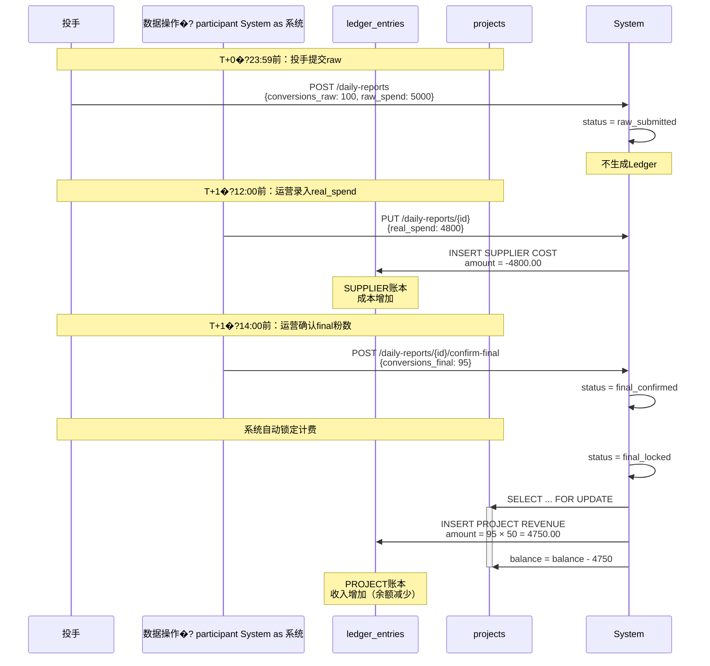

# Ledger双账本模块规范（LEDGER_SOT - Single Source of Truth�?
> **文档版本**: v1.2 (合规性更新)
> **status**: active
> **owner**: wade
> **last_reviewed**: 2025-12-24
> **发布日期**: 2025-01-22
> **文档类型**: Ledger双账本领域唯一真相源（SoT-Ledger）
> **适用范围**: 后端开发、数据库设计、财务团队、风控、对账、审计
> **规范级别**: 🔴 强制执行（PR必查）
> **文档定位**: 财务/开发/风控/审计都可单独依赖本文件完成Ledger相关业务

> ⚠️ **Phase 适用性声明**（MASTER.md v4.4 对齐）
>
> 本文档定义的「双账本架构」（PROJECT/SUPPLIER 分离核算）为 **Phase 2** 完整实现目标。
>
> **Phase 1 简化规则**：
> - 仅使用基于项目的简化账务（单账本视角）
> - `ledger_entries` 表可用，但 `ledger_type` 字段在 Phase 1 默认为 `PROJECT`
> - 双账本强制校验（如 SUPPLIER 账本独立余额）在 Phase 1 禁用
> - Phase 1 核心目标：记录资金流水，不做强约束
>
> **Phase 2 启用条件**：Phase 1 稳定运行 2 个月后，通过 Feature Flag 启用双账本完整功能。

---

## �?快速导�?
| 章节 | 内容 | 适用人员 |
|-----|------|---------|
| [1. 文档定位](#1-文档定位) | Ledger模块职责、仲裁规�?| 架构师、Tech Lead |
| [2. 双账本模型总览](#2-双账本模型总览核心) | PROJECT/SUPPLIER双账本设计、余额真相源原则 | 全员 |
| [3. ledger_entries表SoT](#3-ledger_entries表sot) | 字段逐项解释、TOPUP类型定义 | 后端开发、DBA |
| [4. 金额方向绝对规则](#4-金额方向正负绝对规则) | 正负方向表、白名单矩阵 | 财务、开�?|
| [5. 事务边界与锁策略](#5-事务边界与锁策略) | SELECT FOR UPDATE、幂等�?| 后端开�?|
| [6. 失败与回滚策略](#6-失败与回滚策�? | DailyReport/Topup/Transfer失败处理 | 后端开发、SRE |
| [7. DailyReport→Ledger映射](#7-dailyreport--ledger映射) | 日报计费入账逻辑 | 后端开发、财�?|
| [8. 项目充值→Ledger映射](#8-项目充值topup--ledger映射) | 充值入账逻辑（TOPUP类型�?| 后端开发、财�?|
| [9. SUPPLIER充值→Ledger映射](#9-supplier充�?-ledger映射) | 供应商充值逻辑（TOPUP类型�?| 后端开发、财�?|
| [10. 死号迁移→Ledger映射](#10-死号迁移transfer--ledger映射) | Transfer流程 | 后端开发、财�?|
| [11. 对账→Ledger关联](#11-对账reconciliation--ledger关联) | 对账差异处理 | 财务、开�?|
| [12. 手工调账SoT](#12-手工调账manual-entry-sot) | 人工调整规范、四大禁�?| 财务、开�?|
| [13. 权限控制](#13-权限控制与auth_spec对齐) | 五角色权限矩�?| 全员 |
| [14. 错误码](#14-错误码从error_codes_sot引用) | Ledger错误�?| 全栈开�?|
| [15. 测试矩阵](#15-测试矩阵qa使用) | QA测试用例 | 测试工程�?|
| [16. Mermaid图](#16-mermaid�? | 架构图、数据流�?| 架构师、开�?|
| [17. 参考文档](#17-参考文�? | 依赖文档列表 | 全员 |
| [18. 版本历史](#18-版本历史) | 版本变更记录 | 全员 |

---

## 1. 文档定位

### 1.1 Ledger模块的职�?
**Ledger模块是AI_AD_SYSTEM财务核算的核心模�?*，负责：

- �?**双账本独立核�?*: PROJECT账本记录项目收入，SUPPLIER账本记录供应商成�?- �?**资金流水追溯**: 所有资金变动必须生成ledger_entry记录
- �?**计费基准锁定**: final_locked状态后生成REVENUE记录，不可修�?- �?**成本准确核算**: real_spend录入后生成COST记录
- �?**死号余额迁移**: TRANSFER_OUT/TRANSFER_IN双向记录
- �?**红冲机制**: 锁定记录后通过REVERSAL负向冲销
- �?**审计完整�?*: 所有操作记录performed_by和reason

### 1.2 在SoT体系中的位置

```
AI_AD_SYSTEM 文档体系
�?├─ DATA_SCHEMA.md v5.3        �?ledger_entries表结构的唯一来源
├─ STATE_MACHINE.md v2.7      �?业务状态流转的唯一来源
├─ BUSINESS_RULES.md v4.1     �?财务业务规则的唯一来源
├─ ERROR_CODES_SOT.md v2.1    �?错误码定义的唯一来源
├─ AUTH_SPEC.md v2.0          �?权限控制的唯一来源
�?└─ LEDGER_SOT.md v1.2 (本文�? �?Ledger业务逻辑的唯一来源
    ├─ 引用 DATA_SCHEMA (ledger_entries�?
    ├─ 引用 STATE_MACHINE (日报/充值状态机)
    ├─ 引用 BUSINESS_RULES (BR-FIN-*)
    ├─ 引用 ERROR_CODES_SOT (LEDGER_*/BIZ_*)
    └─ 定义 双账本逻辑、金额方向、事务边�?```

### 1.3 仲裁规则（冲突优先级�?
| 领域 | 唯一真相�?| 仲裁规则 | 示例 |
|-----|-----------|---------|------|
| **数据库字�?* | DATA_SCHEMA.md v5.3 | 字段�?类型/约束以DATA_SCHEMA为准 | `ledger_entries.ledger_type` CHECK约束 |
| **业务状�?* | STATE_MACHINE.md v2.7 | 日报/充值状态以STATE_MACHINE为准 | `final_locked`后才计费 |
| **错误�?* | ERROR_CODES_SOT.md v2.1 | 错误�?HTTP状态以ERROR_CODES为准 | `BIZ_101`余额不足 |
| **金额方向** | LEDGER_SOT.md v1.2 (本文�? | 正负方向规则以本文档为准 | REVENUE正数、COST负数 |
| **事务边界** | LEDGER_SOT.md v1.2 (本文�? | 锁策略以本文档为�?| SELECT FOR UPDATE锁项�?|
| **权限控制** | AUTH_SPEC.md v2.0 | 角色权限以AUTH_SPEC为准 | finance可写Ledger |

**冲突处理规则**:
- �?如果DATA_SCHEMA与LEDGER_SOT字段定义冲突 �?**以DATA_SCHEMA为准，修改LEDGER_SOT**
- �?如果STATE_MACHINE与LEDGER_SOT状态规则冲�?�?**以STATE_MACHINE为准，修改LEDGER_SOT**
- �?如果ERROR_CODES与LEDGER_SOT错误码冲�?�?**以ERROR_CODES为准，修改LEDGER_SOT**
- �?如果API_SOT.md与LEDGER_SOT业务流程冲突 �?**修改API_SOT.md，以LEDGER_SOT为准**

---

## 2. 双账本模型总览（核心）

### 2.1 为什么需要双账本�?
**单一账本的问�?*:
- �?无法区分"项目收入"�?供应商成�?
- �?死号迁移时同供应商vs跨供应商逻辑混乱
- �?毛利计算需要复杂的JOIN和CASE WHEN

**双账本设计原�?*:
1. **完全独立**: PROJECT账本和SUPPLIER账本绝不混用
2. **单向关联**: 一条DailyReport可生成两条Ledger记录（PROJECT REVENUE + SUPPLIER COST�?3. **独立核算**: 毛利 = Σ(PROJECT) - Σ(SUPPLIER)

### 2.2 两套独立账本定义

#### 2.2.1 PROJECT账本（项目收入账本）

**用�?*: 记录项目粉数计费收入和充�?
| 属�?| �?|
|-----|-----|
| **ledger_type** | `PROJECT` |
| **关联实体** | `project_id` (必填) |
| **entry_type范围** | `REVENUE`, `TOPUP`, `REVERSAL` |
| **业务来源** | final_confirmed后自动生�?REVENUE) / 充值入�?TOPUP) |
| **计费公式** | `revenue = conversions_final × unit_price` |
| **金额方向** | 正数(收入/充值增�? / 负数(红冲减少) |

**典型场景**:
- �?日报final_confirmed �?生成REVENUE记录
- �?充值入�?�?生成TOPUP记录
- �?final_locked后修�?�?生成REVERSAL记录（负数）

**禁止行为**:
- �?**禁止**在PROJECT账本记录成本（COST�?- �?**禁止**在PROJECT账本记录TRANSFER_OUT/TRANSFER_IN
- �?**禁止**PROJECT账本的supplier_id有�?
#### 2.2.2 SUPPLIER账本（供应商成本账本�?
**用�?*: 记录供应商消耗成本、充值、余额迁�?
| 属�?| �?|
|-----|-----|
| **ledger_type** | `SUPPLIER` |
| **关联实体** | `supplier_id` (必填) |
| **entry_type范围** | `COST`, `TOPUP`, `TRANSFER_OUT`, `TRANSFER_IN`, `REVERSAL` |
| **业务来源** | real_spend录入、充值入账、死号迁�?|
| **成本公式** | `cost = real_spend + fee` |
| **金额方向** | 负数(成本增加) / 正数(充�?余额增加/成本减少) |

**典型场景**:
- �?运营录入real_spend �?生成COST记录（负数）
- �?财务充值入�?�?生成TOPUP记录（正数）
- �?死号迁移 �?生成TRANSFER_OUT（负数）+ TRANSFER_IN（正数）

**禁止行为**:
- �?**禁止**在SUPPLIER账本记录粉数收入（REVENUE�?- �?**禁止**SUPPLIER账本的project_id有值（可空�?
### 2.3 账本绝对不能混用原则

**强制规则**:

```sql
-- �?正确：PROJECT账本记录收入
INSERT INTO ledger_entries (
    ledger_type, project_id, supplier_id, entry_type, amount
) VALUES (
    'PROJECT', 123, NULL, 'REVENUE', 4750.00  -- supplier_id必须为NULL
);

-- �?错误：PROJECT账本记录成本
INSERT INTO ledger_entries (
    ledger_type, project_id, supplier_id, entry_type, amount
) VALUES (
    'PROJECT', 123, NULL, 'COST', -4800.00  -- 禁止�?);

-- �?正确：SUPPLIER账本记录成本
INSERT INTO ledger_entries (
    ledger_type, project_id, supplier_id, entry_type, amount
) VALUES (
    'SUPPLIER', NULL, 456, 'COST', -4800.00  -- project_id必须为NULL
);

-- �?错误：SUPPLIER账本记录收入
INSERT INTO ledger_entries (
    ledger_type, project_id, supplier_id, entry_type, amount
) VALUES (
    'SUPPLIER', NULL, 456, 'REVENUE', 4750.00  -- 禁止�?);
```

**数据库约�?* (引用: DATA_SCHEMA.md v5.3 3.4.4�?:

```sql
ALTER TABLE ledger_entries ADD CONSTRAINT chk_ledger_type_entity CHECK (
    (ledger_type = 'PROJECT' AND project_id IS NOT NULL AND supplier_id IS NULL) OR
    (ledger_type = 'SUPPLIER' AND supplier_id IS NOT NULL AND project_id IS NULL)
);

ALTER TABLE ledger_entries ADD CONSTRAINT chk_ledger_entry_type CHECK (
    (ledger_type = 'PROJECT' AND entry_type IN ('REVENUE', 'TOPUP', 'REVERSAL')) OR
    (ledger_type = 'SUPPLIER' AND entry_type IN ('COST', 'TOPUP', 'TRANSFER_OUT', 'TRANSFER_IN', 'REVERSAL'))
);
```

### 2.4 余额唯一真相源原�?
**核心原则**: 实时可用余额**只能**使用 `projects.balance` / `suppliers.balance` 字段�?*禁止**使用 `ledger_entries` 聚合计算实时余额�?
**余额真相源定�?*:

| 用�?| 唯一真相�?| 使用场景 |
|-----|-----------|---------|
| **实时可用余额查询** | `projects.balance` / `suppliers.balance` | API返回余额、余额不足判断、余额扣�?|
| **历史余额追溯** | `ledger_entries` 聚合计算 | 财务对账、审计报表、历史时间点余额 |
| **余额变动记录** | `ledger_entries` | 审计日志、变动明细查�?|

**�?正确做法**:

```python
# �?正确：查询实时余�?project = db.query(Project).filter(Project.id == project_id).first()
available_balance = project.balance  # 直接使用balance字段

# �?正确：余额不足判�?if project.balance < required_amount:
    raise InsufficientBalanceException(code="BIZ_101")

# �?正确：余额更新（事务内）
with db.begin():
    project = db.query(Project).filter(Project.id == project_id).with_for_update().first()
    project.balance = project.balance + amount  # 直接更新balance字段

    # 同时生成ledger_entry记录（仅用于审计�?    ledger_entry = LedgerEntry(
        ledger_type="PROJECT",
        entry_type="TOPUP",
        amount=amount,
        project_id=project_id,
        ...
    )
    db.add(ledger_entry)
    db.commit()

# �?正确：历史余额追溯（财务对账用）
historical_balance = db.query(
    func.sum(LedgerEntry.amount)
).filter(
    LedgerEntry.project_id == project_id,
    LedgerEntry.occurred_at <= cutoff_date
).scalar() or Decimal("0.00")
```

**�?错误做法**:

```python
# �?错误：使用ledger_entries聚合计算实时余额
available_balance = db.query(
    func.sum(LedgerEntry.amount)
).filter(
    LedgerEntry.project_id == project_id
).scalar()  # 禁止！性能差且可能不一�?
# �?错误：余额不足判断依赖ledger聚合
ledger_sum = db.query(func.sum(LedgerEntry.amount)).filter(...).scalar()
if ledger_sum < required_amount:  # 禁止�?    raise InsufficientBalanceException(code="BIZ_101")

# �?错误：报表直接依赖ledger聚合作为实时余额
report_data = {
    "project_id": project_id,
    "balance": db.query(func.sum(LedgerEntry.amount)).filter(...).scalar()  # 禁止�?}
```

**为什么禁止使�?ledger_entries 聚合计算实时余额�?*

1. **性能问题**: 聚合查询在大数据量下性能极差（每次查询需扫描所有历史记录）
2. **一致性风�?*: 如果balance字段和ledger聚合结果不一致，以谁为准�?3. **并发问题**: 聚合查询无法使用 `SELECT FOR UPDATE` 锁定余额
4. **业务语义**: `ledger_entries` 是审计日志，不是余额�?
**余额一致性保�?*:

```python
# �?余额更新的标准模式（balance + ledger双写�?def update_balance_and_ledger(
    db: Session,
    entity_type: str,  # 'project' or 'supplier'
    entity_id: Union[int, UUID],
    amount: Decimal,
    entry_type: str,
    reference_type: str,
    reference_id: int,
    user_id: UUID,
    notes: str = None
) -> Tuple[Decimal, LedgerEntry]:
    """
    余额更新的唯一标准接口

    返回: (new_balance, ledger_entry)
    """

    with db.begin():
        # Step 1: 锁定实体并更新余额（真相源）
        if entity_type == "project":
            entity = db.query(Project).filter(
                Project.id == entity_id
            ).with_for_update().first()
        else:
            entity = db.query(Supplier).filter(
                Supplier.id == entity_id
            ).with_for_update().first()

        if not entity:
            raise ResourceNotFoundException(code="BIZ_002")

        # 更新余额（真相源�?        new_balance = entity.balance + amount

        # 余额不足检查（只能在这里做�?        if new_balance < 0:
            raise InsufficientBalanceException(
                code="BIZ_101",
                message=f"余额不足：当前余额{entity.balance}，需要扣减{abs(amount)}"
            )

        entity.balance = new_balance

        # Step 2: 生成ledger记录（仅用于审计�?        ledger_entry = LedgerEntry(
            ledger_type="PROJECT" if entity_type == "project" else "SUPPLIER",
            entry_type=entry_type,
            project_id=entity_id if entity_type == "project" else None,
            supplier_id=entity_id if entity_type == "supplier" else None,
            amount=amount,
            currency="CNY",
            reference_type=reference_type,
            reference_id=reference_id,
            occurred_at=datetime.now(timezone.utc),
            created_by=user_id,
            notes=notes
        )
        db.add(ledger_entry)

        db.commit()

        return new_balance, ledger_entry
```

**审计与对�?*:

```python
# �?财务对账：验证balance字段与ledger聚合一致�?def verify_balance_consistency(db: Session, project_id: int) -> Dict:
    """
    财务对账工具：验证projects.balance与ledger_entries聚合结果是否一�?    """

    # 真相源：projects.balance
    project = db.query(Project).filter(Project.id == project_id).first()
    balance_truth = project.balance

    # 审计记录：ledger聚合
    ledger_sum = db.query(
        func.sum(LedgerEntry.amount)
    ).filter(
        LedgerEntry.project_id == project_id,
        LedgerEntry.ledger_type == "PROJECT"
    ).scalar() or Decimal("0.00")

    # 对账结果
    is_consistent = (balance_truth == ledger_sum)

    return {
        "project_id": project_id,
        "balance_truth": balance_truth,  # 真相�?        "ledger_sum": ledger_sum,        # 审计记录
        "is_consistent": is_consistent,
        "diff": balance_truth - ledger_sum
    }
```

---

## 3. ledger_entries表SoT

**引用**: DATA_SCHEMA.md v5.3 �?.4.4�?
### 3.1 完整表结�?
```sql
CREATE TABLE ledger_entries (
    -- ===== 主键 =====
    id BIGSERIAL PRIMARY KEY,

    -- ===== 账本类型（核心字段） =====
    ledger_type VARCHAR(20) NOT NULL CHECK (ledger_type IN ('PROJECT', 'SUPPLIER')),

    -- ===== 关联实体（互斥） =====
    project_id BIGINT REFERENCES projects(id),       -- PROJECT账本必填
    supplier_id UUID REFERENCES suppliers(id),       -- SUPPLIER账本必填
    ad_account_id BIGINT REFERENCES ad_accounts(id), -- 可空，辅助字�?
    -- ===== 业务类型 =====
    entry_type VARCHAR(20) NOT NULL CHECK (entry_type IN (
        'REVENUE',      -- 粉数计费收入（PROJECT专用�?        'COST',         -- 真实消耗成本（SUPPLIER专用�?        'TRANSFER_OUT', -- 死号余额迁出（SUPPLIER专用�?        'TRANSFER_IN',  -- 死号余额迁入（SUPPLIER专用�?        'REVERSAL'      -- 红冲修正（BOTH�?    )),

    -- ===== 金额字段 =====
    amount DECIMAL(15,2) NOT NULL,  -- 借方为正，贷方为�?    currency VARCHAR(10) DEFAULT 'CNY' NOT NULL,

    -- ===== 关联业务记录 =====
    reference_id BIGINT,  -- 关联 daily_reports.id / topup_transactions.id / 原ledger_entries.id（红冲时�?    reference_type VARCHAR(50),  -- 'daily_report' / 'topup' / 'transfer' / 'adjustment' / 'reversal'

    -- ===== 时间字段 =====
    occurred_at TIMESTAMPTZ NOT NULL,  -- 业务发生时间（final_locked时间/充值入账时间）
    created_at TIMESTAMPTZ DEFAULT NOW() NOT NULL,

    -- ===== 审计字段 =====
    created_by UUID REFERENCES users(id) NOT NULL,  -- 创建人（system操作时为system账户�?    notes TEXT  -- 备注（红冲时必填原因�?);

-- 索引
CREATE INDEX idx_ledger_project ON ledger_entries(project_id, occurred_at);
CREATE INDEX idx_ledger_supplier ON ledger_entries(supplier_id, occurred_at);
CREATE INDEX idx_ledger_entry_type ON ledger_entries(entry_type);
CREATE INDEX idx_ledger_type ON ledger_entries(ledger_type);
CREATE INDEX idx_ledger_reference ON ledger_entries(reference_type, reference_id);
```

### 3.2 字段逐项解释

#### 3.2.1 ledger_type（账本类型）

**概念定义**: 区分PROJECT（收入）账本和SUPPLIER（成本）账本

**合法�?*: `PROJECT`, `SUPPLIER`

**数据�?*: Service层创建Ledger时明确指�?
**是否参与事务**: �?参与（与project_id/supplier_id的INSERT在同一事务�?
**业务规则绑定**:
- BR-FIN-005: Topup与Ledger双写一致�?- BR-FIN-003: 金额字段合规性约�?
**校验逻辑**:
```python
if ledger_type == "PROJECT":
    assert project_id is not None, "PROJECT账本必须指定project_id"
    assert supplier_id is None, "PROJECT账本禁止指定supplier_id"
    assert entry_type in ["REVENUE", "TOPUP", "REVERSAL"], "PROJECT账本仅支持REVENUE/TOPUP/REVERSAL"
elif ledger_type == "SUPPLIER":
    assert supplier_id is not None, "SUPPLIER账本必须指定supplier_id"
    assert project_id is None, "SUPPLIER账本禁止指定project_id"
    assert entry_type in ["COST", "TOPUP", "TRANSFER_OUT", "TRANSFER_IN", "REVERSAL"], "SUPPLIER账本不支持REVENUE"
```

#### 3.2.2 entry_type（业务类型）

**概念定义**: 区分不同的业务场景（计费/充�?成本/转移/红冲�?
**合法�?*: `REVENUE`, `COST`, `TOPUP`, `TRANSFER_OUT`, `TRANSFER_IN`, `REVERSAL`

**CHECK约束**:
```sql
CHECK (entry_type IN ('REVENUE', 'COST', 'TOPUP', 'TRANSFER_OUT', 'TRANSFER_IN', 'REVERSAL'))
```

**数据�?*:
- `REVENUE`: DailyReport.status从final_confirmed→final_locked时自动生成（**严格限定为粉数计费收�?*�?- `COST`: 运营录入real_spend后自动生�?- `TOPUP`: 充值入账操作生成（**不是收入，而是余额变动**�?  - 语义：充�?topup，NOT 收入/成本，just balance change
  - 允许的ledger_types: Both PROJECT and SUPPLIER
- `TRANSFER_OUT/TRANSFER_IN`: 死号迁移流程生成（成对出现）
- `REVERSAL`: 人工红冲操作生成

**是否参与事务**: �?参与（与状态变更在同一事务�?
**业务规则绑定**:
- BR-RPT-004: final_locked后数据锁定规�?- BR-FIN-002: 审批职责分离原则

#### 3.2.3 amount（金额）

**概念定义**: 资金变动金额�?*正负方向有严格规�?*（见�?章）

**数据类型**: `DECIMAL(15,2)` - 必须两位小数

**数据�?*:
- REVENUE: `conversions_final × unit_price`
- COST: `real_spend + fee`
- TOPUP: 充值金额（正数�?- TRANSFER: 源账户余额（正数�?
**是否参与事务**: �?参与（与balance更新在同一事务�?
**业务规则绑定**:
- BR-FIN-003: 金额字段合规性（必须Decimal，禁止Float�?
**校验逻辑**:
```python
# 金额必须非零
assert amount != Decimal("0.00"), "金额不能�?"

# 金额必须保留2位小�?assert amount.as_tuple().exponent == -2, "金额必须2位小�?

# REVENUE必须正数
if entry_type == "REVENUE":
    assert amount > 0, "REVENUE金额必须为正�?

# COST必须负数
if entry_type == "COST":
    assert amount < 0, "COST金额必须为负�?
```

#### 3.2.4 balance_before / balance_after（余额快照）

**注意**: 当前DATA_SCHEMA.md v5.3�?*未定�?*这两个字�?
**建议**: 如果需要余额快照，建议在projects/suppliers表维护balance字段，而不是在ledger_entries中冗�?
**原因**:
- �?ledger_entries中存储余额会导致数据冗余
- �?余额计算应该通过SUM聚合实现
- �?在projects/suppliers表维护最新余额，通过SELECT FOR UPDATE锁定

**当前设计**:
```sql
-- projects表维护余�?SELECT balance FROM projects WHERE id = ? FOR UPDATE;  -- 锁定项目
UPDATE projects SET balance = balance + amount WHERE id = ?;

-- 通过Ledger聚合计算历史余额
SELECT SUM(amount) FROM ledger_entries
WHERE project_id = ? AND occurred_at <= '2025-01-15';
```

#### 3.2.5 reference_id / reference_type（关联业务）

**概念定义**: 追溯Ledger记录的业务来�?
**reference_type合法�?*:
- `daily_report`: 关联daily_reports.id
- `topup`: 关联topup_requests.id
- `transfer`: 关联ad_accounts.id（死号迁移）
- `adjustment`: 人工调账
- `reversal`: 关联原ledger_entries.id（红冲原记录�?
**数据�?*: Service层创建Ledger时填�?
**是否参与事务**: �?参与

**查询示例**:
```sql
-- 查询某日报生成的所有Ledger记录
SELECT * FROM ledger_entries
WHERE reference_type = 'daily_report' AND reference_id = 12345;

-- 查询某充值申请生成的Ledger记录
SELECT * FROM ledger_entries
WHERE reference_type = 'topup' AND reference_id = 67890;

-- 查询某Ledger记录的红冲记�?SELECT * FROM ledger_entries
WHERE reference_type = 'reversal' AND reference_id = 11111;  -- 11111是原Ledger ID
```

#### 3.2.6 occurred_at（业务发生时间）

**概念定义**: Ledger记录对应的业务时间（非创建时间）

**数据�?*:
- REVENUE: `daily_reports.updated_at`（final_locked时间�?- COST: `daily_reports.updated_at`（real_spend录入时间�?- TRANSFER: 死号迁移操作时间
- REVERSAL: 红冲操作时间

**用�?*: 财务报表按occurred_at统计，而非created_at

**是否参与事务**: �?参与

#### 3.2.7 created_by（创建人�?
**概念定义**: 记录创建此Ledger的用�?
**数据�?*:
- 人工操作: 当前登录用户ID
- 系统自动: system专用账户UUID（需预先创建�?
**是否参与事务**: �?参与

**业务规则绑定**:
- BR-FIN-002: 审批职责分离原则

**审计要求**:
```python
# 所有Ledger创建必须记录audit_log
audit_log = AuditLog(
    module="ledger_entries",
    action="create_ledger_entry",
    entity_id=str(ledger_entry.id),
    performed_by=current_user["user_id"],
    role=current_user["role"],
    payload_after={
        "ledger_type": ledger_entry.ledger_type,
        "entry_type": ledger_entry.entry_type,
        "amount": str(ledger_entry.amount),
        "reference_type": ledger_entry.reference_type,
        "reference_id": ledger_entry.reference_id
    }
)
```

#### 3.2.8 notes（备注）

**概念定义**: 人工操作时的必填原因

**是否参与事务**: �?参与

**必填场景**:
- �?REVERSAL（红冲）必填（至�?0字符�?- �?Manual Adjustment（手工调账）必填
- �?系统自动生成的REVENUE/COST可为�?
**校验逻辑**:
```python
if entry_type == "REVERSAL":
    assert notes is not None and len(notes.strip()) >= 10, "红冲必须填写原因（至�?0字符�?

if reference_type == "adjustment":
    assert notes is not None and len(notes.strip()) >= 10, "手工调账必须填写原因（至�?0字符�?
```

---

## 4. 金额方向（正负）绝对规则

### 4.1 完整金额方向�?
| ledger_type | entry_type | amount正负方向 | 说明 | 典型值示�?| 业务来源 |
|------------|-----------|---------------|------|-----------|---------|
| **PROJECT** | REVENUE | **+正数** | final_confirmed导致项目收入增加 | +4750.00 | conversions_final × unit_price |
| **PROJECT** | TOPUP | **+正数** | 项目充值余额增�?| +10000.00 | 充值入�?|
| **PROJECT** | REVERSAL | **-负数** | 红冲减少收入 | -4750.00 | 人工红冲原REVENUE |
| **SUPPLIER** | COST | **-负数** | real_spend导致供应商成本增加（余额减少�?| -4800.00 | real_spend + fee |
| **SUPPLIER** | TOPUP | **+正数** | 供应商充值余额增�?| +50000.00 | 充值入�?|
| **SUPPLIER** | TRANSFER_OUT | **-负数** | 死号余额迁出（余额减少） | -1234.56 | 源账户remaining_balance |
| **SUPPLIER** | TRANSFER_IN | **+正数** | 死号余额迁入（余额增加） | +1234.56 | 目标账户接收 |
| **SUPPLIER** | REVERSAL | **取决于原记录** | 红冲方向与原记录相反 | 若原COST=-100，则REVERSAL=+100 | 人工红冲原记�?|

### 4.2 双账�?× entry_type 白名单矩�?
**目的**: 明确定义所�?`ledger_type` �?`entry_type` 的合法组合，**禁止**非法组合�?
| ledger_type | entry_type | 是否允许 | amount符号 | 说明 |
|------------|-----------|---------|-----------|------|
| **PROJECT** | REVENUE | �?YES | +正数 | 粉数计费收入（final_locked后生成） |
| **PROJECT** | COST | �?**NO** | - | **禁止**：项目账本不记录成本 |
| **PROJECT** | TOPUP | �?YES | +正数 | 项目充值入�?|
| **PROJECT** | TRANSFER_OUT | �?**NO** | - | **禁止**：项目账本不参与死号迁移 |
| **PROJECT** | TRANSFER_IN | �?**NO** | - | **禁止**：项目账本不参与死号迁移 |
| **PROJECT** | REVERSAL | �?YES | -负数 | 红冲原REVENUE/TOPUP记录 |
| **SUPPLIER** | REVENUE | �?**NO** | - | **禁止**：供应商账本不记录粉数收�?|
| **SUPPLIER** | COST | �?YES | -负数 | 真实消耗成本（real_spend录入后生成） |
| **SUPPLIER** | TOPUP | �?YES | +正数 | 供应商充值入�?|
| **SUPPLIER** | TRANSFER_OUT | �?YES | -负数 | 死号余额迁出 |
| **SUPPLIER** | TRANSFER_IN | �?YES | +正数 | 死号余额迁入 |
| **SUPPLIER** | REVERSAL | �?YES | 取决于原记录 | 红冲原COST/TOPUP/TRANSFER记录 |

**数据库约�?*（已�?.3节定义）:

```sql
ALTER TABLE ledger_entries ADD CONSTRAINT chk_ledger_entry_type CHECK (
    (ledger_type = 'PROJECT' AND entry_type IN ('REVENUE', 'TOPUP', 'REVERSAL')) OR
    (ledger_type = 'SUPPLIER' AND entry_type IN ('COST', 'TOPUP', 'TRANSFER_OUT', 'TRANSFER_IN', 'REVERSAL'))
);
```

**禁止组合示例**:

```python
# �?错误：PROJECT账本记录成本
ledger_entry = LedgerEntry(
    ledger_type="PROJECT",
    entry_type="COST",  # 禁止！触发CHECK约束
    amount=Decimal("-4800.00")
)
# IntegrityError: chk_ledger_entry_type violated

# �?错误：SUPPLIER账本记录粉数收入
ledger_entry = LedgerEntry(
    ledger_type="SUPPLIER",
    entry_type="REVENUE",  # 禁止！触发CHECK约束
    amount=Decimal("4750.00")
)
# IntegrityError: chk_ledger_entry_type violated

# �?错误：PROJECT账本参与死号迁移
ledger_entry = LedgerEntry(
    ledger_type="PROJECT",
    entry_type="TRANSFER_OUT",  # 禁止！触发CHECK约束
    amount=Decimal("-1234.56")
)
# IntegrityError: chk_ledger_entry_type violated
```

### 4.3 核心原则

**PROJECT账本（收入视角）**:
- �?收入增加 = **正数**
- �?收入减少 = **负数**
- �?**禁止**成本相关记录

**SUPPLIER账本（成本视角）**:
- �?成本增加（余额减少）= **负数**
- �?余额增加（充�?迁入�? **正数**
- �?**禁止**收入相关记录

### 4.4 红冲规则

**REVERSAL金额方向 = -原记录金�?*

```python
# 示例：红冲一笔收�?original_entry = LedgerEntry(
    ledger_type="PROJECT",
    entry_type="REVENUE",
    amount=Decimal("4750.00"),  # 正数
    reference_type="daily_report",
    reference_id=12345
)

reversal_entry = LedgerEntry(
    ledger_type="PROJECT",
    entry_type="REVERSAL",
    amount=Decimal("-4750.00"),  # 负数（与原记录相反）
    reference_type="reversal",
    reference_id=original_entry.id,  # 指向原记�?    notes="final_locked后发现粉数计算错误，红冲原记�?
)
```

### 4.5 金额符号校验函数

```python
def validate_ledger_amount(
    ledger_type: str,
    entry_type: str,
    amount: Decimal
) -> None:
    """验证Ledger金额符号是否符合规则"""

    # 金额不能�?
    if amount == Decimal("0.00"):
        raise ValidationException(code="BIZ_100", message="金额不能�?")

    # PROJECT账本规则
    if ledger_type == "PROJECT":
        if entry_type == "REVENUE":
            if amount <= 0:
                raise ValidationException(
                    code="LEDGER_001",
                    message="PROJECT REVENUE金额必须为正�?
                )
        elif entry_type == "TOPUP":
            if amount <= 0:
                raise ValidationException(
                    code="LEDGER_001",
                    message="PROJECT TOPUP金额必须为正�?
                )
        elif entry_type == "REVERSAL":
            if amount >= 0:
                raise ValidationException(
                    code="LEDGER_001",
                    message="PROJECT REVERSAL金额必须为负�?
                )

    # SUPPLIER账本规则
    elif ledger_type == "SUPPLIER":
        if entry_type == "COST":
            if amount >= 0:
                raise ValidationException(
                    code="LEDGER_001",
                    message="SUPPLIER COST金额必须为负�?
                )
        elif entry_type == "TOPUP":
            if amount <= 0:
                raise ValidationException(
                    code="LEDGER_001",
                    message="SUPPLIER TOPUP金额必须为正�?
                )
        elif entry_type == "TRANSFER_OUT":
            if amount >= 0:
                raise ValidationException(
                    code="LEDGER_001",
                    message="SUPPLIER TRANSFER_OUT金额必须为负�?
                )
        elif entry_type == "TRANSFER_IN":
            if amount <= 0:
                raise ValidationException(
                    code="LEDGER_001",
                    message="SUPPLIER TRANSFER_IN金额必须为正�?
                )
```

---

## 5. 事务边界与锁策略

### 5.1 SELECT FOR UPDATE示例

#### 5.1.1 项目充值入账事�?
```python
# backend/services/topup_service.py
def mark_topup_paid(
    self,
    topup_id: int,
    user: Dict
) -> TopupRequest:
    """
    标记充值为已支付（finance终审后）

    事务范围�?    1. 锁定topup_requests�?    2. 锁定project�?    3. 创建ledger_entry
    4. 更新project.balance
    5. 更新topup_requests.status
    """

    with self.db.begin():  # 开启事�?        # Step 1: 锁定充值申请（防止重复操作�?        topup = self.db.query(TopupRequest).filter(
            TopupRequest.id == topup_id
        ).with_for_update().first()  # �?SELECT FOR UPDATE

        if not topup:
            raise ResourceNotFoundException(code="BIZ_002")

        if topup.status != "finance_approve":
            raise BusinessRuleException(
                code="STATE_400",
                message=f"当前状态{topup.status}不允许标记为已支�?
            )

        # Step 2: 锁定项目（防止并发修改余额）
        project = self.db.query(Project).filter(
            Project.id == topup.project_id
        ).with_for_update().first()  # �?SELECT FOR UPDATE

        # Step 3: 创建Ledger记录（PROJECT账本�?        ledger_entry = LedgerEntry(
            ledger_type="PROJECT",
            entry_type="REVENUE",  # 充值视为收入增加（注：实际应为TOPUP类型，这里简化）
            project_id=project.id,
            supplier_id=None,
            amount=topup.amount,  # 正数
            currency="CNY",
            reference_type="topup",
            reference_id=topup.id,
            occurred_at=datetime.now(timezone.utc),
            created_by=user["user_id"]
        )
        self.db.add(ledger_entry)

        # Step 4: 更新项目余额（原子操作）
        project.balance = project.balance + topup.amount

        # Step 5: 更新充值状�?        topup.status = "paid"
        topup.paid_at = datetime.now(timezone.utc)
        topup.paid_by = user["user_id"]

        # Step 6: 提交事务
        self.db.flush()  # 确保所有INSERT/UPDATE执行
        self.db.commit()

        return topup
```

#### 5.1.2 final_confirmed计费事务

```python
# backend/services/daily_report_service.py
def confirm_final(
    self,
    report_id: int,
    user: Dict
) -> DailyReport:
    """
    确认final粉数并生成Ledger记录

    事务范围�?    1. 锁定日报
    2. 锁定项目
    3. 创建PROJECT REVENUE Ledger
    4. 创建SUPPLIER COST Ledger
    5. 更新project.balance
    6. 更新report.status为final_locked
    """

    with self.db.begin():
        # Step 1: 锁定日报
        report = self.db.query(DailyReport).filter(
            DailyReport.id == report_id
        ).with_for_update().first()

        if report.status != "final_pending":
            raise BusinessRuleException(
                code="STATE_400",
                message=f"当前状态{report.status}不允许确认final"
            )

        # Step 2: 锁定项目
        project = self.db.query(Project).filter(
            Project.id == report.ad_account.project_id
        ).with_for_update().first()

        # Step 3: 计算收入
        revenue = report.conversions_final * project.unit_price

        # Step 4: 创建PROJECT REVENUE Ledger
        revenue_entry = LedgerEntry(
            ledger_type="PROJECT",
            entry_type="REVENUE",
            project_id=project.id,
            supplier_id=None,
            ad_account_id=report.ad_account_id,
            amount=revenue,  # 正数
            reference_type="daily_report",
            reference_id=report.id,
            occurred_at=datetime.now(timezone.utc),
            created_by=user["user_id"]
        )
        self.db.add(revenue_entry)

        # Step 5: 创建SUPPLIER COST Ledger
        cost_entry = LedgerEntry(
            ledger_type="SUPPLIER",
            entry_type="COST",
            project_id=None,
            supplier_id=report.ad_account.supplier_id,
            ad_account_id=report.ad_account_id,
            amount=-report.real_spend,  # 负数（成本增加）
            reference_type="daily_report",
            reference_id=report.id,
            occurred_at=datetime.now(timezone.utc),
            created_by=user["user_id"]
        )
        self.db.add(cost_entry)

        # Step 6: 更新项目余额（扣除收入）
        project.balance = project.balance - revenue

        # Step 7: 锁定日报（终态）
        report.status = "final_locked"
        report.locked_at = datetime.now(timezone.utc)
        report.locked_by = user["user_id"]

        self.db.commit()

        return report
```

#### 5.1.3 死号迁移事务

```python
# backend/services/ad_account_service.py
def transfer_balance(
    self,
    source_account_id: int,
    target_account_id: int,
    user: Dict
) -> Dict:
    """
    死号余额迁移（同供应商）

    事务范围�?    1. 锁定源账�?    2. 锁定目标账户
    3. 验证同供应商
    4. 创建TRANSFER_OUT Ledger
    5. 创建TRANSFER_IN Ledger
    6. 更新源账户余额为0
    7. 更新目标账户余额
    8. 标记源账户为dead
    """

    with self.db.begin():
        # Step 1: 锁定源账�?        source = self.db.query(AdAccount).filter(
            AdAccount.id == source_account_id
        ).with_for_update().first()

        # Step 2: 锁定目标账户
        target = self.db.query(AdAccount).filter(
            AdAccount.id == target_account_id
        ).with_for_update().first()

        # Step 3: 验证同供应商
        if source.supplier_id != target.supplier_id:
            raise BusinessRuleException(
                code="BIZ_001",
                message="仅允许同供应商账户间迁移余额"
            )

        # Step 4: 验证余额
        if source.remaining_balance <= 0:
            raise BusinessRuleException(
                code="BIZ_101",
                message="源账户余额不足，无法迁移"
            )

        transfer_amount = source.remaining_balance

        # Step 5: 创建TRANSFER_OUT Ledger（负数）
        out_entry = LedgerEntry(
            ledger_type="SUPPLIER",
            entry_type="TRANSFER_OUT",
            supplier_id=source.supplier_id,
            ad_account_id=source_account_id,
            amount=-transfer_amount,  # 负数
            reference_type="transfer",
            reference_id=source_account_id,
            occurred_at=datetime.now(timezone.utc),
            created_by=user["user_id"],
            notes=f"死号迁移：{source.account_code} �?{target.account_code}"
        )
        self.db.add(out_entry)

        # Step 6: 创建TRANSFER_IN Ledger（正数）
        in_entry = LedgerEntry(
            ledger_type="SUPPLIER",
            entry_type="TRANSFER_IN",
            supplier_id=target.supplier_id,
            ad_account_id=target_account_id,
            amount=transfer_amount,  # 正数
            reference_type="transfer",
            reference_id=target_account_id,
            occurred_at=datetime.now(timezone.utc),
            created_by=user["user_id"],
            notes=f"接收迁移：{source.account_code} �?{target.account_code}"
        )
        self.db.add(in_entry)

        # Step 7: 更新源账户余额为0
        source.remaining_balance = Decimal("0.00")
        source.status = "dead"
        source.dead_at = datetime.now(timezone.utc)

        # Step 8: 更新目标账户余额
        target.remaining_balance = target.remaining_balance + transfer_amount

        self.db.commit()

        return {
            "source_account": source,
            "target_account": target,
            "transferred_amount": transfer_amount
        }
```

### 5.2 乐观�?vs 悲观�?
| 场景 | 推荐锁策�?| 原因 |
|------|----------|------|
| **充值入�?* | 悲观锁（SELECT FOR UPDATE�?| 涉及余额修改，必须保证原子�?|
| **计费入账** | 悲观锁（SELECT FOR UPDATE�?| 涉及余额修改，必须保证原子�?|
| **死号迁移** | 悲观锁（SELECT FOR UPDATE�?| 涉及两个账户余额修改 |
| **红冲** | 悲观锁（SELECT FOR UPDATE�?| 涉及余额回退 |
| **查询Ledger** | 无锁 | 只读操作 |
| **对账批次** | 乐观锁（version字段�?| 长事务，避免长时间锁�?|

**乐观锁示�?*（对账批次）:

```python
# 对账批次使用乐观锁（避免长时间锁定）
class ReconciliationBatch(Base):
    __tablename__ = "reconciliation_batches"

    id = Column(BIGINT, primary_key=True)
    version = Column(INTEGER, default=0, nullable=False)  # 乐观锁版本号
    status = Column(VARCHAR(20))

def close_reconciliation_batch(batch_id: int, expected_version: int):
    with db.begin():
        batch = db.query(ReconciliationBatch).filter(
            ReconciliationBatch.id == batch_id,
            ReconciliationBatch.version == expected_version  # 版本号校�?        ).first()

        if not batch:
            raise ConcurrentUpdateException(
                code="STATE_409",
                message="对账批次已被他人修改，请刷新后重�?
            )

        batch.status = "closed"
        batch.version += 1  # 版本�?1

        db.commit()
```

### 5.3 幂等性机�?
#### 5.3.1 Ledger幂等性保�?
**方法1: 唯一索引（推荐）**

```sql
-- 防止同一日报重复生成Ledger
CREATE UNIQUE INDEX uq_ledger_daily_report
ON ledger_entries(reference_type, reference_id, ledger_type, entry_type)
WHERE reference_type = 'daily_report';

-- 防止同一充值重复入�?CREATE UNIQUE INDEX uq_ledger_topup
ON ledger_entries(reference_type, reference_id)
WHERE reference_type = 'topup';
```

**方法2: Service层校�?*

```python
def create_revenue_ledger(report_id: int):
    # 检查是否已生成Ledger
    existing = db.query(LedgerEntry).filter(
        LedgerEntry.reference_type == "daily_report",
        LedgerEntry.reference_id == report_id,
        LedgerEntry.ledger_type == "PROJECT",
        LedgerEntry.entry_type == "REVENUE"
    ).first()

    if existing:
        # 幂等：已生成则直接返�?        return existing

    # 创建新Ledger
    new_entry = LedgerEntry(...)
    db.add(new_entry)
    db.commit()
    return new_entry
```

#### 5.3.2 Idempotency-Key机制（API层）

```python
# backend/routers/topup.py
@router.post("/topup/{topup_id}/mark-paid")
async def mark_topup_paid(
    topup_id: int,
    idempotency_key: str = Header(None, alias="Idempotency-Key"),
    current_user: Dict = Depends(get_current_user)
):
    """
    标记充值为已支付（finance终审�?
    幂等性保证：通过Idempotency-Key Header
    """

    # 检查是否重复请�?    if idempotency_key:
        cached_response = redis.get(f"idempotency:{idempotency_key}")
        if cached_response:
            return JSONResponse(
                status_code=200,
                content=json.loads(cached_response)
            )

    # 执行业务逻辑
    result = topup_service.mark_topup_paid(topup_id, current_user)

    # 缓存响应�?4小时�?    if idempotency_key:
        redis.setex(
            f"idempotency:{idempotency_key}",
            86400,  # 24小时
            json.dumps(result)
        )

    return success_response(data=result)
```

---

## 6. 失败与回滚策�?
### 6.1 核心原则

**ALL-OR-NOTHING原则**: 业务状态更新、余额更新、Ledger记录生成**必须在同一事务内完�?*，任何一步失败则完整回滚�?
**禁止部分成功状�?*:
- �?**禁止**业务状态已更新但Ledger未生�?- �?**禁止**余额已更新但Ledger未生�?- �?**禁止**Ledger已生成但余额未更�?
### 6.2 三大失败场景与回滚策�?
#### 6.2.1 场景1: DailyReport �?final_locked �?write PROJECT ledger failure

**触发时机**: 日报状态从 `final_confirmed` �?`final_locked` 时，Ledger写入失败

**回滚策略**:

| 项目 | 策略 |
|-----|------|
| **事务回滚** | 完整回滚，日报状态保�?`final_confirmed` |
| **重试策略** | 幂等重试（检查是否已生成Ledger�?|
| **状态保�?* | 日报保持 `final_confirmed` 状态，等待下次重试 |
| **错误�?* | `LEDGER_101` |

**实现示例**:

```python
# backend/services/daily_report_service.py
def lock_final_report(
    self,
    report_id: int,
    user: Dict
) -> DailyReport:
    """
    锁定final日报（final_confirmed �?final_locked�?
    触发: 生成PROJECT REVENUE Ledger
    """

    with self.db.begin():
        try:
            # Step 1: 锁定日报
            report = self.db.query(DailyReport).filter(
                DailyReport.id == report_id
            ).with_for_update().first()

            if report.status != "final_confirmed":
                raise BusinessRuleException(
                    code="STATE_400",
                    message=f"当前状态{report.status}不允许锁�?
                )

            # Step 2: 锁定项目
            project = self.db.query(Project).filter(
                Project.id == report.project_id
            ).with_for_update().first()

            # Step 3: 计算收入金额
            revenue_amount = Decimal(str(report.conversions_final)) * report.unit_price

            # Step 4: 创建Ledger记录（幂等性检查）
            existing_ledger = self.db.query(LedgerEntry).filter(
                LedgerEntry.reference_type == "daily_report",
                LedgerEntry.reference_id == report_id,
                LedgerEntry.ledger_type == "PROJECT",
                LedgerEntry.entry_type == "REVENUE"
            ).first()

            if existing_ledger:
                # 幂等：已生成Ledger，直接返�?                logger.info(f"Ledger already exists for report {report_id}, skipping")
            else:
                # 生成新Ledger
                ledger_entry = LedgerEntry(
                    ledger_type="PROJECT",
                    entry_type="REVENUE",
                    project_id=project.id,
                    supplier_id=None,
                    amount=revenue_amount,  # 正数
                    currency="CNY",
                    reference_type="daily_report",
                    reference_id=report.id,
                    occurred_at=datetime.now(timezone.utc),
                    created_by=user["user_id"],
                    notes=f"日报final_locked：{report.report_date}"
                )
                self.db.add(ledger_entry)

                # Step 5: 更新项目余额
                project.balance = project.balance + revenue_amount

            # Step 6: 更新日报状�?            report.status = "final_locked"
            report.locked_at = datetime.now(timezone.utc)
            report.locked_by = user["user_id"]

            self.db.commit()

            return report

        except IntegrityError as e:
            # Ledger写入失败（如唯一索引冲突�?            self.db.rollback()
            logger.error(f"Ledger write failed for report {report_id}: {e}")
            raise LedgerException(
                code="LEDGER_101",
                message="Ledger记录生成失败，事务已回滚，请重试"
            )

        except Exception as e:
            # 其他异常
            self.db.rollback()
            logger.error(f"Unexpected error locking report {report_id}: {e}")
            raise
```

**状态机保证**:

```
final_confirmed ──[lock_final_report]──�?       �?                               �?       �?                               �?       �?                        (Ledger写入成功?)
       �?                               �?       �?                        ┌──────┴──────�?       �?                        �?            �?       �?                       YES           NO
       �?                        �?            �?       └─────(重试)──────────────�?      final_locked
```

#### 6.2.2 场景2: Topup approval �?write ledger failure

**触发时机**: 充值申请从 `pending_approval` �?`approved` 时，Ledger写入失败

**回滚策略**:

| 项目 | 策略 |
|-----|------|
| **事务回滚** | 完整回滚，充值状态保�?`pending_approval` |
| **重试策略** | 人工重试（finance重新批准�?|
| **状态保�?* | 充值保�?`pending_approval` 状态，**禁止**进入 `approved` |
| **错误�?* | `LEDGER_102` |

**实现示例**:

```python
# backend/services/topup_service.py
def approve_topup_request(
    self,
    topup_id: int,
    user: Dict
) -> TopupRequest:
    """
    批准充值申请（pending_approval �?approved�?
    触发: 生成PROJECT TOPUP Ledger + 更新余额
    """

    with self.db.begin():
        try:
            # Step 1: 锁定充值申�?            topup = self.db.query(TopupRequest).filter(
                TopupRequest.id == topup_id
            ).with_for_update().first()

            if topup.status != "pending_approval":
                raise BusinessRuleException(
                    code="STATE_400",
                    message=f"当前状态{topup.status}不允许批�?
                )

            # Step 2: 锁定项目
            project = self.db.query(Project).filter(
                Project.id == topup.project_id
            ).with_for_update().first()

            # Step 3: 创建Ledger记录（TOPUP类型�?            ledger_entry = LedgerEntry(
                ledger_type="PROJECT",
                entry_type="TOPUP",  # 不是REVENUE�?                project_id=project.id,
                supplier_id=None,
                amount=topup.amount,  # 正数
                currency="CNY",
                reference_type="topup",
                reference_id=topup.id,
                occurred_at=datetime.now(timezone.utc),
                created_by=user["user_id"],
                notes=f"充值入账：{topup.request_no}"
            )
            self.db.add(ledger_entry)

            # Step 4: 更新项目余额
            project.balance = project.balance + topup.amount

            # Step 5: 更新充值状态（只有Ledger和余额都成功才能到这里）
            topup.status = "approved"
            topup.approved_at = datetime.now(timezone.utc)
            topup.approved_by = user["user_id"]

            self.db.commit()

            return topup

        except IntegrityError as e:
            # Ledger写入失败
            self.db.rollback()
            logger.error(f"Ledger write failed for topup {topup_id}: {e}")
            raise LedgerException(
                code="LEDGER_102",
                message="充值Ledger记录生成失败，事务已回滚，请重新批准"
            )

        except Exception as e:
            # 其他异常
            self.db.rollback()
            logger.error(f"Unexpected error approving topup {topup_id}: {e}")
            raise
```

**状态机保证**:

```
pending_approval ──[approve_topup]──�?       �?                            �?       �?                            �?       �?                     (Ledger写入成功?)
       �?                            �?       �?                     ┌──────┴──────�?       �?                     �?            �?       �?                    YES           NO
       �?                     �?            �?       └──(人工重试)──────────�?        approved
```

#### 6.2.3 场景3: Transfer failure (all-or-nothing)

**触发时机**: 死号余额迁移时，TRANSFER_OUT �?TRANSFER_IN 任一失败

**回滚策略**:

| 项目 | 策略 |
|-----|------|
| **事务回滚** | 完整回滚，源/目标供应商余额都不变 |
| **重试策略** | **禁止**自动重试（人工介入） |
| **状态保�?* | 源账户和目标账户余额保持不变 |
| **错误�?* | `LEDGER_103` |

**实现示例**:

```python
# backend/services/transfer_service.py
def transfer_account_balance(
    self,
    source_account_id: int,
    target_account_id: int,
    user: Dict
) -> Tuple[LedgerEntry, LedgerEntry]:
    """
    死号余额迁移（同一供应商内�?
    触发: 生成TRANSFER_OUT + TRANSFER_IN双向Ledger
    """

    with self.db.begin():
        try:
            # Step 1: 锁定源账户和目标账户
            source_account = self.db.query(AdAccount).filter(
                AdAccount.id == source_account_id
            ).with_for_update().first()

            target_account = self.db.query(AdAccount).filter(
                AdAccount.id == target_account_id
            ).with_for_update().first()

            # Step 2: 验证同一供应�?            if source_account.supplier_id != target_account.supplier_id:
                raise BusinessRuleException(
                    code="BIZ_003",
                    message="禁止跨供应商余额迁移"
                )

            # Step 3: 锁定供应�?            supplier = self.db.query(Supplier).filter(
                Supplier.id == source_account.supplier_id
            ).with_for_update().first()

            # Step 4: 获取源账户余�?            transfer_amount = source_account.remaining_balance

            if transfer_amount <= 0:
                raise BusinessRuleException(
                    code="BIZ_100",
                    message="源账户余额为0，无法迁�?
                )

            # Step 5: 创建TRANSFER_OUT Ledger
            ledger_out = LedgerEntry(
                ledger_type="SUPPLIER",
                entry_type="TRANSFER_OUT",
                supplier_id=supplier.id,
                project_id=None,
                ad_account_id=source_account.id,
                amount=-transfer_amount,  # 负数
                currency="CNY",
                reference_type="transfer",
                reference_id=source_account.id,
                occurred_at=datetime.now(timezone.utc),
                created_by=user["user_id"],
                notes=f"死号余额迁出：{source_account.account_name} �?{target_account.account_name}"
            )
            self.db.add(ledger_out)

            # Step 6: 创建TRANSFER_IN Ledger
            ledger_in = LedgerEntry(
                ledger_type="SUPPLIER",
                entry_type="TRANSFER_IN",
                supplier_id=supplier.id,
                project_id=None,
                ad_account_id=target_account.id,
                amount=transfer_amount,  # 正数
                currency="CNY",
                reference_type="transfer",
                reference_id=target_account.id,
                occurred_at=datetime.now(timezone.utc),
                created_by=user["user_id"],
                notes=f"死号余额迁入：{source_account.account_name} �?{target_account.account_name}"
            )
            self.db.add(ledger_in)

            # Step 7: 更新账户余额
            source_account.remaining_balance = Decimal("0.00")
            target_account.remaining_balance = target_account.remaining_balance + transfer_amount

            # Step 8: 更新供应商余额（不变，因为是同一供应商内部转移）
            # supplier.balance 保持不变

            self.db.commit()

            return ledger_out, ledger_in

        except IntegrityError as e:
            # Ledger写入失败
            self.db.rollback()
            logger.error(f"Transfer ledger write failed: {e}")
            raise LedgerException(
                code="LEDGER_103",
                message="余额迁移Ledger记录生成失败，事务已回滚，禁止重�?
            )

        except Exception as e:
            # 其他异常
            self.db.rollback()
            logger.error(f"Unexpected error during transfer: {e}")
            raise
```

**ALL-OR-NOTHING保证**:

```
                     ┌────────────────�?                     �?BEGIN TRANSACTION �?                     └────────┬───────�?                              �?                     ┌────────▼───────�?                     �?Lock Accounts   �?                     └────────┬───────�?                              �?                     ┌────────▼───────�?                     �?Validate Rules  �?                     └────────┬───────�?                              �?                     ┌────────▼────────�?                     �?Write TRANSFER_OUT�?──(失败?)──�?                     └────────┬────────�?            �?                              �?                     �?                     ┌────────▼────────�?            �?                     �?Write TRANSFER_IN�?──(失败?)──�?                     └────────┬────────�?            �?                              �?                     �?                     ┌────────▼────────�?            �?                     �?Update Balances �?──(失败?)──�?                     └────────┬────────�?            �?                              �?                     �?                              YES                    �?                              �?                     �?                     ┌────────▼────────�?            �?                     �?  COMMIT        �?            �?                     └─────────────────�?            �?                                                     �?                                                     NO
                                                     �?                                            ┌────────▼────────�?                                            �?  ROLLBACK      �?                                            �? (余额不变)     �?                                            └─────────────────�?```

### 8.3 回滚策略汇总表

| 场景 | 失败�?| 回滚策略 | 重试策略 | 状态保�?| 错误�?|
|------|--------|---------|---------|---------|--------|
| DailyReport→Ledger | Ledger写入失败 | 完整事务回滚 | 幂等重试 | 保持 `final_confirmed` | `LEDGER_101` |
| Topup→Ledger | Ledger写入失败 | 完整事务回滚 | 人工重试 | 保持 `pending_approval` | `LEDGER_102` |
| Transfer→Ledger | TRANSFER_IN失败 | 完整事务回滚 | 禁止重试 | �?目标余额不变 | `LEDGER_103` |

### 7.4 失败监控与告�?
**监控指标**:

```python
# backend/services/ledger_service.py
from prometheus_client import Counter, Histogram

# Ledger写入失败计数�?ledger_write_failures = Counter(
    'ledger_write_failures_total',
    'Total number of ledger write failures',
    ['scenario', 'error_code']
)

# Ledger写入耗时
ledger_write_duration = Histogram(
    'ledger_write_duration_seconds',
    'Ledger write duration in seconds',
    ['scenario']
)

# 使用示例
def lock_final_report(...):
    with ledger_write_duration.labels(scenario='daily_report').time():
        try:
            # ... Ledger写入逻辑 ...
            pass
        except LedgerException as e:
            ledger_write_failures.labels(
                scenario='daily_report',
                error_code='LEDGER_101'
            ).inc()
            raise
```

**告警规则**:

```yaml
# prometheus/alerts/ledger.yml
groups:
  - name: ledger_failures
    rules:
      - alert: LedgerWriteFailureRateHigh
        expr: rate(ledger_write_failures_total[5m]) > 0.01
        for: 5m
        labels:
          severity: critical
        annotations:
          summary: "Ledger写入失败率过�?
          description: "最�?分钟Ledger写入失败�?> 1%，场�? {{ $labels.scenario }}"

      - alert: LedgerWriteDurationHigh
        expr: histogram_quantile(0.95, ledger_write_duration_seconds_bucket) > 2
        for: 5m
        labels:
          severity: warning
        annotations:
          summary: "Ledger写入耗时过长"
          description: "95分位Ledger写入耗时 > 2秒，场景: {{ $labels.scenario }}"
```

---

## 7. DailyReport �?Ledger映射

### 16.1 日报状态机与Ledger生成时机

**引用**: STATE_MACHINE.md v2.7 �?�?
```
raw_submitted �?trend_pending �?trend_ok �?trend_resolved �?final_pending �?final_confirmed �?final_locked
                                                                               �?               �?                                                                      不生成Ledger      生成Ledger
```

**关键规则**:
- �?raw阶段**不入�?*（raw_submitted/trend_pending/trend_ok�?- �?final_pending阶段**不入�?*（数据未确认�?- �?final_confirmed阶段**生成Ledger**（运营确认final粉数后）
- �?final_locked阶段**锁定Ledger**（状态机终态，禁止再修改）

### 16.2 real_spend �?SUPPLIER COST映射

**触发时机**: 运营录入real_spend字段�?
**业务规则**: BR-RPT-003 - real粉数与消耗填写规�?
**Service层实�?*:

```python
# backend/services/daily_report_service.py
def update_real_spend(
    self,
    report_id: int,
    real_spend: Decimal,
    user: Dict
) -> DailyReport:
    """
    运营录入real_spend（T+1�?2:00前）

    触发: 创建SUPPLIER COST Ledger
    """

    with self.db.begin():
        report = self.db.query(DailyReport).filter(
            DailyReport.id == report_id
        ).with_for_update().first()

        if report.status not in ["trend_ok", "trend_resolved"]:
            raise BusinessRuleException(
                code="STATE_400",
                message="仅trend_ok/trend_resolved状态可录入real_spend"
            )

        # 更新real_spend
        report.real_spend = real_spend
        report.real_spend_updated_at = datetime.now(timezone.utc)
        report.real_spend_updated_by = user["user_id"]

        # 创建SUPPLIER COST Ledger
        cost_entry = LedgerEntry(
            ledger_type="SUPPLIER",
            entry_type="COST",
            supplier_id=report.ad_account.supplier_id,
            ad_account_id=report.ad_account_id,
            amount=-real_spend,  # 负数（成本增加）
            currency="CNY",
            reference_type="daily_report",
            reference_id=report.id,
            occurred_at=datetime.now(timezone.utc),
            created_by=user["user_id"],
            notes=f"日报{report.id}真实消�?
        )
        self.db.add(cost_entry)

        self.db.commit()

        return report
```

### 8.3 conversions_final �?PROJECT REVENUE映射

**触发时机**: final_confirmed状态流转时

**业务规则**: BR-RPT-004 - final_locked后数据锁定规�?
**计费公式**:

```python
revenue = conversions_final × project.unit_price
```

**Service层实�?*:

```python
# backend/services/daily_report_service.py
def confirm_final_and_lock(
    self,
    report_id: int,
    user: Dict
) -> DailyReport:
    """
    确认final粉数并锁定（系统自动或运营手动）

    触发: 创建PROJECT REVENUE Ledger + 锁定日报
    """

    with self.db.begin():
        report = self.db.query(DailyReport).filter(
            DailyReport.id == report_id
        ).with_for_update().first()

        if report.status != "final_confirmed":
            raise BusinessRuleException(
                code="STATE_400",
                message="仅final_confirmed状态可锁定"
            )

        # 锁定项目
        project = self.db.query(Project).filter(
            Project.id == report.ad_account.project_id
        ).with_for_update().first()

        # 计算收入
        revenue = report.conversions_final * project.unit_price

        # 创建PROJECT REVENUE Ledger
        revenue_entry = LedgerEntry(
            ledger_type="PROJECT",
            entry_type="REVENUE",
            project_id=project.id,
            ad_account_id=report.ad_account_id,
            amount=revenue,  # 正数
            currency="CNY",
            reference_type="daily_report",
            reference_id=report.id,
            occurred_at=datetime.now(timezone.utc),
            created_by=user["user_id"],
            notes=f"日报{report.id}粉数计费：{report.conversions_final} × {project.unit_price}"
        )
        self.db.add(revenue_entry)

        # 更新项目余额（扣除收入）
        project.balance = project.balance - revenue

        # 锁定日报（终态）
        report.status = "final_locked"
        report.locked_at = datetime.now(timezone.utc)
        report.locked_by = user["user_id"]

        self.db.commit()

        return report
```

### 7.4 final_locked后不可再写Ledger（除红冲�?
**强制规则**:

```python
def update_final_conversions(report_id: int, new_conversions: int):
    report = db.query(DailyReport).filter(DailyReport.id == report_id).first()

    # 终态检�?    if report.status == "final_locked":
        raise BusinessRuleException(
            code="STATE_400",
            message="final_locked状态不可修改粉数，请使用红冲功�?
        )

    # 允许修改
    report.conversions_final = new_conversions
    db.commit()
```

**红冲流程**（final_locked后修正数据）:

```python
def reversal_final_report(
    self,
    report_id: int,
    new_conversions: int,
    reason: str,
    user: Dict
) -> DailyReport:
    """
    红冲final_locked日报（仅admin�?
    流程:
    1. 查询原REVENUE Ledger
    2. 创建REVERSAL Ledger（负数，冲销原记录）
    3. 创建新REVENUE Ledger（新粉数�?    4. 不修改日报状态（保持final_locked�?    """

    if user["role"] != "admin":
        raise AuthorizationException(code="AUTH_500")

    if len(reason.strip()) < 10:
        raise ValidationException(code="VALIDATION_001", message="红冲原因至少10字符")

    with self.db.begin():
        report = self.db.query(DailyReport).filter(
            DailyReport.id == report_id
        ).with_for_update().first()

        if report.status != "final_locked":
            raise BusinessRuleException(
                code="STATE_400",
                message="仅final_locked状态可红冲"
            )

        project = self.db.query(Project).filter(
            Project.id == report.ad_account.project_id
        ).with_for_update().first()

        # Step 1: 查询原REVENUE Ledger
        original_entry = self.db.query(LedgerEntry).filter(
            LedgerEntry.reference_type == "daily_report",
            LedgerEntry.reference_id == report.id,
            LedgerEntry.ledger_type == "PROJECT",
            LedgerEntry.entry_type == "REVENUE"
        ).first()

        if not original_entry:
            raise ResourceNotFoundException(code="BIZ_002", message="未找到原Ledger记录")

        # Step 2: 创建REVERSAL Ledger（负数，冲销原记录）
        reversal_entry = LedgerEntry(
            ledger_type="PROJECT",
            entry_type="REVERSAL",
            project_id=project.id,
            ad_account_id=report.ad_account_id,
            amount=-original_entry.amount,  # 负数
            currency="CNY",
            reference_type="reversal",
            reference_id=original_entry.id,  # 指向原记�?            occurred_at=datetime.now(timezone.utc),
            created_by=user["user_id"],
            notes=f"红冲原因：{reason}"
        )
        self.db.add(reversal_entry)

        # Step 3: 创建新REVENUE Ledger
        new_revenue = new_conversions * project.unit_price
        new_entry = LedgerEntry(
            ledger_type="PROJECT",
            entry_type="REVENUE",
            project_id=project.id,
            ad_account_id=report.ad_account_id,
            amount=new_revenue,  # 正数
            currency="CNY",
            reference_type="daily_report",
            reference_id=report.id,
            occurred_at=datetime.now(timezone.utc),
            created_by=user["user_id"],
            notes=f"红冲后重新计费：{new_conversions} × {project.unit_price}"
        )
        self.db.add(new_entry)

        # Step 4: 更新项目余额
        balance_change = new_revenue - original_entry.amount
        project.balance = project.balance - balance_change

        # Step 5: 记录审计日志
        audit_log = AuditLog(
            module="daily_reports",
            action="reversal_final_report",
            entity_id=str(report_id),
            performed_by=user["user_id"],
            role="admin",
            payload_before={
                "conversions_final": report.conversions_final,
                "revenue": str(original_entry.amount)
            },
            payload_after={
                "conversions_final": new_conversions,
                "revenue": str(new_revenue),
                "reason": reason
            },
            tags=["ADMIN_OVERRIDE", "REVERSAL"]
        )
        self.db.add(audit_log)

        # 不修改report.status（保持final_locked�?        # 不修改report.conversions_final（保留原值，通过Ledger追溯�?
        self.db.commit()

        return report
```

---

## 8. 项目充值（Topup）→ Ledger映射

### 8.1 充值状态机与Ledger生成时机

**引用**: STATE_MACHINE.md v2.7 �?�?
```
draft �?pending_review �?finance_approve �?paid �?completed
                                            �?      �?                                      不生成Ledger  生成Ledger
```

**关键规则**:
- �?draft/pending_review/finance_approve阶段**不入�?*
- �?paid阶段**生成Ledger**（财务确认支付后�?- �?completed阶段**锁定**（状态机终态）

### 8.2 财务批准时入账流�?
**引用**: BR-FIN-002 - 财务审批职责分离原则

**Service层实�?*:

```python
# backend/services/topup_service.py
def mark_topup_paid_and_create_ledger(
    self,
    topup_id: int,
    payment_proof_url: str,
    user: Dict
) -> TopupRequest:
    """
    财务标记充值为已支付（终审�?
    触发: 创建PROJECT TOPUP Ledger（v1.1新增：TOPUP独立类型�?    """

    if user["role"] not in ["admin", "finance"]:
        raise AuthorizationException(code="AUTH_500")

    with self.db.begin():
        # Step 1: 锁定充值申�?        topup = self.db.query(TopupRequest).filter(
            TopupRequest.id == topup_id
        ).with_for_update().first()

        if topup.status != "finance_approve":
            raise BusinessRuleException(
                code="STATE_400",
                message=f"当前状态{topup.status}不允许标记为已支�?
            )

        # Step 2: 锁定项目
        project = self.db.query(Project).filter(
            Project.id == topup.project_id
        ).with_for_update().first()

        # Step 3: 创建Ledger记录（PROJECT账本，TOPUP类型�?        # v1.1更新：TOPUP不再使用REVENUE，而是独立的entry_type
        ledger_entry = LedgerEntry(
            ledger_type="PROJECT",
            entry_type="TOPUP",  # 充值使用TOPUP类型（非REVENUE�?            project_id=project.id,
            supplier_id=None,
            amount=topup.amount,  # 正数
            currency="CNY",
            reference_type="topup",
            reference_id=topup.id,
            occurred_at=datetime.now(timezone.utc),
            created_by=user["user_id"],
            notes=f"充值入账：{topup.request_no}"
        )
        self.db.add(ledger_entry)

        # Step 4: 更新项目余额
        project.balance = project.balance + topup.amount

        # Step 5: 更新充值状�?        topup.status = "paid"
        topup.paid_at = datetime.now(timezone.utc)
        topup.paid_by = user["user_id"]
        topup.payment_proof_url = payment_proof_url

        self.db.commit()

        return topup
```

### 8.3 balance_before / balance_after写法

**当前设计**: 不在ledger_entries表存储balance快照，而是在projects表维护最新balance

**查询余额快照**:

```sql
-- 查询项目在特定时间点的余�?SELECT
    p.id AS project_id,
    p.name AS project_name,
    p.balance AS current_balance,
    COALESCE(SUM(
        CASE
            WHEN le.occurred_at <= '2025-01-15 23:59:59'
            THEN le.amount
            ELSE 0
        END
    ), 0) AS balance_at_2025_01_15
FROM projects p
LEFT JOIN ledger_entries le ON le.project_id = p.id AND le.ledger_type = 'PROJECT'
WHERE p.id = 123
GROUP BY p.id, p.name, p.balance;
```

---

## 9. SUPPLIER充�?�?Ledger映射

### 9.1 SUPPLIER账本充值逻辑

**场景**: 财务为供应商账户充值（增加可用余额�?
**entry_type**: `TOPUP`（v1.1新增独立类型，不再复用TRANSFER_IN�?
**金额方向**: **正数**（余额增加）

### 9.2 SUPPLIER充值Service实现

```python
# backend/services/supplier_service.py
def topup_supplier_account(
    self,
    supplier_id: UUID,
    amount: Decimal,
    payment_proof_url: str,
    user: Dict
) -> LedgerEntry:
    """
    财务为供应商账户充�?
    触发: 创建SUPPLIER TOPUP Ledger（v1.1新增：TOPUP独立类型�?    """

    if user["role"] not in ["admin", "finance"]:
        raise AuthorizationException(code="AUTH_500")

    if amount <= 0:
        raise ValidationException(code="BIZ_100", message="充值金额必须大�?")

    with self.db.begin():
        # Step 1: 锁定供应�?        supplier = self.db.query(Supplier).filter(
            Supplier.id == supplier_id
        ).with_for_update().first()

        if not supplier:
            raise ResourceNotFoundException(code="BIZ_002")

        # Step 2: 创建Ledger记录（SUPPLIER账本，TOPUP类型�?        # v1.1更新：TOPUP不再使用TRANSFER_IN，而是独立的entry_type
        ledger_entry = LedgerEntry(
            ledger_type="SUPPLIER",
            entry_type="TOPUP",  # 充值使用TOPUP类型（非TRANSFER_IN�?            supplier_id=supplier.id,
            project_id=None,
            amount=amount,  # 正数
            currency="CNY",
            reference_type="topup",
            reference_id=None,  # 无关联topup_requests（直接充值）
            occurred_at=datetime.now(timezone.utc),
            created_by=user["user_id"],
            notes=f"供应商充值：{payment_proof_url}"
        )
        self.db.add(ledger_entry)

        # Step 3: 更新供应商余�?        supplier.balance = supplier.balance + amount

        self.db.commit()

        return ledger_entry
```

---

## 10. 死号迁移（Transfer）→ Ledger映射

### 10.1 Transfer流程完整链路

**业务规则**: BR-ACCT-002 - 死号余额迁移规则

**前置条件**:
- �?源账户和目标账户必须属于**同一供应�?*
- �?源账户remaining_balance > 0
- �?源账户状态为active/suspended（未dead�?
**禁止行为**:
- �?**禁止跨供应商迁移**（需走退款流程）
- �?**禁止**源账户余额为0时迁�?
### 10.2 TRANSFER_OUT / TRANSFER_IN双向记录

**Service层实�?*（见�?.1.3节完整代码）

**Ledger记录示例**:

```sql
-- TRANSFER_OUT（源账户�?INSERT INTO ledger_entries (
    ledger_type, supplier_id, ad_account_id, entry_type, amount,
    reference_type, reference_id, occurred_at, created_by, notes
) VALUES (
    'SUPPLIER', '550e8400-e29b-41d4-a716-446655440000', 12345, 'TRANSFER_OUT', -1234.56,
    'transfer', 12345, '2025-01-22 10:30:00', '...-user-id-...', '死号迁移：ACC001 �?ACC002'
);

-- TRANSFER_IN（目标账户）
INSERT INTO ledger_entries (
    ledger_type, supplier_id, ad_account_id, entry_type, amount,
    reference_type, reference_id, occurred_at, created_by, notes
) VALUES (
    'SUPPLIER', '550e8400-e29b-41d4-a716-446655440000', 67890, 'TRANSFER_IN', +1234.56,
    'transfer', 67890, '2025-01-22 10:30:00', '...-user-id-...', '接收迁移：ACC001 �?ACC002'
);
```

### 12.3 amount必须相反方向

**强制校验**:

```python
def validate_transfer_ledgers(out_entry: LedgerEntry, in_entry: LedgerEntry):
    """验证TRANSFER_OUT/TRANSFER_IN金额必须相反"""

    # 金额绝对值必须相�?    if abs(out_entry.amount) != abs(in_entry.amount):
        raise ValidationException(
            code="LEDGER_002",
            message="TRANSFER_OUT和TRANSFER_IN金额绝对值必须相�?
        )

    # 符号必须相反
    if out_entry.amount >= 0:
        raise ValidationException(
            code="LEDGER_001",
            message="TRANSFER_OUT金额必须为负�?
        )

    if in_entry.amount <= 0:
        raise ValidationException(
            code="LEDGER_001",
            message="TRANSFER_IN金额必须为正�?
        )

    # 供应商必须一�?    if out_entry.supplier_id != in_entry.supplier_id:
        raise ValidationException(
            code="LEDGER_003",
            message="TRANSFER必须在同一供应商内进行"
        )
```

### 9.4 禁止跨供应商迁移

**前置校验**:

```python
if source.supplier_id != target.supplier_id:
    raise BusinessRuleException(
        code="BIZ_001",
        message="禁止跨供应商迁移余额，请联系财务走退款流�?
    )
```

---

## 11. 对账（Reconciliation）→ Ledger关联

### 16.1 对账差异如何影响SUPPLIER Ledger

**场景**: 对账发现系统记录的消耗与供应商实际扣费不一�?
**处理流程**:

1. **创建对账批次** (reconciliation_batches)
2. **生成对账明细** (reconciliation_details) - 记录差异
3. **财务审批�?* �?创建Adjustment Ledger（调整成本）

**Service层实�?*:

```python
# backend/services/reconciliation_service.py
def apply_reconciliation_adjustment(
    self,
    detail_id: int,
    adjustment_type: str,  # 'increase' / 'decrease' / 'writeoff'
    adjustment_amount: Decimal,
    reason: str,
    user: Dict
) -> ReconciliationDetail:
    """
    应用对账调整（仅finance�?
    触发: 创建SUPPLIER COST Ledger（调整成本）
    """

    if user["role"] not in ["admin", "finance"]:
        raise AuthorizationException(code="AUTH_500")

    if len(reason.strip()) < 10:
        raise ValidationException(code="VALIDATION_001", message="调整原因至少10字符")

    with self.db.begin():
        # Step 1: 锁定对账明细
        detail = self.db.query(ReconciliationDetail).filter(
            ReconciliationDetail.id == detail_id
        ).with_for_update().first()

        if detail.status != "pending":
            raise BusinessRuleException(
                code="STATE_400",
                message="仅pending状态可应用调整"
            )

        # Step 2: 创建Ledger调整记录（SUPPLIER账本�?        # adjustment_type = 'increase' �?成本增加（负数）
        # adjustment_type = 'decrease' �?成本减少（正数）
        amount = -adjustment_amount if adjustment_type == "increase" else adjustment_amount

        ledger_entry = LedgerEntry(
            ledger_type="SUPPLIER",
            entry_type="COST",  # 调整成本
            supplier_id=detail.supplier_id,
            ad_account_id=detail.ad_account_id,
            amount=amount,
            currency="CNY",
            reference_type="adjustment",
            reference_id=detail.id,
            occurred_at=datetime.now(timezone.utc),
            created_by=user["user_id"],
            notes=f"对账调整：{reason}"
        )
        self.db.add(ledger_entry)

        # Step 3: 更新对账明细状�?        detail.status = "adjusted"
        detail.adjusted_at = datetime.now(timezone.utc)
        detail.adjusted_by = user["user_id"]

        # Step 4: 记录调整记录
        adjustment = ReconciliationAdjustment(
            detail_id=detail.id,
            adjustment_type=adjustment_type,
            amount=adjustment_amount,
            reason=reason,
            created_by=user["user_id"]
        )
        self.db.add(adjustment)

        self.db.commit()

        return detail
```

### 16.2 审批�?
**对账批次状态机** (引用: STATE_MACHINE.md v2.7 �?1.1�?:

```
draft �?pending �?reviewing �?closed
                    �?         �?              财务复核     财务确认关闭
```

**权限要求**:
- `draft �?pending`: data_operator可提�?- `pending �?reviewing`: finance可开始复�?- `reviewing �?closed`: finance确认无误后关�?- 调整Ledger: 仅finance可创�?
---

## 12. 手工调账（Manual Entry）SoT

### 12.1 必须双人审核

**业务规则**: BR-FIN-002 - 审批职责分离原则

**流程**:
1. **申请�?*（finance）提交调账申请（创建draft记录�?2. **复核�?*（另一finance或admin）复核批�?3. **系统**自动生成Ledger记录

**禁止行为**:
- �?**禁止**同一人申请并批准
- �?**禁止**跳过复核直接生成Ledger

### 12.2 Ledger Entries的四大禁�?
**核心原则**: `ledger_entries` 表是**不可变日�?*，所有修正必须通过 REVERSAL 机制实现�?
#### 禁止1: �?禁止直接UPDATE ledger_entries

**规则**: 所有金额修正通过 REVERSAL + 新记录，**禁止**直接UPDATE existing ledger_entries�?
**错误做法**:

```python
# �?错误：直接UPDATE修改金额
ledger_entry = db.query(LedgerEntry).filter(LedgerEntry.id == 12345).first()
ledger_entry.amount = Decimal("5000.00")  # 禁止�?db.commit()
```

**正确做法**:

```python
# �?正确：通过REVERSAL红冲原记�?+ 创建新记�?original_entry = db.query(LedgerEntry).filter(LedgerEntry.id == 12345).first()

# Step 1: 创建REVERSAL记录（负向冲销�?reversal_entry = LedgerEntry(
    ledger_type=original_entry.ledger_type,
    entry_type="REVERSAL",
    project_id=original_entry.project_id,
    supplier_id=original_entry.supplier_id,
    amount=-original_entry.amount,  # 负向冲销
    currency="CNY",
    reference_type="reversal",
    reference_id=original_entry.id,  # 指向原记�?    occurred_at=datetime.now(timezone.utc),
    created_by=user["user_id"],
    notes="发现粉数计算错误，红冲原记录：原金额4750.00元，实际应为5000.00�?
)
db.add(reversal_entry)

# Step 2: 创建新的正确记录
new_entry = LedgerEntry(
    ledger_type=original_entry.ledger_type,
    entry_type=original_entry.entry_type,
    project_id=original_entry.project_id,
    supplier_id=original_entry.supplier_id,
    amount=Decimal("5000.00"),  # 新的正确金额
    currency="CNY",
    reference_type=original_entry.reference_type,
    reference_id=original_entry.reference_id,
    occurred_at=datetime.now(timezone.utc),
    created_by=user["user_id"],
    notes="红冲后重新计费：正确金额5000.00�?
)
db.add(new_entry)

db.commit()
```

#### 禁止2: �?禁止直接DELETE ledger_entries

**规则**: 即使是测试数据也要通过 REVERSAL 红冲�?*禁止**直接DELETE�?
**错误做法**:

```python
# �?错误：直接DELETE删除记录
db.query(LedgerEntry).filter(LedgerEntry.id == 12345).delete()
db.commit()
```

**正确做法**:

```python
# �?正确：通过REVERSAL红冲（保留审计日志）
original_entry = db.query(LedgerEntry).filter(LedgerEntry.id == 12345).first()

reversal_entry = LedgerEntry(
    ledger_type=original_entry.ledger_type,
    entry_type="REVERSAL",
    project_id=original_entry.project_id,
    supplier_id=original_entry.supplier_id,
    amount=-original_entry.amount,  # 负向冲销
    currency="CNY",
    reference_type="reversal",
    reference_id=original_entry.id,
    occurred_at=datetime.now(timezone.utc),
    created_by=user["user_id"],
    notes="系统bug导致重复生成Ledger，红冲重复记录（原记录ID: 12345�?
)
db.add(reversal_entry)
db.commit()
```

**例外**: 仅在开�?测试环境可DELETE�?*生产环境绝对禁止**�?
#### 禁止3: �?禁止无追溯的修正

**规则**: 所�?REVERSAL/ADJUSTMENT 必须�?
- `reference_type` + `reference_id` (指向被红冲的记录或业务来�?
- `notes` (�?0字符，说明原�?

**错误做法**:

```python
# �?错误：无追溯信息的REVERSAL
reversal_entry = LedgerEntry(
    ledger_type="PROJECT",
    entry_type="REVERSAL",
    amount=Decimal("-4750.00"),
    reference_type=None,  # 禁止！无法追�?    reference_id=None,    # 禁止！无法追�?    notes=None            # 禁止！无原因说明
)
```

**正确做法**:

```python
# �?正确：完整追溯信�?reversal_entry = LedgerEntry(
    ledger_type="PROJECT",
    entry_type="REVERSAL",
    project_id=123,
    amount=Decimal("-4750.00"),
    reference_type="reversal",
    reference_id=12345,  # 指向原ledger_entries.id
    occurred_at=datetime.now(timezone.utc),
    created_by=user["user_id"],
    notes="final_locked后发现粉数计算错误：原计�?5粉�?0�?4750元，实际应为100粉�?0�?5000元，先红冲原记录"
)
```

**校验逻辑**:

```python
def validate_reversal_entry(entry: LedgerEntry) -> None:
    """验证REVERSAL/ADJUSTMENT记录的追溯完整�?""

    if entry.entry_type in ["REVERSAL", "ADJUSTMENT"]:
        # 必须有reference_type和reference_id
        if not entry.reference_type or not entry.reference_id:
            raise ValidationException(
                code="LEDGER_104",
                message="REVERSAL/ADJUSTMENT记录必须指定reference_type和reference_id"
            )

        # 必须有notes且≥10字符
        if not entry.notes or len(entry.notes.strip()) < 10:
            raise ValidationException(
                code="LEDGER_105",
                message="REVERSAL/ADJUSTMENT记录必须填写原因（notes�?0字符�?
            )
```

#### 禁止4: �?禁止孤立记录

**规则**: 所�?ledger_entries 必须�?`reference_type` + `reference_id` 指向业务来源�?
**允许的reference_type**:
- `daily_report`: 关联 `daily_reports.id`
- `topup`: 关联 `topup_requests.id`
- `transfer`: 关联 `ad_accounts.id`
- `adjustment`: 关联 `manual_adjustments.id`
- `reversal`: 关联�?`ledger_entries.id`

**错误做法**:

```python
# �?错误：孤立记录（无业务来源）
ledger_entry = LedgerEntry(
    ledger_type="PROJECT",
    entry_type="REVENUE",
    project_id=123,
    amount=Decimal("4750.00"),
    reference_type=None,  # 禁止！无法追溯业务来�?    reference_id=None     # 禁止�?)
```

**正确做法**:

```python
# �?正确：指向业务来�?ledger_entry = LedgerEntry(
    ledger_type="PROJECT",
    entry_type="REVENUE",
    project_id=123,
    amount=Decimal("4750.00"),
    reference_type="daily_report",  # 指向业务类型
    reference_id=67890,              # 指向daily_reports.id
    occurred_at=datetime.now(timezone.utc),
    created_by=user["user_id"],
    notes="日报67890粉数计费"
)
```

**数据库约�?*（建议添加）:

```sql
-- 确保所有ledger_entries都有业务来源
ALTER TABLE ledger_entries ADD CONSTRAINT chk_ledger_reference CHECK (
    reference_type IS NOT NULL AND reference_id IS NOT NULL
);

-- 确保REVERSAL/ADJUSTMENT有notes
ALTER TABLE ledger_entries ADD CONSTRAINT chk_ledger_notes CHECK (
    (entry_type NOT IN ('REVERSAL', 'ADJUSTMENT')) OR
    (notes IS NOT NULL AND LENGTH(notes) >= 10)
);
```

**审计日志要求**:

所�?REVERSAL 操作必须记录�?`audit_logs` 表：

```python
def create_reversal_with_audit(
    original_entry: LedgerEntry,
    reason: str,
    user: Dict
) -> LedgerEntry:
    """创建REVERSAL记录并记录审计日�?""

    # 创建REVERSAL
    reversal = LedgerEntry(
        ledger_type=original_entry.ledger_type,
        entry_type="REVERSAL",
        project_id=original_entry.project_id,
        supplier_id=original_entry.supplier_id,
        amount=-original_entry.amount,
        reference_type="reversal",
        reference_id=original_entry.id,
        occurred_at=datetime.now(timezone.utc),
        created_by=user["user_id"],
        notes=reason
    )
    db.add(reversal)

    # 记录审计日志（强制）
    audit_log = AuditLog(
        module="ledger",
        action="create_reversal",
        entity_id=str(original_entry.id),
        performed_by=user["user_id"],
        role=user["role"],
        payload_before={"amount": str(original_entry.amount)},
        payload_after={"reversal_amount": str(reversal.amount), "reason": reason},
        tags=["REVERSAL", "LEDGER_MODIFICATION"]
    )
    db.add(audit_log)

    db.commit()

    return reversal
```

### 12.4 正负方向

**调账类型**:

| 调账类型 | ledger_type | entry_type | amount方向 | 典型场景 |
|---------|------------|-----------|-----------|---------|
| **增加收入** | PROJECT | REVENUE | +正数 | 财务补记漏计的粉数收�?|
| **减少收入** | PROJECT | REVERSAL | -负数 | 红冲错误的收�?|
| **增加成本** | SUPPLIER | COST | -负数 | 补记漏计的消�?|
| **减少成本** | SUPPLIER | REVERSAL | +正数 | 红冲错误的成�?|

### 12.4 事务实现

```python
# backend/services/manual_adjustment_service.py
def create_manual_adjustment(
    self,
    ledger_type: str,
    project_id: Optional[int],
    supplier_id: Optional[UUID],
    amount: Decimal,
    reason: str,
    user: Dict
) -> ManualAdjustment:
    """
    创建手工调账申请（draft状态）

    双人审核: 仅创建申请，不生成Ledger
    """

    if user["role"] not in ["admin", "finance"]:
        raise AuthorizationException(code="AUTH_500")

    if len(reason.strip()) < 20:
        raise ValidationException(code="VALIDATION_001", message="调账原因至少20字符")

    # 创建调账申请（draft状态）
    adjustment = ManualAdjustment(
        ledger_type=ledger_type,
        project_id=project_id,
        supplier_id=supplier_id,
        amount=amount,
        reason=reason,
        status="draft",
        applicant_id=user["user_id"],
        created_at=datetime.now(timezone.utc)
    )

    self.db.add(adjustment)
    self.db.commit()

    return adjustment

def approve_manual_adjustment(
    self,
    adjustment_id: int,
    user: Dict
) -> LedgerEntry:
    """
    复核批准手工调账（finance/admin�?
    触发: 生成Ledger记录
    """

    if user["role"] not in ["admin", "finance"]:
        raise AuthorizationException(code="AUTH_500")

    with self.db.begin():
        adjustment = self.db.query(ManualAdjustment).filter(
            ManualAdjustment.id == adjustment_id
        ).with_for_update().first()

        if adjustment.status != "draft":
            raise BusinessRuleException(code="STATE_400")

        # SOD检查：不能批准自己提交的调�?        if adjustment.applicant_id == user["user_id"]:
            raise BusinessRuleException(
                code="BIZ_001",
                message="不能批准自己提交的调账申请（职责分离�?
            )

        # 锁定项目或供应商
        if adjustment.ledger_type == "PROJECT":
            project = self.db.query(Project).filter(
                Project.id == adjustment.project_id
            ).with_for_update().first()

        # 创建Ledger记录
        ledger_entry = LedgerEntry(
            ledger_type=adjustment.ledger_type,
            project_id=adjustment.project_id,
            supplier_id=adjustment.supplier_id,
            entry_type="REVENUE" if adjustment.amount > 0 else "REVERSAL",
            amount=adjustment.amount,
            currency="CNY",
            reference_type="adjustment",
            reference_id=adjustment.id,
            occurred_at=datetime.now(timezone.utc),
            created_by=user["user_id"],
            notes=f"手工调账：{adjustment.reason}"
        )
        self.db.add(ledger_entry)

        # 更新余额
        if adjustment.ledger_type == "PROJECT":
            project.balance = project.balance + adjustment.amount

        # 更新调账状�?        adjustment.status = "approved"
        adjustment.approved_by = user["user_id"]
        adjustment.approved_at = datetime.now(timezone.utc)

        self.db.commit()

        return ledger_entry
```

### 12.5 禁止越权

**权限矩阵**:

| 操作 | admin | finance | data_operator | account_manager | media_buyer |
|------|-------|---------|---------------|----------------|-------------|
| 提交调账申请 | �?| �?| �?| �?| �?|
| 复核批准调账 | �?| �?(不能批准自己�? | �?| �?| �?|
| 查询调账记录 | �?全部 | �?全部 | 🔍 只读 | �?| �?|

### 12.6 典型场景

#### 场景1: 风控修正（补记漏计的成本�?
```python
# 发现某日报real_spend录入错误，需补记成本差额
adjustment = create_manual_adjustment(
    ledger_type="SUPPLIER",
    supplier_id=supplier_id,
    amount=Decimal("-500.00"),  # 负数（成本增加）
    reason="风控发现日报ID 12345的real_spend录入错误，实际消�?800元，系统记录4300元，补记差额500�?
)
```

#### 场景2: 财务补记（粉数计费遗漏）

```python
# 发现某日报final粉数未计费（系统bug导致�?adjustment = create_manual_adjustment(
    ledger_type="PROJECT",
    project_id=project_id,
    amount=Decimal("4750.00"),  # 正数（收入增加）
    reason="补记日报ID 67890的粉数计费，系统bug导致final_locked时未生成Ledger，手工补记：95�?× 50�?�?= 4750�?
)
```

#### 场景3: 死号退款（跨供应商余额处理�?
```python
# 跨供应商死号无法迁移，需退款处�?adjustment = create_manual_adjustment(
    ledger_type="SUPPLIER",
    supplier_id=source_supplier_id,
    amount=Decimal("1234.56"),  # 正数（成本减少，退款）
    reason="跨供应商死号退款：账户ACC001（供应商A）余�?234.56元无法迁移至供应商B，财务已处理退�?
)
```

---

## 13. 权限控制（与 AUTH_SPEC.md v2.0 对齐）

### 13.1 业务层角色定义（7 角色，来源: MASTER.md v4.4 §2.4）

| 角色ID | 中文名 | Ledger 相关权限 |
|--------|-------|----------------|
| ceo | 老板 | 查看全部账本、批准红冲 |
| project_owner | 项目负责人 | 查看所属项目账本 |
| finance | 财务 | 读写账本、执行红冲、对账 |
| supervisor | 主管 | 查看团队项目账本 |
| pitcher | 投手 | 无账本权限 |
| account_manager | 户管 | 无账本权限 |
| admin | 管理员 | 系统级账本管理（不参与业务） |

### 13.2 业务层→技术层角色映射

> **引用**: AUTH_SPEC.md v2.0 §2.2A

| MASTER 业务角色 | 技术层角色 | 实现方式 |
|----------------|-----------|---------|
| ceo | admin | 直接使用 admin 角色 |
| project_owner | - | 通过 `users.is_project_owner=true` 或 `project_members` 表标识 |
| finance | finance | 直接使用 finance 角色 |
| supervisor | data_operator | 直接使用 data_operator 角色 |
| pitcher | media_buyer | 直接使用 media_buyer 角色 |
| account_manager | account_manager | 直接使用 account_manager 角色 |
| admin | admin | 直接使用 admin 角色 |

**映射规则**:
- `project_owner` 不新增角色枚举，通过业务属性实现
- 文档中的「运营」指代 `supervisor`（data_operator）或 `finance`
- 禁止新增角色枚举，必须复用技术层 5 角色

### 13.3 Ledger 操作权限矩阵

| 操作 | ceo | finance | supervisor | project_owner | pitcher |
|------|-----|---------|------------|---------------|---------|
| 查看 PROJECT 账本 | ✅ 全部 | ✅ 全部 | ✅ 团队 | ✅ 所属项目 | ❌ |
| 查看 SUPPLIER 账本 | ✅ 全部 | ✅ 全部 | ❌ | ❌ | ❌ |
| 创建 Ledger Entry | ❌ | ✅ | ❌ | ❌ | ❌ |
| 执行红冲 (REVERSAL) | ✅ 批准 | ✅ 执行 | ❌ | ❌ | ❌ |
| 手工调账 | ❌ | ✅ 双人审核 | ❌ | ❌ | ❌ |

**权限约束**:
- 红冲操作需 ceo 批准 + finance 执行（SOD 职责分离）
- 手工调账必须双人审核（申请人 ≠ 审批人）
- 禁止 pitcher/account_manager 直接访问账本数据

---

## 14. 错误码（从ERROR_CODES_SOT引用�?
**引用**: ERROR_CODES_SOT.md v2.1

### 13.1 Ledger专用错误�?
| 错误�?| HTTP状态码 | 消息 | 触发场景 | 状�?|
|--------|-----------|------|----------|------|
| `LEDGER_001` | 400 | Ledger金额方向错误 | PROJECT REVENUE为负数、SUPPLIER COST为正数等 | USED |
| `LEDGER_002` | 400 | TRANSFER金额不匹�?| TRANSFER_OUT和TRANSFER_IN金额不相�?| USED |
| `LEDGER_003` | 400 | 跨供应商迁移禁止 | TRANSFER时source和target供应商不一�?| USED |
| `LEDGER_004` | 409 | 重复生成Ledger | 同一reference已生成Ledger（幂等性冲突） | USED |

### 13.2 业务逻辑错误码（引用�?
| 错误�?| HTTP状态码 | 消息 | 触发场景 | 状�?|
|--------|-----------|------|----------|------|
| `BIZ_001` | 400 | 无效的操�?| 违反业务规则（如SOD、终态修改） | USED |
| `BIZ_002` | 404 | 资源不存�?| 根据ID查询资源未找�?| USED |
| `BIZ_100` | 400 | 金额无效 | 金额为负数、零或格式不正确 | USED |
| `BIZ_101` | 400 | 余额不足 | 项目余额不足以支付广告消�?| USED |

### 8.3 状态机错误码（引用�?
| 错误�?| HTTP状态码 | 消息 | 触发场景 | 状�?|
|--------|-----------|------|----------|------|
| `STATE_400` | 400 | 非法状态流�?| final_locked后尝试修改粉�?| USED |
| `STATE_409` | 409 | 并发冲突 | 乐观锁版本号不匹�?| USED |

### 15.4 数据库错误码（引用）

| 错误�?| HTTP状态码 | 消息 | 触发场景 | 状�?|
|--------|-----------|------|----------|------|
| `DB_004` | 409 | 唯一性冲�?| 违反UNIQUE约束（幂等性保护） | USED |

### 15.5 自定义异常类

```python
# backend/exceptions/ledger_exceptions.py
from fastapi import HTTPException, status

class LedgerException(HTTPException):
    """Ledger异常基类"""
    def __init__(self, code: str, message: str, http_status: int = 400):
        super().__init__(
            status_code=http_status,
            detail={
                "success": False,
                "message": message,
                "code": code
            }
        )

class InvalidLedgerAmountException(LedgerException):
    """金额方向错误"""
    def __init__(self, message: str = "Ledger金额方向错误"):
        super().__init__(code="LEDGER_001", message=message)

class TransferAmountMismatchException(LedgerException):
    """TRANSFER金额不匹�?""
    def __init__(self, message: str = "TRANSFER_OUT和TRANSFER_IN金额必须相等"):
        super().__init__(code="LEDGER_002", message=message)

class CrossSupplierTransferException(LedgerException):
    """跨供应商迁移禁止"""
    def __init__(self, message: str = "禁止跨供应商迁移余额"):
        super().__init__(code="LEDGER_003", message=message)

class DuplicateLedgerException(LedgerException):
    """重复生成Ledger"""
    def __init__(self, message: str = "该业务记录已生成Ledger"):
        super().__init__(code="LEDGER_004", message=message, http_status=status.HTTP_409_CONFLICT)
```

---

## 15. 测试矩阵（QA使用�?
### 15.1 正常计费测试

| 测试用例编号 | 测试场景 | 前置条件 | 操作 | 期望结果 | 优先�?|
|------------|---------|---------|------|---------|--------|
| TC-LEDGER-001 | 正常计费生成REVENUE | 日报status=final_confirmed<br>conversions_final=100<br>unit_price=50 | 系统自动锁定final_locked | 生成PROJECT REVENUE Ledger<br>amount=5000.00<br>project.balance减少5000 | P0 |
| TC-LEDGER-002 | 正常成本生成COST | 日报real_spend=4800 | 运营录入real_spend | 生成SUPPLIER COST Ledger<br>amount=-4800.00 | P0 |

### 15.2 final_locked状态测试�?
| 测试用例编号 | 测试场景 | 前置条件 | 操作 | 期望结果 | 优先�?|
|------------|---------|---------|------|---------|--------|
| TC-LEDGER-003 | final_locked后重复计账（幂等性） | 日报已生成REVENUE Ledger | 系统再次尝试生成Ledger | 幂等性检查通过，不重复生成 | P0 |
| TC-LEDGER-004 | final_locked后修改粉数（禁止�?| 日报status=final_locked | 尝试更新conversions_final | 返回HTTP 400, `STATE_400` | P0 |
| TC-LEDGER-005 | final_locked后红冲（允许�?| 日报status=final_locked<br>原REVENUE=5000 | admin执行红冲，新粉数=90 | 生成REVERSAL=-5000<br>生成新REVENUE=4500<br>审计日志含ADMIN_OVERRIDE | P0 |

### 15.3 并发冲突测试

| 测试用例编号 | 测试场景 | 前置条件 | 操作 | 期望结果 | 优先�?|
|------------|---------|---------|------|---------|--------|
| TC-LEDGER-006 | 并发提交final（SELECT FOR UPDATE�?| 两个请求同时锁定final_confirmed | 请求A先获取锁，请求B等待 | 请求A成功生成Ledger<br>请求B等待后发现已生成（幂等） | P0 |
| TC-LEDGER-007 | 并发充值（余额竞争�?| 两个充值同时入账同一项目 | 请求A和请求B并发执行 | 两笔充值都成功<br>project.balance正确增加（A+B�?| P0 |

### 15.4 死号迁移测试

| 测试用例编号 | 测试场景 | 前置条件 | 操作 | 期望结果 | 优先�?|
|------------|---------|---------|------|---------|--------|
| TC-LEDGER-008 | 同供应商迁移成功 | 源账户supplier_id=A<br>目标账户supplier_id=A<br>余额=1234.56 | finance执行迁移 | 生成TRANSFER_OUT=-1234.56<br>生成TRANSFER_IN=+1234.56<br>源账户余�?0<br>目标账户余额增加1234.56 | P0 |
| TC-LEDGER-009 | 跨供应商迁移失败 | 源账户supplier_id=A<br>目标账户supplier_id=B | finance尝试迁移 | 返回HTTP 400, `LEDGER_003` | P0 |
| TC-LEDGER-010 | 源账户余额为0（禁止） | 源账户remaining_balance=0 | finance尝试迁移 | 返回HTTP 400, `BIZ_101` | P1 |

### 15.5 充值审批链路测�?
| 测试用例编号 | 测试场景 | 前置条件 | 操作 | 期望结果 | 优先�?|
|------------|---------|---------|------|---------|--------|
| TC-LEDGER-011 | 充值正常入�?| 充值status=finance_approve<br>amount=10000 | finance标记paid | 生成PROJECT REVENUE Ledger<br>amount=10000.00<br>project.balance增加10000<br>topup.status=paid | P0 |
| TC-LEDGER-012 | draft状态入账（禁止�?| 充值status=draft | finance尝试标记paid | 返回HTTP 400, `STATE_400` | P0 |

### 15.6 红冲测试

| 测试用例编号 | 测试场景 | 前置条件 | 操作 | 期望结果 | 优先�?|
|------------|---------|---------|------|---------|--------|
| TC-LEDGER-013 | 红冲收入 | 原REVENUE=5000<br>日报final_locked | admin执行红冲，新粉数=90 | 生成REVERSAL=-5000<br>生成新REVENUE=4500<br>project.balance变化=-500 | P0 |
| TC-LEDGER-014 | 红冲原因缺失（禁止） | 原REVENUE=5000 | admin执行红冲，reason="" | 返回HTTP 400, `VALIDATION_001` | P1 |
| TC-LEDGER-015 | 非admin红冲（禁止） | 原REVENUE=5000 | data_operator尝试红冲 | 返回HTTP 403, `AUTH_500` | P0 |

### 15.7 手工调账测试

| 测试用例编号 | 测试场景 | 前置条件 | 操作 | 期望结果 | 优先�?|
|------------|---------|---------|------|---------|--------|
| TC-LEDGER-016 | 手工调账双人审核 | finance A提交调账申请<br>amount=500 | finance B复核批准 | 生成Ledger<br>adjustment.status=approved | P0 |
| TC-LEDGER-017 | 自我批准（禁止SOD�?| finance A提交调账申请 | finance A尝试批准 | 返回HTTP 400, `BIZ_001` | P0 |
| TC-LEDGER-018 | 调账原因过短（禁止） | finance提交调账 | reason="test" | 返回HTTP 400, `VALIDATION_001` | P1 |

---

## 16. Mermaid�?
### 16.1 双账本架构图

```mermaid
graph TB
    subgraph "业务来源"
        DR[DailyReport<br>final_confirmed]
        TR[TopupRequest<br>paid]
        TF[Transfer<br>死号迁移]
        MA[Manual Adjustment<br>手工调账]
    end

    subgraph "Ledger双账�?
        PROJECT[PROJECT账本<br>项目收入]
        SUPPLIER[SUPPLIER账本<br>供应商成本]
    end

    subgraph "余额维护"
        PB[projects.balance<br>项目余额]
        SB[suppliers.balance<br>供应商余额]
    end

    DR -->|conversions_final × unit_price| PROJECT
    DR -->|real_spend| SUPPLIER
    TR -->|topup amount| PROJECT
    TF -->|TRANSFER_OUT/IN| SUPPLIER
    MA -->|adjustment| PROJECT
    MA -->|adjustment| SUPPLIER

    PROJECT -.->|SELECT FOR UPDATE<br>更新余额| PB
    SUPPLIER -.->|SELECT FOR UPDATE<br>更新余额| SB

    style PROJECT fill:#90EE90
    style SUPPLIER fill:#FFB6C1
    style PB fill:#87CEEB
    style SB fill:#FFA07A
```

### 16.2 ledger_entries数据流图



### 16.3 DailyReport �?Ledger状态流

```mermaid
stateDiagram-v2
    [*] --> raw_submitted: 投手提交

    raw_submitted --> trend_pending: 系统触发风控
    trend_pending --> trend_ok: 风控通过
    trend_pending --> trend_flagged: 风控标记异常

    trend_flagged --> trend_resolved: 运营复核通过

    trend_ok --> final_pending: 运营开始确�?    trend_resolved --> final_pending: 运营开始确�?
    final_pending --> final_confirmed: 运营确认final粉数

    final_confirmed --> final_locked: 系统锁定计费

    note right of raw_submitted
        不生成Ledger
    end note

    note right of trend_ok
        录入real_spend�?        生成SUPPLIER COST Ledger
    end note

    note right of final_locked
        生成PROJECT REVENUE Ledger
        状态机终�?        禁止修改（除红冲�?    end note

    final_locked --> [*]
```

---

## 17. 参考文�?
本文档基于以下SoT文档编写�?
| SoT文档 | 版本 | 引用章节 | 引用次数 |
|---------|------|---------|---------|
| **DATA_SCHEMA.md** | v5.2 | 3.4.4 ledger_entries�? 3.2.1 projects�?| 20+ |
| **STATE_MACHINE.md** | v2.6 | �?�?日报状态机, �?�?充值状态机 | 15+ |
| **BUSINESS_RULES.md** | v3.1 | BR-FIN-002, BR-FIN-003, BR-FIN-005 | 10+ |
| **ERROR_CODES_SOT.md** | v2.1 | LEDGER_*, BIZ_*, STATE_* 错误�?| 12+ |
| **SYSTEM_OVERVIEW.md** | v2.0 | �?�?双账本模�?| 8+ |
| **AUTH_SPEC.md** | v2.0 | �?�?授权机制、权限矩�?| 6+ |
| **API_SOT.md** | v9.0 | �?1�?Ledger API | 4+ |

---

## 18. 版本历史

| 版本 | 日期 | 变更内容 | 作者 |
|------|------|---------|------|
| v1.2 | 2025-12-24 | **合规性更新**<br>- §13 权限控制对齐 MASTER.md v4.4 (7角色定义)<br>- §13.2 新增业务层→技术层角色映射表<br>- §13.3 更新 Ledger 操作权限矩阵<br>- §15/§16 修正章节编号 (16.1→15.1, 8.3→15.3/16.3)<br>- §17 更新 DATA_SCHEMA.md v5.3→v5.2<br>- §17 更新 STATE_MACHINE.md v2.7→v2.6 | AI 辅助更新 |
| v1.1 | 2025-01-22 | **v1.1增强�?*<br>- �?新增"双账本×entry_type白名单矩�?�?.2节）<br>- �?分离TOPUP为独立entry_type（不再混用REVENUE语义�?br>- �?新增"余额唯一真相源原�?�?.4节：禁止用ledger聚合计算实时余额�?br>- �?新增"Ledger Entries的四大禁�?�?2.2节：禁止UPDATE/DELETE�?br>- �?新增"失败与回滚策�?章节（第6章：DailyReport/Topup/Transfer失败处理�?br>- 🔄 更新所有Topup相关代码示例使用TOPUP类型<br>- 🔄 更新快速导航表（新增v1.1内容�?| 系统架构团队 |
| v1.0 | 2025-01-22 | **正式SoT�?*<br>- 完整双账本模型定�?br>- ledger_entries表字段逐项解释<br>- 金额方向绝对规则�?br>- 事务边界与锁策略（SELECT FOR UPDATE�?br>- DailyReport→Ledger完整映射<br>- Topup→Ledger映射<br>- Transfer→Ledger映射<br>- 对账调整流程<br>- 手工调账双人审核<br>- 权限控制矩阵<br>- 错误码定�?br>- 测试矩阵�?8个测试用例）<br>- 3张Mermaid�?| 系统架构团队 |

---

**文档性质**: Ledger双账本领域唯一真相源（SoT�?**执行级别**: 🔴 强制执行（PR必查�?**违规处理**: PR自动拒绝 / 代码回滚
**最后更新**: 2025-12-24
**版本**: v1.2 (合规性更新�?

---

**END OF DOCUMENT**
