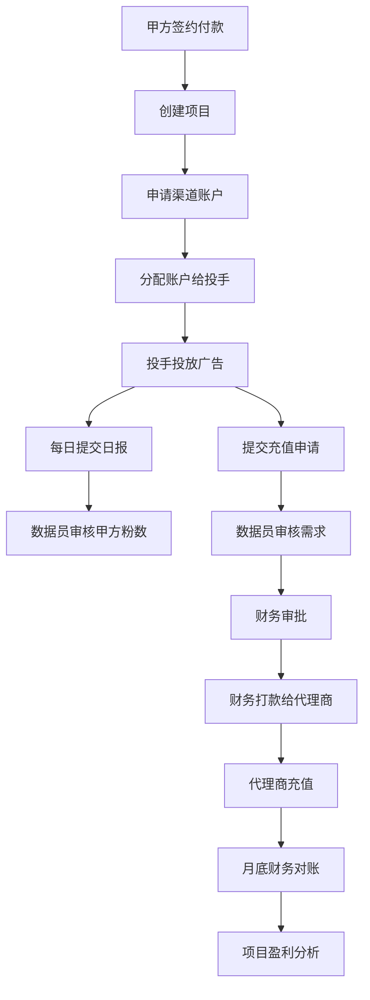

# AI广告代投系统开发文档 v1.2 完整版

> 本文档在 v1.1 基础上全面优化，增加了完整的技术实现细节、代码示例、配置文件和最佳实践，为开发团队提供可直接使用的实施指南。

---

## 📋 目录

1. [系统概述](#一、系统概述)
2. [技术架构设计](#二、技术架构设计)
3. [数据库设计](#三、数据库设计)
4. [API接口设计](#四、API接口设计)
5. [状态机实现](#五、状态机实现)
6. [权限控制系统](#六、权限控制系统)
7. [AI预测模块](#七、AI预测模块)
8. [前端开发指南](#八、前端开发指南)
9. [测试策略](#九、测试策略)
10. [部署与运维](#十、部署与运维)
11. [性能优化](#十一、性能优化)
12. [安全配置](#十二、安全配置)
13. [故障排查](#十三、故障排查)
14. [开发规范](#十四、开发规范)

---

## 一、系统概述

### 1.1 项目背景
AI广告代投系统是一个专为Facebook广告代投业务设计的综合性管理平台，解决投手效率管理、财务对账、渠道评估和盈利分析等核心业务挑战。

### 1.2 核心业务流程


### 1.3 技术栈选择
| 层级 | 技术选择 | 理由 |
|------|----------|------|
| 前端 | Next.js 14 + TypeScript | SSR支持、类型安全、SEO友好 |
| 后端 | FastAPI + SQLAlchemy | 高性能、自动文档生成、类型验证 |
| 数据库 | PostgreSQL + Supabase | 强一致性、RLS安全、托管服务 |
| 缓存 | Redis | 高性能、数据结构丰富 |
| 监控 | Prometheus + Grafana | 云原生标准、生态完善 |

---

## 二、技术架构设计

### 2.1 整体架构
```
┌─────────────────────────────────────────────────────────────┐
│                    前端层 (Next.js)                         │
│  ┌─────────────┐ ┌─────────────┐ ┌─────────────┐           │
│  │   页面组件   │ │   状态管理   │ │   路由控制   │           │
│  └─────────────┘ └─────────────┘ └─────────────┘           │
├─────────────────────────────────────────────────────────────┤
│                API网关层 (FastAPI)                          │
│  ┌─────────────┐ ┌─────────────┐ ┌─────────────┐           │
│  │   认证中间件 │ │   权限控制   │ │   请求日志   │           │
│  └─────────────┘ └─────────────┘ └─────────────┘           │
├─────────────────────────────────────────────────────────────┤
│                业务逻辑层 (Services)                        │
│  ┌─────────────┐ ┌─────────────┐ ┌─────────────┐           │
│  │   项目管理   │ │   财务管理   │ │   AI预测     │           │
│  └─────────────┘ └─────────────┘ └─────────────┘           │
├─────────────────────────────────────────────────────────────┤
│                数据访问层 (SQLAlchemy)                      │
│  ┌─────────────┐ ┌─────────────┐ ┌─────────────┐           │
│  │   模型定义   │ │   查询构建   │ │   连接池     │           │
│  └─────────────┘ └─────────────┘ └─────────────┘           │
├─────────────────────────────────────────────────────────────┤
│                  数据层 (PostgreSQL)                        │
│  ┌─────────────┐ ┌─────────────┐ ┌─────────────┐           │
│  │   核心数据   │ │   审计日志   │ │   RLS策略    │           │
│  └─────────────┘ └─────────────┘ └─────────────┘           │
└─────────────────────────────────────────────────────────────┘
```

### 2.2 核心模块设计

#### 2.2.1 项目管理模块
```python
# services/project_service.py
class ProjectService:
    def __init__(self, db: Session):
        self.db = db

    async def create_project(self, project_data: ProjectCreate, user_id: str) -> Project:
        """创建项目"""
        # 验证数据
        await self._validate_project_data(project_data)

        # 创建项目
        project = Project(
            **project_data.dict(),
            created_by=user_id,
            status=ProjectStatus.PLANNING
        )

        self.db.add(project)
        self.db.commit()
        self.db.refresh(project)

        # 记录审计日志
        await audit_logger.log_create(
            table_name="projects",
            record_id=project.id,
            new_values=project_data.dict(),
            user_id=user_id
        )

        return project

    async def _validate_project_data(self, data: ProjectCreate):
        """验证项目数据"""
        if data.lead_price <= 0:
            raise ValueError("单粉价格必须大于0")

        if data.pricing_model not in ["per_lead", "fixed_fee", "hybrid"]:
            raise ValueError("无效的收费模式")
```

#### 2.2.2 充值管理模块
```python
# services/topup_service.py
class TopupService:
    def __init__(self, db: Session):
        self.db = db

    async def create_topup_request(self, request: TopupCreate, user_id: str) -> Topup:
        """创建充值申请"""
        # 验证账户权限
        account = await self._verify_account_permission(
            request.ad_account_id, user_id
        )

        # 计算费用
        fee_rate = await self._get_channel_fee_rate(account.channel_id)
        fee_amount = request.amount * fee_rate
        total_amount = request.amount + fee_amount

        # 创建充值申请
        topup = Topup(
            project_id=account.project_id,
            ad_account_id=request.ad_account_id,
            user_id=user_id,
            amount=request.amount,
            fee_rate=fee_rate,
            fee_amount=fee_amount,
            total_amount=total_amount,
            status=TopupStatus.DRAFT,
            purpose=request.purpose
        )

        self.db.add(topup)
        self.db.commit()

        # 发送通知
        await notification_service.notify_data_clerk(topup)

        return topup
```

### 2.3 错误处理设计
```python
# core/exceptions.py
class BaseAPIException(Exception):
    """API异常基类"""
    def __init__(self, message: str, error_code: str = None):
        self.message = message
        self.error_code = error_code
        super().__init__(message)

class ValidationError(BaseAPIException):
    """数据验证错误"""
    def __init__(self, message: str, field: str = None):
        super().__init__(message, "VALIDATION_ERROR")
        self.field = field

class PermissionError(BaseAPIException):
    """权限错误"""
    def __init__(self, message: str = "权限不足"):
        super().__init__(message, "PERMISSION_DENIED")

class BusinessLogicError(BaseAPIException):
    """业务逻辑错误"""
    def __init__(self, message: str, business_code: str = None):
        super().__init__(message, "BUSINESS_ERROR")
        self.business_code = business_code

# handlers/exception_handler.py
from fastapi import Request, HTTPException
from fastapi.responses import JSONResponse

async def api_exception_handler(request: Request, exc: BaseAPIException):
    """统一异常处理"""
    return JSONResponse(
        status_code=400,
        content={
            "success": False,
            "error": {
                "code": exc.error_code,
                "message": exc.message,
                "field": getattr(exc, 'field', None),
                "business_code": getattr(exc, 'business_code', None)
            },
            "timestamp": datetime.utcnow().isoformat(),
            "request_id": getattr(request.state, 'request_id', None)
        }
    )
```

---

## 三、数据库设计

### 3.1 核心表结构

#### 3.1.1 用户表 (users)
```sql
CREATE TABLE public.users (
    id UUID PRIMARY KEY DEFAULT gen_random_uuid(),
    email VARCHAR(255) UNIQUE NOT NULL,
    hashed_password VARCHAR(255) NOT NULL,
    full_name VARCHAR(255),
    role VARCHAR(50) NOT NULL CHECK (role IN ('admin', 'manager', 'data_clerk', 'finance', 'media_buyer')),
    is_active BOOLEAN DEFAULT true,
    last_login TIMESTAMP,
    created_at TIMESTAMP DEFAULT NOW(),
    updated_at TIMESTAMP DEFAULT NOW()
);

-- 索引
CREATE INDEX idx_users_email ON users(email);
CREATE INDEX idx_users_role ON users(role);
CREATE INDEX idx_users_active ON users(is_active);
```

#### 3.1.2 项目表 (projects)
```sql
CREATE TABLE public.projects (
    id UUID PRIMARY KEY DEFAULT gen_random_uuid(),
    name VARCHAR(255) NOT NULL,
    code VARCHAR(50) UNIQUE NOT NULL,
    description TEXT,
    client_name VARCHAR(255) NOT NULL,
    client_contact VARCHAR(255),
    client_email VARCHAR(255),
    client_phone VARCHAR(50),

    -- 收费模式
    pricing_model VARCHAR(50) DEFAULT 'per_lead' CHECK (pricing_model IN ('per_lead', 'fixed_fee', 'hybrid')),
    lead_price NUMERIC(10,2) NOT NULL CHECK (lead_price > 0),
    setup_fee NUMERIC(10,2) DEFAULT 0 CHECK (setup_fee >= 0),
    currency VARCHAR(3) DEFAULT 'USD',

    -- 项目状态
    status VARCHAR(20) DEFAULT 'planning' CHECK (status IN ('planning', 'active', 'paused', 'completed', 'cancelled')),
    start_date TIMESTAMP,
    end_date TIMESTAMP,

    -- 预算和目标
    monthly_budget NUMERIC(12,2),
    total_budget NUMERIC(15,2),
    monthly_target_leads INTEGER DEFAULT 0,
    target_cpl NUMERIC(10,2),

    -- 管理信息
    manager_id UUID REFERENCES users(id) ON DELETE SET NULL,
    created_by UUID NOT NULL REFERENCES users(id),
    created_at TIMESTAMP DEFAULT NOW(),
    updated_at TIMESTAMP DEFAULT NOW()
);

-- 索引
CREATE INDEX idx_projects_status ON projects(status);
CREATE INDEX idx_projects_client ON projects(client_name);
CREATE INDEX idx_projects_manager ON projects(manager_id);
CREATE INDEX idx_projects_created_by ON projects(created_by);
```

#### 3.1.3 渠道表 (channels)
```sql
CREATE TABLE public.channels (
    id UUID PRIMARY KEY DEFAULT gen_random_uuid(),
    name VARCHAR(255) NOT NULL,
    code VARCHAR(50) UNIQUE NOT NULL,
    company_name VARCHAR(255) NOT NULL,

    -- 联系信息
    contact_person VARCHAR(255),
    contact_email VARCHAR(255),
    contact_phone VARCHAR(50),
    contact_wechat VARCHAR(100),

    -- 费用结构
    service_fee_rate NUMERIC(5,4) NOT NULL CHECK (service_fee_rate >= 0 AND service_fee_rate <= 1),
    account_setup_fee NUMERIC(10,2) DEFAULT 0,
    minimum_topup NUMERIC(10,2) DEFAULT 0,

    -- 渠道状态和质量
    status VARCHAR(20) DEFAULT 'active' CHECK (status IN ('active', 'inactive', 'suspended')),
    priority INTEGER DEFAULT 1,
    quality_score NUMERIC(3,2) CHECK (quality_score >= 0 AND quality_score <= 10),
    reliability_score NUMERIC(3,2) CHECK (reliability_score >= 0 AND reliability_score <= 10),

    -- 统计数据
    total_accounts INTEGER DEFAULT 0,
    active_accounts INTEGER DEFAULT 0,
    dead_accounts INTEGER DEFAULT 0,
    total_spend NUMERIC(15,2) DEFAULT 0,

    -- 管理信息
    notes TEXT,
    created_by UUID NOT NULL REFERENCES users(id),
    created_at TIMESTAMP DEFAULT NOW(),
    updated_at TIMESTAMP DEFAULT NOW()
);

-- 索引
CREATE INDEX idx_channels_status ON channels(status);
CREATE INDEX idx_channels_quality ON channels(quality_score);
CREATE INDEX idx_channels_code ON channels(code);
```

#### 3.1.4 广告账户表 (ad_accounts)
```sql
CREATE TABLE public.ad_accounts (
    id UUID PRIMARY KEY DEFAULT gen_random_uuid(),
    account_id VARCHAR(255) UNIQUE NOT NULL,
    name VARCHAR(255) NOT NULL,

    -- 平台信息
    platform VARCHAR(50) DEFAULT 'facebook',
    platform_account_id VARCHAR(255),
    platform_business_id VARCHAR(255),

    -- 关联信息
    project_id UUID NOT NULL REFERENCES projects(id) ON DELETE CASCADE,
    channel_id UUID NOT NULL REFERENCES channels(id) ON DELETE RESTRICT,
    assigned_user_id UUID NOT NULL REFERENCES users(id) ON DELETE SET NULL,

    -- 账户状态
    status VARCHAR(20) DEFAULT 'new' CHECK (status IN ('new', 'testing', 'active', 'suspended', 'dead', 'archived')),
    status_reason TEXT,
    last_status_change TIMESTAMP,

    -- 生命周期时间戳
    created_date TIMESTAMP,
    activated_date TIMESTAMP,
    suspended_date TIMESTAMP,
    dead_date TIMESTAMP,
    archived_date TIMESTAMP,

    -- 预算信息
    daily_budget NUMERIC(10,2),
    total_budget NUMERIC(12,2),
    remaining_budget NUMERIC(12,2),

    -- 账户配置
    currency VARCHAR(3) DEFAULT 'USD',
    timezone VARCHAR(50),
    country VARCHAR(2),

    -- 性能数据
    total_spend NUMERIC(15,2) DEFAULT 0,
    total_leads INTEGER DEFAULT 0,
    avg_cpl NUMERIC(10,2),
    best_cpl NUMERIC(10,2),

    -- 开户费用
    setup_fee NUMERIC(10,2) DEFAULT 0,
    setup_fee_paid BOOLEAN DEFAULT false,

    -- 管理信息
    notes TEXT,
    tags JSONB,
    metadata JSONB,
    created_by UUID NOT NULL REFERENCES users(id),
    created_at TIMESTAMP DEFAULT NOW(),
    updated_at TIMESTAMP DEFAULT NOW()
);

-- 索引
CREATE INDEX idx_ad_accounts_project ON ad_accounts(project_id);
CREATE INDEX idx_ad_accounts_channel ON ad_accounts(channel_id);
CREATE INDEX idx_ad_accounts_user ON ad_accounts(assigned_user_id);
CREATE INDEX idx_ad_accounts_status ON ad_accounts(status);
CREATE INDEX idx_ad_accounts_platform ON ad_accounts(platform);
CREATE UNIQUE INDEX idx_ad_accounts_account_id ON ad_accounts(account_id);
```

#### 3.1.5 充值表 (topups)
```sql
CREATE TABLE public.topups (
    id UUID PRIMARY KEY DEFAULT gen_random_uuid(),
    project_id UUID NOT NULL REFERENCES projects(id) ON DELETE CASCADE,
    ad_account_id UUID NOT NULL REFERENCES ad_accounts(id) ON DELETE CASCADE,
    requested_by UUID NOT NULL REFERENCES users(id),

    -- 申请信息
    amount NUMERIC(15,2) NOT NULL CHECK (amount > 0),
    purpose TEXT,
    urgency_level VARCHAR(20) DEFAULT 'normal' CHECK (urgency_level IN ('normal', 'urgent')),

    -- 审批流程
    status VARCHAR(20) DEFAULT 'draft' CHECK (status IN ('draft', 'pending', 'clerk_approved', 'finance_approved', 'paid', 'posted', 'rejected')),

    -- 审批信息
    clerk_approval JSONB,
    finance_approval JSONB,

    -- 费用计算
    fee_rate NUMERIC(5,4) NOT NULL CHECK (fee_rate >= 0 AND fee_rate <= 1),
    fee_amount NUMERIC(15,2) NOT NULL,
    total_amount NUMERIC(15,2) NOT NULL,

    -- 执行信息
    payment_method VARCHAR(50),
    transaction_id VARCHAR(255),
    paid_at TIMESTAMP,
    posted_at TIMESTAMP,

    -- 拒绝信息
    rejection_reason TEXT,
    rejected_by UUID REFERENCES users(id),
    rejected_at TIMESTAMP,

    created_at TIMESTAMP DEFAULT NOW(),
    updated_at TIMESTAMP DEFAULT NOW()
);

-- 索引
CREATE INDEX idx_topups_project ON topups(project_id);
CREATE INDEX idx_topups_account ON topups(ad_account_id);
CREATE INDEX idx_topups_user ON topups(requested_by);
CREATE INDEX idx_topups_status ON topups(status);
CREATE INDEX idx_topups_created ON topups(created_at);
```

#### 3.1.6 日报表 (ad_spend_daily)
```sql
CREATE TABLE public.ad_spend_daily (
    id UUID PRIMARY KEY DEFAULT gen_random_uuid(),
    project_id UUID NOT NULL REFERENCES projects(id) ON DELETE CASCADE,
    ad_account_id UUID NOT NULL REFERENCES ad_accounts(id) ON DELETE CASCADE,
    user_id UUID NOT NULL REFERENCES users(id),
    date DATE NOT NULL,

    -- 投手提交数据
    leads_submitted INTEGER DEFAULT 0 CHECK (leads_submitted >= 0),
    spend NUMERIC(15,2) NOT NULL CHECK (spend >= 0),
    impressions INTEGER DEFAULT 0,
    clicks INTEGER DEFAULT 0,

    -- 甲方确认数据
    leads_confirmed INTEGER,
    confirmed_by UUID REFERENCES users(id),
    confirmed_at TIMESTAMP,

    -- 差异分析
    leads_diff INTEGER GENERATED ALWAYS AS (
        CASE
            WHEN leads_confirmed IS NOT NULL THEN leads_confirmed - leads_submitted
            ELSE NULL
        END
    ) STORED,
    diff_reason TEXT,

    -- 质量评估
    lead_quality_score NUMERIC(3,2) CHECK (lead_quality_score >= 0 AND lead_quality_score <= 10),

    created_at TIMESTAMP DEFAULT NOW(),
    updated_at TIMESTAMP DEFAULT NOW(),

    -- 约束
    UNIQUE(ad_account_id, date)
);

-- 索引
CREATE INDEX idx_ad_spend_daily_project ON ad_spend_daily(project_id);
CREATE INDEX idx_ad_spend_daily_account ON ad_spend_daily(ad_account_id);
CREATE INDEX idx_ad_spend_daily_user ON ad_spend_daily(user_id);
CREATE INDEX idx_ad_spend_daily_date ON ad_spend_daily(date);
CREATE INDEX idx_ad_spend_daily_status ON ad_spend_daily(leads_confirmed) WHERE leads_confirmed IS NOT NULL;
```

### 3.2 RLS安全策略

#### 3.2.1 启用RLS
```sql
-- 为核心表启用行级安全
ALTER TABLE projects ENABLE ROW LEVEL SECURITY;
ALTER TABLE ad_accounts ENABLE ROW LEVEL SECURITY;
ALTER TABLE topups ENABLE ROW LEVEL SECURITY;
ALTER TABLE ad_spend_daily ENABLE ROW LEVEL SECURITY;
```

#### 3.2.2 项目访问策略
```sql
-- 项目访问策略
CREATE POLICY "项目访问策略" ON projects
    USING (
        -- 管理员可以访问所有项目
        current_setting('app.current_role') = 'admin'
        OR
        -- 项目经理可以访问自己管理的项目
        manager_id = current_setting('app.current_user_id')::uuid
        OR
        -- 户管可以访问所有项目（审核需要）
        current_setting('app.current_role') = 'data_clerk'
        OR
        -- 财务可以访问所有项目（对账需要）
        current_setting('app.current_role') = 'finance'
        OR
        -- 投手只能访问分配给自己的项目
        EXISTS (
            SELECT 1 FROM ad_accounts
            WHERE ad_accounts.project_id = projects.id
            AND ad_accounts.assigned_user_id = current_setting('app.current_user_id')::uuid
        )
    );

-- 项目修改策略
CREATE POLICY "项目修改策略" ON projects
    FOR ALL
    USING (
        current_setting('app.current_role') = 'admin'
        OR
        manager_id = current_setting('app.current_user_id')::uuid
    )
    WITH CHECK (
        current_setting('app.current_role') = 'admin'
        OR
        manager_id = current_setting('app.current_user_id')::uuid
    );
```

#### 3.2.3 广告账户访问策略
```sql
-- 广告账户访问策略
CREATE POLICY "广告账户访问策略" ON ad_accounts
    USING (
        -- 管理员可以访问所有账户
        current_setting('app.current_role') = 'admin'
        OR
        -- 户管可以访问所有账户
        current_setting('app.current_role') = 'data_clerk'
        OR
        -- 财务可以访问所有账户
        current_setting('app.current_role') = 'finance'
        OR
        -- 项目经理可以访问项目下的所有账户
        EXISTS (
            SELECT 1 FROM projects
            WHERE projects.id = ad_accounts.project_id
            AND projects.manager_id = current_setting('app.current_user_id')::uuid
        )
        OR
        -- 投手只能访问分配给自己的账户
        assigned_user_id = current_setting('app.current_user_id')::uuid
    );

-- 广告账户修改策略
CREATE POLICY "广告账户修改策略" ON ad_accounts
    FOR ALL
    USING (
        current_setting('app.current_role') IN ('admin', 'data_clerk')
        OR
        EXISTS (
            SELECT 1 FROM projects
            WHERE projects.id = ad_accounts.project_id
            AND projects.manager_id = current_setting('app.current_user_id')::uuid
        )
    );
```

### 3.3 触发器和函数

#### 3.3.1 更新时间戳触发器
```sql
-- 创建更新时间戳函数
CREATE OR REPLACE FUNCTION update_updated_at_column()
RETURNS TRIGGER AS $$
BEGIN
    NEW.updated_at = NOW();
    RETURN NEW;
END;
$$ language 'plpgsql';

-- 为所有表添加触发器
CREATE TRIGGER update_projects_updated_at BEFORE UPDATE ON projects
    FOR EACH ROW EXECUTE FUNCTION update_updated_at_column();

CREATE TRIGGER update_channels_updated_at BEFORE UPDATE ON channels
    FOR EACH ROW EXECUTE FUNCTION update_updated_at_column();

CREATE TRIGGER update_ad_accounts_updated_at BEFORE UPDATE ON ad_accounts
    FOR EACH ROW EXECUTE FUNCTION update_updated_at_column();

CREATE TRIGGER update_topups_updated_at BEFORE UPDATE ON topups
    FOR EACH ROW EXECUTE FUNCTION update_updated_at_column();

CREATE TRIGGER update_ad_spend_daily_updated_at BEFORE UPDATE ON ad_spend_daily
    FOR EACH ROW EXECUTE FUNCTION update_updated_at_column();
```

#### 3.3.2 账户状态变更触发器
```sql
-- 账户状态变更历史函数
CREATE OR REPLACE FUNCTION log_account_status_change()
RETURNS TRIGGER AS $$
BEGIN
    -- 记录状态变更历史
    INSERT INTO account_status_history (
        account_id,
        old_status,
        new_status,
        change_reason,
        changed_at,
        changed_by,
        change_source
    ) VALUES (
        NEW.id,
        OLD.status,
        NEW.status,
        NEW.status_reason,
        NOW(),
        NEW.updated_by,
        'manual'
    );

    -- 更新状态时间戳
    IF NEW.status != OLD.status THEN
        NEW.last_status_change = NOW();

        CASE NEW.status
            WHEN 'active' THEN NEW.activated_date = NOW();
            WHEN 'suspended' THEN NEW.suspended_date = NOW();
            WHEN 'dead' THEN NEW.dead_date = NOW();
            WHEN 'archived' THEN NEW.archived_date = NOW();
        END CASE;
    END IF;

    RETURN NEW;
END;
$$ LANGUAGE plpgsql;

-- 创建触发器
CREATE TRIGGER account_status_change_trigger
    BEFORE UPDATE ON ad_accounts
    FOR EACH ROW
    WHEN (OLD.status IS DISTINCT FROM NEW.status)
    EXECUTE FUNCTION log_account_status_change();
```

---

## 四、API接口设计

### 4.1 接口规范

#### 4.1.1 命名规范
- 路由使用 kebab-case：`/api/topups/request`
- HTTP动词语义：GET查询、POST创建、PUT更新、DELETE删除
- 资源名词复数：`/api/projects`、`/api/accounts`
- 嵌套资源：`/api/projects/{project_id}/accounts`

#### 4.1.2 请求响应格式
```python
# schemas/common.py
from pydantic import BaseModel
from typing import Generic, TypeVar, Optional, List
from datetime import datetime

T = TypeVar('T')

class APIResponse(BaseModel, Generic[T]):
    """统一API响应格式"""
    success: bool
    data: Optional[T] = None
    error: Optional[dict] = None
    message: str
    timestamp: datetime
    request_id: Optional[str] = None

class PaginatedResponse(BaseModel, Generic[T]):
    """分页响应格式"""
    items: List[T]
    pagination: dict
    total: int
    page: int
    size: int
    pages: int

class ErrorResponse(BaseModel):
    """错误响应格式"""
    success: bool = False
    error: dict
    message: str
    timestamp: datetime
    request_id: Optional[str] = None
```

#### 4.1.3 中间件配置
```python
# middleware/request_id.py
import uuid
from fastapi import Request, Response
from starlette.middleware.base import BaseHTTPMiddleware

class RequestIDMiddleware(BaseHTTPMiddleware):
    """请求ID中间件"""
    async def dispatch(self, request: Request, call_next):
        request_id = str(uuid.uuid4())
        request.state.request_id = request_id

        response = await call_next(request)
        response.headers["X-Request-ID"] = request_id

        return response

# middleware/context.py
from fastapi import Request, HTTPException
from starlette.middleware.base import BaseHTTPMiddleware

class ContextMiddleware(BaseHTTPMiddleware):
    """用户上下文中间件"""
    async def dispatch(self, request: Request, call_next):
        # 从JWT token中提取用户信息
        token = request.headers.get("Authorization")
        if token:
            user = await verify_token(token.replace("Bearer ", ""))
            if user:
                # 设置数据库会话变量
                async with get_db_session() as session:
                    await session.execute(
                        "SET LOCAL app.current_user_id = :user_id",
                        {"user_id": user.id}
                    )
                    await session.execute(
                        "SET LOCAL app.current_role = :role",
                        {"role": user.role}
                    )

        response = await call_next(request)
        return response
```

### 4.2 项目管理API

#### 4.2.1 项目CRUD接口
```python
# routers/projects.py
from fastapi import APIRouter, Depends, HTTPException, Query
from typing import List, Optional
from datetime import datetime

router = APIRouter(prefix="/api/projects", tags=["projects"])

@router.post("/", response_model=APIResponse[ProjectResponse])
async def create_project(
    project: ProjectCreate,
    current_user: User = Depends(get_current_user),
    request_id: str = Depends(get_request_id)
):
    """创建项目"""
    try:
        # 权限验证
        if not permission_checker.can_create_project(current_user.role):
            raise PermissionError("无创建项目权限")

        # 业务逻辑
        project_service = ProjectService(db)
        result = await project_service.create_project(project, current_user.id)

        return APIResponse(
            success=True,
            data=result,
            message="项目创建成功",
            timestamp=datetime.utcnow(),
            request_id=request_id
        )

    except ValidationError as e:
        raise HTTPException(status_code=400, detail=e.message)
    except Exception as e:
        logger.error(f"创建项目失败: {e}", extra={"request_id": request_id})
        raise HTTPException(status_code=500, detail="服务器内部错误")

@router.get("/", response_model=APIResponse[PaginatedResponse[ProjectResponse]])
async def list_projects(
    skip: int = Query(0, ge=0),
    limit: int = Query(20, ge=1, le=100),
    status: Optional[str] = Query(None),
    client_name: Optional[str] = Query(None),
    current_user: User = Depends(get_current_user),
    request_id: str = Depends(get_request_id)
):
    """获取项目列表"""
    try:
        project_service = ProjectService(db)
        filters = {}
        if status:
            filters["status"] = status
        if client_name:
            filters["client_name"] = client_name

        # 根据用户角色应用权限过滤
        projects = await project_service.get_projects(
            user_id=current_user.id,
            user_role=current_user.role,
            filters=filters,
            skip=skip,
            limit=limit
        )

        total = await project_service.count_projects(
            user_id=current_user.id,
            user_role=current_user.role,
            filters=filters
        )

        paginated_response = PaginatedResponse(
            items=projects,
            pagination={
                "total": total,
                "page": skip // limit + 1,
                "size": limit,
                "pages": (total + limit - 1) // limit
            }
        )

        return APIResponse(
            success=True,
            data=paginated_response,
            message="获取项目列表成功",
            timestamp=datetime.utcnow(),
            request_id=request_id
        )

    except Exception as e:
        logger.error(f"获取项目列表失败: {e}", extra={"request_id": request_id})
        raise HTTPException(status_code=500, detail="服务器内部错误")

@router.get("/{project_id}", response_model=APIResponse[ProjectDetailResponse])
async def get_project(
    project_id: str,
    current_user: User = Depends(get_current_user),
    request_id: str = Depends(get_request_id)
):
    """获取项目详情"""
    try:
        # 权限验证
        if not permission_checker.can_access_project(current_user, project_id, "read"):
            raise PermissionError("无访问项目权限")

        project_service = ProjectService(db)
        project = await project_service.get_project_by_id(project_id)

        if not project:
            raise HTTPException(status_code=404, detail="项目不存在")

        # 获取项目统计信息
        stats = await project_service.get_project_stats(project_id)

        project_detail = ProjectDetailResponse(
            **project.__dict__,
            stats=stats
        )

        return APIResponse(
            success=True,
            data=project_detail,
            message="获取项目详情成功",
            timestamp=datetime.utcnow(),
            request_id=request_id
        )

    except PermissionError as e:
        raise HTTPException(status_code=403, detail=e.message)
    except HTTPException:
        raise
    except Exception as e:
        logger.error(f"获取项目详情失败: {e}", extra={"request_id": request_id})
        raise HTTPException(status_code=500, detail="服务器内部错误")
```

#### 4.2.2 项目状态管理接口
```python
@router.put("/{project_id}/status")
async def update_project_status(
    project_id: str,
    status_update: ProjectStatusUpdate,
    current_user: User = Depends(get_current_user),
    request_id: str = Depends(get_request_id)
):
    """更新项目状态"""
    try:
        # 权限验证
        if not permission_checker.can_update_project_status(current_user, project_id):
            raise PermissionError("无修改项目状态权限")

        # 状态转换验证
        if not is_valid_status_transition(
            current_status=await get_project_current_status(project_id),
            new_status=status_update.status,
            user_role=current_user.role
        ):
            raise BusinessLogicError(f"无法从当前状态转换到 {status_update.status}")

        project_service = ProjectService(db)
        result = await project_service.update_project_status(
            project_id=project_id,
            new_status=status_update.status,
            reason=status_update.reason,
            user_id=current_user.id
        )

        return APIResponse(
            success=True,
            data=result,
            message="项目状态更新成功",
            timestamp=datetime.utcnow(),
            request_id=request_id
        )

    except PermissionError as e:
        raise HTTPException(status_code=403, detail=e.message)
    except BusinessLogicError as e:
        raise HTTPException(status_code=400, detail=e.message)
    except Exception as e:
        logger.error(f"更新项目状态失败: {e}", extra={"request_id": request_id})
        raise HTTPException(status_code=500, detail="服务器内部错误")
```

### 4.3 充值管理API

#### 4.3.1 充值申请接口
```python
# routers/topups.py
@router.post("/request", response_model=APIResponse[TopupResponse])
async def create_topup_request(
    request: TopupCreate,
    current_user: User = Depends(get_current_user),
    request_id: str = Depends(get_request_id)
):
    """提交充值申请"""
    try:
        # 权限验证
        if not permission_checker.can_create_topup(current_user.role):
            raise PermissionError("无提交充值申请权限")

        # 业务验证
        validation_result = await validate_topup_request(request, current_user.id)
        if not validation_result.is_valid:
            raise ValidationError(validation_result.errors)

        # 创建充值申请
        topup_service = TopupService(db)
        result = await topup_service.create_topup_request(request, current_user.id)

        # 发送通知
        await notification_service.send_topup_request_notification(result)

        return APIResponse(
            success=True,
            data=result,
            message="充值申请提交成功",
            timestamp=datetime.utcnow(),
            request_id=request_id
        )

    except ValidationError as e:
        raise HTTPException(status_code=400, detail=e.message)
    except PermissionError as e:
        raise HTTPException(status_code=403, detail=e.message)
    except Exception as e:
        logger.error(f"提交充值申请失败: {e}", extra={"request_id": request_id})
        raise HTTPException(status_code=500, detail="服务器内部错误")

@router.put("/{topup_id}/clerk-approval")
async def clerk_approval(
    topup_id: str,
    approval: ClerkApprovalSchema,
    current_user: User = Depends(get_current_user),
    request_id: str = Depends(get_request_id)
):
    """数据员审批充值申请"""
    try:
        # 权限验证
        if not permission_checker.can_approve_topup_as_clerk(current_user.role):
            raise PermissionError("无数据员审批权限")

        topup_service = TopupService(db)
        result = await topup_service.clerk_approval(
            topup_id=topup_id,
            approval=approval,
            user_id=current_user.id
        )

        # 如果批准，通知财务
        if approval.approved:
            await notification_service.send_finance_approval_notification(result)

        return APIResponse(
            success=True,
            data=result,
            message="数据员审批完成",
            timestamp=datetime.utcnow(),
            request_id=request_id
        )

    except BusinessLogicError as e:
        raise HTTPException(status_code=400, detail=e.message)
    except Exception as e:
        logger.error(f"数据员审批失败: {e}", extra={"request_id": request_id})
        raise HTTPException(status_code=500, detail="服务器内部错误")

@router.put("/{topup_id}/finance-approval")
async def finance_approval(
    topup_id: str,
    approval: FinanceApprovalSchema,
    current_user: User = Depends(get_current_user),
    request_id: str = Depends(get_request_id)
):
    """财务审批并执行充值"""
    try:
        # 权限验证
        if not permission_checker.can_approve_topup_as_finance(current_user.role):
            raise PermissionError("无财务审批权限")

        topup_service = TopupService(db)
        result = await topup_service.finance_approval(
            topup_id=topup_id,
            approval=approval,
            user_id=current_user.id
        )

        # 如果批准执行充值，更新账户余额
        if approval.approved and approval.execute_payment:
            await account_service.update_account_balance(
                account_id=result.ad_account_id,
                amount=result.amount,
                transaction_id=approval.transaction_id
            )

            # 记录财务流水
            await ledger_service.create_transaction(
                topup_id=result.id,
                amount=result.total_amount,
                transaction_type="topup",
                user_id=current_user.id
            )

        return APIResponse(
            success=True,
            data=result,
            message="财务审批完成",
            timestamp=datetime.utcnow(),
            request_id=request_id
        )

    except BusinessLogicError as e:
        raise HTTPException(status_code=400, detail=e.message)
    except Exception as e:
        logger.error(f"财务审批失败: {e}", extra={"request_id": request_id})
        raise HTTPException(status_code=500, detail="服务器内部错误")
```

### 4.4 日报管理API

#### 4.4.1 日报提交接口
```python
# routers/daily_reports.py
@router.post("/", response_model=APIResponse[DailyReportResponse])
async def submit_daily_report(
    report: DailyReportCreate,
    current_user: User = Depends(get_current_user),
    request_id: str = Depends(get_request_id)
):
    """提交日报"""
    try:
        # 权限验证
        if not permission_checker.can_submit_daily_report(current_user.role):
            raise PermissionError("无提交日报权限")

        # 业务验证
        validation_result = await validate_daily_report(report, current_user.id)
        if not validation_result.is_valid:
            raise ValidationError(validation_result.errors)

        # 创建日报
        daily_report_service = DailyReportService(db)
        result = await daily_report_service.create_daily_report(report, current_user.id)

        # 计算CPL等指标
        await daily_report_service.calculate_metrics(result.id)

        # 通知数据员审核
        await notification_service.send_daily_report_notification(result)

        return APIResponse(
            success=True,
            data=result,
            message="日报提交成功",
            timestamp=datetime.utcnow(),
            request_id=request_id
        )

    except ValidationError as e:
        raise HTTPException(status_code=400, detail=e.message)
    except Exception as e:
        logger.error(f"提交日报失败: {e}", extra={"request_id": request_id})
        raise HTTPException(status_code=500, detail="服务器内部错误")

@router.put("/{report_id}/confirm")
async def confirm_daily_report(
    report_id: str,
    confirmation: DailyReportConfirmation,
    current_user: User = Depends(get_current_user),
    request_id: str = Depends(get_request_id)
):
    """确认日报粉数"""
    try:
        # 权限验证
        if not permission_checker.can_confirm_daily_report(current_user.role):
            raise PermissionError("无确认日报权限")

        daily_report_service = DailyReportService(db)
        result = await daily_report_service.confirm_daily_report(
            report_id=report_id,
            confirmation=confirmation,
            user_id=current_user.id
        )

        # 检查异常并标记
        anomalies = await anomaly_detector.detect_daily_report_anomalies(result)
        if anomalies:
            await daily_report_service.mark_anomalies(result.id, anomalies)

        return APIResponse(
            success=True,
            data=result,
            message="日报确认成功",
            timestamp=datetime.utcnow(),
            request_id=request_id
        )

    except BusinessLogicError as e:
        raise HTTPException(status_code=400, detail=e.message)
    except Exception as e:
        logger.error(f"确认日报失败: {e}", extra={"request_id": request_id})
        raise HTTPException(status_code=500, detail="服务器内部错误")
```

---

## 五、状态机实现

### 5.1 状态机基类
```python
# core/state_machine.py
from enum import Enum
from typing import Dict, List, Optional, Callable, Any
from abc import ABC, abstractmethod

class State(Enum):
    """状态枚举基类"""
    pass

class StateTransition:
    """状态转换定义"""
    def __init__(
        self,
        from_state: State,
        to_state: State,
        allowed_roles: List[str],
        validator: Optional[Callable] = None,
        action: Optional[Callable] = None
    ):
        self.from_state = from_state
        self.to_state = to_state
        self.allowed_roles = allowed_roles
        self.validator = validator
        self.action = action

class StateMachine(ABC):
    """状态机基类"""

    def __init__(self, initial_state: State):
        self.current_state = initial_state
        self.transitions: Dict[State, List[StateTransition]] = {}
        self.history: List[Dict] = []

    def add_transition(self, transition: StateTransition):
        """添加状态转换"""
        if transition.from_state not in self.transitions:
            self.transitions[transition.from_state] = []
        self.transitions[transition.from_state].append(transition)

    def can_transition(self, to_state: State, user_role: str, context: Dict = None) -> bool:
        """检查是否可以转换到目标状态"""
        if self.current_state not in self.transitions:
            return False

        for transition in self.transitions[self.current_state]:
            if transition.to_state == to_state and user_role in transition.allowed_roles:
                if transition.validator:
                    try:
                        return transition.validator(context or {})
                    except:
                        return False
                return True

        return False

    async def transition(
        self,
        to_state: State,
        user_id: str,
        user_role: str,
        reason: str = None,
        context: Dict = None
    ) -> bool:
        """执行状态转换"""
        if not self.can_transition(to_state, user_role, context):
            raise ValueError(f"无法从 {self.current_state} 转换到 {to_state}")

        # 执行转换
        transition = self._find_transition(to_state, user_role)
        old_state = self.current_state

        # 执行验证
        if transition.validator:
            transition.validator(context or {})

        # 执行动作
        if transition.action:
            await transition.action(context or {})

        # 更新状态
        self.current_state = to_state

        # 记录历史
        self.history.append({
            "from_state": old_state,
            "to_state": to_state,
            "user_id": user_id,
            "user_role": user_role,
            "reason": reason,
            "timestamp": datetime.utcnow(),
            "context": context
        })

        return True

    def _find_transition(self, to_state: State, user_role: str) -> StateTransition:
        """查找状态转换"""
        for transition in self.transitions[self.current_state]:
            if transition.to_state == to_state and user_role in transition.allowed_roles:
                return transition
        raise ValueError("未找到有效的状态转换")

    def get_available_transitions(self, user_role: str) -> List[State]:
        """获取用户角色可用的状态转换"""
        if self.current_state not in self.transitions:
            return []

        available_states = []
        for transition in self.transitions[self.current_state]:
            if user_role in transition.allowed_roles:
                available_states.append(transition.to_state)

        return available_states
```

### 5.2 充值状态机实现
```python
# models/topup_states.py
from enum import Enum

class TopupStatus(Enum):
    DRAFT = "draft"
    PENDING = "pending"
    CLERK_APPROVED = "clerk_approved"
    FINANCE_APPROVED = "finance_approved"
    PAID = "paid"
    POSTED = "posted"
    REJECTED = "rejected"

# services/topup_state_machine.py
class TopupStateMachine(StateMachine):

    def __init__(self, initial_state: TopupStatus = TopupStatus.DRAFT):
        super().__init__(initial_state)
        self._setup_transitions()

    def _setup_transitions(self):
        """设置状态转换规则"""

        # 投手提交申请
        self.add_transition(StateTransition(
            from_state=TopupStatus.DRAFT,
            to_state=TopupStatus.PENDING,
            allowed_roles=["media_buyer", "admin", "manager"],
            validator=self._validate_submission,
            action=self._on_submit
        ))

        # 数据员审批
        self.add_transition(StateTransition(
            from_state=TopupStatus.PENDING,
            to_state=TopupStatus.CLERK_APPROVED,
            allowed_roles=["data_clerk", "admin"],
            validator=self._validate_clerk_approval,
            action=self._on_clerk_approve
        ))

        # 数据员拒绝
        self.add_transition(StateTransition(
            from_state=TopupStatus.PENDING,
            to_state=TopupStatus.REJECTED,
            allowed_roles=["data_clerk", "admin"],
            validator=self._validate_rejection,
            action=self._on_reject
        ))

        # 财务审批
        self.add_transition(StateTransition(
            from_state=TopupStatus.CLERK_APPROVED,
            to_state=TopupStatus.FINANCE_APPROVED,
            allowed_roles=["finance", "admin"],
            validator=self._validate_finance_approval,
            action=self._on_finance_approve
        ))

        # 财务拒绝
        self.add_transition(StateTransition(
            from_state=TopupStatus.CLERK_APPROVED,
            to_state=TopupStatus.REJECTED,
            allowed_roles=["finance", "admin"],
            validator=self._validate_rejection,
            action=self._on_reject
        ))

        # 财务付款
        self.add_transition(StateTransition(
            from_state=TopupStatus.FINANCE_APPROVED,
            to_state=TopupStatus.PAID,
            allowed_roles=["finance", "admin"],
            validator=self._validate_payment,
            action=self._on_pay
        ))

        # 系统记账
        self.add_transition(StateTransition(
            from_state=TopupStatus.PAID,
            to_state=TopupStatus.POSTED,
            allowed_roles=["system"],
            action=self._on_post
        ))

        # 重新提交（被拒绝后）
        self.add_transition(StateTransition(
            from_state=TopupStatus.REJECTED,
            to_state=TopupStatus.DRAFT,
            allowed_roles=["media_buyer", "admin", "manager"],
            validator=self._validate_resubmission,
            action=self._on_resubmit
        ))

    def _validate_submission(self, context: Dict) -> bool:
        """验证提交申请"""
        required_fields = ["amount", "ad_account_id", "purpose"]
        for field in required_fields:
            if field not in context or not context[field]:
                raise ValueError(f"缺少必填字段: {field}")

        if context["amount"] <= 0:
            raise ValueError("充值金额必须大于0")

        return True

    def _validate_clerk_approval(self, context: Dict) -> bool:
        """验证数据员审批"""
        if "account_balance" in context and context["account_balance"] > 1000:
            raise ValueError("账户余额充足，暂不需要充值")

        return True

    def _validate_finance_approval(self, context: Dict) -> bool:
        """验证财务审批"""
        if "payment_method" not in context:
            raise ValueError("必须指定付款方式")

        return True

    def _validate_payment(self, context: Dict) -> bool:
        """验证付款"""
        if "transaction_id" not in context:
            raise ValueError("缺少交易ID")

        return True

    def _validate_rejection(self, context: Dict) -> bool:
        """验证拒绝"""
        if "reason" not in context or not context["reason"]:
            raise ValueError("拒绝时必须提供原因")

        return True

    def _validate_resubmission(self, context: Dict) -> bool:
        """验证重新提交"""
        # 检查是否修改了问题
        return True

    async def _on_submit(self, context: Dict):
        """提交申请时的动作"""
        # 发送通知给数据员
        await notification_service.notify_data_clerk(context["topup_id"])

    async def _on_clerk_approve(self, context: Dict):
        """数据员批准时的动作"""
        # 记录审批信息
        await audit_service.log_clerk_approval(context["topup_id"], context["user_id"])

    async def _on_finance_approve(self, context: Dict):
        """财务批准时的动作"""
        # 预留付款
        await finance_service.reserve_payment(context["topup_id"])

    async def _on_pay(self, context: Dict):
        """付款时的动作"""
        # 执行付款
        await payment_service.execute_payment(
            context["topup_id"],
            context["transaction_id"]
        )

    async def _on_post(self, context: Dict):
        """记账时的动作"""
        # 更新账户余额
        await account_service.update_balance(context["topup_id"])

        # 记录财务流水
        await ledger_service.create_entry(context["topup_id"])

    async def _on_reject(self, context: Dict):
        """拒绝时的动作"""
        # 发送拒绝通知
        await notification_service.notify_rejection(
            context["topup_id"],
            context["reason"]
        )

    async def _on_resubmit(self, context: Dict):
        """重新提交时的动作"""
        # 清除之前的审批记录
        await audit_service.clear_approvals(context["topup_id"])
```

### 5.3 日报状态机实现
```python
# models/daily_report_states.py
class DailyReportStatus(Enum):
    DRAFT = "draft"
    PENDING = "pending"
    APPROVED = "approved"
    REJECTED = "rejected"

# services/daily_report_state_machine.py
class DailyReportStateMachine(StateMachine):

    def __init__(self, initial_state: DailyReportStatus = DailyReportStatus.DRAFT):
        super().__init__(initial_state)
        self._setup_transitions()

    def _setup_transitions(self):
        """设置状态转换规则"""

        # 投手提交日报
        self.add_transition(StateTransition(
            from_state=DailyReportStatus.DRAFT,
            to_state=DailyReportStatus.PENDING,
            allowed_roles=["media_buyer", "admin", "manager"],
            validator=self._validate_submission,
            action=self._on_submit
        ))

        # 数据员确认
        self.add_transition(StateTransition(
            from_state=DailyReportStatus.PENDING,
            to_state=DailyReportStatus.APPROVED,
            allowed_roles=["data_clerk", "admin"],
            validator=self._validate_confirmation,
            action=self._on_approve
        ))

        # 数据员拒绝
        self.add_transition(StateTransition(
            from_state=DailyReportStatus.PENDING,
            to_state=DailyReportStatus.REJECTED,
            allowed_roles=["data_clerk", "admin"],
            validator=self._validate_rejection,
            action=self._on_reject
        ))

        # 重新提交
        self.add_transition(StateTransition(
            from_state=DailyReportStatus.REJECTED,
            to_state=DailyReportStatus.DRAFT,
            allowed_roles=["media_buyer", "admin", "manager"],
            action=self._on_resubmit
        ))

    def _validate_submission(self, context: Dict) -> bool:
        """验证日报提交"""
        required_fields = ["date", "spend", "leads_submitted", "ad_account_id"]
        for field in required_fields:
            if field not in context:
                raise ValueError(f"缺少必填字段: {field}")

        # 检查是否重复提交
        if await self._check_duplicate_submission(context):
            raise ValueError("该日期的日报已存在")

        return True

    def _validate_confirmation(self, context: Dict) -> bool:
        """验证确认"""
        if "leads_confirmed" not in context:
            raise ValueError("必须确认粉数")

        return True

    def _validate_rejection(self, context: Dict) -> bool:
        """验证拒绝"""
        if "reason" not in context:
            raise ValueError("拒绝时必须提供原因")

        return True

    async def _on_submit(self, context: Dict):
        """提交时的动作"""
        # 计算初始指标
        await metrics_service.calculate_initial_metrics(context["report_id"])

        # 发送审核通知
        await notification_service.notify_data_clerk_daily_report(context["report_id"])

    async def _on_approve(self, context: Dict):
        """批准时的动作"""
        # 更新最终指标
        await metrics_service.calculate_final_metrics(
            context["report_id"],
            context["leads_confirmed"]
        )

        # 检查异常
        await anomaly_detection_service.check_daily_report(context["report_id"])

    async def _on_reject(self, context: Dict):
        """拒绝时的动作"""
        # 发送拒绝通知
        await notification_service.notify_daily_report_rejection(
            context["report_id"],
            context["reason"]
        )

    async def _on_resubmit(self, context: Dict):
        """重新提交时的动作"""
        # 清除之前的确认记录
        await audit_service.clear_daily_report_confirmation(context["report_id"])

    async def _check_duplicate_submission(self, context: Dict) -> bool:
        """检查重复提交"""
        existing = await daily_report_service.get_report_by_date_account(
            context["date"],
            context["ad_account_id"]
        )
        return existing is not None
```

---

## 六、权限控制系统

### 6.1 权限模型设计
```python
# models/permissions.py
from enum import Enum
from typing import Dict, List, Set

class UserRole(Enum):
    ADMIN = "admin"
    MANAGER = "manager"
    DATA_CLERK = "data_clerk"
    FINANCE = "finance"
    MEDIA_BUYER = "media_buyer"

class Permission(Enum):
    # 项目权限
    PROJECT_CREATE = "project:create"
    PROJECT_READ = "project:read"
    PROJECT_UPDATE = "project:update"
    PROJECT_DELETE = "project:delete"

    # 账户权限
    ACCOUNT_CREATE = "account:create"
    ACCOUNT_READ = "account:read"
    ACCOUNT_UPDATE = "account:update"
    ACCOUNT_DELETE = "account:delete"
    ACCOUNT_ASSIGN = "account:assign"

    # 日报权限
    DAILY_REPORT_CREATE = "daily_report:create"
    DAILY_REPORT_READ = "daily_report:read"
    DAILY_REPORT_CONFIRM = "daily_report:confirm"
    DAILY_REPORT_UPDATE = "daily_report:update"

    # 充值权限
    TOPUP_CREATE = "topup:create"
    TOPUP_READ = "topup:read"
    TOPUP_CLERK_APPROVE = "topup:clerk_approve"
    TOPUP_FINANCE_APPROVE = "topup:finance_approve"
    TOPUP_EXECUTE = "topup:execute"

    # 对账权限
    RECONCILIATION_CREATE = "reconciliation:create"
    RECONCILIATION_READ = "reconciliation:read"
    RECONCILIATION_UPDATE = "reconciliation:update"

    # 用户权限
    USER_CREATE = "user:create"
    USER_READ = "user:read"
    USER_UPDATE = "user:update"
    USER_DELETE = "user:delete"

    # 系统权限
    SYSTEM_MONITOR = "system:monitor"
    SYSTEM_CONFIG = "system:config"

# 权限矩阵定义
ROLE_PERMISSIONS: Dict[UserRole, Set[Permission]] = {
    UserRole.ADMIN: {
        # 管理员拥有所有权限
        Permission.PROJECT_CREATE, Permission.PROJECT_READ, Permission.PROJECT_UPDATE, Permission.PROJECT_DELETE,
        Permission.ACCOUNT_CREATE, Permission.ACCOUNT_READ, Permission.ACCOUNT_UPDATE, Permission.ACCOUNT_DELETE, Permission.ACCOUNT_ASSIGN,
        Permission.DAILY_REPORT_CREATE, Permission.DAILY_REPORT_READ, Permission.DAILY_REPORT_CONFIRM, Permission.DAILY_REPORT_UPDATE,
        Permission.TOPUP_CREATE, Permission.TOPUP_READ, Permission.TOPUP_CLERK_APPROVE, Permission.TOPUP_FINANCE_APPROVE, Permission.TOPUP_EXECUTE,
        Permission.RECONCILIATION_CREATE, Permission.RECONCILIATION_READ, Permission.RECONCILIATION_UPDATE,
        Permission.USER_CREATE, Permission.USER_READ, Permission.USER_UPDATE, Permission.USER_DELETE,
        Permission.SYSTEM_MONITOR, Permission.SYSTEM_CONFIG
    },

    UserRole.MANAGER: {
        Permission.PROJECT_CREATE, Permission.PROJECT_READ, Permission.PROJECT_UPDATE,
        Permission.ACCOUNT_READ, Permission.ACCOUNT_UPDATE, Permission.ACCOUNT_ASSIGN,
        Permission.DAILY_REPORT_READ, Permission.DAILY_REPORT_CONFIRM,
        Permission.TOPUP_READ, Permission.TOPUP_CLERK_APPROVE,
        Permission.RECONCILIATION_READ,
        Permission.USER_READ
    },

    UserRole.DATA_CLERK: {
        Permission.PROJECT_READ,
        Permission.ACCOUNT_READ, Permission.ACCOUNT_UPDATE,
        Permission.DAILY_REPORT_CREATE, Permission.DAILY_REPORT_READ, Permission.DAILY_REPORT_CONFIRM, Permission.DAILY_REPORT_UPDATE,
        Permission.TOPUP_CREATE, Permission.TOPUP_READ, Permission.TOPUP_CLERK_APPROVE,
        Permission.RECONCILIATION_CREATE, Permission.RECONCILIATION_READ, Permission.RECONCILIATION_UPDATE
    },

    UserRole.FINANCE: {
        Permission.PROJECT_READ,
        Permission.ACCOUNT_READ,
        Permission.DAILY_REPORT_READ,
        Permission.TOPUP_READ, Permission.TOPUP_FINANCE_APPROVE, Permission.TOPUP_EXECUTE,
        Permission.RECONCILIATION_CREATE, Permission.RECONCILIATION_READ, Permission.RECONCILIATION_UPDATE
    },

    UserRole.MEDIA_BUYER: {
        Permission.PROJECT_READ,
        Permission.ACCOUNT_READ,  # 只能读取分配给自己的账户
        Permission.DAILY_REPORT_CREATE, Permission.DAILY_REPORT_READ, Permission.DAILY_REPORT_UPDATE,
        Permission.TOPUP_CREATE, Permission.TOPUP_READ  # 只能创建和查看自己的申请
    }
}
```

### 6.2 权限检查器
```python
# services/permission_checker.py
from typing import Optional
from sqlalchemy.orm import Session

class PermissionChecker:

    def __init__(self, db: Session):
        self.db = db

    def has_permission(self, user_role: UserRole, permission: Permission) -> bool:
        """检查用户是否有指定权限"""
        return permission in ROLE_PERMISSIONS.get(user_role, set())

    def can_access_project(self, user: User, project_id: str, action: str) -> bool:
        """检查项目访问权限"""
        # 管理员拥有所有权限
        if user.role == UserRole.ADMIN.value:
            return True

        # 获取项目信息
        project = self.db.query(Project).filter(Project.id == project_id).first()
        if not project:
            return False

        # 项目经理权限
        if user.role == UserRole.MANAGER.value and project.manager_id == user.id:
            return True

        # 投手权限 - 只能访问分配给自己的项目
        if user.role == UserRole.MEDIA_BUYER.value:
            has_assigned_account = self.db.query(AdAccount).filter(
                AdAccount.project_id == project_id,
                AdAccount.assigned_user_id == user.id
            ).first()
            return has_assigned_account is not None

        # 数据员和财务权限 - 可以访问所有项目（用于审核和对账）
        if user.role in [UserRole.DATA_CLERK.value, UserRole.FINANCE.value]:
            return True

        return False

    def can_access_account(self, user: User, account_id: str, action: str) -> bool:
        """检查账户访问权限"""
        # 管理员拥有所有权限
        if user.role == UserRole.ADMIN.value:
            return True

        # 获取账户信息
        account = self.db.query(AdAccount).filter(AdAccount.id == account_id).first()
        if not account:
            return False

        # 户管权限
        if user.role in [UserRole.MANAGER.value, UserRole.DATA_CLERK.value]:
            return True

        # 财务权限 - 只读
        if user.role == UserRole.FINANCE.value and action in ["read", "list"]:
            return True

        # 投手权限 - 只能访问分配给自己的账户
        if user.role == UserRole.MEDIA_BUYER.value and account.assigned_user_id == user.id:
            return True

        return False

    def can_manage_topup(self, user: User, topup_id: str, action: str) -> bool:
        """检查充值管理权限"""
        # 管理员拥有所有权限
        if user.role == UserRole.ADMIN.value:
            return True

        # 获取充值申请信息
        topup = self.db.query(Topup).filter(Topup.id == topup_id).first()
        if not topup:
            return False

        # 创建权限
        if action == "create":
            return user.role in [
                UserRole.MEDIA_BUYER.value,
                UserRole.DATA_CLERK.value,
                UserRole.MANAGER.value
            ]

        # 数据员审批权限
        if action == "clerk_approve":
            return user.role in [UserRole.DATA_CLERK.value, UserRole.ADMIN.value]

        # 财务审批权限
        if action == "finance_approve":
            return user.role in [UserRole.FINANCE.value, UserRole.ADMIN.value]

        # 执行权限
        if action == "execute":
            return user.role in [UserRole.FINANCE.value, UserRole.ADMIN.value]

        # 投手只能查看自己的申请
        if action in ["read", "list"]:
            if user.role == UserRole.MEDIA_BUYER.value:
                return topup.requested_by == user.id
            else:
                return user.role in [
                    UserRole.DATA_CLERK.value,
                    UserRole.FINANCE.value,
                    UserRole.MANAGER.value
                ]

        return False

    def can_confirm_daily_report(self, user: User, report_id: str) -> bool:
        """检查日报确认权限"""
        # 管理员和数据员可以确认
        if user.role in [UserRole.ADMIN.value, UserRole.DATA_CLERK.value]:
            return True

        return False

    def filter_accessible_projects(self, user: User, query):
        """过滤用户可访问的项目"""
        if user.role == UserRole.ADMIN.value:
            return query

        if user.role == UserRole.MANAGER.value:
            return query.filter(Project.manager_id == user.id)

        if user.role == UserRole.MEDIA_BUYER.value:
            return query.join(AdAccount).filter(
                AdAccount.assigned_user_id == user.id
            )

        # 数据员和财务可以访问所有项目
        return query

    def filter_accessible_accounts(self, user: User, query):
        """过滤用户可访问的账户"""
        if user.role == UserRole.ADMIN.value:
            return query

        if user.role in [UserRole.MANAGER.value, UserRole.DATA_CLERK.value]:
            return query

        if user.role == UserRole.FINANCE.value:
            return query  # 财务可以查看所有账户

        if user.role == UserRole.MEDIA_BUYER.value:
            return query.filter(AdAccount.assigned_user_id == user.id)

        return query.filter(False)  # 其他角色无权限
```

### 6.3 权限装饰器
```python
# decorators/permission_decorators.py
from functools import wraps
from typing import List, Optional

def require_permissions(permissions: List[Permission]):
    """权限验证装饰器"""
    def decorator(func):
        @wraps(func)
        async def wrapper(*args, **kwargs):
            current_user = kwargs.get('current_user')
            if not current_user:
                raise PermissionError("用户未认证")

            user_role = UserRole(current_user.role)

            # 检查权限
            for permission in permissions:
                if not permission_checker.has_permission(user_role, permission):
                    raise PermissionError(f"缺少权限: {permission.value}")

            return await func(*args, **kwargs)
        return wrapper
    return decorator

def require_resource_access(resource_type: str, action: str, resource_id_param: str = None):
    """资源访问权限装饰器"""
    def decorator(func):
        @wraps(func)
        async def wrapper(*args, **kwargs):
            current_user = kwargs.get('current_user')
            if not current_user:
                raise PermissionError("用户未认证")

            # 获取资源ID
            resource_id = kwargs.get(resource_id_param)
            if not resource_id:
                raise ValueError(f"缺少资源ID参数: {resource_id_param}")

            # 检查资源访问权限
            permission_checker = PermissionChecker(db)

            if resource_type == "project":
                if not permission_checker.can_access_project(current_user, resource_id, action):
                    raise PermissionError("无项目访问权限")

            elif resource_type == "account":
                if not permission_checker.can_access_account(current_user, resource_id, action):
                    raise PermissionError("无账户访问权限")

            elif resource_type == "topup":
                if not permission_checker.can_manage_topup(current_user, resource_id, action):
                    raise PermissionError("无充值管理权限")

            elif resource_type == "daily_report":
                if action == "confirm" and not permission_checker.can_confirm_daily_report(current_user, resource_id):
                    raise PermissionError("无日报确认权限")

            return await func(*args, **kwargs)
        return wrapper
    return decorator

# 使用示例
@router.post("/projects")
@require_permissions([Permission.PROJECT_CREATE])
async def create_project(project: ProjectCreate, current_user: User = Depends(get_current_user)):
    """创建项目"""
    pass

@router.get("/projects/{project_id}")
@require_resource_access("project", "read", "project_id")
async def get_project(project_id: str, current_user: User = Depends(get_current_user)):
    """获取项目详情"""
    pass

@router.put("/topups/{topup_id}/clerk-approval")
@require_resource_access("topup", "clerk_approve", "topup_id")
async def clerk_approve_topup(topup_id: str, approval: ClerkApproval, current_user: User = Depends(get_current_user)):
    """数据员审批充值"""
    pass
```

### 6.4 动态权限配置
```python
# services/dynamic_permission.py
class DynamicPermissionService:

    def __init__(self, db: Session):
        self.db = db

    async def create_custom_role(self, role_name: str, permissions: List[Permission]) -> UserRole:
        """创建自定义角色"""
        # 检查角色是否已存在
        existing_role = self.db.query(Role).filter(Role.name == role_name).first()
        if existing_role:
            raise ValueError(f"角色 {role_name} 已存在")

        # 创建角色
        new_role = Role(name=role_name, is_custom=True)
        self.db.add(new_role)
        self.db.commit()

        # 分配权限
        for permission in permissions:
            role_permission = RolePermission(
                role_id=new_role.id,
                permission=permission.value
            )
            self.db.add(role_permission)

        self.db.commit()
        return UserRole(role_name)

    async def assign_role_to_user(self, user_id: str, role: UserRole):
        """为用户分配角色"""
        user = self.db.query(User).filter(User.id == user_id).first()
        if not user:
            raise ValueError("用户不存在")

        user.role = role.value
        self.db.commit()

    async def get_user_permissions(self, user_id: str) -> Set[Permission]:
        """获取用户所有权限"""
        user = self.db.query(User).filter(User.id == user_id).first()
        if not user:
            return set()

        user_role = UserRole(user.role)

        # 基础权限
        base_permissions = ROLE_PERMISSIONS.get(user_role, set())

        # 自定义角色权限
        if user.role not in [role.value for role in UserRole]:
            custom_permissions = self.db.query(RolePermission).join(Role).filter(
                Role.name == user.role
            ).all()

            for rp in custom_permissions:
                try:
                    permission = Permission(rp.permission)
                    base_permissions.add(permission)
                except ValueError:
                    continue  # 忽略无效权限

        return base_permissions

    async def check_resource_specific_permission(
        self,
        user_id: str,
        resource_type: str,
        resource_id: str,
        action: str
    ) -> bool:
        """检查特定资源权限"""
        user = self.db.query(User).filter(User.id == user_id).first()
        if not user:
            return False

        # 检查资源特定权限
        resource_permission = self.db.query(ResourcePermission).filter(
            ResourcePermission.user_id == user_id,
            ResourcePermission.resource_type == resource_type,
            ResourcePermission.resource_id == resource_id,
            ResourcePermission.action == action
        ).first()

        if resource_permission:
            return resource_permission.granted

        # 检查角色权限
        return await self._check_role_resource_permission(user, resource_type, resource_id, action)

    async def grant_resource_permission(
        self,
        user_id: str,
        resource_type: str,
        resource_id: str,
        action: str,
        granted_by: str
    ):
        """授予特定资源权限"""
        # 检查权限是否存在
        existing = self.db.query(ResourcePermission).filter(
            ResourcePermission.user_id == user_id,
            ResourcePermission.resource_type == resource_type,
            ResourcePermission.resource_id == resource_id,
            ResourcePermission.action == action
        ).first()

        if existing:
            existing.granted = True
            existing.granted_at = datetime.utcnow()
            existing.granted_by = granted_by
        else:
            new_permission = ResourcePermission(
                user_id=user_id,
                resource_type=resource_type,
                resource_id=resource_id,
                action=action,
                granted=True,
                granted_at=datetime.utcnow(),
                granted_by=granted_by
            )
            self.db.add(new_permission)

        self.db.commit()
```

---

## 七、AI预测模块

### 7.1 AI预测引擎架构
```python
# ai/predictor_engine.py
from abc import ABC, abstractmethod
from typing import Dict, List, Optional, Any
import numpy as np
import pandas as pd
from datetime import datetime, timedelta
from sklearn.ensemble import RandomForestClassifier, RandomForestRegressor
from sklearn.preprocessing import StandardScaler
from sklearn.model_selection import train_test_split
from sklearn.metrics import accuracy_score, mean_squared_error
import joblib
import logging

logger = logging.getLogger(__name__)

class BasePredictor(ABC):
    """预测器基类"""

    def __init__(self, model_path: str = None):
        self.model = None
        self.scaler = StandardScaler()
        self.model_path = model_path
        self.is_trained = False

    @abstractmethod
    def prepare_features(self, data: Dict) -> np.ndarray:
        """准备特征数据"""
        pass

    @abstractmethod
    def prepare_target(self, data: Dict) -> np.ndarray:
        """准备目标数据"""
        pass

    @abstractmethod
    def train(self, training_data: List[Dict]) -> Dict:
        """训练模型"""
        pass

    @abstractmethod
    def predict(self, features: Dict) -> Dict:
        """进行预测"""
        pass

    def save_model(self):
        """保存模型"""
        if self.model and self.model_path:
            joblib.dump({
                'model': self.model,
                'scaler': self.scaler,
                'is_trained': self.is_trained
            }, self.model_path)
            logger.info(f"模型已保存到: {self.model_path}")

    def load_model(self):
        """加载模型"""
        if self.model_path:
            try:
                model_data = joblib.load(self.model_path)
                self.model = model_data['model']
                self.scaler = model_data['scaler']
                self.is_trained = model_data['is_trained']
                logger.info(f"模型已从 {self.model_path} 加载")
                return True
            except Exception as e:
                logger.error(f"加载模型失败: {e}")
                return False
        return False
```

### 7.2 账户寿命预测器
```python
# ai/account_lifetime_predictor.py
class AccountLifetimePredictor(BasePredictor):
    """账户寿命预测器"""

    def __init__(self, model_path: str = "models/account_lifetime.pkl"):
        super().__init__(model_path)
        self.feature_columns = [
            'channel_quality_score',
            'service_fee_rate',
            'account_age_days',
            'daily_spend_avg',
            'daily_spend_std',
            'lead_conversion_rate',
            'account_type_score',
            'country_risk_score',
            'setup_fee_paid',
            'has_violations'
        ]

    def prepare_features(self, account_data: Dict) -> np.ndarray:
        """准备账户特征数据"""
        features = []

        # 渠道质量分数
        features.append(account_data.get('channel_quality_score', 5.0))

        # 服务费率
        features.append(account_data.get('service_fee_rate', 0.1))

        # 账户年龄（天）
        if 'created_date' in account_data and account_data['created_date']:
            age_days = (datetime.utcnow() - account_data['created_date']).days
        else:
            age_days = 0
        features.append(age_days)

        # 日均消耗统计
        spend_stats = account_data.get('spend_statistics', {})
        features.append(spend_stats.get('daily_avg', 0))
        features.append(spend_stats.get('daily_std', 0))

        # 转化率
        features.append(account_data.get('lead_conversion_rate', 0))

        # 账户类型分数
        account_type = account_data.get('account_type', 'standard')
        type_scores = {'standard': 1.0, 'premium': 1.5, 'enterprise': 2.0}
        features.append(type_scores.get(account_type, 1.0))

        # 国家风险分数
        country_risk = {
            'US': 1.0, 'CA': 1.0, 'GB': 1.0, 'AU': 1.0,
            'DE': 0.9, 'FR': 0.9, 'JP': 0.9,
            'CN': 0.7, 'IN': 0.7, 'BR': 0.7,
            'OTHER': 0.5
        }
        country = account_data.get('country', 'OTHER')
        features.append(country_risk.get(country, 0.5))

        # 是否已付开户费
        features.append(1.0 if account_data.get('setup_fee_paid', False) else 0.0)

        # 是否有违规记录
        features.append(1.0 if account_data.get('has_violations', False) else 0.0)

        return np.array(features).reshape(1, -1)

    def prepare_target(self, account_data: Dict) -> np.ndarray:
        """准备目标数据（账户寿命）"""
        if 'lifetime_days' in account_data:
            return np.array([account_data['lifetime_days']])
        return np.array([0])

    def train(self, training_data: List[Dict]) -> Dict:
        """训练账户寿命预测模型"""
        logger.info(f"开始训练账户寿命预测模型，数据量: {len(training_data)}")

        # 准备训练数据
        X = []
        y = []

        for data in training_data:
            if 'lifetime_days' in data and data['lifetime_days'] > 0:
                features = self.prepare_features(data).flatten()
                X.append(features)
                y.append(data['lifetime_days'])

        if len(X) < 10:
            raise ValueError("训练数据不足，至少需要10个样本")

        X = np.array(X)
        y = np.array(y)

        # 数据标准化
        X_scaled = self.scaler.fit_transform(X)

        # 分割训练集和测试集
        X_train, X_test, y_train, y_test = train_test_split(
            X_scaled, y, test_size=0.2, random_state=42
        )

        # 训练随机森林回归模型
        self.model = RandomForestRegressor(
            n_estimators=100,
            max_depth=10,
            random_state=42,
            n_jobs=-1
        )

        self.model.fit(X_train, y_train)

        # 评估模型
        train_score = self.model.score(X_train, y_train)
        test_score = self.model.score(X_test, y_test)
        y_pred = self.model.predict(X_test)
        mse = mean_squared_error(y_test, y_pred)

        self.is_trained = True

        # 保存模型
        self.save_model()

        training_report = {
            'samples_count': len(X),
            'train_score': train_score,
            'test_score': test_score,
            'mse': mse,
            'feature_importance': dict(zip(self.feature_columns, self.model.feature_importances_))
        }

        logger.info(f"模型训练完成: {training_report}")
        return training_report

    def predict(self, account_data: Dict) -> Dict:
        """预测账户寿命"""
        if not self.is_trained:
            if not self.load_model():
                raise ValueError("模型未训练且无法加载")

        try:
            # 准备特征
            features = self.prepare_features(account_data)
            features_scaled = self.scaler.transform(features)

            # 预测寿命
            predicted_days = self.model.predict(features_scaled)[0]

            # 计算置信度
            individual_predictions = []
            for estimator in self.model.estimators_:
                pred = estimator.predict(features_scaled)[0]
                individual_predictions.append(pred)

            confidence = 1.0 - (np.std(individual_predictions) / np.mean(individual_predictions))
            confidence = max(0, min(1, confidence))  # 限制在0-1之间

            # 风险等级分类
            if predicted_days >= 60:
                risk_level = "low"
                risk_score = 0.2
            elif predicted_days >= 30:
                risk_level = "medium"
                risk_score = 0.5
            elif predicted_days >= 14:
                risk_level = "high"
                risk_score = 0.8
            else:
                risk_level = "critical"
                risk_score = 0.9

            # 生成建议
            suggestions = self._generate_suggestions(predicted_days, risk_level, account_data)

            return {
                'predicted_lifetime_days': int(predicted_days),
                'risk_level': risk_level,
                'risk_score': round(risk_score, 3),
                'confidence': round(confidence, 3),
                'suggestions': suggestions,
                'prediction_date': datetime.utcnow().isoformat(),
                'model_version': '1.0'
            }

        except Exception as e:
            logger.error(f"账户寿命预测失败: {e}")
            return {
                'error': 'prediction_failed',
                'message': str(e)
            }

    def _generate_suggestions(self, predicted_days: float, risk_level: str, account_data: Dict) -> List[str]:
        """生成优化建议"""
        suggestions = []

        if risk_level == "critical":
            suggestions.append("立即检查账户状态，准备备用账户")
            suggestions.append("减少当日消耗，延长账户寿命")
            suggestions.append("联系渠道商确认账户健康状况")

        elif risk_level == "high":
            suggestions.append("密切监控账户表现和消耗趋势")
            suggestions.append("避免大额充值，采用小额多次充值策略")
            suggestions.append("准备备用账户以备不时之需")

        elif risk_level == "medium":
            suggestions.append("保持当前消耗水平，定期评估账户状态")
            suggestions.append("优化广告素材，提高转化效率")

        else:  # low risk
            suggestions.append("账户状态良好，可正常投放")
            suggestions.append("可适当增加消耗以测试账户上限")

        # 基于渠道质量的建议
        channel_quality = account_data.get('channel_quality_score', 5.0)
        if channel_quality < 6.0:
            suggestions.append("考虑更换更高质量的渠道商")

        # 基于转化率的建议
        conversion_rate = account_data.get('lead_conversion_rate', 0)
        if conversion_rate < 0.01:
            suggestions.append("优化广告定向和创意以提高转化率")

        return suggestions

# 使用示例
async def predict_account_lifetime(account_id: str) -> Dict:
    """预测账户寿命的API端点"""
    # 获取账户数据
    account = await get_account_with_statistics(account_id)
    if not account:
        raise ValueError("账户不存在")

    # 创建预测器
    predictor = AccountLifetimePredictor()

    # 进行预测
    prediction = predictor.predict(account.dict())

    # 保存预测结果
    await save_prediction_result(account_id, "lifetime", prediction)

    return prediction
```

### 7.3 异常检测器
```python
# ai/anomaly_detector.py
class DailyReportAnomalyDetector(BasePredictor):
    """日报异常检测器"""

    def __init__(self, model_path: str = "models/anomaly_detector.pkl"):
        super().__init__(model_path)
        self.feature_columns = [
            'spend_amount',
            'leads_count',
            'cpl',
            'spend_vs_7day_avg_ratio',
            'leads_vs_7day_avg_ratio',
            'cpl_vs_7day_avg_ratio',
            'day_of_week',
            'is_weekend',
            'account_age_days',
            'historical_volatility'
        ]

    def prepare_features(self, report_data: Dict) -> np.ndarray:
        """准备日报特征数据"""
        features = []

        # 基础数据
        features.append(report_data.get('spend', 0))
        features.append(report_data.get('leads_submitted', 0))

        # 计算CPL
        spend = report_data.get('spend', 0)
        leads = report_data.get('leads_submitted', 0)
        cpl = spend / leads if leads > 0 else 0
        features.append(cpl)

        # 与7天平均值的比值
        historical_stats = report_data.get('historical_stats', {})
        features.append(spend / historical_stats.get('spend_7day_avg', 1) if historical_stats.get('spend_7day_avg', 0) > 0 else 1)
        features.append(leads / historical_stats.get('leads_7day_avg', 1) if historical_stats.get('leads_7day_avg', 0) > 0 else 1)
        features.append(cpl / historical_stats.get('cpl_7day_avg', 1) if historical_stats.get('cpl_7day_avg', 0) > 0 else 1)

        # 时间特征
        report_date = report_data.get('date')
        if report_date:
            date_obj = datetime.strptime(report_date, '%Y-%m-%d').date()
            features.append(date_obj.weekday())  # 0=Monday, 6=Sunday
            features.append(1.0 if date_obj.weekday() >= 5 else 0.0)  # 是否周末
        else:
            features.append(0)
            features.append(0)

        # 账户年龄
        account_created = report_data.get('account_created_date')
        if account_created and report_date:
            age_days = (datetime.strptime(report_date, '%Y-%m-%d').date() - account_created.date()).days
            features.append(age_days)
        else:
            features.append(0)

        # 历史波动性
        features.append(historical_stats.get('spend_volatility', 0))

        return np.array(features).reshape(1, -1)

    def prepare_target(self, data: Dict) -> np.ndarray:
        """准备目标数据（是否异常）"""
        # 这里使用规则标注异常，实际应用中可以使用人工标注
        is_anomaly = 0

        spend = data.get('spend', 0)
        leads = data.get('leads_submitted', 0)
        cpl = spend / leads if leads > 0 else 0

        historical_stats = data.get('historical_stats', {})

        # 消耗异常检测
        if historical_stats.get('spend_7day_avg', 0) > 0:
            spend_ratio = spend / historical_stats['spend_7day_avg']
            if spend_ratio > 3 or spend_ratio < 0.1:  # 消耗剧烈波动
                is_anomaly = 1

        # CPL异常检测
        if historical_stats.get('cpl_7day_avg', 0) > 0:
            cpl_ratio = cpl / historical_stats['cpl_7day_avg']
            if cpl_ratio > 5 or cpl_ratio < 0.2:  # CPL剧烈波动
                is_anomaly = 1

        # 零消耗异常
        if spend == 0 and historical_stats.get('spend_7day_avg', 0) > 0:
            is_anomaly = 1

        return np.array([is_anomaly])

    def train(self, training_data: List[Dict]) -> Dict:
        """训练异常检测模型"""
        logger.info(f"开始训练异常检测模型，数据量: {len(training_data)}")

        # 准备训练数据
        X = []
        y = []

        for data in training_data:
            features = self.prepare_features(data).flatten()
            X.append(features)
            target = self.prepare_target(data)
            y.append(target[0])

        if len(X) < 50:
            raise ValueError("异常检测训练数据不足，至少需要50个样本")

        X = np.array(X)
        y = np.array(y)

        # 检查异常样本比例
        anomaly_ratio = np.mean(y)
        logger.info(f"异常样本比例: {anomaly_ratio:.2%}")

        # 数据标准化
        X_scaled = self.scaler.fit_transform(X)

        # 使用Isolation Forest进行异常检测
        from sklearn.ensemble import IsolationForest

        self.model = IsolationForest(
            contamination=min(max(anomaly_ratio, 0.01), 0.5),  # 污染率在1%-50%之间
            random_state=42,
            n_jobs=-1
        )

        self.model.fit(X_scaled)

        # 评估模型
        predictions = self.model.predict(X_scaled)
        # Isolation Forest返回-1表示异常，1表示正常
        binary_predictions = (predictions == -1).astype(int)

        # 计算指标
        accuracy = accuracy_score(y, binary_predictions)

        self.is_trained = True
        self.save_model()

        training_report = {
            'samples_count': len(X),
            'anomaly_ratio': anomaly_ratio,
            'accuracy': accuracy,
            'model_type': 'IsolationForest'
        }

        logger.info(f"异常检测模型训练完成: {training_report}")
        return training_report

    def detect_anomalies(self, report_data: Dict) -> Dict:
        """检测日报异常"""
        if not self.is_trained:
            if not self.load_model():
                raise ValueError("模型未训练且无法加载")

        try:
            # 准备特征
            features = self.prepare_features(report_data)
            features_scaled = self.scaler.transform(features)

            # 预测异常
            prediction = self.model.predict(features_scaled)[0]
            anomaly_score = self.model.decision_function(features_scaled)[0]

            # 转换为异常概率（越低越异常）
            anomaly_probability = 1.0 / (1.0 + np.exp(anomaly_score))

            is_anomaly = prediction == -1

            # 分析异常原因
            anomaly_reasons = self._analyze_anomaly_reasons(report_data, anomaly_score)

            # 生成建议
            suggestions = self._generate_anomaly_suggestions(report_data, anomaly_reasons)

            return {
                'is_anomaly': is_anomaly,
                'anomaly_score': float(anomaly_score),
                'anomaly_probability': round(anomaly_probability, 4),
                'severity': self._calculate_severity(anomaly_score),
                'reasons': anomaly_reasons,
                'suggestions': suggestions,
                'detection_date': datetime.utcnow().isoformat(),
                'model_version': '1.0'
            }

        except Exception as e:
            logger.error(f"异常检测失败: {e}")
            return {
                'error': 'detection_failed',
                'message': str(e)
            }

    def _analyze_anomaly_reasons(self, report_data: Dict, anomaly_score: float) -> List[str]:
        """分析异常原因"""
        reasons = []

        spend = report_data.get('spend', 0)
        leads = report_data.get('leads_submitted', 0)
        cpl = spend / leads if leads > 0 else 0

        historical_stats = report_data.get('historical_stats', {})

        # 消耗分析
        if historical_stats.get('spend_7day_avg', 0) > 0:
            spend_ratio = spend / historical_stats['spend_7day_avg']
            if spend_ratio > 2:
                reasons.append(f"消耗异常高，为7天平均值的{spend_ratio:.1f}倍")
            elif spend_ratio < 0.2:
                reasons.append(f"消耗异常低，仅为7天平均值的{spend_ratio:.1f}倍")

        # 粉数分析
        if historical_stats.get('leads_7day_avg', 0) > 0:
            leads_ratio = leads / historical_stats['leads_7day_avg']
            if leads_ratio > 2:
                reasons.append(f"粉数异常高，为7天平均值的{leads_ratio:.1f}倍")
            elif leads_ratio < 0.2 and leads > 0:
                reasons.append(f"粉数异常低，仅为7天平均值的{leads_ratio:.1f}倍")

        # CPL分析
        if historical_stats.get('cpl_7day_avg', 0) > 0:
            cpl_ratio = cpl / historical_stats['cpl_7day_avg']
            if cpl_ratio > 3:
                reasons.append(f"单粉成本异常高，为7天平均值的{cpl_ratio:.1f}倍")
            elif cpl_ratio < 0.3:
                reasons.append(f"单粉成本异常低，为7天平均值的{cpl_ratio:.1f}倍")

        # 零消耗分析
        if spend == 0 and historical_stats.get('spend_7day_avg', 0) > 50:
            reasons.append("零消耗但历史有正常消耗记录")

        # 时间特征分析
        report_date = report_data.get('date')
        if report_date:
            date_obj = datetime.strptime(report_date, '%Y-%m-%d').date()
            if date_obj.weekday() >= 5:  # 周末
                if spend > historical_stats.get('spend_7day_avg', 0) * 2:
                    reasons.append("周末消耗异常偏高")

        return reasons if reasons else ["模型检测到异常模式，但具体原因不明确"]

    def _generate_anomaly_suggestions(self, report_data: Dict, reasons: List[str]) -> List[str]:
        """生成异常处理建议"""
        suggestions = []

        # 基于异常原因生成建议
        for reason in reasons:
            if "消耗异常高" in reason:
                suggestions.append("检查广告设置，避免预算超支")
                suggestions.append("确认是否为有意的大额投放")

            elif "消耗异常低" in reason:
                suggestions.append("检查账户状态和广告投放状态")
                suggestions.append("确认支付方式和账户余额")

            elif "粉数异常高" in reason:
                suggestions.append("验证粉数来源的准确性")
                suggestions.append("检查是否有数据统计错误")

            elif "粉数异常低" in reason:
                suggestions.append("优化广告定向和创意")
                suggestions.append("检查落地页和转化追踪")

            elif "单粉成本异常高" in reason:
                suggestions.append("暂停高成本的广告组")
                suggestions.append("优化广告素材和目标受众")

            elif "零消耗" in reason:
                suggestions.append("立即检查账户是否被限制")
                suggestions.append("联系渠道商确认账户状态")

        # 通用建议
        suggestions.append("如持续异常，建议及时联系技术支持")

        return list(set(suggestions))  # 去重

    def _calculate_severity(self, anomaly_score: float) -> str:
        """计算异常严重程度"""
        if anomaly_score < -0.5:
            return "critical"
        elif anomaly_score < -0.2:
            return "high"
        elif anomaly_score < 0:
            return "medium"
        else:
            return "low"

# AI预测服务
class AIPredictionService:

    def __init__(self):
        self.lifetime_predictor = AccountLifetimePredictor()
        self.anomaly_detector = DailyReportAnomalyDetector()

    async def predict_account_lifetime(self, account_id: str) -> Dict:
        """预测账户寿命"""
        try:
            # 获取账户数据
            account_data = await self._get_account_data(account_id)

            # 进行预测
            prediction = self.lifetime_predictor.predict(account_data)

            # 记录预测日志
            await self._log_prediction(account_id, "lifetime", prediction)

            return prediction

        except Exception as e:
            logger.error(f"账户寿命预测失败: {e}")
            return {
                'error': 'prediction_failed',
                'message': str(e)
            }

    async def detect_daily_report_anomalies(self, report_id: str) -> Dict:
        """检测日报异常"""
        try:
            # 获取日报数据
            report_data = await self._get_daily_report_data(report_id)

            # 进行异常检测
            detection_result = self.anomaly_detector.detect_anomalies(report_data)

            # 如果检测到异常，保存结果并通知
            if detection_result.get('is_anomaly'):
                await self._save_anomaly_result(report_id, detection_result)
                await self._notify_anomaly(report_id, detection_result)

            return detection_result

        except Exception as e:
            logger.error(f"日报异常检测失败: {e}")
            return {
                'error': 'detection_failed',
                'message': str(e)
            }

    async def batch_predict_lifetimes(self, account_ids: List[str]) -> Dict:
        """批量预测账户寿命"""
        results = {}

        for account_id in account_ids:
            try:
                prediction = await self.predict_account_lifetime(account_id)
                results[account_id] = prediction
            except Exception as e:
                results[account_id] = {
                    'error': 'prediction_failed',
                    'message': str(e)
                }

        return {
            'predictions': results,
            'total_accounts': len(account_ids),
            'successful_predictions': len([r for r in results.values() if 'error' not in r]),
            'prediction_date': datetime.utcnow().isoformat()
        }

    async def retrain_models(self) -> Dict:
        """重新训练AI模型"""
        results = {}

        try:
            # 重新训练寿命预测模型
            lifetime_training_data = await self._get_lifetime_training_data()
            lifetime_result = self.lifetime_predictor.train(lifetime_training_data)
            results['lifetime_predictor'] = lifetime_result

        except Exception as e:
            results['lifetime_predictor'] = {
                'error': 'training_failed',
                'message': str(e)
            }

        try:
            # 重新训练异常检测模型
            anomaly_training_data = await self._get_anomaly_training_data()
            anomaly_result = self.anomaly_detector.train(anomaly_training_data)
            results['anomaly_detector'] = anomaly_result

        except Exception as e:
            results['anomaly_detector'] = {
                'error': 'training_failed',
                'message': str(e)
            }

        results['retrain_date'] = datetime.utcnow().isoformat()
        return results
```

---

## 📞 技术支持

### 开发团队联系方式
- **技术负责人**: [待填写]
- **架构师**: [待填写]
- **前端负责人**: [待填写]
- **后端负责人**: [待填写]
- **AI算法负责人**: [待填写]
- **运维负责人**: [待填写]

### 紧急联系
- **系统故障**: 立即联系技术负责人
- **安全事件**: 立即联系安全团队
- **数据问题**: 联系DBA团队
- **AI模型问题**: 联系算法团队

---

**文档版本**: v1.2 完整版
**最后更新**: 2025-11-10
**维护人**: 系统架构团队
**文档状态**: 生产就绪