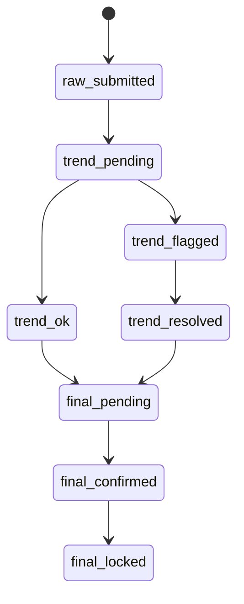

# BRD 第 1 章：业务流程总览（v3.1 · 修复所有 P0 · 含状态机 & 事务逻辑）

本章作为系统最高级业务蓝图的最终修正版，修复 Claude 标注的所有 P0 级缺陷，并补充关键状态机、事务逻辑、死号迁移规则与数据时效性规则。

---

# 1. 系统业务定位（System Positioning）

系统以“项目（国家/地区）”作为最小业务单元，统一管理：

- 投手多项目多账户的广告投放  
- 客户预付模式的项目余额（收入侧）  
- 供应商渠道提供的广告账户和真实消耗（成本侧）  
- 日报 → 风控 → 最终粉 → 计费 → 成本扣费 → 对账 的完整闭环  

核心原则：

1. **国家 = 地区 = 项目（统一业务单元）**  
2. **最终粉（final）是唯一计费来源**  
3. **真实消耗 + 手续费（real_spend + fee）是唯一成本来源**  
4. **项目余额与供应商余额为两套独立账本，不得混合**

---

# 2. 角色（Roles）


| 角色 | 职责 | 禁止行为 |
|------|------|----------|
| 投手（Media Buyer） | 投放、日报提交 | 不能改粉、不能改消耗、不能充值 |
| 运营（Data Operator） | 真实消耗录入、趋势风控、最终粉确认 | 不得修改充值记录 |
| 客户经理（AM） | 项目配置、催款、账户管理 | 不能改粉、不能改消耗 |
| 财务（Finance） | 项目充值、供应商充值、渠道对账 | 不能修改粉与消耗 |
| 管理员（Admin） | 配置、死号迁移、审计修正 | 不参与投放与日报 |

---

# 3. 顶层业务流程（流程图 · 总览）

```mermaid
flowchart TD

    A[创建项目
设置单粉价] --> B[客户充值
生成项目余额]
    B --> C[分配广告账户给投手]

    C --> D[投手提交日报
raw]
    D --> E[运营录入真实消耗
real_spend + fee]
    E --> F[趋势风控
今日 vs 昨日最大值]

    F --> G[最终粉确认状态机
final_conversions]
    G --> H[计费: final × unit_price → 项目收入]
    H --> I[扣减项目余额 (事务锁定)]

    E --> J[成本: real_spend + fee]
    J --> K[扣减供应商余额 (事务锁定)]

    I --> L{项目余额不足?}
    L -->|是| M[提醒客户经理催款]

    K --> N{供应商余额不足?}
    N -->|是| O[提醒财务充值渠道]

    H --> P[项目营收日报]
    J --> Q[供应商成本日报]
    P --> R[项目利润 = 收入 - 成本]
    Q --> R
```

---

# 4. 粉数确认状态机（*修复 P0：风控时机问题*）

粉数进入计费必须经过完整状态机：



## 状态解释：

### ✔ raw_submitted  
投手提交 raw 数据（粉数 & 估算消耗）

### ✔ trend_pending  
等待运营录入真实消耗，开始趋势判断

### ✔ trend_flagged  
系统发现“掉粉/爆粉/爆 spend”等异常，必须人工复核  
（此状态不能进入 final）

### ✔ final_pending  
趋势正常后，由运营录入最终粉数

### ✔ final_confirmed  
粉数通过双人确认（或系统确认）

### ✔ final_locked（计费锁定）  
进入计费，不可再被修改  
如需修正 → 必须创建“红冲”（负向 entry）

---

# 5. 死号迁移规则（*修复 P0：跨供应商迁移问题*）

死号迁移是系统核心流程之一，必须具备硬性规则。

## 5.1 迁移原则（必须遵守）

### ❌ Rule 1：死号余额不能跨供应商直接迁移  
因为不同供应商账本是独立的。

### ✔ Rule 2：同供应商内迁移余额（正常迁移）

```
source.supplier_id == target.supplier_id
```

迁移动作：

- ledger transfer_out（账户 A）  
- ledger transfer_in（账户 B）  

### ✔ Rule 3：如必须跨供应商，应拆成两条交易：

```
(1) Supplier S1 退款 → negative cost entry
(2) Supplier S2 充值 → positive cost entry
```

并且：

- 只能由 Finance + Admin 审核  
- 必须记录 audit_log  
- 不改变项目余额

---

# 6. 项目余额扣减事务逻辑（*修复 P0：事务问题*）

计费流程必须具备原子性，避免重复扣减。

```text
Step 1: 使用 SELECT ... FOR UPDATE 锁定 project row
Step 2: 插入 ledger_entries（收入 entry）
Step 3: 扣减 project_balance
Step 4: 写入 balance_after
Step 5: 提交事务
```

## 计费粒度

计费发生在：

- 项目  
- 投手  
- 广告账户  
- 日期  

一条 final 粉数 = 一条账本记录。

## final_locked 后禁止修改  

如需修改：

```
必须生成 “红冲 entry” + “新正向 entry”
```

确保账本可审计与可追踪。

---

# 7. 三条数据流（Three Data Streams）

## 7.1 Raw Operational Line（日报流）

来源：投手  
用途：趋势判断、补数据  
不用于：计费、成本  

## 7.2 Cost Line（真实消耗流）

来源：FB 后台（运营录入 or API）  
用途：供应商成本扣减（唯一来源）

```
cost = real_spend + fee
```

## 7.3 Revenue Line（最终粉流）

来源：运营最终粉核对（final）  
用途：扣项目余额（唯一来源）

```
revenue = final × unit_price
```

---

# 8. 数据流时效性规则（*新增，确保数据一致性*）

## 8.1 日报（raw）时效
- 投手每日 **23:59前** 必须提交  
- 超时为“补日报”，需运营确认

## 8.2 真实消耗（Spend）
- 必须在次日 **12:00 前** 完成录入  
- 若 FB 延迟，可补录但需标注 “delayed_source”

## 8.3 最终粉（Final）
- 必须在次日 **14:00 前** 完成 final_confirmed  
- final_locked 后禁止修改

## 8.4 成本/收入账本（Ledger）
- 每日 T+1 生成完整日报  
- T+2 后禁止修改（只能通过红冲）

---

# 9. 两套账本（Project Ledger & Supplier Ledger）

## 9.1 项目收入账（项目余额）

```
revenue = final × unit_price
project_balance -= revenue
```

项目余额来源：

- 客户充值  
- 正向计费（扣减）  
- 负向红冲（回补）

## 9.2 供应商成本账（供应商余额）

```
cost = real_spend + fee
supplier_balance -= cost
```

来源：

- 财务充值  
- 死号迁移  
- 成本扣除  

两套账本绝不能混合。

---

# 10. 全局预警体系（Alert System）

## 10.1 项目余额预警
```
project_balance < max(3日均值, 固定阈值)
```
通知对象：Account Manager

## 10.2 供应商余额预警
```
supplier_balance < 2日真实消耗均值
```
通知对象：Finance

## 10.3 趋势风控预警
- 今日粉数 < 昨日最大值 50%
- 今日粉数 > 昨日最大值 3倍
- 今日 spend 翻倍
- 粉数/消耗明显不匹配

通知对象：Data Operator

---

# 11. 本章总结（Summary）

v3.1 修复并补强：

- 风控时机先于最终粉确认（状态机）
- 死号迁移严格禁止跨供应商（必须分拆为退款 + 新充值）
- 项目余额扣减采用数据库事务（保证原子性）
- 增加数据时效性规则（raw → spend → final）
- 完整三数据流与两账本逻辑
- 完整 RBAC 边界

这是整个系统的正式顶层设计基线（Baseline），所有模块必须严格遵循。
