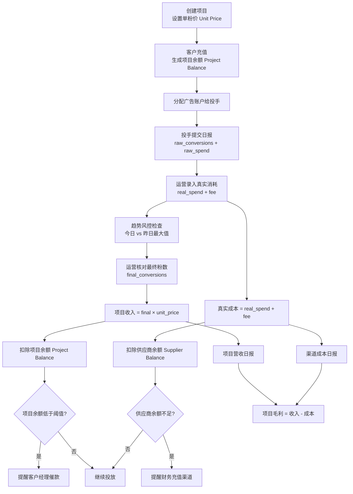

# BRD 第 1 章：业务流程总览（v3.0 · 完全修复版）

本章作为系统最高层业务蓝图，明确广告投手管理系统的业务结构、三大数据流、两套账本、角色边界、预警体系及死号迁移流程。

---

# 1. 系统业务定位（System Positioning）

系统以“项目（国家/地区）”为基本业务单元，用于管理：

- 多国家投放业务（Project = Country = Business Unit）
- 投手多项目多广告账户的日常运营
- 渠道商（供应商）提供的广告账号及余额
- 客户预付的项目资金（收入端）
- 渠道真实消耗的成本（成本端）
- 每日粉数 → 计费收入、真实消耗 → 成本扣减的闭环

系统遵循三大理念：

1. **国家 = 地区 = 项目（统一业务模型）**
2. **粉数与消耗分别进入“收入账本”与“成本账本”，二者绝不混合**
3. **日报（raw）不可用于计费，最终粉数（final）才是唯一计费依据**

---

# 2. 业务参与角色（Roles）

| 角色 | 职责 | 禁止行为 |
|------|------|----------|
| Media Buyer（投手） | 投放、提交日报 | 不能改粉、不能改消耗、不能充值 |
| Data Operator（运营） | 真实消耗录入、趋势风控、最终粉确认 | 不能充值、不能改项目配置信息 |
| Account Manager（客户经理） | 项目创建、单粉价设置、催款 | 不能改粉、不能改消耗 |
| Finance（财务） | 项目充值、供应商充值、渠道对账 | 不能改粉、不能改消耗 |
| Admin（管理员） | 系统配置、死号迁移、审计修正 | 不能投放、不能提交日报 |

RBAC 遵循透明边界，所有涉及金额或粉数的变动必须写入审计日志。

---

# 3. 顶层业务流程图（Overview）



---

# 4. 项目（Project）生命周期

### 4.1 项目即国家（核心定义）
项目（Project）完全等同于国家/地区，系统不会出现“客户自定义项目”概念。

### 4.2 生命周期
- 创建项目  
- 设置单粉价（unit_price）  
- 客户预付充值 → 生成 project_balance  
- 投放运行  
- 根据 final_conversions 扣 project_balance  
- 余额不足 → 自动提醒 AM  
- 暂停、关闭项目  

### 4.3 项目余额定义
项目余额只与粉数计费相关：

```
project_balance_new = project_balance_old - final_conversions × unit_price
```

项目余额只与收入端相关，绝不与供应商余额联动。

---

# 5. 广告账户生命周期（含死号迁移）

广告账户会经过以下状态：

```
New → Testing → Active → Limited → Dead → Archived
```

### 5.1 死号（Dead）定义
- 无法继续投放  
- Facebook 限制  
- Spend 不再变化  
- 状态被运营或管理员设为 Dead  

### 5.2 死号余额迁移（核心业务流程）


迁移会产生 2 条 ledger 记录：

```
Entry 1: transfer_out（账户 A）
Entry 2: transfer_in（账户 B）
```

迁移不影响项目余额，只涉及供应商余额。

---

# 6. 三条数据流（Three Data Streams）

系统中所有数据归属于三条独立的数据流，每条在账本中承担不同角色。

## 6.1 A. 日报数据流（Raw Operational Line）
来源：投手  
作用：行为记录、辅助风控  
不用于：计费或成本  

字段：
- raw_conversions  
- raw_spend  
- remarks  

## 6.2 B. 消耗数据流（Cost Line）
来源：FB 后台真实消耗（运营录入 or API）  
作用：供应商成本扣减  
不依赖投手日报  

字段：
- real_spend  
- fee  
- cost = real_spend + fee  

## 6.3 C. 粉数数据流（Revenue Line）
来源：运营最终核对表（Final）  
作用：项目收入结算  
优先级最高  

字段：
- final_conversions  

---

# 7. 三条数据源的优先级（核心规则）

```
计费粉数来源优先级：final > reviewed > raw
成本来源优先级：real_spend > raw_spend
```

明确禁止：

- 投手 raw_conversions 参与计费  
- 投手 raw_spend 参与成本  
- reviewed_conversions 参与最终结算  

---

# 8. 两套账本（Ledger System）

## 8.1 项目收入账（Project Ledger）

```
revenue = final_conversions × unit_price
project_balance -= revenue
```

用于：
- 项目利润  
- 客户账单  
- 催款预警  

项目余额只来自：
- 客户充值  
- 粉数扣费  

## 8.2 供应商成本账（Supplier Ledger）

```
cost = real_spend + fee
supplier_balance -= cost
```

用于：
- 渠道对账  
- 成本计算  
- 风险预警  

供应商余额只来自：
- 财务对供应商充值  
- 死号迁移  

---

# 9. 预警体系（Alert System）

预警分为三类：

## 9.1 项目余额预警
触发条件：
```
project_balance < max(3日消耗均值 × 1天, 固定阈值)
```
通知对象：Account Manager

## 9.2 供应商余额预警
触发条件：
```
supplier_balance < 2日真实消耗均值
```
通知对象：Finance

## 9.3 趋势风控预警
触发条件：
- 今日粉数 < 昨日最大值 × 0.5  
- 今日粉数 > 昨日最大值 × 3  
- 今日真实消耗大幅波动  
- Spend > 昨日 × 2  
- 粉数异常（掉粉/爆粉）  

通知对象：Data Operator

---

# 10. 本章总结（Summary）

本章清晰定义了：

- 国家即项目的业务模型
- 投放 → 日报 → 风控 → 核对 → 计费 → 成本 → 对账的业务闭环
- raw / review / final 三条数据流
- 项目收入账与供应商成本账的独立性
- 广告账户生命周期与死号迁移机制
- 三类预警体系
- 明确的角色边界与审计逻辑

这是整个系统的最高级抽象，所有后续模块必须遵循本章规范。
