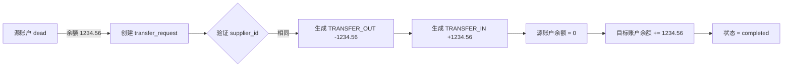
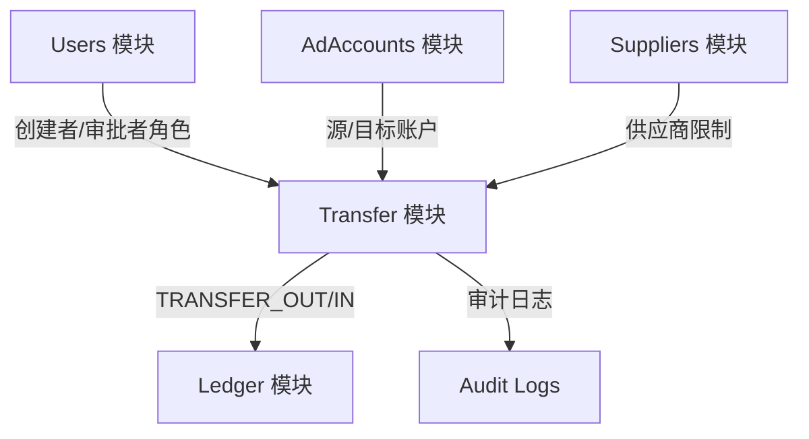
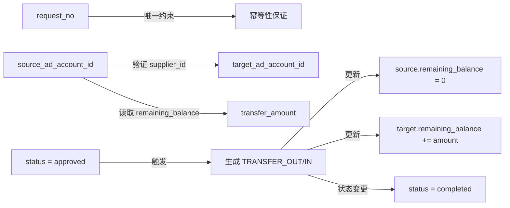

# 死号余额迁移模块规范（TRANSFER_SOT - Single Source of Truth）

> **文档版本**: v1.0
> **发布日期**: 2025-01-22
> **文档类型**: Transfer 模块领域唯一真相源（SoT-Transfer）
> **适用范围**: 后端开发、财务团队、运维团队、测试工程师
> **规范级别**: 🔴 强制执行（PR 必查）
> **文档定位**: 死号余额迁移模块的业务规则、状态机、并发控制、双账本影响的唯一定义

---

## ⚡ 快速导航

| 章节 | 内容 | 适用人员 |
|-----|------|---------|
| [1. 文档定位](#1-文档定位document-scope) | Transfer 模块职责、仲裁规则 | 架构师、Tech Lead |
| [2. 模块边界](#2-模块边界module-boundary) | 业务目的、同/跨供应商规则 | 全员 |
| [3. 数据模型 SoT](#3-数据模型-sotmapping-to-data_schema) | 字段职责、逻辑关系 | 后端开发、DBA |
| [4. 死号迁移业务原则](#4-死号迁移业务原则business-principles) | 源/目标账户规则、金额约束 | 后端开发、财务 |
| [5. 状态机](#5-状态机state-machine) | 状态清单、流转白名单、终态说明 | 后端开发 |
| [6. 并发控制](#6-并发控制concurrency-control) | 乐观锁、悲观锁、事务隔离 | 后端开发 |
| [7. 幂等性](#7-幂等性idempotency) | request_no 唯一键、重复处理 | 后端开发 |
| [8. 双账本映射规则](#8-双账本映射规则ledger-mapping) | TRANSFER_OUT/IN、事务边界 | 后端开发、财务 |
| [9. 事务边界](#9-事务边界transaction-boundary) | 事务范围、锁定策略、超时控制 | 后端开发 |
| [10. 错误码引用](#10-错误码引用error-codes) | Transfer 相关错误码列表 | 全栈开发 |
| [11. 权限与 RLS](#11-权限与-rlsauth--row-level-security) | 角色权限、数据可见性 | 后端开发、安全 |
| [12. 测试范围](#12-测试范围test-scope) | 测试点要求、覆盖范围 | 测试工程师 |
| [13. 版本控制](#13-版本控制versioning) | 变更流程、仲裁规则 | 全员 |

---

## 1. 文档定位（Document Scope）

### 1.1 Transfer 模块的职责

**Transfer 模块是 AI_AD_SYSTEM 死号余额迁移的核心模块**，负责：

- ✅ **死号余额迁移**: 从 dead 账户迁移余额到 active 账户
- ✅ **同供应商限制**: 仅允许同 supplier_id 内迁移
- ✅ **双账本记录**: 生成 TRANSFER_OUT（源） + TRANSFER_IN（目标）Ledger 记录
- ✅ **事务原子性**: 迁移过程必须在单一事务内完成
- ✅ **幂等性保证**: request_no 唯一约束防止重复迁移
- ✅ **审计完整性**: 所有操作记录 created_by 和 notes

### 1.2 在 SoT 体系中的位置

```
AI_AD_SYSTEM 文档体系
│
├─ MASTER_SPEC.md v1.0         ← 系统架构总纲、全局规则
├─ DATA_SCHEMA.md v5.1         ← transfer_requests 表结构的唯一来源
├─ STATE_MACHINE.md v2.5       ← Transfer 状态机的唯一来源
├─ LEDGER_SOT.md v1.1          ← 双账本逻辑的唯一来源
├─ BUSINESS_RULES.md v3.1      ← 业务规则的唯一来源
├─ ERROR_CODES_SOT.md v2.1     ← 错误码定义的唯一来源
├─ AUTH_SPEC.md v2.0           ← 权限控制的唯一来源
│
└─ TRANSFER_SOT.md v1.0 (本文档) ← Transfer 业务逻辑的唯一来源
    ├─ 引用 DATA_SCHEMA (transfer_requests, ad_accounts, suppliers, ledger_entries)
    ├─ 引用 STATE_MACHINE (Transfer 状态机)
    ├─ 引用 LEDGER_SOT (TRANSFER_OUT/IN 双账本规则)
    ├─ 引用 BUSINESS_RULES (BR-ACCT-002)
    ├─ 引用 ERROR_CODES_SOT (E-TRANS-*)
    └─ 定义 同/跨供应商规则、并发控制、幂等性
```

### 1.3 仲裁规则（冲突优先级）

| 领域 | 唯一真相源 | 仲裁规则 | 示例 |
|-----|-----------|---------|------|
| **数据库字段** | DATA_SCHEMA.md v5.1 | 字段名/类型/约束以 DATA_SCHEMA 为准 | `transfer_requests.request_no` 字段类型 |
| **业务状态** | STATE_MACHINE.md v2.5 | 状态枚举/流转以 STATE_MACHINE 为准 | draft/approved/completed 状态机 |
| **错误码** | ERROR_CODES_SOT.md v2.1 | 错误码/HTTP 状态以 ERROR_CODES 为准 | `E-TRANS-004` 跨供应商迁移 |
| **同/跨供应商规则** | TRANSFER_SOT.md (本文档) | 迁移规则以本文档为准 | 同 supplier 允许，跨 supplier 禁止 |
| **双账本规则** | LEDGER_SOT.md v1.1 | TRANSFER_OUT/IN 规则以 LEDGER_SOT 为准 | entry_type 定义 |
| **权限控制** | AUTH_SPEC.md v2.0 | 角色权限以 AUTH_SPEC 为准 | account_manager 发起权限 |

**冲突处理规则**:
- ✅ 如果 DATA_SCHEMA 与 TRANSFER_SOT 字段定义冲突 → **以 DATA_SCHEMA 为准，修改 TRANSFER_SOT**
- ✅ 如果 STATE_MACHINE 与 TRANSFER_SOT 状态规则冲突 → **以 STATE_MACHINE 为准，修改 TRANSFER_SOT**
- ✅ 如果 LEDGER_SOT 与 TRANSFER_SOT 账本规则冲突 → **以 LEDGER_SOT 为准，修改 TRANSFER_SOT**
- ✅ 如果 API_SOT.md 与 TRANSFER_SOT 业务流程冲突 → **修改 API_SOT.md，以 TRANSFER_SOT 为准**

### 1.4 本 SoT 不包含的内容

| 内容类型 | 是否包含 | 说明 |
|---------|---------|------|
| **API 端点定义** | ❌ 不包含 | 由 API_SOT.md 定义 |
| **Schema 定义** | ❌ 不包含 | 由 API_SOT.md 定义（TransferRequestCreate/Update） |
| **数据库字段类型** | ❌ 不包含 | 由 DATA_SCHEMA.md 定义 |
| **Service 层实现代码** | ❌ 不包含 | 由开发实现，参考本 SoT 规范 |

---

## 2. 模块边界（Module Boundary）

### 2.1 死号迁移业务目的

**业务场景**: 当广告账户被标记为 `dead`（账户死亡）时，账户中的剩余余额需要迁移到新的活跃账户。

**核心目标**:
1. **余额不丢失**: 死号的剩余余额（remaining_balance）迁移到目标账户
2. **供应商限制**: 仅允许在同一供应商（supplier_id）内迁移
3. **账本可追溯**: 迁移生成 TRANSFER_OUT（源）+ TRANSFER_IN（目标）Ledger 记录
4. **不可逆操作**: 迁移完成后不可回退（completed 终态）

### 2.2 同 supplier 内部迁移（允许）

**引用**: BRD_chapter1_v3.1.md - 第 5.1 节, BUSINESS_RULES.md BR-ACCT-002

**允许条件**:
```python
source.supplier_id == target.supplier_id
```

**迁移流程**:


**核心约束**:
- ✅ 源账户与目标账户 `supplier_id` 必须相同
- ✅ 源账户 `status` 必须为 `dead`
- ✅ 目标账户 `status` 必须为 `active`
- ✅ 迁移金额 `transfer_amount` = 源账户 `remaining_balance`
- ✅ 迁移完成后，源账户 `remaining_balance = 0`

### 2.3 跨 supplier 迁移（禁止）

**引用**: BRD_chapter1_v3.1.md - 第 5.3 节, LEDGER_SOT.md 第 10.3 节

**禁止条件**:
```python
source.supplier_id != target.supplier_id
```

**错误码**: `E-TRANS-004` (跨供应商迁移不允许)

**正确处理方式**: 必须拆解为两步操作
```
1. Supplier S1 退款 → 生成 negative COST entry (SUPPLIER S1 账本)
2. Supplier S2 充值 → 生成 positive TOPUP entry (SUPPLIER S2 账本)
```

**禁止原因**:
- ❌ 不同供应商账本是独立的
- ❌ TRANSFER_OUT/IN 必须在同一 supplier_id 下成对出现
- ❌ 跨供应商迁移会破坏账本独立性

### 2.4 模块依赖关系



| 依赖模块 | 依赖关系 | 说明 |
|---------|---------|------|
| **Users** | transfer_requests.created_by → users.id | 发起人角色验证 |
| **AdAccounts** | transfer_requests.source_ad_account_id → ad_accounts.id | 验证账户状态 |
| **AdAccounts** | transfer_requests.target_ad_account_id → ad_accounts.id | 验证账户状态 |
| **Suppliers** | ad_accounts.supplier_id | 验证同供应商限制 |
| **Ledger** | completed 触发 ledger_entries 插入 | TRANSFER_OUT + TRANSFER_IN |
| **AuditLogs** | transfer_audit_logs 记录状态变更 | 完整审计链 |

---

## 3. 数据模型 SoT（Mapping to DATA_SCHEMA）

**引用**: DATA_SCHEMA.md v5.1 - 第 3.X 节（待补充）

### 3.1 涉及的表

| 表名 | 职责 | 主键 | 说明 |
|-----|------|------|------|
| **transfer_requests** | 迁移申请记录 | BIGSERIAL | 存储迁移申请状态、金额 |
| **ad_accounts** | 广告账户 | BIGSERIAL | 源/目标账户信息 |
| **suppliers** | 供应商 | UUID | 供应商主数据 |
| **ledger_entries** | 资金总账 | BIGSERIAL | TRANSFER_OUT/IN 记录 |

### 3.2 transfer_requests 表字段职责

| 字段 | 职责说明 | 逻辑关系 |
|-----|---------|---------|
| **id** | 主键 | - |
| **request_no** | 唯一幂等键 | 防止重复迁移，格式: `TRF-{timestamp}-{random}` |
| **source_ad_account_id** | 源账户 ID | FK → ad_accounts.id，必须为 dead 状态 |
| **target_ad_account_id** | 目标账户 ID | FK → ad_accounts.id，必须为 active 状态 |
| **transfer_amount** | 迁移金额 | 必须 = source.remaining_balance，必须 > 0 |
| **status** | 迁移状态 | draft/approved/completed/rejected (引用 STATE_MACHINE.md) |
| **created_by** | 发起人 | FK → users.id，account_manager/admin |
| **approved_by** | 审批人 | FK → users.id，finance/admin |
| **created_at** | 创建时间 | TIMESTAMPTZ |
| **approved_at** | 审批时间 | TIMESTAMPTZ |
| **notes** | 备注 | 迁移原因 |

### 3.3 字段之间的逻辑关系



**核心逻辑**:
1. **request_no → 幂等性**: 唯一约束防止重复迁移
2. **source/target → supplier_id**: 必须相同
3. **transfer_amount = source.remaining_balance**: 迁移全部余额
4. **status = approved → Ledger**: 触发 TRANSFER_OUT/IN 生成
5. **Ledger 成功 → status = completed**: 终态锁定

---

## 4. 死号迁移业务原则（Business Principles）

**引用**: BUSINESS_RULES.md v3.1 - BR-ACCT-002

### 4.1 源账户状态必须为 dead

| 规则 | 说明 | 错误码 |
|-----|------|--------|
| **源账户 status = dead** | 仅死号可迁移余额 | `E-TRANS-002` |
| **源账户 remaining_balance > 0** | 余额为 0 时禁止迁移 | `E-TRANS-006` |

**验证逻辑**:
```python
if source_account.status != "dead":
    raise TransferException(
        code="E-TRANS-002",
        message="源账户必须为 dead 状态才能迁移余额"
    )

if source_account.remaining_balance <= 0:
    raise TransferException(
        code="E-TRANS-006",
        message="源账户余额不足，无法迁移"
    )
```

### 4.2 目标账户必须为 active

| 规则 | 说明 | 错误码 |
|-----|------|--------|
| **目标账户 status = active** | 仅活跃账户可接收余额 | `E-TRANS-003` |
| **目标账户 ≠ 源账户** | 禁止自己迁移给自己 | `E-TRANS-001` |

**验证逻辑**:
```python
if target_account.status != "active":
    raise TransferException(
        code="E-TRANS-003",
        message="目标账户必须为 active 状态才能接收余额"
    )

if source_account.id == target_account.id:
    raise TransferException(
        code="E-TRANS-001",
        message="源账户与目标账户不能相同"
    )
```

### 4.3 源与目标 ad_account 必须属于同 supplier

| 规则 | 说明 | 错误码 |
|-----|------|--------|
| **source.supplier_id = target.supplier_id** | 仅同供应商内可迁移 | `E-TRANS-004` |

**验证逻辑**:
```python
if source_account.supplier_id != target_account.supplier_id:
    raise TransferException(
        code="E-TRANS-004",
        message="禁止跨供应商迁移余额，必须拆分为退款 + 充值"
    )
```

### 4.4 迁移金额不能为负数且必须 ≤ 源账户余额

| 规则 | 说明 | 错误码 |
|-----|------|--------|
| **transfer_amount > 0** | 迁移金额必须大于 0 | `E-TRANS-006` |
| **transfer_amount ≤ source.remaining_balance** | 不能超过源账户余额 | `E-TRANS-006` |
| **transfer_amount = source.remaining_balance** | 建议迁移全部余额 | - |

**验证逻辑**:
```python
if transfer_amount <= 0:
    raise TransferException(
        code="E-TRANS-006",
        message="迁移金额必须大于 0"
    )

if transfer_amount > source_account.remaining_balance:
    raise TransferException(
        code="E-TRANS-006",
        message=f"迁移金额不能超过源账户余额 {source_account.remaining_balance}"
    )
```

### 4.5 迁移不可逆，如需修正必须通过调账

**引用**: LEDGER_SOT.md 第 12 章 (手工调账)

| 规则 | 说明 |
|-----|------|
| **completed 后不可回退** | 终态锁定 |
| **如需修正** | 必须通过手工调账（Manual Adjustment） |
| **禁止直接 DELETE** | 必须保留审计记录 |

**修正流程**:
```
1. 发现 completed 迁移错误
2. 创建 Manual Adjustment 记录
3. 生成负向 Ledger (冲销原 TRANSFER_IN)
4. 生成正向 Ledger (新的正确金额)
5. 记录审计日志
```

---

## 5. 状态机（State Machine）

**引用**: STATE_MACHINE.md v2.5 - 第 X 章（待补充）

### 5.1 状态清单

| 状态 | 说明 | 触发条件 | 角色权限 | 可修改字段 |
|-----|------|---------|---------|-----------|
| **draft** | 草稿 | 创建 transfer_request | account_manager, admin | transfer_amount, notes |
| **approved** | 已审批，等待执行 | 审批通过 | finance, admin | - |
| **completed** | 迁移完成，终态 | Ledger 生成成功 | 系统自动 | - |
| **rejected** | 审批拒绝，终态 | 审批拒绝 | finance, admin | - |

### 5.2 状态流转白名单

```python
"transfer_requests.status": {
    "draft": ["approved", "rejected"],
    "approved": ["completed"],
    "completed": [],  # 终态，不可回退
    "rejected": []    # 终态，不可回退
}
```

**合法流转示例**:
- ✅ draft → approved (审批通过)
- ✅ draft → rejected (审批拒绝)
- ✅ approved → completed (Ledger 生成成功)
- ❌ completed → approved (终态回退，禁止)
- ❌ rejected → draft (终态回退，禁止)

### 5.3 终态说明（completed）

| 属性 | 说明 |
|-----|------|
| **触发条件** | approved 状态后，TRANSFER_OUT/IN Ledger 生成成功 |
| **锁定时间** | completed_at 字段自动设置 |
| **触发 Ledger** | 插入 SUPPLIER TRANSFER_OUT + TRANSFER_IN 记录 |
| **可修改性** | ❌ 不可回退，不可修改 |
| **修正机制** | ✅ 仅可通过手工调账修正 |
| **审计要求** | [AUDIT] 强制，记录 transfer_audit_logs |

### 5.4 rejected 后可创建新申请，但不能复用相同 request_no

| 规则 | 说明 |
|-----|------|
| **rejected 后新建** | ✅ 允许创建新的 transfer_request |
| **request_no 唯一性** | ❌ 不能复用已 rejected 的 request_no |
| **幂等性保证** | 唯一约束 `request_no UNIQUE` |

**示例**:
```python
# ✅ 正确：创建新申请，生成新 request_no
new_request = create_transfer_request(
    request_no="TRF-20250122-0002",  # 新编号
    source_account_id=123,
    target_account_id=456
)

# ❌ 错误：复用 rejected 的 request_no
old_request_no = "TRF-20250122-0001"  # 已 rejected
new_request = create_transfer_request(
    request_no=old_request_no,  # 唯一约束冲突
    source_account_id=123,
    target_account_id=456
)
# IntegrityError: request_no UNIQUE constraint violated
```

---

## 6. 并发控制（Concurrency Control）

### 6.1 expected_version（乐观锁）

**设计目标**: 防止并发审批同一条迁移申请导致重复迁移。

| 字段 | 类型 | 说明 |
|-----|------|------|
| **version** | INTEGER DEFAULT 0 | 当前版本号，每次更新 +1 |
| **expected_version** | - | 前端/API 传递的期望版本号 |

**乐观锁流程**:
```python
# 前端读取 transfer_request
transfer_request = GET /transfer-requests/{id}
# 返回: { id: 123, version: 2, status: "draft" }

# 前端审批
PUT /transfer-requests/{id}/approve
Body: {
    "expected_version": 2  # 期望版本号
}

# 后端验证版本
if transfer_request.version != expected_version:
    raise ConcurrencyException("VERSION_CONFLICT")

# 审批成功，version +1
transfer_request.version = 3
transfer_request.status = "approved"
```

### 6.2 审批必须串行执行

| 规则 | 说明 |
|-----|------|
| **禁止并发审批** | 同一条 transfer_request 不能被并发审批 |
| **使用 SELECT FOR UPDATE** | 审批时锁定 transfer_request 行 |
| **version 检查** | 验证 expected_version 匹配 |

**Service 层实现**:
```python
def approve_transfer_request(
    transfer_request_id: int,
    expected_version: int,
    user: Dict
) -> TransferRequest:
    with db.begin():
        # Step 1: 使用悲观锁锁定
        transfer_request = db.query(TransferRequest).filter(
            TransferRequest.id == transfer_request_id
        ).with_for_update().first()

        # Step 2: 验证 version
        if transfer_request.version != expected_version:
            raise ConcurrencyException("VERSION_CONFLICT")

        # Step 3: 状态流转
        transfer_request.status = "approved"
        transfer_request.approved_by = user["user_id"]
        transfer_request.approved_at = datetime.now(timezone.utc)
        transfer_request.version += 1

        db.commit()
        return transfer_request
```

### 6.3 源账户与目标账户余额调整必须在同一事务内完成

**引用**: LEDGER_SOT.md 第 5.1.3 节

| 规则 | 说明 |
|-----|------|
| **同一事务** | TRANSFER_OUT + TRANSFER_IN + 余额更新在同一事务内 |
| **SELECT FOR UPDATE** | 锁定源/目标账户 + 供应商余额 |
| **原子性保证** | 任一步骤失败，完整回滚 |

**事务流程**:
```python
with db.begin():
    # Step 1: 锁定源账户
    source = db.query(AdAccount).filter(
        AdAccount.id == source_account_id
    ).with_for_update().first()

    # Step 2: 锁定目标账户
    target = db.query(AdAccount).filter(
        AdAccount.id == target_account_id
    ).with_for_update().first()

    # Step 3: 锁定供应商
    supplier = db.query(Supplier).filter(
        Supplier.id == source.supplier_id
    ).with_for_update().first()

    # Step 4: 生成 TRANSFER_OUT
    transfer_out = LedgerEntry(...)
    db.add(transfer_out)

    # Step 5: 生成 TRANSFER_IN
    transfer_in = LedgerEntry(...)
    db.add(transfer_in)

    # Step 6: 更新余额
    source.remaining_balance = 0
    target.remaining_balance += transfer_amount

    # Step 7: 提交事务
    db.commit()
```

### 6.4 迁移不能被并发触发（使用 SELECT FOR UPDATE）

| 规则 | 说明 |
|-----|------|
| **禁止并发执行迁移** | 同一条 transfer_request 不能被并发执行 |
| **使用悲观锁** | approved → completed 流转时锁定 |
| **幂等性检查** | 检查当前状态是否已 completed |

**防止并发执行**:
```python
def execute_transfer(transfer_request_id: int, user: Dict):
    with db.begin():
        # Step 1: 悲观锁锁定
        transfer_request = db.query(TransferRequest).filter(
            TransferRequest.id == transfer_request_id
        ).with_for_update().first()

        # Step 2: 幂等性检查
        if transfer_request.status == "completed":
            # 幂等返回，已完成
            return transfer_request

        # Step 3: 验证状态
        if transfer_request.status != "approved":
            raise StateTransitionException("E-TRANS-005")

        # Step 4: 执行迁移逻辑
        # ...

        # Step 5: 更新状态
        transfer_request.status = "completed"
        transfer_request.completed_at = datetime.now(timezone.utc)

        db.commit()
        return transfer_request
```

---

## 7. 幂等性（Idempotency）

### 7.1 request_no 是幂等键（唯一）

**约束**: `request_no VARCHAR(100) UNIQUE`

| 规则 | 说明 |
|-----|------|
| **唯一约束** | 同一 request_no 只能创建一次 |
| **格式规范** | `TRF-{YYYYMMDD}-{HHmmss}-{random}` |
| **生成方式** | 后端自动生成，前端不传 |

**幂等性保证**:
```python
def create_transfer_request(
    source_account_id: int,
    target_account_id: int,
    transfer_amount: Decimal,
    user: Dict
) -> TransferRequest:
    # 生成唯一 request_no
    request_no = f"TRF-{datetime.now().strftime('%Y%m%d-%H%M%S')}-{uuid.uuid4().hex[:6]}"

    # 检查是否已存在
    existing = db.query(TransferRequest).filter(
        TransferRequest.request_no == request_no
    ).first()

    if existing:
        # 幂等返回
        return existing

    # 创建新申请
    transfer_request = TransferRequest(
        request_no=request_no,
        source_account_id=source_account_id,
        target_account_id=target_account_id,
        transfer_amount=transfer_amount,
        status="draft",
        created_by=user["user_id"]
    )
    db.add(transfer_request)
    db.commit()
    return transfer_request
```

### 7.2 重复创建返回现有记录，不重复执行迁移

| 场景 | 处理方式 | 错误码 |
|-----|---------|--------|
| **重复创建（相同 request_no）** | 返回已有记录 | - |
| **重复审批（status = approved）** | 幂等返回 | - |
| **重复执行（status = completed）** | 幂等返回 | - |

### 7.3 审批重复调用返回当前状态（状态机幂等）

| 操作 | 当前状态 | 幂等返回 | 说明 |
|-----|---------|---------|------|
| **POST /transfer-requests/{id}/approve** | approved | 返回当前状态 | 已审批 |
| **POST /transfer-requests/{id}/execute** | completed | 返回当前状态 | 已完成 |
| **POST /transfer-requests/{id}/reject** | rejected | 返回当前状态 | 已拒绝 |

---

## 8. 双账本映射规则（Ledger Mapping）

**引用**: LEDGER_SOT.md v1.1 - 第 10 章

### 8.1 死号迁移会产生两条 SUPPLIER 账本记录

| Ledger 记录 | ledger_type | entry_type | 金额方向 | 关联账户 |
|-----------|------------|-----------|---------|---------|
| **TRANSFER_OUT** | SUPPLIER | TRANSFER_OUT | **负数** | source_ad_account_id |
| **TRANSFER_IN** | SUPPLIER | TRANSFER_IN | **正数** | target_ad_account_id |

**示例**:
```sql
-- TRANSFER_OUT（源账户）
INSERT INTO ledger_entries (
    ledger_type, supplier_id, ad_account_id, entry_type, amount,
    reference_type, reference_id, occurred_at, created_by, notes
) VALUES (
    'SUPPLIER', '550e8400-e29b-41d4-a716-446655440000', 12345, 'TRANSFER_OUT', -1234.56,
    'transfer', 1, '2025-01-22 10:30:00', 'user-uuid', '死号迁移：ACC001 → ACC002'
);

-- TRANSFER_IN（目标账户）
INSERT INTO ledger_entries (
    ledger_type, supplier_id, ad_account_id, entry_type, amount,
    reference_type, reference_id, occurred_at, created_by, notes
) VALUES (
    'SUPPLIER', '550e8400-e29b-41d4-a716-446655440000', 67890, 'TRANSFER_IN', +1234.56,
    'transfer', 1, '2025-01-22 10:30:00', 'user-uuid', '接收迁移：ACC001 → ACC002'
);
```

### 8.2 账本 entry_type 必须是 TRANSFER_OUT / TRANSFER_IN

**引用**: LEDGER_SOT.md 第 4.2 节（白名单矩阵）

| 规则 | 说明 |
|-----|------|
| **SUPPLIER 账本允许 TRANSFER_OUT/IN** | ✅ 合法组合 |
| **PROJECT 账本禁止 TRANSFER_OUT/IN** | ❌ 非法组合 |

**CHECK 约束**:
```sql
ALTER TABLE ledger_entries ADD CONSTRAINT chk_ledger_entry_type CHECK (
    (ledger_type = 'PROJECT' AND entry_type IN ('REVENUE', 'TOPUP', 'REVERSAL')) OR
    (ledger_type = 'SUPPLIER' AND entry_type IN ('COST', 'TOPUP', 'TRANSFER_OUT', 'TRANSFER_IN', 'REVERSAL'))
);
```

### 8.3 项目账本（PROJECT）不参与死号迁移

| 规则 | 说明 |
|-----|------|
| **死号迁移仅影响 SUPPLIER 账本** | ✅ TRANSFER_OUT/IN 仅在 SUPPLIER 账本 |
| **PROJECT 账本不受影响** | ❌ PROJECT 账本不记录 TRANSFER_OUT/IN |

**原因**:
- 死号迁移仅涉及供应商成本账本
- 项目收入账本不受死号影响

### 8.4 账本更新必须在同一事务内完成

**引用**: LEDGER_SOT.md 第 5.1.3 节

| 事务步骤 | 说明 |
|---------|------|
| **Step 1** | 锁定源/目标账户（SELECT FOR UPDATE） |
| **Step 2** | 验证 supplier_id 一致性 |
| **Step 3** | 插入 TRANSFER_OUT Ledger |
| **Step 4** | 插入 TRANSFER_IN Ledger |
| **Step 5** | 更新源账户 remaining_balance = 0 |
| **Step 6** | 更新目标账户 remaining_balance += amount |
| **Step 7** | 更新 transfer_request.status = completed |
| **Step 8** | COMMIT 事务 |

**失败回滚**:
- 任一步骤失败，完整回滚
- 源/目标账户余额保持不变
- transfer_request.status 保持 approved

---

## 9. 事务边界（Transaction Boundary）

### 9.1 整个迁移过程必须包装在单一数据库事务中

**事务范围**:
```python
with db.begin():
    # 1. 验证业务规则
    validate_transfer_request(...)

    # 2. 锁定账户和供应商
    source = lock_account(source_account_id)
    target = lock_account(target_account_id)
    supplier = lock_supplier(supplier_id)

    # 3. 生成 Ledger 记录
    transfer_out = create_transfer_out(...)
    transfer_in = create_transfer_in(...)

    # 4. 更新余额
    update_balances(...)

    # 5. 更新状态
    transfer_request.status = "completed"

    # 6. COMMIT
    db.commit()
```

### 9.2 必须锁定 suppliers 层级的余额（SELECT FOR UPDATE suppliers）

**锁定策略**:
```python
# Step 1: 锁定源账户
source_account = db.query(AdAccount).filter(
    AdAccount.id == source_account_id
).with_for_update().first()

# Step 2: 锁定目标账户
target_account = db.query(AdAccount).filter(
    AdAccount.id == target_account_id
).with_for_update().first()

# Step 3: 锁定供应商（防止并发修改供应商余额）
supplier = db.query(Supplier).filter(
    Supplier.id == source_account.supplier_id
).with_for_update().first()
```

**为什么锁定 supplier**:
- 防止并发迁移同一供应商的不同账户
- 确保 supplier.balance 更新原子性
- 避免死锁（锁定顺序：supplier → ad_accounts）

### 9.3 失败必须回滚所有 ledger_entries 与状态更新

| 失败场景 | 回滚策略 |
|---------|---------|
| **TRANSFER_OUT 插入失败** | 完整事务回滚 |
| **TRANSFER_IN 插入失败** | 完整事务回滚 |
| **余额更新失败** | 完整事务回滚 |
| **状态更新失败** | 完整事务回滚 |

**回滚保证**:
- ✅ 源/目标账户余额保持不变
- ✅ 无 Ledger 记录生成
- ✅ transfer_request.status 保持 approved
- ✅ 可重试执行

### 9.4 事务执行时间应控制在 <10 秒

| 超时控制 | 说明 |
|---------|------|
| **数据库事务超时** | 10 秒 |
| **SELECT FOR UPDATE 超时** | 5 秒 |
| **锁等待超时** | 3 秒 |

**超时处理**:
```python
# 设置事务超时
db.execute("SET LOCAL statement_timeout = '10s'")

# 设置锁等待超时
db.execute("SET LOCAL lock_timeout = '3s'")

try:
    with db.begin():
        # 执行迁移逻辑
        ...
except OperationalError as e:
    if "timeout" in str(e):
        raise TransferTimeoutException("E-CONC-001")
```

---

## 10. 错误码引用（Error Codes）

**引用**: ERROR_CODES_SOT.md v2.1 - 第 X 章（待补充）

### 10.1 Transfer 模块涉及的错误码

| 错误码 | HTTP 状态码 | 错误名称 | 触发场景 |
|-------|-----------|---------|---------|
| **E-TRANS-001** | 409 | 申请单号已存在 | request_no 唯一约束冲突 |
| **E-TRANS-002** | 400 | 源账户不是 dead | source_account.status != "dead" |
| **E-TRANS-003** | 400 | 目标账户不是 active | target_account.status != "active" |
| **E-TRANS-004** | 400 | 跨供应商迁移不允许 | source.supplier_id != target.supplier_id |
| **E-TRANS-005** | 400 | 状态不允许审批 | status != "draft" |
| **E-TRANS-006** | 400 | 余额不足 | transfer_amount > source.remaining_balance |
| **E-CONC-001** | 409 | 并发冲突 | version 不匹配或锁超时 |

### 10.2 错误码使用示例

```python
# E-TRANS-002: 源账户不是 dead
if source_account.status != "dead":
    raise TransferException(
        code="E-TRANS-002",
        message="源账户必须为 dead 状态才能迁移余额"
    )

# E-TRANS-004: 跨供应商迁移禁止
if source_account.supplier_id != target_account.supplier_id:
    raise TransferException(
        code="E-TRANS-004",
        message="禁止跨供应商迁移余额，必须拆分为退款 + 充值"
    )

# E-CONC-001: 并发冲突
if transfer_request.version != expected_version:
    raise ConcurrencyException(
        code="E-CONC-001",
        message="版本冲突，请重新获取最新数据"
    )
```

---

## 11. 权限与 RLS（Auth + Row-Level Security）

**引用**: AUTH_SPEC.md v2.0 - 第 5 章

### 11.1 account_manager 可发起迁移（仅自己管理项目）

| 角色 | 权限 | 数据范围 |
|-----|------|---------|
| **account_manager** | ✅ 可发起迁移 | 仅自己管理的项目下的账户 |
| **finance** | ✅ 可审批迁移 | 所有迁移申请 |
| **admin** | ✅ 可发起/审批迁移 | 所有迁移申请 |
| **data_operator** | ❌ 禁止发起迁移 | - |
| **media_buyer** | ❌ 禁止发起迁移 | - |

**权限验证**:
```python
def create_transfer_request(
    source_account_id: int,
    target_account_id: int,
    user: Dict
) -> TransferRequest:
    # 验证角色
    if user["role"] not in ["account_manager", "admin"]:
        raise AuthorizationException("AUTH_500")

    # 验证数据范围（account_manager 仅可操作自己管理的项目）
    if user["role"] == "account_manager":
        source_account = db.query(AdAccount).filter(
            AdAccount.id == source_account_id
        ).first()

        if source_account.project.account_manager_id != user["user_id"]:
            raise AuthorizationException("AUTH_500")
```

### 11.2 finance/admin 可审批

| 角色 | 权限 | 说明 |
|-----|------|------|
| **finance** | ✅ 可审批 | 终审权限 |
| **admin** | ✅ 可审批 | 全局权限 |
| **account_manager** | ❌ 禁止审批 | 发起人不能审批（SOD） |

**SOD 检查**:
```python
def approve_transfer_request(
    transfer_request_id: int,
    user: Dict
) -> TransferRequest:
    transfer_request = db.query(TransferRequest).filter(
        TransferRequest.id == transfer_request_id
    ).first()

    # SOD: 发起人不能审批
    if transfer_request.created_by == user["user_id"]:
        raise BusinessRuleException("BIZ_001")

    # 验证角色
    if user["role"] not in ["finance", "admin"]:
        raise AuthorizationException("AUTH_500")
```

### 11.3 RLS 必须限制：只能访问与用户范围相关的 ad_accounts & transfers

**当前版本**: RLS 默认关闭（`ENABLE_RLS=false`），权限由 Service 层控制

**未来规划**: 启用 RLS 后

| 角色 | RLS 策略 |
|-----|---------|
| **admin** | 所有数据 |
| **finance** | 所有数据 |
| **account_manager** | 仅自己管理的项目下的账户和迁移申请 |
| **data_operator** | 无权限 |
| **media_buyer** | 无权限 |

---

## 12. 测试范围（Test Scope）

### 12.1 单元测试点

| 测试点 | 测试内容 | 预期结果 |
|-------|---------|---------|
| **源/目标账户状态验证** | source.status != "dead" | 返回 `E-TRANS-002` 错误码 |
| **源/目标账户状态验证** | target.status != "active" | 返回 `E-TRANS-003` 错误码 |
| **supplier 匹配验证** | source.supplier_id != target.supplier_id | 返回 `E-TRANS-004` 错误码 |
| **幂等性验证（request_no）** | 重复创建相同 request_no | 返回已有记录 |
| **状态机非法流转** | draft → completed（跳过 approved） | 返回 `STATE_400` 错误码 |
| **并发事务冲突** | 并发审批同一申请 | 返回 `E-CONC-001` 错误码 |
| **ledger entry 金额正确性** | TRANSFER_OUT + TRANSFER_IN = 0 | 金额绝对值相等，符号相反 |
| **错误码正确性** | 各种异常场景 | 返回正确的错误码 |

### 12.2 集成测试点

| 测试点 | 测试内容 | 预期结果 |
|-------|---------|---------|
| **完整业务流程** | draft → approved → completed | 状态流转正常，Ledger 生成正确 |
| **Ledger 触发** | completed 后 TRANSFER_OUT/IN 插入 | Ledger 记录正确，余额更新正确 |
| **事务回滚** | TRANSFER_IN 插入失败 | 完整回滚，余额不变 |
| **权限验证** | media_buyer 尝试发起迁移 | 返回 `AUTH_500` 错误码 |
| **SOD 验证** | 发起人尝试审批自己的申请 | 返回 `BIZ_001` 错误码 |

### 12.3 性能测试点

| 测试点 | 测试内容 | 预期结果 |
|-------|---------|---------|
| **并发创建** | 100 并发创建迁移申请 | 无死锁，唯一约束生效 |
| **事务超时** | 迁移事务执行时间 | < 10 秒 |
| **锁等待超时** | SELECT FOR UPDATE 等待时间 | < 3 秒 |

---

## 13. 版本控制（Versioning）

### 13.1 任何变更必须更新 TRANSFER_SOT.md

| 变更类型 | 更新要求 | 审批流程 |
|---------|---------|---------|
| **新增字段** | 1. 更新 DATA_SCHEMA.md<br/>2. 更新 TRANSFER_SOT.md<br/>3. 生成迁移脚本 | 架构团队审批 |
| **新增状态** | 1. 更新 STATE_MACHINE.md<br/>2. 更新 TRANSFER_SOT.md<br/>3. 更新状态流转白名单 | 架构团队审批 |
| **修改业务规则** | 1. 更新 BUSINESS_RULES.md<br/>2. 更新 TRANSFER_SOT.md | 产品负责人审批 |
| **修改账本映射** | 1. 更新 LEDGER_SOT.md<br/>2. 更新 TRANSFER_SOT.md | 架构团队审批 |

### 13.2 优先级遵守 MASTER_SPEC 仲裁规则

**引用**: MASTER_SPEC.md v1.0 - 第 10 章

| 冲突类型 | 仲裁依据 | 处理方式 |
|---------|---------|---------|
| **字段定义冲突** | DATA_SCHEMA.md | 修改 TRANSFER_SOT.md |
| **状态机冲突** | STATE_MACHINE.md | 修改 TRANSFER_SOT.md |
| **错误码冲突** | ERROR_CODES_SOT.md | 修改 TRANSFER_SOT.md |
| **账本规则冲突** | LEDGER_SOT.md | 修改 TRANSFER_SOT.md |
| **同/跨供应商规则冲突** | TRANSFER_SOT.md | 修改其他文档 |

---

**文档性质**: Transfer 模块领域唯一真相源（SoT-Transfer）
**执行级别**: 🔴 强制执行（PR 必查）
**违规处理**: PR 自动拒绝 / 代码回滚
**最后更新**: 2025-01-22
**版本**: v1.0

---

**END OF DOCUMENT**
