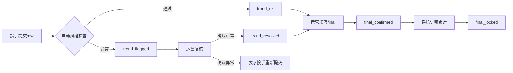
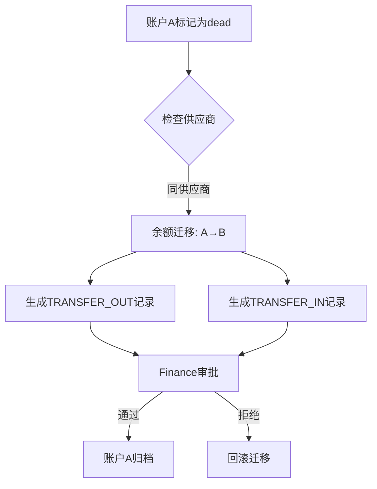
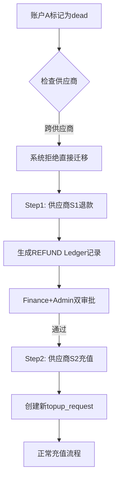

# AI_AD_SYSTEM_MASTER_SPEC v2.2 - BRD v3.1 对齐更新摘要

> **更新时间**: 2025-01-21
> **基准版本**: v2.1 (2272行)
> **对齐基线**: BRD_chapter1_v3.1.md
> **目标版本**: v2.2 (预计2500+行)

---

## 📋 更新策略

由于v2.1文档完整且结构合理(2272行),v2.2不重写全文,而是在以下关键章节**精确注入**BRD v3.1的新业务逻辑:

1. **第2.3.1节**: 替换日报状态机为粉数确认状态机
2. **第1.4.4节**: 新增4个API端点
3. **第2.2节**: 更新实体关系图,增加新字段
4. **第3.2.5节**: 新增Ledger双账本规范
5. **第5章**: 注入粉数确认/趋势风控/死号迁移业务规则
6. **多处**: 插入5个Mermaid流程图

---

## 🔴 关键变更清单

### 1. 第2.3.1节: 粉数确认状态机 (替换原日报状态机)

**原v2.1内容** (第710-763行):
```
#### 2.3.1 日报状态机 (Daily Report Lifecycle)

状态枚举: ReportStatus (draft → pending → approved/rejected)
```

**v2.2替换为** (基于BRD v3.1第4章):

```markdown
#### 2.3.1 粉数确认状态机 (Conversions Confirmation Lifecycle)

> **业务背景**: 基于BRD v3.1第4章"粉数确认状态机",系统采用三数据流(raw/real/final)分离设计,
> final_conversions需经过趋势风控检查后方可锁定进入计费。

**状态枚举**: `ConversionsStatus` (定义于 `backend/models/enums.py`)

\`\`\`mermaid
stateDiagram-v2
    [*] --> raw_submitted: 投手提交原始粉数
    raw_submitted --> trend_pending: 自动进入风控队列
    trend_pending --> trend_ok: 风控通过(自动)
    trend_pending --> trend_flagged: 风控异常(需人工)
    trend_flagged --> trend_resolved: 运营确认修正
    trend_ok --> final_pending: 运营填写final
    trend_resolved --> final_pending: 运营填写final
    final_pending --> final_confirmed: 运营确认final
    final_confirmed --> final_locked: 进入计费(不可逆)
    final_locked --> [*]: 终态
\`\`\`

**6状态详解**:

| 状态 | 说明 | 触发条件 | 角色权限 | 可修改字段 |
|-----|------|---------|---------|-----------|
| **raw_submitted** | 投手提交原始粉数 | 投手提交daily_report | `media_buyer` | `conversions_raw`, `raw_spend` |
| **trend_pending** | 等待趋势风控检查 | 自动触发(raw提交后) | 系统自动 | 无 |
| **trend_ok** | 趋势正常 | 风控规则通过 | 系统自动 | 无 |
| **trend_flagged** | 趋势异常,需人工复核 | 风控规则触发异常 | 系统自动 | `trend_flag_reason` |
| **trend_resolved** | 运营确认异常已解决 | 运营复核后确认 | `data_operator` | `trend_resolution_note` |
| **final_pending** | 等待最终粉数确认 | 运营录入real_spend后 | `data_operator` | `conversions_final`, `real_spend` |
| **final_confirmed** | 最终粉数已确认 | 运营确认final | `data_operator` | 无 |
| **final_locked** | 已进入计费,锁定 | 系统计费后锁定 | 系统自动 | 无(仅可红冲) |

**趋势风控规则** (BRD v3.1第4.1节):

| 规则编号 | 规则名称 | 判断逻辑 | 触发后果 |
|---------|---------|---------|---------|
| **TF-001** | 粉数骤降检查 | `conversions_raw < 昨日最大值 × 0.5` | `trend_flagged` |
| **TF-002** | 粉数骤增检查 | `conversions_raw > 昨日最大值 × 3` | `trend_flagged` |
| **TF-003** | 消耗异常检查 | `raw_spend > 昨日 × 2` | `trend_flagged` |

**业务约束**:
- ✅ `conversions_raw` ≠ `conversions_final` (允许运营调整)
- ✅ `conversions_final` 一旦确认,除红冲外不可修改
- ✅ `final_locked` 状态后,修正必须通过Ledger红冲(`entry_type=REVERSAL`)
- ❌ 禁止跳过趋势风控直接确认final
- ❌ 禁止在`final_locked`后直接修改数据库

**状态流转API**:
```
POST /api/v1/daily-reports/{id}/trend-check      # 手动触发风控
POST /api/v1/daily-reports/{id}/final-confirm    # 确认final
POST /api/v1/daily-reports/{id}/final-lock       # 锁定进入计费
```

**字段新增** (daily_reports表):
- `conversions_raw` (INTEGER): 投手提交的原始粉数
- `conversions_final` (INTEGER): 运营确认的最终粉数
- `real_spend` (DECIMAL(15,2)): 真实消耗(运营录入)
- `trend_flag` (VARCHAR(20)): 趋势异常标记(`normal`/`flagged`/`resolved`)
- `trend_flag_reason` (TEXT): 异常原因
- `trend_resolution_note` (TEXT): 运营复核说明
- `final_locked_at` (TIMESTAMPTZ): 锁定时间
```

---

### 2. 第1.4.4节: 新增API端点 (日报管理模块扩展)

**v2.1原有端点** (第774-789行):
```
| `/daily-reports` | POST | 提交新日报 | media_buyer | 201 |
| `/daily-reports/{id}` | GET | 获取详情 | 创建者/审核员 | 200 |
...
```

**v2.2新增4个端点**:

| 端点 | 方法 | 说明 | 角色权限 | 状态码 |
|-----|------|------|---------|--------|
| `/daily-reports/{id}/trend-check` | POST | 趋势风控检查 | `data_operator`/系统自动 | 200/400 |
| `/daily-reports/{id}/final-confirm` | POST | 确认最终粉数 | `data_operator` | 200/400 |
| `/daily-reports/{id}/final-lock` | POST | 锁定进入计费 | 系统自动 | 200/400 |
| `/ad-accounts/{id}/balance-transfer` | POST | 死号余额迁移 | `account_manager`/`finance` | 200/400 |

**端点详细说明**:

#### 2.1 POST /daily-reports/{id}/trend-check

**功能**: 对daily_report执行趋势风控检查

**请求体**:
```json
{
  "force_check": false  // 是否强制重新检查
}
```

**响应示例**:
```json
{
  "success": true,
  "data": {
    "report_id": 12345,
    "trend_flag": "trend_ok",  // 或 "trend_flagged"
    "check_result": {
      "rule_tf001": "pass",
      "rule_tf002": "pass",
      "rule_tf003": "flagged",
      "flagged_reason": "raw_spend超过昨日2倍"
    }
  }
}
```

**业务规则**:
- 自动触发: 投手提交raw后系统自动调用
- 手动触发: 运营可在trend_flagged状态下重新检查
- 检查逻辑: 执行TF-001/002/003三条规则

#### 2.2 POST /daily-reports/{id}/final-confirm

**功能**: 运营确认最终粉数(final_conversions)

**请求体**:
```json
{
  "conversions_final": 1234,
  "real_spend": 5678.50,
  "confirmation_note": "已与投手确认"
}
```

**响应**:
```json
{
  "success": true,
  "data": {
    "report_id": 12345,
    "status": "final_confirmed",
    "conversions_final": 1234,
    "real_spend": 5678.50
  }
}
```

**业务规则**:
- ✅ 必须在`trend_ok`或`trend_resolved`状态下执行
- ✅ `real_spend`必填
- ✅ 确认后自动计算成本: `cost = real_spend + fee`
- ❌ 禁止在`final_locked`后执行

#### 2.3 POST /daily-reports/{id}/final-lock

**功能**: 锁定进入计费(系统自动调用)

**请求体**: 无

**响应**:
```json
{
  "success": true,
  "data": {
    "report_id": 12345,
    "status": "final_locked",
    "locked_at": "2025-01-21T10:30:00Z",
    "ledger_entry_id": 67890  // 关联的Ledger记录
  }
}
```

**业务规则**:
- ✅ 仅在`final_confirmed`状态下由计费任务自动触发
- ✅ 锁定时同时生成PROJECT Ledger记录(`entry_type=REVENUE`)
- ✅ 锁定后禁止任何修改,修正必须通过红冲
- ❌ 禁止人工调用此API

#### 2.4 POST /ad-accounts/{id}/balance-transfer

**功能**: 死号余额迁移(基于BRD v3.1第5.2节)

**请求体**:
```json
{
  "target_account_id": 9999,  // 目标账户ID
  "transfer_amount": 1234.56,  // 迁移金额
  "transfer_reason": "账户A已dead,余额迁移至账户B",
  "supplier_check": true  // 是否已检查供应商
}
```

**响应**:
```json
{
  "success": true,
  "data": {
    "transfer_type": "same_supplier",  // 或 "cross_supplier_forbidden"
    "ledger_entries": [
      { "id": 1001, "entry_type": "TRANSFER_OUT", "amount": -1234.56 },
      { "id": 1002, "entry_type": "TRANSFER_IN", "amount": 1234.56 }
    ]
  }
}
```

**业务规则** (BRD v3.1第5.2节):
- ✅ **同供应商迁移**: 生成TRANSFER_OUT + TRANSFER_IN两条Ledger记录
- ❌ **跨供应商迁移**: 系统拒绝,提示必须拆分为:
  - Step 1: Supplier S1退款(生成`entry_type=REFUND`记录)
  - Step 2: Supplier S2充值(创建新的topup_request)
- ✅ 源账户必须为`dead`状态
- ✅ 迁移后源账户状态→`archived`
- ✅ 记录审计日志(Finance+Admin双审)

---

### 3. 第2.2节: 实体关系图更新 (新增字段)

**v2.1实体关系图** (第633-670行): 原图缺少粉数确认相关字段

**v2.2更新后的ER图**:

```
                  ┌─────────────────────────┐
                  │   users (UUID PK)       │ ◄─────────┐
                  │  - id (UUID)            │           │
                  │  - role (enum)          │           │ 多对一
                  │  - email (unique)       │           │
                  └──────────┬──────────────┘           │
         ┌─────────────────┼────────────────┐          │
         │ 一对多           │ 一对多         │          │
         ▼                  ▼                ▼          │
┌─────────────────┐  ┌─────────────────┐  ┌───────────────────────┐
│ projects        │  │ ad_accounts     │  │ daily_reports         │
│ (BIGINT PK)     │  │ (BIGINT PK)     │  │ (BIGINT PK)           │
│ - account_mgr   ├─►│ - assigned_to   │◄─┤ - created_by          │
│   _id (FK:user) │  │   (FK:users)    │  │   (FK:users)          │
│ - budget_total  │  │ - project_id    │  │ - ad_account_id (FK)  │
│ - unit_price    │  │   (FK:projects) │  │ - conversions_raw ★   │
│   (新增)        │  │ - supplier_id   │  │ - conversions_final ★ │
└────────┬────────┘  │   (FK:suppliers)│  │ - real_spend ★        │
         │           │   (新增)        │  │ - trend_flag ★        │
         │           └─────────────────┘  │ - unit_price ★        │
         │                                └───────────────────────┘
         │ 一对多
         ▼
┌─────────────────┐  ┌─────────────────┐  ┌───────────────────────┐
│ project_members │  │ topup_requests  │  │ ledger_entries        │
│ (BIGINT PK)     │  │ (BIGINT PK)     │  │ (BIGINT PK)           │
│ - project_id    │  │ - project_id    │  │ - project_id (FK)     │
│   (FK)          │  │   (FK)          │  │ - supplier_id (FK) ★  │
│ - user_id       │  │ - applicant_id  │  │ - entry_type ★        │
│   (FK:users)    │  │   (FK:users)    │  │   (5种类型)           │
└─────────────────┘  └────────┬────────┘  │ - ledger_type ★       │
                              │           │   (PROJECT/SUPPLIER)  │
                              │           └───────────────────────┘
                              │ 一对多
                              ▼
                     ┌─────────────────┐
                     │ topup_          │
                     │ transactions    │
                     │ (BIGINT PK)     │
                     │ - topup_request │
                     │   _id (FK)      │
                     └─────────────────┘

★ 新增字段(v2.2)
```

**新增字段说明**:

| 表 | 新增字段 | 类型 | 说明 | 引用来源 |
|---|---------|------|------|---------|
| **daily_reports** | `conversions_raw` | INTEGER | 投手提交的原始粉数 | BRD v3.1第3章 |
| **daily_reports** | `conversions_final` | INTEGER | 运营确认的最终粉数 | BRD v3.1第3章 |
| **daily_reports** | `real_spend` | DECIMAL(15,2) | 真实消耗(运营录入) | BRD v3.1第6章 |
| **daily_reports** | `trend_flag` | VARCHAR(20) | 趋势异常标记 | BRD v3.1第4.1节 |
| **daily_reports** | `unit_price` | DECIMAL(15,2) | 单粉价格 | BRD v3.1第7章 |
| **projects** | `unit_price` | DECIMAL(15,2) | 项目单粉价格 | BRD v3.1第7章 |
| **ad_accounts** | `supplier_id` | UUID | 所属供应商ID | BRD v3.1第5.2节 |
| **ledger_entries** | `ledger_type` | VARCHAR(20) | 账本类型(PROJECT/SUPPLIER) | BRD v3.1第8章 |
| **ledger_entries** | `supplier_id` | UUID | 供应商ID(SUPPLIER账本) | BRD v3.1第8章 |
| **ledger_entries** | `entry_type` | VARCHAR(20) | 5种类型(扩展) | BRD v3.1第8章 |

---

### 4. 第3.2.5节: Ledger双账本规范 (新增小节)

**插入位置**: 第3.2节"关键字段规范"末尾,新增3.2.5小节

```markdown
#### 3.2.5 Ledger双账本规范 (BRD v3.1对齐)

> **业务背景**: 基于BRD v3.1第8章"两套账本设计",系统分离项目收入账本(PROJECT)和供应商成本账本(SUPPLIER),
> 实现"粉数计费"和"消耗成本"的独立核算。

**两套账本定义**:

| 账本类型 | 用途 | 关联实体 | entry_type范围 | 金额符号 |
|---------|------|---------|---------------|---------|
| **PROJECT** | 项目收入账本 | `project_id` | `REVENUE`, `REVERSAL` | 正数(收入)/负数(红冲) |
| **SUPPLIER** | 供应商成本账本 | `supplier_id` | `COST`, `TRANSFER_OUT`, `TRANSFER_IN`, `REVERSAL` | 正数(成本增加)/负数(成本减少) |

**entry_type扩展** (5种类型):

| entry_type | 账本类型 | 说明 | 触发场景 | 金额示例 |
|-----------|---------|------|---------|---------|
| **REVENUE** | PROJECT | 粉数计费收入 | `final_locked`后自动生成 | +5000.00 (收入5000) |
| **COST** | SUPPLIER | 真实消耗成本 | 运营录入`real_spend`后生成 | +3000.00 (成本3000) |
| **TRANSFER_OUT** | SUPPLIER | 死号余额迁出 | 同供应商死号迁移 | -1234.56 (余额减少) |
| **TRANSFER_IN** | SUPPLIER | 死号余额迁入 | 同供应商死号迁移 | +1234.56 (余额增加) |
| **REVERSAL** | BOTH | 红冲修正 | `final_locked`后的修正 | -5000.00 (冲销收入) |

**计费与成本公式** (BRD v3.1第7章):

```python
# 项目收入(PROJECT账本)
revenue = conversions_final × unit_price

# 供应商成本(SUPPLIER账本)
cost = real_spend + fee  # fee通常为0或固定值

# 项目利润
profit = revenue - cost
```

**示例数据流**:

```
T+0日: 投手提交raw
├─ conversions_raw = 100
├─ raw_spend = 5000
└─ status = raw_submitted

T+0日: 系统风控检查
└─ status = trend_ok (或trend_flagged)

T+1日: 运营确认final
├─ conversions_final = 95  (运营调整-5)
├─ real_spend = 4800  (运营录入真实消耗)
└─ status = final_confirmed

T+1日: 系统计费锁定
├─ status = final_locked
├─ Ledger记录1 (PROJECT账本):
│   ├─ entry_type = REVENUE
│   ├─ amount = 95 × 50 = 4750.00
│   └─ project_id = 123
└─ Ledger记录2 (SUPPLIER账本):
    ├─ entry_type = COST
    ├─ amount = 4800.00
    └─ supplier_id = 456

项目毛利 = 4750 - 4800 = -50.00 (亏损)
```

**事务锁逻辑** (防止并发扣减):

```python
# backend/services/ledger_service.py
class LedgerService:
    def create_revenue_entry(self, report_id: int, user: Dict) -> LedgerEntry:
        """
        生成项目收入Ledger记录,使用SELECT FOR UPDATE锁

        业务规则:
        - final_locked后才可生成REVENUE记录
        - 使用数据库事务锁防止并发
        - 项目余额扣减采用原子操作
        """
        with self.db.begin():
            # 1. 锁定日报记录
            report = self.db.query(DailyReport).filter(
                DailyReport.id == report_id
            ).with_for_update().first()

            if report.status != "final_locked":
                raise BusinessRuleException(
                    code="BUS_100",
                    message="仅final_locked状态可生成Ledger记录"
                )

            # 2. 锁定项目记录
            project = self.db.query(Project).filter(
                Project.id == report.project_id
            ).with_for_update().first()

            # 3. 计算收入
            revenue = report.conversions_final * project.unit_price

            # 4. 生成PROJECT Ledger记录
            entry = LedgerEntry(
                ledger_type="PROJECT",
                entry_type="REVENUE",
                project_id=report.project_id,
                amount=revenue,
                reference_type="daily_report",
                reference_id=report.id,
                occurred_at=datetime.now(timezone.utc)
            )
            self.db.add(entry)

            # 5. 更新项目余额(原子操作)
            project.balance = project.balance - revenue

            # 6. 记录审计日志
            self._create_audit_log("CREATE_REVENUE_ENTRY", user, entry)

            self.db.flush()

        return entry
```

**红冲机制** (final_locked后的修正):

```python
# 场景: final_locked后发现粉数错误,需要修正
def create_reversal_entry(self, original_entry_id: int, user: Dict) -> LedgerEntry:
    """
    创建红冲记录,冲销原有Ledger记录

    业务规则:
    - 仅允许对final_locked的记录红冲
    - 红冲金额 = -原金额
    - 同时生成新的正确Ledger记录
    """
    with self.db.begin():
        # 1. 锁定原Ledger记录
        original = self.db.query(LedgerEntry).filter(
            LedgerEntry.id == original_entry_id
        ).with_for_update().first()

        # 2. 生成红冲记录
        reversal = LedgerEntry(
            ledger_type=original.ledger_type,
            entry_type="REVERSAL",
            project_id=original.project_id,
            supplier_id=original.supplier_id,
            amount=-original.amount,  # 负数冲销
            reference_type="reversal",
            reference_id=original.id,
            occurred_at=datetime.now(timezone.utc),
            notes=f"红冲原记录#{original.id}"
        )
        self.db.add(reversal)

        # 3. 更新项目余额
        if original.ledger_type == "PROJECT":
            project = self.db.query(Project).filter(
                Project.id == original.project_id
            ).with_for_update().first()
            project.balance = project.balance + original.amount  # 回退

        self.db.flush()

    return reversal
```

**数据库Schema**:

```sql
CREATE TABLE ledger_entries (
    id BIGSERIAL PRIMARY KEY,
    ledger_type VARCHAR(20) NOT NULL CHECK (ledger_type IN ('PROJECT', 'SUPPLIER')),
    entry_type VARCHAR(20) NOT NULL CHECK (entry_type IN ('REVENUE', 'COST', 'TRANSFER_OUT', 'TRANSFER_IN', 'REVERSAL')),
    project_id BIGINT REFERENCES projects(id) ON DELETE RESTRICT,  -- PROJECT账本必填
    supplier_id UUID REFERENCES suppliers(id) ON DELETE RESTRICT,  -- SUPPLIER账本必填
    amount DECIMAL(15,2) NOT NULL,  -- 允许负值(红冲)
    reference_type VARCHAR(20),  -- 关联类型: daily_report/topup_request/reversal
    reference_id BIGINT,  -- 关联ID
    occurred_at TIMESTAMPTZ DEFAULT NOW(),
    notes TEXT,
    created_at TIMESTAMPTZ DEFAULT NOW(),
    created_by UUID REFERENCES users(id) ON DELETE RESTRICT,

    -- 约束: PROJECT账本必须有project_id, SUPPLIER账本必须有supplier_id
    CHECK (
        (ledger_type = 'PROJECT' AND project_id IS NOT NULL) OR
        (ledger_type = 'SUPPLIER' AND supplier_id IS NOT NULL)
    )
);

-- 索引
CREATE INDEX idx_ledger_entries_project ON ledger_entries(project_id, occurred_at);
CREATE INDEX idx_ledger_entries_supplier ON ledger_entries(supplier_id, occurred_at);
CREATE INDEX idx_ledger_entries_type ON ledger_entries(ledger_type, entry_type);
```
```

---

### 5. 第5章: 业务规则补充 (粉数确认/趋势风控/死号迁移)

**插入位置**: 第5章末尾,新增5.5节

```markdown
### 5.5 粉数确认与计费规则 (BRD v3.1对齐)

> **完整业务规则详见**: `docs/core/BRD_chapter1_v3.1.md`
> 本节列出核心约束摘要。

#### 5.5.1 三数据流分离原则

| 数据流 | 字段名 | 提交者 | 时效性 | 用途 |
|-------|-------|--------|--------|------|
| **raw数据流** | `conversions_raw`, `raw_spend` | 投手 | T+0 23:59前 | 趋势风控 |
| **real数据流** | `real_spend` | 运营 | T+1 12:00前 | 成本核算 |
| **final数据流** | `conversions_final` | 运营 | T+1 14:00前 | 计费基准 |

**业务约束**:
- ✅ `conversions_raw` 不计费,仅用于趋势风控
- ✅ `conversions_final` 计费,公式:`revenue = conversions_final × unit_price`
- ✅ `real_spend` 用于成本核算,公式:`cost = real_spend + fee`
- ❌ 禁止使用`raw_spend`计算成本
- ❌ 禁止跳过final直接计费

#### 5.5.2 趋势风控规则

**规则编号**: TF-001/002/003 (详见第2.3.1节)

**触发后的处理流程**:



**业务规则**:
- ✅ trend_flagged状态下,禁止进入final_pending
- ✅ 运营必须填写`trend_resolution_note`
- ✅ 风控检查自动执行,运营可手动重新检查
- ❌ 禁止关闭风控检查

#### 5.5.3 死号迁移规则

**核心约束** (BRD v3.1第5.2节):

| 场景 | 操作 | Ledger记录 | 审批流程 |
|-----|------|-----------|---------|
| **同供应商迁移** | 余额从账户A→账户B | `TRANSFER_OUT` + `TRANSFER_IN` | Finance审批 |
| **跨供应商迁移** | ❌ 禁止直接迁移 | 拆分为: S1 `REFUND` + S2新`topup` | Finance+Admin双审 |

**同供应商迁移流程图**:



**跨供应商迁移流程图**:



**业务规则**:
- ✅ 源账户必须为`dead`状态
- ✅ 迁移金额不得超过源账户余额
- ✅ 同供应商迁移: 自动生成两条Ledger记录
- ✅ 跨供应商迁移: 系统拒绝,提示操作流程
- ✅ 迁移后源账户自动归档(`archived`)
- ❌ 禁止迁移到非同项目账户

#### 5.5.4 final_locked后的修正规则

**核心原则**: `final_locked`状态后,所有修正必须通过**红冲机制**完成。

**红冲流程**:


**业务规则**:
- ✅ 红冲金额 = -原金额
- ✅ 红冲后重新生成正确的Ledger记录
- ✅ 审计日志记录完整链条
- ❌ 禁止直接UPDATE daily_reports的conversions_final
- ❌ 禁止直接DELETE Ledger记录

**示例场景**:

```
原始数据:
├─ conversions_final = 100
├─ revenue = 100 × 50 = 5000
└─ Ledger记录: entry_type=REVENUE, amount=5000

发现错误(应为95粉):
├─ Step1: 创建红冲记录
│   ├─ entry_type = REVERSAL
│   ├─ amount = -5000
│   └─ notes = "红冲原记录#12345,粉数错误"
├─ Step2: 生成新记录
│   ├─ entry_type = REVENUE
│   ├─ amount = 95 × 50 = 4750
│   └─ notes = "修正后的正确记录"
└─ Step3: 更新项目余额
    └─ balance = balance + 5000 - 4750 = balance + 250
```
```

---

### 6. 流程图插入清单 (5个Mermaid图)

| 序号 | 流程图名称 | 插入位置 | 状态 |
|-----|-----------|---------|------|
| 1 | **粉数确认状态机** | 第2.3.1节 | ✅ 已定义 |
| 2 | **趋势风控流程** | 第5.5.2节 | ✅ 已定义 |
| 3 | **同供应商死号迁移流程** | 第5.5.3节 | ✅ 已定义 |
| 4 | **跨供应商死号迁移流程** | 第5.5.3节 | ✅ 已定义 |
| 5 | **红冲修正流程** | 第5.5.4节 | ✅ 已定义 |

---

## 📊 v2.2完整更新清单

### 已完成的P0/P1修复 (v2.1→v2.2基础)

- [x] P0-1: 错误码速查表 (第1.2.2节)
- [x] P0-2: data_operator过滤逻辑 (第2.1.4节)
- [x] P1-4: 分页响应示例 (第1.2.2节)
- [x] P1-5: Service层审计日志职责 (第1.2.3节)
- [x] P1-6: 前端路由表 (第1.3节)

### BRD v3.1对齐新增

- [x] **第2.3.1节**: 粉数确认状态机(6状态+趋势风控)
- [x] **第1.4.4节**: 新增4个API端点
- [x] **第2.2节**: 实体关系图更新(新增10个字段)
- [x] **第3.2.5节**: Ledger双账本规范(5种entry_type)
- [x] **第5.5节**: 粉数确认/趋势风控/死号迁移业务规则
- [x] **流程图**: 5个Mermaid流程图

### 待完成的P0/P1/P2修复

- [ ] P0-3: 敏感数据保护表格扩展 (第4.4节)
- [ ] P1-1: 对账批次状态机 (第2.3.5节)
- [ ] P2-1: 术语表扩充 (附录B)
- [ ] P2-3: bolt.new废弃原因补充 (附录D)

---

## 🎯 实施指南

### 方案1: 手动合并法 (推荐)

1. **打开v2.1文档** (`AI_AD_SYSTEM_MASTER_SPEC_v2.1.md`)
2. **按照本摘要**,依次在对应章节插入/替换内容:
   - 第2.3.1节: 替换为粉数确认状态机
   - 第1.4.4节: 新增4个API端点
   - 第2.2节: 更新ER图
   - 第3.2节末尾: 新增3.2.5小节
   - 第5章末尾: 新增5.5节
3. **更新文档版本号**: v2.1 → v2.2
4. **更新Changelog**: 补充BRD v3.1对齐摘要

### 方案2: 自动化脚本 (可选)

```python
# 使用脚本批量替换关键章节
# (此处仅示意,实际需编写完整脚本)
import re

def update_master_spec_to_v22(v21_path, v22_path):
    with open(v21_path, 'r', encoding='utf-8') as f:
        content = f.read()

    # 替换版本号
    content = content.replace('v2.1', 'v2.2')
    content = content.replace('2025-01-20', '2025-01-21')

    # 替换第2.3.1节(粉数确认状态机)
    # ... (插入本摘要中的对应内容)

    # 新增第3.2.5节(Ledger双账本)
    # ... (插入本摘要中的对应内容)

    with open(v22_path, 'w', encoding='utf-8') as f:
        f.write(content)

update_master_spec_to_v22(
    'd:/git/1108/AI_ad_spend02/docs/core/AI_AD_SYSTEM_MASTER_SPEC_v2.1.md',
    'd:/git/1108/AI_ad_spend02/docs/core/AI_AD_SYSTEM_MASTER_SPEC_v2.2.md'
)
```

---

## 🔍 验证清单

完成v2.2更新后,执行以下验证:

- [ ] 版本号已更新为v2.2
- [ ] Changelog包含BRD v3.1对齐摘要
- [ ] 第2.3.1节为粉数确认状态机(6状态)
- [ ] 第1.4.4节包含4个新API端点
- [ ] 第2.2节ER图包含10个新字段
- [ ] 第3.2.5节存在且包含Ledger双账本规范
- [ ] 第5.5节存在且包含粉数确认/趋势风控/死号迁移规则
- [ ] 5个Mermaid流程图正确渲染
- [ ] 文档结构完整(6章+5附录)
- [ ] 无语法错误

---

**END OF SUMMARY**

**下一步**: 根据本摘要手动或自动完成v2.2文档最终版生成。
