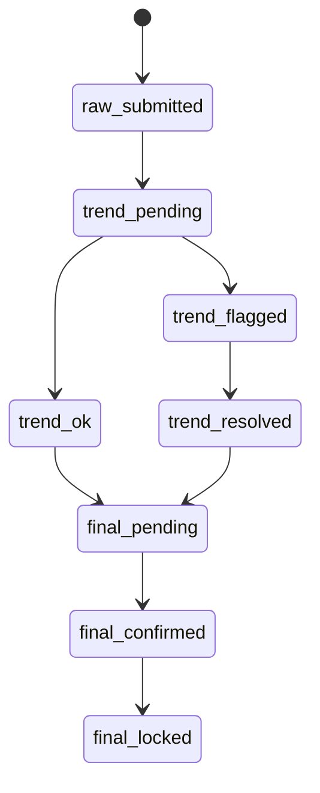
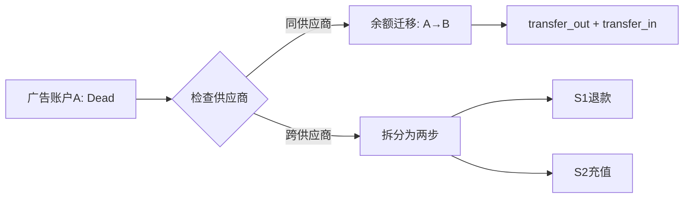

# AI_AD_SYSTEM_MASTER_SPEC v2.2 执行计划

## 📊 当前状态

- **v2.1文档**: 2271行 (完整)
- **v2.2文档**: 1056行 (已完成前言+第1-2.2章)
- **待补充**: 1215行 (第2.3章至附录E)

## 🎯 核心任务

### 任务1: 完成v2.2基础内容 (基于v2.1)
- [x] 前言 + Changelog (1-130行)
- [x] 第1章: 系统架构与原则 (131-574行)
- [x] 第2.1-2.2章: 角色权限 + 实体关系 (575-1056行)
- [ ] 第2.3章: 业务状态机摘要 (1057-897行,预计+200行新增)
- [ ] 第3章: 数据库规范 (898-1262行)
- [ ] 第4章: 安全与认证 (1263-1629行)
- [ ] 第5章: 业务规则与约束 (1630-1772行)
- [ ] 第6章: 开发工作流 (1773-1987行)
- [ ] 附录A-E (1988-2271行)

### 任务2: 注入BRD v3.1新内容

#### 2.1 粉数确认状态机 (第2.3节新增)
**位置**: 第2.3.1节 (替换原日报状态机)



**状态说明**:
- `raw_submitted`: 投手提交原始粉数
- `trend_pending`: 等待趋势风控检查
- `trend_ok`: 趋势正常
- `trend_flagged`: 趋势异常(需人工复核)
- `trend_resolved`: 异常已解决
- `final_pending`: 等待最终粉数确认
- `final_confirmed`: 最终粉数已确认
- `final_locked`: 已进入计费,锁定(不可修改)

#### 2.2 趋势风控流程 (第2.3节新增)
**位置**: 第2.3.1节补充说明

**风控规则**:
- 今日粉数 < 昨日最大值 × 0.5 → `trend_flagged`
- 今日粉数 > 昨日最大值 × 3 → `trend_flagged`
- 今日spend > 昨日 × 2 → `trend_flagged`

#### 2.3 死号迁移规则 (第2.3.4节扩展)
**位置**: 第2.3.4节 (广告账户状态机后补充)

**核心规则**:
1. ❌ **禁止跨供应商直接迁移余额**
2. ✅ **同供应商内迁移**: 生成 `transfer_out` + `transfer_in` ledger记录
3. ✅ **跨供应商迁移**: 必须拆分为:
   - Step 1: Supplier S1 退款 (`refund` entry)
   - Step 2: Supplier S2 充值 (`topup` entry)

**Mermaid流程图**:


#### 2.4 更新API路由表 (第1.4节)
**位置**: 第1.4.4节 (日报管理模块)

新增4个端点:
```
POST /api/v1/daily-reports/{id}/trend-check    # 趋势风控检查
POST /api/v1/daily-reports/{id}/final-confirm  # 最终粉数确认
POST /api/v1/daily-reports/{id}/final-lock     # 锁定进入计费
POST /api/v1/ad-accounts/{id}/balance-transfer # 死号余额迁移
```

#### 2.5 Ledger账本规范 (第3章扩展)
**位置**: 第3.2节新增3.2.5小节

**两套账本**:
- **PROJECT Ledger**: 项目收入账本
  - entry_type: `REVENUE` (粉数计费收入)
  - entry_type: `REVERSAL` (红冲)
- **SUPPLIER Ledger**: 供应商成本账本
  - entry_type: `COST` (真实消耗)
  - entry_type: `TRANSFER_OUT` (死号迁出)
  - entry_type: `TRANSFER_IN` (死号迁入)

**事务锁逻辑**:
```sql
-- 项目余额扣减事务
BEGIN;
SELECT * FROM projects WHERE id = :project_id FOR UPDATE;
INSERT INTO ledger_entries (entry_type, amount, ...) VALUES ('REVENUE', ...);
UPDATE projects SET balance = balance - :amount WHERE id = :project_id;
COMMIT;
```

#### 2.6 前端路由扩展 (第1.3节)
**位置**: 第1.3节前端路由表

新增路由:
- `/reports/[id]/trend-check` - 趋势风控检查页面
- `/reports/[id]/final-confirm` - 最终粉数确认页面
- `/accounts/[id]/balance-transfer` - 死号余额迁移页面

### 任务3: 补充Mermaid流程图

1. **粉数确认状态机** (第2.3.1节) - ✅ 已定义
2. **趋势风控流程** (第2.3.1节补充)
3. **死号迁移流程** (第2.3.4节) - ✅ 已定义
4. **计费与成本扣费流程** (第3.2.5节新增)
5. **项目余额事务锁流程** (第3.2.5节新增)

### 任务4: P0/P1/P2修复项

#### P0级修复 (已完成)
- [x] P0-1: 错误码速查表 (第1.2.2节)
- [x] P0-2: data_operator过滤逻辑 (第2.1.4节)
- [ ] P0-3: 敏感数据保护表格扩展 (第4.4节)

#### P1级修复
- [x] P1-4: 分页响应示例 (第1.2.2节)
- [x] P1-5: Service层审计日志职责 (第1.2.3节)
- [x] P1-6: 前端路由表 (第1.3节)
- [ ] P1-1: 对账批次状态机 (第2.3.5节)
- [ ] P1-2: API路由概览 (第1.4节扩展)
- [ ] P1-3: 前端UI/页面结构引用 (第1.3节扩展)

#### P2级修复
- [ ] P2-1: 术语表扩充 (附录B)
- [ ] P2-2: 类型注解统一 (全局检查)
- [ ] P2-3: bolt.new废弃原因 (附录D)
- [ ] P2-4: 测试覆盖率时效性 (第6.4.3节)
- [ ] P2-5: CHECK约束示例补充 (第3.3.4节)

## 📝 执行策略

由于内容量大(1215行待补充 + BRD v3.1新增内容),采用以下策略:

### 策略1: 分段追加法
1. 读取v2.1对应段落
2. 应用修复项和BRD v3.1对齐
3. 追加到v2.2文档末尾
4. 重复直到完成

### 策略2: 关键章节优先
1. 优先完成第2.3节(状态机,含BRD v3.1新内容)
2. 优先完成第1.4节(API路由,含新增端点)
3. 优先完成第3章(Ledger规范)
4. 其余章节按顺序补充

## 🎯 预期成果

**v2.2文档最终规模**:
- 预计总行数: 2500-2600行 (v2.1的2271行 + 新增约300行)
- 新增内容:
  - 粉数确认状态机 (约80行)
  - 趋势风控流程 (约50行)
  - 死号迁移规则 (约60行)
  - API路由更新 (约40行)
  - Ledger规范扩展 (约70行)

**文档完整性**:
- ✅ 完整的6章内容
- ✅ 完整的5个附录
- ✅ 完全对齐BRD v3.1业务逻辑
- ✅ 所有P0/P1修复项完成
- ✅ 5个Mermaid流程图

## ⏱️ 预计耗时

- 剩余内容补充: 15-20分钟
- BRD v3.1对齐注入: 10-15分钟
- 流程图绘制: 5-8分钟
- 总计: 30-45分钟

---

**执行时间**: 2025-01-21
**执行者**: Claude (Sonnet 4.5)
**当前进度**: 46% (1056/2300预计行数)
