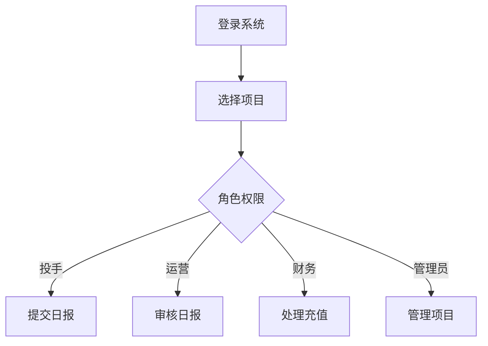

# 使用指南

## 📌 概述

本目录包含AI广告代投系统的用户使用指南，帮助各角色用户快速上手系统。

## 📂 文档结构

```
guides/
├── README.md              # 使用指南索引（本文件）
├── quick-start.md         # 快速开始
├── user-manual.md         # 用户手册
├── admin-guide.md         # 管理员指南
├── operator-guide.md      # 运营人员指南
├── finance-guide.md       # 财务人员指南
├── faq.md                # 常见问题
└── troubleshooting.md    # 问题排查
```

## 👥 用户角色

系统支持以下5种用户角色：

| 角色 | 权限范围 | 主要功能 |
|------|---------|---------|
| **超级管理员** | 系统全部功能 | 系统配置、用户管理、全局设置 |
| **管理员** | 项目和团队管理 | 项目创建、人员分配、数据审核 |
| **财务** | 财务相关操作 | 充值审批、对账管理、财务报表 |
| **运营** | 日常运营管理 | 账户管理、日报审核、数据分析 |
| **投手** | 广告投放操作 | 日报提交、充值申请、数据查看 |

## 🚀 快速开始

### 1. 首次登录
1. 访问系统地址: https://ad-system.example.com
2. 使用分配的账号密码登录
3. 首次登录需要修改密码
4. 完善个人信息

### 2. 基础操作流程


### 3. 常用功能入口
- **项目管理**: 左侧菜单 > 项目管理
- **日报管理**: 左侧菜单 > 运营管理 > 日报
- **充值申请**: 左侧菜单 > 财务管理 > 充值
- **数据分析**: 左侧菜单 > 数据中心

## 📱 功能模块介绍

### 项目管理模块
- 创建和配置广告项目
- 设置项目预算和目标
- 分配项目成员
- 监控项目进度

### 账户管理模块
- 添加广告账户
- 账户状态监控
- 账户分配和回收
- 账户性能分析

### 日报管理模块
- 提交每日投放数据
- 审核日报数据
- 查看历史日报
- 导出日报报表

### 充值管理模块
- 提交充值申请
- 审批充值请求
- 查看充值记录
- 充值统计分析

### 财务对账模块
- 导入平台账单
- 自动对账匹配
- 差异分析
- 生成对账报告

## 💡 使用技巧

### 高效操作技巧
1. **使用快捷键**
   - `Ctrl + S`: 保存
   - `Ctrl + Enter`: 提交
   - `Esc`: 取消/关闭

2. **批量操作**
   - 支持批量导入日报数据
   - 支持批量审批充值申请
   - 支持批量导出报表

3. **数据筛选**
   - 使用高级筛选快速定位数据
   - 保存常用筛选条件
   - 自定义数据视图

### 数据导入导出
```excel
导入格式示例（Excel）:
| 日期 | 账户ID | 消耗 | 线索数 | CPL |
|------|--------|------|--------|-----|
| 2024-11-18 | ACC001 | 1000 | 50 | 20 |
| 2024-11-18 | ACC002 | 1500 | 60 | 25 |
```

## 📊 报表使用

### 可用报表类型
1. **运营报表**
   - 日报汇总表
   - 账户表现报表
   - ROI分析报表

2. **财务报表**
   - 充值汇总表
   - 对账差异表
   - 成本分析表

3. **管理报表**
   - 项目进度表
   - 团队绩效表
   - 预算执行表

### 报表订阅
- 设置定时发送
- 选择接收邮箱
- 自定义报表内容

## 🔔 通知设置

### 通知类型
- **系统通知**: 系统更新、维护通知
- **业务通知**: 审批提醒、数据异常
- **报表通知**: 定时报表、数据汇总

### 通知方式
- 站内消息
- 邮件通知
- 短信提醒（重要事项）
- 钉钉/企业微信集成

## ❓ 常见问题

### 登录问题
**Q: 忘记密码怎么办？**
A: 点击登录页"忘记密码"，通过邮箱重置密码。

**Q: 账号被锁定？**
A: 连续5次密码错误会锁定30分钟，或联系管理员解锁。

### 数据问题
**Q: 日报数据提交错误如何修改？**
A: 在审核通过前可以撤回修改，审核后需要管理员处理。

**Q: 数据导入失败？**
A: 检查Excel格式是否正确，确保必填字段完整。

### 权限问题
**Q: 无法访问某些功能？**
A: 检查角色权限，必要时联系管理员调整权限。

## 🛠️ 问题排查

### 页面加载慢
1. 检查网络连接
2. 清除浏览器缓存
3. 使用Chrome/Firefox最新版本
4. 联系技术支持

### 数据不同步
1. 刷新页面
2. 检查筛选条件
3. 确认时区设置
4. 查看系统公告

### 导出失败
1. 检查数据量（单次最多10000条）
2. 选择合适的时间范围
3. 尝试分批导出
4. 使用其他格式（CSV/Excel）

## 📚 学习资源

### 视频教程
- [系统介绍](https://video.example.com/intro)
- [基础操作](https://video.example.com/basic)
- [高级功能](https://video.example.com/advanced)

### 操作手册
- [完整用户手册](./user-manual.md)
- [角色操作指南](./role-guides/)
- [功能说明文档](./features/)

### 在线帮助
- 系统内帮助中心
- 在线客服支持
- 工单系统

## 📞 获取支持

### 技术支持
- **邮箱**: support@ai-ad-spend.com
- **电话**: 400-XXX-XXXX
- **工作时间**: 周一至周五 9:00-18:00

### 紧急联系
- **紧急热线**: 186-XXXX-XXXX（7×24小时）
- **值班邮箱**: emergency@ai-ad-spend.com

### 反馈建议
- **产品建议**: product@ai-ad-spend.com
- **Bug报告**: 系统内反馈功能
- **功能需求**: 提交工单

## 🔄 更新日志

### v3.0 (2024-11-18)
- ✨ 新增AI智能推荐功能
- 🔧 优化日报提交流程
- 🐛 修复数据导出问题
- 📊 增强报表功能

### v2.1 (2024-10-15)
- ✨ 新增批量操作功能
- 🔧 改进用户界面
- 🐛 修复已知问题

---

*最后更新: 2024-11-18*
*版本: v3.0*