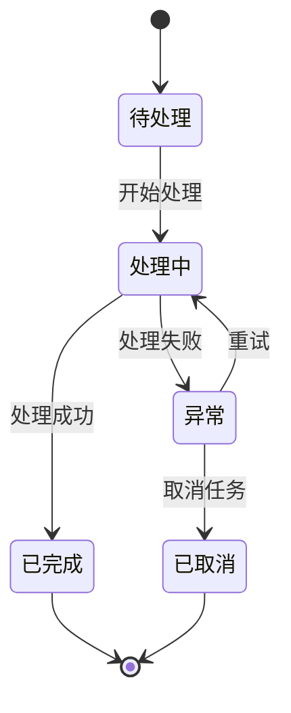
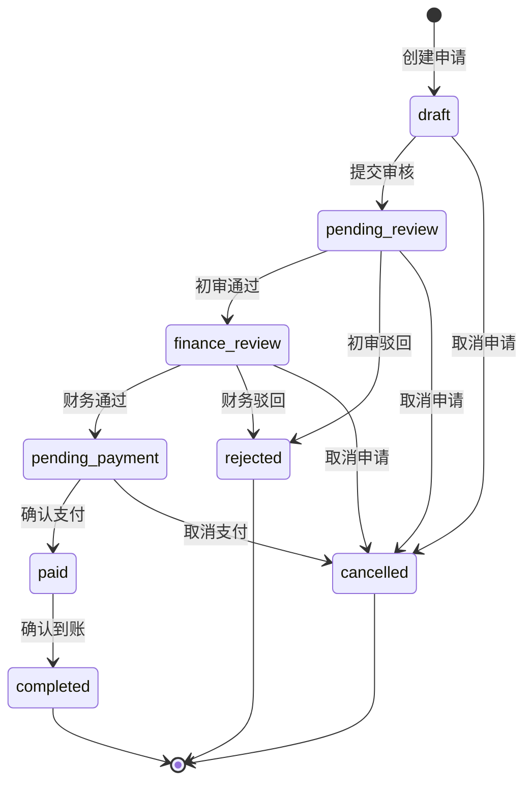
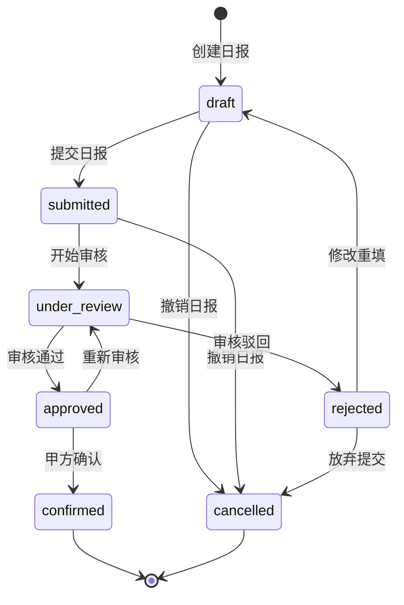
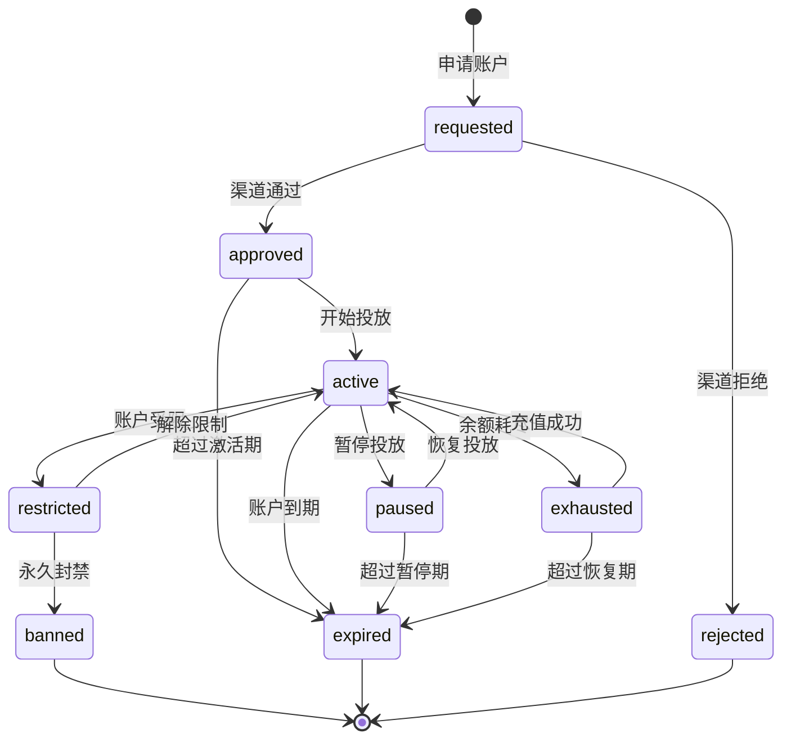
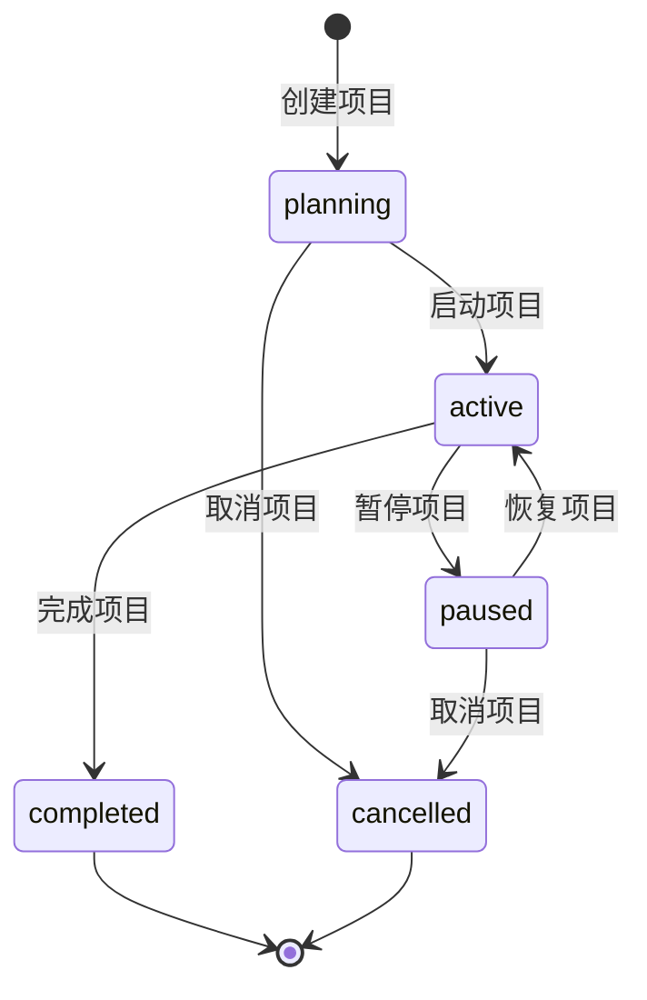
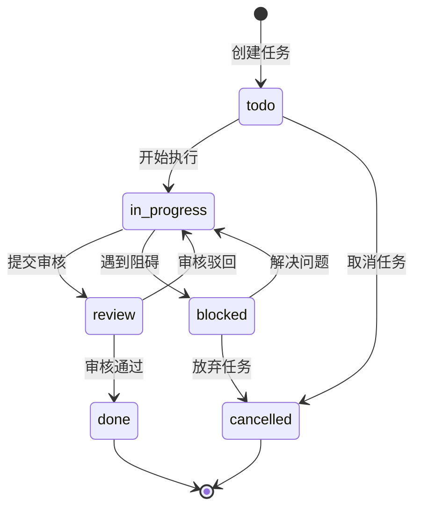

# AI广告代投系统 - 状态机规范

> **版本**: v1.0
> **创建日期**: 2025-11-11
> **适用范围**: 所有开发人员和产品经理
> **更新频率**: 业务变更时更新

---

## 📋 目录

1. [状态机概述](#-状态机概述)
2. [充值流程状态机](#-充值流程状态机)
3. [日报审核状态机](#-日报审核状态机)
4. [广告账户生命周期状态机](#-广告账户生命周期状态机)
5. [项目生命周期状态机](#-项目生命周期状态机)
6. [用户任务状态机](#-用户任务状态机)
7. [状态机实现规范](#-状态机实现规范)
8. [状态转换日志](#-状态转换日志)

---

## 🎯 状态机概述

### 状态机设计原则

1. **状态明确性**: 每个状态都有明确的业务含义
2. **转换合法性**: 状态转换必须遵循业务规则
3. **可追溯性**: 所有状态转换都有完整的审计日志
4. **异常处理**: 异常情况下的状态回滚机制
5. **权限控制**: 状态转换需要相应的权限验证

### 状态机图例



### 通用状态定义

| 状态 | 说明 | 是否终态 |
|------|------|----------|
| **draft** | 草稿状态，初始创建 | ❌ |
| **pending** | 待处理，等待审核 | ❌ |
| **processing** | 处理中，正在执行 | ❌ |
| **completed** | 已完成，流程结束 | ✅ |
| **rejected** | 已拒绝，审核未通过 | ✅ |
| **cancelled** | 已取消，主动终止 | ✅ |
| **failed** | 失败，执行异常 | ✅ |

---

## 💰 充值流程状态机

### 状态定义

| 状态 | 说明 | 触发条件 | 操作权限 |
|------|------|----------|----------|
| **draft** | 草稿 | 投手创建充值申请 | media_buyer |
| **pending_review** | 待初审 | 提交审核 | media_buyer |
| **finance_review** | 财务审核 | 数据员初审通过 | data_clerk |
| **pending_payment** | 待支付 | 财务审核通过 | finance |
| **paid** | 已支付 | 财务确认打款 | finance |
| **completed** | 已完成 | 确认到账，更新余额 | system |
| **rejected** | 已拒绝 | 任何审核环节驳回 | data_clerk/finance |
| **cancelled** | 已取消 | 投手主动取消 | media_buyer |

### 状态转换图



### 转换规则说明

1. **draft → pending_review**
   - 触发: 投手提交充值申请
   - 验证: 必填字段完整，金额合法
   - 通知: 数据员收到审核通知

2. **pending_review → finance_review**
   - 触发: 数据员初审通过
   - 验证: 账户状态正常，余额充足
   - 通知: 财务收到审核通知

3. **finance_review → pending_payment**
   - 触发: 财务审核通过
   - 验证: 财务信息完整，额度符合
   - 通知: 投手收到审核通过通知

4. **pending_payment → paid**
   - 触发: 财务确认支付
   - 验证: 支付信息确认
   - 通知: 渠道商收到付款通知

5. **paid → completed**
   - 触发: 系统确认到账
   - 验证: 到账金额匹配
   - 操作: 自动更新账户余额

### 数据库实现

```sql
-- 充值申请状态枚举
CREATE TYPE topup_status AS ENUM (
    'draft',
    'pending_review',
    'finance_review',
    'pending_payment',
    'paid',
    'completed',
    'rejected',
    'cancelled'
);

-- 状态转换验证函数
CREATE OR REPLACE FUNCTION can_transition_topup(
    current_status topup_status,
    new_status topup_status,
    user_role TEXT
) RETURNS BOOLEAN AS $$
BEGIN
    -- 投手权限
    IF user_role = 'media_buyer' THEN
        RETURN (
            (current_status = 'draft' AND new_status = 'pending_review') OR
            (current_status IN ('draft', 'pending_review') AND new_status = 'cancelled')
        );
    END IF;

    -- 数据员权限
    IF user_role = 'data_clerk' THEN
        RETURN (
            (current_status = 'pending_review' AND new_status = 'finance_review') OR
            (current_status = 'pending_review' AND new_status = 'rejected')
        );
    END IF;

    -- 财务权限
    IF user_role = 'finance' THEN
        RETURN (
            (current_status = 'finance_review' AND new_status = 'pending_payment') OR
            (current_status = 'finance_review' AND new_status = 'rejected') OR
            (current_status = 'pending_payment' AND new_status = 'paid')
        );
    END IF;

    -- 系统自动转换
    IF user_role = 'system' THEN
        RETURN (current_status = 'paid' AND new_status = 'completed');
    END IF;

    RETURN FALSE;
END;
$$ LANGUAGE plpgsql;
```

---

## 📊 日报审核状态机

### 状态定义

| 状态 | 说明 | 触发条件 | 操作权限 |
|------|------|----------|----------|
| **draft** | 草稿 | 投手填写日报 | media_buyer |
| **submitted** | 已提交 | 提交审核 | media_buyer |
| **under_review** | 审核中 | 数据员开始审核 | data_clerk |
| **approved** | 已通过 | 审核通过 | data_clerk |
| **rejected** | 已驳回 | 审核未通过 | data_clerk |
| **confirmed** | 已确认 | 甲方确认数据 | manager |
| **cancelled** | 已取消 | 撤销日报 | media_buyer |

### 状态转换图



### 业务规则

1. **提交时限**: 日报必须在次日上午10点前提交
2. **审核时限**: 数据员必须在2小时内完成审核
3. **修改规则**: 驳回的日报只能修改3次，超过后需主管介入
4. **确认规则**: 甲方确认后数据锁定，不可修改

### 实现示例

```python
# 日报状态机实现
from enum import Enum
from typing import Dict, List

class DailyReportStatus(str, Enum):
    DRAFT = "draft"
    SUBMITTED = "submitted"
    UNDER_REVIEW = "under_review"
    APPROVED = "approved"
    REJECTED = "rejected"
    CONFIRMED = "confirmed"
    CANCELLED = "cancelled"

class DailyReportStateMachine:
    def __init__(self):
        # 定义状态转换规则
        self.transitions: Dict[DailyReportStatus, List[DailyReportStatus]] = {
            DailyReportStatus.DRAFT: [
                DailyReportStatus.SUBMITTED,
                DailyReportStatus.CANCELLED
            ],
            DailyReportStatus.SUBMITTED: [
                DailyReportStatus.UNDER_REVIEW,
                DailyReportStatus.CANCELLED
            ],
            DailyReportStatus.UNDER_REVIEW: [
                DailyReportStatus.APPROVED,
                DailyReportStatus.REJECTED
            ],
            DailyReportStatus.APPROVED: [
                DailyReportStatus.CONFIRMED,
                DailyReportStatus.UNDER_REVIEW  # 重新审核
            ],
            DailyReportStatus.REJECTED: [
                DailyReportStatus.DRAFT,
                DailyReportStatus.CANCELLED
            ]
        }

    def can_transition(self, from_status: DailyReportStatus,
                      to_status: DailyReportStatus) -> bool:
        """检查是否可以进行状态转换"""
        return to_status in self.transitions.get(from_status, [])

    def get_next_actions(self, status: DailyReportStatus) -> List[str]:
        """获取当前状态可执行的操作"""
        actions = {
            DailyReportStatus.DRAFT: ["提交", "取消"],
            DailyReportStatus.SUBMITTED: ["审核", "撤回"],
            DailyReportStatus.UNDER_REVIEW: ["通过", "驳回"],
            DailyReportStatus.APPROVED: ["确认", "重新审核"],
            DailyReportStatus.REJECTED: ["修改", "放弃"],
            DailyReportStatus.CONFIRMED: [],
            DailyReportStatus.CANCELLED: []
        }
        return actions.get(status, [])
```

---

## 📱 广告账户生命周期状态机

### 状态定义

| 状态 | 说明 | 触发条件 | 操作权限 |
|------|------|----------|----------|
| **requested** | 已申请 | 申请渠道账户 | data_clerk |
| **approved** | 已通过 | 渠道审核通过 | system |
| **active** | 投放中 | 账户正常投放 | media_buyer |
| **paused** | 已暂停 | 暂停投放 | media_buyer/data_clerk |
| **restricted** | 受限制 | 账户受限 | system |
| **banned** | 已封禁 | 账户封禁 | system |
| **exhausted** | 已耗尽 | 余额耗尽 | system |
| **expired** | 已过期 | 账户到期 | system |

### 状态转换图



### 自动状态转换

1. **余额监控**: 每小时检查账户余额，余额不足时自动预警
2. **到期提醒**: 账户到期前3天、1天自动提醒
3. **异常检测**: 检测到异常消耗时自动限制账户
4. **寿命预测**: AI模型预测账户寿命，提前预警

### 监控指标

```python
# 账户健康度评分模型
def calculate_account_health_score(account):
    """计算账户健康度分数 (0-100)"""
    score = 100

    # 余额因子 (30%)
    if account.remaining_budget < account.daily_budget * 3:
        score -= 30
    elif account.remaining_budget < account.daily_budget * 7:
        score -= 15

    # 消耗稳定性 (25%)
    consumption_volatility = calculate_volatility(account.daily_consumptions)
    if consumption_volatility > 0.5:
        score -= 25
    elif consumption_volatility > 0.3:
        score -= 10

    # 账户年龄 (20%)
    age_days = (datetime.now() - account.created_at).days
    if age_days < 7:
        score -= 20
    elif age_days < 30:
        score -= 10

    # 历史表现 (15%)
    if account.conversion_rate < 0.01:
        score -= 15
    elif account.conversion_rate < 0.02:
        score -= 5

    # 近期异常 (10%)
    recent_anomalies = count_recent_anomalies(account)
    score -= min(recent_anomalies * 5, 10)

    return max(0, score)
```

---

## 🏗️ 项目生命周期状态机

### 状态定义

| 状态 | 说明 | 触发条件 | 操作权限 |
|------|------|----------|----------|
| **planning** | 规划中 | 项目创建 | manager |
| **active** | 进行中 | 项目启动 | manager |
| **paused** | 已暂停 | 暂停项目 | manager |
| **completed** | 已完成 | 项目结束 | manager |
| **cancelled** | 已取消 | 项目终止 | admin |

### 状态转换图



### 状态转换条件

1. **planning → active**
   - 所有必填信息完整
   - 至少分配了一个项目经理
   - 已申请到渠道账户

2. **active → paused**
   - 所有账户暂停投放
   - 未完成的充值申请处理完毕
   - 通知所有相关成员

3. **paused → active**
   - 至少有一个可用账户
   - 项目经理确认恢复

4. **active → completed**
   - 所有账户已结束
   - 财务对账完成
   - 项目总结报告生成

---

## ✅ 用户任务状态机

### 状态定义

| 状态 | 说明 | 触发条件 | 操作权限 |
|------|------|----------|----------|
| **todo** | 待办 | 任务创建 | system/manager |
| **in_progress** | 进行中 | 开始执行 | assignee |
| **review**待审核 | 完成待审核 | 提交审核 | assignee |
| **done** | 已完成 | 审核通过 | reviewer |
| **blocked** | 被阻塞 | 遇到阻碍 | assignee |
| **cancelled** | 已取消 | 取消任务 | manager |

### 状态转换图



---

## 🔧 状态机实现规范

### 1. 数据库设计

```sql
-- 通用状态机表
CREATE TABLE state_machines (
    id UUID PRIMARY KEY DEFAULT gen_random_uuid(),
    entity_type VARCHAR(50) NOT NULL,  -- 实体类型
    entity_id UUID NOT NULL,          -- 实体ID
    current_state VARCHAR(50) NOT NULL, -- 当前状态
    previous_state VARCHAR(50),        -- 前一状态
    created_at TIMESTAMP WITH TIME ZONE DEFAULT NOW(),
    updated_at TIMESTAMP WITH TIME ZONE DEFAULT NOW(),

    UNIQUE(entity_type, entity_id)
);

-- 状态转换历史
CREATE TABLE state_transitions (
    id UUID PRIMARY KEY DEFAULT gen_random_uuid(),
    entity_type VARCHAR(50) NOT NULL,
    entity_id UUID NOT NULL,
    from_state VARCHAR(50) NOT NULL,
    to_state VARCHAR(50) NOT NULL,
    transition_reason TEXT,
    transitioned_by UUID REFERENCES users(id),
    transitioned_at TIMESTAMP WITH TIME ZONE DEFAULT NOW(),
    metadata JSONB DEFAULT '{}'::jsonb
);

-- 索引
CREATE INDEX idx_state_machines_entity ON state_machines(entity_type, entity_id);
CREATE INDEX idx_state_transitions_entity ON state_transitions(entity_type, entity_id);
CREATE INDEX idx_state_transitions_time ON state_transitions(transitioned_at DESC);
```

### 2. 后端实现

```python
from abc import ABC, abstractmethod
from typing import TypeVar, Generic, Dict, Any
from enum import Enum
import logging

StateType = TypeVar('StateType', bound=Enum)

class BaseStateMachine(Generic[StateType], ABC):
    """状态机基类"""

    def __init__(self, initial_state: StateType):
        self._current_state = initial_state
        self._state_history: List[StateType] = [initial_state]
        self._logger = logging.getLogger(self.__class__.__name__)

    @property
    def current_state(self) -> StateType:
        return self._current_state

    @property
    def state_history(self) -> List[StateType]:
        return self._state_history.copy()

    @abstractmethod
    def get_valid_transitions(self, state: StateType) -> List[StateType]:
        """获取当前状态的有效转换列表"""
        pass

    @abstractmethod
    def can_transition(self, from_state: StateType, to_state: StateType,
                      context: Dict[str, Any] = None) -> bool:
        """检查是否可以进行状态转换"""
        pass

    def transition(self, to_state: StateType, context: Dict[str, Any] = None,
                  reason: str = None) -> bool:
        """执行状态转换"""
        if not self.can_transition(self._current_state, to_state, context):
            self._logger.warning(
                f"Invalid transition from {self._current_state} to {to_state}"
            )
            return False

        # 记录状态转换
        self._logger.info(
            f"Transitioning from {self._current_state} to {to_state}"
        )

        # 更新状态
        self._current_state = to_state
        self._state_history.append(to_state)

        # 触发后置处理
        self.on_transition_completed(self._current_state, to_state, context)

        return True

    def on_transition_completed(self, from_state: StateType,
                              to_state: StateType,
                              context: Dict[str, Any] = None):
        """状态转换完成后的回调"""
        pass

# 状态转换装饰器
def transition_required(from_state: StateType, to_state: StateType):
    """状态转换权限装饰器"""
    def decorator(func):
        def wrapper(self, *args, **kwargs):
            if not self.state_machine.can_transition(
                self.state_machine.current_state,
                from_state
            ):
                raise PermissionError(
                    f"Cannot perform action from current state: "
                    f"{self.state_machine.current_state}"
                )

            result = func(self, *args, **kwargs)

            # 执行状态转换
            self.state_machine.transition(to_state, {
                'action': func.__name__,
                'user': self.current_user
            })

            return result
        return wrapper
    return decorator
```

### 3. 前端实现

```typescript
// React状态机Hook
import { useState, useCallback } from 'react';
import { StateMachine } from '../types/stateMachine';

function useStateMachine<T extends string>(
  machine: StateMachine<T>,
  initialState: T
) {
  const [currentState, setCurrentState] = useState<T>(initialState);
  const [history, setHistory] = useState<T[]>([initialState]);

  const transition = useCallback((
    newState: T,
    context?: any
  ): boolean => {
    if (!machine.canTransition(currentState, newState)) {
      console.warn(
        `Invalid transition from ${currentState} to ${newState}`
      );
      return false;
    }

    setCurrentState(newState);
    setHistory(prev => [...prev, newState]);

    // 记录转换日志
    machine.logTransition({
      from: currentState,
      to: newState,
      context,
      timestamp: new Date()
    });

    return true;
  }, [currentState, machine]);

  const getValidTransitions = useCallback(() => {
    return machine.getValidTransitions(currentState);
  }, [currentState, machine]);

  const canTransition = useCallback((state: T) => {
    return machine.canTransition(currentState, state);
  }, [currentState, machine]);

  return {
    currentState,
    history,
    transition,
    getValidTransitions,
    canTransition
  };
}

// 使用示例
const DailyReportStateMachine: StateMachine<DailyReportStatus> = {
  states: {
    draft: ['submitted', 'cancelled'],
    submitted: ['under_review', 'cancelled'],
    under_review: ['approved', 'rejected'],
    approved: ['confirmed', 'under_review'],
    rejected: ['draft', 'cancelled'],
    confirmed: [],
    cancelled: []
  },

  canTransition(from, to) {
    return this.states[from]?.includes(to) ?? false;
  },

  getValidTransitions(state) {
    return this.states[state] ?? [];
  },

  logTransition(transition) {
    // 发送到后端记录
    api.logStateTransition(transition);
  }
};
```

---

## 📝 状态转换日志

### 日志格式

```typescript
interface StateTransitionLog {
  id: string;
  entityType: string;  // 实体类型：topup, daily_report, ad_account等
  entityId: string;    // 实体ID
  fromState: string;   // 原状态
  toState: string;     // 新状态
  transitionReason?: string;  // 转换原因
  transitionedBy: {    // 操作人
    id: string;
    name: string;
    role: string;
  };
  transitionedAt: Date;  // 转换时间
  metadata: {         // 额外信息
    ipAddress?: string;
    userAgent?: string;
    [key: string]: any;
  };
}
```

### 审计查询

```sql
-- 查询实体的状态转换历史
SELECT
    st.*,
    u.name as user_name,
    u.email as user_email
FROM state_transitions st
LEFT JOIN users u ON st.transitioned_by = u.id
WHERE st.entity_type = $1
  AND st.entity_id = $2
ORDER BY st.transitioned_at DESC;

-- 查询用户操作记录
SELECT
    st.entity_type,
    st.entity_id,
    st.from_state,
    st.to_state,
    st.transitioned_at
FROM state_transitions st
WHERE st.transitioned_by = $1
  AND st.transitioned_at >= $2
ORDER BY st.transitioned_at DESC;
```

---

## 📚 相关文档

- [系统概述](./SYSTEM_OVERVIEW.md)
- [数据库设计](./DATA_SCHEMA.md)
- [API开发指南](./BACKEND_API_GUIDE.md)
- [开发规范](./DEVELOPMENT_STANDARDS.md)

---

## 📝 更新记录

### 2025-11-11
- 初始版本创建
- 定义了5个核心状态机
- 实现了状态机基类和装饰器
- 添加了React Hook示例

---

**文档版本**: v1.0
**创建日期**: 2025-11-11
**维护人**: 系统架构师
**审核人**: 技术负责人