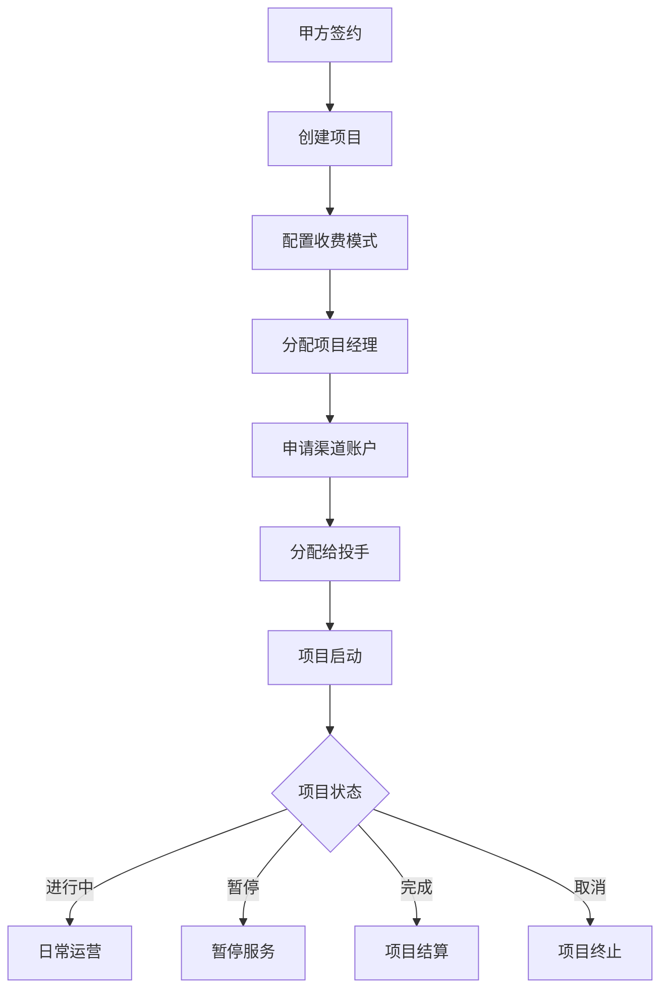
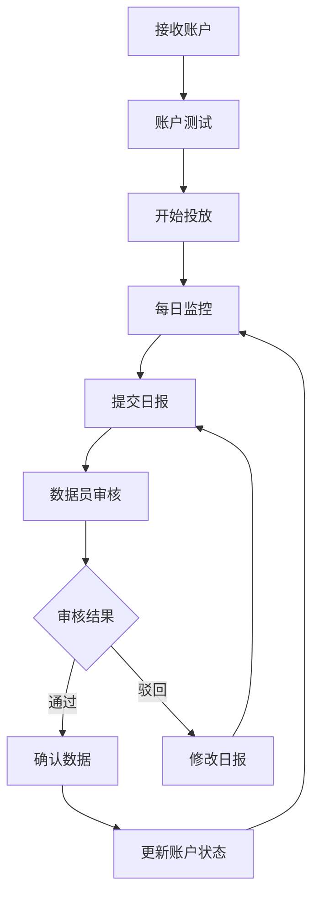
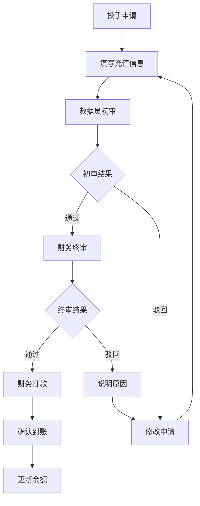
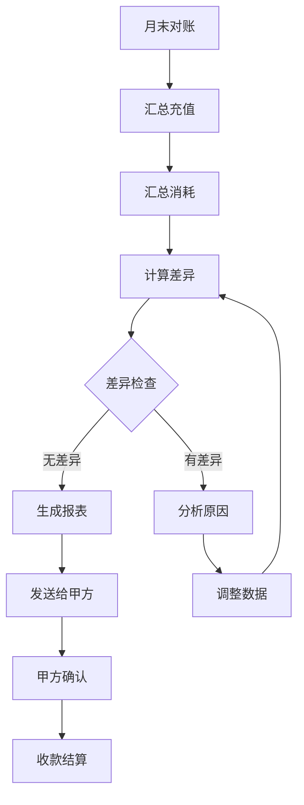
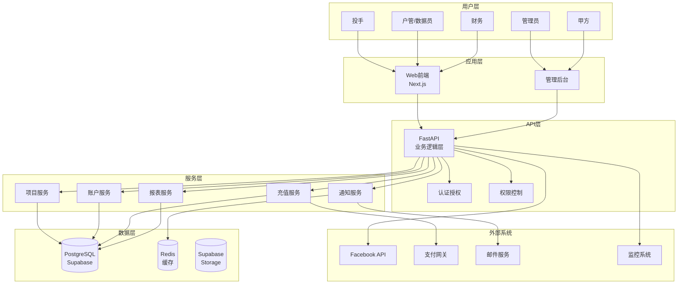
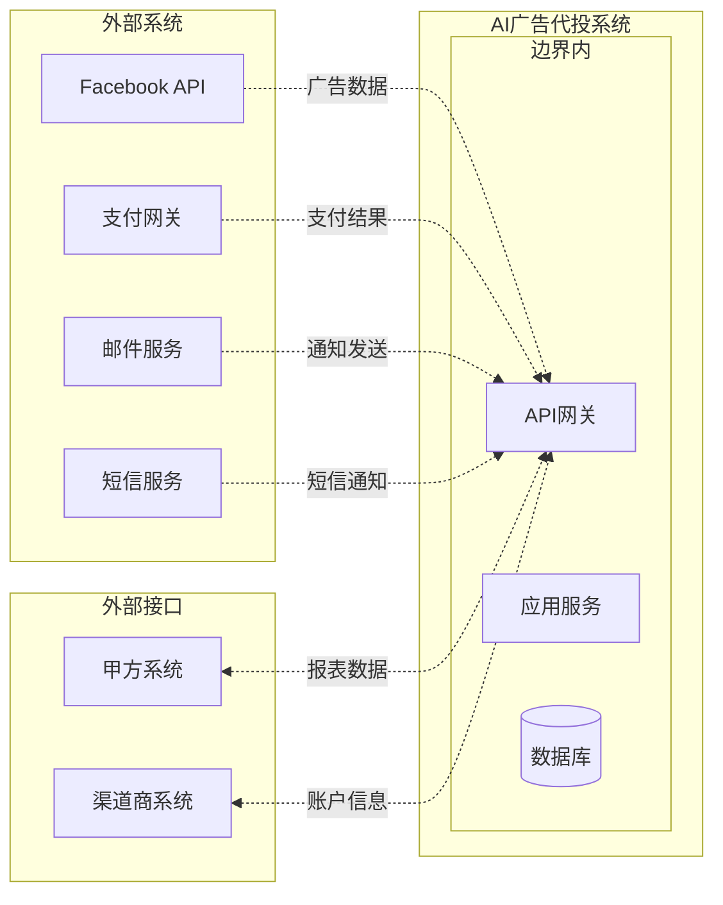

# 系统概述 - AI广告代投系统

> **文档目的**: 提供系统整体架构和业务模式的概览
> **目标读者**: 所有项目成员（产品、开发、测试、运维）
> **更新日期**: 2025-11-11

---

## 📋 目录

1. [系统简介](#-系统简介)
2. [业务模式](#-业务模式)
3. [核心业务流程](#-核心业务流程)
4. [系统架构](#-系统架构)
5. [用户角色与权限](#-用户角色与权限)
6. [技术架构](#-技术架构)
7. [系统边界与集成](#-系统边界与集成)
8. [非功能性需求](#-非功能性需求)

---

## 🎯 系统简介

### 项目背景
AI广告代投系统是一个专为Facebook广告代理商设计的智能化管理平台，旨在解决广告代投业务中的核心痛点：
- **效率低下**: 手动处理日报和充值申请耗时耗力
- **财务风险**: 缺乏精确的对账系统，容易造成资金损失
- **管理困难**: 多项目、多账户管理复杂，缺乏统一视图
- **决策困难**: 缺乏数据分析支持，难以优化投放策略

### 核心价值
- **效率提升**: 自动化日报处理，节省90%人工时间
- **成本控制**: 精准的对账系统，避免财务损失
- **智能决策**: AI驱动的账户寿命预测和异常检测
- **风险管控**: 实时监控和预警，及时发现问题

### 系统目标
1. **全流程数字化**: 从项目创建到财务对账的完整数字化
2. **自动化处理**: 减少人工干预，提高处理效率
3. **数据驱动**: 基于数据分析进行决策优化
4. **风险可控**: 实时监控，及时发现和处理问题

---

## 💼 业务模式

### 业务主链
```
甲方签约付款 → 创建项目 → 申请渠道账户 → 分配账户给投手
      ↓
投手投放广告 → 每日提交日报 → 数据员审核 → 确认粉数
      ↓
提交充值申请 → 数据员审核需求 → 财务审批 → 财务打款
      ↓
代理商充值 → 月底财务对账 → 项目盈利分析 → AI优化建议
```

### 收费模式
1. **按线索收费** (per_lead)
   - 甲方按实际获得的线索数量付费
   - 系统自动计算费用和对账

2. **固定费用** (fixed_fee)
   - 固定的月度服务费
   - 适合大型稳定项目

3. **混合模式** (hybrid)
   - 基础服务费 + 按线索收费
   - 灵活的定价策略

### 渠道合作
- **渠道商**: 提供广告账户资源
- **服务费率**: 通常为充值金额的8-15%
- **开户费用**: 一次性账户开户费
- **最低充值**: 各渠道有不同的最低充值要求

### 成本结构
```
收入:
├── 项目启动费 (一次性收取)
└── 按潜在客户计费 (主要收入来源)
    └── 单粉价格 × 甲方确认粉数

成本:
├── 广告费消耗 (主要成本)
├── 充值手续费 (5%-20%)
├── 开户费
├── Facebook账号成本
├── 公共主页费用
├── 服务器费用
└── 投手工资
```

---

## 🔄 核心业务流程

### 1. 项目管理流程



### 2. 广告投放流程



### 3. 充值审批流程



### 4. 财务对账流程



---

## 🏗️ 系统架构

### 整体架构图



### 分层架构说明

#### 1. 用户层
- **投手**: 日常投放操作，提交日报，申请充值
- **户管/数据员**: 账户管理，审核日报，初审充值
- **财务**: 充值审批，财务对账，报表分析
- **管理员**: 系统配置，用户管理，全局监控
- **甲方**: 查看报表，确认数据

#### 2. 应用层
- **Web前端**: Next.js 15 + TypeScript，提供用户界面
- **管理后台**: 独立的管理界面，系统配置功能

#### 3. API层
- **FastAPI**: RESTful API，处理业务逻辑
- **认证授权**: JWT + Supabase Auth
- **权限控制**: 基于角色的访问控制（RBAC）

#### 4. 服务层
- **项目服务**: 项目生命周期管理
- **账户服务**: 广告账户管理
- **充值服务**: 充值流程管理
- **报表服务**: 数据统计和分析
- **通知服务**: 系统通知和预警

#### 5. 数据层
- **PostgreSQL**: 主数据库，Supabase托管
- **Redis**: 缓存层，提高性能
- **Supabase Storage**: 文件存储

---

## 👥 用户角色与权限

### 角色定义

| 角色 | 职责 | 主要权限 |
|------|------|----------|
| **admin** | 系统管理员 | 全部权限 |
| **manager** | 项目经理 | 项目管理，团队管理 |
| **data_clerk** | 户管/数据员 | 账户管理，数据审核 |
| **finance** | 财务 | 充值审批，财务对账 |
| **media_buyer** | 投手 | 账户投放，日报提交 |

### 权限矩阵

| 功能模块 | admin | manager | data_clerk | finance | media_buyer |
|----------|-------|---------|------------|---------|-------------|
| **用户管理** | ✅ | ✅ | ❌ | ❌ | ❌ |
| **项目管理** | ✅ | ✅ | 👁 | 👁 | ❌ |
| **渠道管理** | ✅ | 👁 | ✅ | ❌ | ❌ |
| **账户管理** | ✅ | ✅ | ✅ | 👁 | 👁 |
| **日报管理** | ✅ | 👁 | ✅ | 👁 | ✅ |
| **充值管理** | ✅ | 👁 | ✅ | ✅ | ✅ |
| **财务对账** | ✅ | 👁 | ❌ | ✅ | ❌ |
| **报表查看** | ✅ | ✅ | ✅ | ✅ | 👁 |

**图例**: ✅ 完全权限 | 👁 只读权限 | ❌ 无权限

### 数据访问规则

1. **投手 (media_buyer)**
   - 只能访问分配给自己的项目和账户
   - 可以提交自己负责的日报和充值申请
   - 可以查看自己账户的数据报表

2. **户管/数据员 (data_clerk)**
   - 可以访问所有项目和账户
   - 负责审核日报和初审充值申请
   - 管理账户状态和分配

3. **财务 (finance)**
   - 可以查看所有财务相关数据
   - 负责充值终审和对账
   - 生成财务报表

4. **项目经理 (manager)**
   - 管理自己负责的项目
   - 查看项目所有数据和报表
   - 管理团队成员

5. **管理员 (admin)**
   - 系统全权限
   - 用户管理
   - 系统配置

---

## 💻 技术架构

### 技术栈选择

#### 前端技术栈
- **框架**: Next.js 15
  - 原因: 最新的React框架，支持SSR/SSG，SEO友好
  - 来源: [Context7查询 - Next.js](./docs/context7-queries.md)
- **语言**: TypeScript
  - 原因: 类型安全，提高代码质量
- **UI库**: shadcn/ui + Radix UI
  - 原因: 现代化设计，可定制性强
- **样式**: Tailwind CSS
  - 原因: 原子化CSS，开发效率高
- **状态管理**: React Query + SWR
  - 原因: 轻量级，与Next.js集成好

#### 后端技术栈
- **框架**: FastAPI
  - 原因: 高性能，自动API文档，类型提示
  - 来源: [Context7查询 - FastAPI](./docs/context7-queries.md)
- **语言**: Python 3.11
  - 原因: 最新稳定版本，性能优秀
- **ORM**: SQLAlchemy
  - 原因: 成熟稳定，功能完善
- **数据验证**: Pydantic v2
  - 原因: 与FastAPI深度集成

#### 数据库技术栈
- **主数据库**: PostgreSQL
  - 原因: 功能强大，支持JSONB，RLS
- **托管服务**: Supabase
  - 原因: 提供BaaS服务，简化开发
  - 来源: [Context7查询 - Supabase](./docs/context7-queries.md)
- **缓存**: Redis
  - 原因: 高性能，支持多种数据结构

#### 部署技术栈
- **容器化**: Docker
  - 原因: 环境一致性，易于部署
- **反向代理**: Nginx
  - 原因: 高性能，功能丰富
- **服务器**: 宝塔面板
  - 原因: 易于管理，适合国内环境

### 架构原则

1. **微服务架构准备**
   - 模块化设计，低耦合高内聚
   - 服务间通过API通信
   - 数据库独立设计

2. **API优先**
   - 所有功能通过API暴露
   - 统一的API设计规范
   - 完整的API文档

3. **安全第一**
   - 行级安全策略（RLS）
   - 最小权限原则
   - 审计日志完整

4. **可扩展性**
   - 水平扩展设计
   - 分库分表准备
   - 缓存策略完善

5. **监控驱动**
   - 全链路监控
   - 性能指标收集
   - 自动化告警

---

## 🔗 系统边界与集成

### 系统边界



### 集成点说明

#### 1. Facebook API集成
- **目的**: 获取广告账户数据和投放效果
- **数据**:
  - 账户信息
  - 广告数据
  - 消耗数据
- **方式**: Facebook Marketing API
- **频率**: 每日同步

#### 2. 支付网关集成
- **目的**: 处理充值支付
- **功能**:
  - 支付请求
  - 支付回调
  - 退款处理
- **方式**: RESTful API
- **安全**: HTTPS + 签名验证

#### 3. 邮件服务集成
- **目的**: 发送系统通知
- **场景**:
  - 注册确认
  - 密码重置
  - 审批通知
  - 异常告警
- **方式**: SMTP API

#### 4. 甲方系统对接
- **目的**: 数据共享和报表推送
- **内容**:
  - 日报数据
  - 月度报表
  - 对账单
- **方式**: API接口 + 定时推送

### 数据流设计

1. **数据输入**
   - 手动输入：日报、充值申请
   - API同步：Facebook数据
   - 文件导入：批量数据

2. **数据处理**
   - 实时处理：认证、权限验证
   - 批处理：报表生成、对账计算
   - 定时任务：数据同步、状态更新

3. **数据输出**
   - API接口：供外部系统调用
   - 报表导出：Excel/PDF格式
   - 实时推送：WebSocket通知

---

## ⚡ 非功能性需求

### 1. 性能需求

| 指标 | 要求 | 说明 |
|------|------|------|
| **响应时间** | < 500ms | API响应时间（95%请求） |
| **页面加载** | < 3s | 首屏加载时间 |
| **并发用户** | 100+ | 同时在线用户数 |
| **数据处理** | 10万条/日 | 日报数据处理能力 |

#### 性能优化策略
- **前端**: 代码分割、懒加载、CDN加速
- **后端**: 数据库优化、Redis缓存、异步处理
- **数据库**: 索引优化、分区表、读写分离准备

### 2. 可用性需求

| 指标 | 要求 | 说明 |
|------|------|------|
| **系统可用性** | 99.9% | 年度可用性目标 |
| **故障恢复** | < 30分钟 | RTO（恢复时间目标） |
| **数据恢复** | < 1小时 | RPO（恢复点目标） |

#### 高可用设计
- **应用层**: 多实例部署，负载均衡
- **数据库**: 主从复制，自动故障转移
- **缓存**: Redis集群
- **监控**: 实时监控，自动告警

### 3. 安全性需求

#### 认证与授权
- **认证方式**: JWT + Refresh Token
- **密码策略**: 8位以上，包含大小写字母和数字
- **会话管理**: 自动过期，可强制下线
- **多因子认证**: 可选增强安全

#### 数据安全
- **传输加密**: HTTPS/TLS 1.3
- **存储加密**: 敏感数据加密存储
- **访问控制**: 基于角色的访问控制（RBAC）
- **审计日志**: 完整的操作审计

#### 防护措施
- **防注入**: SQL注入防护
- **防XSS**: 输入输出过滤
- **防CSRF**: Token验证
- **防爬虫**: 频率限制

### 4. 可扩展性需求

#### 用户规模
- **初期**: 50-100用户
- **中期**: 500-1000用户
- **长期**: 5000+用户

#### 数据规模
- **项目**: 1000个/年
- **账户**: 10000个/年
- **日报**: 100万条/年

#### 扩展方案
- **水平扩展**: 无状态设计，支持多实例
- **数据库扩展**: 分库分表方案
- **缓存扩展**: Redis集群
- **存储扩展**: 对象存储方案

### 5. 可维护性需求

#### 代码质量
- **测试覆盖率**: > 80%
- **代码规范**: 统一的编码标准
- **文档完整性**: 完整的技术文档
- **注释要求**: 关键逻辑必须注释

#### 运维支持
- **日志系统**: 结构化日志，集中收集
- **监控系统**: 全链路监控
- **告警机制**: 多级告警
- **备份策略**: 自动备份，定期验证

### 6. 合规性需求

#### 数据保护
- **隐私保护**: 符合GDPR要求
- **数据留存**: 明确的数据保留策略
- **用户权利**: 数据访问、修改、删除权
- **跨境传输**: 如涉及需要合规处理

#### 财务合规
- **审计要求**: 完整的财务审计轨迹
- **数据保留**: 财务数据保留7年
- **报表规范**: 符合会计准则

---

## 📊 系统指标与监控

### 关键指标（KPI）

#### 业务指标
- **项目数量**: 跟踪项目增长
- **账户数量**: 监控账户使用情况
- **日报及时率**: 日报提交质量
- **充值处理时长**: 审批效率

#### 技术指标
- **API响应时间**: 系统性能
- **错误率**: 系统稳定性
- **并发用户数**: 系统负载
- **数据库性能**: 查询效率

### 监控体系

#### 基础监控
- **服务器监控**: CPU、内存、磁盘、网络
- **应用监控**: JVM/Python进程监控
- **数据库监控**: 连接数、查询性能
- **缓存监控**: 命中率、内存使用

#### 业务监控
- **用户行为**: 登录、操作日志
- **业务流程**: 关键环节耗时
- **异常监控**: 业务异常报警
- **数据质量**: 数据完整性检查

#### 日志管理
- **日志级别**: DEBUG、INFO、WARN、ERROR
- **日志格式**: 结构化JSON格式
- **日志聚合**: ELK Stack或类似方案
- **日志分析**: 实时分析、异常检测

---

## 📝 附录

### 术语表

| 术语 | 说明 |
|------|------|
| **P0/P1/P2** | 优先级分类，P0最高 |
| **RLS** | Row Level Security，行级安全 |
| **SLA** | Service Level Agreement，服务等级协议 |
| **RTO** | Recovery Time Objective，恢复时间目标 |
| **RPO** | Recovery Point Objective，恢复点目标 |
| **SSR** | Server-Side Rendering，服务端渲染 |
| **SSG** | Static Site Generation，静态站点生成 |

### 相关文档

- [数据设计](./DATA_SCHEMA.md)
- [API文档](./BACKEND_API_GUIDE.md)
- [部署指南](./DEPLOYMENT_GUIDE.md)
- [开发规范](./DEVELOPMENT_STANDARDS.md)
- [任务路线图](./TASK_ROADMAP.md)

### 更新记录

| 版本 | 日期 | 更新内容 | 更新人 |
|------|------|----------|--------|
| v1.0 | 2025-11-11 | 初始版本 | 系统架构师 |

---

**文档版本**: v1.0
**创建日期**: 2025-11-11
**最后更新**: 2025-11-11
**下次审查**: 架构变更时
**维护责任人**: 系统架构师