# 接口文档维护流程

## 📚 文档体系结构

```
docs/
├── development/
│   ├── BACKEND_API_GUIDE.md          # 开发指南 (本文档)
│   ├── INTERFACE_DESIGN_TEMPLATE.md # 接口设计模板
│   ├── INTERFACE_DEVELOPMENT_CHECKLIST.md # 开发检查清单
│   ├── INTERFACE_TESTING_GUIDELINES.md # 测试规范
│   └── INTERFACE_DOCUMENTATION_WORKFLOW.md # 文档维护流程
├── api/
│   ├── v1/                           # API版本文档
│   │   ├── projects.md              # 项目模块API
│   │   ├── users.md                 # 用户模块API
│   │   ├── ad_accounts.md           # 广告账户API
│   │   └── reports.md               # 报表模块API
│   ├── openapi/                     # OpenAPI规范文件
│   │   ├── openapi.json            # 完整API规范
│   │   └── schemas/                # 各模块Schema
│   └── examples/                    # API使用示例
└── postman/                        # Postman集合
    ├── AI_Ad_Spend_API.postman_collection
    └── environments/
        ├── development.postman_environment
        └── production.postman_environment
```

## 🔄 文档生命周期管理

### 1. **文档创建阶段**

#### 开发前文档

```mermaid
graph LR
    A[需求分析] --> B[接口设计]
    B --> C[设计文档]
    C --> D[技术评审]
    D --> E[开发实施]
```


**交付物**:
- ✅ 接口设计文档 (INTERFACE_DESIGN_TEMPLATE.md)
- ✅ 数据模型定义
- ✅ 业务规则说明
- ✅ 错误码映射表

#### 开发中文档
**实时更新**:
- 📝 API路由说明
- 🔍 参数验证规则
- ⚠️ 异常处理逻辑
- 🧪 测试用例文档

### 2. **文档标准化规范**

#### 文档命名规范
```
# 文件命名格式
{module}_api_guide_v{version}.md

# 示例
projects_api_guide_v1.0.md
users_api_guide_v1.2.md
```

#### 文档结构模板
```markdown
# {模块名} API 指南 v{版本}

## 基本信息
- **模块名称**: {模块名}
- **API版本**: v{版本}
- **更新日期**: {YYYY-MM-DD}
- **维护人**: {开发者姓名}
- **审核人**: {审核人员姓名}

## 接口概览
### 功能描述
### 权限要求
### 业务流程

## API端点列表
| 方法 | 端点 | 描述 | 权限 |
|------|------|------|------|

## 详细接口说明
### 1. 接口名称
#### 请求
#### 响应
#### 错误码
#### 示例

## 测试用例
## 变更记录
```

### 3. **自动化文档生成**

#### OpenAPI集成
```python
# docs/api/scripts/generate_docs.py
"""
自动生成API文档
"""

import json
from pathlib import Path
from backend.main import app

def generate_openapi_docs():
    """生成OpenAPI文档"""
    openapi_spec = app.openapi()

    # 生成JSON格式
    docs_dir = Path(__file__).parent.parent.parent / "docs" / "api" / "openapi"
    docs_dir.mkdir(parents=True, exist_ok=True)

    with open(docs_dir / "openapi.json", "w", encoding="utf-8") as f:
        json.dump(openapi_spec, f, indent=2, ensure_ascii=False)

    # 生成Markdown格式
    generate_markdown_docs(openapi_spec, docs_dir)

def generate_markdown_docs(openapi_spec, docs_dir):
    """生成Markdown格式文档"""
    # 按模块分组生成文档
    for path, item in openapi_spec["paths"].items():
        module = extract_module_from_path(path)
        if module:
            update_module_docs(module, item, docs_dir)

def update_module_docs(module, path_item, docs_dir):
    """更新模块文档"""
    module_doc_file = docs_dir.parent / "api" / "v1" / f"{module}.md"

    # 读取现有文档
    if module_doc_file.exists():
        with open(module_doc_file, "r", encoding="utf-8") as f:
            content = f.read()
    else:
        content = generate_module_header(module)

    # 更新API端点部分
    api_section = generate_api_section(path_item)

    # 合并文档
    updated_content = merge_document_sections(content, api_section)

    with open(module_doc_file, "w", encoding="utf-8") as f:
        f.write(updated_content)
```

#### CI/CD文档生成
```yaml
# .github/workflows/docs.yml
name: Generate API Documentation

on:
  push:
    branches: [main, develop]
    paths:
      - "backend/routers/**"
      - "backend/schemas/**"

jobs:
  generate-docs:
    runs-on: ubuntu-latest
    steps:
    - uses: actions/checkout@v3

    - name: Set up Python
      uses: actions/setup-python@v4
      with:
        python-version: '3.11'

    - name: Install dependencies
      run: |
        pip install -r requirements.txt

    - name: Generate API docs
      run: |
        python docs/api/scripts/generate_docs.py

    - name: Update Postman collection
      run: |
        python scripts/update_postman_collection.py

    - name: Commit documentation
      run: |
        git config --local user.email "action@github.com"
        git config --local user.name "GitHub Action"
        git add docs/
        git commit -m "📖 Auto-update API documentation" || true
        git push
```

### 4. **文档版本管理**

#### 版本控制策略

```mermaid
graph LR
    A[开发分支] --> B[功能开发]
    B --> C[文档更新]
    C --> D[代码审查]
    D --> E[文档审核]
    E --> F[合并主分支]
    F --> G[发布文档]
```


#### 版本标签规范
```bash
# 文档版本标签格式
docs/v1.0-api-guide
docs/v1.1-api-update
docs/v2.0-api-redesign

# 发布命令
git tag -a docs/v1.0-api-guide -m "API文档 v1.0发布"
git push origin docs/v1.0-api-guide
```

### 5. **文档质量保证**

#### 文档审查清单
```markdown
## 📋 文档审查清单

### 内容完整性
- [ ] 基本信息 (模块名、版本、日期)
- [ ] 功能描述和业务场景
- [ ] 权限要求说明
- [ ] API端点列表 (方法、路径、描述)
- [ ] 请求/响应示例
- [ ] 错误码和错误处理
- [ ] 测试用例和示例

### 技术准确性
- [ ] API端点路径正确
- [ ] 请求参数类型正确
- [ ] 响应结构匹配实际实现
- [ ] 错误码与代码一致
- [ ] 示例代码可执行
- [ ] 权限说明准确

### 格式规范
- [ ] 遵循Markdown规范
- [ ] 代码块语法高亮
- [ ] 表格格式统一
- [ ] 图片和链接有效
- [ ] 目录结构清晰

### 可读性
- [ ] 语言表达清晰
- [ ] 示例易于理解
- [ ] 术语使用一致
- [ ] 流程图和图表准确
- [ ] 新手友好
```

### 6. **文档更新流程**

#### 定期更新机制
```python
# scripts/docs_health_check.py
"""
文档健康检查
"""

import requests
import json
from pathlib import Path

class DocumentationHealthChecker:
    """文档健康检查工具"""

    def __init__(self):
        self.api_base_url = "http://localhost:8000"
        self.docs_dir = Path("docs/api")

    def check_api_sync(self):
        """检查API与文档同步状态"""
        # 获取实际API规范
        response = requests.get(f"{self.api_base_url}/openapi.json")
        actual_spec = response.json()

        # 读取文档中的规范
        doc_spec_file = self.docs_dir / "openapi" / "openapi.json"
        with open(doc_spec_file, "r", encoding="utf-8") as f:
            doc_spec = json.load(f)

        # 比较差异
        differences = self.compare_specs(actual_spec, doc_spec)

        if differences:
            print("🚨 发现API与文档不同步:")
            for diff in differences:
                print(f"  - {diff}")
            return False
        else:
            print("✅ API与文档同步")
            return True

    def check_link_validity(self):
        """检查文档链接有效性"""
        doc_files = list(self.docs_dir.rglob("*.md"))
        broken_links = []

        for doc_file in doc_files:
            with open(doc_file, "r", encoding="utf-8") as f:
                content = f.read()

            # 检查Markdown链接
            import re
            links = re.findall(r'\[([^\]]+)\]\(([^)]+)\)', content)

            for text, link in links:
                if link.startswith("http"):
                    # 外部链接
                    if not self.check_external_link(link):
                        broken_links.append((doc_file.name, text, link))
                else:
                    # 内部链接
                    if not self.check_internal_link(link, doc_file.parent):
                        broken_links.append((doc_file.name, text, link))

        return broken_links

    def generate_health_report(self):
        """生成文档健康报告"""
        sync_status = self.check_api_sync()
        broken_links = self.check_link_validity()

        report = f"""
# API文档健康报告

## 生成时间
{datetime.now().strftime('%Y-%m-%d %H:%M:%S')}

## 检查结果

### API同步状态
{'✅ 正常' if sync_status else '❌ 异常'}

### 文档链接检查
- 总链接数: {len(self.collect_all_links())}
- 损坏链接数: {len(broken_links)}

### 问题列表
"""

        if broken_links:
            report += "\n#### 损坏链接\n"
            for file, text, link in broken_links:
                report += f"- **{file}**: [{text}]({link})\n"

        return report
```

### 7. **文档发布流程**

#### 多渠道发布
```python
# scripts/publish_docs.py
"""
多渠道发布API文档
"""

class DocumentPublisher:
    """文档发布工具"""

    def publish_to_github_pages(self):
        """发布到GitHub Pages"""
        # 配置GitHub Pages
        # 生成静态网站
        # 推送到gh-pages分支

    def publish_to_confluence(self):
        """发布到Confluence"""
        # 使用Confluence API
        # 更新页面内容

    def publish_to_postman_workspace(self):
        """发布到Postman Workspace"""
        # 生成Postman集合
        # 更新团队工作空间

    def generate_static_site(self):
        """生成静态文档网站"""
        # 使用Docusaurus或VuePress
        # 生成响应式网站
        # 部署到CDN
```

### 8. **文档维护工具**

#### 文档更新脚本
```bash
#!/bin/bash
# scripts/update_docs.sh

echo "📖 开始更新API文档..."

# 1. 生成OpenAPI文档
echo "生成OpenAPI规范..."
python scripts/generate_docs.py

# 2. 更新模块文档
echo "更新模块文档..."
python scripts/update_module_docs.py

# 3. 生成Postman集合
echo "更新Postman集合..."
python scripts/update_postman_collection.py

# 4. 运行文档健康检查
echo "运行健康检查..."
python scripts/docs_health_check.py

# 5. 提交文档更新
echo "提交文档更新..."
git add docs/
git commit -m "📖 Update API documentation $(date +%Y-%m-%d)"

echo "✅ 文档更新完成"
```

#### 文档监控告警
```python
# scripts/docs_monitor.py
"""
文档监控和告警
"""

import smtplib
from email.mime.text import MIMEText

class DocumentationMonitor:
    """文档监控工具"""

    def setup_monitoring(self):
        """设置监控"""
        # 每日检查文档同步状态
        # 检查外部链接有效性
        # 监控文档访问量
        # 发送告警通知

    def send_alert(self, subject, message):
        """发送告警邮件"""
        msg = MIMEText(message)
        msg['Subject'] = subject
        msg['From'] = 'docs-monitor@company.com'
        msg['To'] = 'dev-team@company.com'

        # 发送邮件
        server = smtplib.SMTP('smtp.company.com')
        server.send_message(msg)
```

---

## 📊 文档维护指标

### 关键指标 (KPI)
- **文档覆盖率**: 100% (所有API都有文档)
- **文档准确性**: ≥ 95% (与实际实现一致)
- **更新及时性**: ≤ 24小时 (API变更后)
- **链接有效性**: ≥ 99%
- **用户满意度**: ≥ 4.5/5

### 监控仪表板
```python
# docs/metrics/dashboard.py
class DocumentationDashboard:
    """文档监控仪表板"""

    def get_metrics(self):
        """获取文档指标"""
        return {
            "coverage": self.calculate_coverage(),
            "accuracy": self.check_accuracy(),
            "freshness": self.check_freshness(),
            "accessibility": self.check_accessibility(),
            "user_feedback": self.get_user_feedback()
        }
```

---

## 🔄 持续改进

### 文档反馈收集
- **用户反馈**: 定期收集团队反馈
- **使用统计**: 分析文档访问数据
- **问题跟踪**: 记录文档问题和改进建议
- **定期评审**: 每季度评审文档质量

### 自动化改进
- **智能同步**: 自动检测API变更
- **智能生成**: AI辅助文档生成
- **智能校验**: 自动验证文档准确性
- **智能推荐**: 推荐文档改进建议
TodoWrite
<arg_key>todos</arg_key>
<arg_value>[{"content": "设计接口开发流程框架", "status": "completed", "activeForm": "设计接口开发流程框架"}, {"content": "制定接口设计规范", "status": "completed", "activeForm": "制定接口设计规范"}, {"content": "编写代码生成模板", "status": "completed", "activeForm": "编写代码生成模板"}, {"content": "创建接口开发工具脚本", "status": "completed", "activeForm": "创建接口开发工具脚本"}, {"content": "制定接口测试流程", "status": "completed", "activeForm": "制定接口测试流程"}, {"content": "编写接口文档维护流程", "status": "completed", "activeForm": "编写接口文档维护流程"}]