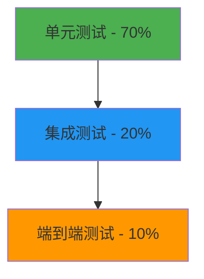

# 接口测试流程规范

## 📋 测试策略

### 测试金字塔



## 🧪 单元测试

### 测试覆盖要求
- **代码覆盖率**: ≥ 80%
- **分支覆盖率**: ≥ 75%
- **关键业务逻辑**: 100%

### 测试结构规范

```python
class TestProjectAPI:
    """项目API测试类"""

    @pytest.fixture
    def setup_data(self):
        """测试数据准备"""
        pass

    @pytest.fixture
    def auth_headers(self):
        """认证头准备"""
        pass

    # 1. 正常场景测试
    def test_create_project_success(self, setup_data, auth_headers):
        """测试成功创建项目"""

    # 2. 异常场景测试
    def test_create_project_validation_error(self, auth_headers):
        """测试参数验证失败"""

    # 3. 权限测试
    def test_create_project_unauthorized(self):
        """测试未授权访问"""

    # 4. 边界条件测试
    def test_create_project_edge_cases(self, auth_headers):
        """测试边界条件"""
```

### 测试用例类型

#### 1. **功能测试**
- ✅ 正常业务流程
- ✅ 数据验证
- ✅ 状态转换
- ✅ 权限控制

#### 2. **异常测试**
- ❌ 参数验证失败
- ❌ 权限不足
- ❌ 资源不存在
- ❌ 业务规则违反

#### 3. **性能测试**
- ⏱️ 响应时间
- 🔢 并发处理
- 📊 数据量处理

## 🔗 集成测试

### 测试目标
- **数据库交互**: CRUD操作正确性
- **API协作**: 模块间接口调用
- **认证授权**: 完整权限流程
- **事务处理**: 数据一致性

### 测试环境准备

```python
@pytest.fixture
def test_db():
    """测试数据库"""
    from backend.core.test_db import create_test_engine, TestingSessionLocal
    engine = create_test_engine()
    TestingSessionLocal.configure(bind=engine)
    yield engine
    engine.dispose()

@pytest.fixture
def test_client(test_db):
    """测试客户端"""
    from backend.main import app
    from backend.core.deps import get_db

    def override_get_db():
        try:
            db = TestingSessionLocal()
            yield db
        finally:
            db.close()

    app.dependency_overrides[get_db] = override_get_db
    with TestClient(app) as client:
        yield client
```

### 集成测试示例

```python
def test_project_lifecycle(test_client, auth_headers):
    """测试项目完整生命周期"""

    # 1. 创建项目
    project_data = {
        "name": "集成测试项目",
        "code": "INTEGRATION_TEST",
        "client_name": "测试客户"
    }

    create_response = test_client.post(
        "/api/v1/projects/",
        json=project_data,
        headers=auth_headers
    )
    assert create_response.status_code == 201
    project_id = create_response.json()["data"]["id"]

    # 2. 更新项目
    update_data = {"name": "更新后的项目"}
    update_response = test_client.put(
        f"/api/v1/projects/{project_id}",
        json=update_data,
        headers=auth_headers
    )
    assert update_response.status_code == 200

    # 3. 查询项目
    get_response = test_client.get(f"/api/v1/projects/{project_id}", headers=auth_headers)
    assert get_response.status_code == 200
    assert get_response.json()["data"]["name"] == "更新后的项目"

    # 4. 删除项目
    delete_response = test_client.delete(f"/api/v1/projects/{project_id}", headers=auth_headers)
    assert delete_response.status_code == 200

    # 5. 验证删除
    verify_response = test_client.get(f"/api/v1/projects/{project_id}", headers=auth_headers)
    assert verify_response.status_code == 404
```

## 🌐 端到端测试

### 测试场景
- **用户注册登录流程**
- **完整业务流程**
- **跨模块操作**
- **真实数据场景**

### 测试工具配置

```python
# conftest.py - 全局测试配置
import pytest
import asyncio
from fastapi.testclient import TestClient
from backend.main import app

@pytest.fixture(scope="session")
def event_loop():
    """事件循环"""
    loop = asyncio.get_event_loop_policy().new_event_loop()
    yield loop
    loop.close()

@pytest.fixture
def client():
    """测试客户端"""
    return TestClient(app)

@pytest.fixture
async def test_user():
    """测试用户"""
    from backend.models.user import User
    from backend.core.auth import create_access_token

    user = User(
        email="test@example.com",
        full_name="测试用户",
        role="admin"
    )
    token = create_access_token(data={"sub": user.id})
    return user, token
```

## 📊 性能测试

### 性能指标要求
- **响应时间**: P95 < 200ms
- **吞吐量**: > 100 QPS
- **并发用户**: 支持100并发
- **错误率**: < 0.1%

### 性能测试脚本

```python
import asyncio
import aiohttp
import time
from concurrent.futures import ThreadPoolExecutor

class LoadTester:
    """负载测试工具"""

    def __init__(self, base_url: str):
        self.base_url = base_url
        self.results = []

    async def single_request(self, session, method, endpoint, **kwargs):
        """单个请求"""
        start_time = time.time()
        try:
            url = f"{self.base_url}{endpoint}"
            async with session.request(method, url, **kwargs) as response:
                await response.text()
                end_time = time.time()
                return {
                    "status_code": response.status,
                    "response_time": end_time - start_time,
                    "success": response.status < 400
                }
        except Exception as e:
            end_time = time.time()
            return {
                "status_code": 0,
                "response_time": end_time - start_time,
                "success": False,
                "error": str(e)
            }

    async def load_test(self, concurrent_users: int, requests_per_user: int):
        """负载测试"""
        async with aiohttp.ClientSession() as session:
            tasks = []

            for user in range(concurrent_users):
                user_tasks = []

                for req in range(requests_per_user):
                    task = self.single_request(
                        session, "GET", "/api/v1/projects/",
                        headers={"Authorization": "Bearer test_token"}
                    )
                    user_tasks.append(task)

                tasks.append(asyncio.gather(*user_tasks))

            results = await asyncio.gather(*tasks)

            # 展平结果
            for user_results in results:
                self.results.extend(user_results)

    def analyze_results(self):
        """分析测试结果"""
        if not self.results:
            return {}

        response_times = [r["response_time"] for r in self.results]
        success_rate = sum(1 for r in self.results if r["success"]) / len(self.results)

        return {
            "total_requests": len(self.results),
            "success_rate": success_rate,
            "avg_response_time": sum(response_times) / len(response_times),
            "min_response_time": min(response_times),
            "max_response_time": max(response_times),
            "p95_response_time": sorted(response_times)[int(len(response_times) * 0.95)]
        }
```

## 🛡️ 安全测试

### 安全测试清单
- [ ] **认证安全**: JWT token验证
- [ ] **授权检查**: 角色权限测试
- [ ] **输入验证**: SQL注入防护
- [ ] **XSS防护**: 脚本注入防护
- [ ] **CSRF防护**: 跨站请求伪造防护
- [ ] **数据泄露**: 敏感信息暴露检查

### 安全测试示例

```python
def test_sql_injection_protection(client, auth_headers):
    """测试SQL注入防护"""
    malicious_inputs = [
        "'; DROP TABLE projects; --",
        "' OR '1'='1",
        "1' UNION SELECT * FROM users --"
    ]

    for payload in malicious_inputs:
        response = client.get(
            f"/api/v1/projects/?search={payload}",
            headers=auth_headers
        )

        # 应该返回400错误，而不是成功响应
        assert response.status_code == 400
        assert "验证失败" in response.json()["message"]

def test_xss_protection(client, auth_headers):
    """测试XSS防护"""
    xss_payloads = [
        "<script>alert('xss')</script>",
        "javascript:alert('xss')",
        ""
    ]

    for payload in xss_payloads:
        response = client.post(
            "/api/v1/projects/",
            json={"name": payload, "code": "TEST"},
            headers=auth_headers
        )

        # 应该被拒绝或数据被清理
        if response.status_code == 200:
            data = response.json()["data"]
            assert "<script>" not in data["name"]
            assert "javascript:" not in data["name"]
```

## 📈 测试报告

### 测试报告模板

```python
def generate_test_report(test_results: dict):
    """生成测试报告"""
    report = f"""
# API测试报告

## 测试概况
- 测试时间: {datetime.now().strftime('%Y-%m-%d %H:%M:%S')}
- 总测试数: {test_results['total_tests']}
- 通过率: {test_results['pass_rate']}%

## 测试结果详情

### 单元测试
- 总数: {test_results['unit']['total']}
- 通过: {test_results['unit']['passed']}
- 失败: {test_results['unit']['failed']}
- 覆盖率: {test_results['unit']['coverage']}%

### 集成测试
- 总数: {test_results['integration']['total']}
- 通过: {test_results['integration']['passed']}
- 失败: {test_results['integration']['failed']}

### 性能测试
- 平均响应时间: {test_results['performance']['avg_response']}ms
- P95响应时间: {test_results['performance']['p95_response']}ms
- 吞吐量: {test_results['performance']['throughput']} QPS

### 安全测试
- 通过的安全测试: {test_results['security']['passed']}
- 发现的安全问题: {test_results['security']['issues']}

## 问题列表
"""

    # 添加失败测试详情
    for failure in test_results.get('failures', []):
        report += f"""
### {failure['test_name']}
- 状态: ❌ 失败
- 错误: {failure['error']}
- 文件: {failure['file']}:{failure['line']}
"""

    return report
```

## 🔄 持续集成测试

### CI/CD配置

```yaml
# .github/workflows/api-tests.yml
name: API Tests

on:
  push:
    branches: [main, develop]
  pull_request:
    branches: [main]

jobs:
  test:
    runs-on: ubuntu-latest

    steps:
    - uses: actions/checkout@v3

    - name: Set up Python
      uses: actions/setup-python@v4
      with:
        python-version: '3.11'

    - name: Install dependencies
      run: |
        pip install -r requirements.txt
        pip install -r requirements-test.txt

    - name: Run linting
      run: |
        black --check backend/
        isort --check-only backend/
        flake8 backend/

    - name: Run type checking
      run: mypy backend/

    - name: Run unit tests
      run: pytest tests/unit/ -v --cov=backend

    - name: Run integration tests
      run: pytest tests/integration/ -v

    - name: Run API tests
      run: pytest tests/api/ -v

    - name: Upload coverage to Codecov
      uses: codecov/codecov-action@v3
      with:
        file: ./coverage.xml
```

## 📝 测试最佳实践

### 1. **测试命名规范**
```python
# ✅ 好的命名
def test_create_project_with_valid_data()
def test_create_project_with_duplicate_code()
def test_create_project_without_authentication()

# ❌ 避免的命名
def test_1()
def test_project()
def test_create()
```

### 2. **测试数据管理**
```python
# 使用Fixture管理测试数据
@pytest.fixture
def sample_project():
    return {
        "name": "测试项目",
        "code": "TEST001",
        "description": "测试描述"
    }

# 使用工厂模式
class ProjectFactory:
    @staticmethod
    def create(**kwargs):
        defaults = {
            "name": "测试项目",
            "code": "TEST001"
        }
        defaults.update(kwargs)
        return defaults
```

### 3. **断言最佳实践**
```python
# ✅ 具体的断言
assert response.status_code == 200
assert response.json()["data"]["name"] == "预期名称"
assert len(response.json()["data"]["items"]) == 10

# ❌ 模糊的断言
assert response.ok
assert response.json()["success"]
```

### 4. **测试隔离**
```python
@pytest.fixture(autouse=True)
def cleanup_database():
    """自动清理测试数据"""
    yield
    # 测试后清理
    pass

@pytest.fixture
def isolated_db():
    """独立的数据库连接"""
    # 为每个测试创建独立的事务
    pass
```

---

## 📋 测试检查清单

### 开发阶段
- [ ] 单元测试覆盖率 ≥ 80%
- [ ] 所有API端点都有测试
- [ ] 异常场景充分测试
- [ ] 权限控制测试完成

### 测试阶段
- [ ] 集成测试通过
- [ ] 性能测试满足要求
- [ ] 安全测试无重大问题
- [ ] 端到端测试覆盖核心流程

### 交付前
- [ ] 所有测试在CI环境通过
- [ ] 测试报告生成完成
- [ ] 性能基准建立
- [ ] 回归测试计划制定