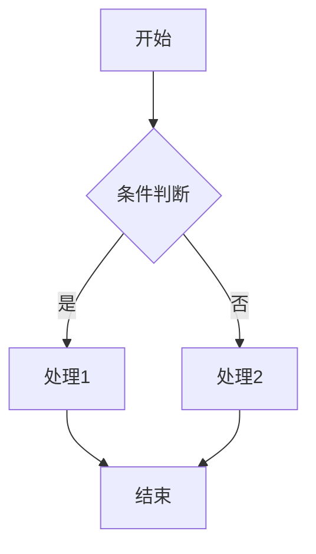

# 分阶段任务清单模板

> **使用说明**: 根据具体模块复制对应阶段模板，填充具体内容后执行
> **时间预估**: 每个任务后标注了预估时间，可根据复杂度调整
> **交付标准**: 每个阶段都有明确的检查清单，确保质量

---

## 📋 阶段一：需求与设计任务模板

### 模块信息
- **模块名称**: [填写模块名称，如：项目管理]
- **开发人员**: [填写负责人]
- **预估工期**: [2-3天]
- **开始日期**: [YYYY-MM-DD]
- **目标日期**: [YYYY-MM-DD]

### 1.1 业务需求分析 (0.5天)

#### 业务场景梳理
- [ ] 核心业务场景定义
  - [ ] 场景1：[具体描述]
  - [ ] 场景2：[具体描述]
  - [ ] 场景3：[具体描述]

- [ ] 参与角色识别
  - [ ] [角色名]：权限范围说明
  - [ ] [角色名]：权限范围说明
  - [ ] [角色名]：权限范围说明

- [ ] 数据流向定义
  - [ ] 输入数据：[描述]
  - [ ] 处理逻辑：[描述]
  - [ ] 输出结果：[描述]

- [ ] 业务规则清单
  - [ ] 规则1：[具体描述]
  - [ ] 规则2：[具体描述]
  - [ ] 规则3：[具体描述]

**交付物**: 业务流程图 (Mermaid格式)


### 1.2 API接口设计 (1天)

#### 端点清单设计
| 方法 | 路径 | 描述 | 权限要求 | 幂等性 | 状态码 |
|------|------|------|----------|--------|--------|
|      |      |      |          |        |        |
|      |      |      |          |        |        |
|      |      |      |          |        |        |

#### 请求Schema设计
```python
# [请求模型名称]
class [RequestModelName](BaseModel):
    model_config = ConfigDict(from_attributes=True)

    # 字段定义
    field1: type = Field(..., description="字段描述")
    field2: Optional[type] = Field(None, description="可选字段描述")

    # 验证器
    @field_validator('field1')
    def validate_field1(cls, v):
        # 验证逻辑
        return v
```

#### 响应Schema设计
```python
# [响应模型名称]
class [ResponseModelName](BaseModel):
    model_config = ConfigDict(from_attributes=True)

    # 字段定义
    id: int
    field1: type
    field2: type
    created_at: datetime
    updated_at: datetime
```

#### 分页Schema设计
```python
class [ModuleName]ListResponse(BaseModel):
    items: List[[ResponseModelName]]
    meta: PaginationMeta
```

#### 错误码设计
| 错误码 | HTTP状态码 | 描述 | 触发条件 |
|--------|------------|------|----------|
| SYS_001 | 400 | 请求参数错误 | 参数验证失败 |
| BIZ_001 | 403 | 权限不足 | 无操作权限 |
| BIZ_002 | 404 | 资源不存在 | ID不存在 |

### 1.3 数据模型设计 (0.5天)

#### 数据库表设计
```sql
CREATE TABLE [table_name] (
    id SERIAL PRIMARY KEY,
    field1 VARCHAR(100) NOT NULL,
    field2 TEXT,
    field3 DECIMAL(10,2),
    created_at TIMESTAMP DEFAULT CURRENT_TIMESTAMP,
    updated_at TIMESTAMP DEFAULT CURRENT_TIMESTAMP,
    created_by INTEGER REFERENCES users(id),

    -- 索引
    INDEX idx_[table_name]_field1 (field1),
    INDEX idx_[table_name]_created_by (created_by)
);
```

#### RLS策略设计
```sql
-- 启用RLS
ALTER TABLE [table_name] ENABLE ROW LEVEL SECURITY;

-- 策略1：管理员全权限
CREATE POLICY admin_full_access ON [table_name]
    FOR ALL TO admin_role
    USING (true)
    WITH CHECK (true);

-- 策略2：用户只能访问自己的数据
CREATE POLICY user_own_access ON [table_name]
    FOR ALL TO user_role
    USING (created_by = current_user_id())
    WITH CHECK (created_by = current_user_id());
```

#### 性能优化设计
- [ ] 索引策略：[描述索引设计思路]
- [ ] 分页策略：[描述分页实现方式]
- [ ] 缓存策略：[描述缓存使用场景]
- [ ] 查询优化：[描述复杂查询优化方案]

### 1.4 权限设计 (0.5天)

#### 权限矩阵
| 操作/资源 | admin | finance | data_op | acct_mgr | media_buyer |
|-----------|-------|---------|---------|----------|-------------|
| 列表查看  |       |         |         |          |             |
| 创建      |       |         |         |          |             |
| 查看      |       |         |         |          |             |
| 编辑      |       |         |         |          |             |
| 删除      |       |         |         |          |             |

#### 数据隔离策略
- [ ] 租户隔离：[描述隔离机制]
- [ ] 角色隔离：[描述权限控制]
- [ ] 字段级权限：[描述字段访问控制]

### 阶段一交付检查
- [ ] 业务流程图已完成
- [ ] API端点清单已定义
- [ ] Pydantic Schema设计完成
- [ ] 数据库表结构和RLS策略设计完成
- [ ] 权限矩阵已确认
- [ ] 设计文档已评审通过

---

## 💻 阶段二：代码实现任务模板

### 模块信息
- **模块名称**: [填写模块名称]
- **开发人员**: [填写负责人]
- **预估工期**: [3-5天]
- **开始日期**: [YYYY-MM-DD]
- **目标日期**: [YYYY-MM-DD]

### 2.1 环境准备 (0.5天)

#### 开发环境配置
- [ ] Python虚拟环境创建
- [ ] 依赖安装：`pip install -r requirements.txt`
- [ ] 环境变量配置文件：`.env`
- [ ] 数据库连接测试
- [ ] Redis连接测试（如需要）

#### 项目结构初始化
```
backend/
├── routers/
│   └── [module_name].py
├── services/
│   └── [module_name]_service.py
├── schemas/
│   └── [module_name].py
├── models/
│   └── [module_name].py
└── tests/
    ├── test_[module_name]_service.py
    ├── test_[module_name]_api.py
    └── test_[module_name]_permissions.py
```

### 2.2 Pydantic模型实现 (1天)

#### 请求模型实现
- [ ] [RequestModel1] 实现
- [ ] [RequestModel2] 实现
- [ ] [RequestModel3] 实现
- [ ] 自定义验证器实现
- [ ] 字段约束和验证规则

#### 响应模型实现
- [ ] [ResponseModel] 实现
- [ ] [ListResponseModel] 实现
- [ ] 分页模型集成
- [ ] 关联数据序列化

#### 模型测试
- [ ] Pydantic模型单元测试
- [ ] 验证器测试
- [ ] 序列化测试

### 2.3 Service层实现 (1.5天)

#### 数据访问层
- [ ] 基础CRUD操作实现
- [ ] 复杂查询方法实现
- [ ] 数据验证和业务规则检查
- [ ] 事务边界管理

#### 业务逻辑实现
- [ ] 核心业务方法1：[描述功能]
- [ ] 核心业务方法2：[描述功能]
- [ ] 核心业务方法3：[描述功能]
- [ ] 异常处理和错误码映射

#### 依赖注入配置
- [ ] Service依赖配置
- [ ] 数据库会话管理
- [ ] 外部服务集成（如需要）

### 2.4 路由层实现 (1天)

#### 路由定义
- [ ] GET /api/v1/[resource] - 列表接口
- [ ] POST /api/v1/[resource] - 创建接口
- [ ] GET /api/v1/[resource]/{id} - 详情接口
- [ ] PUT /api/v1/[resource]/{id} - 更新接口
- [ ] DELETE /api/v1/[resource]/{id} - 删除接口

#### 依赖注入配置
- [ ] JWT认证依赖
- [ ] 权限验证依赖
- [ ] 数据库会话依赖
- [ ] 请求验证依赖

#### 统一响应格式
- [ ] success_response使用
- [ ] error_response使用
- [ ] paginated_response使用
- [ ] HTTP状态码映射

### 2.5 异常处理和日志 (0.5天)

#### 全局异常处理
- [ ] 业务异常处理
- [ ] 权限异常处理
- [ ] 数据验证异常处理
- [ ] 数据库异常处理

#### 审计日志实现
- [ ] 操作日志记录
- [ ] 敏感操作审计
- [ ] 用户行为追踪
- [ ] 系统事件记录

### 阶段二交付检查
- [ ] 所有Pydantic模型已实现并通过测试
- [ ] Service层业务逻辑已完成
- [ ] 路由层已实现并包含权限控制
- [ ] 统一响应格式已正确应用
- [ ] 异常处理和审计日志已实现
- [ ] 代码格式化检查通过
- [ ] 静态类型检查通过

---

## 🧪 阶段三：测试验证任务模板

### 模块信息
- **模块名称**: [填写模块名称]
- **测试人员**: [填写负责人]
- **预估工期**: [2-3天]
- **开始日期**: [YYYY-MM-DD]
- **目标日期**: [YYYY-MM-DD]

### 3.1 单元测试 (1天)

#### Service层测试
- [ ] 测试类初始化：`Test[ModuleName]Service`
- [ ] 创建功能测试：`test_create_[resource]`
- [ ] 查询功能测试：`test_get_[resource]`
- [ ] 更新功能测试：`test_update_[resource]`
- [ ] 删除功能测试：`test_delete_[resource]`
- [ ] 业务规则测试：`test_[business_rule]`

#### Pydantic模型测试
- [ ] 请求模型验证测试
- [ ] 响应模型序列化测试
- [ ] 自定义验证器测试
- [ ] 边界条件测试

#### 测试覆盖率目标
- [ ] Service层覆盖率：≥80%
- [ ] 核心业务逻辑覆盖率：100%
- [ ] 分支覆盖率：≥75%

### 3.2 API集成测试 (1天)

#### 契约测试
- [ ] GET /api/v1/[resource] 列表接口测试
  - [ ] 正常响应测试
  - [ ] 分页功能测试
  - [ ] 过滤功能测试
  - [ ] 排序功能测试

- [ ] POST /api/v1/[resource] 创建接口测试
  - [ ] 正常创建测试
  - [ ] 参数验证测试
  - [ ] 重复数据测试
  - [ ] 权限检查测试

- [ ] GET /api/v1/[resource]/{id} 详情接口测试
  - [ ] 正常查询测试
  - [ ] 不存在ID测试
  - [ ] 权限检查测试

- [ ] PUT /api/v1/[resource]/{id} 更新接口测试
  - [ ] 正常更新测试
  - [ ] 部分更新测试
  - [ ] 验证失败测试
  - [ ] 权限检查测试

- [ ] DELETE /api/v1/[resource]/{id} 删除接口测试
  - [ ] 正常删除测试
  - [ ] 重复删除测试
  - [ ] 权限检查测试

#### 错误场景测试
- [ ] 400 Bad Request测试
- [ ] 401 Unauthorized测试
- [ ] 403 Forbidden测试
- [ ] 404 Not Found测试
- [ ] 500 Internal Server Error测试

### 3.3 权限测试 (0.5天)

#### 角色权限矩阵测试
```python
@pytest.mark.parametrize("role,expected_status", [
    ("admin", 201),
    ("finance", 403),
    ("data_operator", 403),
    ("account_manager", 403),
    ("media_buyer", 403)
])
async def test_create_[resource]_permissions(self, client, role, expected_status):
    # 测试实现
    pass
```

- [ ] 创建权限测试
- [ ] 查看权限测试
- [ ] 编辑权限测试
- [ ] 删除权限测试

#### 数据隔离测试
- [ ] 用户数据隔离测试
- [ ] 租户数据隔离测试
- [ ] 跨租户访问阻止测试
- [ ] RLS策略有效性测试

### 3.4 性能和安全测试 (0.5天)

#### 性能基线测试
- [ ] 列表接口响应时间：<300ms (P95)
- [ ] 详情接口响应时间：<100ms (P95)
- [ ] 创建接口响应时间：<200ms (P95)
- [ ] 并发测试：100并发用户

#### 安全测试
- [ ] SQL注入防护测试
- [ ] XSS防护测试
- [ ] CSRF防护测试
- [ ] 认证绕过测试
- [ ] 敏感数据泄露检查

### 3.5 覆盖率报告 (0.5天)

#### 覆盖率收集
```bash
pytest --cov=backend.routers.[module] \
        --cov=backend.services.[module]_service \
        --cov=backend.schemas.[module] \
        --cov-report=term-missing \
        --cov-report=html \
        --cov-fail-under=70
```

#### 质量门禁检查
- [ ] 代码覆盖率 ≥ 70%
- [ ] 核心功能覆盖率 = 100%
- [ ] 无安全漏洞（bandit扫描）
- [ ] 无依赖漏洞（pip-audit扫描）

### 阶段三交付检查
- [ ] 单元测试套件已完成
- [ ] API集成测试已通过
- [ ] 权限测试矩阵已验证
- [ ] 性能基线已达标
- [ ] 安全扫描已通过
- [ ] 覆盖率报告已生成
- [ ] 所有测试用例已通过

---

## 📚 阶段四：文档与交付任务模板

### 模块信息
- **模块名称**: [填写模块名称]
- **文档负责人**: [填写负责人]
- **预估工期**: [1-2天]
- **开始日期**: [YYYY-MM-DD]
- **目标日期**: [YYYY-MM-DD]

### 4.1 API文档完善 (0.5天)

#### OpenAPI文档增强
- [ ] 接口描述优化
- [ ] 参数说明完善
- [ ] 响应示例添加
- [ ] 错误码文档化
- [ ] 认证说明添加

#### 示例代码生成
```python
# cURL示例
curl_example = """
curl -X GET "http://localhost:8000/api/v1/[resource]" \
     -H "Authorization: Bearer YOUR_TOKEN"
"""

# JavaScript示例
js_example = """
const response = await fetch('/api/v1/[resource]', {
    method: 'GET',
    headers: {
        'Authorization': 'Bearer YOUR_TOKEN'
    }
});
const data = await response.json();
"""
```

### 4.2 使用指南编写 (0.5天)

#### README更新
- [ ] 模块功能概述
- [ ] 快速开始指南
- [ ] API使用示例
- [ ] 常见问题解答
- [ ] 故障排除指南

#### 最佳实践文档
- [ ] 错误处理最佳实践
- [ ] 性能优化建议
- [ ] 安全使用指南
- [ ] 权限管理说明

### 4.3 部署准备 (0.5天)

#### 健康检查配置
- [ ] /healthz 存活探针
- [ ] /readyz 就绪探针
- [ ] 自定义健康指标
- [ ] 监控指标暴露

#### Docker配置验证
- [ ] Dockerfile优化
- [ ] 多阶段构建
- [ ] 健康检查配置
- [ ] 环境变量文档

#### 部署脚本
- [ ] 数据库迁移脚本
- [ ] 配置文件模板
- [ ] 启动脚本优化
- [ ] 回滚脚本准备

### 4.4 最终质量检查 (0.5天)

#### 代码质量门禁
```bash
# 代码格式检查
black --check backend/
isort --check-only backend/

# 静态分析
flake8 backend/
mypy backend/

# 安全扫描
bandit -r backend/
semgrep --config=auto backend/
```

#### 文档一致性检查
- [ ] API文档与代码实现一致
- [ ] README示例可正常运行
- [ ] 错误码文档完整
- [ ] 版本号更新正确

#### 交付物清单
- [ ] 源代码（含测试）
- [ ] API文档
- [ ] 使用指南
- [ ] 部署配置
- [ ] 质量报告
- [ ] 发布说明

### 阶段四交付检查
- [ ] API文档已完善
- [ ] 使用指南已完成
- [ ] 部署配置已准备
- [ ] 质量门禁已通过
- [ ] 交付物清单已确认
- [ ] 发布说明已编写

---

## 📊 项目总体跟踪模板

### 项目概览
- **项目名称**: [AI广告代投系统 - [模块名称]]
- **项目经理**: [填写负责人]
- **技术负责人**: [填写负责人]
- **测试负责人**: [填写负责人]
- **开始日期**: [YYYY-MM-DD]
- **预计完成**: [YYYY-MM-DD]
- **实际完成**: [YYYY-MM-DD]

### 阶段进度统计

| 阶段 | 预估时间 | 实际时间 | 完成度 | 状态 |
|------|----------|----------|--------|------|
| 需求与设计 | 2-3天 | [X天] | [X%] | [进行中/已完成] |
| 代码实现 | 3-5天 | [X天] | [X%] | [进行中/已完成] |
| 测试验证 | 2-3天 | [X天] | [X%] | [进行中/已完成] |
| 文档与交付 | 1-2天 | [X天] | [X%] | [进行中/已完成] |

### 质量指标
- [ ] 代码覆盖率：[X%] (目标: ≥70%)
- [ ] 性能基线：[Xms] (目标: P95<300ms)
- [ ] 安全漏洞：[0个] (目标: 0个)
- [ ] 代码质量：[通过] (目标: 全部通过)

### 风险跟踪
- [ ] 风险1：[描述] - [状态]
- [ ] 风险2：[描述] - [状态]
- [ ] 风险3：[描述] - [状态]

### 经验总结
- [ ] 成功经验：[记录]
- [ ] 遇到问题：[记录]
- [ ] 改进建议：[记录]
- [ ] 最佳实践：[记录]

---

**使用说明**:
1. 复制对应阶段的模板到新文件
2. 填写方括号内的具体内容
3. 根据实际复杂度调整时间预估
4. 完成每个子任务后打勾确认
5. 阶段结束时使用交付检查清单验证

**模板版本**: v2.1
**创建时间**: 2025-11-12
**适用范围**: AI广告代投系统所有接口模块