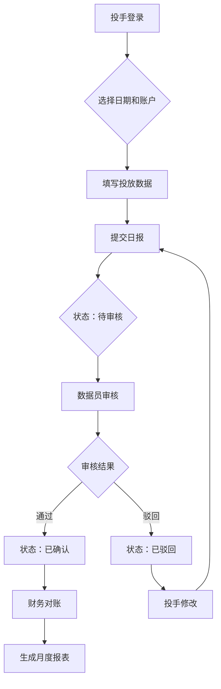

# 日报管理模块设计文档

> **模块名称**: 日报管理 (Daily Report)
> **设计版本**: v1.0
> **设计日期**: 2025-11-12
> **设计人员**: Claude协作开发

---

## 📋 阶段一：需求与设计

### 1.1 业务需求分析 (0.5天)

#### 业务场景梳理
- **核心业务场景**: 投手每日提交广告投放数据，数据员审核确认，财务基于数据进行对账
- **数据流向**: 投手录入 → 数据员审核 → 财务对账 → 管理员查看统计
- **时效性要求**: 日报按天提交，历史数据可追溯

#### 参与角色及权限
| 角色 | 权限范围 | 说明 |
|------|----------|------|
| **media_buyer** | 创建、编辑自己的日报；查看自己的历史数据 | 只能操作自己负责的账户 |
| **data_operator** | 审核、查看所有日报；批量导入；数据统计 | 负责数据审核和质量控制 |
| **admin** | 全部权限；系统配置；数据导出 | 系统管理员 |
| **finance** | 查看日报；导出对账数据；财务统计 | 用于财务对账 |
| **account_manager** | 查看所管项目的日报；项目级统计 | 查看下属投手数据 |

#### 数据流向和业务规则


#### 业务规则清单
1. **提交规则**: 每个账户每天只能有一条日报
2. **审核规则**: 数据员可以审核所有投手的日报
3. **修改规则**: 已确认的日报不能修改，需要管理员操作
4. **权限规则**: 投手只能看到自己负责的账户
5. **时效规则**: 日报应在当天24点前提交

### 1.2 API接口设计 (1天)

#### 端点清单设计
| 方法 | 路径 | 描述 | 权限要求 | 幂等性 | 状态码 |
|------|------|------|----------|--------|--------|
| GET | /api/v1/daily-reports | 获取日报列表 | 所有角色 | 是 | 200 |
| POST | /api/v1/daily-reports | 创建日报 | media_buyer, admin | 否 | 201 |
| GET | /api/v1/daily-reports/{id} | 获取日报详情 | 相关角色 | 是 | 200 |
| PUT | /api/v1/daily-reports/{id} | 更新日报 | media_buyer, admin | 否 | 200 |
| DELETE | /api/v1/daily-reports/{id} | 删除日报 | admin | 是 | 204 |
| POST | /api/v1/daily-reports/{id}/approve | 审核通过日报 | data_operator, admin | 否 | 200 |
| POST | /api/v1/daily-reports/{id}/reject | 驳回日报 | data_operator, admin | 否 | 200 |
| POST | /api/v1/daily-reports/batch-import | 批量导入日报 | data_operator, admin | 否 | 201 |
| GET | /api/v1/daily-reports/export | 导出日报 | finance, admin | 是 | 200 |
| GET | /api/v1/daily-reports/statistics | 获取统计数据 | data_operator, admin, account_manager | 是 | 200 |

#### 请求Schema设计

```python
# 日报创建请求
class DailyReportCreateRequest(BaseModel):
    model_config = ConfigDict(from_attributes=True)

    report_date: date = Field(..., description="报表日期")
    ad_account_id: int = Field(..., gt=0, description="广告账户ID")
    campaign_name: Optional[str] = Field(None, max_length=200, description="广告系列名称")
    ad_group_name: Optional[str] = Field(None, max_length=200, description="广告组名称")
    ad_creative_name: Optional[str] = Field(None, max_length=200, description="广告创意名称")
    impressions: int = Field(0, ge=0, description="展示次数")
    clicks: int = Field(0, ge=0, description="点击次数")
    spend: Decimal = Field(0, ge=0, decimal_places=2, description="消耗金额")
    conversions: int = Field(0, ge=0, description="转化次数")
    new_follows: int = Field(0, ge=0, description="新增粉丝数")
    cpa: Optional[Decimal] = Field(None, ge=0, decimal_places=2, description="CPA")
    roas: Optional[Decimal] = Field(None, ge=0, decimal_places=2, description="ROAS")
    notes: Optional[str] = Field(None, max_length=1000, description="备注说明")

    @field_validator('report_date')
    def validate_report_date(cls, v):
        if v > date.today():
            raise ValueError('报表日期不能是未来日期')
        if v < date.today() - timedelta(days=30):
            raise ValueError('报表日期不能超过30天前')
        return v

    @field_validator('clicks')
    def validate_clicks_vs_impressions(cls, v, info):
        if 'impressions' in info.data and v > info.data['impressions']:
            raise ValueError('点击次数不能大于展示次数')
        return v

# 日报更新请求
class DailyReportUpdateRequest(BaseModel):
    model_config = ConfigDict(from_attributes=True)

    campaign_name: Optional[str] = Field(None, max_length=200)
    ad_group_name: Optional[str] = Field(None, max_length=200)
    ad_creative_name: Optional[str] = Field(None, max_length=200)
    impressions: Optional[int] = Field(None, ge=0)
    clicks: Optional[int] = Field(None, ge=0)
    spend: Optional[Decimal] = Field(None, ge=0, decimal_places=2)
    conversions: Optional[int] = Field(None, ge=0)
    new_follows: Optional[int] = Field(None, ge=0)
    cpa: Optional[Decimal] = Field(None, ge=0, decimal_places=2)
    roas: Optional[Decimal] = Field(None, ge=0, decimal_places=2)
    notes: Optional[str] = Field(None, max_length=1000)

# 审核请求
class DailyReportAuditRequest(BaseModel):
    model_config = ConfigDict(from_attributes=True)

    audit_notes: Optional[str] = Field(None, max_length=500, description="审核说明")

# 批量导入请求
class DailyReportBatchImportRequest(BaseModel):
    model_config = ConfigDict(from_attributes=True)

    reports: List[DailyReportCreateRequest] = Field(..., max_items=100, description="日报列表")
    skip_errors: bool = Field(False, description="是否跳过错误继续导入")

# 查询参数
class DailyReportQueryParams(BaseModel):
    model_config = ConfigDict(from_attributes=True)

    report_date_start: Optional[date] = Field(None, description="开始日期")
    report_date_end: Optional[date] = Field(None, description="结束日期")
    ad_account_id: Optional[int] = Field(None, gt=0, description="广告账户ID")
    status: Optional[str] = Field(None, pattern="^(pending|approved|rejected)$", description="审核状态")
    media_buyer_id: Optional[int] = Field(None, gt=0, description="投手ID")
    project_id: Optional[int] = Field(None, gt=0, description="项目ID")
```

#### 响应Schema设计

```python
# 日报响应
class DailyReportResponse(BaseModel):
    model_config = ConfigDict(from_attributes=True)

    id: int
    report_date: date
    ad_account_id: int
    ad_account_name: str
    ad_account_number: str
    campaign_name: Optional[str]
    ad_group_name: Optional[str]
    ad_creative_name: Optional[str]
    impressions: int
    clicks: int
    spend: Decimal
    conversions: int
    new_follows: int
    cpa: Optional[Decimal]
    roas: Optional[Decimal]
    status: str  # pending, approved, rejected
    notes: Optional[str]
    audit_notes: Optional[str]
    audit_user_id: Optional[int]
    audit_user_name: Optional[str]
    audit_time: Optional[datetime]
    created_by: int
    created_by_name: str
    created_at: datetime
    updated_at: datetime

# 列表响应
class DailyReportListResponse(BaseModel):
    items: List[DailyReportResponse]
    meta: PaginationMeta

# 统计响应
class DailyReportStatisticsResponse(BaseModel):
    model_config = ConfigDict(from_attributes=True)

    date_range: DateRange
    total_reports: int
    approved_reports: int
    rejected_reports: int
    pending_reports: int
    total_spend: Decimal
    total_impressions: int
    total_clicks: int
    total_conversions: int
    total_new_follows: int
    avg_cpa: Optional[Decimal]
    avg_roas: Optional[Decimal]
    ctr: Decimal  # Click-through rate
    conversion_rate: Decimal

    @computed_field
    @property
    def ctr(self) -> Decimal:
        if self.total_impressions == 0:
            return Decimal('0')
        return Decimal(self.total_clicks) / Decimal(self.total_impressions) * 100

    @computed_field
    @property
    def conversion_rate(self) -> Decimal:
        if self.total_clicks == 0:
            return Decimal('0')
        return Decimal(self.total_conversions) / Decimal(self.total_clicks) * 100

# 导出响应
class DailyReportExportResponse(BaseModel):
    model_config = ConfigDict(from_attributes=True)

    file_name: str
    file_size: int
    download_url: str
    export_time: datetime
```

#### 错误码设计

| 错误码 | HTTP状态码 | 描述 | 触发条件 |
|--------|------------|------|----------|
| SYS_001 | 400 | 请求参数错误 | 参数验证失败 |
| SYS_002 | 401 | 未授权访问 | JWT token无效或过期 |
| SYS_003 | 403 | 权限不足 | 角色权限不足 |
| SYS_004 | 404 | 资源不存在 | ID不存在 |
| SYS_005 | 409 | 资源冲突 | 重复创建日报 |
| SYS_006 | 422 | 语义错误 | 业务逻辑错误 |
| SYS_500 | 500 | 服务器内部错误 | 数据库错误、系统异常 |
| | | | |
| BIZ_001 | 409 | 日报已存在 | 同一账户同一天已有日报 |
| BIZ_002 | 403 | 日报状态不允许修改 | 已审核的日报不能修改 |
| BIZ_003 | 400 | 日期范围错误 | 开始日期大于结束日期 |
| BIZ_004 | 422 | 数据验证失败 | 点击数大于展示数等 |
| BIZ_005 | 403 | 超出导入限制 | 批量导入数量超过100条 |
| BIZ_006 | 400 | 文件格式错误 | 导入文件格式不正确 |
| BIZ_007 | 403 | 无权查看该日报 | 投手查看他人日报 |
| | | | |
| SEC_001 | 403 | SQL注入尝试 | 检测到SQL注入 |
| SEC_002 | 403 | 数据泄露风险 | 尝试访问非授权数据 |

### 1.3 数据模型设计 (0.5天)

#### 数据库表设计

```sql
-- 日报主表
CREATE TABLE daily_reports (
    id SERIAL PRIMARY KEY,
    report_date DATE NOT NULL,
    ad_account_id INTEGER NOT NULL REFERENCES ad_accounts(id),
    campaign_name VARCHAR(200),
    ad_group_name VARCHAR(200),
    ad_creative_name VARCHAR(200),
    impressions INTEGER DEFAULT 0,
    clicks INTEGER DEFAULT 0,
    spend DECIMAL(12,2) DEFAULT 0.00,
    conversions INTEGER DEFAULT 0,
    new_follows INTEGER DEFAULT 0,
    cpa DECIMAL(10,2),
    roas DECIMAL(10,2),
    status VARCHAR(20) DEFAULT 'pending' CHECK (status IN ('pending', 'approved', 'rejected')),
    notes TEXT,
    audit_notes TEXT,
    audit_user_id INTEGER REFERENCES users(id),
    audit_time TIMESTAMP,
    created_by INTEGER NOT NULL REFERENCES users(id),
    created_at TIMESTAMP DEFAULT CURRENT_TIMESTAMP,
    updated_at TIMESTAMP DEFAULT CURRENT_TIMESTAMP,

    -- 唯一约束
    UNIQUE(report_date, ad_account_id),

    -- 索引
    INDEX idx_daily_reports_date (report_date),
    INDEX idx_daily_reports_account (ad_account_id),
    INDEX idx_daily_reports_status (status),
    INDEX idx_daily_reports_created_by (created_by),
    INDEX idx_daily_reports_audit_user (audit_user_id),
    INDEX idx_daily_reports_project (project_id)
);

-- 日报审核日志表
CREATE TABLE daily_report_audit_logs (
    id SERIAL PRIMARY KEY,
    daily_report_id INTEGER NOT NULL REFERENCES daily_reports(id),
    action VARCHAR(20) NOT NULL CHECK (action IN ('created', 'updated', 'approved', 'rejected')),
    old_status VARCHAR(20),
    new_status VARCHAR(20),
    audit_user_id INTEGER NOT NULL REFERENCES users(id),
    audit_time TIMESTAMP DEFAULT CURRENT_TIMESTAMP,
    audit_notes TEXT,
    ip_address INET,
    user_agent TEXT,

    -- 索引
    INDEX idx_audit_logs_report (daily_report_id),
    INDEX idx_audit_logs_user (audit_user_id),
    INDEX idx_audit_logs_time (audit_time)
);
```

#### RLS策略设计

```sql
-- 启用RLS
ALTER TABLE daily_reports ENABLE ROW LEVEL SECURITY;
ALTER TABLE daily_report_audit_logs ENABLE ROW LEVEL SECURITY;

-- 策略1：管理员全权限
CREATE POLICY admin_full_access_daily_reports ON daily_reports
    FOR ALL TO admin_role
    USING (true)
    WITH CHECK (true);

-- 策略2：数据员可读写所有日报
CREATE POLICY data_operator_full_access_daily_reports ON daily_reports
    FOR ALL TO data_operator_role
    USING (true)
    WITH CHECK (true);

-- 策略3：财务只读所有日报
CREATE POLICY finance_read_only_daily_reports ON daily_reports
    FOR SELECT TO finance_role
    USING (true);

-- 策略4：账户管理员查看项目内日报
CREATE POLICY account_manager_project_reports ON daily_reports
    FOR SELECT TO account_manager_role
    USING (
        ad_account_id IN (
            SELECT id FROM ad_accounts
            WHERE project_id IN (
                SELECT project_id FROM user_project_assignments
                WHERE user_id = current_user_id()
            )
        )
    );

-- 策略5：投手只能操作自己的日报
CREATE POLICY media_buyer_own_reports ON daily_reports
    FOR ALL TO media_buyer_role
    USING (created_by = current_user_id())
    WITH CHECK (created_by = current_user_id());

-- 审核日志策略
CREATE POLICY audit_log_access ON daily_report_audit_logs
    FOR ALL TO admin_role, data_operator_role
    USING (true)
    WITH CHECK (true);
```

#### 性能优化设计

- **索引策略**:
  - 复合索引：(report_date, ad_account_id, status)
  - 时间索引：report_date支持快速范围查询
  - 状态索引：status支持按状态筛选

- **分区策略**:
  - 按月分区：每月一个分区，提高查询性能
  ```sql
  CREATE TABLE daily_reports_y2024m01 PARTITION OF daily_reports
  FOR VALUES FROM ('2024-01-01') TO ('2024-02-01');
  ```

- **缓存策略**:
  - Redis缓存：当日统计数据
  - 查询缓存：频繁查询的报表数据
  - 计算结果缓存：CTR、CPA等计算指标

### 1.4 权限设计 (0.5天)

#### 权限矩阵

| 操作/资源 | admin | finance | data_op | acct_mgr | media_buyer |
|-----------|-------|---------|---------|----------|-------------|
| 查看日报列表 | ✓ | ✓ | ✓ | ✓(项目内) | ✓(自己的) |
| 创建日报 | ✓ | ✗ | ✓ | ✗ | ✓ |
| 编辑日报 | ✓ | ✗ | ✓ | ✗ | ✓(未审核的) |
| 删除日报 | ✓ | ✗ | ✓ | ✗ | ✗ |
| 审核日报 | ✓ | ✗ | ✓ | ✗ | ✗ |
| 批量导入 | ✓ | ✗ | ✓ | ✗ | ✗ |
| 导出数据 | ✓ | ✓ | ✓ | ✓(项目内) | ✓(自己的) |
| 查看统计 | ✓ | ✓ | ✓ | ✓(项目内) | ✓(自己的) |

#### 数据隔离策略

- **租户隔离**：基于项目的数据隔离
- **角色隔离**：不同角色看到不同范围的数据
- **个人隔离**：投手只能操作自己创建的日报
- **时间隔离**：只能操作特定时间范围内的数据

---

## ✅ 阶段一交付检查

- [x] 业务流程图已完成
- [x] API端点清单已定义（11个端点）
- [x] Pydantic Schema设计完成（请求/响应/统计）
- [x] 错误码映射已定义（SYS/BIZ/SEC三类）
- [x] 数据库表结构和RLS策略设计完成
- [x] 权限矩阵已确认
- [x] 性能优化方案已制定

---

**设计文档版本**: v1.0
**下一步**: 进入阶段二 - 代码实现
**预估工作量**: 3-5天
**风险提示**: 批量导入功能需要考虑大数据量处理