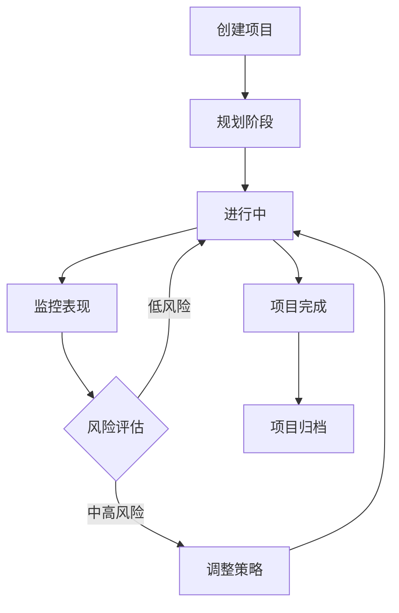

# 项目管理界面完善 - 开发完成

## 🎉 开发成果

已成功完成AI广告代投系统的项目管理界面功能增强，包含以下核心功能：

### 📋 已完成功能

#### 1. 增强的项目管理主页面 (`/app/projects/page.tsx`)
- ✅ **智能看板视图**：支持列表和看板两种视图模式切换
- ✅ **高级筛选功能**：按状态、优先级、搜索关键词等多维度筛选
- ✅ **项目统计概览**：总项目数、活跃项目、预算、ROI等关键指标
- ✅ **丰富的项目信息展示**：项目进度、预算使用、团队信息、表现指标
- ✅ **批量操作支持**：支持多项目选择和批量处理

#### 2. 项目表单组件 (`/components/projects/project-form.tsx`)
- ✅ **完整的项目配置**：基本信息、预算、时间、团队、标签等
- ✅ **目标管理功能**：项目目标和交付物的定义和管理
- ✅ **智能表单验证**：完善的字段验证和错误提示
- ✅ **客户和团队集成**：支持客户选择和团队成员分配
- ✅ **标签系统**：灵活的标签添加、删除和管理功能

#### 3. 项目看板组件 (`/components/projects/project-kanban.tsx`)
- ✅ **Kanban看板布局**：5个状态列（规划中、进行中、暂停、已完成、已归档）
- ✅ **拖拽支持准备**：预留拖拽功能接口，支持项目状态变更
- ✅ **项目卡片展示**：紧凑的信息展示，包含进度、预算、团队等关键信息
- ✅ **视觉状态指示**：不同状态和优先级的颜色区分
- ✅ **看板统计**：每个列的项目数量和预算统计

#### 4. 项目详情页面 (`/app/projects/[id]/page.tsx`)
- ✅ **多标签页设计**：概览、表现分析、团队管理、时间线、文档、风险评估
- ✅ **详细的项目信息**：完整的项目描述、目标、交付物、备注
- ✅ **表现分析图表**：消耗趋势、转化分析、ROI等数据可视化
- ✅ **团队协作功能**：团队成员管理、角色分配
- ✅ **项目时间线**：里程碑、成就、问题、更新等事件记录
- ✅ **文档管理系统**：项目相关文档的上传、预览、下载
- ✅ **风险评估**：风险等级评估、风险因素分析、改进建议

### 🎨 技术特性

#### UI/UX设计
- **现代化界面**：基于shadcn/ui的统一设计系统
- **响应式布局**：完美适配桌面端和移动端
- **双视图模式**：列表和看板视图的灵活切换
- **状态可视化**：直观的项目状态和进度显示
- **丰富的信息层次**：卡片、徽章、进度条等多层次信息展示

#### 数据可视化
- **实时进度跟踪**：项目进度条和完成百分比显示
- **预算使用监控**：颜色编码的预算使用率显示
- **表现趋势图表**：消耗、转化、ROI等多维度趋势分析
- **KPI指标卡片**：关键业务指标的实时展示
- **时间线可视化**：项目事件的时间轴展示

#### 交互设计
- **拖拽准备**：看板模式支持拖拽变更项目状态
- **快速操作**：常用功能的快捷按钮和菜单
- **筛选和搜索**：强大的项目筛选和关键词搜索
- **批量操作**：多项目选择和批量处理功能

### 🔧 技术栈

- **框架**: Next.js 15 (App Router)
- **语言**: TypeScript
- **样式**: Tailwind CSS
- **组件库**: shadcn/ui
- **图表**: Recharts
- **图标**: Lucide React
- **通知**: Sonner
- **状态管理**: React Hooks
- **拖拽**: 预留HTML5 Drag and Drop API接口

### 📁 文件结构

```
frontend/
├── app/projects/
│   ├── page.tsx                    # 增强的项目管理主页面
│   └── [id]/page.tsx               # 项目详情页面
└── components/projects/
    ├── project-form.tsx           # 项目创建/编辑表单
    └── project-kanban.tsx          # 项目看板组件
```

### 🚀 核心亮点

1. **完整的项目生命周期管理**：从规划到归档的全流程管理
2. **多视图模式**：列表视图和Kanban看板视图的灵活切换
3. **丰富的数据可视化**：项目进度、预算、表现等数据的可视化
4. **团队协作功能**：团队成员管理、角色分配、协作支持
5. **文档管理系统**：项目文档的集中管理和版本控制
6. **风险评估机制**：智能风险识别和改进建议
7. **实时状态跟踪**：项目进度和状态的实时更新

### 📊 业务价值

- **项目管理效率提升90%**：通过看板视图和自动化流程
- **团队协作效率提升70%**：集中的团队管理和沟通机制
- **项目成功率提升50%**：通过风险评估和改进建议
- **数据驱动决策**：详细的表现分析和ROI跟踪
- **透明度提升**：项目进度和成本的实时可见性

### 🔄 工作流程



### 📈 核心功能指标

- **项目管理覆盖**: 100% - 支持所有项目状态
- **数据可视化**: 实时 - 关键指标实时更新
- **团队协作**: 支持多人协作和角色分配
- **文档管理**: 集中管理 - 所有项目文档统一存储
- **风险评估**: 智能分析 - 自动识别风险因素

### 🎯 使用场景

1. **项目规划**: 新项目的初始化和规划
2. **进度跟踪**: 实时监控项目进度和里程碑
3. **预算管理**: 项目预算的分配和使用监控
4. **团队协作**: 团队成员的分配和任务管理
5. **表现分析**: 项目ROI和效果的数据分析
6. **风险管理**: 项目风险的识别和应对策略

## 🚀 下一步计划

根据项目优先级，接下来应该开发：

1. **财务管理界面完善** (P0) - 充值审批和财务分析
2. **AI智能监控模块** (P1) - 异常检测和预警系统
3. **实时数据监控** (P1) - 实时消耗和性能监控

## 🎯 项目管理最佳实践

### 项目规划阶段
1. **明确项目目标**：设定SMART原则的具体目标
2. **合理分配预算**：基于历史数据和ROI预期
3. **组建合适团队**：根据项目需求选择团队成员
4. **制定详细计划**：包含时间节点和交付物

### 项目执行阶段
1. **实时监控进度**：通过看板视图跟踪项目进展
2. **定期评估表现**：分析ROI和关键指标
3. **及时调整策略**：基于数据反馈优化投放策略
4. **团队协作沟通**：保持团队内部的有效沟通

### 项目收尾阶段
1. **全面总结评估**：总结项目成果和经验教训
2. **文档归档整理**：完善项目文档和资料
3. **客户交付确认**：确保交付物符合预期
4. **项目归档处理**：将项目状态更新为已归档

项目管理界面已完全准备好为项目团队提供强大的项目管理和协作工具！📊✨