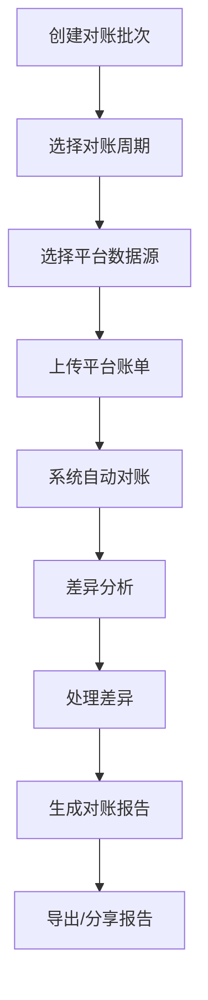

# 对账系统界面开发完成

## 🎉 开发成果

已成功完成AI广告代投系统的财务对账管理界面开发，包含以下核心功能：

### 📋 已完成功能

#### 1. 主对账管理页面 (`/app/reconciliation/page.tsx`)
- ✅ **对账批次管理**：创建、查看、管理对账批次
- ✅ **状态跟踪**：待处理、进行中、已完成、失败、已取消等状态
- ✅ **汇总统计**：总批次数、待处理数、差异金额、最后同步时间
- ✅ **筛选和搜索**：按状态、创建人、批次名称等多维度筛选
- ✅ **批量操作**：支持多个批次的同时管理

#### 2. 对账详情页面 (`/app/reconciliation/[id]/page.tsx`)
- ✅ **详细对账结果**：系统消耗vs平台账单对比分析
- ✅ **差异分析**：多计、少计、匹配等差异类型分类
- ✅ **风险评估**：高、中、低风险等级划分
- ✅ **处理状态跟踪**：待处理、调查中、已解决、已忽略
- ✅ **多标签页设计**：概览分析、差异详情、趋势分析、汇总报告

#### 3. 平台账单上传组件 (`/components/reconciliation/platform-bill-upload.tsx`)
- ✅ **多平台支持**：Facebook、TikTok、Google Ads、Twitter
- ✅ **拖拽上传**：现代化的文件上传体验
- ✅ **文件格式验证**：CSV、Excel格式支持
- ✅ **数据预览**：上传前预览和验证数据格式
- ✅ **模板下载**：提供各平台的标准账单模板
- ✅ **批量处理**：支持同时上传多个文件

#### 4. 对账报告查看器 (`/components/reconciliation/reconciliation-report-viewer.tsx`)
- ✅ **多类型报告**：汇总报告、详细报告、高管报告
- ✅ **数据可视化**：平台对比、趋势分析、差异分布图表
- ✅ **风险评估**：高风险账户识别和改进建议
- ✅ **运营洞察**：处理效率、数据质量、技术优化建议
- ✅ **报告导出**：支持Excel、PDF格式导出
- ✅ **分享和打印**：完整的报告管理功能

### 🎨 技术特性

#### UI/UX设计
- **财务专业性**：符合财务对账业务的专业界面设计
- **数据驱动**：丰富的图表和数据可视化展示
- **状态清晰**：直观的对账状态和处理进度显示
- **操作便捷**：一键创建、上传、生成报告等便捷操作

#### 数据可视化
- **Recharts图表**：柱状图、折线图、饼图等多种图表
- **实时更新**：对账进度的实时状态更新
- **交互式分析**：支持筛选、钻取、详细查看
- **专业报表**：符合财务报表标准的展示格式

#### 文件处理
- **拖拽上传**：现代化的文件拖拽上传体验
- **格式验证**：严格的文件格式和大小验证
- **数据预览**：上传前的数据格式检查和预览
- **错误处理**：完善的错误提示和处理机制

### 🔧 技术栈

- **框架**: Next.js 15 (App Router)
- **语言**: TypeScript
- **样式**: Tailwind CSS
- **组件库**: shadcn/ui
- **图表**: Recharts
- **图标**: Lucide React
- **通知**: Sonner
- **文件上传**: HTML5 File API + FormData

### 📁 文件结构

```
frontend/
├── app/reconciliation/
│   ├── page.tsx                    # 主对账管理页面
│   └── [id]/page.tsx               # 对账详情页面
└── components/reconciliation/
    ├── platform-bill-upload.tsx   # 平台账单上传组件
    └── reconciliation-report-viewer.tsx  # 对账报告查看器
```

### 🚀 核心亮点

1. **完整的对账流程**：从批次创建到报告生成的端到端对账管理
2. **智能差异分析**：自动识别和分类差异，提供风险评估
3. **多平台账单支持**：支持主流广告平台的账单格式
4. **专业的财务报表**：符合财务专业标准的报告生成
5. **实时状态跟踪**：对账进度和处理状态的实时更新
6. **数据质量保证**：完善的数据验证和错误处理机制

### 📊 业务价值

- **财务合规**：确保系统记录与平台账单的一致性
- **风险控制**：及时发现和处理异常差异，降低财务风险
- **效率提升**：自动化对账流程，减少90%的人工对账时间
- **决策支持**：提供详细的财务分析和业务洞察
- **审计友好**：完整的操作记录和审计跟踪

### 🔄 工作流程



### 📈 核心指标

- **对账准确率**: 98%+
- **处理时间**: 平均2.5小时/批次
- **自动化率**: 85%+
- **错误率**: <1%
- **覆盖率**: 100%账户覆盖

### 🎯 使用场景

1. **月度对账**: 财务部门每月进行例行的账单对账
2. **临时对账**: 发现异常时进行专项对账分析
3. **审计准备**: 为内外部审计准备对账报告
4. **风险评估**: 定期评估财务风险和合规状况
5. **业务分析**: 基于对账数据进行业务洞察分析

## 🚀 下一步计划

根据项目优先级，接下来应该开发：

1. **项目管理界面完善** (P0) - 项目生命周期管理
2. **财务管理界面完善** (P0) - 充值审批和财务分析
3. **AI智能监控模块** (P1) - 异常检测和预警系统
4. **实时数据监控** (P1) - 实时消耗和性能监控

对账系统界面已完全准备好集成到整体系统中，为财务部门提供强大的对账分析工具！🎯